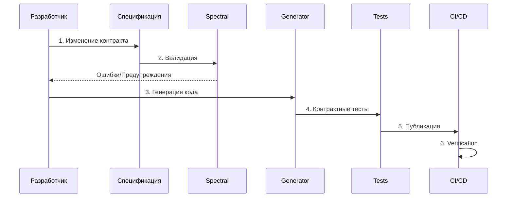

# ADR-001: Стратегия API-контрактов для GoldPC

## Статус
Принято

## Контекст
Для разработки веб-приложения компьютерного магазина GoldPC с сервисным центром необходимо определить стратегию управления API-контрактами. Система включает несколько модулей:
- Каталог товаров
- Конструктор ПК
- Заказы и корзина
- Сервисный центр
- Гарантийное обслуживание
- Администрирование

### Проблема
При параллельной разработке фронтенда и бэкенда возникают следующие риски:
1. Несоответствие ожиданий между командами
2. Поломка интеграций при изменении API
3. Дублирование документации и её устаревание
4. Сложность тестирования взаимодействий

## Решение

Принята стратегия **Contract-First Development** с использованием спецификаций:

### 1. OpenAPI 3.0.3 для REST API

**Структура:**
```
contracts/openapi/v1/
├── openapi.yaml              # Главный файл спецификации
└── components/
    ├── schemas/              # Схемы данных
    │   ├── common.yaml       # Общие типы, enums, pagination
    │   ├── user.yaml         # Пользователи, авторизация
    │   ├── product.yaml      # Товары, категории, отзывы
    │   ├── order.yaml        # Заказы, корзина
    │   ├── service.yaml      # Услуги сервисного центра
    │   ├── warranty.yaml     # Гарантийные талоны
    │   └── pcbuilder.yaml    # Конструктор ПК
    ├── parameters/           # Переиспользуемые параметры
    └── responses/            # Стандартные ответы
```

**Преимущества:**
- Единый источник истины для API
- Автоматическая генерация документации (Swagger UI)
- Генерация клиентского кода (OpenAPI Generator)
- Валидация запросов/ответов

### 2. AsyncAPI 2.6.0 для событийного взаимодействия

**Используется для:**
- WebSocket уведомлений пользователям
- События заказов (создание, изменение статуса)
- События услуг сервисного центра
- События гарантии (создание, истечение, аннулирование)
- События склада (низкий остаток)

**Структура:**
```
contracts/asyncapi/v1/
└── asyncapi.yaml            # Спецификация событий
```

### 3. Pact для Consumer-Driven Contracts

**Используется для:**
- Контрактного тестирования между сервисами
- Проверки совместимости Frontend ↔ Backend

**Структура:**
```
contracts/pacts/
├── frontend-catalog.json    # Frontend → Catalog API
├── frontend-orders.json     # Frontend → Orders API
└── frontend-services.json   # Frontend → Services API
```

### 4. Spectral для линтинга API

**Файл:** `contracts/.spectral.yaml`

**Правила:**
- Соглашения по именованию (kebab-case для путей)
- Обязательные поля (contact, description, version)
- Структура ответов (Error schema, pagination meta)
- Форматы данных (UUID для ID, ISO 8601 для дат)

## Процесс работы с контрактами

### Workflow



### Этапы:

1. **Изменение контракта**
   - Создание ветки `feature/api-update`
   - Редактирование YAML спецификации
   - Локальная валидация через `spectral lint`

2. **Code Review контракта**
   - Pull Request с изменениями спецификации
   - Ревью API-дизайна
   - Проверка на breaking changes

3. **Генерация кода**
   ```bash
   openapi-generator-cli generate -i openapi.yaml -g typescript-axios -o ./client
   ```

4. **Контрактное тестирование**
   - Pact tests на consumer side
   - Provider verification tests

5. **Публикация в CI/CD**
   - Публикация в Pact Broker
   - Can-I-Deploy проверка

## Инструменты

| Инструмент | Назначение | Версия |
|------------|------------|--------|
| OpenAPI | REST API спецификация | 3.0.3 |
| AsyncAPI | Event спецификация | 2.6.0 |
| Spectral | Линтинг API | 6.x |
| Pact | Контрактное тестирование | 2.x |
| OpenAPI Generator | Генерация кода | 6.x |
| Swagger UI | Документация | 4.x |

## Версионирование API

### Стратегия: URL Path Versioning

```
/api/v1/resource    # Текущая версия
/api/v2/resource    # Следующая версия
```

### Правила совместимости:

**Non-breaking changes** (не требуют новой версии):
- Добавление новых endpoints
- Добавление optional полей
- Добавление новых значений в enums

**Breaking changes** (требуют новой версии):
- Удаление/переименование endpoints
- Удаление/переименование полей
- Изменение типов данных
- Изменение обязательности полей

## Генерация документации

### Swagger UI
```bash
docker run -p 8080:8080 -e SWAGGER_JSON=/openapi.yaml -v $(pwd)/openapi.yaml:/openapi.yaml swaggerapi/swagger-ui
```

### AsyncAPI Studio
https://studio.asyncapi.com/

## Примеры использования

### Валидация спецификации
```bash
spectral lint openapi/v1/openapi.yaml
```

### Генерация TypeScript клиента
```bash
openapi-generator-cli generate \
  -i openapi/v1/openapi.yaml \
  -g typescript-axios \
  -o ./src/api/client
```

### Запуск Pact тестов
```bash
npm run test:pact
npm run pact:publish
```

## Последствия

### Положительные:
- Единый источник истины для API
- Раннее обнаружение несовместимостей
- Автоматическая документация
- Ускорение разработки фронтенда

### Отрицательные:
- Дополнительные усилия на поддержание контрактов
- Кривая обучения для команды

### Риски и митигация:
| Риск | Митигация |
|------|-----------|
| Устаревание контрактов | CI проверки, code review |
| Сложность изменений | Чёткий процесс версионирования |
| Непонимание команды | Документация, обучение |

## Альтернативы

### Рассмотренные варианты:

1. **Code-First (Swagger annotations)**
   - ❌ Контракт зависит от реализации
   - ❌ Сложно ревьюить изменения API

2. **GraphQL**
   - ❌ Требует изменения архитектуры
   - ❌ Сложнее кэширование

3. **gRPC + Protobuf**
   - ✅ Типобезопасность
   - ❌ Нет прямой поддержки браузеров
   - ❌ Сложнее для фронтенда

## История изменений

| Дата | Автор | Изменение |
|------|-------|-----------|
| 2026-03-14 | GoldPC Team | Первоначальная версия |