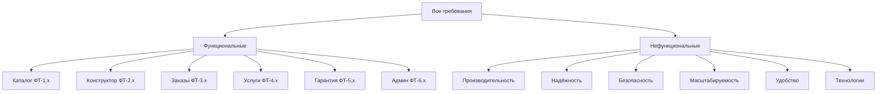
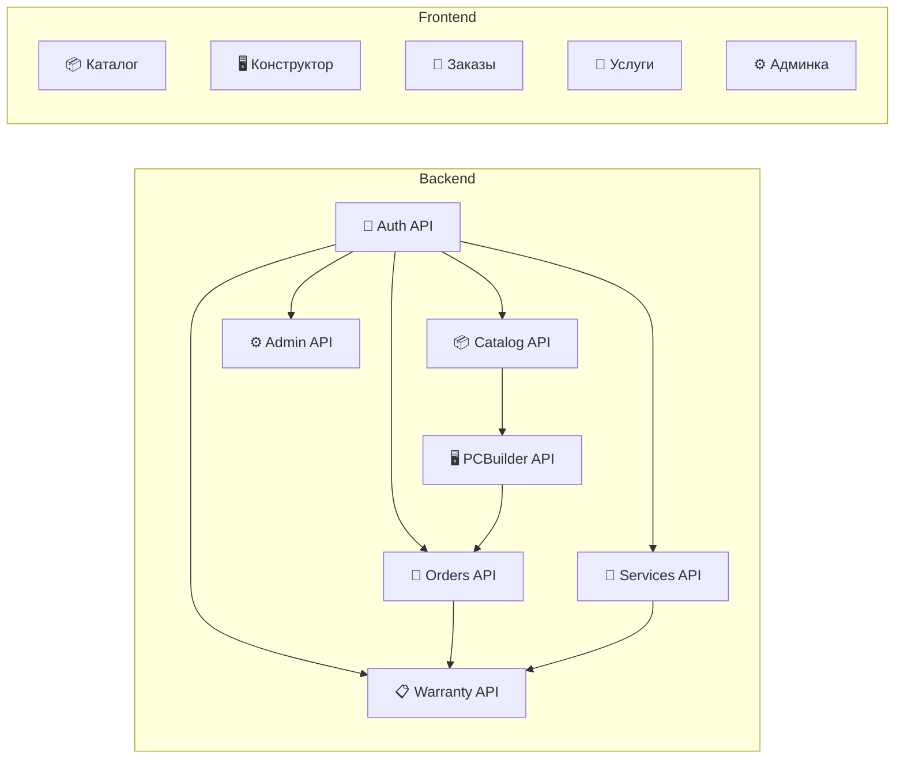
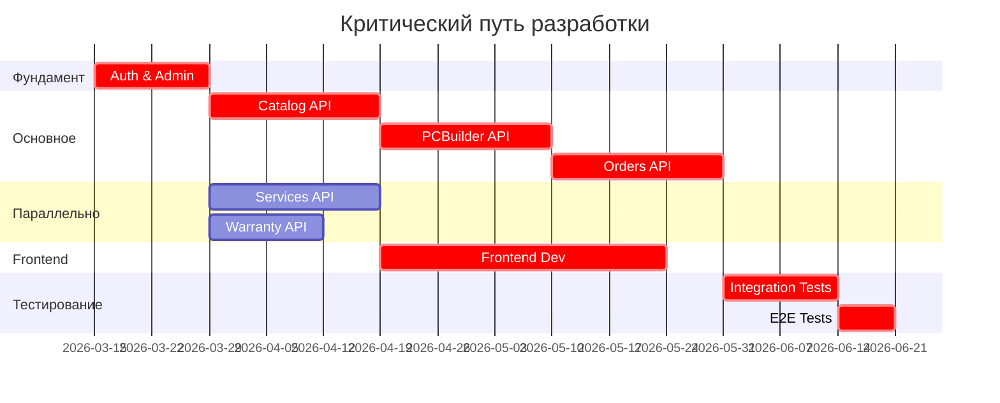
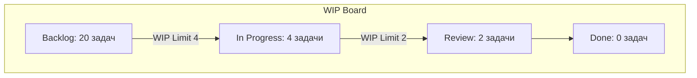

# Этап 1: Анализ требований и декомпозиция

## 📋 Анализ требований

**Версия документа:** 1.0  
**Длительность этапа:** 1-2 недели  
**Ответственный:** TIER-1 Архитектор, Координатор

---

## Цель этапа

Провести полный анализ требований проекта, выполнить декомпозицию на модули и задачи, определить зависимости между компонентами, сформировать критический путь и оценить сроки разработки с использованием ML-моделей.

---

## Входные данные

| Данные | Источник | Формат |
|--------|----------|--------|
| Техническое задание | [ТЗ_GoldPC.md](./appendices/ТЗ_GoldPC.md) | Markdown |
| Требования по Вигерсу | [Таблицы_по_Вигерсу.md](./appendices/Таблицы_по_Вигерсу.md) | Markdown |
| Диаграмма процесса | `AI_driven_dev_process.mmd` | Mermaid |
| Бизнес-цели | ТЗ, раздел 4 | Документ |

---

## Подробное описание действий

### 1.1 Анализ требований (День 1-3)

#### Действия:

1. **Изучение ТЗ**
   - Прочитать все разделы ТЗ ([ТЗ_GoldPC.md](./appendices/ТЗ_GoldPC.md))
   - Выписать все функциональные требования (ФТ-1.1 — ФТ-6.9)
   - Выписать все нефункциональные требования (НФТ-1.1 — НФТ-6.5)
   - Составить список неоднозначностей и вопросов

2. **Анализ требований по Вигерсу**
   - Изучить [Таблицы_по_Вигерсу.md](./appendices/Таблицы_по_Вигерсу.md)
   - Проверить матрицы трассируемости
   - Идентифицировать конфликты и пробелы

3. **Классификация требований**



#### Ответственные:
- 👨‍💼 Координатор — организация процесса
- 🥇 TIER-1 Архитектор — анализ и структурирование

#### Инструменты:
- Notion / Confluence — документирование
- Excel / Google Sheets — матрицы трассируемости
- Draw.io — диаграммы

---

### 1.2 Декомпозиция на модули (День 3-5)

#### Действия:

1. **Определение модулей**

| Модуль | Функциональные требования | Сложность | Приоритет |
|--------|--------------------------|-----------|-----------|
| M1: Catalog | ФТ-1.1 — ФТ-1.10 | Средняя | Высокий |
| M2: PCBuilder | ФТ-2.1 — ФТ-2.11 | Высокая | Высокий |
| M3: Orders | ФТ-3.1 — ФТ-3.13 | Высокая | Высокий |
| M4: Services | ФТ-4.1 — ФТ-4.11 | Средняя | Высокий |
| M5: Warranty | ФТ-5.1 — ФТ-5.9 | Средняя | Средний |
| M6: Admin | ФТ-6.1 — ФТ-6.9 | Средняя | Высокий |
| M7: Auth | ФТ-6.1 — ФТ-6.5 | Низкая | Высокий |

2. **Декомпозиция на подмодули**

```
M3: Orders
├── M3.1: Cart (корзина)
├── M3.2: Checkout (оформление)
├── M3.3: OrderManagement (управление)
├── M3.4: Notifications (уведомления)
└── M3.5: History (история)
```

3. **Определение границ модулей**



#### Ответственные:
- 🥇 TIER-1 Архитектор — проектирование модулей

#### Артефакты:
- Диаграмма модулей
- Спецификация границ модулей
- Список API-эндпоинтов (предварительный)

---

### 1.3 Анализ зависимостей (День 5-7)

#### Действия:

1. **Построение матрицы зависимостей**

| Модуль | Зависит от | Тип зависимости |
|--------|------------|-----------------|
| PCBuilder | Catalog, Auth | Данные, API |
| Orders | Catalog, Auth, Warranty | Данные, API, События |
| Services | Auth, Warranty | Данные, API |
| Warranty | Orders, Services | События |
| Admin | Auth, все модули | API |

2. **Определение критического пути**



3. **Идентификация параллельных веток**

| Ветка | Модули | Агенты | Можно начать |
|-------|--------|--------|--------------|
| Backend Core | Auth, Admin | Agent B | Сразу |
| Catalog | Catalog API | Agent B | После Auth |
| PCBuilder | PCBuilder API | Agent B | После Catalog |
| Services | Services, Warranty API | Agent C | После Auth |
| Frontend | React UI | Agent A | После Catalog API stubs |
| Tests | Unit, Integration | Agent D | После первых API |

#### Ответственные:
- 🥇 TIER-1 Архитектор
- 👨‍💼 Координатор

---

### 1.4 ML-оценка сроков (День 7-8)

#### Действия:

1. **Сбор метрик для оценки**
   - Количество требований по каждому модулю
   - Сложность требований (story points)
   - Исторические данные (если есть)

2. **Применение ML-модели оценки**

```python
# Пример логики оценки (упрощённо)
def estimate_module(requirements, complexity_factor):
    base_hours = len(requirements) * 4  # 4 часа на требование
    complexity_multiplier = {
        'Низкая': 1.0,
        'Средняя': 1.5,
        'Высокая': 2.0
    }
    return base_hours * complexity_multiplier[complexity_factor]

# Результаты оценки
estimates = {
    'M1_Catalog': estimate_module(10, 'Средняя'),      # 60 часов
    'M2_PCBuilder': estimate_module(11, 'Высокая'),    # 88 часов
    'M3_Orders': estimate_module(13, 'Высокая'),       # 104 часа
    'M4_Services': estimate_module(11, 'Средняя'),     # 66 часов
    'M5_Warranty': estimate_module(9, 'Средняя'),      # 54 часа
    'M6_Admin': estimate_module(9, 'Средняя'),         # 54 часа
    'M7_Auth': estimate_module(5, 'Низкая'),           # 20 часов
    'Frontend': 160,  # Отдельная оценка
    'Testing': 80,
    'DevOps': 40
}
```

3. **Результаты оценки**

| Этап | Оценка (часы) | Мин. | Макс. |
|------|---------------|------|-------|
| Анализ и проектирование | 80 | 60 | 100 |
| Backend разработка | 300 | 250 | 350 |
| Frontend разработка | 160 | 120 | 200 |
| Тестирование | 80 | 60 | 100 |
| DevOps и деплой | 40 | 30 | 60 |
| **Итого** | **660** | **520** | **810** |

**Календарный срок:** 16-24 недели (с учётом параллелизации)

---

### 1.5 Проверка WIP Limits (День 8-9)

#### Действия:

1. **Определение WIP Limits**

| Тип работы | WIP Limit | Обоснование |
|------------|-----------|-------------|
| Features в разработке | 4 | Ограничение контекста |
| Features на ревью | 2 | Качество ревью |
| Активные агенты | 4 | Доступные ресурсы |
| Задачи на агента | 2 | Фокусировка |

2. **Проверка распределения**



3. **Перераспределение при необходимости**
   - Если WIP превышен → приоритизация
   - Если простои → добавление задач

#### Ответственный:
- 👨‍💼 Координатор

---

### 1.6 Формирование бэклога (День 9-10)

#### Действия:

1. **Создание User Stories**

Формат:
```
Как [роль], я хочу [действие], чтобы [цель]

Критерии приёмки:
- [ ] Критерий 1
- [ ] Критерий 2

Зависимости: [список]
Оценка: [SP]
```

2. **Пример бэклога для модуля Catalog**

| ID | Story | SP | Приоритет | Зависимости |
|----|-------|-----|-----------|-------------|
| US-1.1 | Просмотр каталога без авторизации | 5 | High | - |
| US-1.2 | Фильтрация по категориям | 5 | High | US-1.1 |
| US-1.3 | Фильтрация по производителю | 3 | High | US-1.1 |
| US-1.4 | Фильтрация по цене | 3 | Medium | US-1.1 |
| US-1.5 | Поиск по названию | 5 | High | US-1.1 |
| US-1.6 | Просмотр деталей товара | 3 | High | US-1.1 |
| US-1.7 | Отображение остатка | 2 | High | US-1.1 |
| US-1.8 | Рейтинг и отзывы | 8 | Medium | Auth |

3. **Приоритизация по MoSCoW**

| Категория | Описание | Количество |
|-----------|----------|------------|
| **Must have** | Обязательно для MVP | 60% |
| **Should have** | Важно, но не критично | 20% |
| **Could have** | Желательно | 15% |
| **Won't have** | Отложено | 5% |

---

### 1.7 Идентификация рисков и неоднозначностей

#### Действия:

1. **Составление списка вопросов**

| ID | Вопрос | Влияет на | Статус |
|----|--------|-----------|--------|
| Q-1 | Какой платёжный шлюз использовать? | Orders | Открыт |
| Q-2 | Нужна ли интеграция с 1С? | Admin | Открыт |
| Q-3 | SMS-провайдер? | Notifications | Открыт |
| Q-4 | Лимиты на заказ товара? | Orders | Уточнено: 5 шт. |

2. **Регистрация рисков**

| Риск | Вероятность | Влияние | Mitigation |
|------|-------------|---------|------------|
| R-1: Нет спецификации API платежей | Средняя | Высокое | Выбрать провайдера на этапе 2 |
| R-2: Сложность алгоритма совместимости | Средняя | Среднее | Прототипирование |
| R-3: Интеграция с 1С | Низкая | Низкое | Отложить на post-MVP |

---

## Выходные артефакты

| Артефакт | Формат | Расположение |
|----------|--------|--------------|
| Спецификация требований | Markdown | `docs/requirements/spec.md` |
| Матрица трассируемости | Excel/CSV | `docs/requirements/traceability.csv` |
| Диаграмма модулей | Mermaid | `docs/architecture/modules.mmd` |
| Критический путь | Mermaid/Gantt | `docs/planning/critical-path.mmd` |
| Бэклог проекта | GitHub Issues/Notion | Репозиторий |
| Реестр рисков | Markdown | `docs/planning/risks.md` |
| Оценка сроков | Markdown | `docs/planning/estimates.md` |

---

## Критерии готовности (Definition of Done)

- [ ] Все требования из ТЗ проанализированы и классифицированы
- [ ] Матрица трассируемости заполнена
- [ ] Модули определены и границы установлены
- [ ] Зависимости между модулями идентифицированы
- [ ] Критический путь построен
- [ ] WIP Limits установлены и проверены
- [ ] Бэклог сформирован и приоритизирован
- [ ] Оценка сроков выполнена
- [ ] Риски идентифицированы
- [ ] Открытые вопросы задокументированы
- [ ] Документы утверждены координатором

---

## Возможные риски и митигация

| Риск | Вероятность | Влияние | Меры митигации |
|------|-------------|---------|----------------|
| Неполные требования | Средняя | Высокое | Итеративное уточнение с заказчиком |
| Конфликты требований | Низкая | Среднее | Матрица трассируемости |
| Недооценка сложности | Средняя | Среднее | Буфер времени 20% |
| Изменение требований | Средняя | Высокое | Change management процесс |

---

## Переход к следующему этапу

Для перехода к этапу [02-contracts-and-architecture.md](./02-contracts-and-architecture.md) необходимо:

1. ✅ Утверждение спецификации требований заказчиком
2. ✅ Утверждение бэклога координатором
3. ✅ Закрытие критических вопросов (Q-1, Q-3)
4. ✅ Назначение TIER-1 архитекторов

---

## Связанные документы

- [README.md](./README.md) — Обзор плана
- [ТЗ_GoldPC.md](./appendices/ТЗ_GoldPC.md) — Техническое задание
- [Таблицы_по_Вигерсу.md](./appendices/Таблицы_по_Вигерсу.md) — Требования по Вигерсу

---

*Документ создан в рамках плана разработки GoldPC.*