# Этап 2: Контракты и архитектура

## 📋 Contract-First Layer + Архитектура

**Версия документа:** 1.0  
**Длительность этапа:** 2-3 недели  
**Ответственный:** TIER-1 Архитектор, Координатор

---

## Цель этапа

Спроектировать API-контракты (OpenAPI, Pact, AsyncAPI), провести Threat Modeling (STRIDE), утвердить архитектуру системы, определить процесс управления версиями контрактов и создать Architecture Decision Records (ADR) для ключевых архитектурных решений.

---

## Входные данные

| Данные | Источник |
|--------|----------|
| Спецификация требований | [01-requirements-analysis.md](./01-requirements-analysis.md) |
| Диаграмма модулей | Этап 1 |
| Техническое задание | [ТЗ_GoldPC.md](./appendices/ТЗ_GoldPC.md) |
| Технологический стек | [Инструменты_для_разработки.md](./appendices/Инструменты_для_разработки.md) |

---

## Подробное описание действий

### 2.1 Проектирование API: выбор формата (День 1-2)

#### Действия:

1. **Анализ требований к API**

| Критерий | Требование | Приоритет |
|----------|------------|-----------|
| Тип клиентов | Веб-приложение (React) | Высокий |
| Количество потребителей | 1 фронтенд | Низкий |
| Сложность запросов | CRUD + бизнес-логика | Средний |
| Производительность | ≤2 сек на запрос | Высокий |
| Кэшируемость | HTTP-кэширование | Средний |
| Реальное время | Уведомления (WebSocket) | Средний |

2. **Сравнение форматов API**

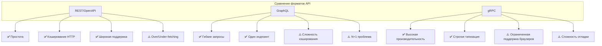

3. **Обоснование выбора: REST/OpenAPI**

| Критерий | REST/OpenAPI | GraphQL | gRPC | Решение |
|----------|--------------|---------|------|---------|
| Поддержка браузеров | ✅ Отличная | ✅ Хорошая | ⚠️ Требует gRPC-Web | **REST** |
| Простота разработки | ✅ Высокая | ⚠️ Средняя | ⚠️ Средняя | **REST** |
| HTTP-кэширование | ✅ Встроенное | ❌ Нет | ❌ Нет | **REST** |
| Документация | ✅ Swagger UI | ⚠️ Playground | ⚠️ Protobuf | **REST** |
| Инструменты .NET | ✅ Отличные | ✅ Хорошая | ✅ Хорошая | Нейтрально |
| Мониторинг | ✅ Простой | ⚠️ Сложный | ⚠️ Сложный | **REST** |
| Количество потребителей | 1 клиент | Много клиентов | Внутренние | **REST** |

**Решение:** REST/OpenAPI как основной формат для синхронного API.

**Для асинхронных событий:** AsyncAPI (WebSocket + Event-driven).

**Для будущего:** gRPC для межсервисного взаимодействия (если будет микросервисная архитектура).

4. **Итоговая архитектура API**

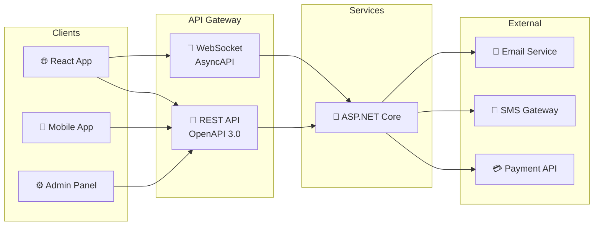

#### Ответственный:
- 🥇 TIER-1 Архитектор

---

### 2.2 Создание спецификаций (День 2-5)

#### Действия:

1. **Процесс создания спецификаций**

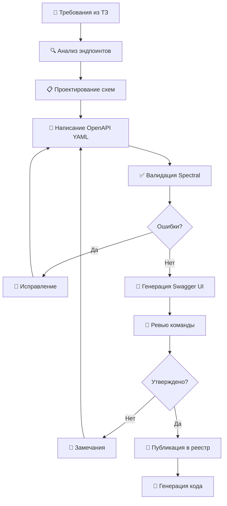

2. **Инструменты для работы со спецификациями**

| Инструмент | Назначение | Особенности |
|------------|------------|-------------|
| **Swagger Editor** | Редактирование OpenAPI | Онлайн-редактор с предпросмотром |
| **Stoplight Studio** | Визуальное проектирование | GUI для OpenAPI, моки, документация |
| **Spectral** | Линтинг OpenAPI | Правила валидации, кастомные rulesets |
| **Redoc** | Документация | Красивый статический UI |
| **OpenAPI Generator** | Генерация кода | Клиенты, серверы, документация |
| **Prism** | Мок-сервер | Валидация запросов/ответов |

3. **Структура спецификаций**

```
docs/api/
├── openapi/
│   ├── components/
│   │   ├── schemas/
│   │   │   ├── common.yaml        # Общие схемы (Pagination, Error)
│   │   │   ├── user.yaml          # Схемы пользователя
│   │   │   ├── product.yaml       # Схемы товара
│   │   │   ├── order.yaml         # Схемы заказа
│   │   │   └── service.yaml       # Схемы услуг
│   │   ├── parameters/
│   │   │   └── common.yaml        # Общие параметры
│   │   └── responses/
│   │       └── common.yaml        # Общие ответы
│   ├── paths/
│   │   ├── auth.yaml              # Эндпоинты аутентификации
│   │   ├── catalog.yaml           # Эндпоинты каталога
│   │   ├── pc-builder.yaml       # Эндпоинты конструктора
│   │   ├── orders.yaml            # Эндпоинты заказов
│   │   ├── services.yaml          # Эндпоинты услуг
│   │   ├── warranty.yaml          # Эндпоинты гарантии
│   │   └── admin.yaml             # Эндпоинты администрирования
│   └── openapi.yaml               # Главный файл (сборка)
├── asyncapi/
│   └── asyncapi.yaml              # Спецификация событий
└── pacts/
    ├── frontend-catalog.json      # Pact с каталогом
    ├── frontend-orders.json       # Pact с заказами
    └── frontend-pcbuilder.json    # Pact с конструктором
```

4. **Пример спецификации (Auth API)**

```yaml
# docs/api/openapi/paths/auth.yaml
openapi: 3.0.3
info:
  title: GoldPC API - Auth
  version: 1.0.0
  description: API аутентификации и авторизации системы GoldPC

servers:
  - url: https://api.goldpc.local/v1
    description: Development server
  - url: https://api.goldpc.com/v1
    description: Production server

tags:
  - name: Auth
    description: Аутентификация и авторизация

paths:
  /auth/register:
    post:
      summary: Регистрация нового пользователя
      description: Создаёт новую учётную запись клиента
      operationId: register
      tags: [Auth]
      requestBody:
        required: true
        content:
          application/json:
            schema:
              $ref: '#/components/schemas/RegisterRequest'
      responses:
        '201':
          description: Пользователь успешно создан
          content:
            application/json:
              schema:
                $ref: '#/components/schemas/AuthResponse'
        '400':
          $ref: '#/components/responses/ValidationError'
        '409':
          description: Пользователь с таким email уже существует
          content:
            application/json:
              schema:
                $ref: '#/components/schemas/Error'

  /auth/login:
    post:
      summary: Аутентификация пользователя
      description: Возвращает JWT токены при успешной аутентификации
      operationId: login
      tags: [Auth]
      requestBody:
        required: true
        content:
          application/json:
            schema:
              $ref: '#/components/schemas/LoginRequest'
      responses:
        '200':
          description: Успешная аутентификация
          content:
            application/json:
              schema:
                $ref: '#/components/schemas/AuthResponse'
        '401':
          description: Неверные учётные данные
          content:
            application/json:
              schema:
                $ref: '#/components/schemas/Error'
        '429':
          $ref: '#/components/responses/RateLimitExceeded'

  /auth/refresh:
    post:
      summary: Обновление токена
      description: Обновляет access token с помощью refresh token
      operationId: refreshToken
      tags: [Auth]
      requestBody:
        required: true
        content:
          application/json:
            schema:
              $ref: '#/components/schemas/RefreshRequest'
      responses:
        '200':
          description: Токен успешно обновлён
          content:
            application/json:
              schema:
                $ref: '#/components/schemas/AuthResponse'
        '401':
          description: Refresh token недействителен или истёк

  /auth/logout:
    post:
      summary: Выход из системы
      description: Инвалидирует refresh token
      operationId: logout
      tags: [Auth]
      security:
        - bearerAuth: []
      responses:
        '204':
          description: Успешный выход
        '401':
          $ref: '#/components/responses/Unauthorized'

components:
  schemas:
    RegisterRequest:
      type: object
      required: [email, password, firstName, lastName, phone]
      properties:
        email:
          type: string
          format: email
          example: user@example.com
          description: Email пользователя
        password:
          type: string
          format: password
          minLength: 8
          maxLength: 128
          example: "P@ssw0rd!"
          description: Пароль (минимум 8 символов, буквы и цифры)
        firstName:
          type: string
          minLength: 2
          maxLength: 50
          example: "Иван"
          description: Имя
        lastName:
          type: string
          minLength: 2
          maxLength: 50
          example: "Иванов"
          description: Фамилия
        phone:
          type: string
          pattern: '^\+375\d{9}$'
          example: "+375291234567"
          description: Телефон в формате +375XXXXXXXXX

    LoginRequest:
      type: object
      required: [email, password]
      properties:
        email:
          type: string
          format: email
          description: Email пользователя
        password:
          type: string
          format: password
          description: Пароль

    RefreshRequest:
      type: object
      required: [refreshToken]
      properties:
        refreshToken:
          type: string
          description: Refresh token

    AuthResponse:
      type: object
      properties:
        accessToken:
          type: string
          description: JWT access token (15 минут)
        refreshToken:
          type: string
          description: Refresh token (7 дней)
        expiresIn:
          type: integer
          description: Время жизни access token в секундах
          example: 900
        user:
          $ref: '#/components/schemas/User'

    User:
      type: object
      properties:
        id:
          type: string
          format: uuid
          description: Уникальный идентификатор
        email:
          type: string
          format: email
          description: Email
        role:
          type: string
          enum: [Client, Manager, Master, Admin, Accountant]
          description: Роль пользователя
        firstName:
          type: string
          description: Имя
        lastName:
          type: string
          description: Фамилия

    Error:
      type: object
      properties:
        code:
          type: string
          description: Код ошибки
          example: "VALIDATION_ERROR"
        message:
          type: string
          description: Сообщение об ошибке
          example: "Некорректный формат email"
        details:
          type: array
          items:
            type: object
            properties:
              field:
                type: string
              message:
                type: string
          description: Детали ошибок валидации

  responses:
    ValidationError:
      description: Ошибка валидации данных
      content:
        application/json:
          schema:
            $ref: '#/components/schemas/Error'
    Unauthorized:
      description: Неавторизован
      content:
        application/json:
          schema:
            $ref: '#/components/schemas/Error'
    RateLimitExceeded:
      description: Превышен лимит запросов
      content:
        application/json:
          schema:
            $ref: '#/components/schemas/Error'

  securitySchemes:
    bearerAuth:
      type: http
      scheme: bearer
      bearerFormat: JWT
      description: JWT токен авторизации

security:
  - bearerAuth: []
```

5. **Правила валидации (Spectral)**

```yaml
# .spectral.yaml
extends: [[spectral:oas, all]]
rules:
  # Обязательные поля
  info-contact:
    error
  info-description:
    error
  info-license:
    warn

  # Соглашения по именованию
  paths-kebab-case:
    description: Пути должны использовать kebab-case
    type: style
    given: "$.paths[*]~"
    then:
      function: pattern
      functionOptions:
        match: "^(/[a-z0-9-{}]+)+$"
  
  # Версионирование API
  api-version-in-path:
    description: API версия должна быть в пути
    type: style
    given: "$.paths"
    then:
      function: pattern
      functionOptions:
        match: "^/v[0-9]+/"

  # Обязательные ответы
  operation-4xx-response:
    description: Операции должны иметь 4xx ответы
    type: style
    given: "$.paths[*][*].responses"
    then:
      field: "@type"
      function: truthy

  # Описание операций
  operation-summary:
    description: Каждая операция должна иметь summary
    type: style
    given: "$.paths[*][*]"
    then:
      field: summary
      function: truthy

  # Безопасность
  operation-security-defined:
    description: Операции должны иметь security
    type: style
    given: "$.paths[*][*]"
    then:
      field: security
      function: truthy
```

#### Ответственный:
- 🥇 TIER-1 Архитектор
- TIER-2 Разработчики (ревью)

---

### 2.3 Управление версиями контрактов (День 5-7)

#### Действия:

1. **Семантическое версионирование API**

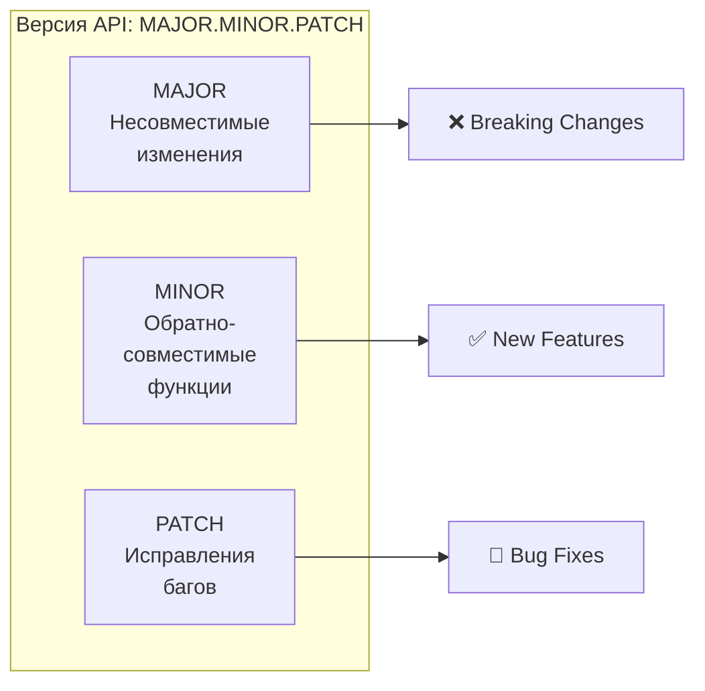

2. **Правила версионирования**

| Изменение | Версия | Пример |
|-----------|--------|--------|
| Удаление эндпоинта | MAJOR | v1 → v2 |
| Изменение типа параметра | MAJOR | v1 → v2 |
| Обязательный параметр добавлен | MAJOR | v1 → v2 |
| Новый эндпоинт | MINOR | v1.0 → v1.1 |
| Новый опциональный параметр | MINOR | v1.0 → v1.1 |
| Новое поле в ответе | MINOR | v1.0 → v1.1 |
| Исправление бага | PATCH | v1.0.0 → v1.0.1 |
| Новое опциональное поле | PATCH | v1.0.0 → v1.0.1 |

3. **Стратегия обратной совместимости**

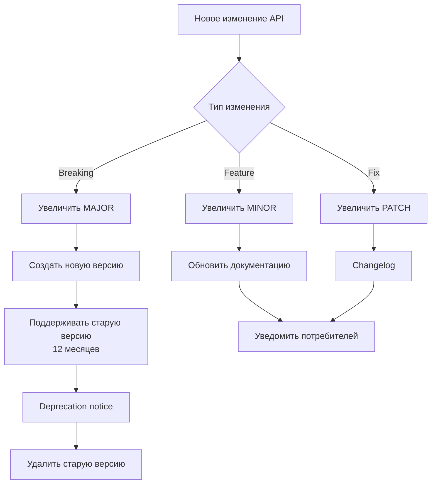

4. **Deprecation Policy**

| Период | Действие | Уведомление |
|--------|----------|-------------|
| День 0 | Deprecation notice | Header `Deprecation: true`, `Sunset: date` |
| Месяц 1 | Предупреждение | Email потребителям |
| Месяц 6 | Повышение видимости | Warning в ответе |
| Месяц 12 | Удаление | Ошибка 410 Gone |

5. **Версионирование в коде**

```yaml
# Версионирование через URL (рекомендуется)
paths:
  /v1/products:
    get:
      summary: Получить продукты (v1)
  /v2/products:
    get:
      summary: Получить продукты с фильтрами (v2)

# Версионирование в заголовках (альтернатива)
# Accept: application/vnd.goldpc.v1+json
```

6. **Changelog формат**

```markdown
# API Changelog

## [2.0.0] - 2026-04-01

### Breaking Changes
- Удалён эндпоинт `/v1/products/search` (используйте `/v2/products?search=`)
- Изменён формат ответа `/v2/orders`: `customer` → `customerInfo`

### Added
- Новый эндпоинт `/v2/products/recommendations`
- Фильтрация по цене в `/v2/products`

## [1.1.0] - 2026-03-15

### Added
- Поле `rating` в ответе `/v1/products/{id}`
- Пагинация в `/v1/orders`

### Fixed
- Некорректный формат даты в `/v1/orders`
```

#### Ответственный:
- 🥇 TIER-1 Архитектор

---

### 2.4 Центральный реестр контрактов (День 7-8)

#### Действия:

1. **Структура реестра контрактов**

```
contracts/
├── openapi/
│   ├── v1/
│   │   ├── openapi.yaml          # Полная спецификация v1
│   │   ├── auth.yaml
│   │   ├── catalog.yaml
│   │   ├── orders.yaml
│   │   ├── services.yaml
│   │   ├── warranty.yaml
│   │   └── admin.yaml
│   ├── v2/
│   │   └── openapi.yaml          # Полная спецификация v2
│   └── schemas/
│       └── common/
│           ├── error.yaml
│           ├── pagination.yaml
│           └── user.yaml
├── asyncapi/
│   ├── v1/
│   │   └── asyncapi.yaml         # Спецификация событий v1
│   └── schemas/
│       └── events/
│           ├── order-events.yaml
│           └── service-events.yaml
├── pacts/
│   ├── frontend-catalog.json     # Pact контракты
│   ├── frontend-orders.json
│   └── frontend-services.json
├── adr/
│   ├── 0001-record-architecture-decisions.md
│   ├── 0002-choice-of-api-format.md
│   ├── 0003-database-choice.md
│   └── template.md
└── README.md                    # Описание реестра
```

2. **Хранение контрактов**

| Тип | Место хранения | Версионирование | Доступ |
|-----|----------------|-----------------|--------|
| OpenAPI | `contracts/openapi/` | Git + SemVer | Команда |
| AsyncAPI | `contracts/asyncapi/` | Git + SemVer | Команда |
| Pact | `contracts/pacts/` + Pact Broker | Git + Pact Versioning | Автоматизация |
| ADR | `contracts/adr/` | Git | Команда |

3. **CI/CD для контрактов**

```yaml
# .github/workflows/api-contracts.yml
name: API Contracts Validation

on:
  push:
    paths:
      - 'contracts/**'
  pull_request:
    paths:
      - 'contracts/**'

jobs:
  lint:
    runs-on: ubuntu-latest
    steps:
      - uses: actions/checkout@v4
      
      - name: Install Spectral
        run: npm install -g @stoplight/spectral-cli
      
      - name: Lint OpenAPI specs
        run: spectral lint contracts/openapi/v1/*.yaml --ruleset .spectral.yaml
      
      - name: Validate AsyncAPI
        run: npx -y @asyncapi/cli validate contracts/asyncapi/v1/asyncapi.yaml
  
  breaking-changes:
    runs-on: ubuntu-latest
    steps:
      - uses: actions/checkout@v4
      
      - name: Check for breaking changes
        uses: oasdiff/oasdiff-action@main
        with:
          command: breaking
          base: 'contracts/openapi/v1/openapi.yaml'
          revision: 'contracts/openapi/v1/openapi.yaml'
      
      - name: Generate Changelog
        uses: oasdiff/oasdiff-action@main
        with:
          command: changelog
          base: 'contracts/openapi/v1/openapi.yaml'
          revision: 'contracts/openapi/v1/openapi.yaml'
  
  publish:
    needs: [lint, breaking-changes]
    if: github.ref == 'refs/heads/main'
    runs-on: ubuntu-latest
    steps:
      - name: Publish to Swagger UI
        run: |
          # Деплой документации на статический сервер
          
      - name: Publish Pacts to Broker
        run: |
          # Публикация Pact контрактов
```

4. **Документация Swagger UI**

```yaml
# docker-compose.swagger.yml
version: '3.8'
services:
  swagger-ui:
    image: swaggerapi/swagger-ui:v5.9.0
    ports:
      - "8081:8080"
    environment:
      URLS: "[{ name: 'GoldPC API v1', url: '/openapi/v1/openapi.yaml' }]"
      BASE_URL: /docs/api
    volumes:
      - ./contracts/openapi:/usr/share/nginx/html/openapi:ro
```

#### Ответственный:
- 🥇 TIER-1 Архитектор
- DevOps-инженер

---

### 2.5 Threat Modeling — STRIDE анализ (День 8-10)

#### Действия:

1. **Идентификация активов**

| Актив | Тип | Ценность | Владелец | Защита |
|-------|-----|----------|----------|--------|
| Персональные данные клиентов | PII | Высокая | GDPR | Шифрование, RBAC |
| Пароли пользователей | Credentials | Критическая | Security | bcrypt, salt |
| Финансовые транзакции | Financial | Критическая | Finance | Шифрование, аудит |
| История заказов | Business | Высокая | Business | RBAC, аудит |
| Каталог товаров | Business | Средняя | Operations | Backup |
| JWT токены | Credentials | Высокая | Security | Короткий срок, refresh |
| Гарантийные талоны | Business | Высокая | Business | Неизменяемость |

2. **STRIDE анализ**

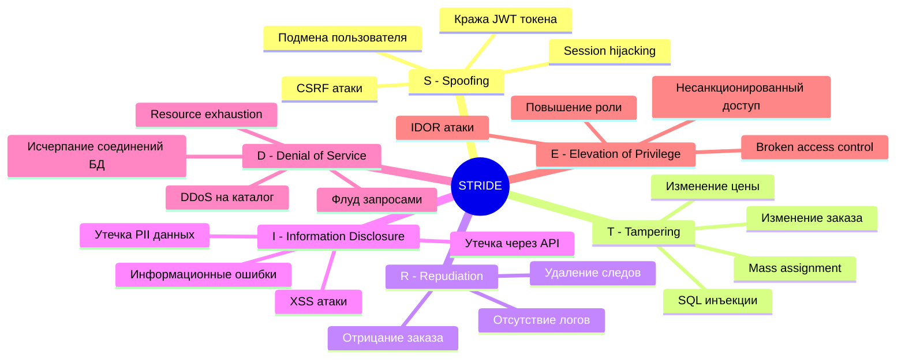

3. **Матрица угроз по модулям**

| Модуль | S | T | R | I | D | E | Приоритет защиты | Критичные угрозы |
|--------|---|---|---|---|---|---|-------------------|------------------|
| Auth | ⚠️ | ⚠️ | ⚠️ | 🔴 | ⚠️ | 🔴 | Критический | Подмена, IDOR |
| Orders | ⚠️ | 🔴 | ⚠️ | 🔴 | ⚠️ | ⚠️ | Критический | Изменение, утечка |
| Catalog | 🟢 | 🟢 | 🟢 | 🟢 | ⚠️ | 🟢 | Средний | DoS |
| PCBuilder | 🟢 | 🟢 | 🟢 | 🟢 | ⚠️ | 🟢 | Низкий | DoS |
| Services | ⚠️ | ⚠️ | ⚠️ | ⚠️ | 🟢 | ⚠️ | Высокий | IDOR, подмена |
| Warranty | ⚠️ | ⚠️ | 🔴 | ⚠️ | 🟢 | ⚠️ | Высокий | Репликация |
| Admin | 🔴 | 🔴 | 🔴 | 🔴 | ⚠️ | 🔴 | Критический | Все типы |

> 🔴 — Высокий риск, ⚠️ — Средний риск, 🟢 — Низкий риск

4. **Требования безопасности**

| ID | Требование | Категория STRIDE | Реализация | Приоритет |
|----|------------|------------------|------------|-----------|
| SEC-1 | JWT с коротким сроком жизни (15 мин access, 7 дней refresh) | S, E | ASP.NET Core Identity | Критический |
| SEC-2 | bcrypt/Argon2id для паролей (cost factor 12+) | I, S | ASP.NET Core Identity | Критический |
| SEC-3 | HTTPS везде (TLS 1.2+) | I, S | Nginx, SSL certificate | Критический |
| SEC-4 | CSRF токены для state-changing операций | S | Anti-forgery token | Высокий |
| SEC-5 | Параметризованные запросы (EF Core) | T | Entity Framework Core | Критический |
| SEC-6 | FluentValidation для входных данных | T, I | FluentValidation | Высокий |
| SEC-7 | RBAC на каждый эндпоинт | E | Authorization middleware | Критический |
| SEC-8 | Аудит всех критических операций | R | Serilog + DB | Высокий |
| SEC-9 | Rate limiting (100 req/min) | D | AspNetCoreRateLimit | Средний |
| SEC-10 | Шифрование PII (AES-256-GCM) | I | Data Protection API | Высокий |
| SEC-11 | Content Security Policy (CSP) | I | Middleware | Высокий |
| SEC-12 | HTTP Security Headers | I, T | Middleware | Высокий |

5. **HTTP Security Headers**

```yaml
# Безопасные заголовки для всех ответов
headers:
  Strict-Transport-Security: "max-age=31536000; includeSubDomains; preload"
  X-Content-Type-Options: "nosniff"
  X-Frame-Options: "DENY"
  X-XSS-Protection: "1; mode=block"
  Content-Security-Policy: "default-src 'self'; script-src 'self' 'unsafe-inline'; style-src 'self' 'unsafe-inline'"
  Referrer-Policy: "strict-origin-when-cross-origin"
  Permissions-Policy: "geolocation=(), microphone=(), camera=()"
```

#### Ответственный:
- 🥇 TIER-1 Архитектор
- 👨‍💼 Координатор (утверждение)

---

### 2.6 Архитектурные диаграммы (День 10-12)

#### Действия:

1. **C4 Model — Level 1: Context Diagram**

```mermaid
graph TB
    subgraph "Внешние системы"
        Client[👤 Клиент\nВеб-браузер]
        Manager[👔 Менеджер\nВеб-браузер]
        Master[🔧 Мастер\nВеб-браузер]
        Admin[⚙️ Администратор\nВеб-браузер]
        Accountant[📊 Бухгалтер\nВеб-браузер]
    end
    
    subgraph "Система GoldPC"
        System[🖥️ GoldPC\nВеб-приложение для компьютерного\nмагазина с сервисным центром]
    end
    
    subgraph "Внешние сервисы"
        Payment[💳 Платёжная система\nЮKassa]
        SMS[📱 SMS-шлюз\nSMS.ru]
        Email[📧 Email-сервер\nSMTP]
        Backup[💾 Резервное копирование\nS3/NAS]
    end
    
    Client -->|HTTPS/JSON| System
    Manager -->|HTTPS/JSON| System
    Master -->|HTTPS/JSON| System
    Admin -->|HTTPS/JSON| System
    Accountant -->|HTTPS/JSON| System
    
    System -->|HTTPS/API| Payment
    System -->|HTTPS/API| SMS
    System -->|SMTP| Email
    System -->|HTTPS/S3| Backup
    
    System -->[(🗄️ PostgreSQL\nБаза данных)]
    System -->[(⚡ Redis\nКэш)]
```

**Описание контекста:**
- **Клиент** — неавторизованный или авторизованный пользователь, просматривает каталог, использует конструктор, оформляет заказы
- **Менеджер** — обрабатывает заказы, управляет каталогом
- **Мастер** — выполняет ремонтные работы, обновляет статусы заявок
- **Администратор** — управляет пользователями, справочниками, мониторит систему
- **Бухгалтер** — формирует финансовые отчёты

2. **C4 Model — Level 2: Container Diagram**

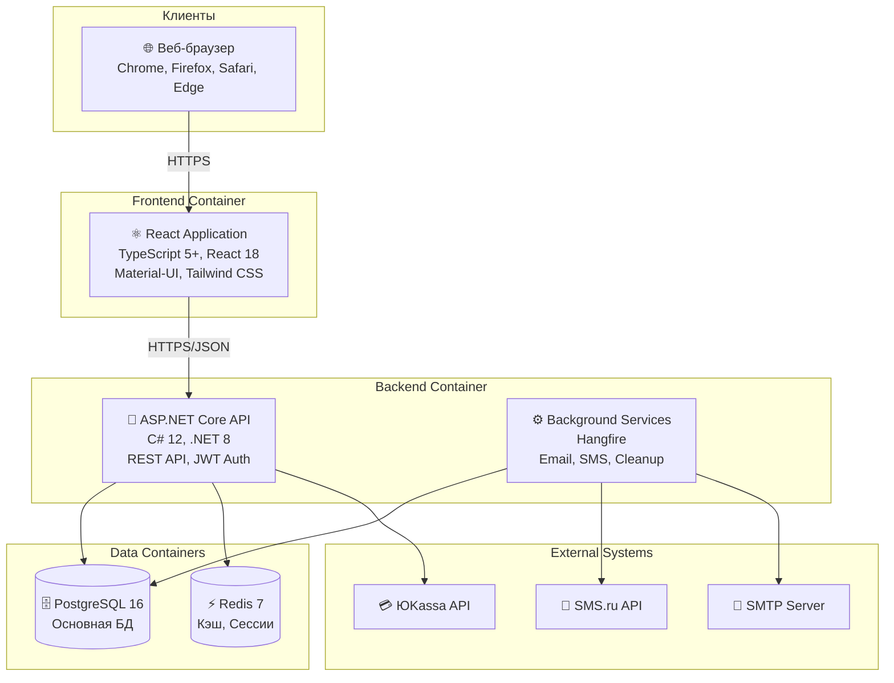

**Описание контейнеров:**

| Контейнер | Технология | Назначение | Протоколы |
|-----------|------------|------------|-----------|
| React Application | React 18 + TypeScript | SPA для пользователей | HTTPS, JSON |
| ASP.NET Core API | C# 12, .NET 8 | REST API сервер | HTTPS, JSON, JWT |
| Background Services | Hangfire | Асинхронные задачи | Internal |
| PostgreSQL | PostgreSQL 16 | Хранение данных | TCP, SQL |
| Redis | Redis 7 | Кэширование, сессии | TCP |

3. **C4 Model — Level 2: Component Diagram (по модулям)**

**Модуль Catalog:**

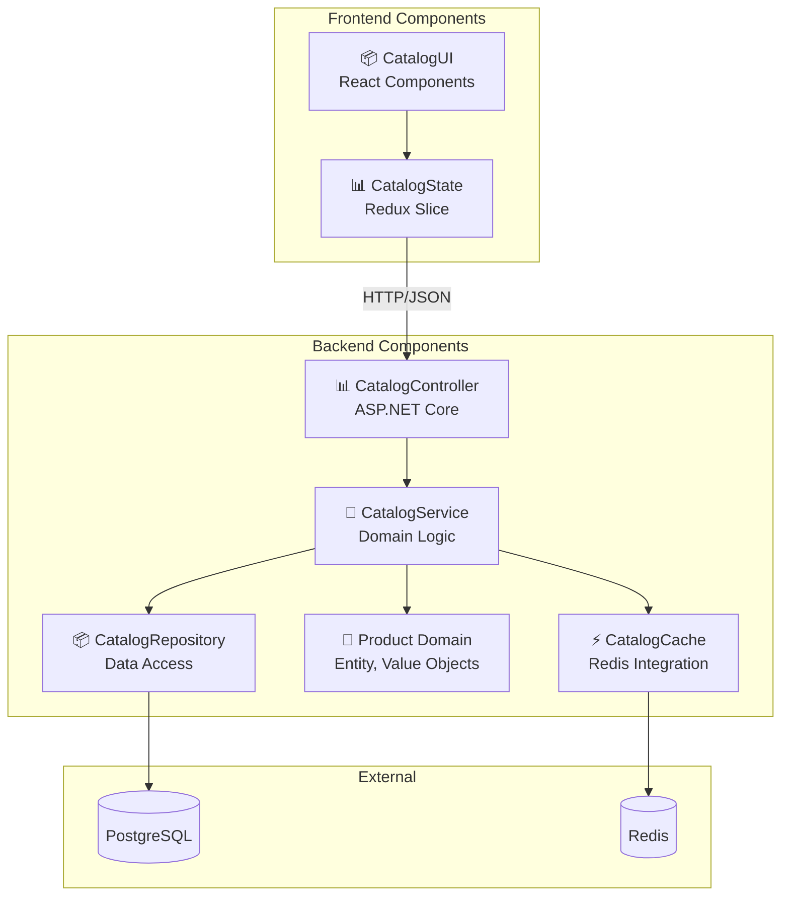

**Модуль Orders:**

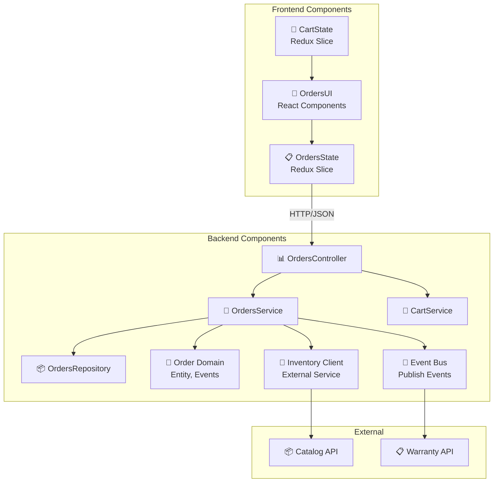

**Модуль PCBuilder:**

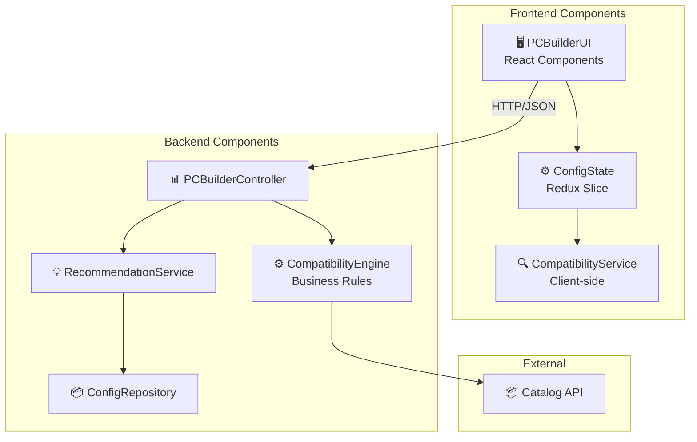

4. **Диаграмма компонентов (все модули)**

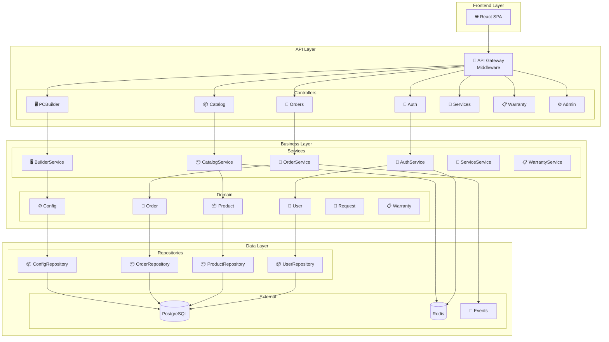

5. **ER Diagram (основные сущности)**

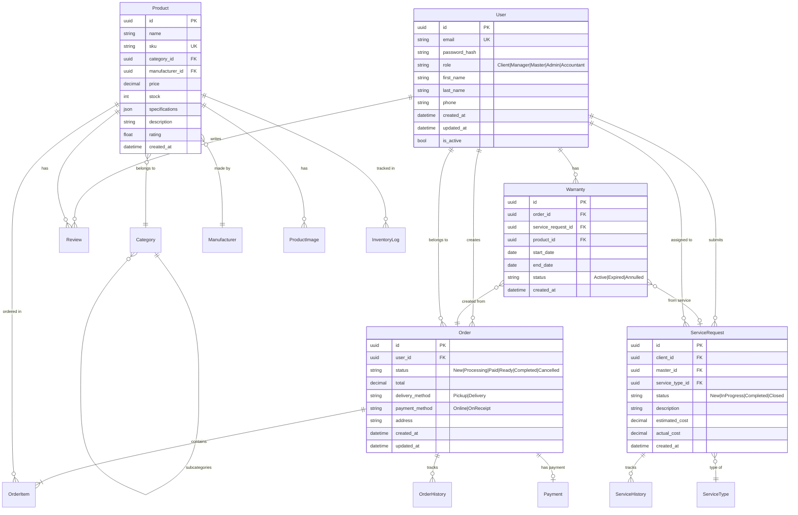

#### Ответственный:
- 🥇 TIER-1 Архитектор

---

### 2.7 Проверка архитектуры (День 12-14)

#### Действия:

1. **Автоматические проверки архитектуры**

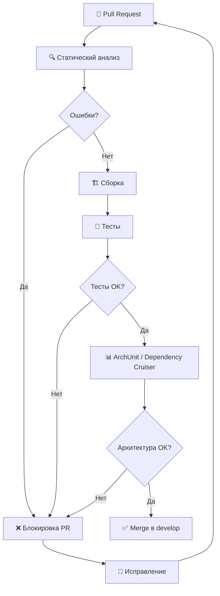

2. **Правила проверки архитектуры (SOLID)**

| Принцип | Правило | Проверка | Инструмент |
|---------|---------|----------|------------|
| **S**ingle Responsibility | Один класс = одна ответственность | Анализ связей | SonarQube |
| **O**pen/Closed | Открыт для расширения, закрыт для изменения | Наследование | ArchUnit |
| **L**iskov Substitution | Подклассы могут заменять базовые | Полиморфизм | ArchUnit |
| **I**nterface Segregation | Интерфейсы должны быть специфичными | Количество методов | SonarQube |
| **D**ependency Inversion | Зависимость от абстракций | Инъекция зависимостей | ArchUnit |

3. **ArchUnit правила (C# с NetArchTest)**

```csharp
// Tests/Architecture/ArchitectureTests.cs
using ArchUnitNET.Domain;
using ArchUnitNET.Loader;
using ArchUnitNET.Fluent;
using Xunit;

public class ArchitectureTests
{
    private static readonly Architecture Architecture = new ArchLoader()
        .LoadAssemblies(
            typeof(Program).Assembly,
            typeof(ApplicationService).Assembly,
            typeof(DomainEntity).Assembly,
            typeof(InfrastructureService).Assembly
        )
        .Build();

    // Правило: Контроллеры не должны зависеть напрямую от репозиториев
    [Fact]
    public void ControllersShouldNotDependOnRepositories()
    {
        var controllers = ArchRuleDefinition.Classes()
            .That().Are(typeof(Controller).Assembly)
            .And().HaveNameEndingWith("Controller");

        var repositories = ArchRuleDefinition.Classes()
            .That().Are(typeof(Repository).Assembly)
            .And().HaveNameEndingWith("Repository");

        var rule = controllers.Should().NotDependOn(repositories);
        
        rule.Check(Architecture);
    }

    // Правило: Сервисы должны иметь интерфейсы
    [Fact]
    public void ServicesShouldHaveInterfaces()
    {
        var services = ArchRuleDefinition.Classes()
            .That().ResideInAssembly(typeof(ApplicationService).Assembly)
            .And().HaveNameEndingWith("Service");

        var rule = services.Should().ImplementInterface("I" + services.Name);
        
        rule.Check(Architecture);
    }

    // Правило: Доменные сущности не должны зависеть от инфраструктуры
    [Fact]
    public void DomainEntitiesShouldNotDependOnInfrastructure()
    {
        var domainEntities = ArchRuleDefinition.Classes()
            .That().ResideInAssembly(typeof(DomainEntity).Assembly);

        var infrastructure = ArchRuleDefinition.Classes()
            .That().ResideInAssembly(typeof(InfrastructureService).Assembly);

        var rule = domainEntities.Should().NotDependOn(infrastructure);
        
        rule.Check(Architecture);
    }

    // Правило: Запрет циклических зависимостей
    [Fact]
    public void NoCyclicDependencies()
    {
        var rule = ArchRuleDefinition.Types()
            .Should().NotDependOn("CyclicDependency");
        
        rule.Check(Architecture);
    }

    // Правило: Все публичные методы должны иметь XML документацию
    [Fact]
    public void PublicMethodsShouldHaveDocumentation()
    {
        var publicMethods = ArchRuleDefinition.MethodMembers()
            .That().ArePublic()
            .And().AreDeclaredIn(typeof(Program).Assembly);

        var rule = publicMethods.Should().HaveDocumentation();
        
        rule.Check(Architecture);
    }
}
```

4. **Dependency Cruiser правила (Frontend)**

```javascript
// .dependency-cruiser.js
module.exports = {
  forbidden: [
    // Запрет циклических зависимостей
    {
      name: 'no-circular',
      severity: 'error',
      comment: 'Циклические зависимости замедляют сборку и усложняют понимание',
      from: {},
      to: {
        circular: true
      }
    },
    
    // Компоненты не должны импортировать из страниц напрямую
    {
      name: 'components-not-from-pages',
      severity: 'error',
      from: {
        path: '^src/components/'
      },
      to: {
        path: '^src/pages/'
      }
    },
    
    // Запрет прямых импортов из store (должен использоваться hooks)
    {
      name: 'no-direct-store-import',
      severity: 'warn',
      from: {
        path: '^src/components/'
      },
      to: {
        path: '^src/store/'
      }
    },
    
    // API слой не должен зависеть от UI
    {
      name: 'api-not-from-ui',
      severity: 'error',
      from: {
        path: '^src/api/'
      },
      to: {
        path: ['^src/components/', '^src/pages/', '^src/hooks/']
      }
    },
    
    // Правила слоёв
    {
      name: 'layer-hierarchy',
      severity: 'error',
      from: {
        path: '^src/(pages|components)/'
      },
      to: {
        path: ['^src/api/', '^src/store/', '^src/hooks/', '^src/utils/'],
        pathNot: ['^src/pages/', '^src/components/']
      }
    }
  ],
  
  options: {
    doNotFollow: {
      path: 'node_modules'
    },
    tsPreCompilationOption: {
      tsConfig: './tsconfig.json'
    }
  }
};
```

5. **CI/CD проверки архитектуры**

```yaml
# .github/workflows/architecture.yml
name: Architecture Validation

on:
  push:
    branches: [main, develop]
  pull_request:
    branches: [main, develop]

jobs:
  backend-architecture:
    runs-on: ubuntu-latest
    steps:
      - uses: actions/checkout@v4
      
      - name: Setup .NET
        uses: actions/setup-dotnet@v4
        with:
          dotnet-version: '8.0.x'
      
      - name: Restore dependencies
        run: dotnet restore
      
      - name: Build
        run: dotnet build --no-restore
      
      - name: Run ArchUnit tests
        run: dotnet test --filter "FullyQualifiedName~ArchitectureTests"
      
      - name: Run SonarQube analysis
        uses: SonarSource/sonarqube-scan-action@master
        env:
          SONAR_TOKEN: ${{ secrets.SONAR_TOKEN }}
        with:
          args: >
            -Dsonar.projectKey=goldpc-backend
            -Dsonar.qualitygate.wait=true

  frontend-architecture:
    runs-on: ubuntu-latest
    steps:
      - uses: actions/checkout@v4
      
      - name: Setup Node.js
        uses: actions/setup-node@v4
        with:
          node-version: '20'
          cache: 'npm'
      
      - name: Install dependencies
        run: npm ci
      
      - name: Run Dependency Cruiser
        run: npx dependency-cruiser src --config .dependency-cruiser.js
      
      - name: Run ESLint
        run: npm run lint
      
      - name: Check for circular dependencies
        run: npx madge --circular src/
```

#### Ответственный:
- 🥇 TIER-1 Архитектор
- DevOps-инженер

---

### 2.8 Architecture Decision Records (ADR) (День 14-15)

#### Действия:

1. **Шаблон ADR**

```markdown
# ADR-NNNN: [Название решения]

## Статус
[Предложено | Принято | Отклонено | Устарело | Заменено]

## Контекст
Описание контекста и проблемы, которую нужно решить.
Какие есть альтернативы?
Какие ограничения?

## Решение
Какое решение принято и почему.
Обоснование выбора.

## Последствия
Что изменится после принятия решения:
- Положительные последствия
- Отрицательные последствия
- Риски

## Альтернативы
Рассмотренные альтернативы и причины их отклонения.

## Ссылки
- [Ссылка на обсуждение]
- [Ссылка на связанный ADR]
- [Внешние ресурсы]

## История изменений
| Дата | Автор | Изменение |
|------|-------|-----------|
| YYYY-MM-DD | Имя | Создание |
```

2. **Пример ADR: Выбор формата API**

```markdown
# ADR-0001: Выбор REST/OpenAPI как основного формата API

## Статус
Принято

## Контекст
Для проекта GoldPC необходимо выбрать формат API для взаимодействия между фронтендом (React) и бэкендом (ASP.NET Core).

**Требования:**
- Поддержка браузеров (Chrome, Firefox, Safari, Edge)
- Кэширование HTTP
- Простота разработки и отладки
- Интеграция с .NET ecosystem
- Документация для разработчиков

**Ограничения:**
- Один фронтенд-клиент
- Монолитная архитектура
- Команда знакома с REST

## Решение
Выбран **REST/OpenAPI 3.0** как основной формат для синхронного API.

**Обоснование:**
1. **HTTP-кэширование** — встроенная поддержка браузерами и CDN
2. **Широкая поддержка .NET** — ASP.NET Core имеет встроенные инструменты
3. **Swagger UI** — автоматическая документация и тестирование
4. **Простота** — команда уже опытна с REST
5. **Инструменты** — обширная экосистема (Spectral, Prism, OpenAPI Generator)

**Для асинхронных событий** используется **AsyncAPI** с WebSocket.

## Последствия

### Положительные
- ✅ Простота разработки и отладки
- ✅ Отличная поддержка в ASP.NET Core
- ✅ Автоматическая документация через Swagger
- ✅ Кэширование на уровне HTTP

### Отрицательные
- ⚠️ Over-fetching для сложных запросов (решается проекциями)
- ⚠️ Multiple requests для связанных данных (решается batch endpoints)

### Риски
- Низкий риск — REST стандарт де-факто для веб-приложений

## Альтернативы

| Альтернатива | Плюсы | Минусы | Причина отклонения |
|--------------|-------|--------|---------------------|
| **GraphQL** | Гибкие запросы, один эндпоинт | Сложность кэширования, N+1 проблема, избыточность для 1 клиента | Один клиент не требует гибкости GraphQL |
| **gRPC** | Высокая производительность, строгая типизация | Ограниченная поддержка браузеров, сложность отладки | Не требуется для браузерного клиента |
| **tRPC** | End-to-end типизация | Привязка к TypeScript, менее зрелый | Команда не имеет опыта, риск |

## Ссылки
- [OpenAPI Specification](https://spec.openapis.org/oas/v3.0.3)
- [ASP.NET Core Web API](https://docs.microsoft.com/en-us/aspnet/core/web-api/)
- [REST API Design Best Practices](https://docs.microsoft.com/en-us/azure/architecture/best-practices/api-design)

## История изменений
| Дата | Автор | Изменение |
|------|-------|-----------|
| 2026-03-15 | TIER-1 Architect | Создание |
```

3. **Пример ADR: Выбор базы данных**

```markdown
# ADR-0002: Выбор PostgreSQL как основной СУБД

## Статус
Принято

## Контекст
Для проекта GoldPC необходимо выбрать СУБД для хранения данных о товарах, заказах, пользователях, услугах и гарантийных талонах.

**Требования:**
- ACID-транзакции
- Сложные запросы (JOIN, агрегации)
- JSON-поля для спецификаций товаров
- Полный текстовый поиск (поиск по каталогу)
- Надёжность и резервное копирование

**Ограничения:**
- Open-source решение
- Поддержка в .NET ecosystem
- Возможность масштабирования

## Решение
Выбрана **PostgreSQL 16** как основная СУБД.

**Обоснование:**
1. **JSONB** — нативная поддержка JSON для хранения спецификаций товаров
2. **Полнотекстовый поиск** — встроенный tsvector для поиска по каталогу
3. **ACID** — надёжность транзакций
4. **Расширения** — pg_cron для планирования, pg_stat_statements для мониторинга
5. **EF Core** — отличная поддержка через Npgsql
6. **Open Source** — бесплатная, активное сообщество

## Последствия

### Положительные
- ✅ Бесплатная лицензия
- ✅ Высокая производительность
- ✅ JSONB для гибких схем товаров
- ✅ Отличная поддержка в .NET

### Отрицательные
- ⚠️ Нет встроенной репликации (настраивается отдельно)
- ⚠️ Требуется опыт администрирования

### Риски
- Средний риск — при росте нагрузки потребуется оптимизация запросов

## Альтернативы

| Альтернатива | Плюсы | Минусы | Причина отклонения |
|--------------|-------|--------|---------------------|
| **MySQL** | Популярность, простота | Слабее JSON, нет полнотекстового поиска | Меньше возможностей |
| **SQL Server** | Интеграция с .NET | Лицензия, привязка к Windows | Стоимость лицензий |
| **MongoDB** | Гибкая схема | Нет ACID по умолчанию, нет JOIN | Не подходит для транзакций |

## Ссылки
- [PostgreSQL Documentation](https://www.postgresql.org/docs/16/)
- [Npgsql EF Core Provider](https://www.npgsql.org/efcore/)
- [PostgreSQL vs MySQL](https://www.postgresql.org/about/featurematrix/)

## История изменений
| Дата | Автор | Изменение |
|------|-------|-----------|
| 2026-03-16 | TIER-1 Architect | Создание |
```

4. **Список ADR для проекта**

| Номер | Название | Статус | Дата |
|-------|----------|--------|------|
| ADR-0001 | Выбор REST/OpenAPI | Принято | 2026-03-15 |
| ADR-0002 | Выбор PostgreSQL | Принято | 2026-03-16 |
| ADR-0003 | Выбор React для Frontend | Принято | 2026-03-16 |
| ADR-0004 | Аутентификация через JWT | Принято | 2026-03-17 |
| ADR-0005 | Монолитная архитектура | Принято | 2026-03-17 |
| ADR-0006 | Redis для кэширования | Принято | 2026-03-18 |
| ADR-0007 | Background Services через Hangfire | Принято | 2026-03-18 |
| ADR-0008 | Docker для контейнеризации | Принято | 2026-03-19 |

#### Ответственный:
- 🥇 TIER-1 Архитектор

---

### 2.9 Формирование базы знаний (День 15-16)

#### Действия:

1. **Структура базы знаний**

```
knowledge-base/
├── patterns/
│   ├── repository-pattern.md
│   ├── unit-of-work.md
│   ├── cqrs-basics.md
│   ├── event-driven.md
│   └── factory-pattern.md
├── lessons-learned/
│   ├── README.md
│   └── (пополняется в процессе)
├── solutions/
│   ├── authentication-solution.md
│   ├── file-upload-solution.md
│   └── pagination-solution.md
├── architecture/
│   ├── c4-model.md
│   ├── er-diagram.md
│   ├── api-contracts.md
│   └── security-architecture.md
├── guidelines/
│   ├── coding-standards.md
│   ├── naming-conventions.md
│   ├── git-workflow.md
│   ├── security-checklist.md
│   └── api-design-guidelines.md
└── adr/
    ├── 0001-choice-of-api-format.md
    ├── 0002-database-choice.md
    ├── 0003-frontend-framework.md
    ├── 0004-authentication-jwt.md
    ├── 0005-monolithic-architecture.md
    ├── 0006-redis-caching.md
    ├── 0007-background-services-hangfire.md
    ├── 0008-docker-containerization.md
    └── template.md
```

2. **Пример: Repository Pattern**

```markdown
# Repository Pattern

## Описание
Паттерн Repository абстрагирует доступ к данным, предоставляя интерфейс для работы с сущностями домена.

## Реализация в проекте

### Интерфейс
```csharp
public interface IRepository<T> where T : BaseEntity
{
    Task<T> GetByIdAsync(Guid id);
    Task<IEnumerable<T>> GetAllAsync();
    Task<IEnumerable<T>> FindAsync(Expression<Func<T, bool>> predicate);
    Task AddAsync(T entity);
    Task UpdateAsync(T entity);
    Task DeleteAsync(Guid id);
}
```

### Реализация
```csharp
public class Repository<T> : IRepository<T> where T : BaseEntity
{
    private readonly ApplicationDbContext _context;
    private readonly DbSet<T> _dbSet;

    public Repository(ApplicationDbContext context)
    {
        _context = context;
        _dbSet = context.Set<T>();
    }

    public async Task<T> GetByIdAsync(Guid id) => await _dbSet.FindAsync(id);
    // ...
}
```

## Когда использовать
- Все сущности домена
- Unit testing с моками
- Разделение бизнес-логики и данных

## Примеры в проекте
- `ProductRepository` — работа с товарами
- `OrderRepository` — работа с заказами
- `UserRepository` — работа с пользователями

## Связанные паттерны
- Unit of Work
- Specification
- Query Object
```

---

## Выходные артефакты

| Артефакт | Формат | Расположение |
|----------|--------|--------------|
| Обоснование выбора API | Markdown | `docs/architecture/api-choice.md` |
| OpenAPI спецификации | YAML | `contracts/openapi/` |
| Pact контракты | JSON | `contracts/pacts/` |
| AsyncAPI спецификация | YAML | `contracts/asyncapi/` |
| STRIDE анализ | Markdown | `docs/security/threat-model.md` |
| C4 диаграммы | Mermaid | `docs/architecture/c4/` |
| ER диаграмма | Mermaid | `docs/architecture/er-diagram.mmd` |
| Правила ArchUnit | C# | `tests/Architecture/` |
| Правила Dependency Cruiser | JS | `.dependency-cruiser.js` |
| ADR | Markdown | `contracts/adr/` |
| База знаний | Markdown | `knowledge-base/` |
| Swagger UI | HTML | `https://api.goldpc.local/docs` |

---

## Критерии готовности (Definition of Done)

- [ ] Формат API выбран и обоснован (ADR-0001)
- [ ] OpenAPI спецификации для всех модулей созданы
- [ ] Pact контракты между Frontend и Backend определены
- [ ] AsyncAPI события описаны
- [ ] Версионирование контрактов определено
- [ ] Центральный реестр контрактов настроен
- [ ] STRIDE анализ выполнен
- [ ] Требования безопасности определены
- [ ] C4 диаграммы созданы (Context, Container, Component)
- [ ] ER диаграмма создана
- [ ] Правила ArchUnit/Dependency Cruiser настроены
- [ ] CI/CD проверки архитектуры работают
- [ ] ADR для ключевых решений созданы (минимум 8)
- [ ] База знаний инициализирована
- [ ] Все контракты прошли валидацию (Spectral)
- [ ] Архитектура утверждена координатором

---

## Возможные риски и митигация

| Риск | Вероятность | Влияние | Меры митигации |
|------|-------------|---------|----------------|
| Изменение контрактов в процессе | Средняя | Высокое | SemVer, backward compatibility, deprecation period |
| Пропуск угроз безопасности | Низкая | Критическое | External security review, STRIDE анализ |
| Несогласованность API | Средняя | Среднее | API governance, Spectral linting |
| Циклические зависимости | Средняя | Среднее | ArchUnit, Dependency Cruiser |
| Нарушение SOLID | Средняя | Среднее | Code review, SonarQube |
| Устаревание ADR | Низкая | Низкое | Регулярный ревью ADR |

---

## Переход к следующему этапу

Для перехода к этапу [03-environment-setup.md](./03-environment-setup.md) необходимо:

1. ✅ Утверждение контрактов всеми сторонами
2. ✅ Публикация Pact контрактов в Broker
3. ✅ Настройка API документации (Swagger UI)
4. ✅ Утверждение архитектуры заказчиком
5. ✅ Все ADR приняты и документированы
6. ✅ Правила проверки архитектуры настроены в CI/CD

---

## Связанные документы

- [README.md](./README.md) — Обзор плана
- [01-requirements-analysis.md](./01-requirements-analysis.md) — Анализ требований
- [03-environment-setup.md](./03-environment-setup.md) — Настройка среды
- [04-stub-generation.md](./04-stub-generation.md) — Генерация заглушек
- [ТЗ_GoldPC.md](./appendices/ТЗ_GoldPC.md) — Техническое задание
- [Инструменты_для_разработки.md](./appendices/Инструменты_для_разработки.md) — Стек технологий

---

*Документ создан в рамках плана разработки GoldPC.*