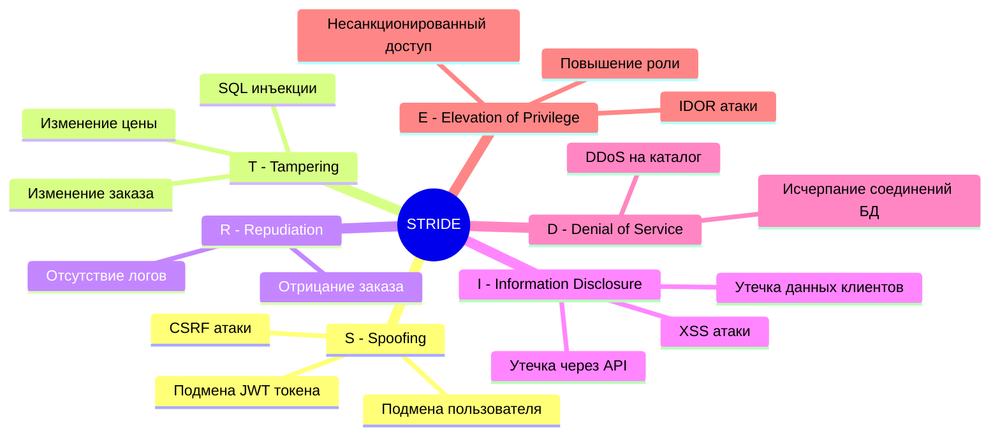
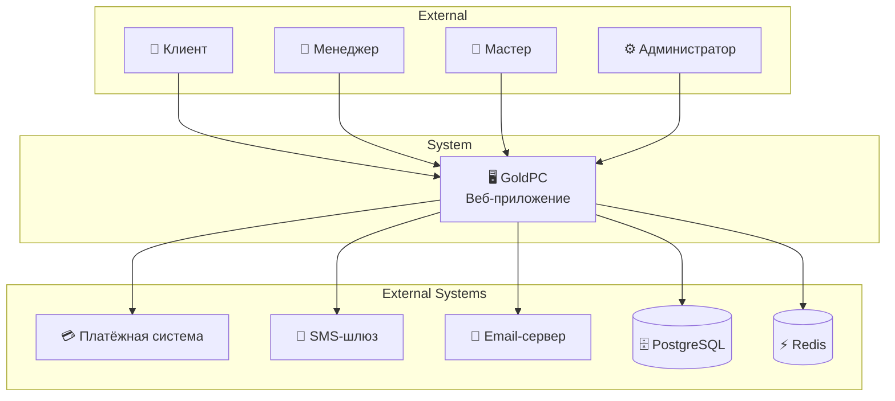
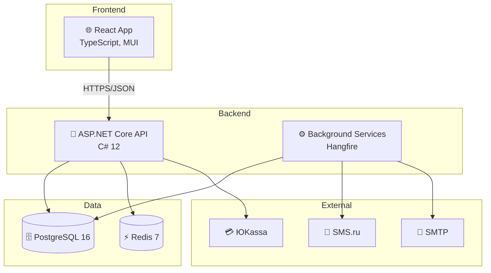
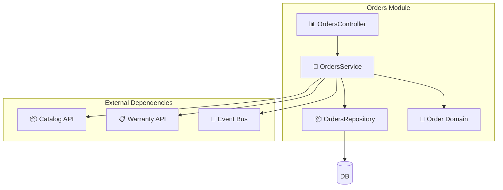
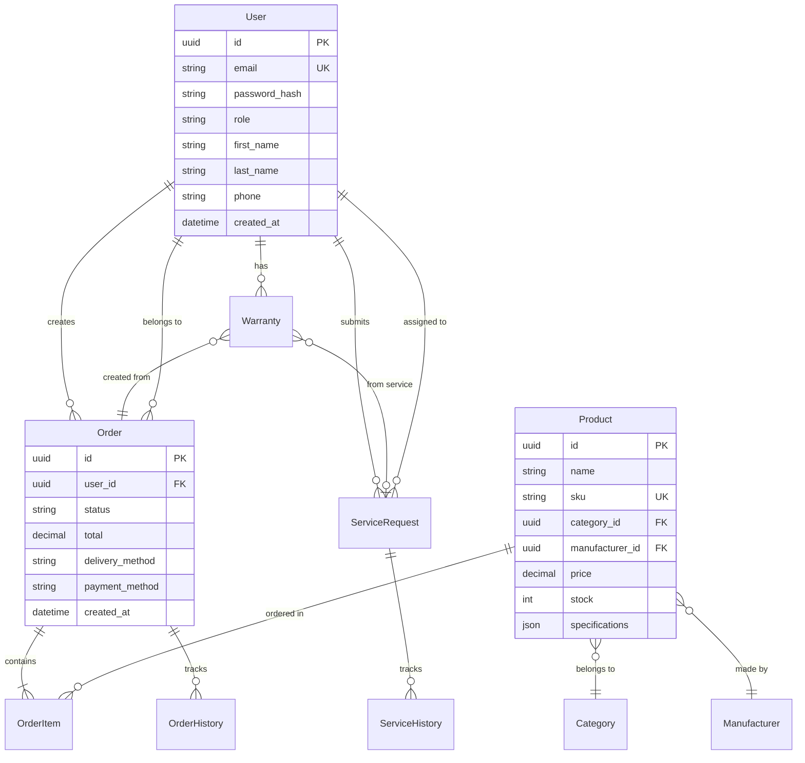
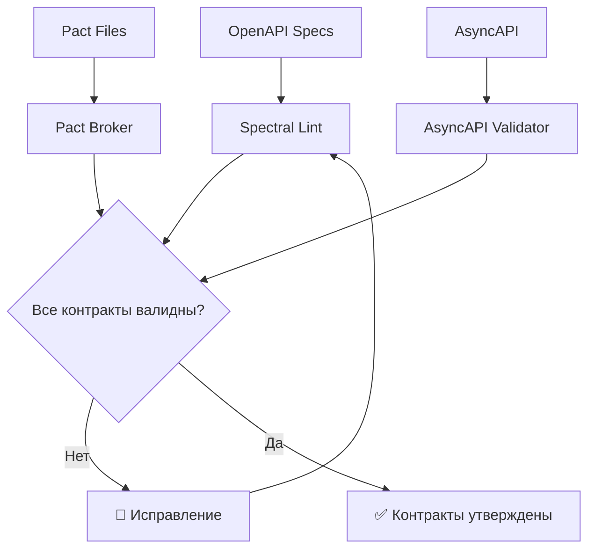

# Этап 2: Контракты и архитектура

## 📋 Contract-First Layer + Архитектура

**Версия документа:** 1.0  
**Длительность этапа:** 2-3 недели  
**Ответственный:** TIER-1 Архитектор, Координатор

---

## Цель этапа

Спроектировать API-контракты (OpenAPI, Pact, AsyncAPI), провести Threat Modeling (STRIDE), утвердить архитектуру системы и создать базу знаний для агентов.

---

## Входные данные

| Данные | Источник |
|--------|----------|
| Спецификация требований | [01-requirements-analysis.md](./01-requirements-analysis.md) |
| Диаграмма модулей | Этап 1 |
| Техническое задание | [ТЗ_GoldPC.md](./appendices/ТЗ_GoldPC.md) |
| Технологический стек | [Инструменты_для_разработки.md](./appendices/Инструменты_для_разработки.md) |

---

## Подробное описание действий

### 2.1 Threat Modeling — STRIDE анализ (День 1-3)

#### Действия:

1. **Идентификация активов**

| Актив | Тип | Ценность | Защита |
|-------|-----|----------|--------|
| Персональные данные клиентов | PII | Высокая | Шифрование, доступ |
| Пароли пользователей | Credentials | Критическая | bcrypt, salt |
| Финансовые транзакции | Financial | Критическая | Шифрование, аудит |
| История заказов | Business | Высокая | RBAC, аудит |
| Каталог товаров | Business | Средняя | Backup |

2. **STRIDE анализ**



3. **Матрица угроз по модулям**

| Модуль | S | T | R | I | D | E | Приоритет защиты |
|--------|---|---|---|---|---|---|------------------|
| Auth | ⚠️ | ⚠️ | ⚠️ | 🔴 | ⚠️ | 🔴 | Критический |
| Orders | ⚠️ | 🔴 | ⚠️ | 🔴 | ⚠️ | ⚠️ | Критический |
| Catalog | 🟢 | 🟢 | 🟢 | 🟢 | ⚠️ | 🟢 | Средний |
| PCBuilder | 🟢 | 🟢 | 🟢 | 🟢 | ⚠️ | 🟢 | Низкий |
| Services | ⚠️ | ⚠️ | ⚠️ | ⚠️ | 🟢 | ⚠️ | Высокий |
| Warranty | ⚠️ | ⚠️ | 🔴 | ⚠️ | 🟢 | ⚠️ | Высокий |
| Admin | 🔴 | 🔴 | 🔴 | 🔴 | ⚠️ | 🔴 | Критический |

> 🔴 — Высокий риск, ⚠️ — Средний риск, 🟢 — Низкий риск

4. **Требования безопасности**

| ID | Требование | Категория STRIDE | Реализация |
|----|------------|------------------|------------|
| SEC-1 | JWT с коротким сроком жизни | S, E | 15 мин access, 7 дней refresh |
| SEC-2 | bcrypt для паролей | I, S | Cost factor 12 |
| SEC-3 | HTTPS везде | I, S | TLS 1.2+ |
| SEC-4 | CSRF токены | S | В формах |
| SEC-5 | Параметризованные запросы | T | EF Core |
| SEC-6 | Валидация входных данных | T, I | FluentValidation |
| SEC-7 | RBAC на каждый эндпоинт | E | Authorization middleware |
| SEC-8 | Аудит критических операций | R | Audit log |
| SEC-9 | Rate limiting | D | 100 req/min |
| SEC-10 | Шифрование PII | I | AES-256-GCM |

#### Ответственный:
- 🥇 TIER-1 Архитектор
- 👨‍💼 Координатор (утверждение)

---

### 2.2 Проектирование OpenAPI спецификаций (День 3-8)

#### Действия:

1. **Структура API**

```
/api/v1/
├── /auth
│   ├── POST /register
│   ├── POST /login
│   ├── POST /refresh
│   └── POST /logout
├── /catalog
│   ├── GET /products
│   ├── GET /products/{id}
│   ├── GET /categories
│   └── GET /manufacturers
├── /pc-builder
│   ├── POST /validate
│   ├── GET /recommendations
│   └── POST /save-config
├── /orders
│   ├── GET /orders
│   ├── POST /orders
│   ├── GET /orders/{id}
│   └── PUT /orders/{id}/status
├── /services
│   ├── GET /requests
│   ├── POST /requests
│   └── PUT /requests/{id}
├── /warranty
│   ├── GET /warranties
│   └── GET /warranties/{id}
└── /admin
    ├── GET /users
    ├── PUT /users/{id}
    └── GET /audit-log
```

2. **Пример OpenAPI спецификации (Auth)**

```yaml
openapi: 3.0.3
info:
  title: GoldPC API - Auth
  version: 1.0.0
  description: API аутентификации и авторизации

paths:
  /api/v1/auth/register:
    post:
      summary: Регистрация нового пользователя
      tags: [Auth]
      requestBody:
        required: true
        content:
          application/json:
            schema:
              $ref: '#/components/schemas/RegisterRequest'
      responses:
        '201':
          description: Пользователь создан
          content:
            application/json:
              schema:
                $ref: '#/components/schemas/AuthResponse'
        '400':
          description: Ошибка валидации
          content:
            application/json:
              schema:
                $ref: '#/components/schemas/ValidationError'
        '409':
          description: Пользователь уже существует

  /api/v1/auth/login:
    post:
      summary: Аутентификация пользователя
      tags: [Auth]
      requestBody:
        required: true
        content:
          application/json:
            schema:
              $ref: '#/components/schemas/LoginRequest'
      responses:
        '200':
          description: Успешная аутентификация
          content:
            application/json:
              schema:
                $ref: '#/components/schemas/AuthResponse'
        '401':
          description: Неверные учётные данные
        '429':
          description: Превышен лимит попыток

components:
  schemas:
    RegisterRequest:
      type: object
      required: [email, password, firstName, lastName, phone]
      properties:
        email:
          type: string
          format: email
          example: user@example.com
        password:
          type: string
          format: password
          minLength: 8
          example: "P@ssw0rd!"
        firstName:
          type: string
          minLength: 2
          example: "Иван"
        lastName:
          type: string
          minLength: 2
          example: "Иванов"
        phone:
          type: string
          pattern: '^\+375\d{9}$'
          example: "+375291234567"

    LoginRequest:
      type: object
      required: [email, password]
      properties:
        email:
          type: string
          format: email
        password:
          type: string
          format: password

    AuthResponse:
      type: object
      properties:
        accessToken:
          type: string
          description: JWT access token (15 min)
        refreshToken:
          type: string
          description: Refresh token (7 days)
        user:
          $ref: '#/components/schemas/User'

    User:
      type: object
      properties:
        id:
          type: string
          format: uuid
        email:
          type: string
        role:
          type: string
          enum: [Client, Manager, Master, Admin, Accountant]
        firstName:
          type: string
        lastName:
          type: string

  securitySchemes:
    bearerAuth:
      type: http
      scheme: bearer
      bearerFormat: JWT

security:
  - bearerAuth: []
```

3. **Спецификация для Orders API (фрагмент)**

```yaml
paths:
  /api/v1/orders:
    get:
      summary: Получить список заказов
      tags: [Orders]
      parameters:
        - name: status
          in: query
          schema:
            type: string
            enum: [New, Processing, Paid, Ready, Completed, Cancelled]
        - name: page
          in: query
          schema:
            type: integer
            default: 1
        - name: limit
          in: query
          schema:
            type: integer
            default: 20
            maximum: 100
      responses:
        '200':
          description: Список заказов
          content:
            application/json:
              schema:
                $ref: '#/components/schemas/OrderList'

    post:
      summary: Создать заказ
      tags: [Orders]
      requestBody:
        required: true
        content:
          application/json:
            schema:
              $ref: '#/components/schemas/CreateOrderRequest'
      responses:
        '201':
          description: Заказ создан
        '400':
          description: Ошибка валидации
        '409':
          description: Недостаточно товара на складе

components:
  schemas:
    CreateOrderRequest:
      type: object
      required: [items, deliveryMethod, paymentMethod]
      properties:
        items:
          type: array
          items:
            $ref: '#/components/schemas/OrderItem'
        deliveryMethod:
          type: string
          enum: [Pickup, Delivery]
        paymentMethod:
          type: string
          enum: [Online, OnReceipt]
        address:
          type: string
          description: Требуется для Delivery

    OrderItem:
      type: object
      required: [productId, quantity]
      properties:
        productId:
          type: string
          format: uuid
        quantity:
          type: integer
          minimum: 1
          maximum: 5
```

#### Ответственный:
- 🥇 TIER-1 Архитектор

#### Инструменты:
- Swagger Editor / Swagger UI
- Stoplight Studio
- OpenAPI Generator

---

### 2.3 Pact контракты (День 8-10)

#### Действия:

1. **Определение контрактов между сервисами**

```json
{
  "consumer": {
    "name": "GoldPC-Frontend"
  },
  "provider": {
    "name": "GoldPC-Catalog-API"
  },
  "interactions": [
    {
      "description": "Получение списка продуктов",
      "request": {
        "method": "GET",
        "path": "/api/v1/catalog/products",
        "query": "category=cpu&page=1&limit=20"
      },
      "response": {
        "status": 200,
        "headers": {
          "Content-Type": "application/json"
        },
        "body": {
          "data": [
            {
              "id": "uuid",
              "name": "like 'AMD Ryzen'",
              "price": "like '399.99'",
              "category": "cpu",
              "stock": "like 10"
            }
          ],
          "pagination": {
            "page": 1,
            "limit": 20,
            "total": 50
          }
        }
      }
    }
  ]
}
```

2. **Контракт для конструктора ПК**

```json
{
  "consumer": { "name": "GoldPC-Frontend" },
  "provider": { "name": "GoldPC-PCBuilder-API" },
  "interactions": [
    {
      "description": "Валидация конфигурации ПК",
      "request": {
        "method": "POST",
        "path": "/api/v1/pc-builder/validate",
        "body": {
          "cpuId": "uuid-1",
          "motherboardId": "uuid-2",
          "ramId": "uuid-3",
          "gpuId": "uuid-4",
          "psuId": "uuid-5",
          "caseId": "uuid-6",
          "storageId": "uuid-7"
        }
      },
      "response": {
        "status": 200,
        "body": {
          "compatible": true,
          "warnings": [],
          "errors": [],
          "totalPower": 450,
          "recommendedPSU": 550
        }
      }
    }
  ]
}
```

#### Ответственный:
- 🥇 TIER-1 Архитектор

---

### 2.4 AsyncAPI для событий (День 10-11)

#### Действия:

1. **Определение событий системы**

```yaml
asyncapi: 2.6.0
info:
  title: GoldPC Events
  version: 1.0.0
  description: Асинхронные события системы GoldPC

channels:
  order.created:
    publish:
      message:
        $ref: '#/components/messages/OrderCreated'
  
  order.statusChanged:
    publish:
      message:
        $ref: '#/components/messages/OrderStatusChanged'
  
  service.requestCreated:
    publish:
      message:
        $ref: '#/components/messages/ServiceRequestCreated'
  
  warranty.expiring:
    publish:
      message:
        $ref: '#/components/messages/WarrantyExpiring'

components:
  messages:
    OrderCreated:
      name: OrderCreated
      title: Заказ создан
      contentType: application/json
      payload:
        type: object
        properties:
          orderId:
            type: string
            format: uuid
          customerId:
            type: string
            format: uuid
          totalAmount:
            type: number
          items:
            type: array
          createdAt:
            type: string
            format: date-time

    OrderStatusChanged:
      name: OrderStatusChanged
      title: Статус заказа изменён
      payload:
        type: object
        properties:
          orderId:
            type: string
          oldStatus:
            type: string
          newStatus:
            type: string
          changedBy:
            type: string
          timestamp:
            type: string
            format: date-time
```

2. **Подписчики событий**

| Событие | Подписчики | Действие |
|---------|------------|----------|
| order.created | Notification Service | Отправка email клиенту |
| order.created | Inventory Service | Резервирование товаров |
| order.statusChanged | Notification Service | Email/SMS уведомление |
| service.requestCreated | Master Assignment | Назначение мастера |
| warranty.expiring | Notification Service | Напоминание клиенту |

---

### 2.5 Архитектура системы (День 11-15)

#### Действия:

1. **C4 Model — Context Diagram**



2. **C4 Model — Container Diagram**



3. **C4 Model — Component Diagram (Orders)**



4. **ER Diagram (основные сущности)**



#### Ответственный:
- 🥇 TIER-1 Архитектор

#### Инструменты:
- Draw.io / Mermaid
- dbdiagram.io
- PlantUML

---

### 2.6 Валидация контрактов (День 15-16)

#### Действия:

1. **Проверка контрактов**



2. **Критерии валидности**

| Проверка | Инструмент | Критерий |
|----------|------------|----------|
| Синтаксис OpenAPI | Spectral | Нет ошибок |
| Совместимость Pact | Pact Broker | Все тесты пройдены |
| Полнота документации | Swagger UI | Все эндпоинты описаны |
| Соответствие REST | Best Practices | Проверено архитектором |

---

### 2.7 Формирование базы знаний (День 16-18)

#### Действия:

1. **Создание Knowledge Base**

```
knowledge-base/
├── patterns/
│   ├── repository-pattern.md
│   ├── cqrs-pattern.md
│   └── event-driven.md
├── lessons-learned/
│   └── (пополняется в процессе)
├── solutions/
│   └── (пополняется в процессе)
├── architecture/
│   ├── c4-model.md
│   ├── er-diagram.md
│   └── api-contracts.md
└── guidelines/
    ├── coding-standards.md
    ├── naming-conventions.md
    └── security-checklist.md
```

2. **Пример: Repository Pattern**

```markdown
# Repository Pattern

## Описание
Используется для абстрагения доступа к данным.

## Реализация в проекте

```csharp
public interface IRepository<T> where T : BaseEntity
{
    Task<T> GetByIdAsync(Guid id);
    Task<IEnumerable<T>> GetAllAsync();
    Task AddAsync(T entity);
    Task UpdateAsync(T entity);
    Task DeleteAsync(Guid id);
}
```

## Когда использовать
- Все сущности домена
- Unit testing с моками

## Примеры использования
- `ProductRepository`
- `OrderRepository`
```

---

## Выходные артефакты

| Артефакт | Формат | Расположение |
|----------|--------|--------------|
| STRIDE анализ | Markdown | `docs/security/threat-model.md` |
| OpenAPI спецификации | YAML | `docs/api/openapi/` |
| Pact контракты | JSON | `docs/api/pacts/` |
| AsyncAPI спецификация | YAML | `docs/api/asyncapi.yaml` |
| C4 диаграммы | Mermaid | `docs/architecture/c4/` |
| ER диаграмма | Mermaid | `docs/architecture/er-diagram.mmd` |
| База знаний | Markdown | `knowledge-base/` |

---

## Критерии готовности (Definition of Done)

- [ ] STRIDE анализ выполнен
- [ ] Требования безопасности определены
- [ ] OpenAPI спецификации для всех модулей созданы
- [ ] Pact контракты между Frontend и Backend определены
- [ ] AsyncAPI события описаны
- [ ] C4 диаграммы созданы (Context, Container, Component)
- [ ] ER диаграмма создана
- [ ] Все контракты прошли валидацию
- [ ] База знаний инициализирована
- [ ] Архитектура утверждена координатором

---

## Возможные риски и митигация

| Риск | Вероятность | Влияние | Меры митигации |
|------|-------------|---------|----------------|
| Изменение контрактов в процессе | Средняя | Высокое | Versioning, backward compatibility |
| Пропуск угроз безопасности | Низкая | Критическое | External security review |
| Несогласованность API | Средняя | Среднее | API governance процесс |

---

## Переход к следующему этапу

Для перехода к этапу [03-environment-setup.md](./03-environment-setup.md) необходимо:

1. ✅ Утверждение контрактов всеми сторонами
2. ✅ Публикация Pact контрактов в Broker
3. ✅ Настройка API документации (Swagger UI)
4. ✅ Утверждение архитектуры заказчиком

---

## Связанные документы

- [README.md](./README.md) — Обзор плана
- [01-requirements-analysis.md](./01-requirements-analysis.md) — Анализ требований
- [ТЗ_GoldPC.md](./appendices/ТЗ_GoldPC.md) — Техническое задание
- [Инструменты_для_разработки.md](./appendices/Инструменты_для_разработки.md) — Стек технологий

---

*Документ создан в рамках плана разработки GoldPC.*