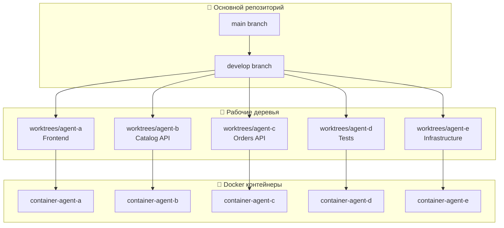
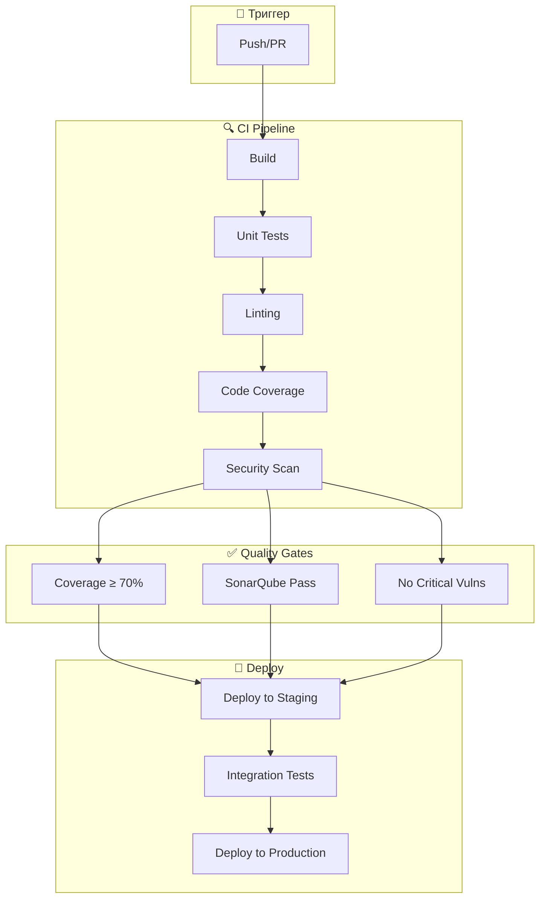
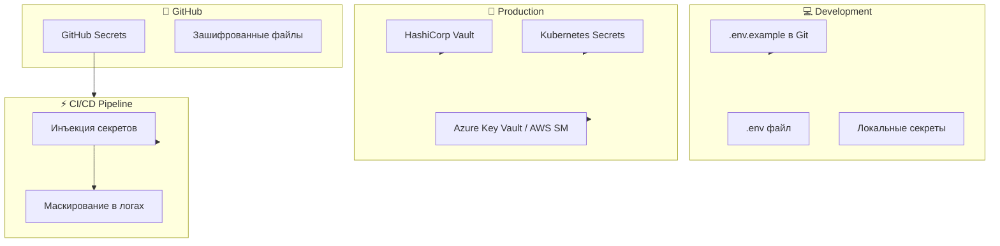

# Этап 3: Настройка среды разработки

## 🏗️ Изоляция рабочих пространств

**Версия документа:** 1.0  
**Длительность этапа:** 1-2 недели  
**Ответственный:** TIER-1 Инфраструктурный инженер, DevOps

---

## Цель этапа

Настроить среду разработки для параллельной работы агентов: создать монорепозиторий, настроить изоляцию рабочих пространств через git worktree, настроить контейнеризацию, CI/CD пайплайны и управление секретами.

---

## Входные данные

| Данные | Источник |
|--------|----------|
| Архитектура системы | [02-contracts-and-architecture.md](./02-contracts-and-architecture.md) |
| Модули и зависимости | [01-requirements-analysis.md](./01-requirements-analysis.md) |
| Технологический стек | [Инструменты_для_разработки.md](./appendices/Инструменты_для_разработки.md) |
| Стандарты безопасности | [02-contracts-and-architecture.md](./02-contracts-and-architecture.md) (STRIDE) |

---

## Подробное описание действий

### 3.1 Монорепозиторий: структура и управление (День 1-3)

#### Действия:

1. **Структура монорепозитория**

```
goldpc/
├── packages/
│   ├── backend/
│   │   ├── src/
│   │   │   ├── GoldPC.Api/           # API-слой
│   │   │   ├── GoldPC.Core/          # Бизнес-логика
│   │   │   ├── GoldPC.Infrastructure/# Инфраструктура
│   │   │   └── GoldPC.Tests/         # Тесты
│   │   ├── GoldPC.sln
│   │   └── Dockerfile
│   ├── frontend/
│   │   ├── src/
│   │   │   ├── components/
│   │   │   ├── pages/
│   │   │   ├── hooks/
│   │   │   ├── store/
│   │   │   └── utils/
│   │   ├── package.json
│   │   └── Dockerfile
│   └── shared/
│       ├── types/                    # Общие TypeScript типы
│       ├── constants/                # Общие константы
│       └── utils/                    # Общие утилиты
├── contracts/
│   ├── openapi/                      # OpenAPI спецификации
│   │   ├── auth.yaml
│   │   ├── catalog.yaml
│   │   ├── orders.yaml
│   │   ├── services.yaml
│   │   └── warranty.yaml
│   ├── pacts/                        # Pact контракты
│   └── asyncapi/                     # AsyncAPI спецификации
├── infrastructure/
│   ├── docker/                       # Docker конфигурации
│   ├── kubernetes/                   # K8s манифесты
│   └── terraform/                    # IaC
├── docs/                             # Документация
├── scripts/                          # Скрипты автоматизации
├── .github/                          # GitHub Actions
│   └── workflows/
├── docker-compose.yml                # Локальная разработка
├── docker-compose.prod.yml           # Production
├── package.json                      # Root package.json (workspaces)
├── turbo.json                        # Turborepo конфигурация
└── README.md
```

2. **Настройка npm workspaces**

```json
// package.json (root)
{
  "name": "goldpc-monorepo",
  "version": "1.0.0",
  "private": true,
  "workspaces": [
    "packages/*",
    "shared"
  ],
  "devDependencies": {
    "turbo": "^1.11.0",
    "typescript": "^5.3.0",
    "eslint": "^8.55.0",
    "prettier": "^3.1.0"
  },
  "scripts": {
    "build": "turbo run build",
    "test": "turbo run test",
    "lint": "turbo run lint",
    "dev": "turbo run dev",
    "clean": "turbo run clean"
  }
}
```

3. **Turborepo конфигурация**

```json
// turbo.json
{
  "$schema": "https://turbo.build/schema.json",
  "pipeline": {
    "build": {
      "dependsOn": ["^build"],
      "outputs": ["dist/**", ".next/**", "!.next/cache/**"]
    },
    "test": {
      "dependsOn": ["build"],
      "outputs": ["coverage/**"]
    },
    "lint": {
      "outputs": []
    },
    "dev": {
      "cache": false,
      "persistent": true
    }
  }
}
```

4. **Управление зависимостями**

| Инструмент | Назначение | Конфигурация |
|------------|------------|--------------|
| npm workspaces | Управление пакетами | Root package.json |
| Turborepo | Кэширование сборки | turbo.json |
| Renovate | Автообновление | renovate.json |

#### Ответственный:
- 🥇 TIER-1 Инфраструктурный инженер

---

### 3.2 Изоляция рабочих пространств (День 2-4)

#### Действия:

1. **Git Worktree для каждого агента**

```bash
# Создание worktree для агентов
# Агент A: Frontend
git worktree add worktrees/agent-a -b feature/frontend-development

# Агент B: Backend Catalog
git worktree add worktrees/agent-b -b feature/catalog-api

# Агент C: Backend Orders
git worktree add worktrees/agent-c -b feature/orders-api

# Агент D: Tests
git worktree add worktrees/agent-d -b feature/integration-tests

# Агент E: Infrastructure
git worktree add worktrees/agent-e -b feature/infrastructure-setup
```

2. **Схема работы с worktree**



3. **Команды для синхронизации**

```bash
# Синхронизация изменений между worktree
git worktree list

# Обновление из develop в worktree
cd worktrees/agent-a
git fetch origin
git rebase origin/develop

# Возврат изменений в основной репозиторий
cd worktrees/agent-a
git push origin feature/frontend-development

# Удаление worktree после завершения работы
git worktree remove worktrees/agent-a
```

4. **Правила работы с worktree**

| Правило | Описание |
|---------|----------|
| Одна задача — одна ветка | Каждый worktree работает в своей feature-ветке |
| Регулярный rebase | Ежедневное обновление из develop |
| Не коммитить в main | Все изменения через PR |
| Очистка после слияния | Удаление worktree после merge PR |

#### Ответственный:
- 👨‍💼 Координатор

---

### 3.3 Контейнеризация (День 3-5)

#### Действия:

1. **Dockerfile для Backend**

```dockerfile
# packages/backend/Dockerfile
# Stage 1: Build
FROM mcr.microsoft.com/dotnet/sdk:8.0 AS build
WORKDIR /src

# Копируем файлы проекта для восстановления зависимостей
COPY ["GoldPC.Api/GoldPC.Api.csproj", "GoldPC.Api/"]
COPY ["GoldPC.Core/GoldPC.Core.csproj", "GoldPC.Core/"]
COPY ["GoldPC.Infrastructure/GoldPC.Infrastructure.csproj", "GoldPC.Infrastructure/"]
RUN dotnet restore "GoldPC.Api/GoldPC.Api.csproj"

# Копируем исходный код и собираем
COPY . .
WORKDIR "/src/GoldPC.Api"
RUN dotnet build "GoldPC.Api.csproj" -c Release -o /app/build

# Stage 2: Publish
FROM build AS publish
RUN dotnet publish "GoldPC.Api.csproj" -c Release -o /app/publish /p:UseAppHost=false

# Stage 3: Runtime
FROM mcr.microsoft.com/dotnet/aspnet:8.0 AS final
WORKDIR /app

# Создаём непривилегированного пользователя
RUN adduser --disabled-password --gecos '' appuser
USER appuser

# Копируем опубликованное приложение
COPY --from=publish /app/publish .

# Настройка переменных окружения
ENV ASPNETCORE_URLS=http://+:5000
ENV ASPNETCORE_ENVIRONMENT=Production

EXPOSE 5000

HEALTHCHECK --interval=30s --timeout=3s --start-period=5s --retries=3 \
    CMD curl -f http://localhost:5000/health || exit 1

ENTRYPOINT ["dotnet", "GoldPC.Api.dll"]
```

2. **Dockerfile для Frontend**

```dockerfile
# packages/frontend/Dockerfile
# Stage 1: Build
FROM node:20-alpine AS build
WORKDIR /app

# Копируем файлы зависимостей
COPY package*.json ./
COPY turbo.json ./
RUN npm ci --only=production

# Копируем исходный код
COPY . .
RUN npm run build

# Stage 2: Production
FROM nginx:alpine AS final

# Копируем собранные файлы
COPY --from=build /app/dist /usr/share/nginx/html

# Копируем конфигурацию nginx
COPY nginx.conf /etc/nginx/nginx.conf

# Создаём непривилегированного пользователя
RUN addgroup -g 101 -S nginx && \
    adduser -S -D -H -u 101 -h /var/cache/nginx -s /sbin/nologin -G nginx nginx

EXPOSE 80

HEALTHCHECK --interval=30s --timeout=3s --start-period=5s --retries=3 \
    CMD curl -f http://localhost/ || exit 1

CMD ["nginx", "-g", "daemon off;"]
```

3. **Docker Compose для локальной разработки**

```yaml
# docker-compose.yml
version: '3.9'

services:
  # Backend API
  backend:
    build:
      context: ./packages/backend
      dockerfile: Dockerfile.dev
    ports:
      - "5000:5000"
    environment:
      - ASPNETCORE_ENVIRONMENT=Development
      - ConnectionStrings__Default=Host=postgres;Database=goldpc_dev;Username=goldpc;Password=dev_password
      - Redis__Connection=redis:6379
    volumes:
      - ./packages/backend:/app
      - /app/bin
      - /app/obj
    depends_on:
      postgres:
        condition: service_healthy
      redis:
        condition: service_started
    networks:
      - goldpc-network

  # Frontend
  frontend:
    build:
      context: ./packages/frontend
      dockerfile: Dockerfile.dev
    ports:
      - "3000:3000"
    environment:
      - VITE_API_URL=http://localhost:5000
    volumes:
      - ./packages/frontend:/app
      - /app/node_modules
    depends_on:
      - backend
    networks:
      - goldpc-network

  # PostgreSQL
  postgres:
    image: postgres:16-alpine
    ports:
      - "5432:5432"
    environment:
      - POSTGRES_DB=goldpc_dev
      - POSTGRES_USER=goldpc
      - POSTGRES_PASSWORD=dev_password
    volumes:
      - postgres_data:/var/lib/postgresql/data
      - ./scripts/init-db.sql:/docker-entrypoint-initdb.d/init.sql
    healthcheck:
      test: ["CMD-SHELL", "pg_isready -U goldpc -d goldpc_dev"]
      interval: 10s
      timeout: 5s
      retries: 5
    networks:
      - goldpc-network

  # Redis
  redis:
    image: redis:7-alpine
    ports:
      - "6379:6379"
    command: redis-server --appendonly yes
    volumes:
      - redis_data:/data
    networks:
      - goldpc-network

  # Adminer (для разработки)
  adminer:
    image: adminer:latest
    ports:
      - "8080:8080"
    depends_on:
      - postgres
    networks:
      - goldpc-network

volumes:
  postgres_data:
  redis_data:

networks:
  goldpc-network:
    driver: bridge
```

4. **Базовые образы**

| Образ | Назначение | Размер | Безопасность |
|-------|------------|--------|--------------|
| `mcr.microsoft.com/dotnet/aspnet:8.0-alpine` | Backend runtime | ~100MB | Alpine, минимальный surface |
| `mcr.microsoft.com/dotnet/sdk:8.0` | Backend build | ~700MB | Полный SDK |
| `node:20-alpine` | Frontend build | ~180MB | Alpine |
| `nginx:alpine` | Frontend server | ~25MB | Минимальный, безопасный |
| `postgres:16-alpine` | База данных | ~80MB | Alpine |
| `redis:7-alpine` | Кэш | ~30MB | Alpine |

5. **Многоэтапная сборка**

```mermaid
graph LR
    subgraph Build Stage
        S1[Source Code] --> S2[Restore Dependencies]
        S2 --> S3[Build]
        S3 --> S4[Publish]
    end
    
    subgraph Runtime Stage
        R1[Base Image] --> R2[Create User]
        S4 --> R3[Copy Artifacts]
        R2 --> R3
        R3 --> R4[Set Environment]
        R4 --> R5[Health Check]
    end
    
    S1 --> Build Stage --> Runtime Stage
```

#### Ответственный:
- 🥇 TIER-1 Инфраструктурный инженер

---

### 3.4 CI/CD: GitHub Actions (День 4-7)

#### Действия:

1. **Структура workflows**

```
.github/
├── workflows/
│   ├── backend-ci.yml          # CI для Backend
│   ├── frontend-ci.yml         # CI для Frontend
│   ├── contracts-validation.yml# Валидация контрактов
│   ├── security-scan.yml       # Сканирование безопасности
│   ├── deploy-staging.yml      # Деплой на staging
│   └── deploy-production.yml   # Деплой на production
├── actions/
│   └── setup-environment/      # Переиспользуемые action'ы
└── CODEOWNERS                  # Владельцы кода
```

2. **Backend CI Workflow**

```yaml
# .github/workflows/backend-ci.yml
name: Backend CI

on:
  push:
    branches: [main, develop]
    paths:
      - 'packages/backend/**'
      - 'contracts/**'
  pull_request:
    branches: [main, develop]
    paths:
      - 'packages/backend/**'

jobs:
  build:
    runs-on: ubuntu-latest
    
    steps:
      - name: Checkout
        uses: actions/checkout@v4
      
      - name: Setup .NET
        uses: actions/setup-dotnet@v4
        with:
          dotnet-version: '8.0.x'
      
      - name: Restore dependencies
        working-directory: packages/backend
        run: dotnet restore
      
      - name: Build
        working-directory: packages/backend
        run: dotnet build --configuration Release --no-restore
      
      - name: Run Unit Tests
        working-directory: packages/backend
        run: dotnet test --configuration Release --no-build --verbosity normal --collect:"XPlat Code Coverage"
      
      - name: Upload Coverage
        uses: codecov/codecov-action@v3
        with:
          files: ./packages/backend/coverage/coverage.cobertura.xml
          flags: backend
      
      - name: Lint (DotNet format)
        working-directory: packages/backend
        run: dotnet format --verify-no-changes --verbosity diagnostic
      
      - name: Security Scan (Snyk)
        uses: snyk/actions/dotnet@master
        env:
          SNYK_TOKEN: ${{ secrets.SNYK_TOKEN }}
        with:
          args: --severity-threshold=high

  sonarqube:
    runs-on: ubuntu-latest
    needs: build
    
    steps:
      - name: Checkout
        uses: actions/checkout@v4
        with:
          fetch-depth: 0
      
      - name: SonarQube Scan
        uses: sonarsource/sonarqube-scan-action@master
        env:
          SONAR_TOKEN: ${{ secrets.SONAR_TOKEN }}
          SONAR_HOST_URL: ${{ secrets.SONAR_HOST_URL }}
```

3. **Frontend CI Workflow**

```yaml
# .github/workflows/frontend-ci.yml
name: Frontend CI

on:
  push:
    branches: [main, develop]
    paths:
      - 'packages/frontend/**'
  pull_request:
    branches: [main, develop]
    paths:
      - 'packages/frontend/**'

jobs:
  build:
    runs-on: ubuntu-latest
    
    steps:
      - name: Checkout
        uses: actions/checkout@v4
      
      - name: Setup Node.js
        uses: actions/setup-node@v4
        with:
          node-version: '20'
          cache: 'npm'
          cache-dependency-path: 'packages/frontend/package-lock.json'
      
      - name: Install dependencies
        working-directory: packages/frontend
        run: npm ci
      
      - name: Lint
        working-directory: packages/frontend
        run: npm run lint
      
      - name: Type check
        working-directory: packages/frontend
        run: npm run type-check
      
      - name: Build
        working-directory: packages/frontend
        run: npm run build
      
      - name: Run Unit Tests
        working-directory: packages/frontend
        run: npm run test:unit -- --coverage
      
      - name: Upload Coverage
        uses: codecov/codecov-action@v3
        with:
          files: ./packages/frontend/coverage/lcov.info
          flags: frontend

  e2e:
    runs-on: ubuntu-latest
    needs: build
    
    steps:
      - name: Checkout
        uses: actions/checkout@v4
      
      - name: Setup Node.js
        uses: actions/setup-node@v4
        with:
          node-version: '20'
          cache: 'npm'
          cache-dependency-path: 'packages/frontend/package-lock.json'
      
      - name: Install dependencies
        working-directory: packages/frontend
        run: npm ci
      
      - name: Run E2E Tests
        working-directory: packages/frontend
        run: npm run test:e2e
        env:
          CI: true
```

4. **Валидация контрактов**

```yaml
# .github/workflows/contracts-validation.yml
name: Contracts Validation

on:
  push:
    paths:
      - 'contracts/**'
  pull_request:
    paths:
      - 'contracts/**'

jobs:
  validate-openapi:
    runs-on: ubuntu-latest
    
    steps:
      - name: Checkout
        uses: actions/checkout@v4
      
      - name: Validate OpenAPI specs
        run: |
          npm install -g @apidevtools/swagger-cli
          for file in contracts/openapi/*.yaml; do
            swagger-cli validate "$file"
          done
      
      - name: Generate TypeScript types
        working-directory: packages/frontend
        run: |
          npm install -g openapi-typescript
          for file in contracts/openapi/*.yaml; do
            openapi-typescript "$file" -o "./src/types/$(basename "$file" .yaml).ts"
          done

  validate-pacts:
    runs-on: ubuntu-latest
    
    steps:
      - name: Checkout
        uses: actions/checkout@v4
      
      - name: Setup Node.js
        uses: actions/setup-node@v4
        with:
          node-version: '20'
      
      - name: Install Pact CLI
        run: npm install -g @pact-foundation/pact-cli
      
      - name: Validate Pacts
        run: |
          for file in contracts/pacts/*.json; do
            pact verify --file "$file" --provider-base-url http://localhost:5000
          done
```

5. **Сканирование безопасности**

```yaml
# .github/workflows/security-scan.yml
name: Security Scan

on:
  push:
    branches: [main, develop]
  pull_request:
    branches: [main]
  schedule:
    - cron: '0 2 * * 1'  # Еженедельно

jobs:
  trivy:
    runs-on: ubuntu-latest
    
    steps:
      - name: Checkout
        uses: actions/checkout@v4
      
      - name: Run Trivy vulnerability scanner
        uses: aquasecurity/trivy-action@master
        with:
          scan-type: 'fs'
          scan-ref: '.'
          severity: 'CRITICAL,HIGH'
          format: 'sarif'
          output: 'trivy-results.sarif'
      
      - name: Upload Trivy results to GitHub Security
        uses: github/codeql-action/upload-sarif@v2
        with:
          sarif_file: 'trivy-results.sarif'

  sast:
    runs-on: ubuntu-latest
    
    steps:
      - name: Checkout
        uses: actions/checkout@v4
      
      - name: Initialize CodeQL
        uses: github/codeql-action/init@v2
        with:
          languages: csharp, javascript
      
      - name: Build
        run: |
          cd packages/backend && dotnet build
          cd ../frontend && npm ci && npm run build
      
      - name: Perform CodeQL Analysis
        uses: github/codeql-action/analyze@v2

  secret-scan:
    runs-on: ubuntu-latest
    
    steps:
      - name: Checkout
        uses: actions/checkout@v4
        with:
          fetch-depth: 0
      
      - name: Gitleaks secret scan
        uses: gitleaks/gitleaks-action@v2
        env:
          GITHUB_TOKEN: ${{ secrets.GITHUB_TOKEN }}
```

6. **Схема CI/CD пайплайна**



#### Ответственный:
- 🥇 TIER-1 Инфраструктурный инженер

---

### 3.5 Управление секретами (День 5-7)

#### Действия:

1. **Переменные окружения**

```bash
# .env.example (шаблон)
# Database
DATABASE_HOST=postgres
DATABASE_PORT=5432
DATABASE_NAME=goldpc_dev
DATABASE_USER=goldpc
DATABASE_PASSWORD=<CHANGE_ME>

# Redis
REDIS_HOST=redis
REDIS_PORT=6379
REDIS_PASSWORD=<CHANGE_ME>

# JWT
JWT_SECRET=<CHANGE_ME_MIN_32_CHARS>
JWT_ACCESS_TOKEN_EXPIRATION=15
JWT_REFRESH_TOKEN_EXPIRATION=10080

# External Services
SMS_API_KEY=<CHANGE_ME>
SMS_API_URL=https://api.sms.ru
EMAIL_SMTP_HOST=smtp.example.com
EMAIL_SMTP_PORT=587
EMAIL_SMTP_USER=<CHANGE_ME>
EMAIL_SMTP_PASSWORD=<CHANGE_ME>

# Payment Gateway
PAYMENT_API_KEY=<CHANGE_ME>
PAYMENT_WEBHOOK_SECRET=<CHANGE_ME>

# Monitoring
SENTRY_DSN=<CHANGE_ME>
APPLICATIONINSIGHTS_CONNECTION_STRING=<CHANGE_ME>

# Feature Flags
LAUNCHDARKLY_SDK_KEY=<CHANGE_ME>
```

2. **GitHub Secrets**

| Секрет | Описание | Обновление |
|--------|----------|------------|
| `DATABASE_PASSWORD` | Пароль PostgreSQL | При смене |
| `REDIS_PASSWORD` | Пароль Redis | При смене |
| `JWT_SECRET` | Секрет для JWT | Ежемесячно |
| `SMS_API_KEY` | Ключ SMS API | При смене |
| `EMAIL_SMTP_PASSWORD` | Пароль SMTP | При смене |
| `PAYMENT_API_KEY` | Ключ платёжной системы | При смене |
| `SNYK_TOKEN` | Токен Snyk | Ежегодно |
| `SONAR_TOKEN` | Токен SonarQube | Ежегодно |
| `DOCKER_REGISTRY_PASSWORD` | Пароль Docker Registry | При смене |
| `KUBE_CONFIG` | Конфиг Kubernetes | При изменении |

3. **Интеграция с HashiCorp Vault (Production)**

```yaml
# vault-config.yaml
# Конфигурация Vault для production

# Database secrets
secrets:
  database:
    path: secret/data/goldpc/database
    keys:
      - host
      - port
      - name
      - user
      - password
  
  jwt:
    path: secret/data/goldpc/jwt
    keys:
      - secret
      - access_expiration
      - refresh_expiration
  
  external:
    path: secret/data/goldpc/external
    keys:
      - sms_api_key
      - email_smtp_password
      - payment_api_key

# C# код для получения секретов
# public class VaultSecretProvider : ISecretProvider
# {
#     private readonly VaultClient _client;
#     
#     public async Task<string> GetSecretAsync(string path, string key)
#     {
#         var secret = await _client.V1.Secrets.KeyValue.V2
#             .ReadSecretAsync(path);
#         return secret.Data.Data[key]?.ToString();
#     }
# }
```

4. **Шифрование секретов в Git**

```yaml
# .github/workflows/secrets-encryption.yml
name: Secrets Management

on:
  workflow_dispatch:
    inputs:
      action:
        description: 'encrypt or decrypt'
        required: true

jobs:
  manage-secrets:
    runs-on: ubuntu-latest
    
    steps:
      - name: Checkout
        uses: actions/checkout@v4
      
      - name: Install git-crypt
        run: sudo apt-get install git-crypt
      
      - name: Unlock secrets
        if: github.event.inputs.action == 'decrypt'
        run: |
          echo "${{ secrets.GIT_CRYPT_KEY }}" | base64 -d > /tmp/key
          git-crypt unlock /tmp/key
      
      - name: Encrypt secrets
        if: github.event.inputs.action == 'encrypt'
        run: git-crypt lock
```

5. **Конфигурация приложения**

```csharp
// appsettings.Production.json (без секретов)
{
  "Logging": {
    "LogLevel": {
      "Default": "Information",
      "Microsoft.AspNetCore": "Warning"
    }
  },
  "ConnectionStrings": {
    "Default": "Host=${DATABASE_HOST};Port=${DATABASE_PORT};Database=${DATABASE_NAME};Username=${DATABASE_USER};Password=${DATABASE_PASSWORD}"
  },
  "Redis": {
    "Connection": "${REDIS_HOST}:${REDIS_PORT}",
    "Password": "${REDIS_PASSWORD}"
  },
  "Jwt": {
    "Issuer": "GoldPC",
    "Audience": "GoldPC",
    "AccessTokenExpirationMinutes": "${JWT_ACCESS_TOKEN_EXPIRATION}",
    "RefreshTokenExpirationDays": "${JWT_REFRESH_TOKEN_EXPIRATION}"
  }
}
```

6. **Диаграмма управления секретами**



#### Ответственный:
- 🥇 TIER-1 Инфраструктурный инженер

---

## Выходные артефакты

| Артефакт | Формат | Расположение |
|----------|--------|--------------|
| Структура монорепозитория | Директория | `goldpc/` |
| Turborepo конфигурация | JSON | `turbo.json` |
| Dockerfiles для всех сервисов | Dockerfile | `packages/*/Dockerfile` |
| Docker Compose конфигурации | YAML | `docker-compose*.yml` |
| GitHub Actions workflows | YAML | `.github/workflows/` |
| Шаблон секретов | ENV | `.env.example` |
| Скрипты инициализации | Shell/SQL | `scripts/` |

---

## Критерии готовности (Definition of Done)

- [ ] Монорепозиторий создан с правильной структурой
- [ ] npm workspaces / Turborepo настроены
- [ ] Git worktree настроен для каждого агента
- [ ] Dockerfiles созданы для backend и frontend
- [ ] Docker Compose работает локально
- [ ] CI/CD пайплайны настроены для:
  - [ ] Backend (build, test, lint, security)
  - [ ] Frontend (build, test, lint)
  - [ ] Валидация контрактов
  - [ ] Сканирование безопасности
- [ ] GitHub Secrets настроены
- [ ] .env.example создан и задокументирован
- [ ] Документация по настройке среды готова
- [ ] Все контейнеры запускаются корректно
- [ ] Health checks работают

---

## Возможные риски и митигация

| Риск | Вероятность | Влияние | Меры митигации |
|------|-------------|---------|----------------|
| Конфликты зависимостей | Средняя | Среднее | Lock-файлы, npm workspaces |
| Несовместимость версий Node.js / .NET | Низкая | Высокое | nvm / dotnet-version, .nvmrc / global.json |
| Утечка секретов в Git | Низкая | Критическое | git-secrets, pre-commit hooks |
| Долгое время сборки CI | Средняя | Среднее | Кэширование, турбо-репо |
| Различия между окружениями | Средняя | Высокое | Docker, IaC |

---

## Переход к следующему этапу

Для перехода к этапу [04-stub-generation.md](./04-stub-generation.md) необходимо:

1. ✅ Все агенты имеют доступ к своим worktree
2. ✅ Docker Compose запускается без ошибок
3. ✅ CI пайплайн проходит для пустого проекта
4. ✅ Контракты OpenAPI валидны
5. ✅ Документация по настройке среды готова

---

## Связанные документы

- [README.md](./README.md) — Обзор плана
- [02-contracts-and-architecture.md](./02-contracts-and-architecture.md) — Контракты и архитектура
- [11-deployment.md](./11-deployment.md) — Развёртывание
- [Инструменты_для_разработки.md](./appendices/Инструменты_для_разработки.md) — Технологический стек

---

*Документ создан в рамках плана разработки GoldPC.*