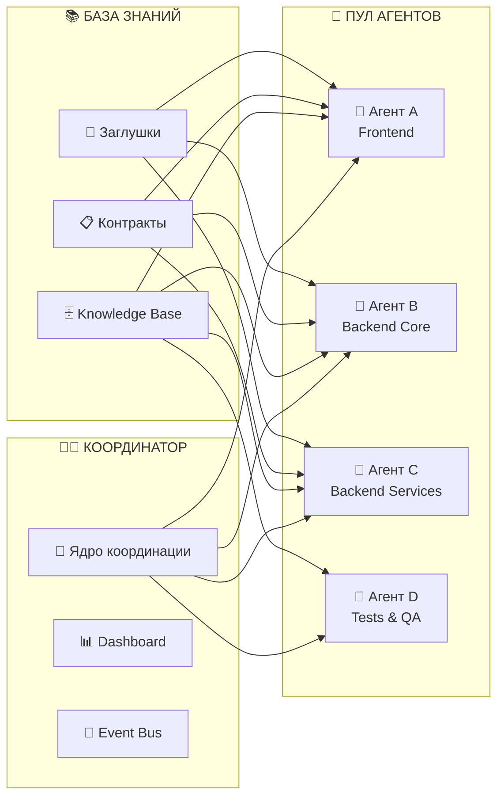
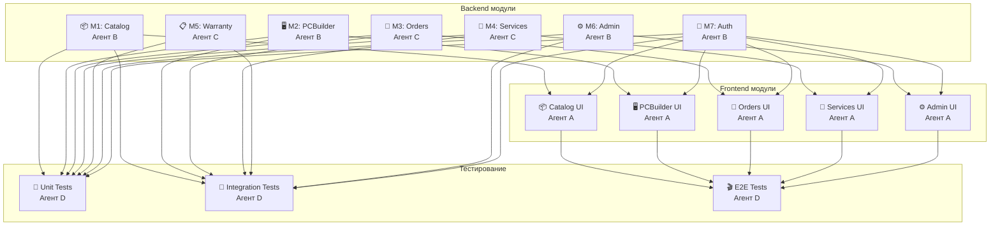
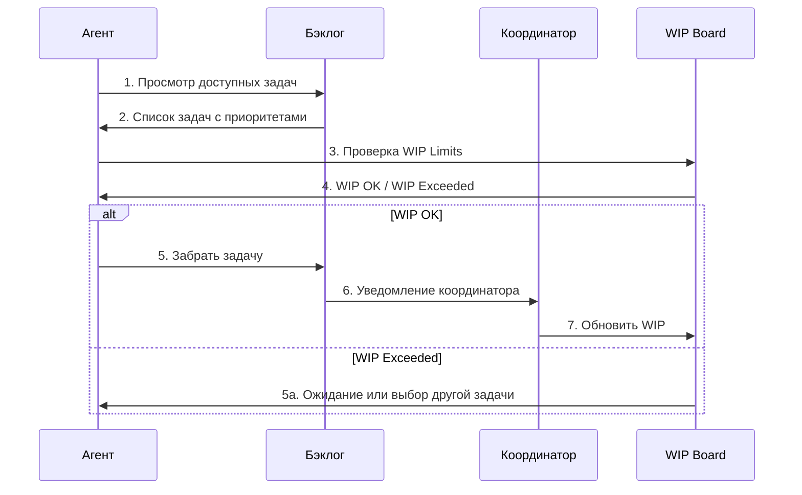
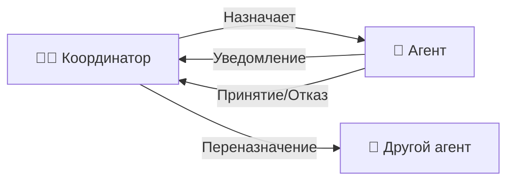
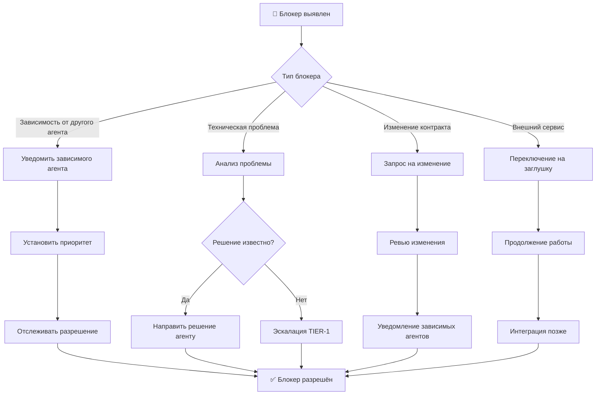
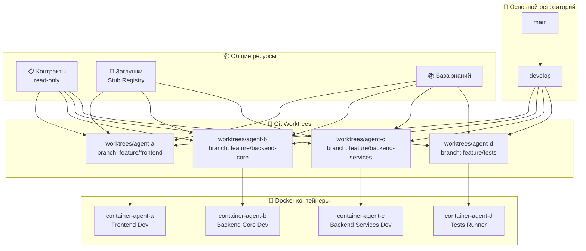
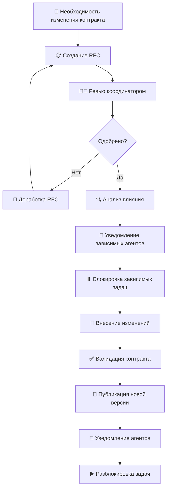
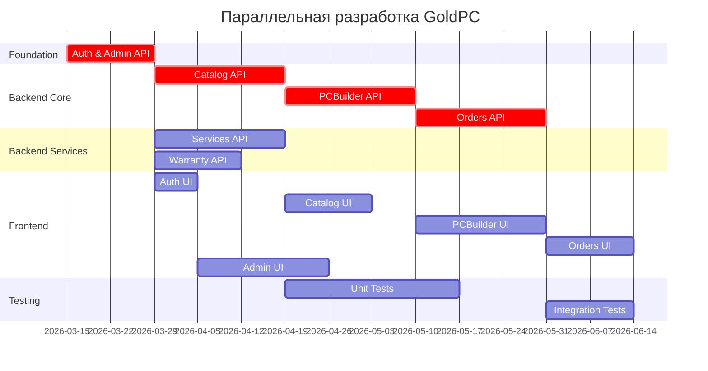
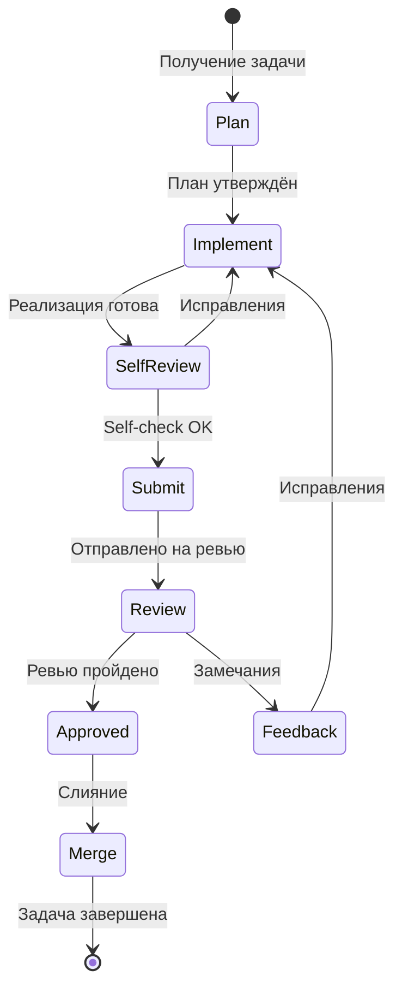

# Этап 5: Параллельная разработка

## ⚡ Организация параллельной работы нескольких ИИ-агентов

**Версия документа:** 1.0  
**Длительность этапа:** 8-12 недель  
**Ответственный:** Координатор (Agent Coordinator), TIER-1/2/3 Агенты

---

## Цель этапа

Организовать эффективную параллельную разработку модулей системы несколькими ИИ-агентами с синхронизацией через контракты, координацией через центрального координатора, использованием изолированных рабочих пространств и внедрением базы знаний в контекст каждого агента.

---

## Входные данные

| Данные | Источник |
|--------|----------|
| Среда разработки | [03-environment-setup.md](./03-environment-setup.md) |
| API контракты | [02-contracts-and-architecture.md](./02-contracts-and-architecture.md) |
| Умные заглушки | [04-stub-generation.md](./04-stub-generation.md) |
| Бэклог проекта | [01-requirements-analysis.md](./01-requirements-analysis.md) |
| Модули и зависимости | [01-requirements-analysis.md](./01-requirements-analysis.md) |
| Технологический стек | [Инструменты_для_разработки.md](./appendices/Инструменты_для_разработки.md) |

---

## Подробное описание действий

### 5.1 Введение: Подход к параллельной разработке

#### Принципы организации

Параллельная разработка в проекте GoldPC основана на микросервисной архитектуре и изолированных рабочих пространствах. Ключевые принципы:

| Принцип | Описание | Реализация |
|---------|----------|------------|
| **Contract-First** | Контракты определяют границы модулей | OpenAPI, Pact, AsyncAPI |
| **Изолированные пространства** | Каждый агент в своём worktree | Git worktree + Docker |
| **Координатор-Driven** | Единая точка координации | Dashboard, Event Bus |
| **Knowledge Injection** | Внедрение знаний в контекст | База знаний, паттерны |

#### Схема параллельной разработки



---

### 5.2 Распределение ролей и модулей

#### TIER-система агентов

```
🥇 TIER-1: Архитекторы
├── Проектирование контрактов
├── Архитектурные ревью
├── Принятие решений (ADR)
└── Координация команды

🥈 TIER-2: Разработчики
├── Реализация модулей
├── Написание тестов
├── Документация кода
└── Code review (cross-review)

🥉 TIER-3: Специалисты
├── Тестирование (QA)
├── DevOps задачи
├── Техническая документация
└── Интеграционные проверки
```

#### Таблица закрепления агентов за модулями

| Агент | Роль (TIER) | Модули (Backend) | Модули (Frontend) | Специализация |
|-------|-------------|------------------|-------------------|---------------|
| **Агент A** | TIER-2 | — | Catalog UI, PCBuilder UI, Orders UI, Services UI, Admin UI | Frontend-разработка, React, TypeScript |
| **Агент B** | TIER-2 | Auth, Catalog, PCBuilder, Admin | — | Backend Core, C#, ASP.NET Core, Безопасность |
| **Агент C** | TIER-2 | Orders, Services, Warranty | — | Backend Services, бизнес-логика, Domain Events |
| **Агент D** | TIER-3 | — | — | Тестирование, QA, интеграция |
| **Координатор** | TIER-1 | Все (архитектура) | Все (архитектура) | Координация, ревью, решения |

> ⚠️ **Примечание:** Распределение является примерным и может уточняться координатором в процессе разработки.

#### Детализация ответственности по модулям



#### Матрица зависимостей агентов

| Агент | Зависит от | Предоставляет |
|-------|------------|---------------|
| **Агент A** (Frontend) | Auth API, Catalog API, Orders API | UI компоненты, E2E тесты |
| **Агент B** (Backend Core) | — | Auth, Catalog, PCBuilder, Admin API |
| **Агент C** (Backend Services) | Auth API, Catalog API | Orders, Services, Warranty API + Events |
| **Агент D** (Tests) | Все API | Test suites, Coverage reports |

---

### 5.3 Процесс назначения задач

#### Механизм Pull-задач

Агенты самостоятельно забирают задачи из очереди (pull-модель), что обеспечивает:

- Автономность агентов
- Гибкое распределение нагрузки
- Учёт специализации



#### Альтернатива: Push-назначение

Для критических задач координатор может использовать push-модель:



#### WIP Limits для агентов

| Тип ограничения | Лимит | Обоснование |
|-----------------|-------|-------------|
| Задач в работе на агента | 2 | Фокусировка на завершении |
| Задач на Code Review | 2 | Качество ревью |
| Фич в спринте | 4 | Ограничение контекста |
| Активных агентов | 4 | Доступные ресурсы |

#### Процесс приоритизации задач

```yaml
# Приоритеты задач
priorities:
  critical:
    description: "Блокирует других агентов"
    examples:
      - "Auth API (блокирует все модули)"
      - "Database schema (блокирует миграции)"
    sla: "Начать немедленно"
    
  high:
    description: "Важная функциональность MVP"
    examples:
      - "Catalog API (основа магазина)"
      - "Orders API (бизнес-логика)"
    sla: "Начать в текущем спринте"
    
  medium:
    description: "Важная, но не блокирующая"
    examples:
      - "Warranty API"
      - "Admin UI"
    sla: "Начать после high"
    
  low:
    description: "Улучшения и оптимизации"
    examples:
      - "Performance optimization"
      - "Code refactoring"
    sla: "По возможности"
```

---

### 5.4 Синхронизация через координатора

#### Ежедневные отчёты агентов

**Шаблон отчёта агента:**

```markdown
# 📊 Ежедневный отчёт агента

**Агент:** [Имя агента]  
**Дата:** [YYYY-MM-DD]  
**Модуль:** [Текущий модуль]  

## Статус
- [ ] 🟢 On Track — идёт по плану
- [ ] 🟡 At Risk — есть риски
- [ ] 🔴 Blocked — заблокирован

## Прогресс
| Задача | Статус | % готовности |
|--------|--------|--------------|
| [Task-1] | In Progress | 60% |
| [Task-2] | Review | 90% |

## Завершённые задачи
- [x] [Task-X] — описание

## Блокеры
| Блокер | Влияние | Необходимо от |
|--------|---------|---------------|
| [Описание] | [Какие задачи блокирует] | [Кто может разблокировать] |

## План на завтра
1. [Задача 1]
2. [Задача 2]

## Вопросы к координатору
- [Вопрос 1]
```

#### Действия координатора при блокерах



#### Dashboard координатора

```typescript
// Интерфейс Dashboard координатора
interface CoordinatorDashboard {
  agents: AgentStatus[];
  tasks: TaskOverview;
  blockers: BlockerInfo[];
  metrics: SprintMetrics;
}

interface AgentStatus {
  id: string;
  name: string;
  tier: 'TIER-1' | 'TIER-2' | 'TIER-3';
  currentModule: string;
  currentTasks: Task[];
  progress: number; // 0-100
  status: 'Active' | 'Idle' | 'Blocked' | 'Review';
  lastUpdate: Date;
  wipCount: number;
}

interface BlockerInfo {
  id: string;
  reporter: string;
  description: string;
  impact: 'Low' | 'Medium' | 'High' | 'Critical';
  affectedTasks: string[];
  assignedTo?: string;
  createdAt: Date;
  resolvedAt?: Date;
}
```

#### Визуализация Dashboard

```
┌─────────────────────────────────────────────────────────────────┐
│                    📊 COORDINATOR DASHBOARD                      │
├─────────────────────────────────────────────────────────────────┤
│  Sprint Progress: ████████████░░░░ 75%  │  ETA: 2026-05-15     │
├─────────────────────────────────────────────────────────────────┤
│  AGENTS                                                          │
│  ┌─────────────┬──────────┬──────────┬────────┬───────────────┐ │
│  │ Agent       │ Module   │ Progress │ Status │ WIP           │ │
│  ├─────────────┼──────────┼──────────┼────────┼───────────────┤ │
│  │ Agent A     │ Frontend │ ████████ │ Active │ 2/2           │ │
│  │ Agent B     │ Catalog  │ ██████░░ │ Review │ 1/2           │ │
│  │ Agent C     │ Orders   │ ███░░░░░ │ Blocked│ 1/2           │ │
│  │ Agent D     │ Tests    │ ████████ │ Active │ 2/2           │ │
│  └─────────────┴──────────┴──────────┴────────┴───────────────┘ │
├─────────────────────────────────────────────────────────────────┤
│  🚨 BLOCKERS (1)                                                 │
│  • [BLOCK-001] Agent C: Ожидает обновления контракта Orders     │
│                 → Назначено: Agent B, ETA: сегодня 18:00        │
└─────────────────────────────────────────────────────────────────┘
```

---

### 5.5 Изоляция рабочих копий

#### Git Worktree для каждого агента

Использование `git worktree` позволяет каждому агенту работать в изолированном рабочем каталоге:

```bash
# Структура репозитория с worktrees
goldpc/
├── packages/
│   ├── backend/
│   └── frontend/
├── contracts/           # Контракты (read-only для агентов)
└── worktrees/           # Изолированные рабочие копии
    ├── agent-a/         # Frontend разработка
    ├── agent-b/         # Backend Core разработка
    ├── agent-c/         # Backend Services разработка
    └── agent-d/         # Tests разработка

# Команды создания worktree
git worktree add worktrees/agent-a -b feature/frontend-main
git worktree add worktrees/agent-b -b feature/backend-core
git worktree add worktrees/agent-c -b feature/backend-services
git worktree add worktrees/agent-d -b feature/tests
```

#### Схема изоляции



#### Получение актуальных контрактов и заглушек

| Ресурс | Способ получения | Частота обновления |
|--------|------------------|-------------------|
| OpenAPI контракты | Git pull из main | При изменении |
| Pact контракты | Pact Broker | При изменении |
| Заглушки | Stub Registry API | По запросу |
| База знаний | Git pull | Ежедневно |

```bash
#!/bin/bash
# sync-contracts.sh

echo "🔄 Синхронизация контрактов..."

# Получение последних контрактов
git fetch origin main
git checkout origin/main -- contracts/

# Обновление заглушек
curl -X GET http://stub-registry:4010/stubs/latest -o stubs/latest.json

# Обновление базы знаний
git pull origin main -- knowledge-base/

echo "✅ Синхронизация завершена"
```

---

### 5.6 Обновление контрактов

#### Процесс изменения API-контрактов

Изменение контрактов — критический процесс, требующий координации между агентами.



#### Механизм блокировки задач

```yaml
# Пример блокировки задач при изменении контракта
contract_change:
  id: "CC-001"
  contract: "orders-api"
  change_type: "breaking"  # breaking | non-breaking
  affected_agents:
    - agent-a  # Frontend зависит от Orders API
    - agent-d  # Tests зависят от Orders API
  
  blocked_tasks:
    - task-id: "TASK-123"
      agent: "agent-a"
      reason: "Ожидает обновления контракта Orders API"
    - task-id: "TASK-145"
      agent: "agent-d"
      reason: "Ожидает обновления тестов Orders"
  
  status: "in_progress"
  created_at: "2026-04-01T10:00:00Z"
  estimated_resolution: "2026-04-01T18:00:00Z"
```

#### Уведомление зависимых агентов

```csharp
// Сервис уведомлений об изменении контрактов
public class ContractChangeNotifier
{
    private readonly IEventBus _eventBus;
    private readonly IAgentRegistry _agentRegistry;
    
    public async Task NotifyContractChange(ContractChangeEvent changeEvent)
    {
        // Получение зависимых агентов
        var dependentAgents = await _agentRegistry
            .GetDependentAgentsAsync(changeEvent.ContractName);
        
        // Публикация события
        await _eventBus.PublishAsync(new ContractChangedEvent
        {
            ContractName = changeEvent.ContractName,
            Version = changeEvent.NewVersion,
            ChangeType = changeEvent.ChangeType,
            BreakingChanges = changeEvent.BreakingChanges,
            AffectedEndpoints = changeEvent.AffectedEndpoints,
            MigrationGuide = changeEvent.MigrationGuide
        });
        
        // Уведомление каждого агента
        foreach (var agent in dependentAgents)
        {
            await _eventBus.SendAsync(agent.Id, new AgentNotification
            {
                Type = "CONTRACT_CHANGE",
                Message = $"Контракт {changeEvent.ContractName} изменён",
                Action = "UPDATE_STUBS",
                Deadline = DateTime.UtcNow.AddHours(4)
            });
        }
    }
}
```

#### Версионирование контрактов

| Версия | Изменение | Совместимость | Действие агентов |
|--------|-----------|---------------|------------------|
| MAJOR | Breaking changes | ❌ Несовместимо | Обновление кода обязательно |
| MINOR | Новые эндпоинты | ✅ Совместимо | Опциональное обновление |
| PATCH | Исправления | ✅ Совместимо | Обновление заглушек |

---

### 5.7 Инструменты координации

#### Рекомендуемые инструменты

| Категория | Инструмент | Назначение | Интеграция |
|-----------|------------|------------|------------|
| **Управление задачами** | GitHub Projects | Канбан-доска, бэклог | GitHub Issues, PR |
| | Jira | Scrum/Kanban, отчёты | Webhooks, API |
| | Trello | Простая канбан-доска | Webhooks |
| **Коммуникация** | Slack | Чат, уведомления | Webhooks, bots |
| | Discord | Чат, голос | Webhooks |
| **CI/CD** | GitHub Actions | Автоматизация | Git-based |
| | GitLab CI | Автоматизация | Git-based |

#### Пример доски GitHub Projects

```
┌──────────────────────────────────────────────────────────────────────────┐
│                    📋 GoldPC Development Board                            │
├────────────┬────────────┬────────────┬────────────┬────────────┬─────────┤
│  Backlog   │   Ready    │ In Progress│   Review   │  Testing   │  Done   │
│    (15)    │    (4)     │    (3)     │    (2)     │    (1)     │  (12)   │
├────────────┼────────────┼────────────┼────────────┼────────────┼─────────┤
│ ┌────────┐ │ ┌────────┐ │ ┌────────┐ │ ┌────────┐ │ ┌────────┐ │ ┌─────┐ │
│ │ US-1.8 │ │ │ US-2.5 │ │ │ US-3.2 │ │ │ US-1.5 │ │ │ US-2.3 │ │ │US-1.1│ │
│ │ Review │ │ │ Agent B│ │ │ Agent C│ │ │ Agent A│ │ │ Agent D│ │ │Done │ │
│ └────────┘ │ └────────┘ │ └────────┘ │ └────────┘ │ └────────┘ │ └─────┘ │
│ ┌────────┐ │ ┌────────┐ │ ┌────────┐ │ ┌────────┐ │            │ ┌─────┐ │
│ │ US-4.2 │ │ │ US-3.4 │ │ │ US-2.4 │ │ │ US-3.1 │ │            │ │US-1.2│ │
│ │ Medium │ │ │ High   │ │ │ Agent A│ │ │ Agent B│ │            │ │Done │ │
│ └────────┘ │ └────────┘ │ └────────┘ │ └────────┘ │            │ └─────┘ │
│            │            │            │            │            │         │
│   ...      │   ...      │   ...      │   ...      │   ...      │  ...    │
└────────────┴────────────┴────────────┴────────────┴────────────┴─────────┘
```

#### Webhooks и уведомления

```yaml
# .github/workflows/agent-notification.yml
name: Agent Notification

on:
  issues:
    types: [opened, assigned, closed]
  pull_request:
    types: [opened, reviewed, merged]

jobs:
  notify:
    runs-on: ubuntu-latest
    steps:
      - name: Notify Coordinator
        run: |
          curl -X POST ${{ secrets.COORDINATOR_WEBHOOK }} \
            -H 'Content-Type: application/json' \
            -d '{
              "event": "${{ github.event_name }}",
              "agent": "${{ github.actor }}",
              "action": "${{ github.event.action }}",
              "issue": "${{ github.event.issue.number }}",
              "repository": "${{ github.repository }}"
            }'
```

---

### 5.8 Knowledge Injection

#### Структура базы знаний

```
knowledge-base/
├── patterns/
│   ├── repository-pattern.md
│   ├── cqrs.md
│   ├── domain-events.md
│   ├── saga.md
│   └── react-best-practices.md
├── contracts/
│   ├── openapi/
│   │   ├── auth.yaml
│   │   ├── catalog.yaml
│   │   └── orders.yaml
│   └── asyncapi/
│       └── events.yaml
├── lessons-learned/
│   ├── frontend/
│   └── backend/
└── architecture/
    ├── adr/
    └── decisions/
```

#### Внедрение знаний в контекст агентов

```yaml
# knowledge-injection.yaml
agent_a:
  role: "Frontend Developer"
  modules: ["catalog-ui", "pc-builder-ui", "orders-ui", "admin-ui"]
  injected_knowledge:
    - "patterns/react-best-practices.md"
    - "patterns/mui-components.md"
    - "contracts/openapi/catalog.yaml"
    - "contracts/openapi/orders.yaml"
  lessons_learned: "lessons/frontend/"
  
agent_b:
  role: "Backend Core Developer"
  modules: ["auth", "catalog", "pc-builder", "admin"]
  injected_knowledge:
    - "patterns/repository-pattern.md"
    - "patterns/cqrs.md"
    - "contracts/openapi/auth.yaml"
    - "contracts/openapi/catalog.yaml"
  lessons_learned: "lessons/backend/"

agent_c:
  role: "Backend Services Developer"
  modules: ["orders", "services", "warranty"]
  injected_knowledge:
    - "patterns/domain-events.md"
    - "patterns/saga.md"
    - "contracts/openapi/orders.yaml"
    - "contracts/asyncapi/events.yaml"
  lessons_learned: "lessons/backend/"

agent_d:
  role: "QA Engineer"
  modules: ["tests", "integration", "e2e"]
  injected_knowledge:
    - "patterns/testing-strategies.md"
    - "patterns/pact-testing.md"
  lessons_learned: "lessons/testing/"
```

#### Пример документа знаний

```markdown
# knowledge-base/patterns/repository-pattern.md

## Repository Pattern в GoldPC

### Структура интерфейса

\`\`\`csharp
public interface IRepository<T> where T : BaseEntity
{
    Task<T?> GetByIdAsync(Guid id);
    Task<PagedResult<T>> GetPagedAsync(int page, int limit, Specification<T>? spec = null);
    Task AddAsync(T entity);
    Task UpdateAsync(T entity);
    Task DeleteAsync(Guid id);
}
\`\`\`

### Правила использования

1. Всегда использовать интерфейс IRepository<T>
2. Не использовать DbContext напрямую в сервисах
3. Для сложных запросов использовать Specification pattern
4. Все методы должны быть асинхронными

### Пример реализации

\`\`\`csharp
// ProductRepository.cs
public class ProductRepository : Repository<Product>, IProductRepository
{
    public async Task<IEnumerable<Product>> GetByCategoryAsync(string category)
    {
        return await _db.Products
            .Where(p => p.Category.Slug == category)
            .Include(p => p.Manufacturer)
            .ToListAsync();
    }
}
\`\`\`

### Типичные ошибки

- ❌ Прямое использование DbSet в контроллерах
- ❌ Синхронные методы в репозитории
- ❌ Пропуск Include для навигационных свойств
```

---

### 5.9 Расписание разработки

#### Диаграмма Ганта



#### Детальное расписание по спринтам

| Спринт | Неделя | Модуль | Агент | Зависимости |
|--------|--------|--------|-------|-------------|
| S1 | 1-2 | Auth API | Agent B | — |
| S1 | 1-2 | Auth UI | Agent A | Auth API (stub) |
| S1 | 1-2 | Admin API | Agent B | Auth API |
| S2 | 3-4 | Catalog API | Agent B | Auth API |
| S2 | 3-4 | Catalog UI | Agent A | Catalog API (stub) |
| S2 | 3-4 | Services API | Agent C | Auth API |
| S3 | 5-6 | PCBuilder API | Agent B | Catalog API |
| S3 | 5-6 | PCBuilder UI | Agent A | PCBuilder API (stub) |
| S3 | 5-6 | Warranty API | Agent C | Auth API |
| S4 | 7-8 | Orders API | Agent C | Catalog API, PCBuilder API |
| S4 | 7-8 | Orders UI | Agent A | Orders API (stub) |
| S5 | 9-10 | Integration | All | All APIs |
| S5 | 9-10 | Admin UI | Agent A | Admin API |
| S6 | 11-12 | E2E Tests | Agent D | All modules |
| S6 | 11-12 | Documentation | All | — |

---

### 5.10 Управление конфликтами

#### Типы конфликтов и их разрешение

| Тип | Описание | Решение |
|-----|----------|---------|
| **API контракт** | Изменение сигнатуры | Agent Duel + Peer Vote |
| **Database schema** | Конфликт миграций | Архитектор решает |
| **Frontend/Backend** | Несоответствие данных | Pact tests |
| **Shared код** | Дублирование | Code ownership |
| **Зависимости** | Версии пакетов | Архитектор решает |

#### Agent Duel Protocol

```mermaid
sequenceDiagram
    participant A as Agent A
    participant C as Coordinator
    participant B as Agent B
    participant V as Peer Voters
    
    A->>C: Предлагает решение X
    B->>C: Предлагает решение Y
    C->>V: Отправляет оба решения на голосование
    V->>C: Голосуют
    C->>A,B: Объявляет победителя
    C->>KB: Сохраняет урок
```

#### Процесс разрешения конфликта

```yaml
# conflict-resolution.yaml
conflict_resolution_process:
  step_1_identification:
    actor: "Agent"
    action: "Определение конфликта"
    output: "Conflict Report"
    
  step_2_notification:
    actor: "Agent"
    action: "Уведомление координатора"
    output: "Notification to Coordinator"
    
  step_3_analysis:
    actor: "Coordinator"
    action: "Анализ конфликта"
    questions:
      - "Тип конфликта?"
      - "Влияние на другие модули?"
      - "Срочность решения?"
      
  step_4_resolution:
    actor: "Coordinator"
    action: "Выбор метода решения"
    methods:
      - "Agent Duel (для технических решений)"
      - "Architect Decision (для архитектурных)"
      - "Consensus (для несущественных)"
      
  step_5_implementation:
    actor: "Agents"
    action: "Реализация решения"
    output: "Updated Code"
    
  step_6_documentation:
    actor: "Coordinator"
    action: "Документирование урока"
    output: "Lesson Learned"
```

---

### 5.11 Рабочий процесс агента

#### Цикл разработки



#### Чек-лист Self-Review для агентов

```markdown
## Self-Review Checklist

### Код
- [ ] Код компилируется без ошибок
- [ ] Нет warning'ов
- [ ] Соблюдены naming conventions
- [ ] Нет дублирования кода
- [ ] Добавлены комментарии где нужно

### Тесты
- [ ] Unit тесты написаны
- [ ] Все тесты проходят
- [ ] Покрытие кода ≥70%

### Документация
- [ ] XML documentation comments добавлены
- [ ] README обновлён (если нужно)

### Контракты
- [ ] API соответствует OpenAPI спецификации
- [ ] Pact тесты проходят

### Безопасность
- [ ] Нет hardcoded секретов
- [ ] Валидация входных данных
- [ ] Авторизация на эндпоинтах
```

#### Автоматизированные проверки

```yaml
# .github/workflows/agent-ci.yml
name: Agent CI Checks

on:
  push:
    branches: ['feature/**']
  pull_request:
    branches: [main, develop]

jobs:
  build-and-test:
    runs-on: ubuntu-latest
    steps:
      - uses: actions/checkout@v4
      
      - name: Setup .NET
        uses: actions/setup-dotnet@v4
        with:
          dotnet-version: '8.0.x'
      
      - name: Build
        run: dotnet build --configuration Release --no-incremental
        
      - name: Test
        run: dotnet test --configuration Release --no-build --collect:"XPlat Code Coverage"
        
      - name: Coverage Check
        run: |
          coverage=$(find . -name "coverage.cobertura.xml" -exec dotnet-coverage merge {} -o merged.xml \; && dotnet-coverage report merged.xml --report-type Console | grep -oP 'Total coverage: \K[0-9.]+')
          if (( $(echo "$coverage < 70" | bc -l) )); then
            echo "❌ Coverage $coverage% is below 70% threshold"
            exit 1
          fi
          echo "✅ Coverage $coverage% meets threshold"
          
      - name: Lint
        run: |
          dotnet format --verify-no-changes --verbosity diagnostic
          
      - name: Security Scan
        run: |
          dotnet list package --vulnerable --include-transitive
          dotnet list package --deprecated
```

---

### 5.12 Выходные артефакты по спринтам

#### Sprint 1-2: Foundation (2-4 недели)

| Артефакт | Модуль | Ответственный | Статус |
|----------|--------|---------------|--------|
| Auth API | Auth | Agent B | ✅ Implemented |
| Auth UI | Auth | Agent A | ✅ Implemented |
| Admin API | Admin | Agent B | ✅ Implemented |
| Database migrations | Infrastructure | Agent D | ✅ Implemented |
| Unit tests (Auth) | Tests | Agent D | ✅ Implemented |

#### Sprint 3-4: Core (4-6 недель)

| Артефакт | Модуль | Ответственный | Статус |
|----------|--------|---------------|--------|
| Catalog API | Catalog | Agent B | ✅ Implemented |
| Catalog UI | Catalog | Agent A | ✅ Implemented |
| PCBuilder API | PCBuilder | Agent B | ✅ Implemented |
| PCBuilder UI | PCBuilder | Agent A | ✅ Implemented |
| Integration tests | Tests | Agent D | ✅ Implemented |

#### Sprint 5-6: Business Logic (6-8 недель)

| Артефакт | Модуль | Ответственный | Статус |
|----------|--------|---------------|--------|
| Orders API | Orders | Agent C | ✅ Implemented |
| Orders UI | Orders | Agent A | ✅ Implemented |
| Services API | Services | Agent C | ✅ Implemented |
| Services UI | Services | Agent A | ✅ Implemented |
| Warranty API | Warranty | Agent C | ✅ Implemented |

#### Sprint 7-8: Finalization (8-12 недель)

| Артефакт | Модуль | Ответственный | Статус |
|----------|--------|---------------|--------|
| Admin UI | Admin | Agent A | ✅ Implemented |
| E2E tests | Tests | Agent D | ✅ Implemented |
| Performance tests | Tests | Agent D | ✅ Implemented |
| Documentation | Docs | All | ✅ Implemented |
| Deployment | DevOps | Agent D | ✅ Implemented |

---

## Критерии готовности (Definition of Done)

### Для модуля

- [ ] Код компилируется без ошибок
- [ ] Все unit тесты проходят
- [ ] Покрытие кода ≥70%
- [ ] Интеграционные тесты проходят
- [ ] API соответствует контрактам
- [ ] Code review пройден
- [ ] Документация обновлена
- [ ] Нет критических vulnerabilities

### Для спринта

- [ ] Все запланированные модули готовы
- [ ] Frontend подключён к Backend
- [ ] Pact тесты проходят
- [ ] Демо проведено
- [ ] Ретроспектива завершена

### Для этапа

- [ ] Все модули реализованы
- [ ] Все API соответствуют контрактам
- [ ] Unit тесты ≥70% покрытия
- [ ] Integration тесты проходят
- [ ] Frontend работает с реальным API
- [ ] Code review пройден
- [ ] Документация обновлена

---

## Возможные риски и митигация

| Риск | Вероятность | Влияние | Меры митигации |
|------|-------------|---------|----------------|
| Блокировка агента | Средняя | Среднее | Перераспределение задач |
| Конфликт контрактов | Низкая | Высокое | Versioning + RFC |
| Несогласованность | Средняя | Среднее | Daily sync + Dashboard |
| Низкое качество кода | Средняя | Высокое | Anti-Neuroslop checks |
| Перегрузка координатора | Средняя | Среднее | Автоматизация рутины |
| Потеря контекста | Средняя | Высокое | Knowledge base + Lessons |
| Технический долг | Высокая | Среднее | Рефакторинг спринты |

---

## Переход к следующему этапу

Для перехода к этапу [06-quality-checks.md](./06-quality-checks.md) необходимо:

1. ✅ Все модули в состоянии "Implemented"
2. ✅ Unit тесты написаны
3. ✅ Интеграция с реальной БД работает
4. ✅ Frontend подключён к Backend
5. ✅ Все контракты валидны
6. ✅ Pact тесты проходят

---

## Связанные документы

- [README.md](./README.md) — Обзор плана
- [02-contracts-and-architecture.md](./02-contracts-and-architecture.md) — Контракты
- [04-stub-generation.md](./04-stub-generation.md) — Заглушки
- [06-quality-checks.md](./06-quality-checks.md) — Проверки качества
- [09-code-review-and-integration.md](./09-code-review-and-integration.md) — Ревью

---

*Документ создан в рамках плана разработки GoldPC.*