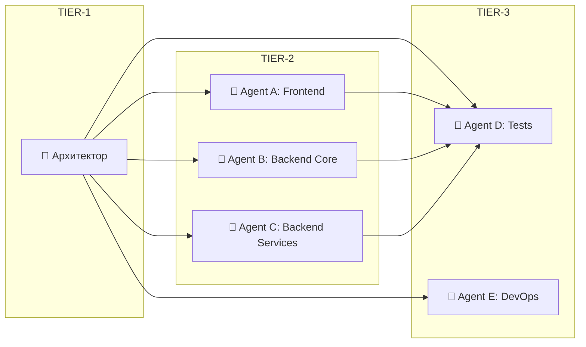
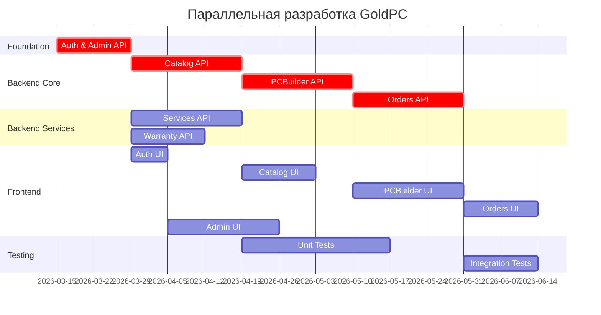
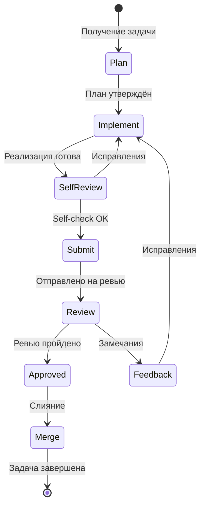

# Этап 5: Параллельная разработка

## ⚡ ПАРАЛЛЕЛЬНАЯ РАЗРАБОТКА

**Версия документа:** 1.0  
**Длительность этапа:** 8-12 недель  
**Ответственный:** Координатор, TIER-1/2/3 Агенты

---

## Цель этапа

Организовать параллельную разработку модулей системы несколькими ИИ-агентами с синхронизацией через контракты и базу знаний.

---

## Входные данные

| Данные | Источник |
|--------|----------|
| Среда разработки | [03-environment-setup.md](./03-environment-setup.md) |
| API контракты | [02-contracts-and-architecture.md](./02-contracts-and-architecture.md) |
| Умные заглушки | [04-stub-generation.md](./04-stub-generation.md) |
| Бэклог проекта | [01-requirements-analysis.md](./01-requirements-analysis.md) |

---

## Подробное описание действий

### 5.1 Организация пула агентов

#### TIER-система

```
🥇 TIER-1: Архитекторы
├── Проектирование контрактов
├── Архитектурные ревью
├── Принятие решений
└── Координация

🥈 TIER-2: Разработчики
├── Реализация модулей
├── Написание тестов
├── Документация
└── Code review

🥉 TIER-3: Специалисты
├── Тестирование
├── DevOps задачи
├── Документация
└── QA проверки
```

#### Распределение агентов по модулям



---

### 5.2 Knowledge Injection

#### Внедрение знаний в контекст агентов

```yaml
# knowledge-injection.yaml
agent_a:
  role: "Frontend Developer"
  modules: ["catalog-ui", "pc-builder-ui", "orders-ui", "admin-ui"]
  injected_knowledge:
    - "patterns/react-best-practices.md"
    - "patterns/mui-components.md"
    - "contracts/frontend-api-contracts.yaml"
  lessons_learned: "lessons/frontend/"
  
agent_b:
  role: "Backend Core Developer"
  modules: ["auth", "catalog", "pc-builder"]
  injected_knowledge:
    - "patterns/repository-pattern.md"
    - "patterns/cqrs.md"
    - "contracts/openapi-auth.yaml"
    - "contracts/openapi-catalog.yaml"
  lessons_learned: "lessons/backend/"

agent_c:
  role: "Backend Services Developer"
  modules: ["orders", "services", "warranty"]
  injected_knowledge:
    - "patterns/domain-events.md"
    - "patterns/saga.md"
    - "contracts/openapi-orders.yaml"
  lessons_learned: "lessons/backend/"
```

#### Пример внедрения знаний

```markdown
# knowledge-base/patterns/repository-pattern.md

## Repository Pattern в GoldPC

### Структура
```csharp
public interface IRepository<T> where T : BaseEntity
{
    Task<T?> GetByIdAsync(Guid id);
    Task<PagedResult<T>> GetPagedAsync(int page, int limit, Specification<T>? spec = null);
    Task AddAsync(T entity);
    Task UpdateAsync(T entity);
    Task DeleteAsync(Guid id);
}
```

### Правила использования
1. Всегда использовать интерфейс IRepository<T>
2. Не использовать DbContext напрямую в сервисах
3. Для сложных запросов использовать Specification pattern

### Пример из проекта
```csharp
// ProductRepository.cs
public class ProductRepository : Repository<Product>, IProductRepository
{
    public async Task<IEnumerable<Product>> GetByCategoryAsync(string category)
    {
        return await _db.Products
            .Where(p => p.Category.Slug == category)
            .Include(p => p.Manufacturer)
            .ToListAsync();
    }
}
```
```

---

### 5.3 Расписание разработки



---

### 5.4 Синхронизация агентов

#### Event Bus для координации

```csharp
// События синхронизации
public record AgentProgressEvent
{
    public string AgentId { get; init; } = string.Empty;
    public string Module { get; init; } = string.Empty;
    public string Status { get; init; } = string.Empty; // Started, InProgress, Completed, Blocked
    public int ProgressPercent { get; init; }
    public List<string> CompletedTasks { get; init; } = new();
    public List<string> PendingTasks { get; init; } = new();
    public List<string> Blockers { get; init; } = new();
    public DateTime Timestamp { get; init; } = DateTime.UtcNow;
}

// Публикация прогресса
public class AgentReporter
{
    private readonly IEventBus _eventBus;
    
    public async Task ReportProgressAsync(string agentId, string module, int progress)
    {
        await _eventBus.PublishAsync(new AgentProgressEvent
        {
            AgentId = agentId,
            Module = module,
            ProgressPercent = progress,
            Timestamp = DateTime.UtcNow
        });
    }
    
    public async Task ReportBlockerAsync(string agentId, string module, string blocker)
    {
        await _eventBus.PublishAsync(new AgentProgressEvent
        {
            AgentId = agentId,
            Module = module,
            Status = "Blocked",
            Blockers = new List<string> { blocker }
        });
    }
}
```

#### Dashboard координатора

```typescript
// Dashboard компонент
interface AgentStatus {
  id: string;
  role: string;
  currentModule: string;
  progress: number;
  status: 'Active' | 'Idle' | 'Blocked' | 'Completed';
  lastUpdate: Date;
  blockers: string[];
}

const CoordinatorDashboard: React.FC = () => {
  const [agents, setAgents] = useState<AgentStatus[]>([]);
  
  useEffect(() => {
    const ws = new WebSocket('ws://localhost:5000/hub/agents');
    ws.onmessage = (event) => {
      const status = JSON.parse(event.data);
      setAgents(prev => {
        const idx = prev.findIndex(a => a.id === status.id);
        if (idx >= 0) {
          const updated = [...prev];
          updated[idx] = status;
          return updated;
        }
        return [...prev, status];
      });
    };
    return () => ws.close();
  }, []);
  
  return (
    <div className="dashboard">
      <h1>Coordinator Dashboard</h1>
      <div className="agents-grid">
        {agents.map(agent => (
          <AgentCard key={agent.id} agent={agent} />
        ))}
      </div>
    </div>
  );
};
```

---

### 5.5 Управление конфликтами

#### Типы конфликтов и их разрешение

| Тип | Описание | Решение |
|-----|----------|---------|
| API контракт | Изменение сигнатуры | Agent Duel + Peer Vote |
| Database schema | Конфликт миграций | Архитектор решает |
| Frontend/Backend | Несоответствие данных | Pact tests |
| Shared код | Дублирование | Code ownership |

#### Agent Duel Protocol

```mermaid
sequenceDiagram
    participant A as Agent A
    participant C as Coordinator
    participant B as Agent B
    participant V as Peer Voters
    
    A->>C: Предлагает решение X
    B->>C: Предлагает решение Y
    C->>V: Отправляет оба решения на голосование
    V->>C: Голосуют
    C->>A,B: Объявляет победителя
    C->>KB: Сохраняет урок
```

---

### 5.6 Рабочий процесс агента

#### Цикл разработки



#### Чек-лист Self-Review для агентов

```markdown
## Self-Review Checklist

### Код
- [ ] Код компилируется без ошибок
- [ ] Нет warning'ов
- [ ] Соблюдены naming conventions
- [ ] Нет дублирования кода
- [ ] Добавлены комментарии где нужно

### Тесты
- [ ] Unit тесты написаны
- [ ] Все тесты проходят
- [ ] Покрытие кода ≥70%

### Документация
- [ ] XML documentation comments добавлены
- [ ] README обновлён (если нужно)

### Контракты
- [ ] API соответствует OpenAPI спецификации
- [ ] Pact тесты проходят

### Безопасность
- [ ] Нет hardcoded секретов
- [ ] Валидация входных данных
- [ ] Авторизация на эндпоинтах
```

---

### 5.7 Выходные артефакты по спринтам

#### Sprint 1-2: Foundation (2 недели)

| Артефакт | Модуль | Ответственный |
|----------|--------|---------------|
| Auth API | Auth | Agent B |
| Auth UI | Auth | Agent A |
| Admin API | Admin | Agent B |
| Database migrations | Infrastructure | Agent E |
| Unit tests | Tests | Agent D |

#### Sprint 3-4: Core (4 недели)

| Артефакт | Модуль | Ответственный |
|----------|--------|---------------|
| Catalog API | Catalog | Agent B |
| Catalog UI | Catalog | Agent A |
| PCBuilder API | PCBuilder | Agent B |
| PCBuilder UI | PCBuilder | Agent A |
| Integration tests | Tests | Agent D |

#### Sprint 5-6: Business Logic (4 недели)

| Артефакт | Модуль | Ответственный |
|----------|--------|---------------|
| Orders API | Orders | Agent C |
| Orders UI | Orders | Agent A |
| Services API | Services | Agent C |
| Services UI | Services | Agent A |
| Warranty API | Warranty | Agent C |

#### Sprint 7-8: Finalization (4 недели)

| Артефакт | Модуль | Ответственный |
|----------|--------|---------------|
| Admin UI | Admin | Agent A |
| E2E tests | Tests | Agent D |
| Performance tests | Tests | Agent D |
| Documentation | Docs | Agent E |
| Deployment | DevOps | Agent E |

---

## Критерии готовности (Definition of Done)

- [ ] Все модули реализованы
- [ ] Все API соответствуют контрактам
- [ ] Unit тесты ≥70% покрытия
- [ ] Integration тесты проходят
- [ ] Frontend работает с реальным API
- [ ] Code review пройден
- [ ] Документация обновлена

---

## Возможные риски и митигация

| Риск | Вероятность | Влияние | Меры митигации |
|------|-------------|---------|----------------|
| Блокировка агента | Средняя | Среднее | Перераспределение задач |
| Конфликт контрактов | Низкая | Высокое | Versioning |
| Несогласованность | Средняя | Среднее | Daily sync |
| Низкое качество кода | Средняя | Высокое | Anti-Neuroslop checks |

---

## Переход к следующему этапу

Для перехода к этапу [06-quality-checks.md](./06-quality-checks.md) необходимо:

1. ✅ Все модули в состоянии "Implemented"
2. ✅ Unit тесты написаны
3. ✅ Интеграция с реальной БД работает
4. ✅ Frontend подключён к Backend

---

## Связанные документы

- [README.md](./README.md) — Обзор плана
- [06-quality-checks.md](./06-quality-checks.md) — Проверки качества
- [09-code-review-and-integration.md](./09-code-review-and-integration.md) — Ревью

---

*Документ создан в рамках плана разработки GoldPC.*