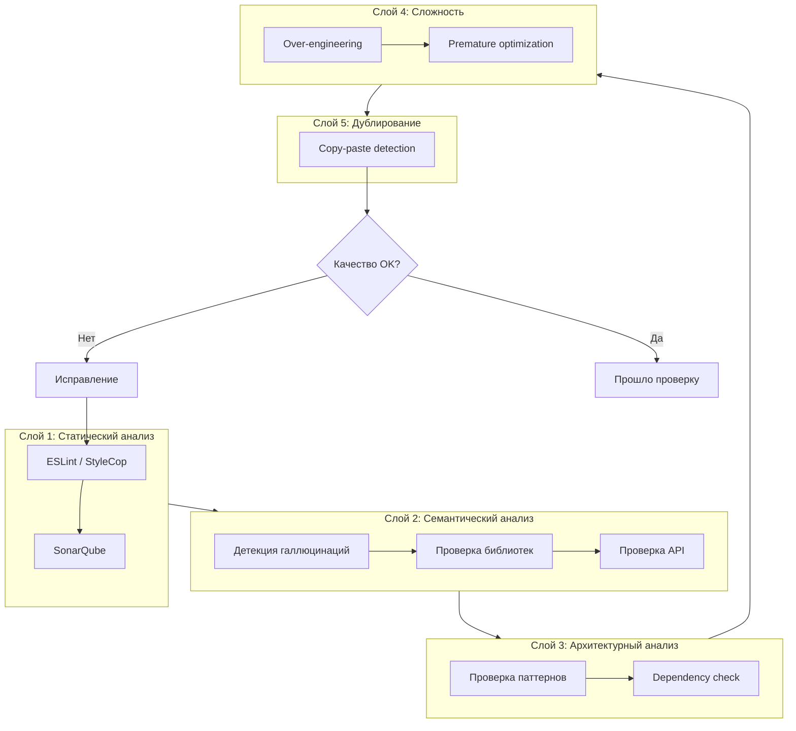

# Этап 6: Anti-Neuroslop проверки качества

## 🛡️ Anti-Neuroslop Shield — 5 слоёв

**Версия документа:** 1.0  
**Длительность этапа:** Постоянно (в процессе разработки)  
**Ответственный:** TIER-1 Архитектор, QA

---

## Цель этапа

Реализовать и поддерживать 5-слойную систему защиты от низкокачественного ИИ-сгенерированного кода (нейрослопа).

---

## Входные данные

| Данные | Источник |
|--------|----------|
| Исходный код | [05-parallel-development.md](./05-parallel-development.md) |
| Coding standards | ТЗ |
| API контракты | [02-contracts-and-architecture.md](./02-contracts-and-architecture.md) |

---

## Архитектура Anti-Neuroslop Shield



---

## Слой 1: Статический анализ

### 1.1 ESLint / StyleCop конфигурация

```javascript
// .eslintrc.js
module.exports = {
  root: true,
  extends: [
    'eslint:recommended',
    'plugin:@typescript-eslint/recommended',
    'plugin:react/recommended',
    'plugin:react-hooks/recommended',
    'prettier'
  ],
  rules: {
    // Анти-нейрослоп правила
    'no-console': 'warn',
    'no-debugger': 'error',
    'no-unused-vars': 'error',
    '@typescript-eslint/no-explicit-any': 'error',
    '@typescript-eslint/explicit-function-return-type': 'warn',
    
    // Качество кода
    'complexity': ['error', 10],
    'max-depth': ['error', 3],
    'max-lines-per-function': ['error', 50],
    'max-lines': ['error', 300],
    
    // React специфичные
    'react/prop-types': 'off',
    'react-hooks/rules-of-hooks': 'error',
    'react-hooks/exhaustive-deps': 'warn'
  }
};
```

### 1.2 StyleCop для C#

```xml
<!-- stylecop.json -->
{
  "settings": {
    "documentationRules": {
      "companyName": "GoldPC",
      "copyrightText": "Copyright (c) {companyName}. All rights reserved.",
      "documentExposedElements": true,
      "documentInterfaces": true,
      "documentInternalElements": false
    },
    "indentation": {
      "indentationSize": 4,
      "tabSize": 4,
      "useTabs": false
    },
    "layoutRules": {
      "newlineAtEndOfFile": "require"
    },
    "namingRules": {
      "allowCommonHungarianPrefixes": false
    }
  }
}
```

### 1.3 SonarQube конфигурация

```xml
<!-- SonarQube.Analysis.xml -->
<SonarQubeAnalysisProperties>
  <Property Name="sonar.projectKey">goldpc</Property>
  <Property Name="sonar.projectName">GoldPC</Property>
  <Property Name="sonar.sources">src/backend,src/frontend/src</Property>
  <Property Name="sonar.tests">src/backend/GoldPC.Tests</Property>
  <Property Name="sonar.coverage.exclusions">**/*.spec.ts,**/*.test.ts</Property>
  
  <!-- Quality Gate -->
  <Property Name="sonar.qualitygate.wait">true</Property>
  <Property Name="sonar.qualitygate.timeout">300</Property>
  
  <!-- Правила качества -->
  <Property Name="sonar.cs.rules.enable">true</Property>
  <Property Name="sonar.typescript.rules.enable">true</Property>
</SonarQubeAnalysisProperties>
```

---

## Слой 2: Семантический анализ

### 2.1 Детекция галлюцинаций ИИ

```csharp
// Инструмент для проверки существования библиотек
public class HallucinationDetector
{
    private readonly HttpClient _httpClient;
    private readonly HashSet<string> _knownPackages;
    
    public async Task<ValidationResult> ValidateDependenciesAsync(string projectPath)
    {
        var packages = await ParsePackagesAsync(projectPath);
        var unknownPackages = new List<string>();
        
        foreach (var package in packages)
        {
            if (!await IsKnownPackageAsync(package))
            {
                unknownPackages.Add(package);
            }
        }
        
        return new ValidationResult
        {
            IsValid = unknownPackages.Count == 0,
            UnknownPackages = unknownPackages,
            Warning = unknownPackages.Count > 0 
                ? $"Найдены потенциально несуществующие пакеты: {string.Join(", ", unknownPackages)}"
                : null
        };
    }
    
    private async Task<bool> IsKnownPackageAsync(string packageName)
    {
        // Проверка в NuGet
        var nugetResponse = await _httpClient.GetAsync($"https://api.nuget.org/v3/registration5-semver1/{packageName.ToLower()}/index.json");
        return nugetResponse.IsSuccessStatusCode;
    }
}
```

### 2.2 Проверка API endpoints

```typescript
// scripts/validate-api.ts
import { OpenAPIValidator } from './openapi-validator';
import { codeParser } from './code-parser';

export async function validateImplementedEndpoints(
  openApiSpec: string,
  codePath: string
): Promise<ValidationReport> {
  
  const specEndpoints = await OpenAPIValidator.parseEndpoints(openApiSpec);
  const implementedEndpoints = await codeParser.extractEndpoints(codePath);
  
  const missing: string[] = [];
  const extra: string[] = [];
  
  // Проверка: все ли endpoints из spec реализованы
  for (const endpoint of specEndpoints) {
    if (!implementedEndpoints.find(e => e.matches(endpoint))) {
      missing.push(endpoint.toString());
    }
  }
  
  // Проверка: нет ли лишних endpoints
  for (const endpoint of implementedEndpoints) {
    if (!specEndpoints.find(e => e.matches(endpoint))) {
      extra.push(endpoint.toString());
    }
  }
  
  return {
    missingEndpoints: missing,
    extraEndpoints: extra,
    isValid: missing.length === 0 && extra.length === 0
  };
}
```

### 2.3 Проверка несуществующих библиотек

```yaml
# .github/workflows/hallucination-check.yml
name: Hallucination Check

on: [push, pull_request]

jobs:
  check-dependencies:
    runs-on: ubuntu-latest
    steps:
      - uses: actions/checkout@v4
      
      - name: Check NuGet packages
        run: |
          dotnet restore
          dotnet list package --include-transitive > packages.txt
          node scripts/validate-nuget-packages.js packages.txt
      
      - name: Check npm packages
        run: |
          cd src/frontend
          npm install
          npm ls --json > packages.json
          node scripts/validate-npm-packages.js packages.json
      
      - name: Fail on unknown packages
        run: |
          if [ -f "unknown-packages.txt" ]; then
            echo "Found potentially hallucinated packages:"
            cat unknown-packages.txt
            exit 1
          fi
```

---

## Слой 3: Архитектурный анализ

### 3.1 Проверка зависимостей

```csharp
// tests/ArchitectureTests/DependencyTests.cs
using NetArchTest.Rules;
using FluentAssertions;

public class ArchitectureTests
{
    [Fact]
    public void Core_Should_Not_Depend_On_Infrastructure()
    {
        var result = Types.InAssembly(typeof(Core.AssemblyReference).Assembly)
            .Should()
            .NotHaveDependencyOn("GoldPC.Infrastructure")
            .GetResult();
        
        result.IsSuccessful.Should().BeTrue();
    }
    
    [Fact]
    public void Api_Should_Not_Depend_On_Infrastructure_Directly()
    {
        var result = Types.InAssembly(typeof(Api.AssemblyReference).Assembly)
            .Should()
            .NotHaveDependencyOn("Microsoft.EntityFrameworkCore")
            .GetResult();
        
        result.IsSuccessful.Should().BeTrue();
    }
    
    [Fact]
    public void Controllers_Should_Have_Authorize_Attribute()
    {
        var result = Types.InAssembly(typeof(Api.AssemblyReference).Assembly)
            .That()
            .HaveNameEndingWith("Controller")
            .Should()
            .HaveCustomAttribute<Microsoft.AspNetCore.Authorization.AuthorizeAttribute>()
            .GetResult();
        
        result.IsSuccessful.Should().BeTrue();
    }
    
    [Fact]
    public void Repositories_Should_Have_Interface()
    {
        var result = Types.InAssembly(typeof(Infrastructure.AssemblyReference).Assembly)
            .That()
            .HaveNameEndingWith("Repository")
            .Should()
            .ImplementInterface(typeof(IRepository<>))
            .GetResult();
        
        result.IsSuccessful.Should().BeTrue();
    }
}
```

### 3.2 Проверка паттернов

```csharp
// Проверка соответствия Repository Pattern
public class PatternValidator
{
    public ValidationResult ValidateRepository<T>(IRepository<T> repository)
    {
        var type = repository.GetType();
        var errors = new List<string>();
        
        // Проверка: не использует DbContext напрямую в публичных методах
        var publicMethods = type.GetMethods(BindingFlags.Public | BindingFlags.Instance);
        foreach (var method in publicMethods)
        {
            var body = method.GetMethodBody();
            // Анализ IL кода на наличие прямого использования DbContext
            // (упрощённо)
        }
        
        // Проверка: все методы async
        foreach (var method in publicMethods)
        {
            if (method.ReturnType != typeof(void) && 
                !method.ReturnType.Name.StartsWith("Task"))
            {
                errors.Add($"Method {method.Name} should be async");
            }
        }
        
        return new ValidationResult { Errors = errors };
    }
}
```

---

## Слой 4: Анализ сложности

### 4.1 Детекция Over-engineering

```javascript
// scripts/complexity-check.js
const ts = require('typescript');
const { parse } = require('@typescript-eslint/parser');

function detectOverEngineering(sourceCode) {
  const ast = parse(sourceCode, { sourceType: 'module' });
  const issues = [];
  
  // Детекция лишней абстракции
  let abstractCount = 0;
  let interfaceCount = 0;
  let classCount = 0;
  
  traverse(ast, (node) => {
    if (node.type === 'TSInterfaceDeclaration') interfaceCount++;
    if (node.type === 'ClassDeclaration') {
      classCount++;
      if (node.abstract) abstractCount++;
    }
  });
  
  // Если абстракций больше чем реализаций - over-engineering
  if (abstractCount > classCount * 0.5) {
    issues.push({
      type: 'OVER_ABSTRACTION',
      message: 'Слишком много абстрактных классов',
      severity: 'warning'
    });
  }
  
  // Детекция преждевременной оптимизации
  const patterns = [
    'memo(', 'useMemo(', 'useCallback(', 
    'React.memo', 'PureComponent'
  ];
  
  let optimizationCount = 0;
  patterns.forEach(pattern => {
    const regex = new RegExp(pattern, 'g');
    const matches = sourceCode.match(regex);
    if (matches) optimizationCount += matches.length;
  });
  
  if (optimizationCount > 10) {
    issues.push({
      type: 'PREMATURE_OPTIMIZATION',
      message: 'Много оптимизаций без измерения производительности',
      severity: 'warning'
    });
  }
  
  return issues;
}
```

### 4.2 Когнитивная сложность

```yaml
# sonar-project.properties
sonar.cognitive_complexity.threshold=15

# Правила для функций
max_cognitive_complexity_per_function=15
max_cognitive_complexity_per_class=100
```

---

## Слой 5: Детекция дублирования

### 5.1 Copy-Paste Detection

```bash
# Использование CPD (Copy-Paste Detector)
pmd cpd --dir src/backend --minimum-tokens 100 --format xml --output cpd-report.xml

# Использование Simian
simian -formatter=xml -excludes=**/*.spec.ts -threshold=50 src/
```

### 5.2 Интеграция в CI

```yaml
# .github/workflows/duplication-check.yml
name: Duplication Check

on: [push, pull_request]

jobs:
  cpd:
    runs-on: ubuntu-latest
    steps:
      - uses: actions/checkout@v4
      
      - name: Run PMD CPD
        run: |
          wget https://github.com/pmd/pmd/releases/download/pmd_releases%2F6.55.0/pmd-bin-6.55.0.zip
          unzip pmd-bin-6.55.0.zip
          ./pmd-bin-6.55.0/bin/run.sh cpd --dir src --minimum-tokens 100 --format xml --output cpd-report.xml
      
      - name: Check for duplicates
        run: |
          if grep -q "<duplication" cpd-report.xml; then
            echo "Found code duplications!"
            cat cpd-report.xml
            exit 1
          fi
```

---

## Автоматические проверки в Pipeline

```yaml
# .github/workflows/quality-gate.yml
name: Quality Gate

on:
  pull_request:
    branches: [main, develop]

jobs:
  quality-check:
    runs-on: ubuntu-latest
    steps:
      - uses: actions/checkout@v4
      
      # Слой 1: Статический анализ
      - name: Lint Backend
        run: |
          dotnet format --verify-no-changes --severity warn
      
      - name: Lint Frontend
        run: |
          cd src/frontend
          npm ci
          npm run lint
      
      # Слой 2: Семантический анализ
      - name: Validate Dependencies
        run: |
          node scripts/validate-all-dependencies.js
      
      - name: Validate API Contracts
        run: |
          npm install -g @stoplight/spectral-cli
          spectral lint docs/api/openapi/*.yaml
      
      # Слой 3: Архитектурный анализ
      - name: Run Architecture Tests
        run: |
          dotnet test --filter "FullyQualifiedName~ArchitectureTests"
      
      # Слой 4: Сложность
      - name: SonarQube Scan
        uses: sonarsource/sonarqube-scan-action@master
        env:
          SONAR_TOKEN: ${{ secrets.SONAR_TOKEN }}
          SONAR_HOST_URL: ${{ secrets.SONAR_HOST_URL }}
      
      # Слой 5: Дублирование
      - name: Copy-Paste Detection
        run: |
          node scripts/cpd-check.js
      
      # Quality Gate
      - name: Quality Gate Check
        run: |
          echo "All quality checks passed!"
```

---

## Метрики качества

| Метрика | Целевое значение | Инструмент |
|---------|------------------|------------|
| Code Coverage | ≥70% | Coverlet / Jest |
| Duplications | <3% | PMD CPD |
| Cognitive Complexity | <15 | SonarQube |
| Technical Debt Ratio | <5% | SonarQube |
| Security Rating | A | SonarQube |
| Reliability Rating | A | SonarQube |
| Maintainability Rating | A | SonarQube |

---

## Критерии готовности (Definition of Done)

- [ ] ESLint / StyleCop проходят без ошибок
- [ ] SonarQube Quality Gate пройден
- [ ] Нет неизвестных зависимостей
- [ ] Архитектурные тесты проходят
- [ ] Cognitive complexity в норме
- [ ] Дублирование <3%
- [ ] Code coverage ≥70%

---

## Возможные риски и митигация

| Риск | Вероятность | Влияние | Меры митигации |
|------|-------------|---------|----------------|
| False positives | Средняя | Низкое | Исключения в конфигурации |
| Большой technical debt | Средняя | Среднее | Постепенный рефакторинг |
| Игнорирование правил | Средняя | Высокое | Code review, обучение |

---

## Связанные документы

- [README.md](./README.md) — Обзор плана
- [05-parallel-development.md](./05-parallel-development.md) — Разработка
- [07-security.md](./07-security.md) — Безопасность

---

*Документ создан в рамках плана разработки GoldPC.*