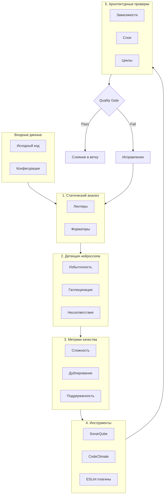
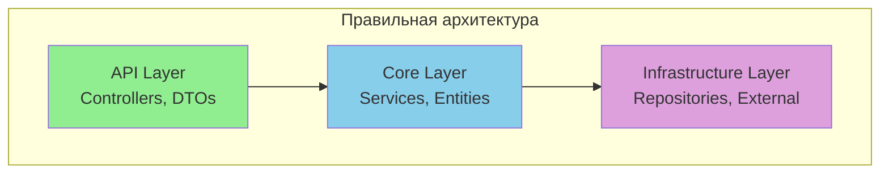

# Этап 6: Проверки качества кода

## 🔍 Quality Assurance Layer

**Версия документа:** 1.0  
**Длительность этапа:** Постоянно (интегрировано в CI/CD)  
**Ответственный:** TIER-1 Архитектор, QA Engineer

---

## Цель этапа

Обеспечить высокое качество кода через автоматизированные проверки: статический анализ, детекцию проблемного ИИ-сгенерированного кода, контроль метрик качества и проверку архитектурных ограничений.

---

## Входные данные

| Данные | Источник |
|--------|----------|
| Исходный код | [05-parallel-development.md](./05-parallel-development.md) |
| API контракты | [02-contracts-and-architecture.md](./02-contracts-and-architecture.md) |
| Архитектура системы | [02-contracts-and-architecture.md](./02-contracts-and-architecture.md) |
| Стек технологий | [Инструменты_для_разработки.md](./appendices/Инструменты_для_разработки.md) |

---

## Обзор системы качества



---

## 1. Статический анализ кода

### 1.1 Линтеры

#### ESLint (Frontend — TypeScript/React)

```javascript
// .eslintrc.cjs
module.exports = {
  root: true,
  env: { browser: true, es2022: true, node: true },
  extends: [
    'eslint:recommended',
    'plugin:@typescript-eslint/recommended',
    'plugin:@typescript-eslint/recommended-requiring-type-checking',
    'plugin:react/recommended',
    'plugin:react-hooks/recommended',
    'plugin:jsx-a11y/recommended',
    'prettier'
  ],
  parser: '@typescript-eslint/parser',
  parserOptions: {
    ecmaVersion: 'latest',
    sourceType: 'module',
    project: './tsconfig.json'
  },
  plugins: ['@typescript-eslint', 'react', 'react-hooks', 'jsx-a11y'],
  rules: {
    // Качество кода
    'no-console': ['warn', { allow: ['warn', 'error'] }],
    'no-debugger': 'error',
    'no-unused-vars': 'off',
    '@typescript-eslint/no-unused-vars': ['error', { argsIgnorePattern: '^_' }],
    
    // Типобезопасность
    '@typescript-eslint/no-explicit-any': 'error',
    '@typescript-eslint/explicit-function-return-type': 'warn',
    '@typescript-eslint/no-floating-promises': 'error',
    '@typescript-eslint/await-thenable': 'error',
    
    // Сложность
    'complexity': ['error', 10],
    'max-depth': ['error', 3],
    'max-lines-per-function': ['warn', 50],
    'max-lines': ['warn', 300],
    'max-params': ['error', 4],
    
    // React
    'react/react-in-jsx-scope': 'off',
    'react/prop-types': 'off',
    'react-hooks/rules-of-hooks': 'error',
    'react-hooks/exhaustive-deps': 'warn'
  },
  settings: {
    react: { version: 'detect' }
  }
};
```

#### StyleCop + Roslyn Analyzers (Backend — C#)

```xml
<!-- stylecop.json -->
{
  "$schema": "https://raw.githubusercontent.com/DotNetAnalyzers/StyleCopAnalyzers/master/StyleCop.Analyzers/StyleCop.Analyzers/Settings/stylecop.schema.json",
  "settings": {
    "documentationRules": {
      "companyName": "GoldPC",
      "copyrightText": "Copyright (c) {companyName}. All rights reserved.",
      "documentExposedElements": true,
      "documentInterfaces": true,
      "documentInternalElements": false,
      "documentPrivateElements": false,
      "documentPrivateFields": false
    },
    "indentation": {
      "indentationSize": 4,
      "tabSize": 4,
      "useTabs": false
    },
    "layoutRules": {
      "newlineAtEndOfFile": "require"
    },
    "namingRules": {
      "allowCommonHungarianPrefixes": false
    },
    "orderingRules": {
      "usingDirectivesPlacement": "outsideNamespace",
      "systemUsingDirectivesFirst": true
    }
  }
}
```

### 1.2 Форматеры

#### Prettier (Frontend)

```javascript
// .prettierrc
module.exports = {
  semi: true,
  singleQuote: true,
  tabWidth: 2,
  trailingComma: 'es5',
  printWidth: 100,
  bracketSpacing: true,
  arrowParens: 'avoid',
  endOfLine: 'lf',
  plugins: ['prettier-plugin-organize-imports']
};
```

#### dotnet format (Backend)

```xml
<!-- .editorconfig -->
root = true

[*]
charset = utf-8
end_of_line = lf
insert_final_newline = true
trim_trailing_whitespace = true

[*.{cs,csx}]
indent_size = 4
indent_style = space

# C# Code Style Rules
csharp_new_line_before_open_brace = all
csharp_new_line_before_else = true
csharp_new_line_before_catch = true
csharp_new_line_before_finally = true
csharp_indent_case_contents = true
csharp_indent_switch_labels = true

# Naming Conventions
dotnet_naming_rule.interfaces_should_be_prefixed.severity = warning
dotnet_naming_rule.interfaces_should_be_prefixed.symbols = interface
dotnet_naming_rule.interfaces_should_be_prefixed.style = begins_with_i

dotnet_naming_symbols.interface.applicable_kinds = interface
dotnet_naming_symbols.interface.applicable_accessibilities = *

dotnet_naming_style.begins_with_i.required_prefix = I
dotnet_naming_style.begins_with_i.capitalization = pascal_case
```

### 1.3 Интеграция в CI

```yaml
# .github/workflows/lint.yml
name: Lint

on:
  push:
    branches: [main, develop]
  pull_request:
    branches: [main, develop]

jobs:
  lint-frontend:
    runs-on: ubuntu-latest
    steps:
      - uses: actions/checkout@v4
      
      - name: Setup Node.js
        uses: actions/setup-node@v4
        with:
          node-version: '20'
          cache: 'npm'
          cache-dependency-path: src/frontend/package-lock.json
      
      - name: Install dependencies
        working-directory: src/frontend
        run: npm ci
      
      - name: Run ESLint
        working-directory: src/frontend
        run: npm run lint -- --max-warnings 0
      
      - name: Run Prettier check
        working-directory: src/frontend
        run: npx prettier --check "src/**/*.{ts,tsx,css,json}"

  lint-backend:
    runs-on: ubuntu-latest
    steps:
      - uses: actions/checkout@v4
      
      - name: Setup .NET
        uses: actions/setup-dotnet@v4
        with:
          dotnet-version: '8.0.x'
      
      - name: Run dotnet format
        run: dotnet format --verify-no-changes --severity warn
      
      - name: Build with warnings as errors
        run: dotnet build --configuration Release --warnaserror
```

---

## 2. Детекция «нейрослопа»

### 2.1 Анализ на избыточность

```javascript
// scripts/neuroslop-check.js
const NEUROSLOP_PATTERNS = {
  // Лишние комментарии к очевидному коду
  OBVIOUS_COMMENTS: [
    /\/\/ (Get|Set|Return|Create|Update|Delete) (the |a )?\w+/i,
    /\/\/ This (function|method|class) \w+/i,
    /\/\/ (Constructor|Destructor)/i
  ],
  
  // Over-engineering паттерны
  OVER_ENGINEERING: [
    /interface\s+I\w+\s*{\s*\w+:\s*(string|number|boolean)\s*;?\s*}/,
    /class\s+\w+Factory\s*{\s*create\(\)\s*{\s*return\s+new\s+\w+\(\)\s*;?\s*}\s*}/
  ],
  
  // Повторяющиеся проверки
  REDUNDANT_CHECKS: [
    /if\s*\(\s*\w+\s*\)\s*{\s*return\s+(true|false)\s*;?\s*}\s*return\s+!(true|false)/
  ]
};

function detectNeuroslop(sourceCode, filePath) {
  const issues = [];
  const lines = sourceCode.split('\n');
  
  lines.forEach((line, index) => {
    NEUROSLOP_PATTERNS.OBVIOUS_COMMENTS.forEach(pattern => {
      if (pattern.test(line.trim())) {
        issues.push({
          type: 'OBVIOUS_COMMENT',
          message: 'Комментарий к очевидному коду (нейрослоп)',
          line: index + 1,
          severity: 'warning'
        });
      }
    });
  });
  
  return issues;
}

module.exports = { detectNeuroslop };
```

### 2.2 Детекция галлюцинаций ИИ

```yaml
# .github/workflows/hallucination-check.yml
name: Hallucination Check

on: [push, pull_request]

jobs:
  check-dependencies:
    runs-on: ubuntu-latest
    steps:
      - uses: actions/checkout@v4
      
      - name: Check NuGet packages exist
        run: |
          dotnet restore
          dotnet list package --include-transitive --outdated > packages.txt || true
          
          while IFS= read -r line; do
            if [[ $line =~ ^([A-Za-z0-9.]+) ]]; then
              pkg="${BASH_REMATCH[1]}"
              response=$(curl -s -o /dev/null -w "%{http_code}" "https://api.nuget.org/v3/registration5-semver1/${pkg,,}/index.json")
              if [ "$response" != "200" ]; then
                echo "⚠️ Package '$pkg' not found in NuGet (possible hallucination)"
              fi
            fi
          done < <(grep -E "^\s+→" packages.txt || true)
      
      - name: Check npm packages exist
        working-directory: src/frontend
        run: |
          npm ls --json --depth=0 2>/dev/null | jq -r '.dependencies | keys[]' | while read pkg; do
            response=$(curl -s -o /dev/null -w "%{http_code}" "https://registry.npmjs.org/${pkg}")
            if [ "$response" != "200" ]; then
              echo "⚠️ Package '$pkg' not found in npm (possible hallucination)"
            fi
          done
```

### 2.3 Проверка несоответствий

```javascript
// scripts/consistency-check.js
async function checkApiConsistency(openApiSpec, codePath) {
  const issues = [];
  
  const spec = JSON.parse(fs.readFileSync(openApiSpec, 'utf-8'));
  const specEndpoints = extractEndpoints(spec);
  const implementedEndpoints = await extractImplementedEndpoints(codePath);
  
  // Проверка: все ли endpoints из спецификации реализованы
  for (const endpoint of specEndpoints) {
    const found = implementedEndpoints.find(e => 
      e.method === endpoint.method && e.path === endpoint.path
    );
    if (!found) {
      issues.push({
        type: 'MISSING_ENDPOINT',
        message: `Endpoint ${endpoint.method} ${endpoint.path} не реализован`,
        severity: 'error'
      });
    }
  }
  
  return issues;
}

module.exports = { checkApiConsistency };
```

---

## 3. Метрики качества

### 3.1 Цикломатическая сложность

| Метрика | Описание | Пороговое значение | Действие |
|---------|----------|-------------------|----------|
| Cyclomatic Complexity | Количество независимых путей выполнения | ≤10 на метод | Блокировка при >15 |
| Cognitive Complexity | Сложность понимания кода | ≤15 на метод | Предупреждение при >20 |
| Nesting Depth | Глубина вложенности | ≤3 | Блокировка при >4 |
| Function Length | Длина функции (строк) | ≤50 | Предупреждение при >80 |
| Parameters Count | Количество параметров | ≤4 | Предупреждение при >5 |

### 3.2 Дублирование кода

| Метрика | Порог | Инструмент | Действие |
|---------|-------|------------|----------|
| Duplicate Lines % | <3% | SonarQube | Блокировка при >5% |
| Duplicate Blocks | 0 | PMD CPD | Предупреждение при >0 |
| Copy-Paste Tokens | >100 | Simian | Анализ дубликатов |

### 3.3 Maintainability Index

| Рейтинг | Значение | Описание | Действие |
|---------|----------|----------|----------|
| A (High) | 20-100 | Хорошая поддержанность | — |
| B (Medium) | 10-19 | Требует внимания | Warning |
| C (Low) | 0-9 | Требует рефакторинга | Error |

### 3.4 Сводная таблица метрик

| Метрика | Целевое | Мин. допустимое | Блокировка | Инструмент |
|---------|---------|-----------------|------------|------------|
| Code Coverage | ≥70% | 60% | <50% | Coverlet / Jest |
| Cyclomatic Complexity | ≤10 | ≤15 | >15 | SonarQube |
| Cognitive Complexity | ≤15 | ≤20 | >25 | SonarQube |
| Duplications | <3% | <5% | >5% | SonarQube, CPD |
| Technical Debt Ratio | <5% | <10% | >10% | SonarQube |
| Maintainability Index | ≥20 | ≥10 | <10 | CodeClimate |
| Security Rating | A | B | C | SonarQube |
| Reliability Rating | A | B | C | SonarQube |

---

## 4. Инструменты анализа

### 4.1 SonarQube

**Конфигурация:**

```properties
# sonar-project.properties
sonar.projectKey=goldpc
sonar.projectName=GoldPC
sonar.sources=src/backend,src/frontend/src
sonar.tests=src/backend/GoldPC.Tests,src/frontend/src/**/*.test.ts

# Метрики покрытия
sonar.coverage.exclusions=**/*.spec.ts,**/*.test.ts,**/Migrations/**
sonar.csharp.minCoverage=70
sonar.typescript.lcov.reportPaths=src/frontend/coverage/lcov.info

# Пороговые значения
sonar.qualitygate.wait=true
sonar.qualitygate.timeout=300

# Правила сложности
sonar.cognitive_complexity.threshold=15
sonar.function.complexity.threshold=10

# Дублирование
sonar.cpd.exclusions=**/generated/**,**/*.min.js
```

**Интеграция в CI:**

```yaml
# .github/workflows/sonarqube.yml
name: SonarQube Analysis

on:
  push:
    branches: [main, develop]
  pull_request:
    types: [opened, synchronize, reopened]

jobs:
  sonarqube:
    runs-on: ubuntu-latest
    steps:
      - uses: actions/checkout@v4
        with:
          fetch-depth: 0
      
      - name: Setup .NET
        uses: actions/setup-dotnet@v4
        with:
          dotnet-version: '8.0.x'
      
      - name: Setup Node.js
        uses: actions/setup-node@v4
        with:
          node-version: '20'
      
      - name: Build and Test
        run: |
          dotnet restore
          dotnet build --configuration Release
          dotnet test --configuration Release --collect:"XPlat Code Coverage"
      
      - name: SonarQube Scan
        uses: sonarsource/sonarqube-scan-action@master
        env:
          SONAR_TOKEN: ${{ secrets.SONAR_TOKEN }}
          SONAR_HOST_URL: ${{ secrets.SONAR_HOST_URL }}
      
      - name: SonarQube Quality Gate
        uses: sonarsource/sonarqube-quality-gate-action@master
        timeout-minutes: 5
        env:
          SONAR_TOKEN: ${{ secrets.SONAR_TOKEN }}
```

### 4.2 CodeClimate

**Конфигурация:**

```yaml
# .codeclimate.yml
version: "2"
checks:
  complexity:
    enabled: true
    config:
      threshold: 10
  
  duplication:
    enabled: true
    config:
      count_threshold: 2
      mass_threshold: 50
  
  file-lines:
    enabled: true
    config:
      threshold: 500
  
  method-lines:
    enabled: true
    config:
      threshold: 50
  
  method-complexity:
    enabled: true
    config:
      threshold: 10
  
  return-statements:
    enabled: true
    config:
      threshold: 4
  
  similar-code:
    enabled: true
    config:
      threshold: 50
  
  identical-code:
    enabled: true
    config:
      threshold: 30

plugins:
  eslint:
    enabled: true
    channel: "eslint-8"
    config:
      config: .eslintrc.cjs
  
  sonar-csharp:
    enabled: true

exclude_patterns:
  - "**/node_modules/"
  - "**/dist/"
  - "**/build/"
  - "**/Migrations/"
  - "**/*.min.js"
  - "**/*.test.ts"
  - "**/*.spec.ts"
```

### 4.3 ESLint плагины

| Плагин | Назначение | Конфигурация |
|--------|------------|--------------|
| `@typescript-eslint` | TypeScript-специфичные правила | `plugin:@typescript-eslint/recommended` |
| `eslint-plugin-react` | React best practices | `plugin:react/recommended` |
| `eslint-plugin-react-hooks` | Rules of Hooks | `plugin:react-hooks/recommended` |
| `eslint-plugin-jsx-a11y` | Доступность | `plugin:jsx-a11y/recommended` |
| `eslint-plugin-import` | Проверка импортов | `plugin:import/errors` |
| `eslint-plugin-unicorn` | Расширенные best practices | `plugin:unicorn/recommended` |

### 4.4 NuGet пакеты для анализа

| Пакет | Назначение |
|-------|------------|
| `StyleCop.Analyzers` | Стиль кода C# |
| `Microsoft.CodeAnalysis.NetAnalyzers` | Статический анализ .NET |
| `Roslynator.Analyzers` | Расширенный анализ кода |
| `SonarAnalyzer.CSharp` | Правила SonarQube для C# |
| `Meziantou.Analyzer` | Дополнительные best practices |

---

## 5. Проверка архитектурных ограничений

### 5.1 Запрет циклических зависимостей

```csharp
// tests/ArchitectureTests/DependencyTests.cs
using NetArchTest.Rules;
using FluentAssertions;

public class DependencyTests
{
    private static readonly Assembly[] Assemblies = new[]
    {
        typeof(Core.AssemblyReference).Assembly,
        typeof(Infrastructure.AssemblyReference).Assembly,
        typeof(Api.AssemblyReference).Assembly
    };

    [Fact]
    public void Should_Not_Have_Circular_Dependencies()
    {
        var result = Types.InAssemblies(Assemblies)
            .Should()
            .NotHaveCircularDependency()
            .GetResult();
        
        result.IsSuccessful.Should().BeTrue("Циклические зависимости запрещены");
    }

    [Fact]
    public void Core_Should_Not_Depend_On_Infrastructure()
    {
        var result = Types.InAssembly(typeof(Core.AssemblyReference).Assembly)
            .Should()
            .NotHaveDependencyOn("GoldPC.Infrastructure")
            .GetResult();
        
        result.IsSuccessful.Should().BeTrue();
    }

    [Fact]
    public void Core_Should_Not_Depend_On_Api()
    {
        var result = Types.InAssembly(typeof(Core.AssemblyReference).Assembly)
            .Should()
            .NotHaveDependencyOn("GoldPC.Api")
            .GetResult();
        
        result.IsSuccessful.Should().BeTrue();
    }

    [Fact]
    public void Infrastructure_Should_Not_Depend_On_Api()
    {
        var result = Types.InAssembly(typeof(Infrastructure.AssemblyReference).Assembly)
            .Should()
            .NotHaveDependencyOn("GoldPC.Api")
            .GetResult();
        
        result.IsSuccessful.Should().BeTrue();
    }
}
```

### 5.2 Проверка слоёв



```csharp
// tests/ArchitectureTests/LayerTests.cs
public class LayerTests
{
    [Fact]
    public void Controllers_Should_Not_Depend_On_Infrastructure()
    {
        var result = Types.InAssembly(typeof(Api.AssemblyReference).Assembly)
            .That()
            .HaveNameEndingWith("Controller")
            .Should()
            .NotHaveDependencyOn("GoldPC.Infrastructure")
            .And()
            .NotHaveDependencyOn("Microsoft.EntityFrameworkCore")
            .GetResult();
        
        result.IsSuccessful.Should().BeTrue();
    }

    [Fact]
    public void Repositories_Should_Implement_Interface()
    {
        var result = Types.InAssembly(typeof(Infrastructure.AssemblyReference).Assembly)
            .That()
            .HaveNameEndingWith("Repository")
            .Should()
            .ImplementInterface(typeof(IRepository<>))
            .GetResult();
        
        result.IsSuccessful.Should().BeTrue();
    }
}
```

### 5.3 Dependency Cruiser (Frontend)

```javascript
// .dependency-cruiser.js
module.exports = {
  forbidden: [
    // Запрет циклических зависимостей
    {
      name: 'no-circular',
      severity: 'error',
      comment: 'Циклические зависимости запрещены',
      rule: {
        type: 'no-circular'
      }
    },
    
    // Проверка слоёв
    {
      name: 'components-not-import-store',
      severity: 'error',
      comment: 'Компоненты не должны импортировать store напрямую',
      rule: {
        type: 'no-external-to',
        from: { path: '^src/components/' },
        to: { path: '^src/store/' }
      }
    },
    
    {
      name: 'api-only-from-services',
      severity: 'error',
      comment: 'API модуль должен использоваться только из services',
      rule: {
        type: 'no-external-to',
        from: { pathNot: '^src/services/' },
        to: { path: '^src/api/' }
      }
    }
  ],
  
  options: {
    doNotFollow: { path: 'node_modules' },
    tsPreCompilationDeps: true,
    tsConfig: { fileName: './tsconfig.json' }
  }
};
```

### 5.4 Интеграция в CI

```yaml
# .github/workflows/architecture-check.yml
name: Architecture Check

on: [push, pull_request]

jobs:
  architecture-tests:
    runs-on: ubuntu-latest
    steps:
      - uses: actions/checkout@v4
      
      - name: Setup .NET
        uses: actions/setup-dotnet@v4
        with:
          dotnet-version: '8.0.x'
      
      - name: Run Architecture Tests
        run: dotnet test --filter "FullyQualifiedName~ArchitectureTests"
      
      - name: Setup Node.js
        uses: actions/setup-node@v4
        with:
          node-version: '20'
      
      - name: Install dependency-cruiser
        working-directory: src/frontend
        run: npm ci
      
      - name: Run dependency-cruiser
        working-directory: src/frontend
        run: npx depcruise src --config .dependency-cruiser.js --output-type err-html | cat
```

---

## 6. Полный Quality Gate Pipeline

```yaml
# .github/workflows/quality-gate.yml
name: Quality Gate

on:
  pull_request:
    branches: [main, develop]

jobs:
  quality-check:
    runs-on: ubuntu-latest
    steps:
      - uses: actions/checkout@v4
        with:
          fetch-depth: 0
      
      # 1. Статический анализ
      - name: Lint Backend
        run: dotnet format --verify-no-changes --severity warn
      
      - name: Lint Frontend
        working-directory: src/frontend
        run: |
          npm ci
          npm run lint -- --max-warnings 0
      
      # 2. Детекция нейрослопа
      - name: Validate Dependencies
        run: node scripts/validate-all-dependencies.js
      
      - name: Validate API Contracts
        run: |
          npm install -g @stoplight/spectral-cli
          spectral lint docs/api/openapi/*.yaml
      
      # 3. Метрики качества
      - name: Run Tests with Coverage
        run: |
          dotnet test --configuration Release --collect:"XPlat Code Coverage"
          cd src/frontend && npm run test:coverage
      
      # 4. SonarQube
      - name: SonarQube Scan
        uses: sonarsource/sonarqube-scan-action@master
        env:
          SONAR_TOKEN: ${{ secrets.SONAR_TOKEN }}
          SONAR_HOST_URL: ${{ secrets.SONAR_HOST_URL }}
      
      # 5. Архитектурные проверки
      - name: Architecture Tests
        run: dotnet test --filter "FullyQualifiedName~ArchitectureTests"
      
      - name: Dependency Cruiser
        working-directory: src/frontend
        run: npx depcruise src --config .dependency-cruiser.js
      
      # Quality Gate Result
      - name: Quality Gate Passed
        run: echo "✅ All quality checks passed!"
```

---

## Критерии готовности (Definition of Done)

- [ ] ESLint проходит без ошибок (0 warnings)
- [ ] StyleCop проходит без ошибок
- [ ] Prettier форматирование применено
- [ ] SonarQube Quality Gate пройден
- [ ] Code Coverage ≥70%
- [ ] Нет неизвестных/галлюцинированных зависимостей
- [ ] Архитектурные тесты проходят
- [ ] Нет циклических зависимостей
- [ ] Cognitive Complexity ≤15
- [ ] Дублирование кода <3%
- [ ] Maintainability Index ≥20

---

## Возможные риски и митигация

| Риск | Вероятность | Влияние | Меры митигации |
|------|-------------|---------|----------------|
| False positives в линтерах | Средняя | Низкое | Настройка исключений в конфигурации |
| Большой technical debt | Средняя | Среднее | Постепенный рефакторинг, инкрементальные улучшения |
| Игнорирование правил командой | Средняя | Высокое | Code review, обучение, автоматические блокировки в CI |
| Несоответствие метрик реальности | Низкая | Среднее | Периодический пересмотр пороговых значений |
| Долгое выполнение проверок | Средняя | Низкое | Кэширование, параллельный запуск, инкрементальный анализ |

---

## Связанные документы

- [README.md](./README.md) — Обзор плана
- [02-contracts-and-architecture.md](./02-contracts-and-architecture.md) — Архитектура системы
- [05-parallel-development.md](./05-parallel-development.md) — Разработка
- [07-security.md](./07-security.md) — Безопасность
- [Инструменты_для_разработки.md](./appendices/Инструменты_для_разработки.md) — Стек технологий

---

*Документ создан в рамках плана разработки GoldPC.*