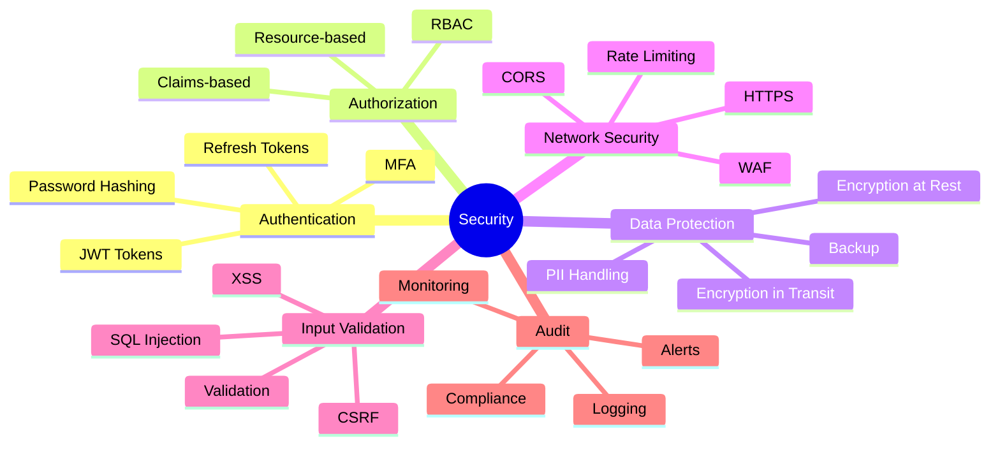
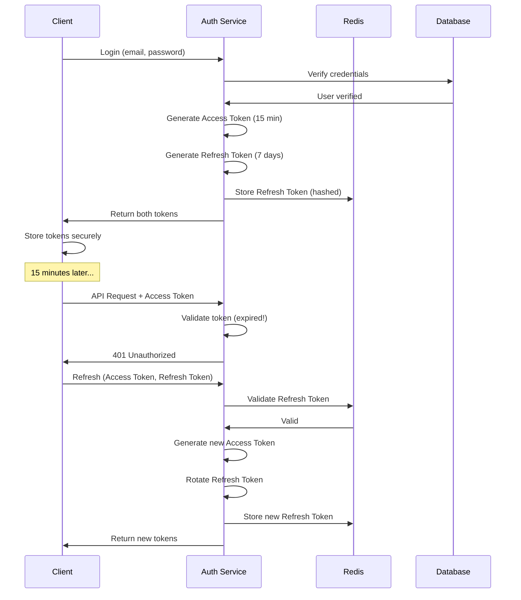

# Этап 7: Безопасность

## 🔐 SECURITY FIRST

**Версия документа:** 1.0  
**Длительность этапа:** Постоянно (интегрировано в разработку)  
**Ответственный:** TIER-1 Архитектор, Security Engineer

---

## Цель этапа

Обеспечить безопасность системы на всех уровнях: аутентификация, авторизация, защита данных, защита от атак.

---

## Входные данные

| Данные | Источник |
|--------|----------|
| STRIDE анализ | [02-contracts-and-architecture.md](./02-contracts-and-architecture.md) |
| Требования безопасности | ТЗ (НФТ-3.x) |
| Исходный код | [05-parallel-development.md](./05-parallel-development.md) |

---

## Обзор безопасности



---

## 7.1 Аутентификация

### JWT Token Implementation

```csharp
// src/backend/GoldPC.Core/Services/TokenService.cs
public class TokenService : ITokenService
{
    private readonly IConfiguration _configuration;
    private readonly ILogger<TokenService> _logger;

    public string GenerateAccessToken(User user)
    {
        var claims = new[]
        {
            new Claim(ClaimTypes.NameIdentifier, user.Id.ToString()),
            new Claim(ClaimTypes.Email, user.Email),
            new Claim(ClaimTypes.Role, user.Role.ToString()),
            new Claim("firstName", user.FirstName),
            new Claim("lastName", user.LastName),
            new Claim(JwtRegisteredClaimNames.Jti, Guid.NewGuid().ToString())
        };

        var key = new SymmetricSecurityKey(
            Encoding.UTF8.GetBytes(_configuration["Jwt:Key"]!));
        var credentials = new SigningCredentials(key, SecurityAlgorithms.HmacSha256);

        var token = new JwtSecurityToken(
            issuer: _configuration["Jwt:Issuer"],
            audience: _configuration["Jwt:Audience"],
            claims: claims,
            expires: DateTime.UtcNow.AddMinutes(15), // Короткий срок!
            signingCredentials: credentials
        );

        return new JwtSecurityTokenHandler().WriteToken(token);
    }

    public string GenerateRefreshToken()
    {
        // Криптографически стойкий random
        var randomBytes = new byte[64];
        using var rng = RandomNumberGenerator.Create();
        rng.GetBytes(randomBytes);
        return Convert.ToBase64String(randomBytes);
    }

    public ClaimsPrincipal? ValidateToken(string token)
    {
        var tokenHandler = new JwtSecurityTokenHandler();
        var key = Encoding.UTF8.GetBytes(_configuration["Jwt:Key"]!);

        try
        {
            var principal = tokenHandler.ValidateToken(token, new TokenValidationParameters
            {
                ValidateIssuer = true,
                ValidateAudience = true,
                ValidateLifetime = true,
                ValidateIssuerSigningKey = true,
                ValidIssuer = _configuration["Jwt:Issuer"],
                ValidAudience = _configuration["Jwt:Audience"],
                IssuerSigningKey = new SymmetricSecurityKey(key),
                ClockSkew = TimeSpan.Zero // Нет допуска по времени
            }, out _);

            return principal;
        }
        catch (SecurityTokenException ex)
        {
            _logger.LogWarning(ex, "Invalid token validation attempt");
            return null;
        }
    }
}
```

### Password Hashing

```csharp
// src/backend/GoldPC.Core/Services/PasswordService.cs
public class PasswordService : IPasswordService
{
    private const int WorkFactor = 12; // bcrypt cost factor

    public string HashPassword(string password)
    {
        return BCrypt.Net.BCrypt.HashPassword(password, WorkFactor);
    }

    public bool VerifyPassword(string password, string hash)
    {
        return BCrypt.Net.BCrypt.Verify(password, hash);
    }

    public bool NeedsRehash(string hash)
    {
        return BCrypt.Net.BCrypt.PasswordNeedsRehash(hash, WorkFactor);
    }
}
```

### Refresh Token Flow



---

## 7.2 Авторизация

### RBAC Implementation

```csharp
// src/backend/GoldPC.Core/Entities/User.cs
public enum UserRole
{
    Client = 0,      // Обычный клиент
    Manager = 1,     // Менеджер продаж
    Master = 2,      // Мастер сервиса
    Admin = 3,       // Администратор
    Accountant = 4   // Бухгалтер
}

// src/backend/GoldPC.Infrastructure/Authorization/RoleAuthorizationHandler.cs
public class RoleAuthorizationHandler : AuthorizationHandler<RoleRequirement>
{
    protected override Task HandleRequirementAsync(
        AuthorizationHandlerContext context,
        RoleRequirement requirement)
    {
        var userRole = context.User.FindFirst(ClaimTypes.Role)?.Value;
        
        if (userRole != null && requirement.AllowedRoles.Contains(userRole))
        {
            context.Succeed(requirement);
        }
        
        return Task.CompletedTask;
    }
}

// Атрибут для использования
[AttributeUsage(AttributeTargets.Class | AttributeTargets.Method)]
public class AuthorizeRolesAttribute : AuthorizeAttribute
{
    public AuthorizeRolesAttribute(params UserRole[] roles)
    {
        Roles = string.Join(",", roles.Select(r => r.ToString()));
    }
}

// Использование в контроллерах
[ApiController]
[Route("api/v1/admin")]
[AuthorizeRoles(UserRole.Admin)]
public class AdminController : ControllerBase
{
    [HttpGet("users")]
    public async Task<IActionResult> GetUsers()
    {
        // Только Admin имеет доступ
    }
}

[ApiController]
[Route("api/v1/orders")]
public class OrdersController : ControllerBase
{
    [HttpGet]
    [AuthorizeRoles(UserRole.Client, UserRole.Manager, UserRole.Admin)]
    public async Task<IActionResult> GetOrders()
    {
        // Клиент видит свои заказы, Manager/Admin - все
        var userId = User.FindFirst(ClaimTypes.NameIdentifier)?.Value;
        var role = User.FindFirst(ClaimTypes.Role)?.Value;
        
        if (role == "Client")
        {
            return Ok(await _orderService.GetUserOrdersAsync(Guid.Parse(userId)));
        }
        
        return Ok(await _orderService.GetAllOrdersAsync());
    }
}
```

### Resource-based Authorization

```csharp
// src/backend/GoldPC.Infrastructure/Authorization/ResourceAuthorizationHandler.cs
public class OrderAuthorizationHandler : AuthorizationHandler<OrderOperationRequirement, Order>
{
    protected override Task HandleRequirementAsync(
        AuthorizationHandlerContext context,
        OrderOperationRequirement requirement,
        Order resource)
    {
        var userId = context.User.FindFirst(ClaimTypes.NameIdentifier)?.Value;
        var role = context.User.FindFirst(ClaimTypes.Role)?.Value;

        // Admin имеет полный доступ
        if (role == UserRole.Admin.ToString())
        {
            context.Succeed(requirement);
            return Task.CompletedTask;
        }

        // Проверка владения ресурсом
        switch (requirement.Operation)
        {
            case OrderOperation.Read:
            case OrderOperation.Update:
            case OrderOperation.Cancel:
                if (resource.UserId.ToString() == userId)
                {
                    context.Succeed(requirement);
                }
                break;
            
            case OrderOperation.Process:
                if (role == UserRole.Manager.ToString())
                {
                    context.Succeed(requirement);
                }
                break;
        }

        return Task.CompletedTask;
    }
}

public record OrderOperationRequirement(OrderOperation Operation);

public enum OrderOperation
{
    Read,
    Update,
    Cancel,
    Process
}

// Использование
[HttpGet("{id}")]
public async Task<IActionResult> GetOrder(Guid id)
{
    var order = await _orderService.GetByIdAsync(id);
    
    var result = await _authorizationService.AuthorizeAsync(
        User, order, new OrderOperationRequirement(OrderOperation.Read));
    
    if (!result.Succeeded)
    {
        return Forbid();
    }
    
    return Ok(order);
}
```

---

## 7.3 Защита данных

### Encryption at Rest

```csharp
// src/backend/GoldPC.Infrastructure/Encryption/DataEncryptionService.cs
public class DataEncryptionService : IDataEncryptionService
{
    private readonly byte[] _key;
    private readonly ILogger<DataEncryptionService> _logger;

    public DataEncryptionService(IConfiguration configuration)
    {
        _key = Convert.FromBase64String(configuration["Encryption:Key"]!);
    }

    public string Encrypt(string plainText)
    {
        using var aes = Aes.Create();
        aes.Key = _key;
        aes.GenerateIV();
        
        using var encryptor = aes.CreateEncryptor(aes.Key, aes.IV);
        using var msEncrypt = new MemoryStream();
        using (var csEncrypt = new CryptoStream(msEncrypt, encryptor, CryptoStreamMode.Write))
        using (var swEncrypt = new StreamWriter(csEncrypt))
        {
            swEncrypt.Write(plainText);
        }
        
        var encrypted = msEncrypt.ToArray();
        var result = new byte[aes.IV.Length + encrypted.Length];
        Buffer.BlockCopy(aes.IV, 0, result, 0, aes.IV.Length);
        Buffer.BlockCopy(encrypted, 0, result, aes.IV.Length, encrypted.Length);
        
        return Convert.ToBase64String(result);
    }

    public string Decrypt(string cipherText)
    {
        var fullCipher = Convert.FromBase64String(cipherText);
        
        using var aes = Aes.Create();
        aes.Key = _key;
        
        var iv = new byte[16];
        var cipher = new byte[fullCipher.Length - 16];
        Buffer.BlockCopy(fullCipher, 0, iv, 0, 16);
        Buffer.BlockCopy(fullCipher, 16, cipher, 0, cipher.Length);
        
        aes.IV = iv;
        
        using var decryptor = aes.CreateDecryptor(aes.Key, aes.IV);
        using var msDecrypt = new MemoryStream(cipher);
        using var csDecrypt = new CryptoStream(msDecrypt, decryptor, CryptoStreamMode.Read);
        using var srDecrypt = new StreamReader(csDecrypt);
        
        return srDecrypt.ReadToEnd();
    }
}

// Использование для PII
public class User
{
    public Guid Id { get; set; }
    
    [Encrypted]
    public string? PassportNumber { get; set; }
    
    [Encrypted]
    public string? Address { get; set; }
}
```

### HTTPS Enforcement

```csharp
// Program.cs
var builder = WebApplication.CreateBuilder(args);

// Принудительный HTTPS в production
if (!builder.Environment.IsDevelopment())
{
    builder.Services.AddHsts(options =>
    {
        options.Preload = true;
        options.IncludeSubDomains = true;
        options.MaxAge = TimeSpan.FromDays(365);
    });
}

var app = builder.Build();

if (!app.Environment.IsDevelopment())
{
    app.UseHsts();
    app.UseHttpsRedirection();
}
```

---

## 7.4 Защита от атак

### SQL Injection Prevention

```csharp
// ✅ Правильно - параметризованные запросы
public class ProductRepository : Repository<Product>, IProductRepository
{
    public async Task<IEnumerable<Product>> SearchAsync(string searchTerm)
    {
        // EF Core автоматически параметризует запросы
        return await _db.Products
            .Where(p => p.Name.Contains(searchTerm) || 
                        p.Description.Contains(searchTerm))
            .ToListAsync();
    }
    
    // Для raw SQL используем параметры
    public async Task<IEnumerable<Product>> GetByCategoryRawAsync(string category)
    {
        return await _db.Products
            .FromSqlRaw("SELECT * FROM Products WHERE Category = {0}", category)
            .ToListAsync();
    }
}
```

### XSS Prevention

```typescript
// src/frontend/src/utils/sanitize.ts
import DOMPurify from 'dompurify';

export const sanitizeHtml = (html: string): string => {
  return DOMPurify.sanitize(html, {
    ALLOWED_TAGS: ['b', 'i', 'em', 'strong', 'a', 'p', 'br'],
    ALLOWED_ATTR: ['href', 'title'],
    ALLOW_DATA_ATTR: false
  });
};

// Использование
const UserComment: React.FC<{ content: string }> = ({ content }) => {
  return (
    <div 
      dangerouslySetInnerHTML={{ __html: sanitizeHtml(content) }}
    />
  );
};
```

### CSRF Protection

```csharp
// Program.cs
builder.Services.AddAntiforgery(options =>
{
    options.HeaderName = "X-XSRF-TOKEN";
    options.Cookie = new CookieBuilder
    {
        HttpOnly = false, // JavaScript должен иметь доступ
        SecurePolicy = CookieSecurePolicy.Always,
        SameSite = SameSiteMode.Strict
    };
});

// Middleware
app.UseAntiforgery();

// В контроллерах
[AutoValidateAntiforgeryToken]
public class AccountController : ControllerBase
{
    [HttpPost("change-password")]
    public async Task<IActionResult> ChangePassword(ChangePasswordRequest request)
    {
        // CSRF токен автоматически проверяется
    }
}
```

### Rate Limiting

```csharp
// Program.cs
builder.Services.AddRateLimiter(options =>
{
    // Глобальный лимит
    options.GlobalLimiter = PartitionedRateLimiter.Create<HttpContext, string>(context =>
    {
        return RateLimitPartition.GetFixedWindowLimiter(
            partitionKey: context.User.Identity?.Name ?? context.Request.Headers.Host.ToString(),
            factory: partition => new FixedWindowRateLimiterOptions
            {
                AutoReplenishment = true,
                PermitLimit = 100,
                Window = TimeSpan.FromMinutes(1)
            });
    });
    
    // Лимит для аутентификации
    options.AddPolicy("Auth", context =>
    {
        return RateLimitPartition.GetFixedWindowLimiter(
            partitionKey: context.Connection.RemoteIpAddress?.ToString() ?? "unknown",
            factory: _ => new FixedWindowRateLimiterOptions
            {
                AutoReplenishment = true,
                PermitLimit = 5, // Только 5 попыток в минуту
                Window = TimeSpan.FromMinutes(1)
            });
    });
    
    options.OnRejected = async (context, token) =>
    {
        context.HttpContext.Response.StatusCode = StatusCodes.Status429TooManyRequests;
        context.HttpContext.Response.Headers["Retry-After"] = "60";
        
        await context.HttpContext.Response.WriteAsJsonAsync(new
        {
            Error = "Too many requests",
            Message = "Please try again later"
        }, token);
    };
});

// Использование в endpoints
app.MapPost("/api/v1/auth/login", Login)
   .RequireRateLimiting("Auth");
```

---

## 7.5 Input Validation

### FluentValidation

```csharp
// src/backend/GoldPC.Core/Validators/RegisterRequestValidator.cs
public class RegisterRequestValidator : AbstractValidator<RegisterRequest>
{
    public RegisterRequestValidator()
    {
        RuleFor(x => x.Email)
            .NotEmpty().WithMessage("Email обязателен")
            .EmailAddress().WithMessage("Некорректный формат email")
            .MaximumLength(255).WithMessage("Email слишком длинный");

        RuleFor(x => x.Password)
            .NotEmpty().WithMessage("Пароль обязателен")
            .MinimumLength(8).WithMessage("Пароль должен быть не менее 8 символов")
            .MaximumLength(128).WithMessage("Пароль слишком длинный")
            .Matches(@"[A-Z]").WithMessage("Пароль должен содержать заглавную букву")
            .Matches(@"[a-z]").WithMessage("Пароль должен содержать строчную букву")
            .Matches(@"[0-9]").WithMessage("Пароль должен содержать цифру")
            .Matches(@"[!@#$%^&*()_+\-=\[\]{};':""\\|,.<>/?]")
            .WithMessage("Пароль должен содержать специальный символ");

        RuleFor(x => x.FirstName)
            .NotEmpty().WithMessage("Имя обязательно")
            .MinimumLength(2).WithMessage("Имя слишком короткое")
            .MaximumLength(100).WithMessage("Имя слишком длинное")
            .Matches(@"^[a-zA-Zа-яА-ЯёЁ\s\-]+$")
            .WithMessage("Имя может содержать только буквы, пробелы и дефис");

        RuleFor(x => x.Phone)
            .NotEmpty().WithMessage("Телефон обязателен")
            .Matches(@"^\+375\d{9}$").WithMessage("Формат: +375XXXXXXXXX");
    }
}

// Регистрация
builder.Services.AddValidatorsFromAssembly(typeof(RegisterRequestValidator).Assembly);
builder.Services.AddTransient(typeof(IPipelineBehavior<,>), typeof(ValidationBehavior<,>));
```

### Frontend Validation

```typescript
// src/frontend/src/validators/auth.ts
import * as yup from 'yup';

export const registerSchema = yup.object().shape({
  email: yup.string()
    .required('Email обязателен')
    .email('Некорректный формат email')
    .max(255, 'Email слишком длинный'),
  
  password: yup.string()
    .required('Пароль обязателен')
    .min(8, 'Пароль должен быть не менее 8 символов')
    .max(128, 'Пароль слишком длинный')
    .matches(/[A-Z]/, 'Пароль должен содержать заглавную букву')
    .matches(/[a-z]/, 'Пароль должен содержать строчную букву')
    .matches(/[0-9]/, 'Пароль должен содержать цифру')
    .matches(/[!@#$%^&*()_+\-=\[\]{};':"\\|,.<>\/?]/, 
      'Пароль должен содержать специальный символ'),
  
  firstName: yup.string()
    .required('Имя обязательно')
    .min(2, 'Имя слишком короткое')
    .max(100, 'Имя слишком длинное')
    .matches(/^[a-zA-Zа-яА-ЯёЁ\s\-]+$/, 
      'Имя может содержать только буквы, пробелы и дефис'),
  
  phone: yup.string()
    .required('Телефон обязателен')
    .matches(/^\+375\d{9}$/, 'Формат: +375XXXXXXXXX'),
});
```

---

## 7.6 Audit Logging

### Implementation

```csharp
// src/backend/GoldPC.Infrastructure/Audit/AuditService.cs
public interface IAuditService
{
    Task LogAsync(string action, string entityType, Guid entityId, object? oldValue, object? newValue);
}

public class AuditService : IAuditService
{
    private readonly AuditDbContext _context;
    private readonly IHttpContextAccessor _httpContextAccessor;
    private readonly ILogger<AuditService> _logger;

    public async Task LogAsync(
        string action, 
        string entityType, 
        Guid entityId, 
        object? oldValue, 
        object? newValue)
    {
        var httpContext = _httpContextAccessor.HttpContext;
        var userId = httpContext?.User?.FindFirst(ClaimTypes.NameIdentifier)?.Value;
        var ipAddress = httpContext?.Connection?.RemoteIpAddress?.ToString();

        var auditLog = new AuditLog
        {
            Id = Guid.NewGuid(),
            Action = action,
            EntityType = entityType,
            EntityId = entityId,
            OldValue = oldValue != null ? JsonSerializer.Serialize(oldValue) : null,
            NewValue = newValue != null ? JsonSerializer.Serialize(newValue) : null,
            UserId = userId != null ? Guid.Parse(userId) : null,
            IpAddress = ipAddress,
            UserAgent = httpContext?.Request?.Headers["User-Agent"].ToString(),
            Timestamp = DateTime.UtcNow
        };

        await _context.AuditLogs.AddAsync(auditLog);
        await _context.SaveChangesAsync();
        
        _logger.LogInformation(
            "Audit: {Action} on {EntityType}[{EntityId}] by User[{UserId}] from {IpAddress}",
            action, entityType, entityId, userId, ipAddress);
    }
}

// Атрибут для аудита
[AttributeUsage(AttributeTargets.Method)]
public class AuditAttribute : Attribute
{
    public string Action { get; }
    public string EntityType { get; }
    
    public AuditAttribute(string action, string entityType)
    {
        Action = action;
        EntityType = entityType;
    }
}

// Action Filter
public class AuditFilter : IAsyncActionFilter
{
    private readonly IAuditService _auditService;

    public async Task OnActionExecutionAsync(ActionExecutingContext context, ActionExecutionDelegate next)
    {
        var executedContext = await next();
        
        var auditAttr = context.ActionDescriptor.EndpointMetadata
            .OfType<AuditAttribute>()
            .FirstOrDefault();
            
        if (auditAttr != null && executedContext.Result is ObjectResult result)
        {
            var entityId = ExtractEntityId(result.Value);
            await _auditService.LogAsync(
                auditAttr.Action,
                auditAttr.EntityType,
                entityId,
                null,
                result.Value);
        }
    }
}
```

---

## 7.7 Security Headers

```csharp
// Program.cs
app.Use(async (context, next) =>
{
    // Content Security Policy
    context.Response.Headers.Append(
        "Content-Security-Policy",
        "default-src 'self'; " +
        "script-src 'self' 'unsafe-inline' https://cdn.jsdelivr.net; " +
        "style-src 'self' 'unsafe-inline' https://fonts.googleapis.com; " +
        "img-src 'self' data: https:; " +
        "font-src 'self' https://fonts.gstatic.com; " +
        "connect-src 'self' https://api.yookassa.ru; " +
        "frame-ancestors 'none';");
    
    // XSS Protection
    context.Response.Headers.Append("X-Content-Type-Options", "nosniff");
    context.Response.Headers.Append("X-Frame-Options", "DENY");
    context.Response.Headers.Append("X-XSS-Protection", "1; mode=block");
    
    // Referrer Policy
    context.Response.Headers.Append("Referrer-Policy", "strict-origin-when-cross-origin");
    
    // Permissions Policy
    context.Response.Headers.Append(
        "Permissions-Policy",
        "geolocation=(), microphone=(), camera=()");
    
    await next();
});
```

---

## Критерии готовности (Definition of Done)

- [ ] JWT аутентификация реализована
- [ ] RBAC авторизация работает
- [ ] Password hashing настроен (bcrypt)
- [ ] HTTPS принудительный
- [ ] Rate limiting настроен
- [ ] Input validation на всех endpoints
- [ ] Audit logging работает
- [ ] Security headers установлены
- [ ] CSRF защита включена
- [ ] XSS защита реализована
- [ ] SQL Injection предотвращён (параметризованные запросы)

---

## Возможные риски и митигация

| Риск | Вероятность | Влияние | Меры митигации |
|------|-------------|---------|----------------|
| Утечка JWT ключа | Низкая | Критическое | Key rotation, secure storage |
| Brute force атаки | Средняя | Среднее | Rate limiting, lockout |
| XSS уязвимости | Средняя | Высокое | CSP, sanitization |
| CSRF атаки | Низкая | Среднее | Antiforgery tokens |

---

## Связанные документы

- [README.md](./README.md) — Обзор плана
- [02-contracts-and-architecture.md](./02-contracts-and-architecture.md) — STRIDE анализ
- [06-quality-checks.md](./06-quality-checks.md) — Проверки качества

---

*Документ создан в рамках плана разработки GoldPC.*