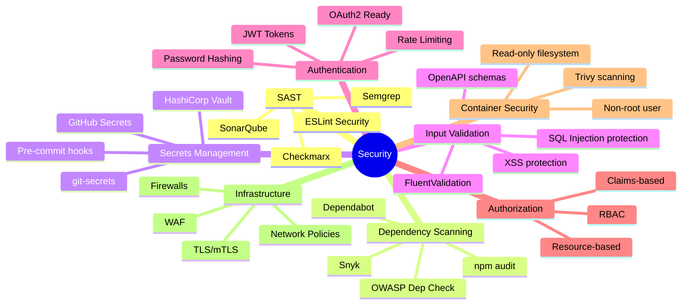
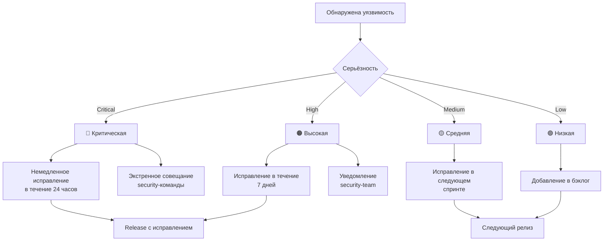

# Этап 7: Безопасность

## 🔐 SECURITY FIRST

**Версия документа:** 1.1  
**Длительность этапа:** Постоянно (интегрировано в разработку)  
**Ответственный:** TIER-1 Архитектор, Security Engineer, DevOps

---

## Цель этапа

Обеспечить комплексную безопасность системы на всех этапах жизненного цикла разработки: от статического анализа кода до защиты инфраструктуры. Документ описывает процессы SAST, сканирования зависимостей, управления секретами, валидации данных, аутентификации/авторизации и безопасности контейнеров.

---

## Входные данные

| Данные | Источник |
|--------|----------|
| STRIDE анализ | [02-contracts-and-architecture.md](./02-contracts-and-architecture.md) |
| Требования безопасности (НФТ-3.x) | [ТЗ_GoldPC.md](./appendices/ТЗ_GoldPC.md) |
| Исходный код | [05-parallel-development.md](./05-parallel-development.md) |
| Настройка среды | [03-environment-setup.md](./03-environment-setup.md) |
| Контракты API | [02-contracts-and-architecture.md](./02-contracts-and-architecture.md) |

---

## Введение: Важность безопасности

### Соответствие требованиям НФТ

Согласно ТЗ, система должна соответствовать следующим нефункциональным требованиям безопасности:

| Код | Требование | Реализация |
|-----|------------|------------|
| НФТ-3.1 | Хэширование паролей (bcrypt/Argon2) | Password Service с cost factor 12+ |
| НФТ-3.2 | HTTPS (TLS 1.2+) для всего трафика | Nginx + SSL сертификаты |
| НФТ-3.3 | Защита от SQL-инъекций | Параметризованные запросы EF Core |
| НФТ-3.4 | Защита от XSS | CSP, экранирование, DOMPurify |
| НФТ-3.5 | CSRF-токены | Anti-forgery middleware |
| НФТ-3.6 | Обязательная аутентификация для защищённых операций | JWT + Authorization middleware |
| НФТ-3.7 | Проверка прав на каждый запрос | RBAC + Resource-based авторизация |
| НФТ-3.8 | Аудит критических операций | Audit Logging Service |
| НФТ-3.9 | Шифрование PII данных | AES-256-GCM |
| НФТ-3.10 | Ограничение попыток входа | Rate Limiting (5 попыток → блокировка 15 мин) |

### Обзор системы безопасности



---

## 1. SAST (Static Application Security Testing)

### 1.1 Инструменты SAST

| Инструмент | Язык | Назначение | Интеграция |
|------------|------|------------|------------|
| **SonarQube** | C#, TypeScript | Комплексный анализ качества и безопасности | CI/CD, IDE |
| **Semgrep** | C#, TypeScript, JS | Быстрый статический анализ по правилам | CI/CD, Pre-commit |
| **Checkmarx** | C#, TypeScript | Enterprise SAST решение | CI/CD |
| **ESLint Security Plugins** | TypeScript, JS | Клиентская безопасность | npm scripts |
| **Roslyn Security Analyzers** | C# | .NET Security правила | Build process |
| **CodeQL** | C#, JavaScript | Семантический анализ GitHub | GitHub Actions |

### 1.2 SonarQube Configuration

```properties
# sonar-project.properties
sonar.projectKey=goldpc
sonar.projectName=GoldPC
sonar.sources=src/backend,src/frontend/src

# Security-focused rules
sonar.security.hotspots.review=true
sonar.security.sensitive.data.exposure=true
sonar.security.sql.injection=true
sonar.security.xss=true
sonar.security.csrf=true

# Exclusions
sonar.exclusions=**/node_modules/**,**/dist/**,**/Migrations/**

# Quality Gate
sonar.qualitygate.wait=true
sonar.qualitygate.timeout=300
```

### 1.3 Semgrep Rules

```yaml
# .semgrep.yml
rules:
  # Detect hardcoded secrets
  - id: hardcoded-secret
    patterns:
      - pattern-either:
          - pattern: password = "..."
          - pattern: api_key = "..."
          - pattern: secret = "..."
    message: "Обнаружен захардкоженный секрет"
    severity: ERROR
    languages: [csharp, typescript]
  
  # SQL Injection detection
  - id: sql-injection
    patterns:
      - pattern: $DB.Execute($QUERY + $VAR)
      - pattern: $DB.Execute($"...{$VAR}...")
    message: "Потенциальная SQL-инъекция"
    severity: ERROR
    languages: [csharp]
  
  # XSS detection
  - id: xss-vulnerability
    patterns:
      - pattern: innerHTML = $VAR
      - pattern: dangerouslySetInnerHTML = { __html: $VAR }
    message: "Потенциальная XSS уязвимость"
    severity: WARNING
    languages: [typescript]
  
  # Weak cryptography
  - id: weak-crypto
    patterns:
      - pattern: MD5.Create()
      - pattern: SHA1.Create()
      - pattern: DESCryptoServiceProvider
    message: "Использование слабого криптографического алгоритма"
    severity: ERROR
    languages: [csharp]
```

### 1.4 ESLint Security Plugins

```javascript
// .eslintrc.cjs (security section)
module.exports = {
  plugins: [
    'security',
    '@typescript-eslint/security'
  ],
  extends: [
    'plugin:security/recommended',
    'plugin:@typescript-eslint/security/recommended'
  ],
  rules: {
    // Security rules
    'security/detect-buffer-unsafe-rendering': 'error',
    'security/detect-child-process': 'warn',
    'security/detect-disable-mustache-escape': 'error',
    'security/detect-eval-with-expression': 'error',
    'security/detect-new-buffer': 'error',
    'security/detect-no-csrf-before-method-override': 'error',
    'security/detect-non-literal-fs-filename': 'warn',
    'security/detect-non-literal-regexp': 'warn',
    'security/detect-non-literal-require': 'warn',
    'security/detect-object-injection': 'warn',
    'security/detect-possible-timing-attacks': 'error',
    'security/detect-pseudoRandomBytes': 'error',
    'security/detect-unsafe-regex': 'error',
    
    // TypeScript security
    '@typescript-eslint/security/detect-unsafe-deserialization': 'error',
    '@typescript-eslint/security/no-unsafe-assignment': 'error'
  }
};
```

### 1.5 Интеграция SAST в CI

```yaml
# .github/workflows/sast.yml
name: SAST Analysis

on:
  push:
    branches: [main, develop]
  pull_request:
    branches: [main, develop]

jobs:
  sonarqube:
    runs-on: ubuntu-latest
    steps:
      - uses: actions/checkout@v4
        with:
          fetch-depth: 0
      
      - name: Setup .NET
        uses: actions/setup-dotnet@v4
        with:
          dotnet-version: '8.0.x'
      
      - name: Build
        run: dotnet build --configuration Release
      
      - name: SonarQube Scan
        uses: sonarsource/sonarqube-scan-action@master
        env:
          SONAR_TOKEN: ${{ secrets.SONAR_TOKEN }}
          SONAR_HOST_URL: ${{ secrets.SONAR_HOST_URL }}
      
      - name: Quality Gate
        uses: sonarsource/sonarqube-quality-gate-action@master
        timeout-minutes: 5
        env:
          SONAR_TOKEN: ${{ secrets.SONAR_TOKEN }}

  semgrep:
    runs-on: ubuntu-latest
    steps:
      - uses: actions/checkout@v4
      
      - name: Semgrep Scan
        uses: returntocorp/semgrep-action@v1
        with:
          config: .semgrep.yml
          severity: ERROR

  codeql:
    runs-on: ubuntu-latest
    steps:
      - uses: actions/checkout@v4
      
      - name: Initialize CodeQL
        uses: github/codeql-action/init@v2
        with:
          languages: csharp, javascript
          queries: security-extended
      
      - name: Build
        run: dotnet build --configuration Release
      
      - name: Perform CodeQL Analysis
        uses: github/codeql-action/analyze@v2
```

### 1.6 Пороговые значения SAST

| Уровень уязвимости | Действие при PR | Автоматический мерж |
|--------------------|-----------------|---------------------|
| **Critical** | ❌ Блокировка | Запрещён |
| **High** | ❌ Блокировка | Запрещён |
| **Medium** | ⚠️ Предупреждение | Требует подтверждения |
| **Low** | ℹ️ Информирование | Разрешён |
| **Info** | ℹ️ Логирование | Разрешён |

---

## 2. Сканирование зависимостей

### 2.1 Инструменты сканирования

| Инструмент | Экосистема | Назначение | Автоматизация |
|------------|------------|------------|---------------|
| **Snyk** | NuGet, npm | Комплексный мониторинг | CI/CD, Dashboard |
| **OWASP Dependency Check** | Все | OWASP Top 10 проверка | CI/CD |
| **npm audit** | npm | Проверка Node.js пакетов | npm scripts |
| **dotnet list package --vulnerable** | NuGet | Проверка .NET пакетов | CLI |
| **Trivy** | Docker images | Сканирование образов | CI/CD |

### 2.2 Snyk Configuration

```yaml
# .snyk
# Snyk configuration file
language:
  dotnet: 8.0
  node: 20

# Ignore specific vulnerabilities (with justification)
ignore:
  SNYK-DEP-12345:
    - '*':
        reason: 'No fix available, accepted risk'
        expires: '2026-06-01'

# Severity threshold
severity-threshold: high

# Fail on vulnerabilities
fail-on: upgradable
```

### 2.3 npm audit Configuration

```json
// package.json
{
  "scripts": {
    "audit": "npm audit --audit-level=moderate",
    "audit:fix": "npm audit fix",
    "audit:ci": "npm audit --audit-level=high --json > audit-report.json || exit 0"
  }
}
```

### 2.4 Dependabot Configuration

```yaml
# .github/dependabot.yml
version: 2
updates:
  # Backend (.NET)
  - package-ecosystem: "nuget"
    directory: "/packages/backend"
    schedule:
      interval: "weekly"
      day: "monday"
      time: "06:00"
    open-pull-requests-limit: 10
    labels:
      - "dependencies"
      - "backend"
    reviewers:
      - "backend-team"
    commit-message:
      prefix: "deps"
    groups:
      microsoft-packages:
        patterns:
          - "Microsoft.*"
          - "System.*"
      ef-core:
        patterns:
          - "Microsoft.EntityFrameworkCore.*"
  
  # Frontend (npm)
  - package-ecosystem: "npm"
    directory: "/packages/frontend"
    schedule:
      interval: "weekly"
      day: "monday"
      time: "06:00"
    open-pull-requests-limit: 10
    labels:
      - "dependencies"
      - "frontend"
    reviewers:
      - "frontend-team"
    commit-message:
      prefix: "deps"
    groups:
      react-packages:
        patterns:
          - "react*"
          - "@types/react*"
      material-ui:
        patterns:
          - "@mui/*"
  
  # Docker
  - package-ecosystem: "docker"
    directory: "/"
    schedule:
      interval: "weekly"
    labels:
      - "docker"
      - "dependencies"
  
  # GitHub Actions
  - package-ecosystem: "github-actions"
    directory: "/"
    schedule:
      interval: "monthly"
    labels:
      - "github-actions"
      - "dependencies"
```

### 2.5 Renovate Configuration (альтернатива Dependabot)

```json
// renovate.json
{
  "$schema": "https://docs.renovatebot.com/renovate-schema.json",
  "extends": [
    "config:base",
    ":dependencyDashboard",
    ":semanticCommits"
  ],
  "schedule": ["before 9am on Monday"],
  "labels": ["dependencies"],
  "packageRules": [
    {
      "matchPackagePatterns": ["*"],
      "matchUpdateTypes": ["minor", "patch"],
      "groupName": "non-major dependencies",
      "groupSlug": "all-minor-patch"
    },
    {
      "matchPackagePatterns": ["*"],
      "matchUpdateTypes": ["major"],
      "addLabels": ["major-update"]
    },
    {
      "matchManagers": ["nuget"],
      "rangeStrategy": "bump"
    },
    {
      "matchPackagePatterns": ["Microsoft.*"],
      "groupName": "Microsoft packages"
    }
  ],
  "vulnerabilityAlerts": {
    "labels": ["security"],
    "assignees": ["security-team"]
  }
}
```

### 2.6 Политика обработки уязвимостей



| Уровень | Срок исправления | Ответственный | Процесс |
|---------|-----------------|---------------|---------|
| **Critical** | 24 часа | Security Team + Lead | Hotfix процесс |
| **High** | 7 дней | Security Team + Developer | Patch release |
| **Medium** | 30 дней | Developer | В рамках спринта |
| **Low** | 90 дней | Developer | По возможности |

### 2.7 CI/CD для сканирования зависимостей

```yaml
# .github/workflows/dependency-scan.yml
name: Dependency Scanning

on:
  push:
    branches: [main, develop]
  pull_request:
    branches: [main, develop]
  schedule:
    - cron: '0 6 * * 1'  # Еженедельно

jobs:
  snyk:
    runs-on: ubuntu-latest
    steps:
      - uses: actions/checkout@v4
      
      - name: Setup .NET
        uses: actions/setup-dotnet@v4
        with:
          dotnet-version: '8.0.x'
      
      - name: Setup Node.js
        uses: actions/setup-node@v4
        with:
          node-version: '20'
      
      - name: Install Snyk
        run: npm install -g snyk
      
      - name: Snyk Auth
        run: snyk auth ${{ secrets.SNYK_TOKEN }}
      
      - name: Snyk Test (Backend)
        working-directory: packages/backend
        run: snyk test --severity-threshold=high --fail-on=upgradable
      
      - name: Snyk Test (Frontend)
        working-directory: packages/frontend
        run: snyk test --severity-threshold=high --fail-on=upgradable
      
      - name: Snyk Monitor
        if: github.ref == 'refs/heads/main'
        run: snyk monitor

  npm-audit:
    runs-on: ubuntu-latest
    steps:
      - uses: actions/checkout@v4
      
      - name: Setup Node.js
        uses: actions/setup-node@v4
        with:
          node-version: '20'
      
      - name: Install dependencies
        working-directory: packages/frontend
        run: npm ci
      
      - name: Run npm audit
        working-directory: packages/frontend
        run: npm audit --audit-level=high

  dotnet-vulnerable:
    runs-on: ubuntu-latest
    steps:
      - uses: actions/checkout@v4
      
      - name: Setup .NET
        uses: actions/setup-dotnet@v4
        with:
          dotnet-version: '8.0.x'
      
      - name: Restore packages
        working-directory: packages/backend
        run: dotnet restore
      
      - name: Check for vulnerable packages
        working-directory: packages/backend
        run: dotnet list package --vulnerable --include-transitive
```

---

## 3. Управление секретами

### 3.1 Запрет на хранение секретов в коде

#### git-secrets Setup

```bash
# Установка git-secrets
# macOS
brew install git-secrets

# Linux
wget https://raw.githubusercontent.com/awslabs/git-secrets/master/git-secrets
sudo install git-secrets /usr/local/bin

# Настройка в репозитории
cd goldpc
git secrets --install
git secrets --register-aws

# Добавление пользовательских паттернов
git secrets --add 'password\s*=\s*["\'][^"\']+["\']'
git secrets --add 'api_key\s*=\s*["\'][^"\']+["\']'
git secrets --add 'secret\s*=\s*["\'][^"\']+["\']'
git secrets --add 'token\s*=\s*["\'][^"\']+["\']'
git secrets --add 'JWT_SECRET\s*=\s*["\'][^"\']+["\']'

# Сканирование истории
git secrets --scan-history
```

#### Pre-commit Hooks

```yaml
# .pre-commit-config.yaml
repos:
  - repo: https://github.com/pre-commit/pre-commit-hooks
    rev: v4.5.0
    hooks:
      - id: detect-private-key
      - id: detect-aws-credentials
        args: ['--allow-missing-credentials']
  
  - repo: https://github.com/gitleaks/gitleaks
    rev: v8.18.0
    hooks:
      - id: gitleaks
  
  - repo: local
    hooks:
      - id: git-secrets
        name: git-secrets
        entry: git secrets --scan
        language: system
        stages: [commit]
```

### 3.2 Использование HashiCorp Vault

```yaml
  password: yup.string()
    .required('Пароль обязателен')
    .min(8, 'Пароль должен быть не менее 8 символов')
    .max(128, 'Пароль слишком длинный')
    .matches(/[A-Z]/, 'Пароль должен содержать заглавную букву')
    .matches(/[a-z]/, 'Пароль должен содержать строчную букву')
    .matches(/[0-9]/, 'Пароль должен содержать цифру')
    .matches(/[!@#$%^&*()_+\-=\[\]{};':"\\|,.<>\/?]/, 
      'Пароль должен содержать специальный символ'),
  
  firstName: yup.string()
    .required('Имя обязательно')
    .min(2, 'Имя слишком короткое')
    .max(100, 'Имя слишком длинное')
    .matches(/^[a-zA-Zа-яА-ЯёЁ\s\-]+$/, 
      'Имя может содержать только буквы, пробелы и дефис'),
  
  phone: yup.string()
    .required('Телефон обязателен')
    .matches(/^\+375\d{9}$/, 'Формат: +375XXXXXXXXX'),
});
```

---

## 7.6 Audit Logging

### Implementation

```csharp
// src/backend/GoldPC.Infrastructure/Audit/AuditService.cs
public interface IAuditService
{
    Task LogAsync(string action, string entityType, Guid entityId, object? oldValue, object? newValue);
}

public class AuditService : IAuditService
{
    private readonly AuditDbContext _context;
    private readonly IHttpContextAccessor _httpContextAccessor;
    private readonly ILogger<AuditService> _logger;

    public async Task LogAsync(
        string action, 
        string entityType, 
        Guid entityId, 
        object? oldValue, 
        object? newValue)
    {
        var httpContext = _httpContextAccessor.HttpContext;
        var userId = httpContext?.User?.FindFirst(ClaimTypes.NameIdentifier)?.Value;
        var ipAddress = httpContext?.Connection?.RemoteIpAddress?.ToString();

        var auditLog = new AuditLog
        {
            Id = Guid.NewGuid(),
            Action = action,
            EntityType = entityType,
            EntityId = entityId,
            OldValue = oldValue != null ? JsonSerializer.Serialize(oldValue) : null,
            NewValue = newValue != null ? JsonSerializer.Serialize(newValue) : null,
            UserId = userId != null ? Guid.Parse(userId) : null,
            IpAddress = ipAddress,
            UserAgent = httpContext?.Request?.Headers["User-Agent"].ToString(),
            Timestamp = DateTime.UtcNow
        };

        await _context.AuditLogs.AddAsync(auditLog);
        await _context.SaveChangesAsync();
        
        _logger.LogInformation(
            "Audit: {Action} on {EntityType}[{EntityId}] by User[{UserId}] from {IpAddress}",
            action, entityType, entityId, userId, ipAddress);
    }
}

// Атрибут для аудита
[AttributeUsage(AttributeTargets.Method)]
public class AuditAttribute : Attribute
{
    public string Action { get; }
    public string EntityType { get; }
    
    public AuditAttribute(string action, string entityType)
    {
        Action = action;
        EntityType = entityType;
    }
}

// Action Filter
public class AuditFilter : IAsyncActionFilter
{
    private readonly IAuditService _auditService;

    public async Task OnActionExecutionAsync(ActionExecutingContext context, ActionExecutionDelegate next)
    {
        var executedContext = await next();
        
        var auditAttr = context.ActionDescriptor.EndpointMetadata
            .OfType<AuditAttribute>()
            .FirstOrDefault();
            
        if (auditAttr != null && executedContext.Result is ObjectResult result)
        {
            var entityId = ExtractEntityId(result.Value);
            await _auditService.LogAsync(
                auditAttr.Action,
                auditAttr.EntityType,
                entityId,
                null,
                result.Value);
        }
    }
}
```

---

## 7.7 Security Headers

```csharp
// Program.cs
app.Use(async (context, next) =>
{
    // Content Security Policy
    context.Response.Headers.Append(
        "Content-Security-Policy",
        "default-src 'self'; " +
        "script-src 'self' 'unsafe-inline' https://cdn.jsdelivr.net; " +
        "style-src 'self' 'unsafe-inline' https://fonts.googleapis.com; " +
        "img-src 'self' data: https:; " +
        "font-src 'self' https://fonts.gstatic.com; " +
        "connect-src 'self' https://api.yookassa.ru; " +
        "frame-ancestors 'none';");
    
    // XSS Protection
    context.Response.Headers.Append("X-Content-Type-Options", "nosniff");
    context.Response.Headers.Append("X-Frame-Options", "DENY");
    context.Response.Headers.Append("X-XSS-Protection", "1; mode=block");
    
    // Referrer Policy
    context.Response.Headers.Append("Referrer-Policy", "strict-origin-when-cross-origin");
    
    // Permissions Policy
    context.Response.Headers.Append(
        "Permissions-Policy",
        "geolocation=(), microphone=(), camera=()");
    
    await next();
});
```

---

## Критерии готовности (Definition of Done)

- [ ] JWT аутентификация реализована
- [ ] RBAC авторизация работает
- [ ] Password hashing настроен (bcrypt)
- [ ] HTTPS принудительный
- [ ] Rate limiting настроен
- [ ] Input validation на всех endpoints
- [ ] Audit logging работает
- [ ] Security headers установлены
- [ ] CSRF защита включена
- [ ] XSS защита реализована
- [ ] SQL Injection предотвращён (параметризованные запросы)

---

## Возможные риски и митигация

| Риск | Вероятность | Влияние | Меры митигации |
|------|-------------|---------|----------------|
| Утечка JWT ключа | Низкая | Критическое | Key rotation, secure storage |
| Brute force атаки | Средняя | Среднее | Rate limiting, lockout |
| XSS уязвимости | Средняя | Высокое | CSP, sanitization |
| CSRF атаки | Низкая | Среднее | Antiforgery tokens |

---

## Связанные документы

- [README.md](./README.md) — Обзор плана
- [02-contracts-and-architecture.md](./02-contracts-and-architecture.md) — STRIDE анализ
- [06-quality-checks.md](./06-quality-checks.md) — Проверки качества

---

*Документ создан в рамках плана разработки GoldPC.*