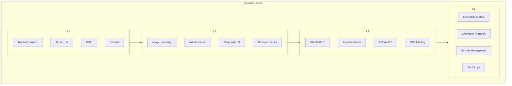
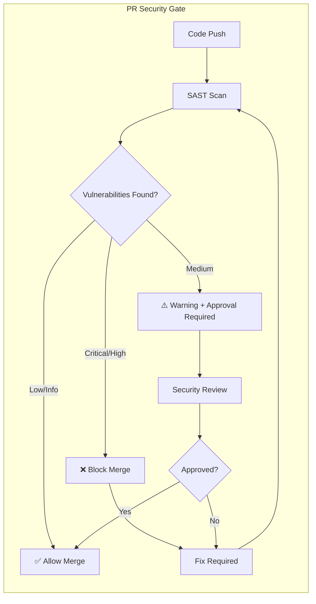
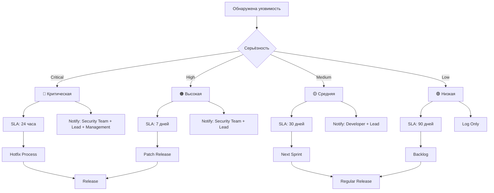
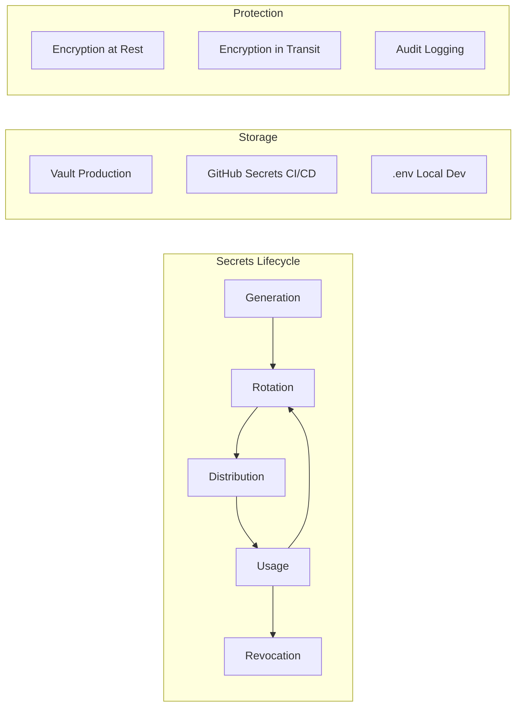
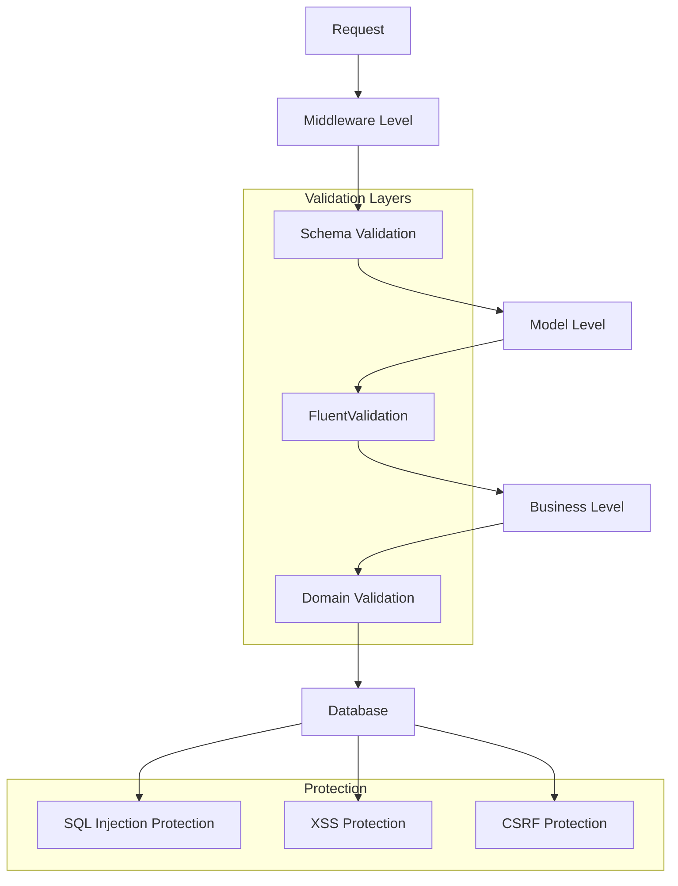
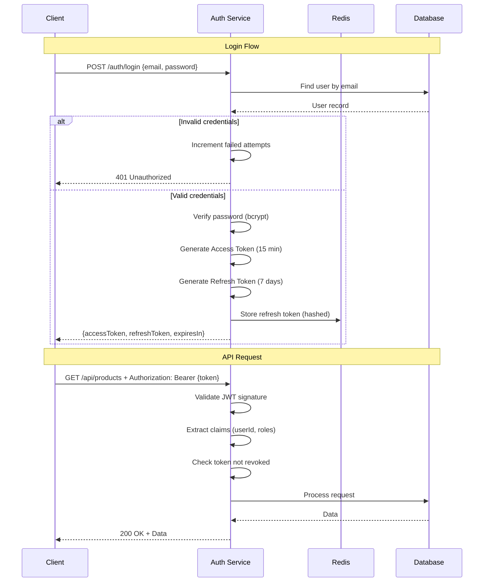
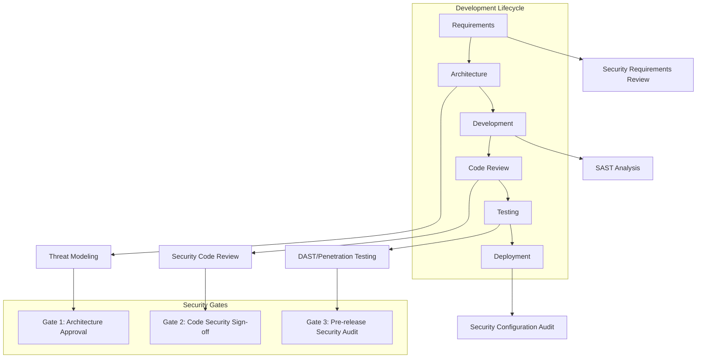

Продолжаю создание полного файла 07-security.md. Предыдущий ответ оборвался на середине, поэтому создам полный документ с нуля.

---

# Этап 7: Безопасность

## 🔐 SECURITY FIRST

**Версия документа:** 1.0  
**Длительность этапа:** Постоянно (интегрировано в весь цикл разработки)  
**Ответственный:** Security Engineer, DevOps, TIER-1 Архитектор

---

## Цель этапа

Обеспечить комплексную безопасность системы на всех этапах жизненного цикла разработки: от статического анализа кода до защиты инфраструктуры. Документ описывает процессы SAST, сканирования зависимостей, управления секретами, валидации данных, аутентификации/авторизации и безопасности контейнеров.

---

## Входные данные

| Данные | Источник |
|--------|----------|
| Требования безопасности (НФТ-3.x) | [ТЗ_GoldPC.md](./appendices/ТЗ_GoldPC.md) |
| Архитектурные решения (ADR) | [02-contracts-and-architecture.md](./02-contracts-and-architecture.md) |
| Контракты API | [02-contracts-and-architecture.md](./02-contracts-and-architecture.md) |
| Конфигурация среды | [03-environment-setup.md](./03-environment-setup.md) |
| Метрики качества | [06-quality-checks.md](./06-quality-checks.md) |
| Процесс ревью | [09-code-review-and-integration.md](./09-code-review-and-integration.md) |

---

## Введение: Важность безопасности

### Соответствие требованиям НФТ

Согласно ТЗ, система должна соответствовать следующим нефункциональным требованиям безопасности:

| Код | Требование | Критичность | Реализация в проекте |
|-----|------------|-------------|---------------------|
| НФТ-3.1 | Хэширование паролей | Critical | bcrypt с cost factor 12+ |
| НФТ-3.2 | HTTPS (TLS 1.2+) | Critical | Nginx + Let's Encrypt |
| НФТ-3.3 | Защита от SQL-инъекций | Critical | Параметризованные запросы EF Core |
| НФТ-3.4 | Защита от XSS | High | CSP + DOMPurify + экранирование |
| НФТ-3.5 | CSRF-токены | High | Anti-forgery middleware |
| НФТ-3.6 | Обязательная аутентификация | Critical | JWT + Refresh Tokens |
| НФТ-3.7 | Проверка прав на запрос | Critical | RBAC + Resource-based авторизация |
| НФТ-3.8 | Аудит критических операций | High | Audit Logging Service |
| НФТ-3.9 | Шифрование PII данных | High | AES-256-GCM |
| НФТ-3.10 | Ограничение попыток входа | Medium | Rate Limiting (5 попыток → 15 мин блокировка) |

### Обзор системы безопасности



---

## 1. SAST (Static Application Security Testing)

### 1.1 Инструменты SAST

| Инструмент | Языки/Технологии | Назначение | Тип интеграции |
|------------|------------------|------------|----------------|
| **SonarQube** | C#, TypeScript, JavaScript | Комплексный анализ качества и безопасности | CI/CD Pipeline |
| **Semgrep** | C#, TypeScript, YAML, Dockerfile | Быстрый статический анализ по кастомным правилам | Pre-commit, CI |
| **CodeQL** | C#, JavaScript | Семантический анализ от GitHub | GitHub Actions |
| **ESLint Security** | TypeScript, JavaScript | Клиентская безопасность | npm scripts |
| **Roslyn Analyzers** | C# | .NET Security правила | Build process |

### 1.2 SonarQube Configuration

```properties
# sonar-project.properties
sonar.projectKey=goldpc
sonar.projectName=GoldPC E-Commerce Platform
sonar.sources=src/backend,src/frontend/src
sonar.tests=tests/backend,tests/frontend

# Security-focused configuration
sonar.security.hotspots.review=true
sonar.security.sensitive.data.exposure=true
sonar.security.sql.injection=true
sonar.security.xss=true
sonar.security.csrf=true

# Exclusions
sonar.exclusions=**/node_modules/**,**/dist/**,**/Migrations/**,**/*.min.js
sonar.test.exclusions=**/node_modules/**

# Quality Gate
sonar.qualitygate.wait=true
sonar.qualitygate.timeout=300

# Coverage
sonar.dotnet.coverage.exclusions=**/Program.cs,**/Startup.cs
sonar.javascript.lcov.reportPaths=coverage/lcov.info
```

### 1.3 Semgrep Rules

```yaml
# .semgrep.yml
rules:
  # === HARDCODED SECRETS ===
  - id: hardcoded-password
    patterns:
      - pattern-either:
          - pattern: password = "..."
          - pattern: Password = "..."
          - pattern: const string Password = "..."
    message: "Обнаружен захардкоженный пароль"
    severity: ERROR
    languages: [csharp]
    metadata:
      category: security
      cwe: "CWE-798"
  
  - id: hardcoded-api-key
    patterns:
      - pattern-either:
          - pattern: api_key = "..."
          - pattern: ApiKey = "..."
          - pattern: X-Api-Key = "..."
    message: "Обнаружен захардкоженный API ключ"
    severity: ERROR
    languages: [csharp, typescript]
  
  - id: hardcoded-jwt-secret
    patterns:
      - pattern: JWT_SECRET = "..."
      - pattern: JwtSecret = "..."
    message: "JWT секрет не должен быть захардкожен"
    severity: ERROR
    languages: [csharp, javascript]

  # === SQL INJECTION ===
  - id: sql-injection-string-concat
    patterns:
      - pattern: $DB.Execute($"...{$VAR}...")
      - pattern: $DB.Query<$T>($"...{$VAR}...")
    message: "Потенциальная SQL-инъекция через интерполяцию строк"
    severity: ERROR
    languages: [csharp]
    metadata:
      category: security
      cwe: "CWE-89"
  
  - id: sql-injection-raw
    patterns:
      - pattern: FromSqlRaw($"SELECT ... { $VAR }")
    message: "Используйте параметризованные запросы"
    severity: ERROR
    languages: [csharp]

  # === XSS ===
  - id: xss-innerHTML
    patterns:
      - pattern: element.innerHTML = $VAR
      - pattern: $EL.innerHTML = $INPUT
    message: "Потенциальная XSS через innerHTML"
    severity: WARNING
    languages: [javascript, typescript]
  
  - id: xss-dangerouslySetInnerHTML
    patterns:
      - pattern: dangerouslySetInnerHTML = { __html: $VAR }
    message: "Используйте DOMPurify для санитизации HTML"
    severity: WARNING
    languages: [typescript]

  # === WEAK CRYPTOGRAPHY ===
  - id: weak-hash-md5
    patterns:
      - pattern: MD5.Create()
      - pattern: System.Security.Cryptography.MD5
    message: "MD5 не подходит для хэширования паролей или подписей"
    severity: ERROR
    languages: [csharp]
  
  - id: weak-hash-sha1
    patterns:
      - pattern: SHA1.Create()
    message: "SHA1 криптографически сломан"
    severity: WARNING
    languages: [csharp]
  
  - id: weak-encryption-des
    patterns:
      - pattern: DESCryptoServiceProvider
      - pattern: TripleDESCryptoServiceProvider
    message: "DES устарел, используйте AES"
    severity: ERROR
    languages: [csharp]

  # === AUTHENTICATION ===
  - id: jwt-validation-none
    patterns:
      - pattern: ValidateAudience = false
      - pattern: ValidateIssuer = false
    message: "Отключена валидация JWT токенов"
    severity: WARNING
    languages: [csharp]
  
  - id: cookie-without-secure
    patterns:
      - pattern: Secure = false
    message: "Cookie должна иметь флаг Secure"
    severity: WARNING
    languages: [csharp]
```

### 1.4 ESLint Security Configuration

```javascript
// .eslintrc.security.cjs
module.exports = {
  plugins: [
    'security',
    '@typescript-eslint/security'
  ],
  extends: [
    'plugin:security/recommended',
    'plugin:@typescript-eslint/security/recommended'
  ],
  rules: {
    // Buffer safety
    'security/detect-buffer-unsafe-rendering': 'error',
    'security/detect-new-buffer': 'error',
    
    // Code injection
    'security/detect-eval-with-expression': 'error',
    'security/detect-child-process': 'warn',
    
    // XSS
    'security/detect-disable-mustache-escape': 'error',
    
    // CSRF
    'security/detect-no-csrf-before-method-override': 'error',
    
    // Timing attacks
    'security/detect-possible-timing-attacks': 'error',
    
    // Regex DoS
    'security/detect-unsafe-regex': 'error',
    
    // Non-literal require
    'security/detect-non-literal-require': 'warn',
    'security/detect-non-literal-fs-filename': 'warn',
    
    // Crypto
    'security/detect-pseudoRandomBytes': 'error',
    
    // TypeScript specific
    '@typescript-eslint/security/detect-unsafe-deserialization': 'error',
    '@typescript-eslint/security/no-unsafe-assignment': 'warn'
  }
};
```

### 1.5 CI/CD Integration

```yaml
# .github/workflows/sast.yml
name: SAST Security Scan

on:
  push:
    branches: [main, develop]
  pull_request:
    branches: [main, develop]

jobs:
  sonarqube:
    name: SonarQube Analysis
    runs-on: ubuntu-latest
    steps:
      - name: Checkout
        uses: actions/checkout@v4
        with:
          fetch-depth: 0
      
      - name: Setup .NET
        uses: actions/setup-dotnet@v4
        with:
          dotnet-version: '8.0.x'
      
      - name: Cache SonarQube packages
        uses: actions/cache@v4
        with:
          path: ~/.sonar/cache
          key: ${{ runner.os }}-sonar
          restore-keys: ${{ runner.os }}-sonar
      
      - name: SonarQube Scan
        uses: sonarsource/sonarqube-scan-action@master
        env:
          SONAR_TOKEN: ${{ secrets.SONAR_TOKEN }}
          SONAR_HOST_URL: ${{ vars.SONAR_HOST_URL }}
      
      - name: SonarQube Quality Gate
        uses: sonarsource/sonarqube-quality-gate-action@master
        timeout-minutes: 5
        env:
          SONAR_TOKEN: ${{ secrets.SONAR_TOKEN }}

  semgrep:
    name: Semgrep Scan
    runs-on: ubuntu-latest
    container:
      image: returntocorp/semgrep
    steps:
      - name: Checkout
        uses: actions/checkout@v4
      
      - name: Semgrep CI Scan
        run: semgrep ci --config .semgrep.yml --severity ERROR --json --output semgrep-report.json
      
      - name: Upload Semgrep Report
        uses: actions/upload-artifact@v4
        if: always()
        with:
          name: semgrep-report
          path: semgrep-report.json

  codeql:
    name: CodeQL Analysis
    runs-on: ubuntu-latest
    permissions:
      security-events: write
    steps:
      - name: Checkout
        uses: actions/checkout@v4
      
      - name: Initialize CodeQL
        uses: github/codeql-action/init@v3
        with:
          languages: csharp, javascript-typescript
          queries: security-extended,security-and-quality
      
      - name: Setup .NET
        uses: actions/setup-dotnet@v4
        with:
          dotnet-version: '8.0.x'
      
      - name: Build Backend
        run: dotnet build packages/backend --configuration Release
      
      - name: Perform CodeQL Analysis
        uses: github/codeql-action/analyze@v3
```

### 1.6 Пороговые значения SAST



| Уровень уязвимости | Блокировка мержа | Требования к исправлению |
|--------------------|------------------|--------------------------|
| **Critical** | ✅ Блокировка | Немедленное исправление |
| **High** | ✅ Блокировка | Исправление в PR |
| **Medium** | ⚠️ Предупреждение | Требуется approval security-ревьювера |
| **Low** | ❌ Нет | Добавление в бэклог |
| **Info** | ❌ Нет | Логирование |

---

## 2. Сканирование зависимостей

### 2.1 Инструменты сканирования

| Инструмент | Экосистема | Автоматизация | Частота |
|------------|------------|---------------|---------|
| **Snyk** | NuGet, npm, Docker | CI/CD + Dashboard | При каждом push + ежедневно |
| **OWASP Dependency Check** | Все | CI Pipeline | При каждом PR |
| **npm audit** | npm | npm scripts | При сборке |
| **dotnet list --vulnerable** | NuGet | CI Pipeline | При каждом PR |
| **Dependabot** | NuGet, npm, Docker | GitHub Automation | Еженедельно |

### 2.2 Snyk Configuration

```yaml
# .snyk
language:
  dotnet: 8.0
  node: 20

# Severity threshold for failure
severity-threshold: high

# Fail only on upgradable vulnerabilities
fail-on: upgradable

# Organization
org: goldpc-team

# Project settings
project:
  environment: production
  
# Policy file for ignoring specific vulnerabilities
# Use only with justification and expiration
ignore:
  SNYK-DEP-000000:
    - '*':
        reason: 'Accept risk - no fix available, compensating controls in place'
        expires: '2025-06-01'
        created: '2024-01-15T00:00:00.000Z'
```

### 2.3 Dependabot Configuration

```yaml
# .github/dependabot.yml
version: 2
registries:
  nuget-github:
    type: nuget-feed
    url: https://nuget.pkg.github.com/goldpc/index.json
    username: ${{ secrets.NUGET_USERNAME }}
    password: ${{ secrets.NUGET_PASSWORD }}

updates:
  # Backend .NET packages
  - package-ecosystem: "nuget"
    directory: "/packages/backend"
    registries:
      - nuget-github
    schedule:
      interval: "weekly"
      day: "monday"
      time: "06:00"
      timezone: "Europe/Minsk"
    open-pull-requests-limit: 10
    labels:
      - "dependencies"
      - "backend"
      - "security"
    reviewers:
      - "backend-team"
    commit-message:
      prefix: "deps"
      include: "scope"
    groups:
      microsoft-packages:
        patterns:
          - "Microsoft.*"
          - "System.*"
        update-types:
          - "minor"
          - "patch"
      entity-framework:
        patterns:
          - "Microsoft.EntityFrameworkCore.*"
  
  # Frontend npm packages
  - package-ecosystem: "npm"
    directory: "/packages/frontend"
    schedule:
      interval: "weekly"
      day: "monday"
      time: "06:00"
    open-pull-requests-limit: 10
    labels:
      - "dependencies"
      - "frontend"
      - "security"
    reviewers:
      - "frontend-team"
    commit-message:
      prefix: "deps"
    groups:
      react-ecosystem:
        patterns:
          - "react*"
          - "@types/react*"
          - "react-dom*"
      material-ui:
        patterns:
          - "@mui/*"
  
  # Docker base images
  - package-ecosystem: "docker"
    directory: "/"
    schedule:
      interval: "weekly"
    labels:
      - "docker"
      - "dependencies"
  
  # GitHub Actions
  - package-ecosystem: "github-actions"
    directory: "/"
    schedule:
      interval: "monthly"
    labels:
      - "github-actions"
      - "dependencies"
```

### 2.4 CI/CD для сканирования зависимостей

```yaml
# .github/workflows/dependency-scan.yml
name: Dependency Security Scan

on:
  push:
    branches: [main, develop]
  pull_request:
    branches: [main, develop]
  schedule:
    - cron: '0 6 * * *'  # Ежедневно в 6:00 UTC

jobs:
  snyk:
    name: Snyk Vulnerability Scan
    runs-on: ubuntu-latest
    permissions:
      contents: read
      security-events: write
    steps:
      - name: Checkout
        uses: actions/checkout@v4
      
      - name: Setup .NET
        uses: actions/setup-dotnet@v4
        with:
          dotnet-version: '8.0.x'
      
      - name: Setup Node.js
        uses: actions/setup-node@v4
        with:
          node-version: '20'
          cache: 'npm'
          cache-dependency-path: packages/frontend/package-lock.json
      
      - name: Install Snyk
        run: npm install -g snyk
      
      - name: Snyk Auth
        run: snyk auth ${{ secrets.SNYK_TOKEN }}
      
      - name: Restore Backend Dependencies
        working-directory: packages/backend
        run: dotnet restore
      
      - name: Install Frontend Dependencies
        working-directory: packages/frontend
        run: npm ci
      
      - name: Snyk Test Backend
        working-directory: packages/backend
        run: snyk test --severity-threshold=high --fail-on=upgradable --json-file-output=snyk-backend.json
        continue-on-error: true
      
      - name: Snyk Test Frontend
        working-directory: packages/frontend
        run: snyk test --severity-threshold=high --fail-on=upgradable --json-file-output=snyk-frontend.json
        continue-on-error: true
      
      - name: Snyk Monitor (main only)
        if: github.ref == 'refs/heads/main'
        run: |
          snyk monitor --file=packages/backend/GoldPC.sln
          snyk monitor --file=packages/frontend/package.json
      
      - name: Upload Snyk Reports
        uses: actions/upload-artifact@v4
        if: always()
        with:
          name: snyk-reports
          path: |
            packages/backend/snyk-backend.json
            packages/frontend/snyk-frontend.json
      
      - name: Fail on Critical/High
        run: |
          if [ -f packages/backend/snyk-backend.json ]; then
            CRITICAL=$(jq '.vulnerabilities | map(select(.severity == "critical" or .severity == "high")) | length' packages/backend/snyk-backend.json)
            if [ "$CRITICAL" -gt 0 ]; then
              echo "Found $CRITICAL critical/high vulnerabilities in backend"
              exit 1
            fi
          fi

  npm-audit:
    name: npm audit
    runs-on: ubuntu-latest
    steps:
      - name: Checkout
        uses: actions/checkout@v4
      
      - name: Setup Node.js
        uses: actions/setup-node@v4
        with:
          node-version: '20'
          cache: 'npm'
          cache-dependency-path: packages/frontend/package-lock.json
      
      - name: Install Dependencies
        working-directory: packages/frontend
        run: npm ci
      
      - name: Run npm audit
        working-directory: packages/frontend
        run: npm audit --audit-level=high
        continue-on-error: true
      
      - name: Generate Audit Report
        working-directory: packages/frontend
        run: npm audit --json > npm-audit.json
        continue-on-error: true

  dotnet-vulnerable:
    name: .NET Vulnerable Packages Check
    runs-on: ubuntu-latest
    steps:
      - name: Checkout
        uses: actions/checkout@v4
      
      - name: Setup .NET
        uses: actions/setup-dotnet@v4
        with:
          dotnet-version: '8.0.x'
      
      - name: Restore Packages
        working-directory: packages/backend
        run: dotnet restore
      
      - name: Check for Vulnerable Packages
        working-directory: packages/backend
        run: |
          dotnet list package --vulnerable --include-transitive --output-format json > vulnerable-packages.json
          cat vulnerable-packages.json
          
          # Check if any vulnerabilities found
          VULN_COUNT=$(jq 'length' vulnerable-packages.json 2>/dev/null || echo "0")
          if [ "$VULN_COUNT" -gt 0 ]; then
            echo "::warning::Found $VULN_COUNT packages with known vulnerabilities"
          fi
```

### 2.5 Политика обработки уязвимостей



| Уровень | SLA исправления | Ответственный | Уведомления | Процесс |
|---------|-----------------|---------------|-------------|---------|
| **Critical** | 24 часа | Security Team + Tech Lead | Email, Slack, SMS | Emergency Hotfix |
| **High** | 7 дней | Developer + Security Team | Email, Slack | Patch Release |
| **Medium** | 30 дней | Developer | Slack | Sprint Planning |
| **Low** | 90 дней | Developer | Dashboard | Backlog |

---

## 3. Управление секретами

### 3.1 Принципы управления секретами



### 3.2 Запрет на хранение секретов в коде

#### git-secrets Setup

```bash
#!/bin/bash
# scripts/setup-git-secrets.sh

# Установка git-secrets
if [[ "$OSTYPE" == "darwin"* ]]; then
    brew install git-secrets
elif [[ "$OSTYPE" == "linux"* ]]; then
    curl -sL https://raw.githubusercontent.com/awslabs/git-secrets/master/git-secrets > git-secrets
    chmod +x git-secrets
    sudo mv git-secrets /usr/local/bin/
fi

# Установка в репозиторий
git secrets --install

# Регистрация AWS паттернов
git secrets --register-aws

# Добавление кастомных паттернов
git secrets --add 'password\s*=\s*["\x27][^"\x27]+["\x27]'
git secrets --add 'api[_-]?key\s*=\s*["\x27][^"\x27]+["\x27]'
git secrets --add 'secret[_-]?key\s*=\s*["\x27][^"\x27]+["\x27]'
git secrets --add 'token\s*=\s*["\x27][^"\x27]+["\x27]'
git secrets --add 'JWT[_-]?SECRET\s*=\s*["\x27][^"\x27]+["\x27]'
git secrets --add 'connection[_-]?string\s*=\s*["\x27][^"\x27]+password'
git secrets --add '-----BEGIN (RSA |DSA |EC |OPENSSH )?PRIVATE KEY-----'

# Проверка текущего состояния
echo "Current patterns:"
git secrets --list
```

#### Pre-commit Hooks

```yaml
# .pre-commit-config.yaml
repos:
  # Gitleaks - специализируется на секретах
  - repo: https://github.com/gitleaks/gitleaks
    rev: v8.18.1
    hooks:
      - id: gitleaks
  
  # Стандартные проверки
  - repo: https://github.com/pre-commit/pre-commit-hooks
    rev: v4.5.0
    hooks:
      - id: detect-private-key
      - id: detect-aws-credentials
        args: ['--allow-missing-credentials']
  
  # TruffleHog - поиск секретов в истории
  - repo: https://github.com/trufflesecurity/trufflehog
    rev: v3.69.0
    hooks:
      - id: trufflehog
        args: ['--only-verified', '--fail']
  
  # Локальный хук для git-secrets
  - repo: local
    hooks:
      - id: git-secrets
        name: git-secrets
        entry: git secrets --scan
        language: system
        stages: [commit]
      
      - id: git-secrets-scan-history
        name: git-secrets-scan-history
        entry: git secrets --scan-history
        language: system
        stages: [push]
        pass_filenames: false
```

### 3.3 HashiCorp Vault Configuration

```hcl
# vault/policies/goldpc-app.hcl
# Policy for application services
path "secret/data/goldpc/database/*" {
  capabilities = ["read"]
}

path "secret/data/goldpc/jwt/*" {
  capabilities = ["read"]
}

path "secret/data/goldpc/redis/*" {
  capabilities = ["read"]
}

path "secret/data/goldpc/external/*" {
  capabilities = ["read"]
}

path "secret/data/goldpc/encryption/*" {
  capabilities = ["read"]
}

# Database dynamic credentials
path "database/creds/goldpc-app" {
  capabilities = ["read"]
}

# PKI for mTLS
path "pki/issue/goldpc" {
  capabilities = ["update"]
}
```

```hcl
# vault/policies/goldpc-admin.hcl
# Policy for administrators
path "secret/data/goldpc/*" {
  capabilities = ["create", "read", "update", "delete", "list"]
}

path "secret/metadata/goldpc/*" {
  capabilities = ["list", "delete"]
}

path "sys/leases/*" {
  capabilities = ["list", "read", "update"]
}
```

```yaml
# kubernetes/vault-secrets.yaml
apiVersion: external-secrets.io/v1beta1
kind: SecretStore
metadata:
  name: vault-backend
  namespace: goldpc
spec:
  provider:
    vault:
      server: "https://vault.goldpc.internal"
      path: "secret"
      version: "v2"
      auth:
        kubernetes:
          mountPath: "kubernetes"
          role: "goldpc-app"
---
apiVersion: external-secrets.io/v1beta1
kind: ExternalSecret
metadata:
  name: goldpc-database-credentials
  namespace: goldpc
spec:
  refreshInterval: 1h
  secretStoreRef:
    name: vault-backend
    kind: SecretStore
  target:
    name: database-credentials
    creationPolicy: Owner
  data:
    - secretKey: host
      remoteRef:
        key: goldpc/database
        property: host
    - secretKey: port
      remoteRef:
        key: goldpc/database
        property: port
    - secretKey: database
      remoteRef:
        key: goldpc/database
        property: name
    - secretKey: username
      remoteRef:
        key: goldpc/database
        property: user
    - secretKey: password
      remoteRef:
        key: goldpc/database
        property: password
---
apiVersion: external-secrets.io/v1beta1
kind: ExternalSecret
metadata:
  name: goldpc-jwt-secrets
  namespace: goldpc
spec:
  refreshInterval: 1h
  secretStoreRef:
    name: vault-backend
    kind: SecretStore
  target:
    name: jwt-secrets
    creationPolicy: Owner
  data:
    - secretKey: secret
      remoteRef:
        key: goldpc/jwt
        property: secret
    - secretKey: issuer
      remoteRef:
        key: goldpc/jwt
        property: issuer
```

### 3.4 .env.example

```bash
# .env.example
# ==================================================
# GoldPC Environment Configuration Template
# ==================================================
# INSTRUCTIONS:
# 1. Copy this file to .env: cp .env.example .env
# 2. Replace all <CHANGE_ME> with actual values
# 3. NEVER commit .env to version control
# ==================================================

# ==================================================
# APPLICATION
# ==================================================
ASPNETCORE_ENVIRONMENT=Development
ASPNETCORE_URLS=https://localhost:5001

# ==================================================
# DATABASE (PostgreSQL)
# ==================================================
DATABASE_HOST=localhost
DATABASE_PORT=5432
DATABASE_NAME=goldpc_dev
DATABASE_USER=goldpc
DATABASE_PASSWORD=<CHANGE_ME>

# Connection string (auto-generated from above)
# DATABASE_CONNECTION_STRING=Host=localhost;Port=5432;Database=goldpc_dev;Username=goldpc;Password=<CHANGE_ME>

# ==================================================
# REDIS
# ==================================================
REDIS_HOST=localhost
REDIS_PORT=6379
REDIS_PASSWORD=<CHANGE_ME>
REDIS_INSTANCE=goldpc

# ==================================================
# JWT CONFIGURATION
# ==================================================
# JWT Secret: Minimum 32 characters, cryptographically random
# Generate: openssl rand -base64 32
JWT_SECRET=<CHANGE_ME_MIN_32_CHARS>
JWT_ISSUER=GoldPC
JWT_AUDIENCE=GoldPC
JWT_ACCESS_TOKEN_EXPIRATION_MINUTES=15
JWT_REFRESH_TOKEN_EXPIRATION_DAYS=7

# ==================================================
# ENCRYPTION (AES-256)
# ==================================================
# 32 bytes in Base64 format
# Generate: openssl rand -base64 32
ENCRYPTION_KEY=<CHANGE_ME_BASE64_32_BYTES>

# ==================================================
# EXTERNAL SERVICES
# ==================================================

# SMS Gateway (SMS.ru example)
SMS_API_KEY=<CHANGE_ME>
SMS_API_URL=https://api.sms.ru

# Email (SMTP)
EMAIL_SMTP_HOST=smtp.example.com
EMAIL_SMTP_PORT=587
EMAIL_SMTP_USER=noreply@goldpc.local
EMAIL_SMTP_PASSWORD=<CHANGE_ME>
EMAIL_FROM_ADDRESS=noreply@goldpc.local
EMAIL_FROM_NAME=GoldPC

# Payment Gateway
PAYMENT_SHOP_ID=<CHANGE_ME>
PAYMENT_API_KEY=<CHANGE_ME>
PAYMENT_WEBHOOK_SECRET=<CHANGE_ME>

# ==================================================
# MONITORING & LOGGING
# ==================================================
SENTRY_DSN=<CHANGE_ME>
APPLICATIONINSIGHTS_CONNECTION_STRING=<CHANGE_ME>
LOG_LEVEL=Information
LOG_FORMAT=json

# ==================================================
# VAULT (Production only)
# ==================================================
VAULT_ADDR=http://vault:8200
VAULT_TOKEN=<CHANGE_ME>
VAULT_ROLE_ID=<CHANGE_ME>
VAULT_SECRET_ID=<CHANGE_ME>

# ==================================================
# CORS
# ==================================================
CORS_ALLOWED_ORIGINS=https://localhost:3000,https://goldpc.local

# ==================================================
# RATE LIMITING
# ==================================================
RATE_LIMIT_REQUESTS=100
RATE_LIMIT_WINDOW_SECONDS=60
LOGIN_RATE_LIMIT_ATTEMPTS=5
LOGIN_RATE_LIMIT_LOCKOUT_MINUTES=15
```

### 3.5 Ротация секретов

| Тип секрета | Частота ротации | Автоматизация | Ответственный |
|-------------|-----------------|---------------|---------------|
| JWT Secret | Ежемесячно | Semi-automatic | Security Team |
| Database Passwords | Ежеквартально | Vault Dynamic | DevOps |
| API Keys | Ежеквартально | Manual | Security Team |
| Encryption Keys | Ежегодно | Manual | Security Team |
| Service Tokens | Каждые 30 дней | Vault Auto | DevOps |

---

## 4. Валидация входных данных и защита от инъекций

### 4.1 Многоуровневая валидация



### 4.2 FluentValidation Rules

```csharp
// src/backend/GoldPC.Core/Validators/RegisterRequestValidator.cs
public class RegisterRequestValidator : AbstractValidator<RegisterRequest>
{
    public RegisterRequestValidator()
    {
        RuleFor(x => x.Email)
            .NotEmpty().WithMessage("Email обязателен")
            .EmailAddress().WithMessage("Некорректный формат email")
            .MaximumLength(255).WithMessage("Email не может превышать 255 символов")
            .Must(BeValidDomain).WithMessage("Временные email-адреса запрещены");

        RuleFor(x => x.Password)
            .NotEmpty().WithMessage("Пароль обязателен")
            .MinimumLength(8).WithMessage("Пароль должен содержать минимум 8 символов")
            .MaximumLength(128).WithMessage("Пароль не может превышать 128 символов")
            .Matches(@"[A-Z]").WithMessage("Пароль должен содержать заглавную букву")
            .Matches(@"[a-z]").WithMessage("Пароль должен содержать строчную букву")
            .Matches(@"[0-9]").WithMessage("Пароль должен содержать цифру")
            .Matches(@"[!@#$%^&*()_+\-=\[\]{};':""\\|,.<>/?]")
                .WithMessage("Пароль должен содержать специальный символ")
            .Must(NotBeCommonPassword).WithMessage("Пароль слишком распространён");

        RuleFor(x => x.FirstName)
            .NotEmpty().WithMessage("Имя обязательно")
            .MinimumLength(2).WithMessage("Имя слишком короткое")
            .MaximumLength(100).WithMessage("Имя не может превышать 100 символов")
            .Matches(@"^[a-zA-Zа-яА-ЯёЁ\s\-\'`]+$")
                .WithMessage("Имя может содержать только буквы, пробелы и дефис");

        RuleFor(x => x.LastName)
            .NotEmpty().WithMessage("Фамилия обязательна")
            .MinimumLength(2).WithMessage("Фамилия слишком короткая")
            .MaximumLength(100).WithMessage("Фамилия не может превышать 100 символов")
            .Matches(@"^[a-zA-Zа-яА-ЯёЁ\s\-\'`]+$")
                .WithMessage("Фамилия может содержать только буквы, пробелы и дефис");

        RuleFor(x => x.Phone)
            .NotEmpty().WithMessage("Телефон обязателен")
            .Matches(@"^\+375\s?\(?\d{2}\)?\s?\d{3}[\s\-]?\d{2}[\s\-]?\d{2}$")
                .WithMessage("Формат телефона: +375 (XX) XXX-XX-XX");
    }

    private static readonly string[] BlockedDomains = 
    {
        "tempmail.com", "guerrillamail.com", "mailinator.com",
        "10minutemail.com", "throwaway.email", "fakeinbox.com"
    };

    private bool BeValidDomain(string email)
    {
        var domain = email.Split('@').LastOrDefault()?.ToLower();
        return domain != null && !BlockedDomains.Contains(domain);
    }

    private static readonly string[] CommonPasswords = 
    {
        "password", "123456", "qwerty", "admin", "letmein",
        "welcome", "monkey", "dragon", "master", "login"
    };

    private bool NotBeCommonPassword(string password)
    {
        return !CommonPasswords.Any(p => 
            password.ToLower().Contains(p) || 
            LevenshteinDistance(password.ToLower(), p) <= 2);
    }

    private int LevenshteinDistance(string source, string target)
    {
        // Implementation omitted for brevity
        return 0;
    }
}
```

### 4.3 Защита от SQL-инъекций

```csharp
// ✅ CORRECT: Parameterized queries via EF Core
public class ProductRepository : Repository<Product>, IProductRepository
{
    public async Task<IEnumerable<Product>> SearchAsync(string searchTerm)
    {
        // EF Core automatically parameterizes queries
        return await _db.Products
            .Where(p => EF.Functions.ILike(p.Name, $"%{searchTerm}%") || 
                        EF.Functions.ILike(p.Description, $"%{searchTerm}%"))
            .Where(p => p.IsActive)
            .OrderBy(p => p.Name)
            .ToListAsync();
    }

    // ✅ CORRECT: Using FromSqlInterpolated
    public async Task<IEnumerable<Product>> GetByCategoryRawAsync(string categoryName)
    {
        return await _db.Products
            .FromSqlInterpolated($@"
                SELECT p.* FROM Products p
                JOIN Categories c ON p.CategoryId = c.Id
                WHERE c.Name = {categoryName} AND p.IsActive = true")
            .ToListAsync();
    }

    // ✅ CORRECT: Using FromSqlRaw with parameters
    public async Task<Product?> GetByIdWithSpecsAsync(Guid id)
    {
        var idParam = new SqlParameter("@Id", id);
        
        return await _db.Products
            .FromSqlRaw("SELECT * FROM Products WHERE Id = @Id", idParam)
            .Include(p => p.Specifications)
            .FirstOrDefaultAsync();
    }
}

// ❌ WRONG: String concatenation (SQL Injection vulnerable)
// public async Task<IEnumerable<Product>> SearchAsync(string searchTerm)
// {
//     return await _db.Products
//         .FromSqlRaw($"SELECT * FROM Products WHERE Name LIKE '%{searchTerm}%'")
//         .ToListAsync();  // NEVER DO THIS!
// }
```

### 4.4 Защита от XSS

#### Backend CSP Headers

```csharp
// src/backend/GoldPC.Api/Middleware/SecurityHeadersMiddleware.cs
public class SecurityHeadersMiddleware
{
    private readonly RequestDelegate _next;
    private readonly IConfiguration _configuration;

    public SecurityHeadersMiddleware(RequestDelegate next, IConfiguration configuration)
    {
        _next = next;
        _configuration = configuration;
    }

    public async Task InvokeAsync(HttpContext context)
    {
        // Content Security Policy
        var csp = BuildCsp();
        context.Response.Headers["Content-Security-Policy"] = csp;

        // XSS Protection
        context.Response.Headers["X-Content-Type-Options"] = "nosniff";
        context.Response.Headers["X-Frame-Options"] = "DENY";
        context.Response.Headers["X-XSS-Protection"] = "1; mode=block";

        // Referrer Policy
        context.Response.Headers["Referrer-Policy"] = "strict-origin-when-cross-origin";

        // Permissions Policy
        context.Response.Headers["Permissions-Policy"] = 
            "geolocation=(), microphone=(), camera=(), payment=(), usb=()";

        // HSTS (for production)
        if (_configuration["ASPNETCORE_ENVIRONMENT"] == "Production")
        {
            context.Response.Headers["Strict-Transport-Security"] = 
                "max-age=31536000; includeSubDomains; preload";
        }

        await _next(context);
    }

    private string BuildCsp()
    {
        return string.Join("; ", new[]
        {
            "default-src 'self'",
            "script-src 'self' 'unsafe-inline' https://cdn.jsdelivr.net",
            "style-src 'self' 'unsafe-inline' https://fonts.googleapis.com",
            "img-src 'self' data: https: blob:",
            "font-src 'self' https://fonts.gstatic.com",
            "connect-src 'self' https://api.yookassa.ru https://api.sms.ru",
            "frame-ancestors 'none'",
            "form-action 'self'",
            "base-uri 'self'"
        });
    }
}
```

#### Frontend DOMPurify

```typescript
// src/frontend/src/utils/sanitize.ts
import DOMPurify, { Config } from 'dompurify';

// Different sanitization levels for different contexts
const SANITIZE_CONFIGS: Record<string, Config> = {
  // Strict: For user comments, reviews
  strict: {
    ALLOWED_TAGS: ['b', 'i', 'em', 'strong', 'p', 'br'],
    ALLOWED_ATTR: [],
    ALLOW_DATA_ATTR: false,
  },

  // Moderate: For product descriptions
  moderate: {
    ALLOWED_TAGS: ['b', 'i', 'em', 'strong', 'a', 'p', 'br', 'ul', 'ol', 'li', 'span'],
    ALLOWED_ATTR: ['href', 'title', 'class'],
    ALLOW_DATA_ATTR: false,
  },

  // Permissive: For admin-created content
  permissive: {
    ALLOWED_TAGS: [
      'b', 'i', 'em', 'strong', 'a', 'p', 'br', 'ul', 'ol', 'li',
      'h1', 'h2', 'h3', 'h4', 'table', 'tr', 'td', 'th', 'thead', 'tbody',
      'img', 'figure', 'figcaption', 'blockquote', 'code', 'pre'
    ],
    ALLOWED_ATTR: ['href', 'title', 'class', 'src', 'alt', 'width', 'height'],
    ALLOW_DATA_ATTR: false,
  },
};

/**
 * Sanitize HTML content to prevent XSS attacks
 */
export const sanitizeHtml = (
  html: string,
  level: 'strict' | 'moderate' | 'permissive' = 'strict'
): string => {
  if (!html) return '';
  
  return DOMPurify.sanitize(html, SANITIZE_CONFIGS[level]);
};

/**
 * Sanitize URL to prevent javascript: protocol attacks
 */
export const sanitizeUrl = (url: string): string | null => {
  if (!url) return null;

  const trimmed = url.trim().toLowerCase();
  
  // Block dangerous protocols
  const dangerousProtocols = [
    'javascript:', 'vbscript:', 'data:text/html',
    'file:', 'about:blank'
  ];

  if (dangerousProtocols.some(p => trimmed.startsWith(p))) {
    return null;
  }

  // Allow only http, https, mailto, tel
  const allowedProtocols = ['http://', 'https://', 'mailto:', 'tel:', '/', '#'];
  
  if (!allowedProtocols.some(p => trimmed.startsWith(p))) {
    return null;
  }

  return url;
};

// React component for safe HTML rendering
import React from 'react';

interface SafeHtmlProps {
  html: string;
  level?: 'strict' | 'moderate' | 'permissive';
  className?: string;
}

export const SafeHtml: React.FC<SafeHtmlProps> = ({
  html,
  level = 'strict',
  className
}) => {
  const sanitized = sanitizeHtml(html, level);
  
  return (
    <div
      className={className}
      dangerouslySetInnerHTML={{ __html: sanitized }}
    />
  );
};
```

### 4.5 Защита от CSRF

```csharp
// Program.cs
builder.Services.AddAntiforgery(options =>
{
    options.HeaderName = "X-XSRF-TOKEN";
    options.Cookie.Name = "XSRF-TOKEN";
    options.Cookie.HttpOnly = false;
    options.Cookie.SecurePolicy = CookieSecurePolicy.Always;
    options.Cookie.SameSite = SameSiteMode.Strict;
});

// Middleware to set CSRF cookie
app.UseMiddleware<CsrfMiddleware>();

// src/backend/GoldPC.Api/Middleware/CsrfMiddleware.cs
public class CsrfMiddleware
{
    private readonly RequestDelegate _next;
    private readonly ILogger<CsrfMiddleware> _logger;

    public CsrfMiddleware(RequestDelegate next, ILogger<CsrfMiddleware> logger)
    {
        _next = next;
        _logger = logger;
    }

    public async Task InvokeAsync(HttpContext context, IAntiforgery antiforgery)
    {
        // Skip CSRF for GET, HEAD, OPTIONS, TRACE
        if (HttpMethods.IsGet(context.Request.Method) ||
            HttpMethods.IsHead(context.Request.Method) ||
            HttpMethods.IsOptions(context.Request.Method) ||
            HttpMethods.IsTrace(context.Request.Method))
        {
            await _next(context);
            return;
        }

        // Skip for API endpoints using Bearer token
        if (context.Request.Path.StartsWithSegments("/api") &&
            context.Request.Headers.Authorization.ToString().StartsWith("Bearer"))
        {
            await _next(context);
            return;
        }

        try
        {
            await antiforgery.ValidateRequestAsync(context);
            await _next(context);
        }
        catch (AntiforgeryValidationException ex)
        {
            _logger.LogWarning(ex, "CSRF validation failed for {Path}", context.Request.Path);
            
            context.Response.StatusCode = StatusCodes.Status400BadRequest;
            await context.Response.WriteAsJsonAsync(new
            {
                Error = "CSRF token validation failed",
                Message = "Please refresh the page and try again"
            });
        }
    }
}
```

---

## 5. Аутентификация и авторизация

### 5.1 Общие принципы



### 5.2 JWT Configuration

```csharp
// src/backend/GoldPC.Infrastructure/Authentication/JwtOptions.cs
public class JwtOptions
{
    public const string SectionName = "Jwt";
    
    public string Secret { get; set; } = string.Empty;
    public string Issuer { get; set; } = string.Empty;
    public string Audience { get; set; } = string.Empty;
    public int AccessTokenExpirationMinutes { get; set; } = 15;
    public int RefreshTokenExpirationDays { get; set; } = 7;
}

// Program.cs
builder.Services.Configure<JwtOptions>(builder.Configuration.GetSection(JwtOptions.SectionName));

var jwtOptions = builder.Configuration.GetSection(JwtOptions.SectionName).Get<JwtOptions>();

builder.Services.AddAuthentication(options =>
{
    options.DefaultAuthenticateScheme = JwtBearerDefaults.AuthenticationScheme;
    options.DefaultChallengeScheme = JwtBearerDefaults.AuthenticationScheme;
})
.AddJwtBearer(options =>
{
    options.TokenValidationParameters = new TokenValidationParameters
    {
        ValidateIssuer = true,
        ValidateAudience = true,
        ValidateLifetime = true,
        ValidateIssuerSigningKey = true,
        
        ValidIssuer = jwtOptions.Issuer,
        ValidAudience = jwtOptions.Audience,
        IssuerSigningKey = new SymmetricSecurityKey(
            Encoding.UTF8.GetBytes(jwtOptions.Secret)),
        
        ClockSkew = TimeSpan.Zero
    };

    options.Events = new JwtBearerEvents
    {
        OnAuthenticationFailed = context =>
        {
            var logger = context.HttpContext.RequestServices.GetRequiredService<ILogger<Program>>();
            logger.LogWarning(context.Exception, "JWT authentication failed");
            return Task.CompletedTask;
        },
        
        OnTokenValidated = async context =>
        {
            var tokenValidator = context.HttpContext.RequestServices
                .GetRequiredService<ITokenRevocationService>();
            
            var tokenId = context.Principal?.FindFirst(JwtRegisteredClaimNames.Jti)?.Value;
            
            if (!string.IsNullOrEmpty(tokenId) && 
                await tokenValidator.IsTokenRevokedAsync(tokenId))
            {
                context.Fail("Token has been revoked");
            }
        }
    };
});
```

### 5.3 Password Hashing

```csharp
// src/backend/GoldPC.Infrastructure/Authentication/PasswordHasher.cs
public interface IPasswordHasher
{
    string HashPassword(string password);
    bool VerifyPassword(string password, string hashedPassword);
}

public class BcryptPasswordHasher : IPasswordHasher
{
    private const int WorkFactor = 12; // Cost factor for bcrypt

    public string HashPassword(string password)
    {
        return BCrypt.HashPassword(password, WorkFactor);
    }

    public bool VerifyPassword(string password, string hashedPassword)
    {
        try
        {
            return BCrypt.Verify(password, hashedPassword);
        }
        catch (SaltParseException)
        {
            // Invalid hash format
            return false;
        }
    }
}
```

### 5.4 RBAC Implementation

```csharp
// src/backend/GoldPC.Core/Authorization/Roles.cs
public static class Roles
{
    public const string Admin = "Admin";
    public const string Manager = "Manager";
    public const string Employee = "Employee";
    public const string Customer = "Customer";
}

// src/backend/GoldPC.Core/Authorization/Permissions.cs
public static class Permissions
{
    // Products
    public const string ProductsView = "products:view";
    public const string ProductsCreate = "products:create";
    public const string ProductsEdit = "products:edit";
    public const string ProductsDelete = "products:delete";
    
    // Orders
    public const string OrdersView = "orders:view";
    public const string OrdersManage = "orders:manage";
    public const string OrdersCancel = "orders:cancel";
    
    // Users
    public const string UsersView = "users:view";
    public const string UsersManage = "users:manage";
    
    // Reports
    public const string ReportsView = "reports:view";
    public const string ReportsExport = "reports:export";
}

// Role to Permission mapping
public static class RolePermissions
{
    public static readonly Dictionary<string, string[]> Mapping = new()
    {
        [Roles.Admin] = new[]
        {
            Permissions.ProductsView, Permissions.ProductsCreate,
            Permissions.ProductsEdit, Permissions.ProductsDelete,
            Permissions.OrdersView, Permissions.OrdersManage, Permissions.OrdersCancel,
            Permissions.UsersView, Permissions.UsersManage,
            Permissions.ReportsView, Permissions.ReportsExport
        },
        
        [Roles.Manager] = new[]
        {
            Permissions.ProductsView, Permissions.ProductsCreate, Permissions.ProductsEdit,
            Permissions.OrdersView, Permissions.OrdersManage,
            Permissions.ReportsView
        },
        
        [Roles.Employee] = new[]
        {
            Permissions.ProductsView,
            Permissions.OrdersView, Permissions.OrdersManage
        },
        
        [Roles.Customer] = new[]
        {
            Permissions.ProductsView,
            Permissions.OrdersView, Permissions.OrdersCancel
        }
    };
}

// Authorization Handler
public class PermissionAuthorizationHandler : AuthorizationHandler<PermissionRequirement>
{
    protected override Task HandleRequirementAsync(
        AuthorizationHandlerContext context,
        PermissionRequirement requirement)
    {
        var userRoles = context.User.FindAll(ClaimTypes.Role).Select(c => c.Value);
        
        foreach (var role in userRoles)
        {
            if (RolePermissions.Mapping.TryGetValue(role, out var permissions))
            {
                if (permissions.Contains(requirement.Permission))
                {
                    context.Succeed(requirement);
                    return Task.CompletedTask;
                }
            }
        }
        
        context.Fail();
        return Task.CompletedTask;
    }
}
```

### 5.5 Rate Limiting

```csharp
// Program.cs
builder.Services.AddRateLimiter(options =>
{
    options.RejectionStatusCode = StatusCodes.Status429TooManyRequests;
    
    // Global rate limit
    options.AddPolicy("Default", httpContext =>
    {
        var userId = httpContext.User.FindFirst(ClaimTypes.NameIdentifier)?.Value;
        
        return RateLimitPartition.GetSlidingWindowLimiter(
            partitionKey: userId ?? httpContext.Connection.RemoteIpAddress?.ToString() ?? "anonymous",
            factory: _ => new SlidingWindowRateLimiterOptions
            {
                PermitLimit = 100,
                Window = TimeSpan.FromMinutes(1),
                SegmentsPerWindow = 4
            });
    });

    // Strict rate limit for authentication endpoints
    options.AddPolicy("Auth", httpContext =>
    {
        return RateLimitPartition.GetFixedWindowLimiter(
            partitionKey: httpContext.Connection.RemoteIpAddress?.ToString() ?? "unknown",
            factory: _ => new FixedWindowRateLimiterOptions
            {
                PermitLimit = 5,
                Window = TimeSpan.FromMinutes(15)
            });
    });

    options.OnRejected = async (context, cancellationToken) =>
    {
        context.HttpContext.Response.StatusCode = StatusCodes.Status429TooManyRequests;
        
        if (context.Lease.TryGetMetadata(MetadataName.RetryAfter, out var retryAfter))
        {
            context.HttpContext.Response.Headers.RetryAfter = retryAfter.TotalSeconds.ToString();
        }
        
        await context.HttpContext.Response.WriteAsJsonAsync(new
        {
            Error = "Too many requests",
            Message = "Please try again later"
        }, cancellationToken);
    };
});

// Apply to endpoints
app.MapPost("/api/auth/login", [EnableRateLimiting("Auth")] async (...) => { ... });
app.MapGet("/api/products", [EnableRateLimiting("Default")] async (...) => { ... });
```

---

## 6. Безопасность контейнеров

### 6.1 Сканирование образов (Trivy)

```yaml
# .github/workflows/container-scan.yml
name: Container Security Scan

on:
  push:
    branches: [main, develop]
  pull_request:
    branches: [main, develop]

jobs:
  trivy-scan:
    name: Trivy Image Scan
    runs-on: ubuntu-latest
    permissions:
      security-events: write
    steps:
      - name: Checkout
        uses: actions/checkout@v4

      - name: Build Backend Image
        run: |
          docker build -t goldpc-backend:${{ github.sha }} -f docker/backend/Dockerfile .

      - name: Build Frontend Image
        run: |
          docker build -t goldpc-frontend:${{ github.sha }} -f docker/frontend/Dockerfile .

      - name: Run Trivy vulnerability scanner (Backend)
        uses: aquasecurity/trivy-action@master
        with:
          image-ref: 'goldpc-backend:${{ github.sha }}'
          format: 'sarif'
          output: 'trivy-backend.sarif'
          severity: 'CRITICAL,HIGH'
          ignore-unfixed: true

      - name: Run Trivy vulnerability scanner (Frontend)
        uses: aquasecurity/trivy-action@master
        with:
          image-ref: 'goldpc-frontend:${{ github.sha }}'
          format: 'sarif'
          output: 'trivy-frontend.sarif'
          severity: 'CRITICAL,HIGH'
          ignore-unfixed: true

      - name: Upload Trivy scan results to GitHub Security tab
        uses: github/codeql-action/upload-sarif@v3
        with:
          sarif_file: 'trivy-backend.sarif'
          category: 'trivy-backend'

      - name: Upload Trivy scan results to GitHub Security tab
        uses: github/codeql-action/upload-sarif@v3
        with:
          sarif_file: 'trivy-frontend.sarif'
          category: 'trivy-frontend'

      - name: Fail on critical vulnerabilities
        run: |
          docker run --rm -v /var/run/docker.sock:/var/run/docker.sock \
            aquasec/trivy:latest image --severity CRITICAL --exit-code 1 \
            goldpc-backend:${{ github.sha }} || exit 1
```

### 6.2 Secure Dockerfile

```dockerfile
# docker/backend/Dockerfile
# Stage 1: Build
FROM mcr.microsoft.com/dotnet/sdk:8.0-alpine AS build
WORKDIR /src

# Copy solution and restore
COPY ["GoldPC.sln", "./"]
COPY ["src/backend/GoldPC.Api/GoldPC.Api.csproj", "src/backend/GoldPC.Api/"]
COPY ["src/backend/GoldPC.Core/GoldPC.Core.csproj", "src/backend/GoldPC.Core/"]
COPY ["src/backend/GoldPC.Infrastructure/GoldPC.Infrastructure.csproj", "src/backend/GoldPC.Infrastructure/"]

RUN dotnet restore "GoldPC.sln"

# Copy source and build
COPY src/backend/. ./src/backend/
WORKDIR "/src/src/backend/GoldPC.Api"
RUN dotnet publish "GoldPC.Api.csproj" -c Release -o /app/publish --no-restore

# Stage 2: Runtime
FROM mcr.microsoft.com/dotnet/aspnet:8.0-alpine AS runtime

# Security: Create non-root user
RUN addgroup -g 1000 -S appgroup && \
    adduser -u 1000 -S appuser -G appgroup

# Security: Install ca-certificates for TLS
RUN apk add --no-cache ca-certificates tzdata && \
    update-ca-certificates

WORKDIR /app

# Security: Copy only necessary files
COPY --from=build /app/publish .

# Security: Set ownership
RUN chown -R appuser:appgroup /app

# Security: Run as non-root user
USER appuser

# Security: Read-only root filesystem (Kubernetes will enforce)
# Security: No new privileges
# Security: Drop all capabilities, add only needed

EXPOSE 8080
EXPOSE 8443

ENV ASPNETCORE_URLS=http://+:8080
ENV ASPNETCORE_ENVIRONMENT=Production
ENV DOTNET_SYSTEM_GLOBALIZATION_INVARIANT=1

HEALTHCHECK --interval=30s --timeout=3s --start-period=10s --retries=3 \
    CMD wget --no-verbose --tries=1 --spider http://localhost:8080/health || exit 1

ENTRYPOINT ["dotnet", "GoldPC.Api.dll"]
```

### 6.3 Kubernetes Security Context

```yaml
# kubernetes/deployments/backend-deployment.yaml
apiVersion: apps/v1
kind: Deployment
metadata:
  name: goldpc-backend
  namespace: goldpc
spec:
  template:
    spec:
      # Security context at pod level
      securityContext:
        runAsNonRoot: true
        runAsUser: 1000
        runAsGroup: 1000
        fsGroup: 1000
        seccompProfile:
          type: RuntimeDefault
      
      containers:
        - name: backend
          image: goldpc-backend:latest
          
          # Container security context
          securityContext:
            allowPrivilegeEscalation: false
            readOnlyRootFilesystem: true
            runAsNonRoot: true
            runAsUser: 1000
            capabilities:
              drop:
                - ALL
              add:
                - NET_BIND_SERVICE
          
          # Resource limits
          resources:
            requests:
              memory: "256Mi"
              cpu: "100m"
            limits:
              memory: "512Mi"
              cpu: "500m"
          
          # Volume mounts for writable directories
          volumeMounts:
            - name: tmp
              mountPath: /tmp
            - name: cache
              mountPath: /app/cache
      
      # Volumes for writable directories (readOnlyRootFilesystem)
      volumes:
        - name: tmp
          emptyDir: {}
        - name: cache
          emptyDir: {}
```

---

## 7. Безопасность инфраструктуры

### 7.1 Network Policies

```yaml
# kubernetes/network-policies/default-deny.yaml
apiVersion: networking.k8s.io/v1
kind: NetworkPolicy
metadata:
  name: default-deny-all
  namespace: goldpc
spec:
  podSelector: {}
  policyTypes:
    - Ingress
    - Egress

---
# Allow ingress from ingress controller
apiVersion: networking.k8s.io/v1
kind: NetworkPolicy
metadata:
  name: allow-from-ingress
  namespace: goldpc
spec:
  podSelector:
    matchLabels:
      app: goldpc-backend
  policyTypes:
    - Ingress
  ingress:
    - from:
        - namespaceSelector:
            matchLabels:
              name: ingress-nginx
      ports:
        - protocol: TCP
          port: 8080

---
# Allow backend to database
apiVersion: networking.k8s.io/v1
kind: NetworkPolicy
metadata:
  name: backend-to-database
  namespace: goldpc
spec:
  podSelector:
    matchLabels:
      app: goldpc-backend
  policyTypes:
    - Egress
  egress:
    - to:
        - podSelector:
            matchLabels:
              app: postgresql
      ports:
        - protocol: TCP
          port: 5432
    - to:
        - podSelector:
            matchLabels:
              app: redis
      ports:
        - protocol: TCP
          port: 6379

---
# Allow DNS resolution
apiVersion: networking.k8s.io/v1
kind: NetworkPolicy
metadata:
  name: allow-dns
  namespace: goldpc
spec:
  podSelector: {}
  policyTypes:
    - Egress
  egress:
    - to:
        - namespaceSelector: {}
          podSelector:
            matchLabels:
              k8s-app: kube-dns
      ports:
        - protocol: UDP
          port: 53
```

### 7.2 TLS/mTLS Configuration

```yaml
# kubernetes/manifests/cert-manager.yaml
apiVersion: cert-manager.io/v1
kind: ClusterIssuer
metadata:
  name: letsencrypt-prod
spec:
  acme:
    server: https://acme-v02.api.letsencrypt.org/directory
    email: admin@goldpc.local
    privateKeySecretRef:
      name: letsencrypt-prod
    solvers:
      - http01:
          ingress:
            class: nginx

---
# Istio mTLS configuration (if using Istio)
apiVersion: security.istio.io/v1beta1
kind: PeerAuthentication
metadata:
  name: default
  namespace: goldpc
spec:
  mtls:
    mode: STRICT

---
apiVersion: security.istio.io/v1beta1
kind: AuthorizationPolicy
metadata:
  name: backend-policy
  namespace: goldpc
spec:
  selector:
    matchLabels:
      app: goldpc-backend
  rules:
    - from:
        - source:
            principals: ["cluster.local/ns/goldpc/sa/frontend"]
      to:
        - operation:
            methods: ["GET", "POST", "PUT", "DELETE"]
            paths: ["/api/*"]
```

---

## 8. Security Review Process

### 8.1 Когда привлекается Security Team



### 8.2 Security Review Checklist

| Этап | Триггер | Действия | Ответственный |
|------|---------|----------|---------------|
| **Architecture Review** | Новая фича, изменение архитектуры | STRIDE анализ, threat modeling | Security Architect |
| **Code Review** | Critical/High findings SAST | Ревью кода, проверка исправлений | Security Engineer |
| **Pre-release Review** | Перед каждым релизом в prod | DAST, config audit, penetration test | Security Team |
| **Incident Response** | Обнаружение уязвимости | Анализ, митигация, post-mortem | Security Team + Lead |

### 8.3 Security Sign-off Process

```yaml
# .github/workflows/security-signoff.yml
name: Security Sign-off

on:
  pull_request:
    types: [opened, synchronize, reopened]
    branches: [main]

jobs:
  security-check:
    name: Security Requirements Check
    runs-on: ubuntu-latest
    if: contains(github.event.pull_request.labels.*.name, 'security-review-required')
    steps:
      - name: Checkout
        uses: actions/checkout@v4

      - name: Check Security Checklist
        run: |
          # Check if PR description contains security checklist
          # Check if security team member approved
          # Check if all SAST issues are resolved
          echo "Checking security requirements..."

      - name: Request Security Review
        uses: actions/github-script@v7
        with:
          script: |
            const securityTeam = ['security-lead', 'security-engineer'];
            const reviewers = context.payload.pull_request.requested_reviewers
              .map(r => r.login);
            
            const hasSecurityReviewer = reviewers.some(r => securityTeam.includes(r));
            
            if (!hasSecurityReviewer) {
              await github.rest.pulls.requestReviewers({
                owner: context.repo.owner,
                repo: context.repo.repo,
                pull_number: context.issue.number,
                reviewers: ['security-lead']
              });
            }

      - name: Verify Security Approval
        uses: actions/github-script@v7
        with:
          script: |
            const reviews = await github.rest.pulls.listReviews({
              owner: context.repo.owner,
              repo: context.repo.repo,
              pull_number: context.issue.number
            });
            
            const securityApproval = reviews.data.some(review => 
              review.state === 'APPROVED' && 
              ['security-lead', 'security-engineer'].includes(review.user.login)
            );
            
            if (!securityApproval) {
              core.setFailed('Security team approval required');
            }
```

---

## Выходные артефакты

| Артефакт | Формат | Расположение |
|----------|--------|--------------|
| SAST Reports | JSON, SARIF | GitHub Security / SonarQube Dashboard |
| Dependency Scan Reports | JSON | Snyk Dashboard / GitHub Security |
| Security Policy | Markdown | docs/security-policy.md |
| Vault Configuration | HCL | vault/ |
| Network Policies | YAML | kubernetes/network-policies/ |
| Container Security Config | Dockerfile, YAML | docker/, kubernetes/ |
| Security Runbook | Markdown | docs/security-runbook.md |

---

## Критерии готовности (DoD)

### Обязательные критерии

- [ ] **SAST интегрирован в CI/CD** — SonarQube, Semgrep запускаются на каждый PR
- [ ] **Нет Critical/High уязвимостей** — Все обнаруженные уязвимости исправлены или приняты риски задокументированы
- [ ] **Secrets Management настроен** — Vault развёрнут, секреты не хранятся в коде
- [ ] **Pre-commit hooks активны** — git-secrets, gitleaks блокируют коммиты с секретами
- [ ] **Container scanning внедрён** — Trivy сканирует образы перед деплоем
- [ ] **Network Policies применены** — default-deny + whitelist политика
- [ ] **TLS настроен** — HTTPS везде, mTLS между сервисами
- [ ] **RBAC реализован** — Ролевая модель, permission-based авторизация
- [ ] **Rate Limiting активен** — Защита от brute force на auth endpoints
- [ ] **Security headers настроены** — CSP, X-Frame-Options, HSTS

### Рекомендуемые критерии

- [ ] DAST сканирование настроено (OWASP ZAP)
- [ ] Penetration testing проведён
- [ ] Security training для команды пройден
- [ ] Incident response plan задокументирован

---

## Риски и митигация

| Риск | Вероятность | Влияние | Митигация |
|------|-------------|---------|-----------|
| **Новые уязвимости в зависимостях** | Высокая | Высокое | Ежедневное сканирование, Dependabot, Snyk Monitor |
| **Утечка секретов через коммиты** | Средняя | Критическое | git-secrets, pre-commit hooks, Vault |
| **SQL-инъекция** | Низкая | Критическое | Параметризованные запросы, SAST правила |
| **XSS атака** | Средняя | Высокое | CSP, DOMPurify, экранирование |
| **Brute force атака** | Высокая | Среднее | Rate limiting, account lockout, CAPTCHA |
| **Container escape** | Низкая | Критическое | Non-root user, read-only FS, seccomp |
| **MitM атака** | Низкая | Высокое | TLS 1.3, mTLS, certificate pinning |

---

## Связанные документы

| Документ | Описание |
|----------|----------|
| [README.md](./README.md) | Общий обзор плана |
| [02-contracts-and-architecture.md](./02-contracts-and-architecture.md) | Контракты API, ADR |
| [03-environment-setup.md](./03-environment-setup.md) | Настройка среды, секреты |
| [06-quality-checks.md](./06-quality-checks.md) | Метрики качества |
| [09-code-review-and-integration.md](./09-code-review-and-integration.md) | Процесс ревью |
| [ТЗ_GoldPC.md](./appendices/ТЗ_GoldPC.md) | Требования безопасности (НФТ-3.x) |
| [Инструменты_для_разработки.md](./appendices/Инструменты_для_разработки.md) | Инструменты безопасности |

---

**Документ подготовлен:** Security Engineer  
**Дата:** 2025-01-09  
**Версия:** 1.0
