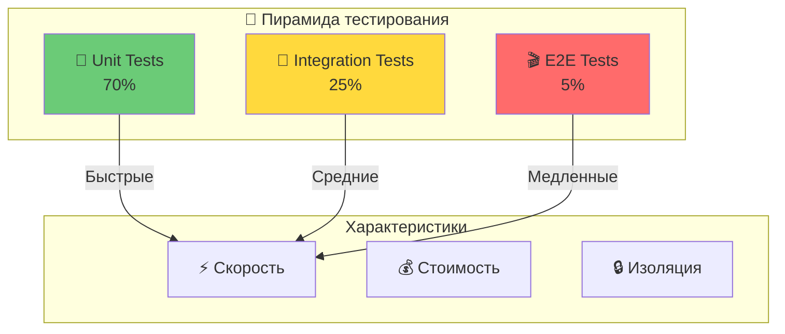
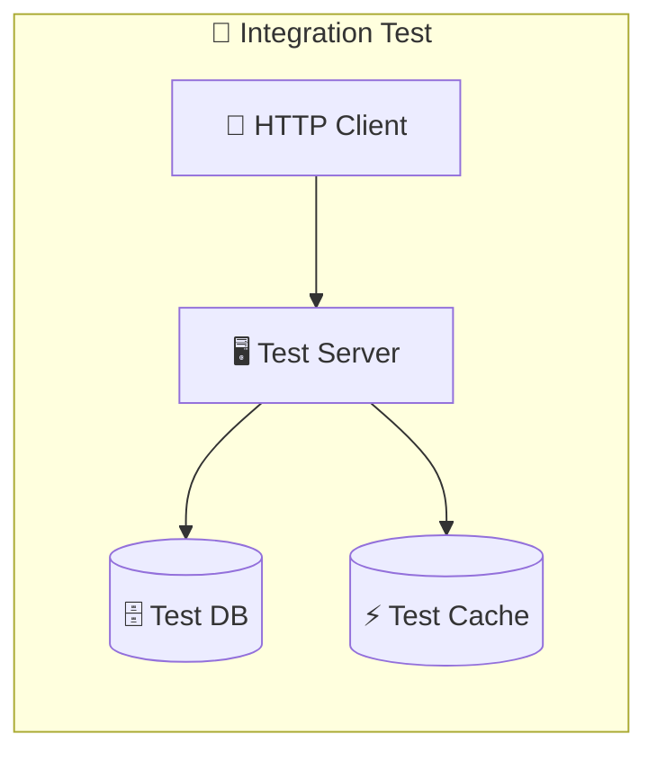
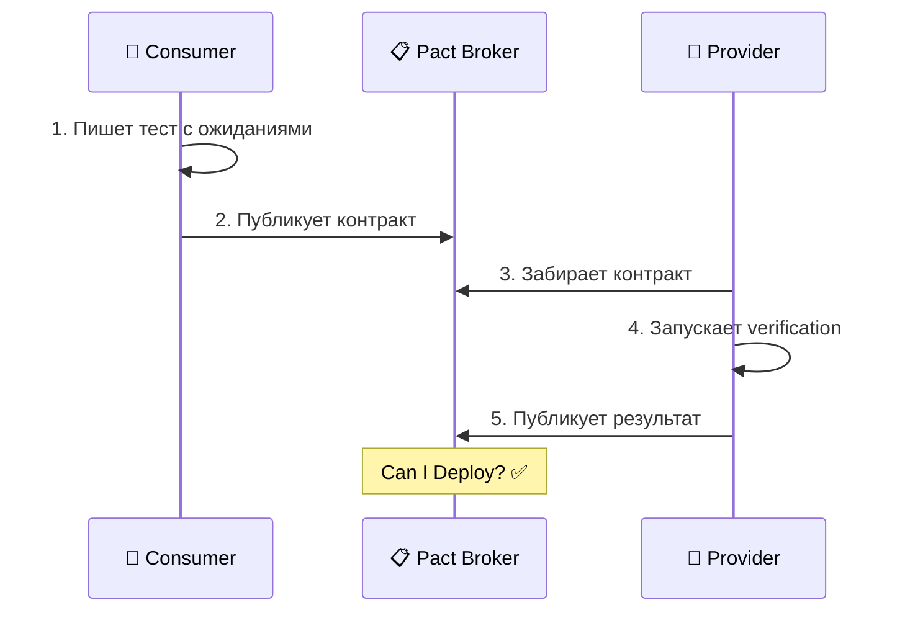

# Этап 8: Модульное и интеграционное тестирование

## 🧪 Testing Layer

**Версия документа:** 1.0  
**Длительность этапа:** Постоянно (интегрировано в CI/CD)  
**Ответственный:** TIER-2 Разработчик, QA Engineer

---

## Цель этапа

Обеспечить качество кода через комплексное тестирование: модульные тесты (Unit) для изолированной проверки компонентов, интеграционные тесты для проверки взаимодействия между модулями, и контрактные тесты для верификации соответствия API-контрактам.

---

## Входные данные

| Данные | Источник |
|--------|----------|
| API контракты | [02-contracts-and-architecture.md](./02-contracts-and-architecture.md) |
| Заглушки и моки | [04-stub-generation.md](./04-stub-generation.md) |
| Критерии качества | [06-quality-checks.md](./06-quality-checks.md) |
| Технологический стек | [Инструменты_для_разработки.md](./appendices/Инструменты_для_разработки.md) |

---

## Введение: Роль тестирования в обеспечении качества

Тестирование является критически важным этапом в процессе разработки, обеспечивающим:

1. **Доверие к коду** — уверенность в корректности работы отдельных компонентов
2. **Раннее обнаружение ошибок** — выявление проблем на этапе разработки, а не в продакшене
3. **Документацию поведения** — тесты служат живой документацией ожидаемого поведения
4. **Безопасность рефакторинга** — возможность безопасного изменения кода
5. **Контрактное соответствие** — гарантия совместимости между сервисами



---

## 1. Модульное тестирование (Unit Tests)

### 1.1 Принципы модульного тестирования

Модульные тесты проверяют изолированные единицы кода (функции, методы, классы) без внешних зависимостей.

**Ключевые принципы (FIRST):**

| Принцип | Описание | Пример |
|---------|----------|--------|
| **F**ast | Быстрое выполнение | Тесты выполняются за миллисекунды |
| **I**ndependent | Независимость друг от друга | Каждый тест создаёт свои данные |
| **R**epeatable | Повторяемость | Одинаковый результат при каждом запуске |
| **S**elf-validating | Самопроверка | Автоматический assert без ручной проверки |
| **T**imely | Своевременность | Пишутся вместе или до кода (TDD) |

### 1.2 Инструменты для бэкенда (C# / .NET)

| Инструмент | Назначение | Особенности |
|------------|------------|-------------|
| **xUnit** | Test framework | Атрибуты [Fact], [Theory], [InlineData] |
| **FluentAssertions** | Assertions | Читаемые утверждения `.Should().Be()` |
| **Moq** | Mocking | Создание моков `Mock<IInterface>` |
| **AutoFixture** | Test data | Автогенерация тестовых данных |
| **Shouldly** | Assertions | Альтернатива FluentAssertions |

```csharp
// tests/backend/GoldPC.UnitTests/Services/CatalogServiceTests.cs
using Xunit;
using FluentAssertions;
using Moq;
using AutoFixture;

public class CatalogServiceTests
{
    private readonly Fixture _fixture = new();
    private readonly Mock<IProductRepository> _repositoryMock;
    private readonly Mock<ICacheService> _cacheMock;
    private readonly CatalogService _sut; // System Under Test

    public CatalogServiceTests()
    {
        _repositoryMock = new Mock<IProductRepository>();
        _cacheMock = new Mock<ICacheService>();
        _sut = new CatalogService(_repositoryMock.Object, _cacheMock.Object);
    }

    [Fact]
    public async Task GetProductById_WhenProductExists_ReturnsProduct()
    {
        // Arrange
        var productId = _fixture.Create<Guid>();
        var expectedProduct = _fixture.Build<Product>()
            .With(p => p.Id, productId)
            .Create();
        
        _repositoryMock
            .Setup(r => r.GetByIdAsync(productId))
            .ReturnsAsync(expectedProduct);

        // Act
        var result = await _sut.GetProductByIdAsync(productId);

        // Assert
        result.Should().NotBeNull();
        result.Should().BeEquivalentTo(expectedProduct);
        _repositoryMock.Verify(r => r.GetByIdAsync(productId), Times.Once);
    }

    [Fact]
    public async Task GetProductById_WhenProductNotFound_ThrowsNotFoundException()
    {
        // Arrange
        var productId = _fixture.Create<Guid>();
        _repositoryMock
            .Setup(r => r.GetByIdAsync(productId))
            .ReturnsAsync((Product?)null);

        // Act
        var act = async () => await _sut.GetProductByIdAsync(productId);

        // Assert
        await act.Should().ThrowAsync<NotFoundException>()
            .WithMessage($"Product with id {productId} not found");
    }

    [Theory]
    [InlineData("cpu", 10)]
    [InlineData("gpu", 5)]
    [InlineData("ram", 20)]
    public async Task GetProductsByCategory_ReturnsFilteredProducts(
        string category, int expectedCount)
    {
        // Arrange
        var products = _fixture.CreateMany<Product>(30).ToList();
        products.Take(expectedCount).ToList().ForEach(p => p.Category = category);
        
        _repositoryMock
            .Setup(r => r.GetByCategoryAsync(category))
            .ReturnsAsync(products.Where(p => p.Category == category));

        // Act
        var result = await _sut.GetProductsByCategoryAsync(category);

        // Assert
        result.Should().HaveCount(expectedCount);
        result.All(p => p.Category == category).Should().BeTrue();
    }
}
```

### 1.3 Инструменты для фронтенда (TypeScript / React)

| Инструмент | Назначение | Особенности |
|------------|------------|-------------|
| **Vitest / Jest** | Test runner | Быстрый, ESM-first |
| **React Testing Library** | Component testing | Тестирование поведения пользователя |
| **MSW** | API mocking | Service Worker для перехвата запросов |
| **@testing-library/user-event** | User interactions | Реалистичные действия пользователя |

```typescript
// src/frontend/src/components/ProductCard/ProductCard.test.tsx
import { render, screen, fireEvent } from '@testing-library/react';
import { describe, it, expect, vi } from 'vitest';
import { ProductCard } from './ProductCard';
import type { Product } from '@/types';

describe('ProductCard', () => {
  const mockProduct: Product = {
    id: '1',
    name: 'AMD Ryzen 9 7950X',
    price: 59999,
    stock: 10,
    category: 'cpu',
    manufacturer: 'AMD',
    specifications: {}
  };

  it('renders product name and price', () => {
    render(<ProductCard product={mockProduct} onAddToCart={() => {}} />);
    
    expect(screen.getByText('AMD Ryzen 9 7950X')).toBeInTheDocument();
    expect(screen.getByText(/59 999/)).toBeInTheDocument();
  });

  it('shows "Out of stock" when stock is 0', () => {
    render(
      <ProductCard product={{ ...mockProduct, stock: 0 }} onAddToCart={() => {}} />
    );
    
    expect(screen.getByText(/нет в наличии/i)).toBeInTheDocument();
  });

  it('calls onAddToCart when button clicked', () => {
    const mockAddToCart = vi.fn();
    render(<ProductCard product={mockProduct} onAddToCart={mockAddToCart} />);
    
    fireEvent.click(screen.getByRole('button', { name: /в корзину/i }));
    
    expect(mockAddToCart).toHaveBeenCalledWith(mockProduct.id);
  });
});
```

### 1.4 Использование моков и стабов

```csharp
// Моки для изоляции зависимостей
public class OrderServiceTests
{
    private readonly Mock<IOrderRepository> _orderRepoMock;
    private readonly Mock<IProductService> _productServiceMock;
    private readonly Mock<INotificationService> _notificationMock;
    private readonly OrderService _sut;

    public OrderServiceTests()
    {
        _orderRepoMock = new Mock<IOrderRepository>();
        _productServiceMock = new Mock<IProductService>();
        _notificationMock = new Mock<INotificationService>();
        
        _sut = new OrderService(
            _orderRepoMock.Object,
            _productServiceMock.Object,
            _notificationMock.Object
        );
    }

    [Fact]
    public async Task CreateOrder_WhenProductsAvailable_SendsNotification()
    {
        // Arrange
        var orderData = new CreateOrderDto { /* ... */ };
        
        _productServiceMock
            .Setup(p => p.CheckAvailabilityAsync(It.IsAny<IEnumerable<Guid>>()))
            .ReturnsAsync(true);

        // Act
        await _sut.CreateOrderAsync(orderData);

        // Assert
        _notificationMock.Verify(
            n => n.SendOrderCreatedAsync(It.IsAny<Guid>(), orderData.UserId),
            Times.Once
        );
    }
}
```

### 1.5 Минимальное покрытие кода

| Компонент | Минимальное покрытие | Обоснование |
|-----------|---------------------|-------------|
| Бизнес-логика (Services) | 80% | Критическая функциональность |
| Доменные сущности | 80% | Сложные правила и инварианты |
| Валидаторы | 90% | Корректность данных |
| Контроллеры | 70% | Проверка ответов и статусов |
| React компоненты | 70% | Критические пути |
| Custom Hooks | 80% | Бизнес-логика фронтенда |

### 1.6 Запуск в CI при каждом коммите

```yaml
# .github/workflows/unit-tests.yml
name: Unit Tests

on:
  push:
    branches: [main, develop]
  pull_request:
    branches: [main, develop]

jobs:
  backend-unit-tests:
    runs-on: ubuntu-latest
    steps:
      - uses: actions/checkout@v4
      
      - name: Setup .NET
        uses: actions/setup-dotnet@v4
        with:
          dotnet-version: '8.0.x'
      
      - name: Run Unit Tests
        run: dotnet test --filter "FullyQualifiedName~UnitTests" 
             --configuration Release 
             --collect:"XPlat Code Coverage"

  frontend-unit-tests:
    runs-on: ubuntu-latest
    steps:
      - uses: actions/checkout@v4
      
      - name: Setup Node.js
        uses: actions/setup-node@v4
        with:
          node-version: '20'
      
      - name: Install dependencies
        working-directory: src/frontend
        run: npm ci
      
      - name: Run Tests
        working-directory: src/frontend
        run: npm run test:coverage
```

---

## 2. Интеграционное тестирование

### 2.1 Принципы интеграционного тестирования

Интеграционные тесты проверяют взаимодействие между модулями: API-запросы к реальному или заглушенному сервису, работу с базой данных, кэшем.



### 2.2 Инструменты

| Инструмент | Назначение | Особенности |
|------------|------------|-------------|
| **Testcontainers** | Контейнерные БД | PostgreSQL, Redis, Kafka |
| **WebApplicationFactory** | Тестовый сервер | ASP.NET Core in-memory |
| **Supertest** | HTTP assertions | Для Express.js API |

### 2.3 Тестирование взаимодействия с БД

```csharp
// Testcontainers для реальной БД в тестах
public class DatabaseFixture : IAsyncLifetime
{
    private readonly PostgreSQLContainer _postgres = new PostgreSQLBuilder()
        .WithImage("postgres:16-alpine")
        .WithDatabase("goldpc_test")
        .Build();

    public string ConnectionString => _postgres.GetConnectionString();

    public async Task InitializeAsync() => await _postgres.StartAsync();
    public async Task DisposeAsync() => await _postgres.DisposeAsync();
}

// Интеграционный тест с WebApplicationFactory
public class OrdersApiTests : IClassFixture<DatabaseFixture>, IAsyncLifetime
{
    private readonly WebApplicationFactory<Program> _factory;
    private readonly HttpClient _client;
    private readonly ApplicationDbContext _dbContext;

    public OrdersApiTests(DatabaseFixture fixture)
    {
        _factory = new WebApplicationFactory<Program>()
            .WithWebHostBuilder(builder =>
            {
                builder.ConfigureServices(services =>
                {
                    services.AddDbContext<ApplicationDbContext>(options =>
                        options.UseNpgsql(fixture.ConnectionString));
                });
            });
        
        _client = _factory.CreateClient();
        _dbContext = _factory.Services.CreateScope()
            .ServiceProvider.GetRequiredService<ApplicationDbContext>();
    }

    [Fact]
    public async Task CreateOrder_WithValidData_ReturnsCreated()
    {
        // Arrange
        var user = new UserFaker().Generate();
        _dbContext.Users.Add(user);
        
        var products = new ProductFaker().Generate(2);
        _dbContext.Products.AddRange(products);
        await _dbContext.SaveChangesAsync();

        var token = GenerateTestToken(user);
        _client.DefaultRequestHeaders.Authorization = 
            new AuthenticationHeaderValue("Bearer", token);

        var request = new
        {
            Items = products.Select(p => new { ProductId = p.Id, Quantity = 1 }),
            DeliveryMethod = "Pickup"
        };

        // Act
        var response = await _client.PostAsJsonAsync("/api/v1/orders", request);

        // Assert
        response.StatusCode.Should().Be(HttpStatusCode.Created);
        
        var order = await response.Content.ReadFromJsonAsync<OrderDto>();
        order!.Status.Should().Be("New");
    }

    public async Task InitializeAsync() => await _dbContext.Database.MigrateAsync();
    public async Task DisposeAsync() => await _dbContext.Database.EnsureDeletedAsync();
}
```

### 2.4 Использование заглушек из этапа 4

В соответствии с [04-stub-generation.md](./04-stub-generation.md):

```csharp
// WireMock для внешних сервисов (платёжные шлюзы, SMS)
public class OrderProcessingTests : IClassFixture<WireMockFixture>
{
    private readonly HttpClient _client;
    private readonly WireMockServer _wireMock;

    [Fact]
    public async Task ProcessOrder_WhenPaymentSucceeds_CreatesOrder()
    {
        // Arrange - настройка заглушки
        _wireMock.Given(Request.Create()
            .WithPath("/api/payments")
            .UsingPost())
        .RespondWith(Response.Create()
            .WithStatusCode(200)
            .WithBodyAsJson(new { success = true, transactionId = "TRX-123" }));

        // Act
        var response = await _client.PostAsJsonAsync("/api/v1/orders", orderDto);

        // Assert
        response.StatusCode.Should().Be(HttpStatusCode.Created);
        
        // Проверка вызова заглушки
        _wireMock.Verify(
            Request.Create().WithPath("/api/payments").UsingPost(),
            Times.Once()
        );
    }
}
```

---

## 3. Контрактное тестирование

### 3.1 Принципы Consumer-Driven Contract Testing



### 3.2 Инструменты

| Инструмент | Назначение | Язык/Платформа |
|------------|------------|----------------|
| **Pact** | Consumer-driven contracts | Multi-language |
| **Pact JS** | Frontend consumer tests | TypeScript |
| **Pact Net** | Backend provider tests | C#/.NET |
| **Pact Broker** | Хранение контрактов | Docker/SaaS |

### 3.3 Consumer Tests (Frontend → Backend)

```typescript
// src/frontend/src/api/__tests__/pacts/catalog-consumer.test.ts
import Pact from '@pact-foundation/pact';
import { CatalogApiClient } from '../catalog-client';

const provider = new Pact.Pact({
  consumer: 'GoldPC-Frontend',
  provider: 'GoldPC-Catalog-API',
  port: 1234,
  dir: './pacts'
});

describe('Catalog API Consumer', () => {
  beforeAll(() => provider.setup());
  afterAll(() => provider.finalize());

  it('returns a list of products', async () => {
    await provider.addInteraction({
      uponReceiving: 'a request for products',
      withRequest: {
        method: 'GET',
        path: '/api/v1/catalog/products',
        query: { page: '1', limit: '20' }
      },
      willRespondWith: {
        status: 200,
        body: {
          data: Pact.Matchers.eachLike({
            id: Pact.Matchers.uuid(),
            name: Pact.Matchers.string('Product Name'),
            price: Pact.Matchers.decimal(1000.00)
          })
        }
      }
    });

    const client = new CatalogApiClient(`http://localhost:${provider.opts.port}`);
    const result = await client.getProducts({ page: 1, limit: 20 });

    expect(result.data).toBeInstanceOf(Array);
  });
});
```

### 3.4 Provider Verification (Backend)

```csharp
// tests/backend/GoldPC.Tests/Contract/CatalogApiProviderTests.cs
public class CatalogApiProviderTests
{
    [Fact]
    public void VerifyPactWithFrontend()
    {
        new PactVerifier(new PactVerifierConfig())
            .ServiceProvider("GoldPC-Catalog-API", 5000)
            .HonoursPactWith("GoldPC-Frontend")
            .PactUri("https://pact-broker.example.com/pacts/...")
            .Verify();
    }
}
```

### 3.5 Интеграция в CI

```yaml
# .github/workflows/contract-tests.yml
contract-tests:
  runs-on: ubuntu-latest
  steps:
    - uses: actions/checkout@v4
    
    - name: Run Contract Tests
      run: dotnet test --filter "FullyQualifiedName~Contract"
    
    - name: Publish Pact Files
      run: |
        npm install -g @pact-foundation/pact-cli
        pact-broker publish ./pacts \
          --consumer-app-version ${{ github.sha }} \
          --branch ${{ github.ref_name }}
```

---

## 4. Организация тестовых данных

### 4.1 Фикстуры и фабрики

```csharp
// Bogus для генерации тестовых данных
public class ProductFaker : Faker<Product>
{
    public ProductFaker()
    {
        RuleFor(p => p.Id, f => f.Random.Guid());
        RuleFor(p => p.Name, f => f.Commerce.ProductName());
        RuleFor(p => p.Sku, f => f.Commerce.Ean13());
        RuleFor(p => p.Price, f => decimal.Parse(f.Commerce.Price(100, 100000)));
        RuleFor(p => p.Stock, f => f.Random.Int(0, 100));
        RuleFor(p => p.Category, f => f.PickRandom("cpu", "gpu", "ram"));
        RuleFor(p => p.Manufacturer, f => f.Company.CompanyName());
    }
}

// Использование
var products = new ProductFaker().Generate(100);
```

```typescript
// @faker-js/faker для Frontend
import { faker } from '@faker-js/faker';

export const generateProduct = (): Product => ({
  id: faker.string.uuid(),
  name: faker.commerce.productName(),
  price: parseFloat(faker.commerce.price({ min: 100, max: 100000 })),
  stock: faker.number.int({ min: 0, max: 100 }),
  category: faker.helpers.arrayElement(['cpu', 'gpu', 'ram']),
  manufacturer: faker.company.name()
});

export const generateProducts = (count: number): Product[] => 
  Array.from({ length: count }, generateProduct);
```

### 4.2 Очистка данных после тестов

```csharp
// Автоматическая очистка
public class DatabaseCleanup : IAsyncLifetime
{
    private readonly ApplicationDbContext _dbContext;

    public async Task InitializeAsync() { }
    
    public async Task DisposeAsync()
    {
        // Очистка всех таблиц
        var tableNames = new[] { "Orders", "Products", "Users" };
        foreach (var table in tableNames)
        {
            await _dbContext.Database.ExecuteSqlRawAsync($"TRUNCATE TABLE \"{table}\" CASCADE");
        }
    }
}
```

### 4.3 Тестовые данные в изолированных схемах

```csharp
// Каждому тесту — своя схема БД
public class IsolatedDatabaseFixture : IAsyncLifetime
{
    private readonly string _schemaName = $"test_{Guid.NewGuid():N}";
    
    public async Task InitializeAsync()
    {
        await CreateSchemaAsync(_schemaName);
        await RunMigrationsAsync(_schemaName);
    }

    public async Task DisposeAsync()
    {
        await DropSchemaAsync(_schemaName);
    }
}
```

---

## 5. Отчёты о тестировании

### 5.1 Генерация отчётов о покрытии

```bash
# Backend - coverlet + ReportGenerator
dotnet test --collect:"XPlat Code Coverage"
reportgenerator \
  -reports:"./coverage/*/coverage.cobertura.xml" \
  -targetdir:"./coverage/report" \
  -reporttypes:Html;Badges

# Frontend - Jest/Vitest
npm run test:coverage -- --reporter=html
```

### 5.2 Метрики отчётов

| Метрика | Описание | Источник |
|---------|----------|----------|
| Line Coverage | Покрытие строк кода | coverlet, Jest |
| Branch Coverage | Покрытие ветвлений | coverlet |
| Function Coverage | Покрытие функций/методов | coverlet, Jest |
| Mutation Score | Мутационное тестирование | Stryker.NET |
| Test Count | Количество тестов | Test runner |
| Test Duration | Время выполнения | Test runner |

### 5.3 Визуализация в CI

```yaml
# Интеграция с Codecov
- name: Upload Coverage to Codecov
  uses: codecov/codecov-action@v3
  with:
    files: ./coverage/coverage.xml
    flags: unittests
    fail_ci_if_error: true

# Бейджи в README
[](https://codecov.io/gh/org/repo)
```

### 5.4 Отчёт о результатах тестов

```xml
<!-- junit-xml формат для CI систем -->
<?xml version="1.0" encoding="UTF-8"?>
<testsuites>
  <testsuite name="UnitTests" tests="150" failures="0" errors="0" time="2.5">
    <testcase name="GetProductById_WhenProductExists_ReturnsProduct" time="0.015"/>
    <testcase name="GetProductById_WhenProductNotFound_ThrowsNotFoundException" time="0.008"/>
  </testsuite>
</testsuites>
```

---

## Критерии готовности (Definition of Done)

- [ ] Все модули имеют модульные тесты
- [ ] Критический путь покрыт интеграционными тестами
- [ ] Контрактные тесты настроены для всех публичных API
- [ ] Code coverage ≥70% для бизнес-логики
- [ ] Все тесты проходят в CI/CD
- [ ] Нет пропущенных (skipped) тестов
- [ ] Отчёты о покрытии генерируются автоматически
- [ ] Тестовые данные генерируются через фабрики/фикстуры

---

## Возможные риски и митигация

| Риск | Вероятность | Влияние | Меры митигации |
|------|-------------|---------|----------------|
| Низкое покрытие тестами | Средняя | Высокое | Code coverage gates в CI, обязательное покрытие 70% |
| Медленные тесты | Средняя | Среднее | Пирамида тестирования, параллельный запуск |
| Хрупкие тесты (flaky) | Средняя | Среднее | Изоляция данных, детерминированные тесты |
| Устаревшие тесты | Низкая | Низкое | Рефакторинг вместе с кодом |
| Неполные контракты | Средняя | Высокое | Code review контрактов, интеграция Pact в CI |

---

## Выходные артефакты

| Артефакт | Формат | Расположение |
|----------|--------|--------------|
| Unit тесты | C#, TypeScript | `tests/`, `*.test.ts` |
| Integration тесты | C# | `tests/Integration/` |
| Contract тесты | Pact JSON | `pacts/` |
| Отчёт о покрытии | HTML, XML | `coverage/` |
| CI конфигурация | YAML | `.github/workflows/` |

---

## Связанные документы

- [02-contracts-and-architecture.md](./02-contracts-and-architecture.md) — API контракты
- [04-stub-generation.md](./04-stub-generation.md) — Заглушки и моки
- [06-quality-checks.md](./06-quality-checks.md) — Критерии качества
- [09-code-review-and-integration.md](./09-code-review-and-integration.md) — Ревью и интеграция

---

*Документ создан в рамках плана разработки GoldPC.*