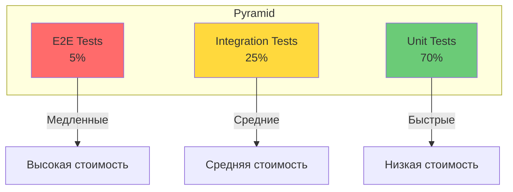

# Этап 8: Тестирование

## 🧪 ТЕСТИРОВАНИЕ: Unit → Integration → Contract

**Версия документа:** 1.0  
**Длительность этапа:** Постоянно (в процессе разработки)  
**Ответственный:** TIER-2/3 Разработчики, QA

---

## Цель этапа

Обеспечить качество кода через многоуровневое тестирование: Unit тесты, Integration тесты, Contract тесты.

---

## Входные данные

| Данные | Источник |
|--------|----------|
| Исходный код | [05-parallel-development.md](./05-parallel-development.md) |
| API контракты | [02-contracts-and-architecture.md](./02-contracts-and-architecture.md) |
| Тестовые данные | [04-stub-generation.md](./04-stub-generation.md) |

---

## Пирамида тестирования



---

## 8.1 Unit Tests

### Структура тестов

```
src/backend/GoldPC.Tests/
├── Unit/
│   ├── Core/
│   │   ├── Services/
│   │   │   ├── OrderServiceTests.cs
│   │   │   ├── ProductServiceTests.cs
│   │   │   └── AuthServiceTests.cs
│   │   └── Entities/
│   └── Infrastructure/
│       ├── Repositories/
│       └── Validators/
├── Integration/
│   ├── API/
│   └── Database/
└── TestHelpers/
    ├── Fakers/
    ├── Builders/
    └── Mocks/
```

### Пример Unit теста

```csharp
// src/backend/GoldPC.Tests/Unit/Core/Services/OrderServiceTests.cs
public class OrderServiceTests
{
    private readonly Mock<IOrderRepository> _orderRepositoryMock;
    private readonly Mock<IProductRepository> _productRepositoryMock;
    private readonly Mock<IEventBus> _eventBusMock;
    private readonly Mock<ILogger<OrderService>> _loggerMock;
    private readonly OrderService _sut; // System Under Test

    public OrderServiceTests()
    {
        _orderRepositoryMock = new Mock<IOrderRepository>();
        _productRepositoryMock = new Mock<IProductRepository>();
        _eventBusMock = new Mock<IEventBus>();
        _loggerMock = new Mock<ILogger<OrderService>>();
        
        _sut = new OrderService(
            _orderRepositoryMock.Object,
            _productRepositoryMock.Object,
            _eventBusMock.Object,
            _loggerMock.Object);
    }

    [Fact]
    public async Task CreateOrderAsync_WithValidItems_ReturnsOrder()
    {
        // Arrange
        var userId = Guid.NewGuid();
        var products = new ProductFaker().Generate(3);
        var request = new CreateOrderRequest
        {
            Items = products.Select(p => new OrderItemRequest
            {
                ProductId = p.Id,
                Quantity = 2
            }).ToList()
        };

        _productRepositoryMock
            .Setup(r => r.GetByIdsAsync(It.IsAny<IEnumerable<Guid>>()))
            .ReturnsAsync(products);

        _orderRepositoryMock
            .Setup(r => r.AddAsync(It.IsAny<Order>()))
            .ReturnsAsync((Order o) => o);

        // Act
        var result = await _sut.CreateOrderAsync(userId, request);

        // Assert
        result.Should().NotBeNull();
        result.Status.Should().Be(OrderStatus.New);
        result.Items.Should().HaveCount(3);
        
        _orderRepositoryMock.Verify(r => r.AddAsync(It.IsAny<Order>()), Times.Once);
        _eventBusMock.Verify(e => e.PublishAsync(It.IsAny<OrderCreatedEvent>()), Times.Once);
    }

    [Fact]
    public async Task CreateOrderAsync_WithInsufficientStock_ThrowsException()
    {
        // Arrange
        var products = new ProductFaker()
            .RuleFor(p => p.Stock, 1) // Только 1 на складе
            .Generate(1);
            
        var request = new CreateOrderRequest
        {
            Items = new List<OrderItemRequest>
            {
                new() { ProductId = products[0].Id, Quantity = 5 } // Запрос 5
            }
        };

        _productRepositoryMock
            .Setup(r => r.GetByIdsAsync(It.IsAny<IEnumerable<Guid>>()))
            .ReturnsAsync(products);

        // Act & Assert
        await Assert.ThrowsAsync<InsufficientStockException>(
            () => _sut.CreateOrderAsync(Guid.NewGuid(), request));
    }

    [Theory]
    [InlineData(OrderStatus.New, OrderStatus.Processing)]
    [InlineData(OrderStatus.Processing, OrderStatus.Paid)]
    [InlineData(OrderStatus.Paid, OrderStatus.Ready)]
    public async Task UpdateStatus_ValidTransition_ChangesStatus(
        OrderStatus current, OrderStatus next)
    {
        // Arrange
        var order = new OrderFaker().Generate();
        order.Status = current;
        
        _orderRepositoryMock
            .Setup(r => r.GetByIdAsync(order.Id))
            .ReturnsAsync(order);

        // Act
        await _sut.UpdateStatusAsync(order.Id, next);

        // Assert
        order.Status.Should().Be(next);
    }
}
```

### Тестирование с Test Builders

```csharp
// src/backend/GoldPC.Tests/TestHelpers/Builders/OrderBuilder.cs
public class OrderBuilder
{
    private Order _order = new();

    public OrderBuilder WithId(Guid id)
    {
        _order.Id = id;
        return this;
    }

    public OrderBuilder WithUser(Guid userId)
    {
        _order.UserId = userId;
        return this;
    }

    public OrderBuilder WithProducts(params Product[] products)
    {
        _order.Items = products.Select(p => new OrderItem
        {
            ProductId = p.Id,
            Quantity = 1,
            Price = p.Price
        }).ToList();
        return this;
    }

    public OrderBuilder WithStatus(OrderStatus status)
    {
        _order.Status = status;
        return this;
    }

    public Order Build()
    {
        var result = _order;
        _order = new Order();
        return result;
    }
}

// Использование
var order = new OrderBuilder()
    .WithId(Guid.NewGuid())
    .WithUser(userId)
    .WithProducts(product1, product2)
    .WithStatus(OrderStatus.New)
    .Build();
```

---

## 8.2 Integration Tests

### WebApplicationFactory Setup

```csharp
// src/backend/GoldPC.Tests/Integration/CustomWebApplicationFactory.cs
public class CustomWebApplicationFactory : WebApplicationFactory<Program>, IAsyncLifetime
{
    private readonly TestcontainersContainer _postgres;
    private readonly TestcontainersContainer _redis;

    public CustomWebApplicationFactory()
    {
        _postgres = new TestcontainersBuilder<PostgreSqlTestcontainer>()
            .WithDatabase(new PostgreSqlTestcontainerConfiguration
            {
                Database = "goldpc_test",
                Username = "test",
                Password = "test"
            })
            .Build();

        _redis = new TestcontainersBuilder<RedisTestcontainer>()
            .WithDatabase(new RedisTestcontainerConfiguration())
            .Build();
    }

    protected override void ConfigureWebHost(IWebHostBuilder builder)
    {
        builder.ConfigureServices(services =>
        {
            // Замена реальных сервисов на тестовые
            var descriptor = services.SingleOrDefault(
                d => d.ServiceType == typeof(DbContextOptions<ApplicationDbContext>));
            if (descriptor != null)
                services.Remove(descriptor);

            services.AddDbContext<ApplicationDbContext>(options =>
                options.UseNpgsql(_postgres.ConnectionString));

            services.AddStackExchangeRedisCache(options =>
                options.Configuration = _redis.ConnectionString);
        });

        builder.UseEnvironment("Testing");
    }

    public async Task InitializeAsync()
    {
        await _postgres.StartAsync();
        await _redis.StartAsync();
    }

    public new async Task DisposeAsync()
    {
        await _postgres.DisposeAsync();
        await _redis.DisposeAsync();
    }
}
```

### Пример Integration теста

```csharp
// src/backend/GoldPC.Tests/Integration/API/OrdersApiTests.cs
public class OrdersApiTests : IClassFixture<CustomWebApplicationFactory>, IAsyncLifetime
{
    private readonly CustomWebApplicationFactory _factory;
    private readonly HttpClient _client;
    private readonly ApplicationDbContext _db;

    public OrdersApiTests(CustomWebApplicationFactory factory)
    {
        _factory = factory;
        _client = factory.CreateClient();
        var scope = factory.Services.CreateScope();
        _db = scope.ServiceProvider.GetRequiredService<ApplicationDbContext>();
    }

    [Fact]
    public async Task GetOrders_WithoutAuth_Returns401()
    {
        // Act
        var response = await _client.GetAsync("/api/v1/orders");

        // Assert
        response.StatusCode.Should().Be(HttpStatusCode.Unauthorized);
    }

    [Fact]
    public async Task GetOrders_WithAuth_ReturnsUserOrders()
    {
        // Arrange
        var user = new UserFaker().Generate();
        _db.Users.Add(user);
        
        var orders = new OrderFaker()
            .RuleFor(o => o.UserId, user.Id)
            .Generate(3);
        _db.Orders.AddRange(orders);
        await _db.SaveChangesAsync();

        var token = GenerateTestToken(user);
        _client.DefaultRequestHeaders.Authorization = 
            new AuthenticationHeaderValue("Bearer", token);

        // Act
        var response = await _client.GetAsync("/api/v1/orders");
        var content = await response.Content.ReadFromJsonAsync<PaginatedResult<OrderDto>>();

        // Assert
        response.StatusCode.Should().Be(HttpStatusCode.OK);
        content!.Data.Should().HaveCount(3);
    }

    [Fact]
    public async Task CreateOrder_WithValidData_ReturnsCreated()
    {
        // Arrange
        var user = new UserFaker().Generate();
        _db.Users.Add(user);
        
        var products = new ProductFaker().Generate(2);
        _db.Products.AddRange(products);
        await _db.SaveChangesAsync();

        var token = GenerateTestToken(user);
        _client.DefaultRequestHeaders.Authorization = 
            new AuthenticationHeaderValue("Bearer", token);

        var request = new
        {
            Items = products.Select(p => new { ProductId = p.Id, Quantity = 1 }),
            DeliveryMethod = "Pickup",
            PaymentMethod = "Online"
        };

        // Act
        var response = await _client.PostAsJsonAsync("/api/v1/orders", request);

        // Assert
        response.StatusCode.Should().Be(HttpStatusCode.Created);
        
        var order = await response.Content.ReadFromJsonAsync<OrderDto>();
        order!.Status.Should().Be("New");
    }

    private string GenerateTestToken(User user)
    {
        var claims = new[]
        {
            new Claim(ClaimTypes.NameIdentifier, user.Id.ToString()),
            new Claim(ClaimTypes.Email, user.Email),
            new Claim(ClaimTypes.Role, user.Role.ToString())
        };

        var key = new SymmetricSecurityKey(Encoding.UTF8.GetBytes("test_key_for_testing_1234567890"));
        var creds = new SigningCredentials(key, SecurityAlgorithms.HmacSha256);

        var token = new JwtSecurityToken(
            claims: claims,
            expires: DateTime.UtcNow.AddHours(1),
            signingCredentials: creds);

        return new JwtSecurityTokenHandler().WriteToken(token);
    }

    public Task InitializeAsync() => Task.CompletedTask;
    public Task DisposeAsync() => _db.Database.EnsureDeletedAsync();
}
```

---

## 8.3 Contract Tests

### Pact Tests (Consumer)

```csharp
// src/backend/GoldPC.Tests/Contract/PaymentServiceContractTests.cs
public class PaymentServiceContractTests
{
    private readonly IPactBuilderV3 _pactBuilder;

    public PaymentServiceContractTests()
    {
        _pactBuilder = Pact.V3("GoldPC-API", "PaymentService", new PactConfig
        {
            PactDir = "../../../pacts"
        });
    }

    [Fact]
    public async Task ProcessPayment_WithValidRequest_ReturnsSuccess()
    {
        // Arrange
        _pactBuilder
            .UponReceiving("A payment request")
            .Given("Payment gateway is available")
            .WithRequest(HttpMethod.Post, "/api/v1/payments")
            .WithHeader("Content-Type", "application/json")
            .WithJsonBody(new
            {
                orderId = Match.Regex(Guid.NewGuid().ToString(), @"[\d\w-]+"),
                amount = Match.Decimal(100.00m),
                currency = "RUB",
                return_url = "https://goldpc.by/payment/return"
            })
            .WillRespond()
            .WithStatus(200)
            .WithHeader("Content-Type", "application/json")
            .WithJsonBody(new
            {
                success = true,
                transaction_id = Match.Regex("TRX-[\d\w]+", @"TRX-[\d\w]+"),
                payment_url = "https://pay.yookassa.ru/..."
            });

        await _pactBuilder.VerifyAsync(async ctx =>
        {
            var client = new PaymentServiceClient(ctx.MockServerUri.ToString());
            
            var result = await client.ProcessPaymentAsync(new PaymentRequest
            {
                OrderId = Guid.NewGuid(),
                Amount = 100.00m,
                Currency = "RUB",
                ReturnUrl = "https://goldpc.by/payment/return"
            });

            result.Success.Should().BeTrue();
            result.TransactionId.Should().StartWith("TRX-");
        });
    }
}
```

### Pact Tests (Provider)

```csharp
// src/backend/GoldPC.Tests/Contract/CatalogApiProviderTests.cs
public class CatalogApiProviderTests
{
    private readonly ITestOutputHelper _output;
    private readonly PactVerifier _verifier;

    public CatalogApiProviderTests(ITestOutputHelper output)
    {
        _output = output;
        _verifier = new PactVerifier(new PactVerifierConfig
        {
            Outputters = new[] { new XunitOutput(_output) }
        });
    }

    [Fact]
    public void VerifyPactWithFrontend()
    {
        var config = new PactVerifierConfig
        {
            ProviderVersion = "1.0.0"
        };

        _verifier
            .ServiceProvider("GoldPC-Catalog-API", 5000)
            .HonoursPactWith("GoldPC-Frontend")
            .PactUri("https://pact-broker.example.com/pacts/provider/GoldPC-Catalog-API/consumer/GoldPC-Frontend/latest")
            .Verify();
    }
}
```

---

## 8.4 Frontend Testing

### Unit Tests (Jest + React Testing Library)

```typescript
// src/frontend/src/components/ProductCard/ProductCard.test.tsx
import { render, screen, fireEvent } from '@testing-library/react';
import { ProductCard } from './ProductCard';
import { BrowserRouter } from 'react-router-dom';

const mockProduct = {
  id: '1',
  name: 'AMD Ryzen 9 7950X',
  price: 59999,
  stock: 10,
  category: 'cpu',
  manufacturer: 'AMD',
};

const renderWithRouter = (component: React.ReactNode) => {
  return render(
    <BrowserRouter>
      {component}
    </BrowserRouter>
  );
};

describe('ProductCard', () => {
  it('renders product name and price', () => {
    renderWithRouter(<ProductCard product={mockProduct} />);
    
    expect(screen.getByText('AMD Ryzen 9 7950X')).toBeInTheDocument();
    expect(screen.getByText('59 999 ₽')).toBeInTheDocument();
  });

  it('shows in stock status when available', () => {
    renderWithRouter(<ProductCard product={mockProduct} />);
    
    expect(screen.getByText('В наличии')).toBeInTheDocument();
  });

  it('shows out of stock when stock is 0', () => {
    renderWithRouter(<ProductCard product={{ ...mockProduct, stock: 0 }} />);
    
    expect(screen.getByText('Нет в наличии')).toBeInTheDocument();
  });

  it('calls onAddToCart when button clicked', () => {
    const mockAddToCart = jest.fn();
    renderWithRouter(
      <ProductCard product={mockProduct} onAddToCart={mockAddToCart} />
    );
    
    fireEvent.click(screen.getByText('В корзину'));
    
    expect(mockAddToCart).toHaveBeenCalledWith(mockProduct);
  });
});
```

### Hooks Testing

```typescript
// src/frontend/src/hooks/useProducts.test.ts
import { renderHook, waitFor } from '@testing-library/react';
import { QueryClient, QueryClientProvider } from '@tanstack/react-query';
import { useProducts } from './useProducts';

const createWrapper = () => {
  const queryClient = new QueryClient({
    defaultOptions: { queries: { retry: false } }
  });
  
  return ({ children }: { children: React.ReactNode }) => (
    <QueryClientProvider client={queryClient}>
      {children}
    </QueryClientProvider>
  );
};

describe('useProducts', () => {
  it('fetches products successfully', async () => {
    const { result } = renderHook(() => useProducts({}), {
      wrapper: createWrapper()
    });

    await waitFor(() => expect(result.current.isSuccess).toBe(true));

    expect(result.current.data).toBeDefined();
    expect(result.current.data?.data).toBeInstanceOf(Array);
  });

  it('filters by category', async () => {
    const { result } = renderHook(() => useProducts({ category: 'cpu' }), {
      wrapper: createWrapper()
    });

    await waitFor(() => expect(result.current.isSuccess).toBe(true));

    const products = result.current.data?.data;
    products?.forEach(product => {
      expect(product.category).toBe('cpu');
    });
  });
});
```

---

## 8.5 Test Coverage

### Конфигурация coverlet

```xml
<!-- В csproj -->
<ItemGroup>
  <PackageReference Include="coverlet.collector" Version="6.0.0">
    <IncludeAssets>runtime; build; native; contentfiles; analyzers; buildtransitive</IncludeAssets>
    <PrivateAssets>all</PrivateAssets>
  </PackageReference>
</ItemGroup>
```

### Запуск с покрытием

```bash
# Генерация отчёта о покрытии
dotnet test --collect:"XPlat Code Coverage" \
  --results-directory ./coverage

# Генерация HTML отчёта
reportgenerator \
  -reports:"./coverage/*/coverage.cobertura.xml" \
  -targetdir:"./coverage/report" \
  -reporttypes:Html

# Открыть отчёт
open ./coverage/report/index.html
```

### Проверка минимального покрытия

```xml
<!-- runsettings.xml -->
<?xml version="1.0" encoding="utf-8"?>
<RunSettings>
  <DataCollectionRunSettings>
    <DataCollectors>
      <DataCollector friendlyName="XPlat code coverage">
        <Configuration>
          <MinimumCoverage>
            <Threshold>70</Threshold>
          </MinimumCoverage>
          <Exclude>
            <ExcludeType>.*Tests.*</ExcludeType>
            <ExcludeType>.*Migrations.*</ExcludeType>
          </Exclude>
          <Include>
            <IncludeType>.*Core\.Services.*</IncludeType>
            <IncludeType>.*Core\.Entities.*</IncludeType>
          </Include>
        </Configuration>
      </DataCollector>
    </DataCollectors>
  </DataCollectionRunSettings>
</RunSettings>
```

---

## 8.6 CI/CD Integration

```yaml
# .github/workflows/test.yml
name: Tests

on: [push, pull_request]

jobs:
  unit-tests:
    runs-on: ubuntu-latest
    steps:
      - uses: actions/checkout@v4
      
      - name: Setup .NET
        uses: actions/setup-dotnet@v4
        with:
          dotnet-version: '8.0.x'
      
      - name: Run Unit Tests
        run: dotnet test --filter "FullyQualifiedName!~Integration" \
             --collect:"XPlat Code Coverage" \
             --settings runsettings.xml
      
      - name: Upload Coverage
        uses: codecov/codecov-action@v3
        with:
          files: ./coverage/*/coverage.cobertura.xml

  integration-tests:
    runs-on: ubuntu-latest
    services:
      postgres:
        image: postgres:16
        env:
          POSTGRES_USER: test
          POSTGRES_PASSWORD: test
          POSTGRES_DB: goldpc_test
        ports:
          - 5432:5432
      redis:
        image: redis:7
        ports:
          - 6379:6379
    
    steps:
      - uses: actions/checkout@v4
      
      - name: Setup .NET
        uses: actions/setup-dotnet@v4
        with:
          dotnet-version: '8.0.x'
      
      - name: Run Integration Tests
        run: dotnet test --filter "FullyQualifiedName~Integration"
        env:
          ConnectionStrings__DefaultConnection: "Host=localhost;Port=5432;Database=goldpc_test;Username=test;Password=test"
          Redis__Connection: "localhost:6379"

  contract-tests:
    runs-on: ubuntu-latest
    steps:
      - uses: actions/checkout@v4
      
      - name: Run Contract Tests
        run: dotnet test --filter "FullyQualifiedName~Contract"
      
      - name: Publish Pact Files
        run: |
          npm install -g @pact-foundation/pact-cli
          pact-broker publish ./pacts \
            --consumer-app-version ${{ github.sha }} \
            --branch ${{ github.ref_name }}
```

---

## Метрики тестирования

| Метрика | Целевое значение |
|---------|------------------|
| Unit Test Coverage | ≥70% |
| Integration Tests | Все критические сценарии |
| Contract Tests | Все API контракты |
| Failed Tests | 0 |
| Test Duration | <5 минут (unit) |

---

## Критерии готовности (Definition of Done)

- [ ] Unit тесты для всех сервисов
- [ ] Unit тесты для всех репозиториев
- [ ] Integration тесты для всех API endpoints
- [ ] Contract тесты для всех контрактов
- [ ] Code coverage ≥70%
- [ ] Все тесты проходят в CI/CD
- [ ] Нет skipped тестов

---

## Связанные документы

- [README.md](./README.md) — Обзор плана
- [06-quality-checks.md](./06-quality-checks.md) — Проверки качества
- [09-code-review-and-integration.md](./09-code-review-and-integration.md) — Ревью

---

*Документ создан в рамках плана разработки GoldPC.*