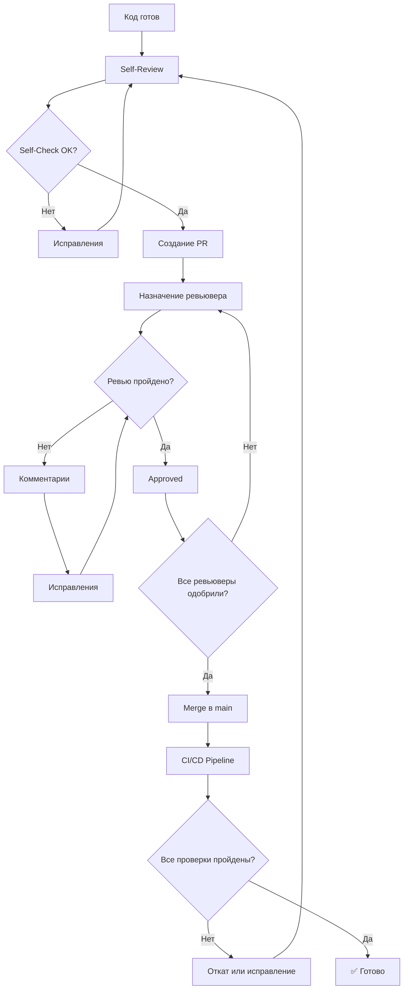
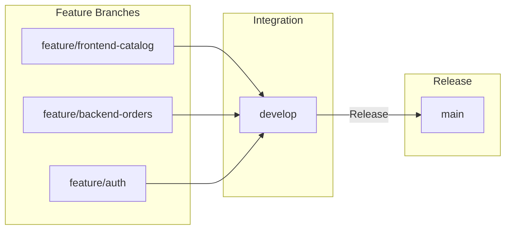
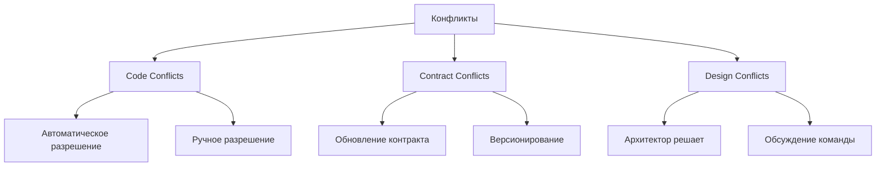

# Этап 9: Code Review и Интеграция

## 🔍 КОД-РЕВЬЮ И ИНТЕГРАЦИЯ АГЕНТОВ

**Версия документа:** 1.0  
**Длительность этапа:** Постоянно (после каждой итерации)  
**Ответственный:** TIER-1 Архитектор, TIER-2 Разработчики

---

## Цель этапа

Обеспечить качество кода через систематическое ревью и бесконфликтную интеграцию кода от разных агентов.

---

## Входные данные

| Данные | Источник |
|--------|----------|
| Исходный код | [05-parallel-development.md](./05-parallel-development.md) |
| Результаты тестов | [08-testing.md](./08-testing.md) |
| Результаты проверок | [06-quality-checks.md](./06-quality-checks.md) |

---

## Процесс Code Review



---

## 9.1 Self-Review Checklist

### Обязательный чек-лист для разработчика

```markdown
## Self-Review Checklist

### Функциональность
- [ ] Код решает поставленную задачу
- [ ] Все краевые случаи обработаны
- [ ] Ошибки корректно обрабатываются
- [ ] Логирование добавлено где необходимо

### Качество кода
- [ ] Код читаемый и понятный
- [ ] Названия переменных/методов понятные
- [ ] Нет дублирования кода
- [ ] Методы не слишком длинные (<50 строк)
- [ ] Классы не слишком большие (<300 строк)

### Тесты
- [ ] Unit тесты написаны
- [ ] Все тесты проходят
- [ ] Покрытие кода ≥70%
- [ ] Краевые случаи протестированы

### Безопасность
- [ ] Нет hardcoded секретов
- [ ] Входные данные валидируются
- [ ] SQL инъекции предотвращены
- [ ] XSS предотвращён
- [ ] Авторизация на месте

### Производительность
- [ ] Нет N+1 запросов
- [ ] Нет лишних циклов
- [ ] Кэширование используется где нужно
- [ ] Асинхронные операции где нужно

### Документация
- [ ] XML комментарии добавлены
- [ ] README обновлён (если нужно)
- [ ] Breaking changes задокументированы
```

---

## 9.2 Pull Request Template

```markdown
## Описание

<!-- Краткое описание изменений -->

### Тип изменений
- [ ] Bug fix (non-breaking change)
- [ ] New feature (non-breaking change)
- [ ] Breaking change
- [ ] Documentation update
- [ ] Refactoring
- [ ] Performance improvement

### Связанные задачи
Resolves #<issue_number>

### Изменения

<!-- Список основных изменений -->
- 
- 
- 

### Скриншоты (если применимо)

<!-- Скриншоты UI изменений -->

### Чек-лист
- [ ] Код следует стайл-гайду проекта
- [ ] Self-review выполнен
- [ ] Комментарии добавлены в сложные места
- [ ] Документация обновлена
- [ ] Тесты добавлены/обновлены
- [ ] Все тесты проходят локально

### Дополнительная информация

<!-- Любая дополнительная информация для ревьюверов -->

### Инструкция для тестирования

<!-- Как протестировать изменения -->
1. 
2. 
3. 
```

---

## 9.3 Code Review Checklist для ревьювера

### Чек-лист ревьювера

```markdown
## Review Checklist

### Архитектура
- [ ] Код соответствует архитектуре проекта
- [ ] Зависимости направлены правильно
- [ ] Паттерны использованы корректно
- [ ] Нет cyclic dependencies

### Код-стайл
- [ ] Соблюдены naming conventions
- [ ] Форматирование корректное
- [ ] Нет лишних пустых строк
- [ ] Imports организованы

### Безопасность
- [ ] Нет уязвимостей
- [ ] Данные валидируются
- [ ] Авторизация на месте
- [ ] Чувствительные данные не логируются

### Производительность
- [ ] Нет очевидных проблем с производительностью
- [ ] Запросы к БД оптимизированы
- [ ] Нет лишних итераций

### Тестируемость
- [ ] Код легко тестируется
- [ ] Зависимости можно мокать
- [ ] Тесты покрывают изменения

### Поддерживаемость
- [ ] Код понятный
- [ ] Документация достаточная
- [ ] Нет "магии"
- [ ] Error handling корректный
```

---

## 9.4 Интеграция агентов

### Merge Strategy



### Branch Naming Convention

```
main                  # Production
├── develop          # Development integration
│   ├── feature/XX   # New features
│   ├── bugfix/XX    # Bug fixes
│   ├── hotfix/XX    # Production hotfixes
│   └── refactor/XX  # Refactoring
```

### Git Workflow для агентов

```bash
# Создание feature branch
git checkout develop
git pull origin develop
git checkout -b feature/M1-catalog-api

# Разработка
git add .
git commit -m "feat(catalog): add product search endpoint"

# Синхронизация с develop
git fetch origin
git rebase origin/develop

# Push
git push origin feature/M1-catalog-api

# Создание Pull Request
# Через GitHub/GitLab UI
```

### Commit Message Convention

```
<type>(<scope>): <subject>

<body>

<footer>

# Types:
- feat: New feature
- fix: Bug fix
- docs: Documentation
- style: Formatting
- refactor: Refactoring
- test: Tests
- chore: Maintenance

# Examples:
feat(catalog): add product search endpoint

- Add GET /api/v1/catalog/products/search
- Implement filtering by category, price, manufacturer
- Add pagination support

Closes #123

fix(orders): resolve race condition in order creation

The issue was caused by concurrent stock updates.
Now using optimistic locking with row version.

Fixes #456
```

---

## 9.5 Конфликты и их разрешение

### Типы конфликтов



### Agent Duel Protocol

```yaml
# Когда два агента предлагают разные решения
agent_duel:
  trigger: "conflict_in_shared_module"
  
  steps:
    - step: "identify_conflict"
      action: "Определить суть конфликта"
      
    - step: "collect_solutions"
      action: "Собрать оба решения с обоснованием"
      
    - step: "peer_review"
      action: "Назначить 2+ ревьюверов"
      criteria:
        - "Качество кода"
        - "Производительность"
        - "Поддерживаемость"
        - "Соответствие архитектуре"
      
    - step: "vote"
      action: "Голосование ревьюверов"
      rules:
        - "Минимум 2 голоса для победы"
        - "При равенстве — решает архитектор"
        
    - step: "document"
      action: "Задокументировать решение"
      artifact: "knowledge-base/decisions/"
```

### Пример Agent Duel

```markdown
# Decision: Order Status Update Strategy

## Context
При обновлении статуса заказа возник конфликт между агентами A и B.

## Proposed Solutions

### Agent A: Event Sourcing
- Плюсы: Full audit trail, replay capability
- Минусы: Complexity, additional infrastructure

### Agent B: Simple State Update
- Плюсы: Simplicity, easy to understand
- Минусы: No audit trail without additional logging

## Decision
**Выбрано: Agent B (Simple State Update)**

### Rationale
- MVP не требует event sourcing
- Audit реализован через отдельный AuditLog
- Простота важнее гибкости на данном этапе

## Voters
- Reviewer 1: B
- Reviewer 2: B
- Architect: B

## Date
2026-03-15
```

---

## 9.6 Автоматические проверки при PR

### GitHub Actions Workflow

```yaml
# .github/workflows/pr-checks.yml
name: PR Checks

on:
  pull_request:
    branches: [main, develop]

jobs:
  # Проверка формата
  format:
    runs-on: ubuntu-latest
    steps:
      - uses: actions/checkout@v4
      
      - name: Setup .NET
        uses: actions/setup-dotnet@v4
        with:
          dotnet-version: '8.0.x'
      
      - name: Check Format
        run: dotnet format --verify-no-changes --severity warn
      
      - name: Setup Node.js
        uses: actions/setup-node@v4
        with:
          node-version: '20.x'
      
      - name: Check Frontend Format
        run: |
          cd src/frontend
          npm ci
          npm run lint
          npm run format:check

  # Тесты
  tests:
    runs-on: ubuntu-latest
    services:
      postgres:
        image: postgres:16
        env:
          POSTGRES_USER: test
          POSTGRES_PASSWORD: test
          POSTGRES_DB: goldpc_test
        ports:
          - 5432:5432
    
    steps:
      - uses: actions/checkout@v4
      
      - name: Setup .NET
        uses: actions/setup-dotnet@v4
        with:
          dotnet-version: '8.0.x'
      
      - name: Run Tests
        run: dotnet test --collect:"XPlat Code Coverage"
        env:
          ConnectionStrings__DefaultConnection: "Host=localhost;Port=5432;Database=goldpc_test;Username=test;Password=test"
      
      - name: Check Coverage
        run: |
          coverage=$(find . -name "coverage.cobertura.xml" -exec cat {} \; | grep -oP 'line-rate="\K[0-9.]+' | head -1)
          if (( $(echo "$coverage < 0.70" | bc) )); then
            echo "Coverage is below 70%"
            exit 1
          fi

  # Проверка контрактов
  contracts:
    runs-on: ubuntu-latest
    steps:
      - uses: actions/checkout@v4
      
      - name: Validate OpenAPI
        run: |
          npm install -g @stoplight/spectral-cli
          spectral lint docs/api/openapi/*.yaml
      
      - name: Run Pact Tests
        run: dotnet test --filter "FullyQualifiedName~Contract"

  # Проверка безопасности
  security:
    runs-on: ubuntu-latest
    steps:
      - uses: actions/checkout@v4
      
      - name: Run Security Scan
        uses: aquasecurity/trivy-action@master
        with:
          scan-type: 'fs'
          scan-ref: '.'
          severity: 'CRITICAL,HIGH'
      
      - name: Check Secrets
        run: |
          # Проверка на hardcoded secrets
          if grep -r -E "(password|secret|api_key|token)\s*=\s*['\"]" --include="*.cs" --include="*.ts" src/; then
            echo "Found potential hardcoded secrets!"
            exit 1
          fi

  # Размер PR
  pr-size:
    runs-on: ubuntu-latest
    steps:
      - uses: actions/checkout@v4
      
      - name: Check PR Size
        run: |
          files_changed=$(git diff --name-only origin/${{ github.base_ref }} | wc -l)
          lines_changed=$(git diff origin/${{ github.base_ref }} | wc -l)
          
          echo "Files changed: $files_changed"
          echo "Lines changed: $lines_changed"
          
          if [ $files_changed -gt 50 ]; then
            echo "Warning: PR has too many files changed (>50)"
          fi
          
          if [ $lines_changed -gt 1000 ]; then
            echo "Warning: PR is too large (>1000 lines). Consider splitting."
          fi
```

---

## 9.7 Knowledge Base Update

### Обновление базы знаний после интеграции

```markdown
# knowledge-base/lessons-learned/2026-03-15-order-status.md

## Lesson Learned: Order Status Transition

### Problem
Конфликт между агентами при реализации переходов статусов заказа.

### Context
- Агент A реализовал конечный автомат
- Агент B реализовал простые проверки

### Solution
Использован подход Агента B с добавлением audit log.

### Code Pattern

```csharp
public class OrderStatusTransition
{
    private static readonly Dictionary<OrderStatus, OrderStatus[]> _allowedTransitions = new()
    {
        [OrderStatus.New] = new[] { OrderStatus.Processing, OrderStatus.Cancelled },
        [OrderStatus.Processing] = new[] { OrderStatus.Paid, OrderStatus.Cancelled },
        [OrderStatus.Paid] = new[] { OrderStatus.Ready, OrderStatus.Cancelled },
        [OrderStatus.Ready] = new[] { OrderStatus.Completed },
        [OrderStatus.Completed] = Array.Empty<OrderStatus>(),
        [OrderStatus.Cancelled] = Array.Empty<OrderStatus>()
    };

    public bool CanTransition(OrderStatus from, OrderStatus to)
    {
        return _allowedTransitions[from].Contains(to);
    }
}
```

### When to Apply
- Все операции со статусами заказов
- ServiceRequest status
- Warranty status

### Anti-patterns to Avoid
- Прямое присваивание статуса без проверки
- Пропуск статусов

### Related Decisions
- [Order Audit Log](./2026-03-10-order-audit.md)
```

---

## Критерии готовности (Definition of Done)

- [ ] Self-review выполнен
- [ ] PR создан с описанием
- [ ] Все проверки CI пройдены
- [ ] Минимум 1 approval получен
- [ ] Конфликты разрешены
- [ ] Knowledge base обновлена
- [ ] Merge в develop выполнен

---

## Возможные риски и митигация

| Риск | Вероятность | Влияние | Меры митигации |
|------|-------------|---------|----------------|
| Долгое ревью | Средняя | Среднее | SLA на ревью 24ч |
| Конфликты | Высокая | Среднее | Частая синхронизация |
| Пропуск багов | Средняя | Высокое | Автоматические проверки |

---

## Связанные документы

- [README.md](./README.md) — Обзор плана
- [05-parallel-development.md](./05-parallel-development.md) — Разработка
- [06-quality-checks.md](./06-quality-checks.md) — Проверки качества

---

*Документ создан в рамках плана разработки GoldPC.*