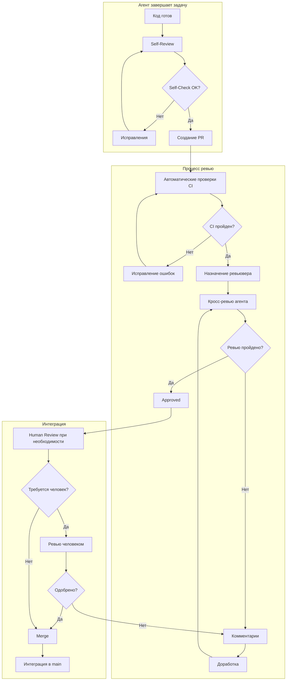
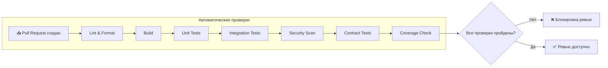
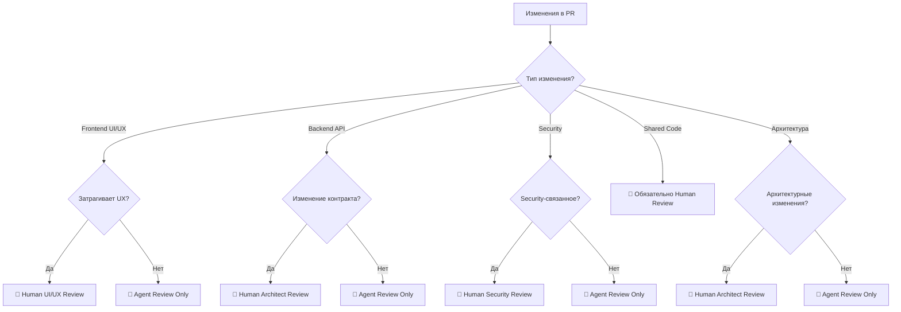
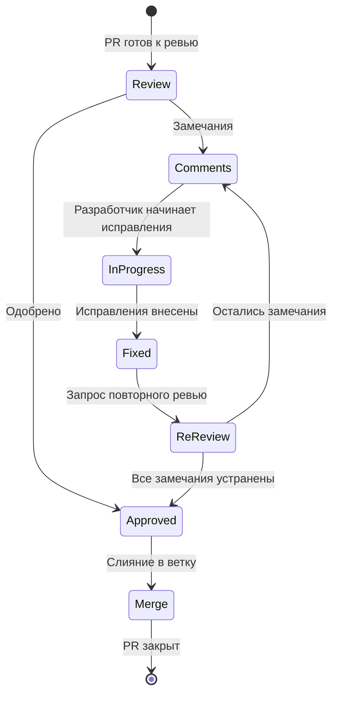
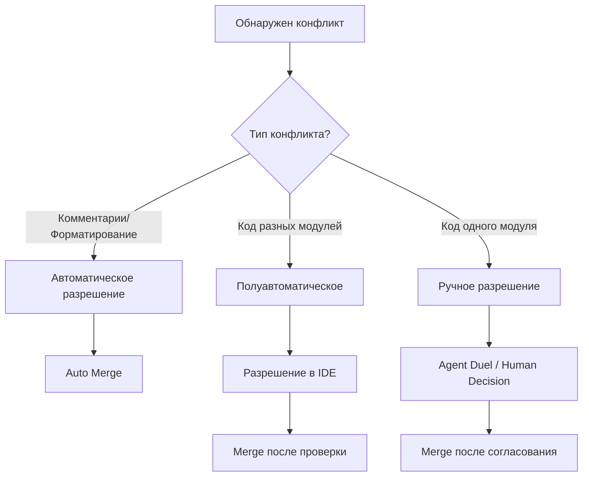
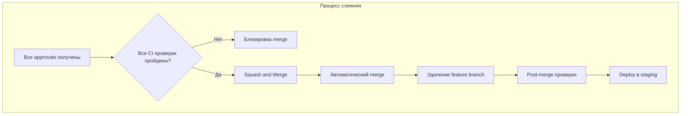

# Этап 9: Code Review и Интеграция

## 🔀 ИНТЕГРАЦИЯ И РЕВЬЮ

**Версия документа:** 1.0  
**Длительность этапа:** Постоянно (в процессе разработки)  
**Ответственный:** TIER-1 Архитектор, TIER-2 Разработчики, Human Reviewer

---

## Цель этапа

Организовать систематический процесс код-ревью между ИИ-агентами и человеком-ревьювером, обеспечить бесконфликтную интеграцию кода через автоматизированные проверки и стратегию слияния.

---

## Входные данные

| Данные | Источник |
|--------|----------|
| Исходный код модулей | [05-parallel-development.md](./05-parallel-development.md) |
| Результаты Anti-Neuroslop проверок | [06-quality-checks.md](./06-quality-checks.md) |
| Результаты тестирования | [08-testing.md](./08-testing.md) |
| API контракты | [02-contracts-and-architecture.md](./02-contracts-and-architecture.md) |

---

## Подробное описание действий

### 9.1 Кросс-ревью между агентами

#### Организация Pull Request процесса



#### Назначение ревьюверов

| Тип изменения | Ревьювер | Дополнительно |
|---------------|----------|---------------|
| Frontend компоненты | Agent A (Frontend) | Human UI/UX при существенных изменениях |
| Backend API | Agent B/C (Backend) | TIER-1 Архитектор при изменении контрактов |
| Общие модули | Два агента разных команд | Обязательное Human Review |
| Инфраструктура | Agent E (DevOps) | TIER-1 Архитектор |
| Security-связанное | TIER-1 + Security Agent | Обязательно Human Review |

#### Критерии проверки при кросс-ревью

| Категория | Критерии | Инструмент проверки |
|-----------|----------|---------------------|
| **Стиль кода** | Соответствие coding conventions | ESLint, StyleCop, dotnet format |
| **Логика** | Корректность алгоритмов, обработка краевых случаев | Code Review, Unit тесты |
| **Тесты** | Покрытие ≥70%, наличие тестов для нового кода | Jest, xUnit, Coverage reports |
| **Архитектура** | Следование паттернам, правильность зависимостей | ArchUnit, NetArchTest |
| **Контракты** | Соответствие OpenAPI спецификации | Spectral, Pact tests |

#### Конфигурация CODEOWNERS

```yaml
# .github/CODEOWNERS для автоматического назначения ревьюверов

# Frontend
/src/frontend/    @agent-a @human-frontend-lead

# Backend
/src/backend/GoldPC.Catalog/   @agent-b @human-backend-lead
/src/backend/GoldPC.Orders/    @agent-c @human-backend-lead
/src/backend/GoldPC.Services/  @agent-c @human-backend-lead
/src/backend/GoldPC.Auth/      @architect @human-security-lead

# Shared
/src/shared/      @architect @human-tech-lead

# Infrastructure
/infrastructure/  @agent-e @devops-lead
/docker/          @agent-e @devops-lead

# API Contracts
docs/api/         @architect @human-tech-lead
```

---

### 9.2 Автоматизированные проверки перед ревью

#### CI Pipeline перед Code Review



#### GitHub Actions Workflow

```yaml
# .github/workflows/pre-review.yml
name: Pre-Review Checks

on:
  pull_request:
    branches: [main, develop]
    types: [opened, synchronize, reopened]

jobs:
  # 1. Линтеры
  lint:
    runs-on: ubuntu-latest
    steps:
      - uses: actions/checkout@v4
      
      - name: Setup .NET
        uses: actions/setup-dotnet@v4
        with:
          dotnet-version: '8.0.x'
      
      - name: Backend Lint
        run: |
          dotnet restore
          dotnet format --verify-no-changes --severity warn
      
      - name: Setup Node.js
        uses: actions/setup-node@v4
        with:
          node-version: '20.x'
      
      - name: Frontend Lint
        run: |
          cd src/frontend
          npm ci
          npm run lint

  # 2. Сборка
  build:
    runs-on: ubuntu-latest
    needs: lint
    steps:
      - uses: actions/checkout@v4
      
      - name: Build Backend
        run: dotnet build --configuration Release --no-restore
      
      - name: Build Frontend
        run: |
          cd src/frontend
          npm run build

  # 3. Unit тесты
  unit-tests:
    runs-on: ubuntu-latest
    needs: build
    steps:
      - uses: actions/checkout@v4
      
      - name: Run Unit Tests
        run: dotnet test --filter "FullyQualifiedName!~Integration" --collect:"XPlat Code Coverage"
      
      - name: Check Coverage
        run: |
          coverage=$(find . -name "coverage.cobertura.xml" -exec cat {} \; | grep -oP 'line-rate="\K[0-9.]+' | head -1)
          echo "Coverage: $coverage"
          if (( $(echo "$coverage < 0.70" | bc) )); then
            echo "::error::Coverage is below 70%"
            exit 1
          fi

  # 4. Security Scan
  security-scan:
    runs-on: ubuntu-latest
    needs: build
    steps:
      - uses: actions/checkout@v4
      
      - name: SAST - Semgrep
        uses: returntocorp/semgrep-action@v1
        with:
          config: >-
            p/security-audit
            p/secrets
            p/owasp-top-ten
      
      - name: Dependency Scan
        uses: snyk/actions/dotnet@master
        env:
          SNYK_TOKEN: ${{ secrets.SNYK_TOKEN }}
        with:
          args: --severity-threshold=high
      
      - name: Secret Detection
        run: |
          if grep -r -E "(password|secret|api_key|token)\s*=\s*['\"]" --include="*.cs" --include="*.ts" src/ 2>/dev/null; then
            echo "::error::Found potential hardcoded secrets!"
            exit 1
          fi

  # 5. Контрактные тесты
  contract-tests:
    runs-on: ubuntu-latest
    needs: build
    steps:
      - uses: actions/checkout@v4
      
      - name: Validate OpenAPI
        run: |
          npm install -g @stoplight/spectral-cli
          spectral lint docs/api/openapi/*.yaml
      
      - name: Run Pact Tests
        run: dotnet test --filter "FullyQualifiedName~Contract"

  # 6. Архитектурные тесты
  architecture-tests:
    runs-on: ubuntu-latest
    needs: build
    steps:
      - uses: actions/checkout@v4
      
      - name: Run Architecture Tests
        run: dotnet test --filter "FullyQualifiedName~ArchitectureTests"

  # Gates: Блокировка ревью при провале
  review-gate:
    runs-on: ubuntu-latest
    needs: [lint, build, unit-tests, security-scan, contract-tests, architecture-tests]
    if: success()
    steps:
      - name: Enable Review
        run: echo "✅ All pre-review checks passed. Ready for code review."
```

#### Статусы проверок в PR

| Проверка | Статус | Действие при провале |
|----------|--------|---------------------|
| Lint & Format | ✅/❌ | Блокировка merge |
| Build | ✅/❌ | Блокировка merge |
| Unit Tests | ✅/❌ | Блокировка merge |
| Coverage ≥70% | ✅/❌ | Блокировка merge |
| Security Scan | ✅/⚠️/❌ | Блокировка при HIGH/CRITICAL |
| Contract Tests | ✅/❌ | Блокировка merge |
| Architecture Tests | ✅/❌ | Блокировка merge |

---

### 9.3 Human Review

#### Когда привлекается человек-ревьювер



#### Критерии для обязательного Human Review

| Критерий | Описание | Примеры |
|----------|----------|---------|
| **Архитектурные изменения** | Изменение структуры модулей, добавление новых зависимостей | Новый микросервис, изменение layer boundaries |
| **Изменение API контрактов** | Добавление/изменение/удаление эндпоинтов | Новый API endpoint, breaking changes |
| **Security-sensitive код** | Аутентификация, авторизация, работа с секретами | Auth flow, encryption, API keys |
| **Сложные алгоритмы** | Бизнес-логика с высокой сложностью | Алгоритм совместимости ПК, расчёт гарантии |
| **Спорные решения** | Когда агенты не пришли к консенсусу | Agent Duel без явного победителя |
| **Third-party интеграции** | Интеграция с внешними сервисами | Платёжный шлюз, SMS-провайдер |

#### Конфигурация обязательного Human Review

```yaml
# .github/human-review-config.yaml
human_review:
  triggers:
    - path_pattern: "src/**/Auth*"
      reason: "Security-sensitive code"
      required_reviewers: 1
      
    - path_pattern: "docs/api/**/*.yaml"
      reason: "API contract changes"
      required_reviewers: 1
      
    - path_pattern: "src/shared/**"
      reason: "Shared module changes"
      required_reviewers: 2
      
    - labels: ["breaking-change", "security", "architecture"]
      reason: "Critical change"
      required_reviewers: 2
      
  escalation:
    - condition: "agent_duel_no_winner"
      action: "escalate_to_tech_lead"
      
    - condition: "security_vulnerability_found"
      action: "escalate_to_security_team"
```

#### Чек-лист для Human Reviewer

```markdown
## Human Review Checklist

### Архитектура и дизайн
- [ ] Изменения соответствуют общей архитектуре системы
- [ ] Нет нарушения принципов SOLID
- [ ] Зависимости направлены правильно (Clean Architecture)
- [ ] Паттерны использованы уместно

### Безопасность
- [ ] Нет уязвимостей OWASP Top 10
- [ ] Данные пользователя валидируются
- [ ] Авторизация реализована корректно
- [ ] Чувствительные данные защищены

### Бизнес-логика
- [ ] Алгоритмы реализованы корректно
- [ ] Краевые случаи обработаны
- [ ] Ошибки обрабатываются gracefully

### UX/UI (для Frontend)
- [ ] Интерфейс интуитивно понятен
- [ ] Дизайн соответствует guidelines
- [ ] Accessibility соблюдён (WCAG 2.1)

### Поддерживаемость
- [ ] Код понятен без комментариев
- [ ] Документация достаточна
- [ ] Тесты покрывают критические сценарии
```

---

### 9.4 Обработка замечаний

#### Цикл доработки



#### Типы замечаний и приоритеты

| Тип | Метка | Приоритет | Срок исправления | Блокирует merge |
|-----|-------|-----------|------------------|-----------------|
| 🔴 Critical | `blocker` | P0 | Немедленно | Да |
| 🟠 Major | `major` | P1 | 1 день | Да |
| 🟡 Minor | `minor` | P2 | 3 дня | Нет |
| 🔵 Suggestion | `suggestion` | P3 | По возможности | Нет |
| 💬 Discussion | `discussion` | - | - | Нет |

#### Шаблоны комментариев ревью

```markdown
<!-- Критическая проблема -->
🔴 **BLOCKER**: [Описание проблемы]

**Файл**: `path/to/file.cs:42`

**Проблема**: 
[Детальное описание]

**Решение**:
```csharp
// Пример правильного кода
```

---

<!-- Важное замечание -->
🟠 **MAJOR**: [Описание проблемы]

**Почему это важно**:
[Обоснование]

**Предложение**:
[Как исправить]

---

<!-- Предложение -->
🔵 **SUGGESTION**: [Описание идеи]

Это не блокирует merge, но стоит рассмотреть для улучшения кода.

<!-- Вопрос для обсуждения -->
💬 **DISCUSSION**: [Тема для обсуждения]

[Вопрос или тема]
```

#### Повторное ревью

| Условие | Действие |
|---------|----------|
| Все `blocker` и `major` замечания устранены | Автоматический запрос повторного ревью |
| Только `minor` и `suggestion` | Merge без повторного ревью (опционально) |
| Новые изменения после одобрения | Автоматический запрос повторного ревью |
| Более 5 циклов доработки | Эскалация координатору |

---

### 9.5 Разрешение конфликтов слияния

#### Стратегии слияния



#### Сравнение стратегий слияния

| Стратегия | Когда использовать | Плюсы | Минусы |
|-----------|-------------------|-------|--------|
| **Rebase** | Feature branch → develop | Чистая история, линейный граф | Переписывает историю, сложнее при множестве коммитов |
| **Merge commit** | develop → main | Сохраняет историю, явная точка слияния | "Мёртвые" ветки в истории |
| **Squash** | Мелкие feature branches | Один чистый коммит | Потеря детальной истории |

#### Настройка Git Branch Protection

```yaml
# .github/settings.yml (probot-settings)
branches:
  - name: main
    protection:
      required_pull_request_reviews:
        dismiss_stale_reviews: true
        require_code_owner_reviews: true
        required_approving_review_count: 2
      required_status_checks:
        strict: true
        contexts:
          - "lint"
          - "build"
          - "unit-tests"
          - "security-scan"
          - "contract-tests"
      enforce_admins: true
      restrictions:
        users: []
        teams: ["maintainers"]
        
  - name: develop
    protection:
      required_pull_request_reviews:
        dismiss_stale_reviews: true
        require_code_owner_reviews: true
        required_approving_review_count: 1
      required_status_checks:
        strict: true
        contexts:
          - "lint"
          - "build"
          - "unit-tests"
      enforce_admins: false
```

#### Инструменты разрешения конфликтов

| Инструмент | Назначение | Когда использовать |
|------------|------------|-------------------|
| **Git CLI** | Базовые операции | Простые конфликты |
| **VS Code** | Визуальное разрешение | Сложные конфликты в коде |
| **GitHub Web UI** | Простые конфликты | Когда под рукой нет IDE |
| **IntelliJ IDEA / Rider** | Продвинутое разрешение | Java/C# проекты |

#### Процедура разрешения конфликта

```bash
# 1. Получить последние изменения
git checkout develop
git pull origin develop

# 2. Переключиться на feature branch
git checkout feature/my-feature

# 3. Rebase на develop
git rebase develop

# 4. При конфликте - разрешить
# Git покажет конфликтующие файлы
git status

# 5. Отредактировать конфликтующие файлы
# После разрешения:
git add <resolved-files>
git rebase --continue

# 6. Force push (т.к. история переписана)
git push origin feature/my-feature --force-with-lease
```

---

### 9.6 Интеграция в main

#### Автоматический merge после успешного ревью



#### Merge Queue

```yaml
# GitHub Merge Queue configuration
merge_queue:
  max_concurrent_merges: 3
  check_timeout: 30m
  
  merge_method:
    develop: "squash"
    main: "merge"
    
  auto_delete_branch: true
  
  required_checks:
    - lint
    - build
    - unit-tests
    - security-scan
```

#### GitHub Actions для автоматического merge

```yaml
# .github/workflows/auto-merge.yml
name: Auto Merge

on:
  pull_request_review:
    types: [submitted]
  check_suite:
    types: [completed]

jobs:
  auto-merge:
    runs-on: ubuntu-latest
    if: github.event.review.state == 'approved'
    steps:
      - name: Check PR status
        uses: actions/github-script@v7
        with:
          script: |
            const pr = await github.rest.pulls.get({
              owner: context.repo.owner,
              repo: context.repo.repo,
              pull_number: context.issue.number
            });
            
            // Проверка approvals
            const reviews = await github.rest.pulls.listReviews({
              owner: context.repo.owner,
              repo: context.repo.repo,
              pull_number: context.issue.number
            });
            
            const approvals = reviews.data.filter(r => r.state === 'APPROVED');
            const requiredApprovals = pr.data.base.ref === 'main' ? 2 : 1;
            
            if (approvals.length >= requiredApprovals) {
              // Проверка статусов CI
              const statuses = await github.rest.repos.getCombinedStatusForRef({
                owner: context.repo.owner,
                repo: context.repo.repo,
                ref: pr.data.head.sha
              });
              
              if (statuses.data.state === 'success') {
                // Выполнить merge
                await github.rest.pulls.merge({
                  owner: context.repo.owner,
                  repo: context.repo.repo,
                  pull_number: context.issue.number,
                  merge_method: 'squash'
                });
              }
            }
```

---

## Выходные артефакты

| Артефакт | Формат | Расположение |
|----------|--------|--------------|
| PR Template | Markdown | `.github/pull_request_template.md` |
| CODEOWNERS | Config | `.github/CODEOWNERS` |
| Branch Protection Rules | YAML | `.github/settings.yml` |
| CI Workflows | YAML | `.github/workflows/` |
| Review Checklists | Markdown | `docs/review-checklists/` |
| Lessons Learned | Markdown | `knowledge-base/lessons-learned/` |

---

## Критерии готовности (Definition of Done)

- [ ] Self-review выполнен по чек-листу
- [ ] PR создан с описанием по шаблону
- [ ] Все автоматические проверки CI пройдены
- [ ] Минимум 1 approval от агента-ревьювера получен
- [ ] Human review пройден (если требуется)
- [ ] Все blocker/major замечания устранены
- [ ] Конфликты слияния разрешены
- [ ] Knowledge base обновлена (если есть уроки)
- [ ] Merge в целевую ветку выполнен

---

## Возможные риски и митигация

| Риск | Вероятность | Влияние | Меры митигации |
|------|-------------|---------|----------------|
| Долгое ревью | Средняя | Среднее | SLA на ревью 24ч, автонапоминания |
| Конфликты слияния | Высокая | Среднее | Частая синхронизация с develop |
| Пропуск багов при ревью | Средняя | Высокое | Автоматические проверки, чек-листы |
| Спорные решения | Низкая | Высокое | Agent Duel Protocol, Human escalation |
| Большой размер PR | Средняя | Среднее | Лимит на размер PR (500 строк) |

---

## Переход к следующему этапу

Для перехода к этапу [10-e2e-and-load-testing.md](./10-e2e-and-load-testing.md) необходимо:

1. ✅ Все модули интегрированы в develop
2. ✅ Все конфликтующие изменения разрешены
3. ✅ Integration тесты проходят
4. ✅ Deploy в staging успешен

---

## Связанные документы

- [README.md](./README.md) — Обзор плана
- [05-parallel-development.md](./05-parallel-development.md) — Параллельная разработка
- [06-quality-checks.md](./06-quality-checks.md) — Anti-Neuroslop проверки
- [08-testing.md](./08-testing.md) — Тестирование
- [10-e2e-and-load-testing.md](./10-e2e-and-load-testing.md) — E2E и нагрузочное тестирование

---

*Документ создан в рамках плана разработки GoldPC.*