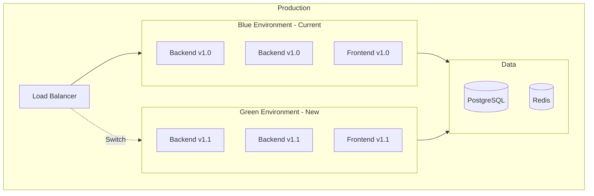

# Этап 11: Деплой

## 🚀 DEPLOYMENT: Blue-Green + Canary

**Версия документа:** 1.0  
**Длительность этапа:** 1-2 недели  
**Ответственный:** DevOps, TIER-1 Архитектор

---

## Цель этапа

Развернуть систему в production-окружении с использованием стратегий Blue-Green и Canary deployment для минимизации рисков.

---

## Входные данные

| Данные | Источник |
|--------|----------|
| Протестированная система | [10-e2e-and-load-testing.md](./10-e2e-and-load-testing.md) |
| Инфраструктура | [03-environment-setup.md](./03-environment-setup.md) |
| Dockerfile'ы | Этап 3 |

---

## Deployment Architecture



---

## 11.1 Инфраструктура

### Production Environment

```yaml
# infrastructure/production/docker-compose.yml
version: '3.8'

services:
  # Nginx Reverse Proxy
  nginx:
    image: nginx:alpine
    ports:
      - "80:80"
      - "443:443"
    volumes:
      - ./nginx/nginx.conf:/etc/nginx/nginx.conf:ro
      - ./nginx/ssl:/etc/nginx/ssl:ro
      - ./nginx/logs:/var/log/nginx
    depends_on:
      - backend-blue
      - backend-green
      - frontend
    networks:
      - goldpc-network
    deploy:
      resources:
        limits:
          cpus: '1'
          memory: 512M
    healthcheck:
      test: ["CMD", "nginx", "-t"]
      interval: 30s
      timeout: 10s
      retries: 3

  # Backend Blue (Current)
  backend-blue:
    image: ${REGISTRY}/goldpc-backend:${BLUE_VERSION:-latest}
    environment:
      - ASPNETCORE_ENVIRONMENT=Production
      - ConnectionStrings__DefaultConnection=${DB_CONNECTION_STRING}
      - Redis__Connection=redis:6379
      - Jwt__Key=${JWT_KEY}
      - Jwt__Issuer=${JWT_ISSUER}
      - Jwt__Audience=${JWT_AUDIENCE}
    networks:
      - goldpc-network
    deploy:
      replicas: 2
      resources:
        limits:
          cpus: '2'
          memory: 1G
    healthcheck:
      test: ["CMD", "curl", "-f", "http://localhost:8080/health"]
      interval: 30s
      timeout: 10s
      retries: 3

  # Backend Green (New Version)
  backend-green:
    image: ${REGISTRY}/goldpc-backend:${GREEN_VERSION}
    environment:
      - ASPNETCORE_ENVIRONMENT=Production
      - ConnectionStrings__DefaultConnection=${DB_CONNECTION_STRING}
      - Redis__Connection=redis:6379
      - Jwt__Key=${JWT_KEY}
      - Jwt__Issuer=${JWT_ISSUER}
      - Jwt__Audience=${JWT_AUDIENCE}
    networks:
      - goldpc-network
    deploy:
      replicas: 0  # Запускается при деплое
      resources:
        limits:
          cpus: '2'
          memory: 1G
    healthcheck:
      test: ["CMD", "curl", "-f", "http://localhost:8080/health"]
      interval: 30s
      timeout: 10s
      retries: 3

  # Frontend
  frontend:
    image: ${REGISTRY}/goldpc-frontend:${FRONTEND_VERSION:-latest}
    networks:
      - goldpc-network
    deploy:
      resources:
        limits:
          cpus: '0.5'
          memory: 256M

  # PostgreSQL
  postgres:
    image: postgres:16-alpine
    environment:
      POSTGRES_USER: ${DB_USER}
      POSTGRES_PASSWORD: ${DB_PASSWORD}
      POSTGRES_DB: goldpc
    volumes:
      - postgres_data:/var/lib/postgresql/data
      - ./postgres/postgresql.conf:/etc/postgresql/postgresql.conf:ro
    networks:
      - goldpc-network
    deploy:
      resources:
        limits:
          cpus: '4'
          memory: 8G
    healthcheck:
      test: ["CMD-SHELL", "pg_isready -U ${DB_USER}"]
      interval: 30s
      timeout: 10s
      retries: 5

  # Redis
  redis:
    image: redis:7-alpine
    command: redis-server --appendonly yes --maxmemory 2gb --maxmemory-policy allkeys-lru
    volumes:
      - redis_data:/data
    networks:
      - goldpc-network
    deploy:
      resources:
        limits:
          cpus: '1'
          memory: 2G
    healthcheck:
      test: ["CMD", "redis-cli", "ping"]
      interval: 30s
      timeout: 10s
      retries: 5

networks:
  goldpc-network:
    driver: bridge

volumes:
  postgres_data:
  redis_data:
```

### Nginx Configuration

```nginx
# infrastructure/production/nginx/nginx.conf
upstream backend_blue {
    server backend-blue:8080;
}

upstream backend_green {
    server backend-green:8080;
}

upstream frontend {
    server frontend:3000;
}

# Map for canary routing
map $cookie_canary $backend_upstream {
    default backend_blue;
    "green" backend_green;
}

server {
    listen 80;
    server_name goldpc.by www.goldpc.by;
    return 301 https://$server_name$request_uri;
}

server {
    listen 443 ssl http2;
    server_name goldpc.by www.goldpc.by;

    ssl_certificate /etc/nginx/ssl/goldpc.by.crt;
    ssl_certificate_key /etc/nginx/ssl/goldpc.by.key;
    ssl_protocols TLSv1.2 TLSv1.3;
    ssl_ciphers ECDHE-ECDSA-AES128-GCM-SHA256:ECDHE-RSA-AES128-GCM-SHA256;
    ssl_prefer_server_ciphers off;

    # Security headers
    add_header X-Frame-Options "DENY" always;
    add_header X-Content-Type-Options "nosniff" always;
    add_header X-XSS-Protection "1; mode=block" always;
    add_header Strict-Transport-Security "max-age=31536000; includeSubDomains" always;

    # Rate limiting
    limit_req_zone $binary_remote_addr zone=api:10m rate=10r/s;
    limit_req_zone $binary_remote_addr zone=auth:10m rate=5r/m;

    # API endpoints
    location /api/v1/ {
        limit_req zone=api burst=20 nodelay;
        
        proxy_pass http://$backend_upstream;
        proxy_http_version 1.1;
        proxy_set_header Host $host;
        proxy_set_header X-Real-IP $remote_addr;
        proxy_set_header X-Forwarded-For $proxy_add_x_forwarded_for;
        proxy_set_header X-Forwarded-Proto $scheme;
        
        proxy_connect_timeout 60s;
        proxy_send_timeout 60s;
        proxy_read_timeout 60s;
    }

    # Auth rate limiting
    location /api/v1/auth/ {
        limit_req zone=auth burst=5 nodelay;
        
        proxy_pass http://$backend_upstream;
        proxy_http_version 1.1;
        proxy_set_header Host $host;
        proxy_set_header X-Real-IP $remote_addr;
        proxy_set_header X-Forwarded-For $proxy_add_x_forwarded_for;
        proxy_set_header X-Forwarded-Proto $scheme;
    }

    # Frontend
    location / {
        proxy_pass http://frontend;
        proxy_http_version 1.1;
        proxy_set_header Upgrade $http_upgrade;
        proxy_set_header Connection "upgrade";
        proxy_set_header Host $host;
        proxy_set_header X-Real-IP $remote_addr;
        proxy_set_header X-Forwarded-For $proxy_add_x_forwarded_for;
        proxy_set_header X-Forwarded-Proto $scheme;
    }

    # Static files caching
    location ~* \.(js|css|png|jpg|jpeg|gif|ico|svg|woff|woff2)$ {
        proxy_pass http://frontend;
        expires 30d;
        add_header Cache-Control "public, immutable";
    }

    # Health check
    location /health {
        access_log off;
        return 200 "OK";
        add_header Content-Type text/plain;
    }
}
```

---

## 11.2 Dockerfile'ы

### Backend Dockerfile

```dockerfile
# src/backend/Dockerfile
# Build stage
FROM mcr.microsoft.com/dotnet/sdk:8.0 AS build
WORKDIR /src

# Copy csproj files
COPY ["GoldPC.Api/GoldPC.Api.csproj", "GoldPC.Api/"]
COPY ["GoldPC.Core/GoldPC.Core.csproj", "GoldPC.Core/"]
COPY ["GoldPC.Infrastructure/GoldPC.Infrastructure.csproj", "GoldPC.Infrastructure/"]

# Restore dependencies
RUN dotnet restore "GoldPC.Api/GoldPC.Api.csproj"

# Copy source code
COPY . .

# Build
WORKDIR "/src/GoldPC.Api"
RUN dotnet build "GoldPC.Api.csproj" -c Release -o /app/build

# Publish stage
FROM build AS publish
RUN dotnet publish "GoldPC.Api.csproj" -c Release -o /app/publish /p:UseAppHost=false

# Runtime stage
FROM mcr.microsoft.com/dotnet/aspnet:8.0 AS final
WORKDIR /app

# Security: non-root user
RUN adduser --disabled-password --gecos '' appuser

# Install curl for health checks
RUN apt-get update && apt-get install -y curl && rm -rf /var/lib/apt/lists/*

COPY --from=publish /app/publish .

# Set environment
ENV ASPNETCORE_URLS=http://+:8080
ENV ASPNETCORE_ENVIRONMENT=Production

EXPOSE 8080

USER appuser
ENTRYPOINT ["dotnet", "GoldPC.Api.dll"]
```

### Frontend Dockerfile

```dockerfile
# src/frontend/Dockerfile
# Build stage
FROM node:20-alpine AS build
WORKDIR /app

# Copy package files
COPY package*.json ./

# Install dependencies
RUN npm ci --only=production

# Copy source code
COPY . .

# Build
RUN npm run build

# Runtime stage with nginx
FROM nginx:alpine AS final

# Copy built files
COPY --from=build /app/dist /usr/share/nginx/html

# Copy nginx configuration
COPY nginx.conf /etc/nginx/conf.d/default.conf

# Security: non-root user
RUN chown -R nginx:nginx /usr/share/nginx/html && \
    chown -R nginx:nginx /var/cache/nginx && \
    chown -R nginx:nginx /var/log/nginx && \
    touch /var/run/nginx.pid && \
    chown -R nginx:nginx /var/run/nginx.pid

USER nginx

EXPOSE 3000

CMD ["nginx", "-g", "daemon off;"]
```

---

## 11.3 Deployment Strategies

### Blue-Green Deployment

```yaml
# .github/workflows/deploy-blue-green.yml
name: Blue-Green Deployment

on:
  push:
    branches: [main]
  workflow_dispatch:
    inputs:
      version:
        description: 'Version to deploy'
        required: true

env:
  REGISTRY: ghcr.io
  IMAGE_NAME: goldpc

jobs:
  build:
    runs-on: ubuntu-latest
    outputs:
      image_tag: ${{ steps.meta.outputs.tags }}
    
    steps:
      - uses: actions/checkout@v4
      
      - name: Set up Docker Buildx
        uses: docker/setup-buildx-action@v3
      
      - name: Login to Registry
        uses: docker/login-action@v3
        with:
          registry: ${{ env.REGISTRY }}
          username: ${{ github.actor }}
          password: ${{ secrets.GITHUB_TOKEN }}
      
      - name: Extract metadata
        id: meta
        uses: docker/metadata-action@v5
        with:
          images: ${{ env.REGISTRY }}/${{ env.IMAGE_NAME }}
          tags: |
            type=sha
            type=ref,event=branch
      
      - name: Build and push Backend
        uses: docker/build-push-action@v5
        with:
          context: ./src/backend
          push: true
          tags: ${{ steps.meta.outputs.tags }}
          cache-from: type=gha
          cache-to: type=gha,mode=max
      
      - name: Build and push Frontend
        uses: docker/build-push-action@v5
        with:
          context: ./src/frontend
          push: true
          tags: ${{ steps.meta.outputs.tags }}-frontend
          cache-from: type=gha
          cache-to: type=gha,mode=max

  deploy:
    needs: build
    runs-on: ubuntu-latest
    environment: production
    
    steps:
      - uses: actions/checkout@v4
      
      - name: Deploy to Production
        uses: appleboy/ssh-action@master
        with:
          host: ${{ secrets.DEPLOY_HOST }}
          username: ${{ secrets.DEPLOY_USER }}
          key: ${{ secrets.DEPLOY_KEY }}
          script: |
            cd /opt/goldpc
            
            # Determine current environment
            CURRENT=$(docker-compose ps --services --filter "status=running" | grep backend | head -1)
            
            if [ "$CURRENT" = "backend-blue" ]; then
              NEW="backend-green"
              OLD="backend-blue"
            else
              NEW="backend-blue"
              OLD="backend-green"
            fi
            
            echo "Deploying to $NEW environment..."
            
            # Pull new images
            docker-compose pull $NEW
            
            # Start new environment
            docker-compose up -d --scale $NEW=2 $NEW
            
            # Wait for health check
            sleep 30
            
            # Health check
            for i in {1..10}; do
              if curl -f http://localhost:8080/health; then
                echo "Health check passed"
                break
              fi
              echo "Waiting for health check... attempt $i"
              sleep 10
            done
            
            # Switch load balancer
            # Update nginx config to point to new backend
            sed -i "s/$OLD/$NEW/g" /etc/nginx/conf.d/default.conf
            nginx -s reload
            
            # Verify traffic
            sleep 30
            
            # Check error rate
            ERROR_RATE=$(curl -s http://localhost:9090/api/v1/metrics | grep error_rate | awk '{print $2}')
            if (( $(echo "$ERROR_RATE > 0.01" | bc -l) )); then
              echo "High error rate detected! Rolling back..."
              sed -i "s/$NEW/$OLD/g" /etc/nginx/conf.d/default.conf
              nginx -s reload
              exit 1
            fi
            
            # Stop old environment
            docker-compose stop $OLD
            docker-compose scale $OLD=0
            
            echo "Deployment successful!"
```

### Canary Deployment

```yaml
# .github/workflows/deploy-canary.yml
name: Canary Deployment

on:
  workflow_dispatch:
    inputs:
      canary_percentage:
        description: 'Percentage of traffic to canary'
        required: true
        default: '10'
        type: choice
        options:
          - '10'
          - '25'
          - '50'
          - '100'

jobs:
  canary-deploy:
    runs-on: ubuntu-latest
    environment: production
    
    steps:
      - uses: actions/checkout@v4
      
      - name: Configure Canary
        uses: appleboy/ssh-action@master
        with:
          host: ${{ secrets.DEPLOY_HOST }}
          username: ${{ secrets.DEPLOY_USER }}
          key: ${{ secrets.DEPLOY_KEY }}
          script: |
            cd /opt/goldpc
            
            CANARY_PCT=${{ inputs.canary_percentage }}
            
            # Update nginx for canary routing
            cat > /etc/nginx/conf.d/canary.conf << EOF
            split_clients "\${cookie_userid}" \$canary_backend {
              ${CANARY_PCT}%    backend_green;
              *                 backend_blue;
            }
            EOF
            
            nginx -s reload
            
            echo "Canary configured for ${CANARY_PCT}% of traffic"
      
      - name: Monitor Canary
        run: |
          # Wait and monitor metrics
          sleep 300
          
          # Check canary metrics
          # In production, this would query Prometheus/Grafana API
          echo "Monitoring canary metrics..."
```

---

## 11.4 Database Migrations

### Safe Migration Strategy

```bash
#!/bin/bash
# scripts/db/migrate.sh

set -e

# Получение текущей версии
CURRENT_VERSION=$(psql $DATABASE_URL -t -c "SELECT version FROM schema_migrations ORDER BY version DESC LIMIT 1")
echo "Current DB version: $CURRENT_VERSION"

# Проверка pending миграций
PENDING=$(dotnet ef migrations list --project src/backend/GoldPC.Infrastructure | grep -c "Pending")

if [ $PENDING -gt 0 ]; then
  echo "Found $PENDING pending migrations"
  
  # Backup перед миграцией
  echo "Creating backup..."
  pg_dump $DATABASE_URL > backup_$(date +%Y%m%d_%H%M%S).sql
  
  # Применение миграций
  echo "Applying migrations..."
  dotnet ef database update --project src/backend/GoldPC.Infrastructure
  
  echo "Migration completed successfully"
else
  echo "No pending migrations"
fi
```

### Zero-Downtime Migration

```csharp
// Пример безопасной миграции
// 1. Добавить колонку как nullable
// migrationBuilder.AddColumn<string>("NewColumn", "Orders", nullable: true);

// 2. Задеплоить код, который использует колонку
// Код должен обрабатывать null

// 3. Заполнить данные
// UPDATE Orders SET NewColumn = 'default' WHERE NewColumn IS NULL;

// 4. Сделать колонку NOT NULL в следующей миграции
// migrationBuilder.AlterColumn<string>("NewColumn", "Orders", nullable: false);
```

---

## 11.5 Rollback Strategy

```yaml
# .github/workflows/rollback.yml
name: Rollback

on:
  workflow_dispatch:
    inputs:
      version:
        description: 'Version to rollback to'
        required: true

jobs:
  rollback:
    runs-on: ubuntu-latest
    environment: production
    
    steps:
      - uses: actions/checkout@v4
      
      - name: Rollback to Previous Version
        uses: appleboy/ssh-action@master
        with:
          host: ${{ secrets.DEPLOY_HOST }}
          username: ${{ secrets.DEPLOY_USER }}
          key: ${{ secrets.DEPLOY_KEY }}
          script: |
            cd /opt/goldpc
            
            VERSION=${{ inputs.version }}
            
            echo "Rolling back to version $VERSION..."
            
            # Pull old version
            docker pull ghcr.io/goldpc/backend:$VERSION
            docker pull ghcr.io/goldpc/frontend:$VERSION
            
            # Stop current
            docker-compose down
            
            # Start old version
            export IMAGE_TAG=$VERSION
            docker-compose up -d
            
            # Health check
            sleep 30
            curl -f http://localhost:5000/health || exit 1
            
            echo "Rollback completed!"
            
      - name: Notify Team
        uses: 8398a7/action-slack@v3
        with:
          status: ${{ job.status }}
          text: |
            🚨 Rollback to version ${{ inputs.version }} completed
            Status: ${{ job.status }}
          webhook_url: ${{ secrets.SLACK_WEBHOOK }}
```

---

## 11.6 Secrets Management

```yaml
# Kubernetes Secrets (если используется K8s)
apiVersion: v1
kind: Secret
metadata:
  name: goldpc-secrets
  namespace: production
type: Opaque
stringData:
  JWT_KEY: "your-jwt-key-here"
  DB_PASSWORD: "your-db-password"
  REDIS_PASSWORD: "your-redis-password"
---
# Или использование HashiCorp Vault
# infrastructure/vault/secrets.yaml
path: secret/data/goldpc/production
data:
  jwt_key: "{{ vault_jwt_key }}"
  db_password: "{{ vault_db_password }}"
  smtp_password: "{{ vault_smtp_password }}"
  payment_api_key: "{{ vault_payment_api_key }}"
```

---

## Критерии готовности (Definition of Done)

- [ ] Docker образы собраны и протестированы
- [ ] Infrastructure как код готова
- [ ] Blue-Green deployment работает
- [ ] Database migrations протестированы
- [ ] Rollback стратегия проверена
- [ ] SSL сертификаты установлены
- [ ] Monitoring настроен
- [ ] Alerts работают
- [ ] Backup настроен

---

## Возможные риски и митигация

| Риск | Вероятность | Влияние | Меры митигации |
|------|-------------|---------|----------------|
| Failed deployment | Средняя | Высокое | Rollback strategy |
| Database migration failure | Низкая | Критическое | Backup, test environment |
| Downtime during deployment | Низкая | Среднее | Blue-Green strategy |
| Secrets leak | Низкая | Критическое | Vault, secrets rotation |

---

## Связанные документы

- [README.md](./README.md) — Обзор плана
- [03-environment-setup.md](./03-environment-setup.md) — Среда разработки
- [12-monitoring-and-feedback.md](./12-monitoring-and-feedback.md) — Мониторинг

---

*Документ создан в рамках плана разработки GoldPC.*