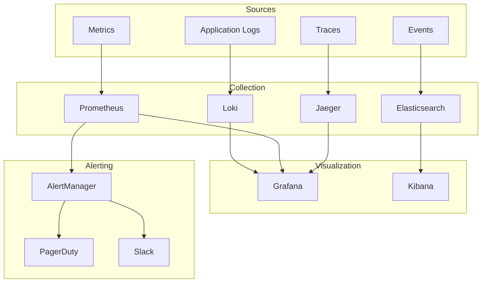
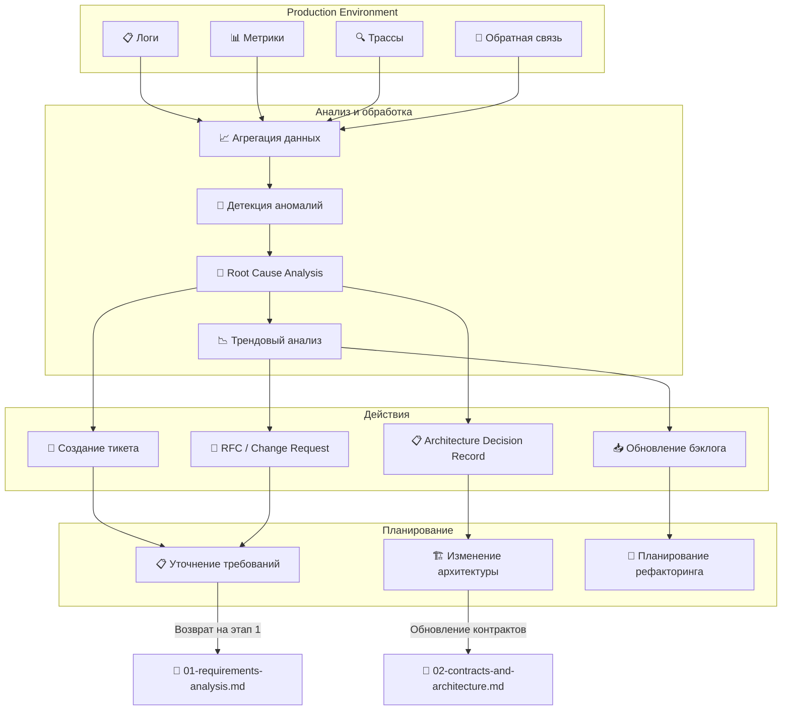
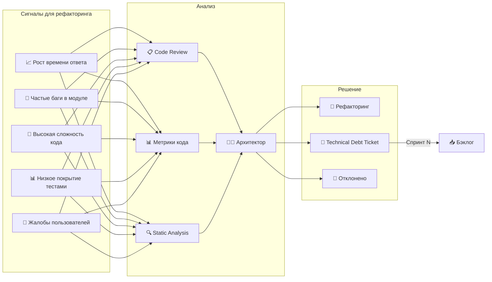
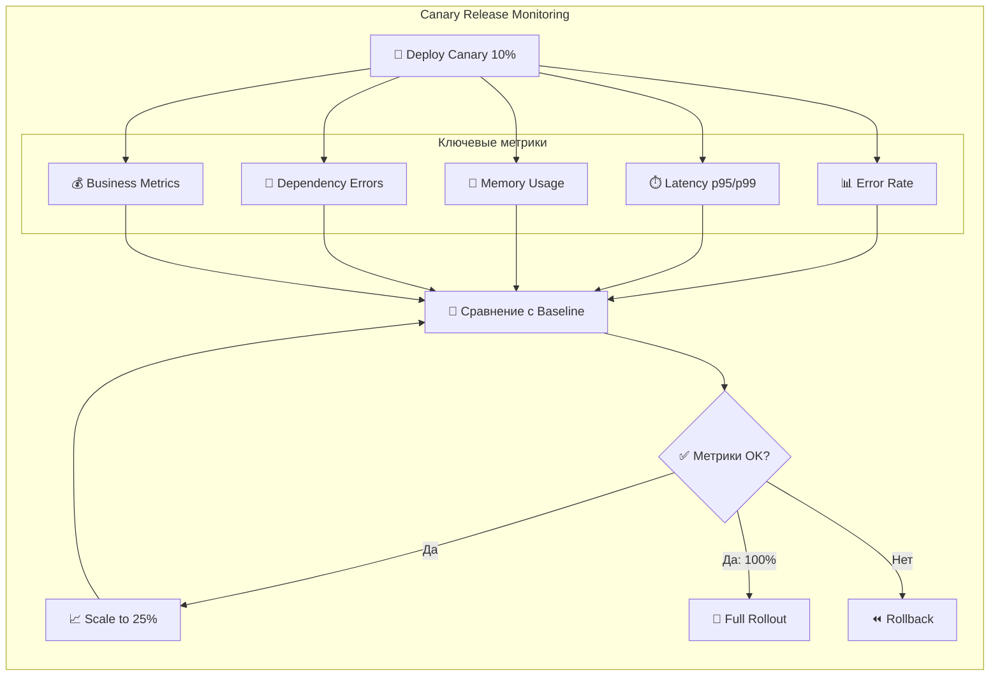
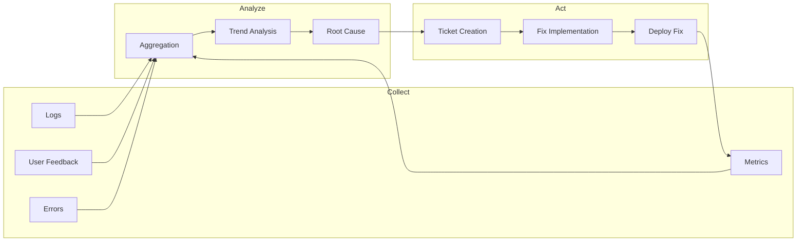

# Этап 12: Мониторинг и обратная связь

## 📊 FEEDBACK: Мониторинг + Обратная связь

**Версия документа:** 1.0  
**Длительность этапа:** Постоянно (после запуска)  
**Ответственный:** DevOps, Координатор

---

## Цель этапа

Настроить комплексный мониторинг системы, собирать метрики производительности, отслеживать ошибки и организовать процесс обратной связи для непрерывного улучшения.

---

## Входные данные

| Данные | Источник |
|--------|----------|
| Развёрнутая система | [11-deployment.md](./11-deployment.md) |
| Требования к SLA | ТЗ |
| Метрики производительности | [10-e2e-and-load-testing.md](./10-e2e-and-load-testing.md) |

---

## Monitoring Architecture



---

## 12.1 Logging

### Structured Logging

```csharp
// src/backend/GoldPC.Infrastructure/Logging/StructuredLogging.cs
public static class LoggingExtensions
{
    public static IHostBuilder ConfigureStructuredLogging(this IHostBuilder builder)
    {
        return builder.ConfigureLogging((context, logging) =>
        {
            logging.ClearProviders();
            
            if (context.HostingEnvironment.IsProduction())
            {
                logging.AddSerilog(new LoggerConfiguration()
                    .MinimumLevel.Information()
                    .MinimumLevel.Override("Microsoft", LogEventLevel.Warning)
                    .Enrich.FromLogContext()
                    .Enrich.WithProperty("Application", "GoldPC")
                    .Enrich.WithProperty("Environment", context.HostingEnvironment.EnvironmentName)
                    .Enrich.WithCorrelationId()
                    .WriteTo.Console(new JsonFormatter())
                    .WriteTo.Seq(context.Configuration["Seq:Url"])
                    .WriteTo.LokiHttp(context.Configuration["Loki:Url"])
                    .CreateLogger());
            }
            else
            {
                logging.AddConsole();
            }
        });
    }
}

// Использование в коде
public class OrderService : IOrderService
{
    private readonly ILogger<OrderService> _logger;

    public async Task<Order> CreateOrderAsync(CreateOrderRequest request)
    {
        using var scope = _logger.BeginScope(new Dictionary<string, object>
        {
            ["UserId"] = request.UserId,
            ["CorrelationId"] = Guid.NewGuid()
        });

        _logger.LogInformation(
            "Creating order for user {UserId} with {ItemCount} items",
            request.UserId, request.Items.Count);

        try
        {
            var order = await _repository.AddAsync(new Order { ... });
            
            _logger.LogInformation(
                "Order {OrderId} created successfully",
                order.Id);
            
            return order;
        }
        catch (Exception ex)
        {
            _logger.LogError(ex,
                "Failed to create order for user {UserId}",
                request.UserId);
            throw;
        }
    }
}
```

### Log Levels

| Level | Использование |
|-------|---------------|
| Trace | Детальная трассировка |
| Debug | Отладочная информация |
| Information | Важные бизнес-события |
| Warning | Потенциальные проблемы |
| Error | Ошибки, требующие внимания |
| Critical | Критические сбои |

---

## 12.2 Metrics

### Prometheus Configuration

```yaml
# infrastructure/monitoring/prometheus.yml
global:
  scrape_interval: 15s
  evaluation_interval: 15s
  external_labels:
    monitor: 'goldpc-production'

alerting:
  alertmanagers:
    - static_configs:
        - targets:
          - alertmanager:9093

rule_files:
  - /etc/prometheus/rules/*.yml

scrape_configs:
  # Backend API
  - job_name: 'goldpc-backend'
    static_configs:
      - targets: ['backend-blue:8080', 'backend-green:8080']
    metrics_path: /metrics

  # PostgreSQL
  - job_name: 'postgres'
    static_configs:
      - targets: ['postgres-exporter:9187']

  # Redis
  - job_name: 'redis'
    static_configs:
      - targets: ['redis-exporter:9121']

  # Nginx
  - job_name: 'nginx'
    static_configs:
      - targets: ['nginx-exporter:9113']

  # Node Exporter
  - job_name: 'node'
    static_configs:
      - targets: ['node-exporter:9100']
```

### Custom Metrics

```csharp
// src/backend/GoldPC.Infrastructure/Metrics/OrderMetrics.cs
public class OrderMetrics
{
    private readonly Counter _ordersCreated;
    private readonly Counter _ordersCompleted;
    private readonly Counter _ordersCancelled;
    private readonly Histogram _orderValue;
    private readonly Gauge _ordersInProgress;

    public OrderMetrics(IMeterFactory meterFactory)
    {
        var meter = meterFactory.Create("GoldPC.Orders");

        _ordersCreated = meter.CreateCounter<long>(
            "orders_created_total",
            "Total number of orders created");

        _ordersCompleted = meter.CreateCounter<long>(
            "orders_completed_total",
            "Total number of orders completed");

        _ordersCancelled = meter.CreateCounter<long>(
            "orders_cancelled_total",
            "Total number of orders cancelled");

        _orderValue = meter.CreateHistogram<double>(
            "order_value_rubles",
            "Order value in rubles",
            "rubles");

        _ordersInProgress = meter.CreateGauge<long>(
            "orders_in_progress",
            "Number of orders currently in progress");
    }

    public void OrderCreated(decimal value)
    {
        _ordersCreated.Add(1);
        _orderValue.Record((double)value);
        _ordersInProgress.Increment();
    }

    public void OrderCompleted()
    {
        _ordersCompleted.Add(1);
        _ordersInProgress.Decrement();
    }

    public void OrderCancelled()
    {
        _ordersCancelled.Add(1);
        _ordersInProgress.Decrement();
    }
}

// Регистрация
builder.Services.AddSingleton<OrderMetrics>();
builder.Services.AddOpenTelemetry()
    .WithMetrics(builder => builder
        .AddAspNetCoreInstrumentation()
        .AddPrometheusExporter());
```

### Key Metrics Dashboard

```yaml
# infrastructure/monitoring/grafana/dashboards/goldpc.yml
apiVersion: 1
providers:
  - name: 'GoldPC'
    folder: 'GoldPC'
    type: file
    options:
      path: /etc/grafana/provisioning/dashboards
```

```json
{
  "dashboard": {
    "title": "GoldPC Overview",
    "panels": [
      {
        "title": "Request Rate",
        "type": "graph",
        "targets": [
          {
            "expr": "rate(http_requests_total[5m])",
            "legendFormat": "{{method}} {{path}}"
          }
        ]
      },
      {
        "title": "Error Rate",
        "type": "graph",
        "targets": [
          {
            "expr": "rate(http_requests_total{status=~\"5..\"}[5m])",
            "legendFormat": "{{status}}"
          }
        ],
        "alert": {
          "conditions": [
            {
              "evaluator": {
                "params": [0.01],
                "type": "gt"
              }
            }
          ]
        }
      },
      {
        "title": "Response Time (p95)",
        "type": "graph",
        "targets": [
          {
            "expr": "histogram_quantile(0.95, rate(http_request_duration_seconds_bucket[5m]))",
            "legendFormat": "p95"
          }
        ]
      },
      {
        "title": "Orders Created",
        "type": "stat",
        "targets": [
          {
            "expr": "rate(orders_created_total[1h])",
            "legendFormat": "orders/hour"
          }
        ]
      },
      {
        "title": "Database Connections",
        "type": "graph",
        "targets": [
          {
            "expr": "pg_stat_database_numbackends",
            "legendFormat": "{{datname}}"
          }
        ]
      },
      {
        "title": "Cache Hit Rate",
        "type": "gauge",
        "targets": [
          {
            "expr": "rate(redis_keyspace_hits_total[5m]) / (rate(redis_keyspace_hits_total[5m]) + rate(redis_keyspace_misses_total[5m]))",
            "legendFormat": "hit rate"
          }
        ]
      }
    ]
  }
}
```

---

## 12.3 Alerting

### Alert Rules

```yaml
# infrastructure/monitoring/prometheus/rules/alerts.yml
groups:
  - name: goldpc-critical
    rules:
      - alert: HighErrorRate
        expr: |
          rate(http_requests_total{status=~"5.."}[5m]) / rate(http_requests_total[5m]) > 0.01
        for: 5m
        labels:
          severity: critical
        annotations:
          summary: "High error rate detected"
          description: "Error rate is {{ $value | humanizePercentage }} for the last 5 minutes"

      - alert: HighLatency
        expr: |
          histogram_quantile(0.95, rate(http_request_duration_seconds_bucket[5m])) > 1
        for: 5m
        labels:
          severity: warning
        annotations:
          summary: "High latency detected"
          description: "p95 latency is {{ $value | humanizeDuration }}"

      - alert: ServiceDown
        expr: up == 0
        for: 1m
        labels:
          severity: critical
        annotations:
          summary: "Service {{ $labels.job }} is down"
          description: "{{ $labels.instance }} has been down for more than 1 minute"

      - alert: DatabaseConnectionsExhausted
        expr: pg_stat_database_numbackends / pg_settings_max_connections > 0.8
        for: 5m
        labels:
          severity: warning
        annotations:
          summary: "Database connections near limit"
          description: "{{ $value | humanizePercentage }} of connections used"

      - alert: DiskSpaceLow
        expr: |
          (node_filesystem_avail_bytes / node_filesystem_size_bytes) < 0.1
        for: 5m
        labels:
          severity: critical
        annotations:
          summary: "Disk space low"
          description: "Only {{ $value | humanizePercentage }} disk space remaining"

      - alert: MemoryUsageHigh
        expr: |
          (node_memory_MemTotal_bytes - node_memory_MemAvailable_bytes) / node_memory_MemTotal_bytes > 0.9
        for: 5m
        labels:
          severity: warning
        annotations:
          summary: "High memory usage"
          description: "Memory usage is {{ $value | humanizePercentage }}"

  - name: goldpc-business
    rules:
      - alert: NoOrdersCreated
        expr: |
          rate(orders_created_total[1h]) == 0
        for: 30m
        labels:
          severity: warning
        annotations:
          summary: "No orders in the last 30 minutes"
          description: "This might indicate a problem with the checkout process"

      - alert: HighCancellationRate
        expr: |
          rate(orders_cancelled_total[1h]) / rate(orders_created_total[1h]) > 0.1
        for: 1h
        labels:
          severity: warning
        annotations:
          summary: "High order cancellation rate"
          description: "{{ $value | humanizePercentage }} of orders are being cancelled"
```

### AlertManager Configuration

```yaml
# infrastructure/monitoring/alertmanager/alertmanager.yml
global:
  resolve_timeout: 5m
  slack_api_url: 'https://hooks.slack.com/services/xxx'

route:
  group_by: ['alertname', 'severity']
  group_wait: 30s
  group_interval: 5m
  repeat_interval: 4h
  receiver: 'default'
  routes:
    - match:
        severity: critical
      receiver: 'critical'
    - match:
        severity: warning
      receiver: 'warnings'

receivers:
  - name: 'default'
    slack_configs:
      - channel: '#goldpc-alerts'
        send_resolved: true
        title: '{{ .Status | toUpper }}: {{ .CommonAnnotations.summary }}'
        text: '{{ .CommonAnnotations.description }}'

  - name: 'critical'
    slack_configs:
      - channel: '#goldpc-critical'
        send_resolved: true
        title: '🚨 CRITICAL: {{ .CommonAnnotations.summary }}'
        text: '{{ .CommonAnnotations.description }}'
    pagerduty_configs:
      - service_key: '<pagerduty-key>'
        severity: critical

  - name: 'warnings'
    slack_configs:
      - channel: '#goldpc-warnings'
        send_resolved: true
        title: '⚠️ WARNING: {{ .CommonAnnotations.summary }}'

inhibit_rules:
  - source_match:
      severity: 'critical'
    target_match:
      severity: 'warning'
    equal: ['alertname', 'instance']
```

---

## 12.4 Distributed Tracing

### OpenTelemetry Setup

```csharp
// src/backend/GoldPC.Api/TracingExtensions.cs
public static class TracingExtensions
{
    public static IServiceCollection AddDistributedTracing(this IServiceCollection services, IConfiguration configuration)
    {
        services.AddOpenTelemetry()
            .WithTracing(builder =>
            {
                builder
                    .AddAspNetCoreInstrumentation(options =>
                    {
                        options.RecordException = true;
                        options.EnrichWithHttpRequest = (activity, request) =>
                        {
                            activity.SetTag("http.request.body.size", request.ContentLength);
                        };
                    })
                    .AddHttpClientInstrumentation()
                    .AddEntityFrameworkCoreInstrumentation(options =>
                    {
                        options.SetDbStatementForText = true;
                    })
                    .AddRedisInstrumentation()
                    .AddJaegerExporter(options =>
                    {
                        options.AgentHost = configuration["Jaeger:Host"];
                        options.AgentPort = configuration.GetValue<int>("Jaeger:Port");
                    });
            });

        return services;
    }
}

// Program.cs
builder.Services.AddDistributedTracing(builder.Configuration);
```

### Correlation ID

```csharp
// src/backend/GoldPC.Infrastructure/Middleware/CorrelationIdMiddleware.cs
public class CorrelationIdMiddleware
{
    private const string CorrelationIdHeader = "X-Correlation-ID";
    private readonly RequestDelegate _next;

    public CorrelationIdMiddleware(RequestDelegate next)
    {
        _next = next;
    }

    public async Task Invoke(HttpContext context)
    {
        var correlationId = context.Request.Headers[CorrelationIdHeader].FirstOrDefault()
                          ?? Guid.NewGuid().ToString();

        context.Items[CorrelationIdHeader] = correlationId;
        context.Response.Headers[CorrelationIdHeader] = correlationId;

        using var activity = DiagnosticsConfig.ActivitySource.StartActivity("Request");
        activity?.SetTag("correlation.id", correlationId);

        try
        {
            await _next(context);
        }
        finally
        {
            activity?.SetTag("http.status_code", context.Response.StatusCode);
        }
    }
}

// Регистрация
app.UseMiddleware<CorrelationIdMiddleware>();
```

---

## 12.5 Health Checks

### Health Check Configuration

```csharp
// src/backend/GoldPC.Api/HealthChecksExtensions.cs
public static class HealthChecksExtensions
{
    public static IServiceCollection AddHealthChecks(this IServiceCollection services, IConfiguration configuration)
    {
        services.AddHealthChecks()
            .AddNpgSql(
                configuration.GetConnectionString("DefaultConnection"),
                name: "postgresql",
                tags: new[] { "db", "critical" })
            .AddRedis(
                configuration["Redis:Connection"],
                name: "redis",
                tags: new[] { "cache" })
            .AddUrlGroup(
                new Uri("https://api.yookassa.ru/health"),
                name: "payment-gateway",
                tags: new[] { "external" })
            .AddCheck<MemoryHealthCheck>("memory", tags: new[] { "system" });

        return services;
    }
}

// Custom Health Check
public class MemoryHealthCheck : IHealthCheck
{
    public Task<HealthCheckResult> CheckHealthAsync(
        HealthCheckContext context,
        CancellationToken cancellationToken = default)
    {
        var allocated = GC.GetTotalMemory(false);
        var threshold = 1024 * 1024 * 1024; // 1GB

        var data = new Dictionary<string, object>
        {
            { "AllocatedBytes", allocated },
            { "ThresholdBytes", threshold }
        };

        if (allocated < threshold * 0.8)
        {
            return Task.FromResult(HealthCheckResult.Healthy("Memory usage OK", data));
        }
        
        if (allocated < threshold)
        {
            return Task.FromResult(HealthCheckResult.Degraded("Memory usage high", null, data));
        }

        return Task.FromResult(HealthCheckResult.Unhealthy("Memory usage critical", null, data));
    }
}

// Program.cs
app.MapHealthChecks("/health", new HealthCheckOptions
{
    ResponseWriter = UIResponseWriter.WriteHealthCheckUIResponse
});

app.MapHealthChecks("/health/ready", new HealthCheckOptions
{
    Predicate = check => check.Tags.Contains("critical")
});

app.MapHealthChecks("/health/live", new HealthCheckOptions
{
    Predicate = _ => false
});
```

---

## 12.6 User Feedback

### Feedback Collection API

```csharp
// src/backend/GoldPC.Api/Controllers/FeedbackController.cs
[ApiController]
[Route("api/v1/feedback")]
public class FeedbackController : ControllerBase
{
    private readonly IFeedbackService _feedbackService;
    private readonly ILogger<FeedbackController> _logger;

    [HttpPost]
    [Authorize]
    public async Task<IActionResult> SubmitFeedback([FromBody] FeedbackRequest request)
    {
        var userId = User.FindFirst(ClaimTypes.NameIdentifier)?.Value;
        
        await _feedbackService.SubmitAsync(new Feedback
        {
            UserId = Guid.Parse(userId!),
            Type = request.Type,
            Rating = request.Rating,
            Comment = request.Comment,
            Page = request.Page,
            UserAgent = Request.Headers.UserAgent,
            Timestamp = DateTime.UtcNow
        });

        _logger.LogInformation("Feedback received from user {UserId}: {Type} - {Rating}",
            userId, request.Type, request.Rating);

        return Ok();
    }
}

public enum FeedbackType
{
    BugReport,
    FeatureRequest,
    GeneralFeedback,
    Complaint,
    Praise
}

public record FeedbackRequest
{
    public FeedbackType Type { get; init; }
    public int Rating { get; init; } // 1-5
    public string? Comment { get; init; }
    public string? Page { get; init; }
}
```

### Frontend Feedback Widget

```typescript
// src/frontend/src/components/Feedback/FeedbackWidget.tsx
import React, { useState } from 'react';
import { useMutation } from '@tanstack/react-query';

interface FeedbackData {
  type: 'bug' | 'feature' | 'feedback' | 'complaint';
  rating: number;
  comment: string;
  page: string;
}

export const FeedbackWidget: React.FC = () => {
  const [isOpen, setIsOpen] = useState(false);
  const [rating, setRating] = useState(0);
  const [type, setType] = useState<FeedbackData['type']>('feedback');
  const [comment, setComment] = useState('');

  const submitFeedback = useMutation({
    mutationFn: (data: FeedbackData) =>
      fetch('/api/v1/feedback', {
        method: 'POST',
        headers: { 'Content-Type': 'application/json' },
        body: JSON.stringify(data),
      }),
  });

  const handleSubmit = () => {
    submitFeedback.mutate({
      type,
      rating,
      comment,
      page: window.location.pathname,
    });
    
    setIsOpen(false);
    setRating(0);
    setComment('');
  };

  return (
    <div className="feedback-widget">
      <button
        className="feedback-trigger"
        onClick={() => setIsOpen(!isOpen)}
      >
        💬 Обратная связь
      </button>

      {isOpen && (
        <div className="feedback-modal">
          <h3>Оставить отзыв</h3>

          <div className="feedback-type">
            <button onClick={() => setType('bug')}>🐛 Баг</button>
            <button onClick={() => setType('feature')}>💡 Идея</button>
            <button onClick={() => setType('feedback')}>💬 Отзыв</button>
          </div>

          <div className="feedback-rating">
            {[1, 2, 3, 4, 5].map((star) => (
              <button
                key={star}
                onClick={() => setRating(star)}
                className={star <= rating ? 'active' : ''}
              >
                ⭐
              </button>
            ))}
          </div>

          <textarea
            value={comment}
            onChange={(e) => setComment(e.target.value)}
            placeholder="Ваш комментарий..."
          />

          <button onClick={handleSubmit}>
            Отправить
          </button>
        </div>
      )}
    </div>
  );
};
```

---

## 12.7 Analytics Dashboard

### Business Metrics

```typescript
// src/frontend/src/pages/Admin/AnalyticsDashboard.tsx
import React from 'react';
import { useQuery } from '@tanstack/react-query';
import { Line, Bar, Pie } from 'react-chartjs-2';

export const AnalyticsDashboard: React.FC = () => {
  const { data: metrics } = useQuery({
    queryKey: ['analytics'],
    queryFn: () => fetch('/api/v1/admin/analytics').then(r => r.json()),
  });

  return (
    <div className="analytics-dashboard">
      <div className="metrics-grid">
        <MetricCard
          title="Заказы за сегодня"
          value={metrics?.ordersToday}
          change={metrics?.ordersChange}
        />
        <MetricCard
          title="Выручка"
          value={formatCurrency(metrics?.revenue)}
          change={metrics?.revenueChange}
        />
        <MetricCard
          title="Средний чек"
          value={formatCurrency(metrics?.averageOrder)}
        />
        <MetricCard
          title="Конверсия"
          value={`${metrics?.conversionRate}%`}
        />
      </div>

      <div className="charts-grid">
        <div className="chart-card">
          <h3>Заказы по дням</h3>
          <Line data={ordersChartData} />
        </div>

        <div className="chart-card">
          <h3>Топ категории</h3>
          <Bar data={categoriesChartData} />
        </div>

        <div className="chart-card">
          <h3>Источники трафика</h3>
          <Pie data={trafficSourceData} />
        </div>
      </div>

      <div className="tables-grid">
        <TopProductsTable products={metrics?.topProducts} />
        <RecentOrdersTable orders={metrics?.recentOrders} />
      </div>
    </div>
  );
};
```

---

## 12.8 Обратная связь в процесс разработки

### Замыкание цикла улучшений

Критически важный аспект мониторинга — использование собранных данных для непрерывного улучшения системы. Информация из production-среды должна влиять на требования и архитектуру.



### Связь с этапом анализа требований

| Источник данных | Тип информации | Влияние на требования |
|-----------------|----------------|----------------------|
| Error Rate по эндпоинтам | Проблемные API | Уточнение ФТ, добавление обработки ошибок |
| Время отклика | Медленные операции | Новые НФТ производительности |
| Пользовательская обратная связь | Баги, идеи | Новые User Stories, изменение приоритетов |
| Конверсия воронки продаж | Проблемы UX | Улучшение интерфейса, новые требования |
| Гарантийные случаи | Дефекты товаров | Требования к контролю качества |

### Процесс внесения изменений

```yaml
# .github/workflows/feedback-to-backlog.yml
name: Feedback to Backlog Integration

on:
  schedule:
    - cron: '0 9 * * 1'  # Еженедельно в понедельник
  workflow_dispatch:

jobs:
  analyze-metrics:
    runs-on: ubuntu-latest
    steps:
      - name: Fetch metrics from Prometheus
        run: |
          # Получение метрик за неделю
          curl -s "${PROMETHEUS_URL}/api/v1/query" \
            -d 'query=rate(http_requests_total[7d])' \
            -o metrics.json
      
      - name: Analyze error trends
        run: |
          # Анализ ошибок
          node scripts/analyze-errors.js metrics.json > error-report.md
      
      - name: Create issues for critical findings
        uses: actions/github-script@v7
        with:
          script: |
            const fs = require('fs');
            const report = fs.readFileSync('error-report.md', 'utf8');
            
            // Создание issue для критических проблем
            if (report.includes('CRITICAL')) {
              await github.rest.issues.create({
                owner: context.repo.owner,
                repo: context.repo.repo,
                title: '[MONITORING] Critical issues detected',
                body: report,
                labels: ['monitoring', 'critical', 'needs-triage']
              });
            }
      
      - name: Update metrics dashboard
        run: |
          # Обновление дашборда с трендами
          node scripts/update-trends.js
```

### Incident-driven Requirements

Когда инцидент в production приводит к выявлению новых требований:

| Инцидент | Выявленное требование | Действие |
|----------|----------------------|----------|
| Время ответа API > 5 сек | НФТ-1.X: Оптимизация запросов | Задача на рефакторинг |
| Частые 500 ошибки при оплате | ФТ-3.X: Retry механизм | Добавить в бэклог |
| Потеря данных при сбое | НФТ-2.X: Улучшение backup | Изменить архитектуру |
| XSS уязвимость | НФТ-3.X: CSP headers | Security fix |

---

## 12.9 Инструменты для анализа

### Выявление узких мест

#### Профилирование производительности

```csharp
// src/backend/GoldPC.Infrastructure/Profiling/PerformanceProfiler.cs
public class PerformanceProfiler
{
    private readonly IMeter _meter;
    private readonly ILogger<PerformanceProfiler> _logger;
    
    public void ProfileEndpoint(string endpointName, Func<Task> action)
    {
        var startTime = DateTime.UtcNow;
        var stopwatch = Stopwatch.StartNew();
        
        try
        {
            action().Wait();
        }
        finally
        {
            stopwatch.Stop();
            
            var tags = new TagList
            {
                { "endpoint", endpointName },
                { "status", "success" }
            };
            
            _meter.CreateHistogram<double>("request.duration")
                .Record(stopwatch.ElapsedMilliseconds, tags);
            
            // Логирование медленных запросов
            if (stopwatch.ElapsedMilliseconds > 1000)
            {
                _logger.LogWarning(
                    "Slow request detected: {Endpoint} took {Duration}ms",
                    endpointName, stopwatch.ElapsedMilliseconds);
            }
        }
    }
}
```

#### Анализ базы данных

```sql
-- queries/performance-analysis.sql

-- Топ медленных запросов
SELECT 
    query,
    calls,
    total_time / calls as avg_time_ms,
    rows,
    100.0 * shared_blks_hit / nullif(shared_blks_hit + shared_blks_read, 0) AS hit_percent
FROM pg_stat_statements
ORDER BY total_time DESC
LIMIT 20;

-- Неиспользуемые индексы
SELECT 
    schemaname || '.' || relname AS table,
    indexrelname AS index,
    pg_size_pretty(pg_relation_size(i.indexrelid)) AS index_size,
    idx_scan as index_scans
FROM pg_stat_user_indexes ui
JOIN pg_index i ON ui.indexrelid = i.indexrelid
WHERE NOT indisunique 
    AND idx_scan < 50 
    AND pg_relation_size(i.indexrelid) > 1024 * 1024
ORDER BY pg_relation_size(i.indexrelid) DESC;

-- Таблицы с блокировками
SELECT 
    relname,
    n_live_tup,
    n_dead_tup,
    n_dead_tup::float / nullif(n_live_tup, 0) as dead_ratio
FROM pg_stat_user_tables
WHERE n_dead_tup > 10000
ORDER BY dead_ratio DESC;
```

#### Инструменты анализа

| Инструмент | Назначение | Применение |
|------------|------------|------------|
| **pg_stat_statements** | Анализ SQL запросов | Оптимизация БД |
| **EXPLAIN ANALYZE** | План выполнения запроса | Поиск медленных запросов |
| **Jaeger UI** | Визуализация трасс | Поиск задержек в микросервисах |
| **Grafana Explore** | Анализ логов и метрик | Корреляция событий |
| **pprof** | CPU/Memory профилирование | Профилирование Go/NET |
| **dotnet-counters** | Метрики .NET runtime | Мониторинг GC, threads |

### Планирование рефакторинга



#### Технический долг и рефакторинг

```markdown
## Шаблон Technical Debt Ticket

### Источник
- Метрика: [ссылка на Grafana dashboard]
- Инцидент: [ссылка на incident report]
- Code Smell: [ссылка на SonarQube issue]

### Анализ
- Текущее состояние: [описание]
- Желаемое состояние: [описание]
- Влияние на систему: [оценка]

### План
- [ ] Шаг 1: ...
- [ ] Шаг 2: ...
- [ ] Тесты: ...

### Риски
- Риск 1: ... -> Митигация: ...
- Риск 2: ... -> Митигация: ...

### Оценка
- Сложность: Low/Medium/High
- Время: X часов
- Приоритет: по сравнению с feature work
```

---

## 12.10 Мониторинг канареечных релизов

### Интеграция с deployment стратегиями

При использовании Canary deployment (см. [11-deployment.md](./11-deployment.md)) критически важно отслеживать метрики новой версии перед полным развёртыванием.



### Канареечные метрики

| Метрика | Порог для отката | Время наблюдения |
|---------|------------------|------------------|
| Error Rate Canary vs Baseline | > 0.5% разницы | 5 минут |
| Latency p95 Canary vs Baseline | > 20% деградации | 5 минут |
| Memory Leaks | > 10% рост за час | 30 минут |
| Failed Health Checks | > 3 подряд | 1 минута |
| Business Conversion Rate | > 10% падение | 15 минут |

### Автоматический откат по метрикам

```yaml
# infrastructure/monitoring/prometheus/rules/canary.yml
groups:
  - name: canary-rollout
    rules:
      - alert: CanaryHighErrorRate
        expr: |
          (
            rate(http_requests_total{version="canary",status=~"5.."}[5m])
            /
            rate(http_requests_total{version="canary"}[5m])
          )
          -
          (
            rate(http_requests_total{version="stable",status=~"5.."}[5m])
            /
            rate(http_requests_total{version="stable"}[5m])
          ) > 0.005
        for: 3m
        labels:
          severity: critical
          action: rollback
        annotations:
          summary: "Canary error rate exceeds baseline"
          description: "Canary error rate is {{ $value | humanizePercentage }} higher than stable version"

      - alert: CanaryHighLatency
        expr: |
          histogram_quantile(0.95, rate(http_request_duration_seconds_bucket{version="canary"}[5m]))
          /
          histogram_quantile(0.95, rate(http_request_duration_seconds_bucket{version="stable"}[5m]))
          > 1.2
        for: 3m
        labels:
          severity: warning
          action: investigate
        annotations:
          summary: "Canary latency degraded"
          description: "Canary p95 latency is {{ $value | humanize }}x of stable version"
```

### Интеграция с ArgoCD Rollouts

```yaml
# infrastructure/kubernetes/rollout.yaml
apiVersion: argoproj.io/v1alpha1
kind: Rollout
metadata:
  name: goldpc-backend
spec:
  replicas: 4
  strategy:
    canary:
      steps:
        - setWeight: 10
        - pause: {duration: 5m}
        - setWeight: 25
        - pause: {duration: 5m}
        - setWeight: 50
        - pause: {duration: 5m}
        - setWeight: 75
        - pause: {duration: 5m}
      analysis:
        templates:
          - templateName: success-rate
        startingStep: 1
        args:
          - name: service-name
            value: goldpc-backend-canary

---
apiVersion: argoproj.io/v1alpha1
kind: AnalysisTemplate
metadata:
  name: success-rate
spec:
  args:
    - name: service-name
  metrics:
    - name: success-rate
      interval: 1m
      successCondition: result[0] >= 0.99
      provider:
        prometheus:
          address: http://prometheus:9090
          query: |
            sum(rate(http_requests_total{service="{{args.service-name}}",status!~"5.."}[5m]))
            /
            sum(rate(http_requests_total{service="{{args.service-name}}"}[5m]))
```

---

## 12.11 Continuous Improvement



### Weekly Review Checklist

```markdown
## Еженедельный обзор системы

### Производительность
- [ ] Проверить среднее время ответа API
- [ ] Проверить процент ошибок
- [ ] Проверить использование ресурсов

### Бизнес-метрики
- [ ] Количество заказов
- [ ] Конверсия
- [ ] Средний чек
- [ ] Отмены заказов

### Пользовательская обратная связь
- [ ] Обработать новые отзывы
- [ ] Приоритизировать баг-репорты
- [ ] Собрать идеи для улучшений

### Технический долг
- [ ] Обновить зависимости
- [ ] Исправить warning'и
- [ ] Рефакторинг

### Инфраструктура
- [ ] Проверить backup'ы
- [ ] Проверить SSL сертификаты
- [ ] Очистить старые логи
```

---

## SLA Targets

| Метрика | Целевое значение | Критическое |
|---------|------------------|-------------|
| Uptime | 99.9% | <99.5% |
| API Response Time (p95) | <500ms | >1s |
| API Error Rate | <0.1% | >1% |
| Database Query Time | <100ms | >500ms |
| Cache Hit Rate | >80% | <50% |
| Time to First Byte | <600ms | >1s |

---

## Критерии готовности (Definition of Done)

- [ ] Prometheus настроен
- [ ] Grafana dashboards созданы
- [ ] AlertManager работает
- [ ] Structured logging внедрён
- [ ] Distributed tracing работает
- [ ] Health checks реализованы
- [ ] Feedback widget добавлен
- [ ] Analytics dashboard работает
- [ ] SLA мониторинг настроен

---

## Возможные риски и митигация

| Риск | Вероятность | Влияние | Меры митигации |
|------|-------------|---------|----------------|
| Пропуск критического алерта | Низкая | Высокое | Escalation policy |
| Overflow логов | Средняя | Среднее | Rotation, retention |
| Ложные срабатывания | Средняя | Низкое | Tuning alerts |

---

## Связанные документы

- [README.md](./README.md) — Обзор плана
- [01-requirements-analysis.md](./01-requirements-analysis.md) — Анализ требований (обратная связь в процесс)
- [02-contracts-and-architecture.md](./02-contracts-and-architecture.md) — Архитектура и контракты
- [07-security.md](./07-security.md) — Безопасность
- [10-e2e-and-load-testing.md](./10-e2e-and-load-testing.md) — Нагрузочное тестирование
- [11-deployment.md](./11-deployment.md) — Деплой (канареечные релизы)

---

*Документ создан в рамках плана разработки GoldPC.*
