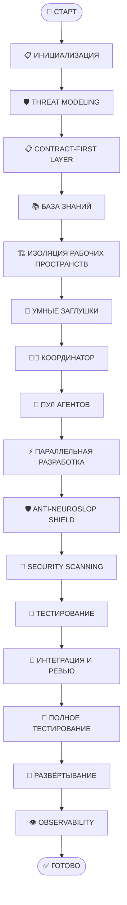

# План разработки проекта GoldPC

## Веб-приложение для компьютерного магазина с сервисным центром

**Версия документа:** 1.0  
**Дата создания:** 11.03.2026  
**Автор:** AI Development Team  
**Статус:** Утверждён

---

## 📋 Содержание

1. [Введение](#введение)
2. [Краткое описание проекта GoldPC](#краткое-описание-проекта-goldpc)
3. [Цель документа](#цель-документа)
4. [Структура папки development-plan](#структура-папки-development-plan)
5. [Диаграмма процесса разработки](#диаграмма-процесса-разработки)
6. [Глоссарий терминов](#глоссарий-терминов)
7. [Общие соглашения](#общие-соглашения)
8. [Внешние документы](#внешние-документы)
9. [Критерии успеха проекта](#критерии-успеха-проекта)
10. [История изменений](#история-изменений)

---

## Введение

Данный план разработки описывает последовательность действий для создания веб-приложения **GoldPC** — информационной системы для автоматизации деятельности компьютерного магазина с сервисным центром. План основан на утверждённой диаграмме процесса AI-ориентированной параллельной разработки (`AI_driven_dev_process.mmd`) и интегрирует требования из проектной документации.

### Особенности подхода

Этот план учитывает специфику разработки с использованием **множественных ИИ-агентов**, работающих параллельно:

- 🤖 **Параллельная разработка** — распределение модулей между агентами
- 🔄 **Contract-First подход** — контракты API определяются до начала кодирования
- 🛡️ **Anti-Neuroslop Shield** — 5-слойная система защиты от низкокачественного ИИ-кода
- 🔐 **Security-First** — Threat Modeling и security scanning на всех этапах
- 👁️ **Observability** — мониторинг и обратная связь в реальном времени

### Целевая аудитория

- 👨‍💼 **Координатор проекта** — управление и контроль выполнения
- 🤖 **ИИ-агенты** — исполнители задач (TIER-1, TIER-2, TIER-3)
- 👨‍💻 **Разработчики-люди** — ревью и принятие решений
- 📋 **Заказчик** — понимание процесса и этапов

---

## Краткое описание проекта GoldPC

### Назначение системы

Веб-приложение «GoldPC» предназначено для автоматизации следующих бизнес-процессов:

- Управление каталогом товаров с фильтрацией по техническим характеристикам
- Онлайн-конструктор ПК с автоматической проверкой совместимости комплектующих
- Оформление и обработка заказов на товары и услуги
- Управление складским учётом и резервированием товаров
- Учёт гарантийных случаев и обслуживания
- Управление заявками на ремонт и сборку
- Администрирование пользователей и прав доступа
- Формирование отчётов и аналитика

### Ключевые модули

| Модуль | Описание | Приоритет |
|--------|----------|-----------|
| 📦 **Каталог товаров** | Управление ассортиментом, фильтрация, поиск | Высокий |
| 🖥️ **Конструктор ПК** | Подбор совместимых комплектующих | Высокий |
| 🛒 **Заказы** | Оформление, обработка, статусы | Высокий |
| 🔧 **Услуги** | Заявки на ремонт, назначение мастеров | Высокий |
| 📋 **Гарантия** | Учёт гарантийных талонов | Средний |
| ⚙️ **Администрирование** | Пользователи, роли, справочники | Высокий |

### Технологический стек

| Слой | Технологии |
|------|------------|
| **Backend** | C# 12, ASP.NET Core 8, Entity Framework Core 8, Serilog |
| **Frontend** | TypeScript 5, React 18, Redux Toolkit, Material-UI, Tailwind CSS |
| **Database** | PostgreSQL 16, Redis 7 |
| **Infrastructure** | Docker, Nginx, GitHub Actions, Prometheus/Grafana |

### Ролевая модель

Система поддерживает 6 ролей пользователей:

| Роль | Описание |
|------|----------|
| **Гость** | Неавторизованный пользователь, просмотр каталога |
| **Клиент** | Зарегистрированный покупатель, оформление заказов |
| **Менеджер** | Обработка заказов, управление товарами |
| **Мастер** | Выполнение ремонтных и сборочных работ |
| **Администратор** | Полный доступ к системе |
| **Бухгалтер** | Финансовые отчёты |

---

## Цель документа

Данный документ служит **введением и картой всего плана разработки**, создаваемого с использованием нескольких ИИ-агентов. Он обеспечивает:

1. **Навигацию** — единая точка входа для понимания структуры плана
2. **Контекст** — общее описание проекта для всех участников
3. **Терминологию** — глоссарий для согласованности между агентами
4. **Соглашения** — стандарты оформления и связывания документов
5. **Обратную связь** — связь между этапами и внешними документами

---

## Структура папки development-plan

План организован в виде набора документов, каждый из которых детализирует отдельный этап разработки:

```
development-plan/
├── README.md                         # Этот файл — обзор плана
├── 01-requirements-analysis.md       # Анализ требований и декомпозиция
├── 02-contracts-and-architecture.md  # Проектирование контрактов и архитектура
├── 03-environment-setup.md           # Настройка среды разработки
├── 04-stub-generation.md             # Создание умных заглушек
├── 05-parallel-development.md        # Организация параллельной разработки
├── 06-quality-checks.md              # Anti-Neuroslop проверки качества
├── 07-security.md                    # Обеспечение безопасности
├── 08-testing.md                     # Тестирование (Unit, Integration, Contract)
├── 09-code-review-and-integration.md # Ревью и интеграция кода
├── 10-e2e-and-load-testing.md        # E2E и нагрузочное тестирование
├── 11-deployment.md                  # Развёртывание (Blue-Green, Canary)
├── 12-monitoring-and-feedback.md     # Мониторинг и обратная связь
└── appendices/                       # Приложения
    ├── ТЗ_GoldPC.md                  # Техническое задание
    ├── Инструменты_для_разработки.md # Инструментарий
    └── Таблицы_по_Вигерсу.md         # Требования по Вигерсу
```

### Описание файлов плана

| № | Файл | Этап | Длительность | Описание |
|---|------|------|--------------|----------|
| 1 | [01-requirements-analysis.md](./01-requirements-analysis.md) | Анализ требований | 1-2 недели | Анализ ТЗ, декомпозиция на модули, определение зависимостей, формирование бэклога |
| 2 | [02-contracts-and-architecture.md](./02-contracts-and-architecture.md) | Контракты и архитектура | 2-3 недели | STRIDE анализ, OpenAPI спецификации, Pact контракты, C4 диаграммы |
| 3 | [03-environment-setup.md](./03-environment-setup.md) | Настройка среды | 1 неделя | Монорепозиторий, git worktree, Docker, CI/CD pipeline |
| 4 | [04-stub-generation.md](./04-stub-generation.md) | Генерация заглушек | 1 неделя | Faker генераторы, MSW handlers, Chaos Engineering, Stub Registry |
| 5 | [05-parallel-development.md](./05-parallel-development.md) | Параллельная разработка | 8-12 недель | TIER-система агентов, Knowledge Injection, синхронизация, управление конфликтами |
| 6 | [06-quality-checks.md](./06-quality-checks.md) | Проверки качества | Постоянно | 5 слоёв Anti-Neuroslop: статический, семантический, архитектурный, сложность, дублирование |
| 7 | [07-security.md](./07-security.md) | Безопасность | Постоянно | JWT аутентификация, RBAC, защита от атак, audit logging |
| 8 | [08-testing.md](./08-testing.md) | Тестирование | Постоянно | Unit тесты (70%), Integration тесты (25%), Contract тесты |
| 9 | [09-code-review-and-integration.md](./09-code-review-and-integration.md) | Ревью и интеграция | Постоянно | Кросс-ревью агентов, PR процесс, Agent Duel, merge strategy |
| 10 | [10-e2e-and-load-testing.md](./10-e2e-and-load-testing.md) | E2E и нагрузка | 2-3 недели | Playwright E2E тесты, k6 нагрузочное тестирование, Lighthouse |
| 11 | [11-deployment.md](./11-deployment.md) | Деплой | 1-2 недели | Blue-Green deployment, Canary release, rollback strategy |
| 12 | [12-monitoring-and-feedback.md](./12-monitoring-and-feedback.md) | Мониторинг | Постоянно | Prometheus, Grafana, AlertManager, distributed tracing |

---

## Диаграмма процесса разработки

Ниже представлена высокоуровневая диаграмма процесса (соответствует файлу `AI_driven_dev_process.mmd`):



### Ключевые подсистемы

#### 🛡️ Anti-Neuroslop Shield — 5 слоёв защиты

| Слой | Назначение | Инструменты |
|------|------------|-------------|
| 1. Статический анализ | Базовый lint | ESLint, StyleCop, SonarQube |
| 2. Семантический анализ | Детекция галлюцинаций ИИ | Проверка библиотек, API |
| 3. Архитектурный анализ | Соответствие паттернам | NetArchTest, dependency check |
| 4. Анализ сложности | Over-engineering детекция | Cognitive complexity |
| 5. Дублирование | Copy-paste детекция | PMD CPD, Simian |

#### 👥 TIER-система агентов

| TIER | Роль | Функции |
|------|------|---------|
| 🥇 TIER-1 | Архитекторы | Проектирование, контракты, ревью, координация |
| 🥈 TIER-2 | Разработчики | Реализация модулей, написание тестов, документация |
| 🥉 TIER-3 | Специалисты | Тестирование, DevOps задачи, QA проверки |

---

## Глоссарий терминов

| Термин | Определение |
|--------|-------------|
| **ИИ-агент** | Автономный ИИ-помощник, выполняющий задачи разработки согласно своему TIER |
| **Нейрослоп** | Низкокачественный код, сгенерированный ИИ без должного контроля (галлюцинации, выдуманные API, over-engineering) |
| **Contract-First** | Подход, при котором API-контракты (OpenAPI, Pact) определяются до реализации |
| **Микросервис** | В контексте проекта — логически изолированный модуль с чёткими границами API |
| **Контракт** | Формальное описание API (OpenAPI) или взаимодействия между сервисами (Pact) |
| **Заглушка (Stub/Mock)** | Имитация зависимости для изолированной разработки и тестирования |
| **Smart Stub** | Интеллектуальная заглушка с Faker-данными и Chaos Engineering |
| **Threat Modeling** | Процесс идентификации потенциальных угроз безопасности |
| **STRIDE** | Методология анализа угроз: Spoofing, Tampering, Repudiation, Information disclosure, Denial of service, Elevation of privilege |
| **WIP Limits** | Ограничение количества задач в работе (Work In Progress) |
| **Knowledge Injection** | Внедрение знаний (паттерны, уроки, контракты) в контекст агентов перед началом работы |
| **Agent Duel** | Протокол разрешения конфликтов между агентами через голосование ревьюверов |
| **Координатор** | Роль (ИИ или человек), управляющая распределением задач и синхронизацией агентов |
| **Blue-Green Deployment** | Стратегия развёртывания с двумя идентичными окружениями для zero-downtime |
| **Canary Release** | Постепенное внедрение новой версии для части пользователей |
| **Observability** | Возможность понимания внутреннего состояния системы через внешние сигналы (логи, метрики, трассы) |
| **SLA** | Service Level Agreement — соглашение об уровне сервиса (доступность, время отклика) |
| **p95/p99** | Перцентили времени отклика (95% или 99% запросов укладываются в указанное время) |

---

## Общие соглашения

### Формат документов

- Все документы создаются в формате **Markdown** (`.md`)
- Для диаграмм используется **Mermaid** (`.mmd` или встроенные блоки)
- Кодовые примеры выделяются блоками с указанием языка

### Соглашения по именам файлов

```
NN-kebab-case.md        # Файлы этапов (01-requirements-analysis.md)
ТЗ_GooName.md           # Документы на русском (appendices/)
```

### Соглашения по ссылкам

- **Относительные ссылки** на файлы внутри плана: `[текст](./имя-файла.md)`
- **Ссылки на разделы**: `[текст](#заголовок-раздела)`
- **Ссылки на внешние документы**: `[текст](./appendices/имя-файла.md)`

### Структура документа этапа

Каждый документ этапа следует единой структуре:

1. **Заголовок** — название и номер этапа
2. **Метаданные** — версия, длительность, ответственные
3. **Цель этапа** — краткое описание
4. **Входные данные** — таблица с источниками
5. **Подробное описание действий** — шаги с диаграммами, примерами кода
6. **Выходные артефакты** — таблица результатов
7. **Критерии готовности** — чек-лист Definition of Done
8. **Риски** — таблица с митигацией
9. **Переход к следующему этапу** — условия
10. **Связанные документы** — ссылки

---

## Внешние документы

### Исходные документы (в папке `appendices/`)

| Документ | Описание | Файл |
|----------|----------|------|
| **Техническое задание** | Полное ТЗ по ГОСТ 19.201-78 с требованиями ФТ-1.1 — ФТ-6.9, НФТ-1.1 — НФТ-6.5 | [ТЗ_GoldPC.md](./appendices/ТЗ_GoldPC.md) |
| **Инструменты разработки** | Технологический стек и инструментарий для Backend, Frontend, Infrastructure | [Инструменты_для_разработки.md](./appendices/Инструменты_для_разработки.md) |
| **Требования по Вигерсу** | Детализация требований по методологии Вигерса с матрицами трассируемости | [Таблицы_по_Вигерсу.md](./appendices/Таблицы_по_Вигерсу.md) |

### Диаграмма процесса

Диаграмма процесса разработки находится в корневой папке проекта:
- `AI_driven_dev_process.mmd` — Mermaid-диаграмма процесса (полная версия со всеми подсистемами)

---

## Критерии успеха проекта

Проект считается успешно завершённым при выполнении следующих условий:

### Функциональные критерии

- [ ] Все требования ФТ-1.1 — ФТ-6.9 реализованы
- [ ] Все пользовательские истории ПТ-Г-1 — ПТ-Б-6 выполнены
- [ ] Все Use Cases UC-01 — UC-06 работают корректно

### Качественные критерии

- [ ] Покрытие тестами ≥70%
- [ ] Mutation score ≥80%
- [ ] Нет критических и высоких уязвимостей
- [ ] SUS score ≥68 (System Usability Scale)

### Производительность

| Метрика | Целевое значение |
|---------|------------------|
| Время отклика (p95) | ≤2 секунды |
| Время отклика конструктора | ≤1 секунда |
| Concurrent users | 100 без деградации |
| Uptime | ≥99.5% |

### Безопасность

- [ ] OWASP Top 10 пройден
- [ ] Все пароли хэшированы (bcrypt/Argon2)
- [ ] HTTPS везде (TLS 1.2+)
- [ ] Аудит критических операций

---

## История изменений

| Версия | Дата | Автор | Описание изменений |
|--------|------|-------|-------------------|
| 1.0 | 11.03.2026 | AI Development Team | Первоначальная версия документа. Создание структуры плана разработки. |

---

## Контакты и поддержка

- **Заказчик:** Колледж Бизнеса и Права, г. Минск
- **Студент:** Кажуро Глеб (группа Т-393)
- **Репозиторий:** Git-репозиторий проекта
- **Документация:** папка `/docs` в репозитории

---

*Документ создан автоматически на основе диаграммы процесса и проектной документации.*