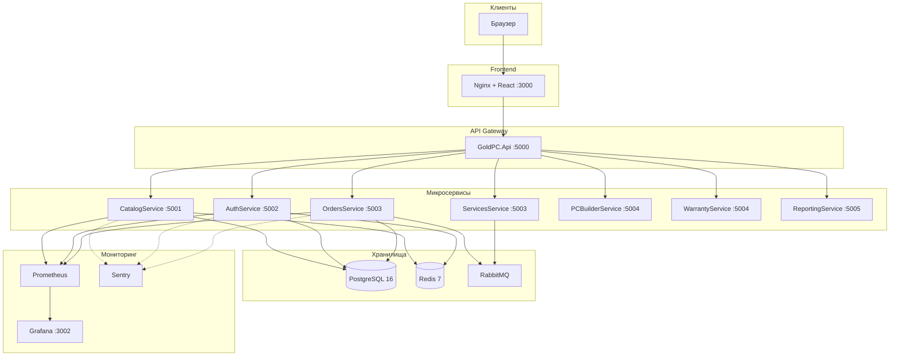

# Руководство администратора GoldPC

> **Версия**: 1.0 | **Последнее обновление**: 2026-06-17
> **Аудитория**: Администраторы системы, DevOps-инженеры

---

## 1. Введение

Настоящий документ описывает процедуры установки, настройки и администрирования веб-приложения **GoldPC** — информационной системы для компьютерного магазина с сервисным центром.

### Область применения

- Розничная торговля компьютерными комплектующими
- Сборка персональных компьютеров под заказ
- Услуги по ремонту и обслуживанию техники

### Архитектура



---

## 2. Требования к серверу

### Минимальные характеристики

| Параметр | Минимальные | Рекомендуемые |
|----------|-------------|---------------|
| **CPU** | 4 ядра | 8 ядер |
| **RAM** | 8 ГБ | 16 ГБ |
| **Диск** | 50 ГБ SSD | 100 ГБ SSD |
| **Сеть** | 100 Мбит/с | 1 Гбит/с |

### Программное обеспечение

| Компонент | Требование | Проверка |
|-----------|------------|----------|
| **ОС** | Ubuntu 22.04 LTS | `lsb_release -a` |
| **Docker** | 20.10+ | `docker --version` |
| **Docker Compose** | v2.0+ | `docker compose version` |
| **PostgreSQL** | 16 | В контейнере |
| **Redis** | 7 | В контейнере |
| **Git** | 2.0+ | `git --version` |

### Проверка окружения

```bash
# Проверить Docker
docker --version
docker compose version

# Проверить свободное место
df -h /opt

# Проверить порты (5000-5005, 5432, 6379, 3000)
sudo netstat -tlnp | grep -E ':(5000|5001|5002|5003|5004|5005|5432|6379|3000)'
```

---

## 3. Установка

### 3.1. Клонирование репозитория

```bash
# Создать директорию
sudo mkdir -p /opt/goldpc
sudo chown $USER:$USER /opt/goldpc

# Клонировать
git clone https://github.com/goldie1k/goldpc.git /opt/goldpc
cd /opt/goldpc
```

### 3.2. Настройка переменных окружения

```bash
# Скопировать шаблон
cp .env.example .env

# Отредактировать
nano .env
```

**Минимальная конфигурация** (заменить `<CHANGE_ME>`):

```bash
# Безопасность
JWT_SECRET=$(openssl rand -base64 32)
ENCRYPTION_KEY=$(openssl rand -base64 32)

# База данных
DATABASE_PASSWORD=$(openssl rand -base64 16)
REDIS_PASSWORD=$(openssl rand -base64 16)

# SMTP (Gmail App Password)
EMAIL_SMTP_USER=your-email@gmail.com
EMAIL_SMTP_PASSWORD=XXXX-XXXX-XXXX-XXXX
EMAIL_FROM_ADDRESS=your-email@gmail.com

# Платежи (Stripe test keys)
PAYMENT_SHOP_ID=your_stripe_key
PAYMENT_API_KEY=sk_test_...
PAYMENT_WEBHOOK_SECRET=whsec_...
```

### 3.3. Запуск

```bash
# Development окружение
docker compose up -d

# Проверить статус
docker compose ps
```

### 3.4. Проверка работоспособности

```bash
# Health checks
curl -f http://localhost:9081/health && echo "Catalog OK"
curl -f http://localhost:9082/health && echo "Auth OK"
curl -f http://localhost:3002 && echo "Frontend OK"

# Логи
docker compose logs --tail=50
```

### Ожидаемые порты

| Сервис | Порт (dev) | Порт (prod) |
|--------|------------|-------------|
| Frontend | 3002 | 80/443 |
| CatalogService | 9081 | 5001 |
| AuthService | 9082 | 5002 |
| PostgreSQL | 5434 | 5432 |
| Redis | 6379 | 6379 |
| Adminer | 9090 | — |
| RabbitMQ | 15672 | — |

---

## 4. Конфигурация

### 4.1. Переменные окружения

| Категория | Переменных | Обязательные |
|-----------|------------|--------------|
| Database | 10 | 6 |
| JWT | 8 | 4 |
| SMTP | 8 | 5 |
| Stripe | 5 | 5 |
| Redis | 4 | 3 |
| Monitoring | 4 | 0 |

Полный список: [Переменные окружения](obsidian/16_Config_ENV/Переменные_окружения.md)

### 4.2. SSL/HTTPS

```bash
# Установить Certbot
sudo apt install certbot python3-certbot-nginx

# Получить сертификат
sudo certbot --nginx -d goldpc.by -d www.goldpc.by

# Автообновление
sudo certbot renew --dry-run
```

**Nginx конфигурация** (`/etc/nginx/conf.d/goldpc.conf`):

```nginx
server {
    listen 443 ssl http2;
    server_name goldpc.by www.goldpc.by;

    ssl_certificate /etc/letsencrypt/live/goldpc.by/fullchain.pem;
    ssl_certificate_key /etc/letsencrypt/live/goldpc.by/privkey.pem;

    # Безопасные настройки SSL
    ssl_protocols TLSv1.2 TLSv1.3;
    ssl_ciphers ECDHE-ECDSA-AES128-GCM-SHA256:ECDHE-RSA-AES128-GCM-SHA256;
    ssl_prefer_server_ciphers off;

    # Security headers
    add_header Strict-Transport-Security "max-age=31536000; includeSubDomains" always;
    add_header X-Frame-Options SAMEORIGIN;
    add_header X-Content-Type-Options nosniff;
    add_header X-XSS-Protection "1; mode=block";

    location / {
        proxy_pass http://localhost:3000;
        proxy_set_header Host $host;
        proxy_set_header X-Real-IP $remote_addr;
        proxy_set_header X-Forwarded-For $proxy_add_x_forwarded_for;
        proxy_set_header X-Forwarded-Proto $scheme;
    }
}
```

### 4.3. SMTP (Email-уведомления)

```bash
# Gmail App Password:
# 1. https://myaccount.google.com/security → включить 2FA
# 2. https://myaccount.google.com/apppasswords → создать пароль
# 3. Вставить 16-значный пароль в EMAIL_SMTP_PASSWORD
```

**Проверка SMTP**:

```bash
# Тестовый email
docker compose exec auth.api curl -s http://localhost:8080/api/auth/test-email \
  -H "Content-Type: application/json" \
  -d '{"email":"test@example.com"}'
```

### 4.4. Stripe (Платежи)

```bash
# Test keys из Stripe Dashboard
PAYMENT_SHOP_ID=pk_test_...
PAYMENT_API_KEY=sk_test_...
PAYMENT_WEBHOOK_SECRET=whsec_...

# Stripe webhook URL:
# https://goldpc.by/api/v1/orders/webhook/stripe
```

**Настройка webhook в Stripe Dashboard**:
1. Developers → Webhooks → Add endpoint
2. URL: `https://goldpc.by/api/v1/orders/webhook/stripe`
3. Events: `payment_intent.succeeded`, `payment_intent.payment_failed`

### 4.5. SMS-шлюз

```bash
# SMS.ru (пример)
SMS_API_KEY=your_api_key
SMS_API_URL=https://api.sms.ru
```

### 4.6. CORS политика

```bash
# Разрешённые домены
CORS_ALLOWED_ORIGINS=https://goldpc.by,https://www.goldpc.by,https://localhost:3000
```

### 4.7. Rate Limiting

```bash
# Общие лимиты
RATE_LIMIT_REQUESTS=100          # запросов
RATE_LIMIT_WINDOW_SECONDS=60     # за окно (сек)

# Логин
LOGIN_RATE_LIMIT_ATTEMPTS=5      # попыток
LOGIN_RATE_LIMIT_LOCKOUT_MINUTES=15  # блокировка
```

**Nginx rate limiting**:

```nginx
limit_req_zone $binary_remote_addr zone=api:10m rate=50r/s;
limit_req_zone $binary_remote_addr zone=login:10m rate=5r/m;
limit_req_zone $binary_remote_addr zone=register:10m rate=2r/m;

location /api/ {
    limit_req zone=api burst=20 nodelay;
    proxy_pass http://backend;
}

location /api/auth/login {
    limit_req zone=login burst=3 nodelay;
    proxy_pass http://auth-backend;
}
```

---

## 5. Управление пользователями

### 5.1. Роли

| Роль | Описание | Ключевые разрешения |
|------|----------|---------------------|
| **Guest** | Неавторизованный | Каталог (read-only) |
| **Client** | Покупатель | Заказы, заявки, гарантии |
| **Manager** | Менеджер магазина | Товары, заказы, обработка |
| **Master** | Мастер СЦ | Заявки, ремонты |
| **Admin** | Администратор | Всё |
| **Accountant** | Бухгалтер | Отчёты, финансы |

### 5.2. Создание пользователя

```bash
# Через API (от администратора)
curl -X POST http://localhost:9082/api/auth/register \
  -H "Content-Type: application/json" \
  -H "Authorization: Bearer <admin_jwt>" \
  -d '{
    "email": "manager@goldpc.by",
    "password": "SecureP@ss123",
    "firstName": "Иван",
    "lastName": "Петров",
    "role": "Manager"
  }'
```

### 5.3. Блокировка пользователя

```bash
# Через Adminer UI
# http://localhost:9090 → goldpc_auth → Users → LockedUntil = now + 15 min

# Или через API
curl -X PUT http://localhost:9082/api/admin/users/{id}/lock \
  -H "Authorization: Bearer <admin_jwt>"
```

### 5.4. Сброс пароля

```bash
# Пользователь запрашивает сброс
curl -X POST http://localhost:9082/api/auth/forgot-password \
  -H "Content-Type: application/json" \
  -d '{"email": "user@goldpc.by"}'

# Администратор сбрасывает принудительно
curl -X POST http://localhost:9082/api/admin/users/{id}/reset-password \
  -H "Authorization: Bearer <admin_jwt>"
```

### 5.5. Двухфакторная аутентификация (2FA)

```bash
# Включить 2FA
curl -X POST http://localhost:9082/api/auth/2fa/setup \
  -H "Authorization: Bearer <jwt>"

# Ответ: { "secret": "...", "qrCode": "otpauth://..." }

# Подтвердить кодом
curl -X POST http://localhost:9082/api/auth/2fa/verify \
  -H "Authorization: Bearer <jwt>" \
  -d '{"code": "123456"}'
```

---

## 6. Управление каталогом

### 6.1. Товары

```bash
# Создать товар
curl -X POST http://localhost:9081/api/v1/catalog/products \
  -H "Content-Type: application/json" \
  -H "Authorization: Bearer <jwt>" \
  -d '{
    "name": "Intel Core i7-14700K",
    "categoryId": "uuid-category",
    "manufacturerId": "uuid-manufacturer",
    "price": 450.00,
    "stock": 15,
    "warrantyMonths": 36,
    "specifications": {
      "socket": "LGA1700",
      "cores": 20,
      "frequency": "3.4 GHz",
      "tdp": 125
    }
  }'

# Обновить цену
curl -X PUT http://localhost:9081/api/v1/catalog/products/{id}/price \
  -H "Content-Type: application/json" \
  -H "Authorization: Bearer <jwt>" \
  -d '{"price": 420.00}'
```

### 6.2. Категории

```bash
# Список категорий
curl http://localhost:9081/api/v1/catalog/categories

# Создать категорию
curl -X POST http://localhost:9081/api/v1/catalog/categories \
  -H "Content-Type: application/json" \
  -H "Authorization: Bearer <jwt>" \
  -d '{
    "name": "Видеокарты",
    "parentId": null,
    "sortOrder": 2
  }'
```

### 6.3. Изображения

```bash
# Загрузить изображение
curl -X POST http://localhost:5000/api/admin/products/{id}/images \
  -H "Authorization: Bearer <jwt>" \
  -F "file=@image.jpg" \
  -F "isPrimary=true" \
  -F "sortOrder=0"
```

### 6.4. Ценовая политика

| Параметр | Значение |
|----------|----------|
| Валюта | BYN (белорусский рубль) |
| Минимальная наценка | 5% |
| История цен | Хранится в `PriceHistory` |
| Скидки | Через промокоды (реализовано частично) |

---

## 7. Мониторинг

### 7.1. Prometheus + Grafana

```bash
# Запустить мониторинг
docker compose -f docker/docker-compose.prod.yml --profile monitoring up -d

# Доступ:
# Prometheus: http://localhost:9090
# Grafana: http://localhost:3002 (admin/admin)
```

### 7.2. Ключевые метрики

| Метрика | Порог алерта |
|---------|--------------|
| Error rate | > 5% за 5 мин |
| P95 latency | > 1 сек за 5 мин |
| Service down | > 1 мин |
| Cache hit ratio | < 70% |
| Memory usage | > 80% |

### 7.3. Логи

```bash
# Docker logs
docker compose logs -f --tail=100 catalog.api

# Только ошибки
docker compose logs catalog.api 2>&1 | grep -i error

# Все сервисы
docker compose logs --tail=50
```

### 7.4. Sentry

```bash
# Конфигурация
SENTRY_DSN=https://xxx@sentry.goldpc.by/1

# Просмотр ошибок
# https://sentry.goldpc.by/organizations/goldpc/issues/
```

### 7.5. Health Check Endpoints

| Сервис | Endpoint | Проверка |
|--------|----------|----------|
| Все | `GET /health` | Полная проверка |
| Все | `GET /health/ready` | Readiness (БД, Redis) |
| Все | `GET /health/live` | Liveness (процесс) |

```bash
# Проверить все сервисы
for port in 5001 5002 5003 5004 5005; do
  curl -f http://localhost:$port/health && echo " :$port OK" || echo " :$port FAIL"
done
```

---

## 8. Резервное копирование

### 8.1. Ежедневные бэкапы

```bash
# Крон-задание (добавить в crontab)
# Ежедневно в 03:00 — полный дамп всех БД
0 3 * * * docker exec goldpc-postgres pg_dumpall -U postgres | gzip > /backups/goldpc_full_$(date +\%Y\%m\%d).sql.gz

# Ежедневно в 04:00 — сжатые дампы каждой БД
0 4 * * * for DB in goldpc_catalog goldpc_auth goldpc_orders; do \
  docker exec goldpc-postgres pg_dump -U postgres -Z 9 -d "$DB" | \
  gzip > /backups/${DB}_$(date +\%Y\%m\%d).sql.gz; done

# Ежедневно в 05:00 — копирование на удалённое хранилище
0 5 * * * rsync -avz /backups/ backup@storage:/backups/goldpc/
```

### 8.2. Настройка директории для бэкапов

```bash
# Создать директорию
sudo mkdir -p /backups/goldpc
sudo chown postgres:postgres /backups/goldpc

# В Docker Compose добавить volume:
# volumes:
#   - /backups/goldpc:/backups
```

### 8.3. Восстановление из бэкапа

```bash
# Остановить сервисы, использующие БД
docker compose stop catalog.api auth.api

# Восстановить
docker exec -i goldpc-postgres psql -U postgres < /backups/goldpc_full_20260617.sql.gz

# Или из сжатого дампа
gunzip -c /backups/goldpc_catalog_20260617.sql.gz | docker exec -i goldpc-postgres psql -U postgres -d goldpc_catalog

# Запустить сервисы
docker compose start catalog.api auth.api
```

### 8.4. Retention Policy

| Тип | Срок хранения |
|-----|---------------|
| Ежедневные | 7 дней |
| Еженедельные | 4 недели |
| Ежемесячные | 12 месяцев |

```bash
# Очистка старых бэкапов (cron)
0 6 * * * find /backups/goldpc -name "*.gz" -mtime +7 -delete
```

---

## 9. Обновление системы

### 9.1. Blue-Green деплой

```bash
# 1. Запустить Green слот
docker compose -f docker/docker-compose.prod.yml --profile green up -d

# 2. Проверить health
curl -f http://localhost:5011/health   # Catalog Green
curl -f http://localhost:5013/health   # Auth Green
curl -f http://localhost:3001/health   # Frontend Green

# 3. Переключить Nginx
sed -i 's/blue/green/g' /etc/nginx/upstream.conf
nginx -t && nginx -s reload

# 4. Остановить Blue слот
docker compose -f docker/docker-compose.prod.yml stop catalog-blue auth-blue frontend-blue
```

### 9.2. Rollback (откат)

```bash
# 1. Переключить Nginx обратно на Blue
sed -i 's/green/blue/g' /etc/nginx/upstream.conf
nginx -t && nginx -s reload

# 2. Остановить Green
docker compose -f docker/docker-compose.prod.yml stop catalog-green auth-green frontend-green
```

### 9.3. Миграции БД

```bash
# Применить миграции
docker compose exec catalog.api dotnet ef database update \
  --project /app/CatalogService \
  --context CatalogDbContext

# Откатить последнюю миграцию
docker compose exec catalog.api dotnet ef database update LastGoodMigration \
  --project /app/CatalogService \
  --context CatalogDbContext
```

---

## 10. Устранение неполадок

### 10.1. Типичные ошибки

| Симптом | Причина | Решение |
|---------|---------|---------|
| `Connection refused` | Сервис не запущен | `docker compose up -d` |
| `502 Bad Gateway` | Upstream недоступен | Проверить blue/green слот |
| `429 Too Many Requests` | Rate limit | Увеличить лимиты в Nginx |
| `504 Gateway Timeout` | Медленный ответ | Проверить БД, увеличить timeout |

### 10.2. Redis недоступен

```bash
# Проверить Redis
docker compose exec redis redis-cli ping

# Перезапустить
docker compose restart redis

# Проверить данные
docker compose exec redis redis-cli info stats
```

**Поведение системы**: при недоступности Redis система автоматически переключается на кэширование в памяти приложения. После восстановления кэш синхронизируется.

### 10.3. База данных недоступна

```bash
# Проверить PostgreSQL
docker compose exec postgres pg_isready -U postgres

# Проверить размер БД
docker compose exec postgres psql -U postgres -d goldpc_catalog \
  -c "SELECT pg_size_pretty(pg_database_size('goldpc_catalog'))"

# Проверить подключения
docker compose exec postgres psql -U postgres -c "SELECT count(*) FROM pg_stat_activity"

# Перезапустить
docker compose restart postgres
```

### 10.4. Email не отправляется

```bash
# 1. Проверить SMTP конфигурацию
docker compose exec auth.api env | grep SMTP

# 2. Проверить логи Auth
docker compose logs auth.api 2>&1 | grep -i smtp

# 3. Тестовый запрос
curl -X POST http://localhost:9082/api/auth/forgot-password \
  -H "Content-Type: application/json" \
  -d '{"email": "test@example.com"}'

# 4. Проверить Gmail App Password
# Убедиться, что 2FA включён и App Password сгенерирован
```

### 10.5. Платежи не проходят

```bash
# 1. Проверить Stripe ключи
docker compose exec orders.api env | grep STRIPE

# 2. Проверить webhook
curl -X POST https://goldpc.by/api/v1/orders/webhook/stripe \
  -H "Stripe-Signature: test" \
  -d '{}'

# 3. Stripe Dashboard → Developers → Webhooks →查看 ошибки
```

### 10.6. Команды диагностики

```bash
# Статус всех контейнеров
docker compose ps -a

# Использование ресурсов
docker stats --no-stream

# Размер образов
docker system df

# Очистка (осторожно!)
docker system prune -a --volumes
```

---

## Приложение A: Полезные ссылки

| Ресурс | URL |
|--------|-----|
| GitHub Repository | https://github.com/goldie1k/goldpc |
| Grafana | http://goldpc.by:3002 |
| Prometheus | http://goldpc.by:9090 |
| Sentry | https://sentry.goldpc.by |
| Stripe Dashboard | https://dashboard.stripe.com |
| Adminer | http://goldpc.by:9090 |

## Приложение B: Контакты

| Роль | Контакт |
|------|---------|
| Разработчик | Глеб Кажуро |
| Учебное заведение | Колледж Бизнеса и Права, г. Минск |
| Группа | Т-393 |

---

*Документ создан на основе ТЗ-ГолдПК-001 и существующей документации проекта.*
