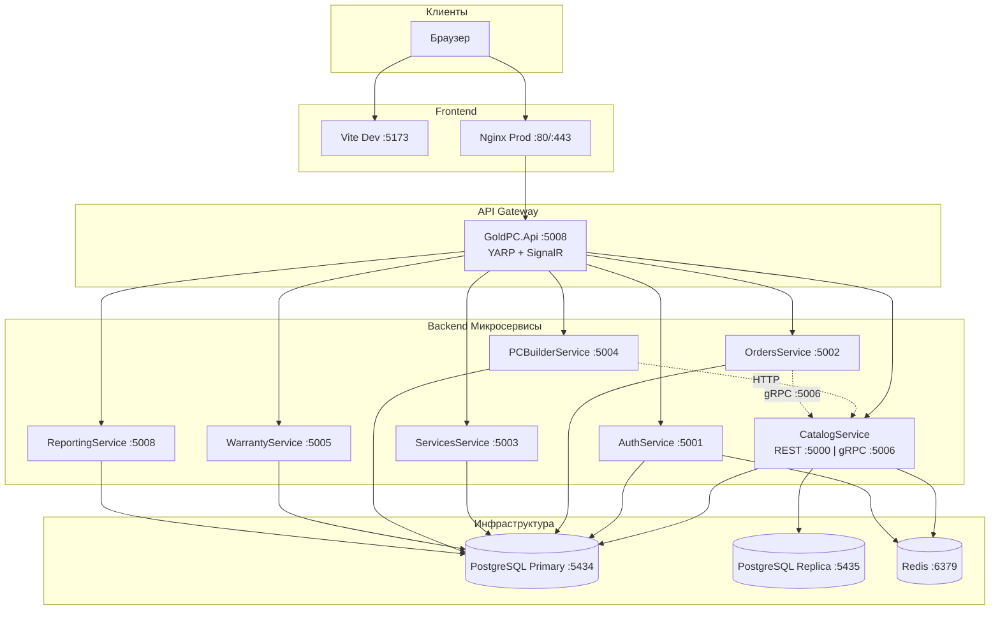
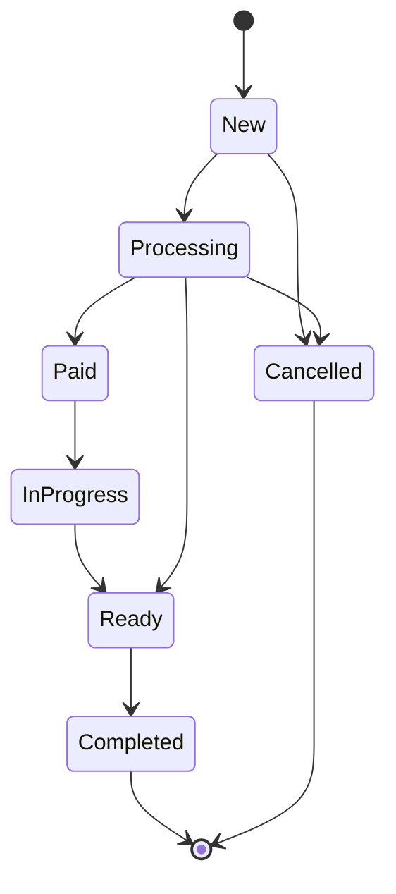
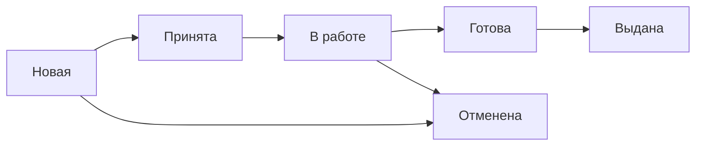
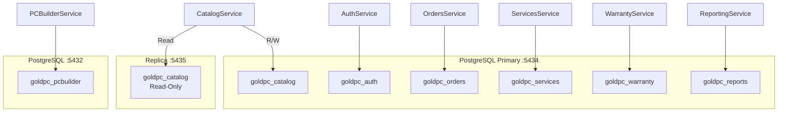
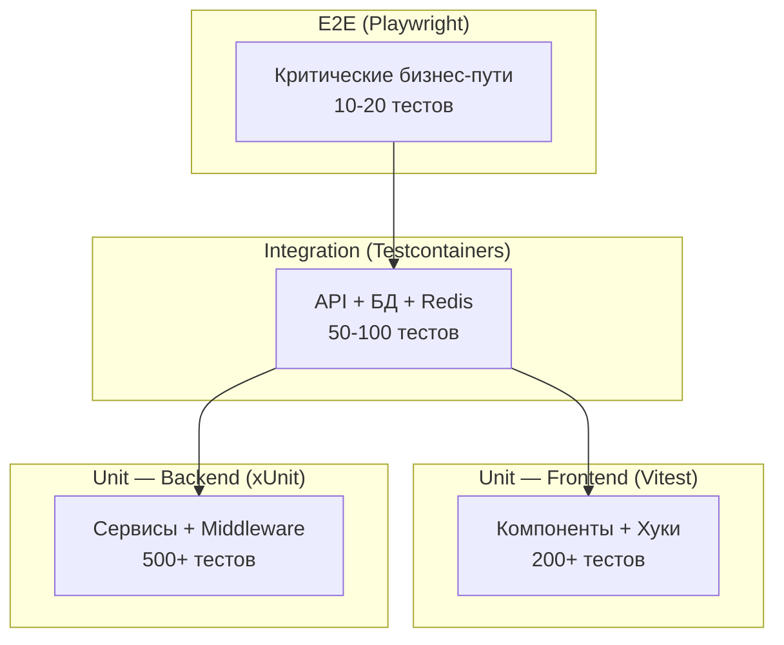
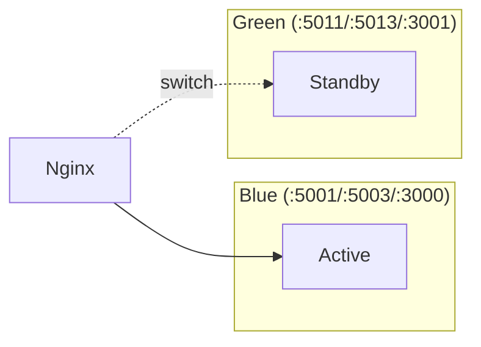

# Руководство разработчика GoldPC

> **Версия**: 1.0 | **Последнее обновление**: 2026-06-17
> **Проект**: Интернет-магазин компьютерной техники с сервисным центром
> **Стек**: ASP.NET Core 8 + React 19 + PostgreSQL 16 + Redis 7

---

## Содержание

1. [Архитектура](#1-архитектура)
2. [Начало работы](#2-начало-работы)
3. [Backend](#3-backend)
4. [Frontend](#4-frontend)
5. [База данных](#5-база-данных)
6. [Тестирование](#6-тестирование)
7. [Деплой](#7-деплой)
8. [Код-стайл](#8-код-стайл)

---

## 1. Архитектура

### 1.1 Обзор

GoldPC построен по **микросервисной архитектуре** с 7 backend-сервисами (.NET 8) и SPA на React 19. API Gateway — `GoldPC.Api` (YARP BFF). Каждый сервис имеет свою базу данных.

### 1.2 Диаграмма взаимодействия



### 1.3 Паттерны

| Паттерн | Где применяется | Описание |
|---------|----------------|----------|
| **CQRS** | CatalogService | Read/Write DbContexts, :5434 (write) / :5435 (read) |
| **Repository** | Все сервисы | Изоляция доступа к данным |
| **BFF** | GoldPC.Api | Единая точка входа для фронтенда |
| **Event-Driven** | MassTransit (отключён) | OrderPlacedEvent, OrderPaidEvent |
| **FSM** | OrdersService | Жизненный цикл заказа |

### 1.4 Межсервисное взаимодействие

| Протокол | Использование | Статус |
|----------|---------------|--------|
| **REST (JSON)** | BFF → все сервисы, PCBuilder → Catalog | Активен |
| **gRPC (HTTP/2)** | Orders → Catalog (резервация стока) | Активен |
| **MassTransit/RabbitMQ** | Warranty (OrderPlacedEvent) | Только Warranty |
| **SignalR** | BFF → Frontend (уведомления) | Активен |

### 1.5 Порты сервисов

| Сервис | Dev | Prod Blue | Prod Green |
|--------|-----|-----------|------------|
| CatalogService (REST) | 5000 | 5001 | 5011 |
| CatalogService (gRPC) | 5006 | — | — |
| AuthService | 5001 | 5003 | 5013 |
| OrdersService | 5002 | 5004 | 5014 |
| ServicesService | 5003 | 5005 | 5015 |
| PCBuilderService | 5004 | 5002 | 5012 |
| WarrantyService | 5005 | 5006 | 5016 |
| ReportingService | 5008 | 5008 | 5018 |
| GoldPC.Api (BFF) | 5008 | — | — |
| PostgreSQL | 5434 | 5432 | 5432 |
| PostgreSQL Replica | 5435 | — | — |
| Redis | 6379 | 6379 | 6379 |

---

## 2. Начало работы

### 2.1 Требования

| Инструмент | Версия | Назначение |
|------------|--------|------------|
| Node.js | 20.x | Frontend сборка |
| .NET SDK | 8.0 | Backend сборка |
| Docker + Docker Compose | 24.x | Инфраструктура |
| PostgreSQL | 16 (в Docker) | База данных |
| Redis | 7 (в Docker) | Кэш |

### 2.2 Клонирование и запуск

```bash
# 1. Клонировать репозиторий
git clone https://github.com/Goldie228/GoldPC && cd GoldPC

# 2. Установить зависимости
cp .env.example .env
make install

# 3. Запустить полный стек (инfra + backend + frontend)
make dev

# Или поэтапно:
make infra          # PostgreSQL + Redis
make backend        # CatalogService + AuthService + PCBuilderService
make frontend       # React SPA (Nginx в Docker)
```

### 2.3 Часто используемые команды

```bash
# Запуск/остановка
make up             # Все сервисы
make down           # Остановить всё
make logs           # Логи всех сервисов
make ps             # Запущенные контейнеры

# База данных
make db-shell       # psql консоль
make db-reset       # Сброс БД (⚠️ удалит данные)
make db-seed        # Заполнение каталога
make db-admin       # Adminer UI (http://localhost:8080)

# Тесты
make test           # Все тесты
make test-unit      # Unit-тесты
make test-e2e       # E2E тесты

# Сборка
make build          # Собрать Docker образы
make rebuild        # Пересобрать без кэша

# Мониторинг
make monitoring-up  # Prometheus + Grafana
```

### 2.4 Локальная разработка без Docker

```bash
# Только инфраструктура
make infra

# Backend — запуск отдельных сервисов
cd src/CatalogService && dotnet run --urls "http://localhost:5000"
cd src/AuthService && dotnet run --urls "http://localhost:5001"

# Frontend — Vite dev server с прокси на backend
cd src/frontend && npm install && npm run dev
# Frontend: http://localhost:5173 → прокси /api → http://localhost:5008
```

### 2.5 Настройка IDE

**VS Code** (рекомендуется):
- Расширения: C# Dev Kit, ESLint, Prettier, Tailwind CSS IntelliSense
- `dotnet format` для C# форматирования
- React DevTools для отладки компонентов

**Rider / Visual Studio**:
- Открыть `src/GoldPC.sln` для работы со всеми backend-проектами

---

## 3. Backend

### 3.1 Структура решений

```
src/
├── GoldPC.sln                    # Решение .NET
├── Directory.Build.props          # Общие настройки сборки
├── stylecop.json                  # Правила StyleCop
├── CatalogService/                # REST :5000, gRPC :5006
├── AuthService/                   # :5001
├── OrdersService/                 # :5002
├── ServicesService/               # :5003
├── PCBuilderService/              # :5004
├── WarrantyService/               # :5005
├── ReportingService/              # :5008
├── SharedKernel/                  # DTO, Enums, базовые сущности
├── Shared/                        # Общие сервисы (email, шифрование)
├── backend/GoldPC.Api/            # API Gateway (YARP BFF)
└── frontend/                      # React SPA
```

### 3.2 CatalogService

Центральный сервис — каталог товаров, фильтры, сток, gRPC для других сервисов.

**CQRS паттерн:**
```csharp
// Write DbContext — для записи (PrimaryKey :5434)
services.AddDbContext<CatalogDbContext>(options =>
    options.UseNpgsql(writeConnectionString));

// Read DbContext — для чтения (:5435 replica, AsNoTracking)
services.AddDbContext<ReadOnlyCatalogDbContext>(options =>
    options.UseNpgsql(readConnectionString));
```

**Кэширование (Redis + fallback):**
```csharp
// Префикс: "Catalog_", TTL: 15 минут
var cached = await _redis.StringGetAsync($"Catalog_{key}");
if (cached.HasValue)
    return JsonSerializer.Deserialize<ProductDto>(cached);

var result = await _readDbContext.Products.ToListAsync();
await _redis.StringSetAsync($"Catalog_{key}", JsonSerializer.Serialize(result), TimeSpan.FromMinutes(15));
return result;
```

**gRPC (4 RPC на :5006):**
```protobuf
service CatalogService {
  rpc GetProductById (GetProductRequest) returns (ProductResponse);
  rpc GetProductsByIds (GetProductsRequest) returns (ProductsResponse);
  rpc ReserveStock (ReserveStockRequest) returns (StockResponse);
  rpc ReleaseStock (ReleaseStockRequest) returns (StockResponse);
}
```

**CLI-команды (14 штук):**
```bash
cd src/CatalogService
dotnet run -- seed-catalog                    # Импорт каталога
dotnet run -- seed-catalog-reset              # Полный сброс + импорт
dotnet run -- seed-xcore-images               # Обновление изображений
dotnet run -- seed-filter-attributes          # Атрибуты фильтров
dotnet run -- migrate-gpu-release-year        # Миграция данных GPU
dotnet run -- cleanup-invalid-products        # Удаление невалидных товаров
```

### 3.3 AuthService

Аутентификация, авторизация, 2FA, управление пользователями.

**JWT генерация:**
```csharp
// Development: симметричный ключ HMAC-SHA256
// Production: Keycloak OIDC (auth.goldpc.by)
var token = new JwtSecurityToken(
    issuer: "GoldPC",
    audience: "GoldPC",
    claims: new[] { new Claim(ClaimTypes.NameIdentifier, user.Id.ToString()) },
    expires: DateTime.UtcNow.AddMinutes(15),  // Access Token
    signingCredentials: new SigningCredentials(key, SecurityAlgorithms.HmacSha256)
);
```

**2FA (TOTP):**
```csharp
// Алгоритм: HMAC-SHA1, шаг 30с, 6 цифр
var totp = new Totp(secretKey);
var code = totp.ComputeTotp(DateTimeOffset.UtcNow);
```

**Сброс пароля (dual storage):**
```
1. Генерация токена → SHA256 хэш в БД, оригинал в Redis (TTL: 1ч)
2. Email через SMTP (Handlebars шаблон)
3. Валидация: сначала Redis, затем SHA256 в БД
4. После использования: удаление из Redis + is_used в БД
```

**Блокировка аккаунта:**
- 5 неудачных попыток → `LockedUntil = now + 15 минут`
- При успешном входе → сброс счётчика

**Валидация регистрации (FluentValidation):**
- Email: формат, длина ≤ 255, домен не из temp-email списка
- Пароль: ≥ 8 символов, заглавная + строчная + цифра, Levenshtein ≤ 2 от common
- Телефон: формат Беларуси `+375 (XX) XXX-XX-XX`

### 3.4 OrdersService

Управление заказами, платежами (Stripe), промокодами.

**FSM жизненного цикла заказа:**


| Статус | Описание |
|--------|----------|
| `New` (0) | Создан, ожидает обработки |
| `Processing` (1) | Менеджер работает с заказом |
| `Paid` (2) | Оплата подтверждена (Stripe webhook) |
| `InProgress` (3) | Передан в сборку |
| `Ready` (4) | Готов к выдаче |
| `Completed` (5) | Выдан клиенту |
| `Cancelled` (6) | Отменён |

**Номер заказа:** `GP-YYYY-NNNNNN`

**Stripe интеграция:**
```csharp
// Webhook: POST /api/v1/webhooks/stripe
// Обработка: payment_intent.succeeded → Order.Paid
//            payment_intent.payment_failed → логирование
```

### 3.5 ServicesService

Заявки на ремонт, назначение мастеров, чат с клиентом.

**Жизненный цикл заявки:**


**SignalR чат:**
```csharp
// Клиент подключается к /hubs/services/{ticketId}
// Мастер отвечает в реальном времени
app.MapHub<ServiceChatHub>("/hubs/services/{ticketId}");
```

### 3.6 WarrantyService

Гарантийные талоны и заявки.

- Создаётся при `OrderPaidEvent` (MassTransit consumer — единственный активный)
- Фоновые задачи: напоминания о гарантии
- Использует `goldpc_warranty` базу данных

### 3.7 PCBuilderService

Конфигуратор ПК с проверкой совместимости.

**Алгоритм проверки совместимости:**
```csharp
// JSON-правила: compatibility-rules.json v1.1.0
// Проверяемые правила:
// - socket: CPU ↔ Motherboard, Cooler ↔ Socket
// - chipset: CPU ↔ Motherboard
// - form_factor: Motherboard ↔ Case, PSU ↔ Case
// - ram_type: Motherboard ↔ RAM
// - psu_wattage: PSU мощность ≥ сумма TDP компонентов
// - cooler_tdp: Cooler TDP ≥ CPU TDP
// - gpu_length: GPU длина ≤ Case макс. длина
```

**Расчёт FPS:**
```csharp
// fps-benchmarks.json v1.0.0
// На основе CPU + GPU + RAM → FPS в играх
var fps = _fpsCalculationService.CalculateFps(cpu, gpu, ram, game);
```

**Отдельная БД:** `goldpc_pcbuilder` на порту `:5432` (в отличие от остальных на `:5434`)

### 3.8 ReportingService

Отчёты и аналитика через `postgres_fdw` — агрегирует данные из всех сервисов.

- Подключается к другим БД через Foreign Data Wrapper
- `CommandTimeout=120` для длительных запросов

### 3.9 Gateway (GoldPC.Api)

BFF на YARP Reverse Proxy.

**Основные компоненты:**
- `YARP Reverse Proxy` — маршрутизация к микросервисам
- `NotificationHub` — SignalR hub (`/hubs/notifications`)
- `FeedbackController` — обратная связь от пользователей

**Middleware:**
```csharp
// Program.cs
app.UseCors("AllowAll");
app.UseAuthentication();
app.UseAuthorization();
app.MapHub<NotificationHub>("/hubs/notifications");
```

---

## 4. Frontend

### 4.1 Стек

| Технология | Версия | Назначение |
|------------|--------|------------|
| React | 19 | UI библиотека |
| Vite | 8 | Сборщик, HMR, lazy loading |
| TypeScript | 5+ | Строгая типизация |
| Tailwind CSS | 4 | Утилитарная стилизация |
| Zustand | 4+ | Клиентское состояние |
| TanStack Query | 5 | Серверное состояние, кэширование |
| React Router | 7+ | Маршрутизация |
| Axios | 1+ | HTTP клиент с JWT refresh |

### 4.2 Структура директорий

```
src/frontend/src/
├── api/                    # API слой (никогда напрямую fetch!)
│   ├── client.ts           # Axios instance + JWT interceptor
│   ├── catalog.ts          # Каталог: продукты, категории, фильтры
│   ├── authService.ts      # Аутентификация (login, register, 2FA)
│   ├── orders.ts           # Заказы
│   ├── pcBuilderService.ts # Конструктор ПК
│   └── admin.ts            # Администрирование
├── store/                  # Zustand хранилища
│   ├── cartStore.ts        # Корзина (persist)
│   ├── authStore.ts        # Аутентификация
│   └── wishlistStore.ts    # Избранное (persist)
├── components/
│   ├── ui/                 # UI примитивы (Button, Input, Modal...)
│   ├── layout/             # Header, Footer, MainLayout
│   ├── catalog/            # Каталог товаров
│   ├── pc-builder/         # Конструктор ПК
│   ├── cart/               # Корзина
│   ├── admin/              # Админ-панель
│   └── guards/             # RoleGuard, AuthGuard
├── pages/                  # Страницы (ленивая загрузка)
│   ├── home-page/
│   ├── catalog-page/
│   ├── admin/
│   └── ...
├── hooks/                  # Кастомные хуки (29 файлов)
├── features/               # Feature-модули
├── utils/                  # Утилиты
└── index.css               # Tailwind @theme (НЕ редактировать без approval!)
```

### 4.3 State Management

**Серверное состояние (TanStack Query):**
```typescript
// Данные каталога, заказов, услуг
// staleTime: 5 минут, автоматический рефетч
const { data, isLoading, error } = useQuery({
  queryKey: ['products', filters],
  queryFn: () => catalogApi.getProducts(filters),
  staleTime: 5 * 60 * 1000,
});
```

**Клиентское состояние (Zustand):**
```typescript
// Корзина, избранное, toast-уведомления — с persist в localStorage
const useCartStore = create(
  persist(
    (set, get) => ({
      items: [],
      addItem: (product) => set({ items: [...get().items, product] }),
    }),
    { name: 'cart-storage' }
  )
);
```

### 4.4 API слой

```typescript
// src/frontend/src/api/client.ts
const client = Axios.create({
  baseURL: '/api/v1',
  headers: { 'Content-Type': 'application/json' },
});

// JWT refresh interceptor
client.interceptors.response.use(
  (response) => response,
  async (error) => {
    if (error.response?.status === 401) {
      const newToken = await refreshAccessToken();
      error.config.headers.Authorization = `Bearer ${newToken}`;
      return client(error.config);
    }
    return Promise.reject(error);
  }
);
```

### 4.5 Дизайн-система

- **Источник правды:** `index.css` → `@theme` блок (НЕ редактировать!)
- **Токены:** `bg-primary`, `text-muted-foreground`, `p-lg` через Tailwind
- **Правило:** Tailwind утилиты в JSX переопределяют CSS классы
- **Запрещено:** хардкоженные цвета, `any` типы, прямой `fetch()`

### 4.6 Роутинг

```typescript
// src/frontend/src/App.tsx
const HomePage = lazy(() => import('./pages/home-page/HomePage'));
const CatalogPage = lazy(() => import('./pages/catalog-page/CatalogPage'));

// RoleGuard для защищённых маршрутов
<Route element={<RoleGuard allowedRoles={['Admin', 'Manager']} />}>
  <Route path="/admin/*" element={<AdminLayout />} />
</Route>
```

### 4.7 Lazy Loading

Каждая страница загружается асинхронно через `React.lazy()`. PC Builder загружается **eager** (исключение из-за ошибок retry при загрузке чанка).

---

## 5. База данных

### 5.1 Схема БД

Каждый сервис — своя база данных:



| База данных | Сервис | Порт |
|-------------|--------|------|
| `goldpc_catalog` | CatalogService | :5434 (write) / :5435 (read) |
| `goldpc_auth` | AuthService | :5434 |
| `goldpc_orders` | OrdersService | :5434 |
| `goldpc_services` | ServicesService | :5434 |
| `goldpc_warranty` | WarrantyService | :5434 |
| `goldpc_reports` | ReportingService | :5434 (postgres_fdw) |
| `goldpc_pcbuilder` | PCBuilderService | **:5432** |

### 5.2 Миграции EF Core

```bash
# Создание миграции
cd src/CatalogService
dotnet ef migrations add <MigrationName>

# Применение миграций
dotnet ef database update

# Откат миграции
dotnet ef database update <PreviousMigration>

# Генерация SQL-скрипта
dotnet ef migrations script -o migrations/output.sql
```

### 5.3 postgres_fdw

ReportingService агрегирует данные из всех сервисов через Foreign Data Wrapper:

```sql
-- Настройка FDW
CREATE EXTENSION IF NOT EXISTS postgres_fdw;

-- Подключение к catalog БД
CREATE SERVER catalog_server
    FOREIGN DATA WRAPPER postgres_fdw
    OPTIONS (host 'postgres', port '5434', dbname 'goldpc_catalog');

-- Foreign tables для агрегации
CREATE FOREIGN TABLE catalog_products (
    id UUID, name TEXT, price DECIMAL
) SERVER catalog_server OPTIONS (table_name 'products');
```

### 5.4 Секционирование

`order_history` в `goldpc_orders` секционируется помесячно:

```sql
CREATE TABLE order_history (
    id UUID NOT NULL,
    order_id UUID NOT NULL,
    changed_at TIMESTAMPTZ NOT NULL DEFAULT NOW()
) PARTITION BY RANGE (changed_at);

CREATE TABLE order_history_2026_01 PARTITION OF order_history
    FOR VALUES FROM ('2026-01-01') TO ('2026-02-01');
```

---

## 6. Тестирование

### 6.1 Пирамида тестов



### 6.2 Команды

```bash
# Все тесты
make test

# Backend unit-тесты
make test-unit
# или
cd src && dotnet test --filter "FullyQualifiedName~Unit"

# Frontend тесты
cd src/frontend && npm run test:frontend
cd src/frontend && npm run test:frontend:watch      # watch mode
cd src/frontend && npm run test:frontend:coverage   # coverage

# Интеграционные (требуют Docker)
cd src && dotnet test --filter "FullyQualifiedName~Integration"

# E2E (Playwright)
docker compose -f docker/docker-compose.test.yml up -d
npx playwright test --reporter=html
npx playwright show-report

# Нагрузочные (k6)
k6 run tests/load/smoke-test.js
k6 run tests/load/stress-test.js
```

### 6.3 Backend тесты (xUnit + FluentAssertions + Moq)

```csharp
[Fact]
public async Task GetProducts_WithValidCategory_ReturnsFilteredResults()
{
    // Arrange
    var repo = new Mock<IProductRepository>();
    repo.Setup(r => r.GetByCategoryAsync(It.IsAny<int>()))
        .ReturnsAsync(new List<Product> { new() { CategoryId = 1 } });

    var service = new CatalogService(repo.Object);

    // Act
    var result = await service.GetProductsAsync(categoryId: 1);

    // Assert
    result.Should().NotBeNull();
    result.Items.Should().AllSatisfy(p => p.CategoryId.Should().Be(1));
}
```

**Инструменты:** xUnit, Moq, FluentAssertions, AutoFixture, Bogus, Testcontainers, WebApplicationFactory

### 6.4 Frontend тесты (Vitest + Testing Library)

```typescript
import { render, screen } from '@testing-library/react';
import userEvent from '@testing-library/user-event';
import { ProductCard } from './ProductCard';

describe('ProductCard', () => {
  it('добавляет товар в корзину по клику', async () => {
    const onAddToCart = vi.fn();
    render(<ProductCard product={mockProduct} onAddToCart={onAddToCart} />);

    await userEvent.click(screen.getByRole('button', { name: /в корзину/i }));

    expect(onAddToCart).toHaveBeenCalledWith(mockProduct.id);
  });
});
```

**Инструменты:** Vitest, @testing-library/react, @testing-library/user-event, msw

### 6.5 Архитектурные тесты (NetArchTest)

```csharp
// Проверка: Controllers не должны зависеть от друг друга
var result = Types.InAssembly(assembly)
    .That()
    .HaveNameEndingWith("Controller")
    .Should()
    .NotDependOnAnyOtherAssembly()
    .GetResult();

result.IsSuccessful.Should().BeTrue();
```

### 6.6 E2E тесты (Playwright + Cucumber)

```gherkin
Feature: Оформление заказа
  Scenario: Авторизованный пользователь оформляет заказ
    Given пользователь авторизован как "client@goldpc.by"
    When он добавляет товар "AMD Ryzen 5 5600X" в корзину
    And переходит к оформлению заказа
    And выбирает оплату картой
    Then заказ создаётся с статусом "Pending"
```

### 6.7 Пороги покрытия

| Уровень | Backend | Frontend |
|---------|---------|----------|
| **Общее** | ≥ 80% | ≥ 70% |
| **Critical paths** | ≥ 90% | ≥ 90% |

### 6.8 Нагрузочные тесты (k6)

```bash
k6 run tests/load/smoke-test.js
k6 run tests/load/stress-test.js
k6 run tests/load/spike-test.js
```

| Метрика | Порог |
|---------|-------|
| `http_req_duration (p95)` | < 500ms |
| `http_req_failed` | < 1% |

---

## 7. Деплой

### 7.1 Docker Compose

**Development** (`docker/docker-compose.yml`):
- 9 сервисов: PostgreSQL, Replica, Redis, RabbitMQ, CatalogService, AuthService, Frontend, Adminer
- Volumes: `postgres_data`, `redis_data`, `rabbitmq_data`

**Production** (`docker/docker-compose.prod.yml`):
- 18 сервисов, 2 профиля (blue/green), Nginx Load Balancer
- Мониторинг: Prometheus (:9090), Grafana (:3002)

### 7.2 Blue-Green Deployment



```bash
# Переключение на Green
make prod-up-green
# Ручное переключение nginx upstream.conf

# Откат на Blue
make prod-up
```

### 7.3 CI/CD (GitHub Actions)

**11 workflow'ов:**

| Workflow | Триггер | Описание |
|----------|---------|----------|
| `pre-review.yml` | PR | lint, build, unit-tests, architecture-tests |
| `quality-gate.yml` | push/PR | lint, architecture, contract-tests, coverage |
| `tests.yml` | push/PR | backend, frontend, integration, e2e, load |
| `unit-tests.yml` | push/PR | быстрые unit-тесты |
| `e2e-tests.yml` | push/PR | Playwright + k6 |
| `security-scan.yml` | push + weekly | Trivy, CodeQL, Gitleaks, ZAP |
| `sast.yml` | push/PR | SonarQube, Semgrep, CodeQL |
| `dependency-scan.yml` | push + daily | Snyk, npm audit, dotnet vulnerable |
| `container-scan.yml` | push/PR | Trivy на Docker образах |
| `auto-merge.yml` | PR approved | squash merge |
| `rollback.yml` | manual | откат на предыдущую версию |

### 7.4 SSL/HTTPS

```nginx
ssl_certificate /etc/nginx/ssl/cert.pem;
ssl_certificate_key /etc/nginx/ssl/key.pem;
ssl_protocols TLSv1.2 TLSv1.3;
ssl_ciphers HIGH:!aNULL:!MD5;
```

### 7.5 Мониторинг

- **Prometheus** (:9090) — сбор метрик
- **Grafana** (:3002) — визуализация
- **Jaeger** (:6831) — распределённая трассировка (OpenTelemetry)
- Health checks: `/health`, `/health/ready`, `/health/live`

---

## 8. Код-стайл

### 8.1 C# Конвенции

| Элемент | Конвенция | Пример |
|---------|-----------|--------|
| Классы | PascalCase | `OrderService` |
| Интерфейсы | `I` + PascalCase | `IProductRepository` |
| Методы | PascalCase + `Async` | `GetProductsAsync()` |
| Свойства | PascalCase | `public int Id { get; set; }` |
| Поля private | `_`camelCase | `_logger`, `_repository` |
| Параметры | camelCase | `int productId` |
| Константы | PascalCase | `const int PageSize = 20` |

```csharp
// ✅ Хорошо
public class OrderService
{
    private readonly IOrderRepository _orderRepository;
    private readonly ILogger<OrderService> _logger;

    public async Task<Order> GetOrderByIdAsync(int orderId)
    {
        var order = await _orderRepository.GetByIdAsync(orderId);
        if (order == null)
        {
            _logger.LogWarning("Order {OrderId} not found", orderId);
            throw new NotFoundException($"Order {orderId} not found");
        }
        return order;
    }
}
```

**Настройки:** `.editorconfig` (4 пробела, Allman braces), `stylecop.json`

### 8.2 TypeScript / React Конвенции

| Элемент | Конвенция | Пример |
|---------|-----------|--------|
| Компоненты | PascalCase | `ProductCard.tsx` |
| Функции | camelCase | `useProductFilter()` |
| Хуки | `use` + camelCase | `useAuth()` |
| Типы/Интерфейсы | PascalCase | `ProductDto` |
| Константы | UPPER_SNAKE | `API_BASE_URL` |
| Файлы | kebab-case | `product-card.tsx` |

```typescript
// ✅ Хорошо
interface ProductCardProps {
  product: ProductDto;
  onAddToCart: (productId: number) => void;
  className?: string;
}

export const ProductCard: React.FC<ProductCardProps> = ({
  product, onAddToCart, className,
}) => {
  return (
    <div className={className}>
      <h3>{product.name}</h3>
      <p>{product.price} BYN</p>
      <button onClick={() => onAddToCart(product.id)}>В корзину</button>
    </div>
  );
};
```

**Запрещено:**
- ❌ `any` — всегда типизировать
- ❌ `// @ts-ignore` — объяснять причину если необходимо
- ❌ Прямой `fetch()` — использовать API слой (`@/api/*`)
- ❌ Хардкоженные цвета — только Tailwind tokens

**Настройки:** `.editorconfig` (2 пробела для TS/TSX)

### 8.3 Коммиты (Conventional Commits)

```
<type>(<scope>): <description>
```

| Type | Описание | Пример |
|------|----------|--------|
| `feat` | Новая функциональность | `feat(catalog): add price range filter` |
| `fix` | Исправление бага | `fix(auth): return 401 on invalid token` |
| `refactor` | Рефакторинг | `refactor(orders): extract payment service` |
| `docs` | Документация | `docs(api): update Stripe webhook docs` |
| `test` | Тесты | `test(pcbuilder): add compatibility tests` |
| `chore` | Инфраструктура | `chore(deps): update Tailwind to v4` |

### 8.4 Ветки

| Тип | Формат | Пример |
|-----|--------|--------|
| Feature | `feature/TV-XXX-short-desc` | `feature/TV-042-add-category-filter` |
| Bugfix | `bugfix/TV-XXX-short-desc` | `bugfix/TV-015-fix-login-error` |
| Hotfix | `hotfix/TV-XXX-short-desc` | `hotfix/TV-100-fix-payment-crash` |
| Docs | `docs/TV-XXX-short-desc` | `docs/TV-050-update-readme` |

### 8.5 Code Review Чеклист

- [ ] Код следует `.editorconfig` и StyleCop
- [ ] Нет `any`, `// @ts-ignore`, `as any`
- [ ] Асинхронные методы с суффиксом `Async`
- [ ] Обработка ошибок (try-catch, ProblemDetails)
- [ ] Нет магических чисел
- [ ] Тесты проходят
- [ ] API изменения задокументированы
- [ ] Миграции БД обратимы

---

## Полезные ссылки

- **Детальная документация:** `docs/obsidian/` — Obsidian vault с полной документацией
- **Архитектура:** `docs/obsidian/02_Architecture/Архитектура_системы.md`
- **API:** `docs/obsidian/06_APIs/REST_эндпоинты.md`
- **Безопасность:** `docs/obsidian/08_Security/Обзор_безопасности.md`
- **Docker:** `docs/obsidian/07_Infra_DevOps/Docker_окружение.md`
- **CI/CD:** `docs/obsidian/07_Infra_DevOps/GitHub_Actions.md`
- **Деплой:** `docs/obsidian/15_Deployments/Обзор_деплоя.md`
- **Техдолг:** `docs/obsidian/19_Tech_Debt/Обзор_техдолга.md`
