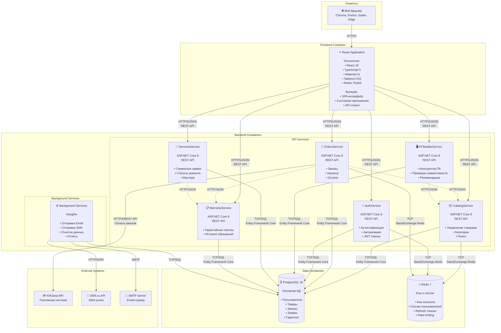

# Архитектура системы GoldPC

## 📋 Обзор

**GoldPC** — веб-приложение для компьютерного магазина с сервисным центром. Система построена на микросервисной архитектуре с использованием ASP.NET Core 8 на бэкенде и React 18 на фронтенде.

### Технологический стек

| Слой | Технологии |
|------|------------|
| **Frontend** | React 18, TypeScript 5, Vite 8, Redux Toolkit, Material-UI |
| **Backend** | ASP.NET Core 8, Entity Framework Core 8, C# 12 |
| **Database** | PostgreSQL 16, Redis 7 |
| **Auth** | JWT Bearer (access + refresh tokens) |
| **Infrastructure** | Docker, Nginx, Hangfire |

---

## 🗺️ C4 Model: Context Diagram (Level 1)

Диаграмма контекста показывает систему в окружении внешних сущностей и пользователей.

```mermaid
graph TB
    subgraph "Внешние пользователи"
        Client[👤 Клиент<br/>Веб-браузер]
        Manager[👔 Менеджер<br/>Веб-браузер]
        Master[🔧 Мастер<br/>Веб-браузер]
        Admin[⚙️ Администратор<br/>Веб-браузер]
        Accountant[📊 Бухгалтер<br/>Веб-браузер]
    end
    
    subgraph "Система GoldPC"
        System[🖥️ GoldPC System<br/><br/>Веб-приложение для компьютерного<br/>магазина с сервисным центром<br/><br/>Функции:<br/>• Каталог товаров<br/>• Конструктор ПК<br/>• Заказы и оплата<br/>• Сервисный центр<br/>• Гарантийное обслуживание]
    end
    
    subgraph "Внешние системы"
        Payment[💳 Платёжная система<br/>ЮKassa]
        SMS[📱 SMS-шлюз<br/>SMS.ru]
        Email[📧 Email-сервер<br/>SMTP]
        Backup[💾 Резервное копирование<br/>S3/NAS]
    end
    
    Client -->|HTTPS/JSON<br/>Просмотр каталога<br/>Оформление заказов| System
    Manager -->|HTTPS/JSON<br/>Управление заказами<br/>Управление каталогом| System
    Master -->|HTTPS/JSON<br/>Управление заявками<br/>Ремонт техники| System
    Admin -->|HTTPS/JSON<br/>Управление пользователями<br/>Мониторинг системы| System
    Accountant -->|HTTPS/JSON<br/>Финансовые отчёты| System
    
    System -->|HTTPS/REST API<br/>Оплата заказов| Payment
    System -->|HTTPS/REST API<br/>SMS-уведомления| SMS
    System -->|SMTP<br/>Email-уведомления| Email
    System -->|HTTPS/S3 API<br/>Резервные копии| Backup
    
    System -->[(🗄️ PostgreSQL<br/>База данных)]
    System -->[(⚡ Redis<br/>Кэш)]
```

### Пользователи системы

| Роль | Описание | Основные функции |
|------|----------|------------------|
| **Клиент** | Неавторизованный/авторизованный пользователь | Просмотр каталога, конструктор ПК, оформление заказов, отслеживание гарантий |
| **Менеджер** | Сотрудник магазина | Обработка заказов, управление каталогом, общение с клиентами |
| **Мастер** | Технический специалист | Выполнение ремонтных работ, обновление статусов заявок |
| **Администратор** | Системный администратор | Управление пользователями, справочниками, мониторинг |
| **Бухгалтер** | Финансовый сотрудник | Формирование финансовых отчётов |

---

## 📦 C4 Model: Container Diagram (Level 2)

Диаграмма контейнеров показывает высокоуровневую архитектуру системы и взаимодействие между контейнерами.



---

## 🔧 Микросервисы

### CatalogService

**Назначение:** Управление каталогом товаров, категориями и производителями.

| Аспект | Детали |
|--------|--------|
| **Порт** | 5001 |
| **Технологии** | ASP.NET Core 8, EF Core 8, PostgreSQL |
| **Ответственность** | CRUD товаров, категории, производители, поиск, инвентарь |

**Основные функции:**
- 📦 Управление товарами (CRUD операции)
- 📁 Иерархия категорий (дерево категорий)
- 🏭 Управление производителями
- 🔍 Полнотекстовый поиск по каталогу
- 📊 Управление остатками на складе
- ⭐ Отзывы и рейтинги товаров

**API Endpoints:**
```
GET    /api/v1/products           # Список товаров с пагинацией
GET    /api/v1/products/{id}      # Детали товара
POST   /api/v1/products           # Создание товара (Manager+)
PUT    /api/v1/products/{id}      # Обновление товара (Manager+)
DELETE /api/v1/products/{id}      # Удаление товара (Manager+)
GET    /api/v1/products/search    # Поиск по каталогу
GET    /api/v1/categories         # Дерево категорий
GET    /api/v1/manufacturers      # Список производителей
```

---

### OrdersService

**Назначение:** Управление заказами, корзиной и оплатой.

| Аспект | Детали |
|--------|--------|
| **Порт** | 5002 |
| **Технологии** | ASP.NET Core 8, EF Core 8, PostgreSQL, Redis |
| **Ответственность** | Заказы, корзина, оплата, история заказов |

**Основные функции:**
- 🛒 Корзина покупок (анонимная + авторизованная)
- 📦 Создание и отслеживание заказов
- 💳 Интеграция с платёжной системой (ЮKassa)
- 📊 История заказов пользователя
- 🔄 Смена статусов заказа
- 📧 Уведомления о статусе заказа

**Статусы заказа:**
```
New → Processing → Paid → Ready → Completed
                  ↓
               Cancelled
```

**API Endpoints:**
```
GET    /api/v1/orders             # Список заказов пользователя
GET    /api/v1/orders/{id}        # Детали заказа
POST   /api/v1/orders             # Создание заказа
PUT    /api/v1/orders/{id}/status # Изменение статуса (Manager+)
GET    /api/v1/cart               # Текущая корзина
POST   /api/v1/cart/items         # Добавление в корзину
DELETE /api/v1/cart/items/{id}    # Удаление из корзины
POST   /api/v1/checkout           # Оформление заказа
```

---

### AuthService

**Назначение:** Аутентификация и авторизация пользователей.

| Аспект | Детали |
|--------|--------|
| **Порт** | 5003 |
| **Технологии** | ASP.NET Core 8, EF Core 8, PostgreSQL, Redis, JWT |
| **Ответственность** | Регистрация, вход, JWT токены, управление пользователями |

**Основные функции:**
- 🔐 Регистрация новых пользователей
- 🚪 Аутентификация (email + пароль)
- 🎫 Генерация и валидация JWT токенов
- 🔄 Refresh токены (7 дней)
- 👥 Управление ролями пользователей
- 🔒 Хеширование паролей (bcrypt)

**Роли пользователей:**
| Роль | Права доступа |
|------|---------------|
| `Client` | Просмотр каталога, оформление заказов |
| `Manager` | Управление заказами и каталогом |
| `Master` | Сервисные заявки и ремонт |
| `Admin` | Полный доступ к системе |
| `Accountant` | Финансовые отчёты |

**API Endpoints:**
```
POST   /api/v1/auth/register      # Регистрация
POST   /api/v1/auth/login         # Вход
POST   /api/v1/auth/refresh       # Обновление токена
POST   /api/v1/auth/logout        # Выход
GET    /api/v1/users/me           # Профиль пользователя
PUT    /api/v1/users/me           # Обновление профиля
GET    /api/v1/users              # Список пользователей (Admin+)
```

---

### PCBuilderService

**Назначение:** Конструктор ПК с проверкой совместимости компонентов.

| Аспект | Детали |
|--------|--------|
| **Порт** | 5004 |
| **Технологии** | ASP.NET Core 8, EF Core 8, PostgreSQL |
| **Ответственность** | Конфигурации ПК, совместимость, рекомендации |

**Основные функции:**
- 🖥️ Создание конфигураций ПК
- ✅ Проверка совместимости компонентов
- 💡 Рекомендации по комплектующим
- 💰 Расчёт стоимости сборки
- 📋 Сохранение конфигураций

**API Endpoints:**
```
POST   /api/v1/builder/validate   # Проверка совместимости
POST   /api/v1/builder/calculate  # Расчёт стоимости
GET    /api/v1/builder/recommend  # Рекомендации компонентов
POST   /api/v1/configurations     # Сохранить конфигурацию
GET    /api/v1/configurations     # Список конфигураций пользователя
```

---

### ServicesService

**Назначение:** Управление сервисным центром и заявками на ремонт.

| Аспект | Детали |
|--------|--------|
| **Порт** | 5005 |
| **Технологии** | ASP.NET Core 8, EF Core 8, PostgreSQL |
| **Ответственность** | Сервисные заявки, статусы ремонта, мастера |

**Основные функции:**
- 🔧 Создание сервисных заявок
- 📊 Отслеживание статуса ремонта
- 👨‍🔧 Назначение мастеров
- 💰 Расчёт стоимости работ
- 📝 История обслуживания

**Статусы заявки:**
```
New → InProgress → WaitingForParts → Completed → Closed
                       ↓
                    Cancelled
```

**API Endpoints:**
```
GET    /api/v1/services           # Список услуг
GET    /api/v1/requests           # Список заявок
POST   /api/v1/requests           # Создание заявки
GET    /api/v1/requests/{id}      # Детали заявки
PUT    /api/v1/requests/{id}/status # Изменение статуса
PUT    /api/v1/requests/{id}/assign # Назначение мастера
```

---

### WarrantyService

**Назначение:** Управление гарантийными талонами.

| Аспект | Детали |
|--------|--------|
| **Порт** | 5006 |
| **Технологии** | ASP.NET Core 8, EF Core 8, PostgreSQL |
| **Ответственность** | Гарантийные талоны, история обращений |

**Основные функции:**
- 📋 Создание гарантийных талонов
- 🔍 Проверка гарантии по номеру
- 📅 Отслеживание срока действия
- ❌ Аннулирование гарантии
- 📊 История гарантийных обращений

**API Endpoints:**
```
GET    /api/v1/warranties         # Список гарантий пользователя
GET    /api/v1/warranties/{id}    # Детали гарантии
GET    /api/v1/warranties/check/{number} # Проверка по номеру
POST   /api/v1/warranties         # Создание гарантии
PUT    /api/v1/warranties/{id}/annul # Аннулирование
```

---

## Ключевые архитектурные решения

### REST/OpenAPI
- **Решение:** Использовать REST/JSON для синхронного API
- **Обоснование:** Простота, HTTP-кэширование, Swagger UI из коробки
- **Альтернативы:** GraphQL, gRPC — отклонены как избыточные

### PostgreSQL 16
- **Решение:** PostgreSQL как основная СУБД
- **Обоснование:** JSONB для спецификаций товаров, полнотекстовый поиск, ACID, бесплатная лицензия
- **Альтернативы:** SQL Server (лицензия), MySQL (меньше возможностей)

### React 18 + Vite
- **Решение:** React 18 + Vite + TypeScript
- **Обоснование:** Компонентный подход, быстрая сборка, типобезопасность
- **Альтернативы:** Vue, Angular, Svelte — отклонены из-зa отсутствия опыта

### JWT Authentication
- **Решение:** JWT с refresh-токенами (access: 15 мин, refresh: 7 дней)
- **Обоснование:** Stateless, стандарт, интеграция с ASP.NET Core, RBAC через claims
- **Альтернативы:** Session-based (не масштабируется), OAuth/OIDC (избыточно)

### Docker-контейнеризация
- **Решение:** Docker + docker compose для локальной разработки
- **Обоснование:** Воспроизводимое окружение, изоляция сервисов
- **Альтернативы:** bare-metal, Kubernetes — избыточно для диплома

---

## Структура проекта

```
GoldPC/
├── docs/                     # Документация
│   ├── api.md               # API reference
│   ├── architecture-ovеrview. md # Обзор архитектуры
│   ├── scripts-reference.md  # Справка по скриптам
│   └── ТЗ_GoldPC. md         # Техническое задание
├── src/                     # Исходный код
│   ├── frontend/            # React-приложение
│   ├── AuthService/        # Аутентификация
│   ├── CatalogService/     # Каталог товаров
│   ├── OrdersService/     # Заказы и корзина
│   ├── PCBuilderService/   # Конструктор ПК
│   ├── ServicesService/    # Сервисный центр
│   ├── WarrantyService/   # Гарантийное обслуживание
│   └── Shared/           # Общие компоненты
├── tests/                  # Тесты
├── docker/                # Docker-конфигурации
└── scripts/              # Скрипты разработки
```

---

## Связанные документы

- [API Reference](./api. md) — все endpoints
- [Scripts Reference](./scripts-reference. md) — справка по скриптам
- [ТЗ GoldPC](./ТЗ_ GoldPC. md) — техническое задание

---

*Документ обновлён: 2026-05-01*
