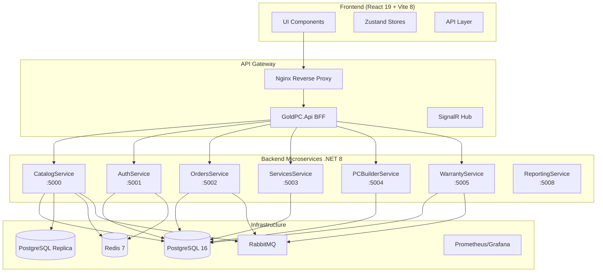
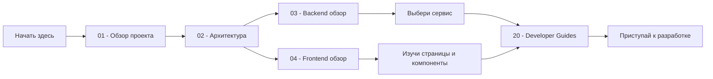

# 🏛️ GoldPC — Главный индекс документации

> **Внутренняя база знаний проекта GoldPC**
> Версия: 1.0 | Последнее обновление: 2026-05-24

---

## 📋 О проекте

**GoldPC** — веб-приложение для компьютерного магазина с сервисным центром. Платформа объединяет интернет-магазин комплектующих, онлайн-конструктор ПК и систему управления сервисным центром. Проект разработан в рамках курсовой работы.

- **Заказчик/Автор**: Кажуро Глеб, группа Т-393
- **Учебное заведение**: Колледж Бизнеса и Права, г. Минск
- **Тип**: Microservices + SPA (Full-stack)

---

## 🗺️ Архитектурная карта

---

## 📚 Быстрая навигация по разделам

| Раздел | Описание |
|--------|----------|
| [[01_Overview/Обзор_проекта\|01 — Обзор проекта]] | Цели, задачи, ключевые возможности |
| [[02_Architecture/Архитектура_системы\|02 — Архитектура]] | Общая архитектура, паттерны, диаграммы |
| [[03_Backend/Обзор_бэкенда\|03 — Backend]] | Все микросервисы .NET 8 |
| [[04_Frontend/Обзор_фронтенда\|04 — Frontend]] | React 19, Vite 8, Tailwind v4 |
| [[05_Database/Обзор_БД\|05 — Database]] | PostgreSQL, схемы, миграции |
| [[06_APIs/Обзор_API\|06 — APIs]] | REST, gRPC, WebSocket контракты |
| [[07_Infra_DevOps/Обзор_инфраструктуры\|07 — Инфраструктура]] | Docker, CI/CD, Nginx |
| [[08_Security/Обзор_безопасности\|08 — Security]] | JWT, RBAC, шифрование, 2FA |
| [[09_Auth/Обзор_аутентификации\|09 — Auth]] | Регистрация, логин, OIDC |
| [[10_Business_Logic/Обзор_бизнес_логики\|10 — Бизнес-логика]] | Заказы, ПК-конструктор, гарантии, сервисные заявки |
| [[10_Business_Logic/Жизненный_цикл_заказа\|10a — FSM Заказа]] | Order lifecycle, статусы, переходы, уведомления |
| [[10_Business_Logic/Жизненный_цикл_заявки_СЦ\|10b — FSM Заявки СЦ]] | Service request lifecycle, ремонт |
| [[10_Business_Logic/Конструктор_ПК_и_совместимость\|10c — PC Builder]] | Совместимость, FPS, правила JSON |
| [[11_Integrations/Обзор_интеграций\|11 — Интеграции]] | Stripe, SMTP, SMS, X-Core, 1С |
| [[11_Integrations/Stripe_интеграция\|11a — Stripe]] | Платежи, вебхуки, симулятор |
| [[11_Integrations/X_Core_скрапинг\|11b — X-Core]] | Импорт товаров, пайплайн |
| [[11_Integrations/Email_уведомления\|11c — Email]] | SMTP, Handlebars шаблоны |
| [[12_AI_Modules/Обзор_AI_модулей\|12 — AI Модули]] | OpenCode, AGENTS.md, Neuroslop, контекст |
| [[13_Workflows/Обзор_воркфлоу\|13 — Workflows]] | GitHub Actions, Quality Gate, Security, Rollback |
| [[14_Queues_Events/Обзор_очередей_событий\|14 — Очереди и события]] | RabbitMQ, MassTransit, Outbox, Event Flow |
| [[14_Queues_Events/MassTransit_настройка\|14a — MassTransit]] | Конфигурация, контракты, статус |
| [[15_Deployments/Обзор_деплоя\|15 — Deployments]] | Blue-Green, стратегии |
| [[16_Config_ENV/Обзор_конфигурации\|16 — Config & ENV]] | Переменные окружения, конфиги |
| [[17_Tests/Обзор_тестирования\|17 — Tests]] | Unit, Integration, E2E, Mutation |
| [[18_Monitoring/Обзор_мониторинга\|18 — Monitoring]] | Prometheus, Grafana, Sentry |
| [[19_Tech_Debt/Обзор_техдолга\|19 — Tech Debt]] | Слабые места, риски, TODO |
| [[20_Developer_Guides/Обзор_гайдов\|20 — Developer Guides]] | Онбординг, гайды |
| [[21_Runbooks/Обзор_рунбуков\|21 — Runbooks]] | Операционные процедуры |
| [[22_Glossary/Глоссарий\|22 — Glossary]] | Термины и определения |
| [[23_Diagrams/Обзор_диаграмм\|23 — Diagrams]] | Полные Mermaid-диаграммы |

---

## 🚀 Онбординг-флоу

---

## 🔗 Ключевые связи между разделами

- **[[03_Backend/Сервис_каталога_CatalogService|CatalogService]]** ↔ **[[04_Frontend/Каталог_и_фильтрация|Каталог]]** — REST API
- **[[03_Backend/Сервис_аутентификации_AuthService|AuthService]]** ↔ **[[04_Frontend/Структура_роутинга#Аутентификация|Auth UI]]** — JWT токены
- **[[03_Backend/Сервис_заказов_OrdersService|OrdersService]]** ↔ **[[11_Integrations/Stripe_интеграция|Stripe]]** — Webhook
- **[[03_Backend/Сервис_ПК_конструктора_PCBuilderService|PCBuilderService]]** → **[[03_Backend/Сервис_каталога_CatalogService|CatalogService]]** — HTTP/gRPC клиент
- **[[03_Backend/Сервис_гарантии_WarrantyService|WarrantyService]]** → **[[14_Queues_Events/MassTransit_настройка|MassTransit]]** — OrderPlacedEvent
- **[[05_Database/Схема_БД|База данных]]** → **[[03_Backend/Обзор_бэкенда|Все сервисы]]** — PostgreSQL

---

## 📊 Статистика проекта

| Метрика | Значение |
|---------|----------|
| Микросервисов | 7 (.NET 8) |
| Фронтенд | React 19 + Vite 8 + Tailwind v4 |
| БД | PostgreSQL 16 + Redis 7 |
| CI/CD workflows | 10 GitHub Actions |
| Docker контейнеров | 9+ (dev), 18+ (prod) |
| Язык | C# 12, TypeScript 5+ |
| Тестов | Unit + Integration + E2E + Contract + Mutation |
| API стиль | REST + gRPC + WebSocket (SignalR) |

---

## 👤 Команда

| Имя | Роль |
|-----|------|
| **Кажуро Глеб** | Разработчик (Full-stack) |

---

> 🔗 **Связанные страницы**: [[01_Overview/Обзор_проекта]] | [[02_Architecture/Архитектура_системы]] | [[20_Developer_Guides/Как_поднять_проект]]
