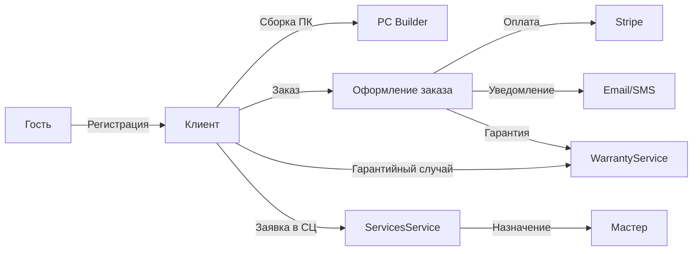

# Обзор проекта GoldPC

> **Дата**: 2026-05-24 | **Статус**: Активная разработка

---

## Краткое описание

**GoldPC** — комплексная информационная система для автоматизации деятельности компьютерного магазина и сервисного центра. Проект объединяет полнофункциональный интернет-магазин с каталогом компьютерных комплектующих, интерактивный конструктор ПК с проверкой совместимости, систему управления сервисным центром и гарантийного учёта.

---

## Назначение

Система предназначена для:
- **Покупателей**: просмотр каталога, сборка ПК онлайн, оформление заказов
- **Менеджеров**: управление товарами, обработка заказов
- **Мастеров**: выполнение ремонтных работ, управление заявками
- **Администраторов**: полный контроль над системой
- **Бухгалтеров**: финансовые отчёты

---

## Ключевые возможности

### 🛒 E-commerce
- Полнофункциональный интернет-магазин с каталогом товаров
- Фильтрация по категориям, производителям, цене, характеристикам
- Фасетная навигация с подсчетом результатов
- Корзина и оформление заказов
- Оплата через Stripe

### 🔧 PC Builder
- Интерактивный конструктор ПК
- Выбор назначения сборки (игровой, офисный, рабочая станция)
- Автоматическая проверка совместимости комплектующих:
  - Сокет процессора и материнской платы
  - Тип и частота оперативной памяти
  - Мощность блока питания
  - Форм-фактор корпуса
  - Совместимость кулера
- Предупреждения о несовместимости
- Расчёт FPS для игровых сборок
- Расчёт итоговой стоимости

### 🛠️ Сервисный центр
- Заявки на ремонт, диагностику, сборку
- Жизненный цикл заявки (5+ статусов)
- Назначение мастеров
- Отслеживание статуса работ
- Учёт использованных запчастей

### 📋 Гарантийный учёт
- Автоматическое создание гарантийных талонов (12 мес.)
- Проверка срока действия гарантии
- Учёт гарантийных случаев
- Уведомления об истекающей гарантии (за 30 дней)

### 🛡️ Безопасность
- JWT-аутентификация (симметричный ключ dev / Keycloak OIDC prod)
- 2FA через TOTP (HMAC-SHA1)
- Блокировка аккаунта после 5 неудачных попыток
- Валидация паролей (Levenshtein distance для common passwords)
- Защита от перечисления email (ForgotPassword всегда 200)

---

## Технический стек

| Компонент | Технология | Версия |
|-----------|------------|--------|
| **Backend** | ASP.NET Core | 8.0 |
| **Frontend** | React + TypeScript | 19 |
| **Бандлер** | Vite | 8 |
| **CSS** | Tailwind CSS | 4 |
| **State Manager** | Zustand | — |
| **Server State** | TanStack Query | — |
| **БД основная** | PostgreSQL | 16 |
| **Кэш** | Redis | 7 |
| **Брокер сообщений** | RabbitMQ | 3 (management) |
| **API Gateway** | Nginx / YARP (BFF) | — |
| **Контейнеры** | Docker + Docker Compose | — |
| **CI/CD** | GitHub Actions | — |
| **Мониторинг** | Prometheus + Grafana | — |
| **Трейсинг** | Jaeger (OpenTelemetry) | — |
| **Платежи** | Stripe | — |
| **Email** | SMTP (Gmail) / MailKit | — |
| **SMS** | SMS.ru / Twilio | — |

---

## Структура репозитория

```
GoldPC/
├── src/                       # Исходный код
│   ├── AuthService/           # Аутентификация (JWT, 2FA, users)
│   ├── CatalogService/        # Каталог товаров (REST + gRPC)
│   ├── OrdersService/         # Заказы (Stripe, промокоды)
│   ├── PCBuilderService/      # Конструктор ПК (совместимость, FPS)
│   ├── ServicesService/       # Сервисный центр (заявки)
│   ├── WarrantyService/       # Гарантии (карты, претензии)
│   ├── ReportingService/      # Отчёты (postgres_fdw)
│   ├── Shared/                # Общие библиотеки (middleware, proto)
│   ├── SharedKernel/          # DTO, Enums, Events, Base entities
│   ├── frontend/              # React SPA
│   └── backend/               # API Gateway (YARP)
├── docker/                    # Docker config
├── docs/                      # Документация
├── scripts/                   # Скрипты (scraper, seed, deploy)
├── tests/                     # Тесты
├── contracts/                 # OpenAPI контракты
├── .github/                   # GitHub Actions + templates
└── infrastructure/            # Инфраструктура (планируется)
```

---

## Ролевая модель

| Роль | Описание |
|------|----------|
| **Гость** | Просмотр каталога и конструктора |
| **Клиент (Client)** | Оформление заказов и заявок |
| **Менеджер (Manager)** | Обработка заказов, управление товарами |
| **Мастер (Master)** | Выполнение ремонтных работ |
| **Администратор (Admin)** | Полный доступ к системе |
| **Бухгалтер (Accountant)** | Финансовые отчёты |

---

## Ключевые бизнес-потоки



---

## Типы архитектурных паттернов

| Паттерн | Где используется |
|---------|-----------------|
| **CQRS** | CatalogService (Read/Write DbContext) |
| **Outbox** | OrdersService (отключен) |
| **Event-Driven** | MassTransit + RabbitMQ (WarrantyService) |
| **Repository** | CatalogService, AuthService |
| **gRPC** | CatalogService → OrdersService |
| **BFF** | GoldPC.Api (YARP) |
| **Saga** | Не реализован (планируется?) |
| **Blue-Green** | Production deployment |

---

## Связанные страницы

- [[02_Architecture/Архитектура_системы]] — детальная архитектура
- [[20_Developer_Guides/Как_поднять_проект]] — быстрый старт
- [[22_Glossary/Глоссарий]] — термины
- [[03_Backend/Обзор_бэкенда]] — backend сервисы
- [[04_Frontend/Обзор_фронтенда]] — frontend приложение
- [[19_Tech_Debt/Обзор_техдолга]] — известные проблемы
