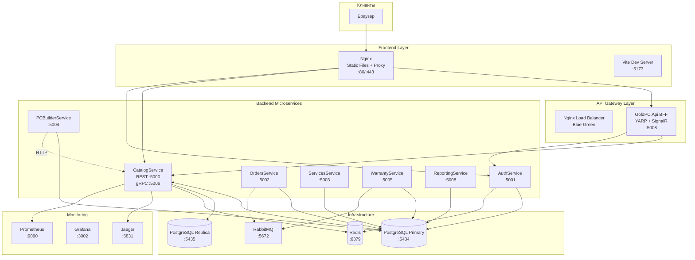
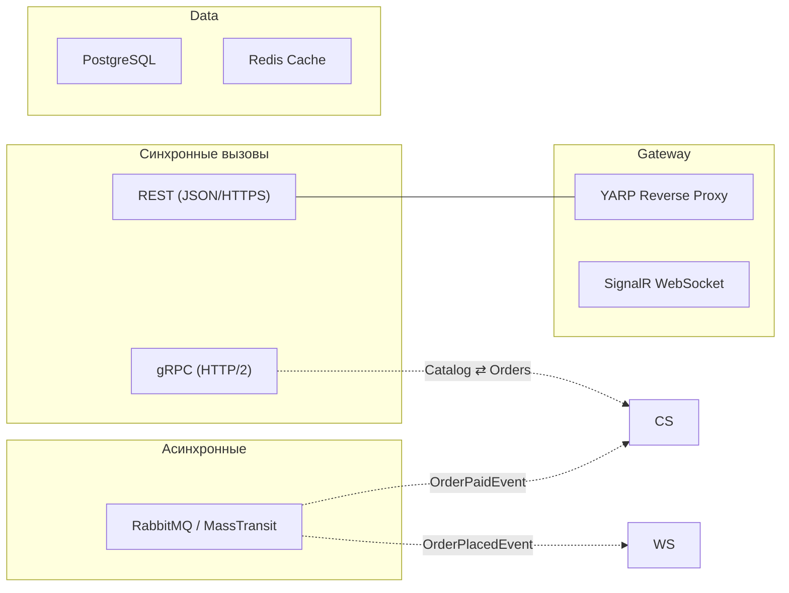
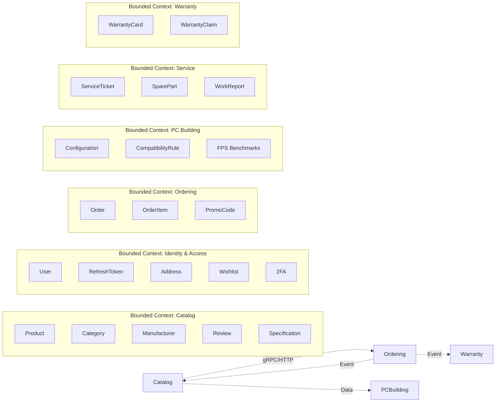
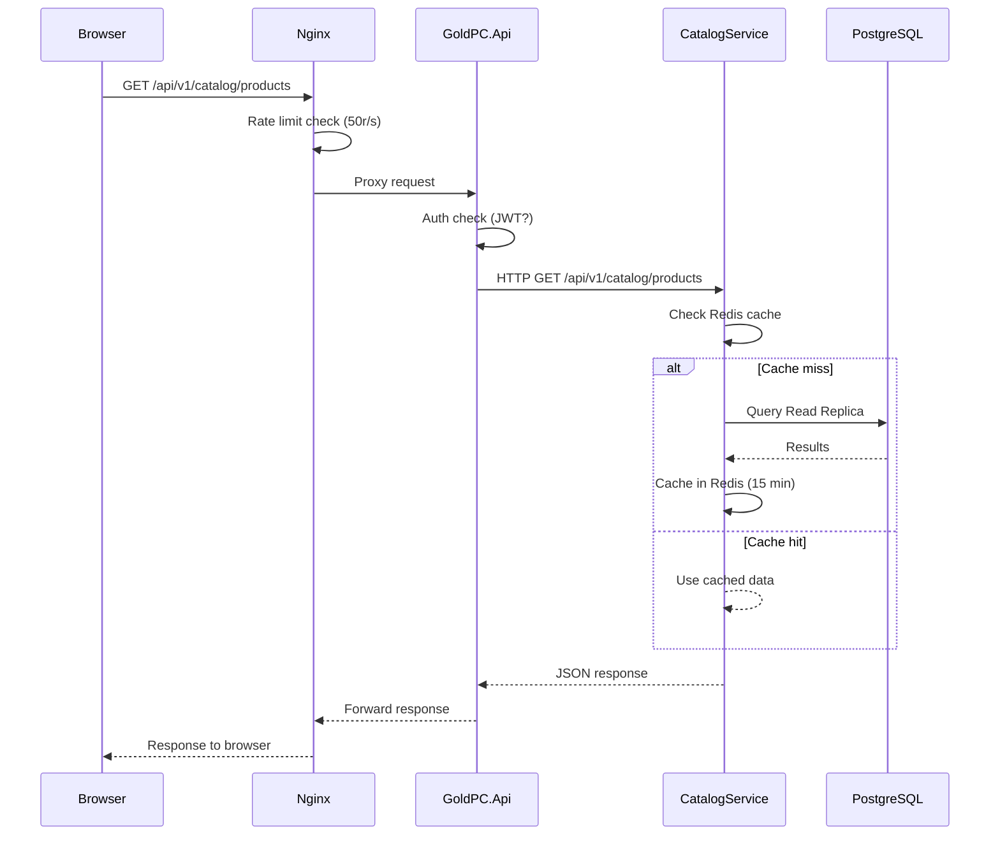

# Архитектура системы GoldPC

> **Раздел**: 02_Architecture
> **Статус**: Актуально

---

## Краткое описание

GoldPC построен по микросервисной архитектуре с разделением на 7 backend-сервисов (.NET 8) и Single Page Application на React 19. API Gateway гибридный: Nginx как reverse proxy / load balancer и YARP как BFF (Backend for Frontend).

---

## Назначение

Микросервисная архитектура выбрана для:
- Масштабирования отдельных доменов (каталог, заказы, пользователи)
- Изоляции отказов (сбой одного сервиса не валит весь сайт)
- Независимого деплоя сервисов
- Чётких границ доменов (DDD)

---

## Архитектурная диаграмма высокого уровня

---

## Коммуникационные паттерны

---

## Межсервисное взаимодействие

| От | К | Протокол | Описание |
|----|----|----------|----------|
| **Frontend** | Nginx | HTTP/HTTPS | Статика (build), прокси |
| **Nginx** | BFF | HTTP | Reverse proxy |
| **BFF** | Catalog | HTTP | Product data |
| **BFF** | Auth | HTTP | Login, profile |
| **BFF** | Orders | HTTP | Order CRUD |
| **BFF** | Services | HTTP | Service tickets |
| **BFF** | PCBuilder | HTTP | PC configs |
| **BFF** | Warranty | HTTP | Warranty check |
| **PCBuilder** | Catalog | HTTP | Component data |
| **Orders** | Catalog | gRPC (planned) | Stock reserve |
| **Warranty** | RabbitMQ | MassTransit | OrderPlacedEvent |
| **Catalog** | RabbitMQ | MassTransit⁽¹⁾ | OrderPlaced, OrderPaid |

> ⁽¹⁾ MassTransit в CatalogService и OrdersService ВРЕМЕННО ОТКЛЮЧЕН

---

## DDD и границы контекстов

---

## Key Architectural Decisions

### 1. Разделение Read/Write (CQRS) в CatalogService
- **Почему**: Рост нагрузки на чтение (каталог — самый посещаемый раздел)
- **Как**: Два DbContext — `CatalogDbContext` (write) и `ReadOnlyCatalogDbContext` (read, NoTracking)
- **БД**: Write → Primary (5434), Read → Replica (5435)

### 2. Blue-Green Deployment
- **Почему**: Zero-downtime деплой, быстрое переключение при проблемах
- **Как**: Nginx upstream.conf переключается между blue(:5001) и green(:5011)
- **Автоматизация**: GitHub Actions rollback workflow

### 3. gRPC для межсервисного взаимодействия
- **Почему**: Высокая производительность, строгая типизация (protobuf)
- **Где**: CatalogService (:5006) — ReserveStock, ReleaseStock, GetProduct
- **Статус**: Реализован, но PCBuilder пока использует HTTP

### 4. MassTransit + RabbitMQ для событий
- **Почему**: Асинхронное распространение событий между слабо связанными сервисами
- **События**: `OrderPlacedEvent`, `OrderPaidEvent`
- **Потребители**: WarrantyService (карты гарантии), CatalogService (резервирование)
- **Статус**: Работает только в WarrantyService

### 5. JWT в Development / OIDC (Keycloak) в Production
- **Почему**: Простота разработки без Keycloak, безопасность в проде
- **Dev**: Симметричный ключ `GoldPC_SuperSecretKey_ForDevelopment_Only_2024!`
- **Prod**: Keycloak `auth.goldpc.by` с OIDC

### 6. Stripe для платежей
- **Почему**: Популярный платёжный провайдер с webhook-уведомлениями
- **Интеграция**: Webhook на `POST /api/v1/webhooks/stripe`

---

## Порты сервисов

| Сервис | Dev | Prod Blue | Prod Green |
|--------|-----|-----------|------------|
| CatalogService (REST) | 5000 | 5001 | 5011 |
| AuthService | 5001 | 5003 | 5013 |
| OrdersService | 5002 | 5004 | 5014 |
| ServicesService | 5003 | 5005 | 5015 |
| PCBuilderService | 5004 | 5002 | 5012 |
| WarrantyService | 5005 | 5006 | 5016 |
| CatalogService (gRPC) | 5006 | — | — |
| ReportingService | 5008 | 5008 | 5018 |
| GoldPC.Api (BFF) | 5008 | — | — |
| Frontend | 5173 / 3002 | 3000 / 3001 | 3000 / 3001 |
| PostgreSQL | 5434 | 5432 | 5432 |
| Redis | 6379 | 6379 | 6379 |

---

## Поток запроса (Request Lifecycle)

---

## Связанные страницы

- [[01_Overview/Обзор_проекта]] — общий обзор
- [[03_Backend/Обзор_бэкенда]] — backend сервисы
- [[04_Frontend/Обзор_фронтенда]] — frontend
- [[05_Database/Обзор_БД]] — база данных
- [[07_Infra_DevOps/Обзор_инфраструктуры]] — инфраструктура
- [[23_Diagrams/Полная_архитектурная_диаграмма]]
- [[19_Tech_Debt/Архитектурные_проблемы]] — известные проблемы
