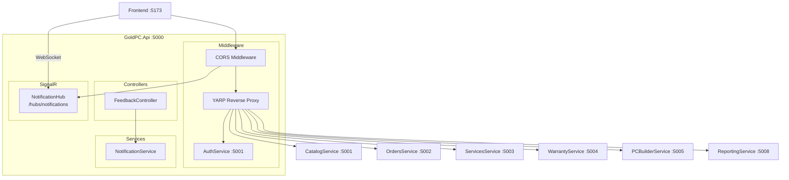

# API Gateway (GoldPC.Api)

## Краткое описание

GoldPC.Api — BFF (Backend For Frontend) на YARP Reverse Proxy, выполняющий роль единой точки входа для фронтенда. Обеспечивает маршрутизацию к микросервисам, SignalR-уведомления и приём обратной связи.

## Назначение

- Единая точка входа для фронтенда (React SPA)
- Reverse Proxy к микросервисам (YARP)
- SignalR Hub для real-time уведомлений
- Приём и обработка обратной связи от пользователей
- CORS-политика для фронтенда

## Где используется

- Фронтенд (все запросы к API)
- Микросервисы (как цель прокси)
- Административная панель

## Архитектура



**Примечание**: В текущей конфигурации YARP не настроен программно — BFF только добавляет SignalR Hub и FeedbackController. Маршрутизация, вероятно, выполняется на уровне инфраструктуры (Docker/k8s или appsettings).

## Контроллеры и Endpoints

### FeedbackController

| Endpoint | Метод | Описание |
|----------|-------|----------|
| `/api/feedback` | POST | Отправить обратную связь |

Обрабатывает обращения пользователей (жалобы, предложения, вопросы) и отправляет уведомления через `INotificationService`.

### Health

| Endpoint | Метод | Описание |
|----------|-------|----------|
| `/health` | GET | Проверка здоровья |

## SignalR Hub

**NotificationHub** (`/hubs/notifications`):

- Real-time уведомления для подключённых клиентов
- Использует SignalR with WebSocket transport
- CORS: только `http://localhost:3000`, `https://localhost:5001`

```csharp
app.MapHub<NotificationHub>("/hubs/notifications");
```

### Пример подключения (JavaScript)

```javascript
const connection = new signalR.HubConnectionBuilder()
    .withUrl("http://localhost:5000/hubs/notifications")
    .build();

connection.on("ReceiveNotification", (message) => {
    console.log("Notification:", message);
});

await connection.start();
```

## CORS

Настроена политика `AllowAll`:

- Разрешённые источники: `http://localhost:3000`, `https://localhost:5001`
- Разрешены любые заголовки и методы
- Поддержка credentials (для SignalR)

## Зависимости

- **Shared** — Services (INotificationService, NotificationService)
- **YARP** — Reverse Proxy (через пакет Microsoft ReverseProxy)

## Связанные модули

- [[Обзор_бэкенда]] — все микросервисы
- [[../04_Frontend/Обзор_фронтенда]] — потребитель API

## Основные файлы

| Файл | Назначение |
|------|-----------|
| `src/backend/GoldPC.Api/Program.cs` | Точка входа (51 строка) |
| `src/backend/GoldPC.Api/Controllers/FeedbackController.cs` | Обратная связь |
| `src/backend/GoldPC.Api/Hubs/NotificationHub.cs` | SignalR Hub |
| `src/backend/GoldPC.Api/Services/NotificationService.cs` | Сервис уведомлений |

## Примеры кода

### Отправка обратной связи

```http
POST /api/feedback
Content-Type: application/json

{
  "name": "Иван Петров",
  "email": "ivan@example.com",
  "subject": "Предложение по улучшению",
  "message": "Хотелось бы видеть больше товаров категории 'Мониторы'."
}
```

## Потенциальные проблемы

1. **Нет YARP конфигурации** — Reverse Proxy не настроен в коде, маршруты не указаны
2. **Не настроена аутентификация** — `UseAuthentication()` есть, но `AddAuthentication()` не вызывается
3. **Мягкая CORS** — разрешены любые методы/заголовки (для Production стоит ограничить)
4. **Ограниченная функциональность** — только 1 контроллер + SignalR
5. **Нету Swagger в Production коде** — только в Development
6. **Нет распределённой трассировки** — OpenTelemetry не настроен (в отличие от CatalogService)

## Related Pages

- [[Обзор_бэкенда]]
- [[Сервис_каталога_CatalogService]]
- [[Сервис_аутентификации_AuthService]]
- [[Сервис_заказов_OrdersService]]
- [[Сервис_услуг_ServicesService]]
- [[Сервис_гарантии_WarrantyService]]
- [[Сервис_ПК_конструктора_PCBuilderService]]
- [[Сервис_отчётов_ReportingService]]
- [[Shared_SharedKernel]]
