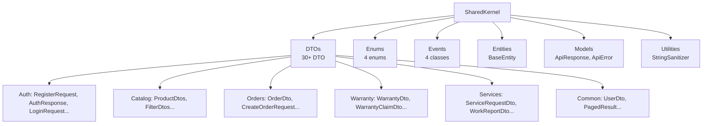
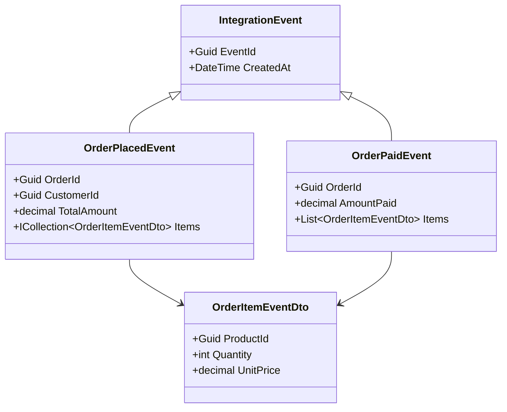
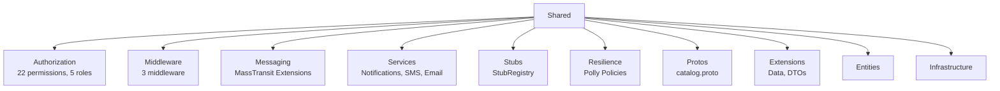
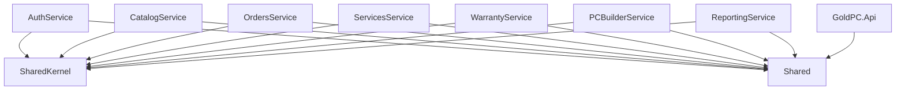

# SharedKernel и Shared

## Краткое описание

Две общие библиотеки, используемые всеми микросервисами GoldPC:

- **SharedKernel** — ядро: DTO, перечисления, события, базовые сущности, модели ответов
- **Shared** — инфраструктура: авторизация, middleware, Messaging, сервисы, утилиты, gRPC прото

## Назначение

- Единые контракты данных между сервисами
- Переиспользуемая инфраструктура (middleware, авторизация, уведомления)
- Общие enum и события для MassTransit
- gRPC протоколы для межсервисного взаимодействия

## Где используется

Все микросервисы GoldPC имеют ссылки на обе библиотеки.

## SharedKernel

### Структура



### Enums

#### OrderStatus (`GoldPC.SharedKernel.Enums`)

| Значение | Число | Описание |
|----------|-------|----------|
| New | 0 | Создан |
| Processing | 1 | В обработке |
| Paid | 2 | Оплачен |
| InProgress | 3 | В сборке/ремонте |
| Ready | 4 | Готов |
| Completed | 5 | Выдан |
| Cancelled | 6 | Отменён |

#### UserRole

| Значение | Описание |
|----------|----------|
| Client | Покупатель |
| Manager | Менеджер |
| Admin | Администратор |
| Master | Мастер |
| Employee | Сотрудник |

#### WarrantyStatus

| Значение | Число | Категория |
|----------|-------|-----------|
| Active | 0 | Талон |
| Expired | 1 | Талон |
| Annulled | 2 | Талон |
| New | 3 | Заявка |
| InProgress | 4 | Заявка |
| Resolved | 5 | Заявка |
| Rejected | 6 | Заявка |

#### ServiceRequestStatus

| Значение | Число |
|----------|-------|
| Submitted | 0 |
| InProgress | 1 |
| PartsPending | 2 |
| ReadyForPickup | 3 |
| Completed | 4 |
| Cancelled | 5 |

### Events (MassTransit)



### BaseEntity

```csharp
public abstract class BaseEntity
{
    public Guid Id { get; set; }
    public DateTime CreatedAt { get; set; } = DateTime.UtcNow;
    public DateTime? UpdatedAt { get; set; }
}
```

### DTOs (30+)

| Группа | DTO |
|--------|-----|
| Auth | RegisterRequest, LoginRequest, AuthResponse, RefreshTokenRequest, UserDto, UpdateUserRequest, ChangePasswordRequest, ForgotPasswordRequest, ResetPasswordRequest, ValidateResetTokenRequest, VerifyEmailRequest, UserAddressDto, UpdateUserAddressRequest, CreateUserAddressRequest, LoginHistoryItem, TwoFactorAuthDTOs, NotificationPreferenceDTOs |
| Catalog | ProductListDto, ProductDetailDto, CategoryDto, ManufacturerDto, CreateProductDto, UpdateProductDto, FilterAttributeDto, FilterFacetAttributeDto, ProductFilterDto, CreateReviewDto, UpdateReviewDto, ReviewDto |
| Orders | OrderDto, OrderItemDto, OrderHistoryDto, CreateOrderRequest, CreateOrderItemRequest, UpdateOrderStatusRequest, ValidatePromoCodeRequest, ValidatePromoCodeResponse, DeliveryQuoteRequest, DeliveryQuoteResponse |
| Warranty | WarrantyDto, WarrantyCheckRequest, WarrantyCheckResult, WarrantyClaimDto, CreateWarrantyRequest, CreateWarrantyClaimRequest, WarrantyOperationDto, AnnulWarrantyRequest |
| Services | ServiceRequestDto, ServicePartDto, WorkReportDto, CreateServiceRequestRequest, UpdateServiceRequestRequest, CloseServiceRequestRequest, ServiceTypeDto |

### Models

- **ApiResponse<T>** — стандартный ответ API: `{ success, data, message, errors }`
- **ApiError** — ошибка: `{ code, message, details }`
- **PagedResult<T>** — пагинированный ответ: `{ data/items, total, page, pageSize }`

### Utilities

- **StringSanitizer** — очистка строк от потенциально опасных символов

---

## Shared

### Структура



### Authorization (Permission-based)

**22 разрешения** (константы `Permissions.AllPermissions`):

```csharp
ProductsView, ProductsCreate, ProductsEdit, ProductsDelete,
OrdersView, OrdersManage, OrdersCancel, OrdersCreate,
UsersView, UsersManage, UsersViewRoles, UsersManageRoles,
ReportsView, ReportsExport, AuditView,
CategoriesView, CategoriesManage,
ServicesView, ServicesManage,
PcBuilderUse, PcBuilderManage,
WarrantyView, WarrantyManage
```

**5 ролей** (`Roles.AllRoles`):

| Роль | Описание |
|------|----------|
| Customer | Клиент (покупатель) |
| Manager | Менеджер магазина |
| Master | Мастер (ремонт/сборка) |
| Admin | Администратор |
| Employee | Сотрудник |

**Классы**: `PermissionAuthorizationHandler`, `PermissionRequirement`, `RolePermissions`, `AuthorizationServiceExtensions`

### Middleware

#### SecurityHeadersMiddleware
- Добавляет заголовки безопасности:
  - `X-Content-Type-Options: nosniff`
  - `X-Frame-Options: DENY`
  - `X-XSS-Protection: 1; mode=block`
  - `Referrer-Policy: strict-origin-when-cross-origin`
  - `X-Permitted-Cross-Domain-Policies: none`

#### CorrelationIdMiddleware
- Добавляет `X-Correlation-ID` для распределённой трассировки
- Если заголовок не передан, генерирует новый GUID

#### ChaosMiddleware
- Только Development. Внедряет случайные сбои:
  - Задержки запросов
  - Ошибки 500
  - Исключения
- Настраивается через `ChaosOptions`

### Messaging (MassTransit Extensions)

```csharp
// Extension: AddMessaging
builder.Services.AddMessaging(configuration, x =>
{
    x.AddConsumer<MyConsumer>();
});
```

Настраивает:
- RabbitMQ транспорт
- Retry
- Circuit breaker
- Обработку ошибок

### gRPC Protos

`Protos/catalog.proto` — 4 RPC:

```protobuf
service CatalogGrpc {
  rpc GetProductById (GetProductRequest) returns (ProductResponse);
  rpc GetProductsByIds (GetProductsRequest) returns (ProductsResponse);
  rpc ReserveStock (ReserveStockRequest) returns (StockResponse);
  rpc ReleaseStock (ReleaseStockRequest) returns (StockResponse);
}
```

Генерирует C# класс `CatalogGrpcClient` в namespace `Shared.Protos`.

### Services

#### Notifications
- **INotificationService** — интерфейс уведомлений
- **SmtpEmailService** — отправка email через SMTP (Gmail)
- **SmsRuService** — SMS через SMS.ru
- **CompositeNotificationService** — композит (Email + SMS)
- **ProductionNotificationService** — продакшн уведомления

#### Email
- **SmtpEmailService** — Gmail SMTP (пароль приложения)
- Handlebars шаблоны в `Templates/`

#### SMS
- **SmsRuService** — API sms.ru
- **TwilioSmsService** — Twilio API (в OrdersService)

#### Mocks
- **PaymentServiceMock** — 95% успеха, 100-1000ms задержка
- **NotificationServiceMock** — логгирование в консоль
- **WarrantyClientMock** — заглушка для WarrantyService

#### Background
- **EmailBackgroundWorker** — фоновя отправка email через очередь
- **EmailQueue** — очередь email сообщений

#### Others
- **OneCIntegrationService** — интеграция с 1С
- **WarrantyClient** — HTTP клиент для WarrantyService
- **ContractChangeNotifier** — уведомления об изменениях
- **NotificationEventHandlers** — обработчики событий уведомлений

### Resilience (Polly)

```csharp
// ResiliencePolicies.cs
// Политики повторных попыток и circuit breaker для HTTP вызовов
```

### Stubs

- **StubRegistry** — реестр заглушек
- **StubDefinition** — определение заглушки
- **StubMode** — режимы: Real, Stub, Chaos
- **StubChaosConfig** — конфигурация хаоса

### Infrastructure

- **ResiliencePolicies** — политики Polly (Retry, CircuitBreaker)
- **Data/DTOs/Extensions** — вспомогательные классы

## Зависимости



## Основные файлы

### SharedKernel

| Файл | Назначение |
|------|-----------|
| `src/SharedKernel/Enums/OrderStatus.cs` | Статусы заказа |
| `src/SharedKernel/Enums/UserRole.cs` | Роли пользователей |
| `src/SharedKernel/Enums/WarrantyStatus.cs` | Статусы гарантии |
| `src/SharedKernel/Enums/ServiceRequestStatus.cs` | Статусы заявок на услуги |
| `src/SharedKernel/Events/IntegrationEvent.cs` | Базовый класс событий |
| `src/SharedKernel/Events/OrderPlacedEvent.cs` | Событие создания заказа |
| `src/SharedKernel/Events/OrderPaidEvent.cs` | Событие оплаты заказа |
| `src/SharedKernel/Entities/BaseEntity.cs` | Базовая сущность |
| `src/SharedKernel/Models/ApiResponse.cs` | Стандартный ответ API |
| `src/SharedKernel/DTOs/` | 30+ DTO классов |
| `src/SharedKernel/Utilities/` | Утилиты |

### Shared

| Файл | Назначение |
|------|-----------|
| `src/Shared/Authorization/Permissions.cs` | 22 константы разрешений |
| `src/Shared/Authorization/Roles.cs` | 5 ролей |
| `src/Shared/Authorization/PermissionAuthorizationHandler.cs` | Handler для разрешений |
| `src/Shared/Middleware/SecurityHeadersMiddleware.cs` | Заголовки безопасности |
| `src/Shared/Middleware/CorrelationIdMiddleware.cs` | Correlation ID |
| `src/Shared/Middleware/ChaosMiddleware.cs` | Chaos engineering |
| `src/Shared/Messaging/MessagingExtensions.cs` | MassTransit настройка |
| `src/Shared/Protos/catalog.proto` | gRPC протокол каталога |
| `src/Shared/Services/SmtpEmailService.cs` | Email отправка |
| `src/Shared/Services/SmsRuService.cs` | SMS отправка |
| `src/Shared/Services/Background/EmailBackgroundWorker.cs` | Фоновая отправка email |
| `src/Shared/Stubs/StubRegistry.cs` | Реестр заглушек |
| `src/Shared/Resilience/ResiliencePolicies.cs` | Polly политики |

## Потенциальные проблемы

1. **Дублирование DTO** — некоторые DTO могут дублироваться между SharedKernel и сервисами
2. **WarrantyStatus перегружен** — содержит как статусы талонов (0-2), так и заявок (3-6)
3. **StubRegistry не используется** — похоже на незавершённую инфраструктуру тестирования
4. **Handlebars шаблоны** — `Templates/` есть в AuthService и Shared, нужно унифицировать
5. **Нет авто-регистрации** — каждый сервис вручную регистрирует свои зависимости

## Related Pages

- [[Обзор_бэкенда]]
- [[Сервис_каталога_CatalogService]]
- [[Сервис_аутентификации_AuthService]]
- [[Сервис_заказов_OrdersService]]
- [[API_Gateway]]
