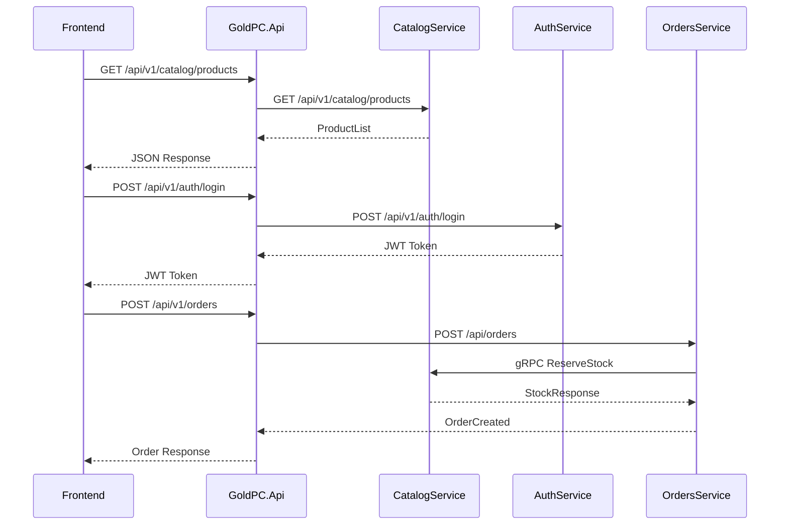
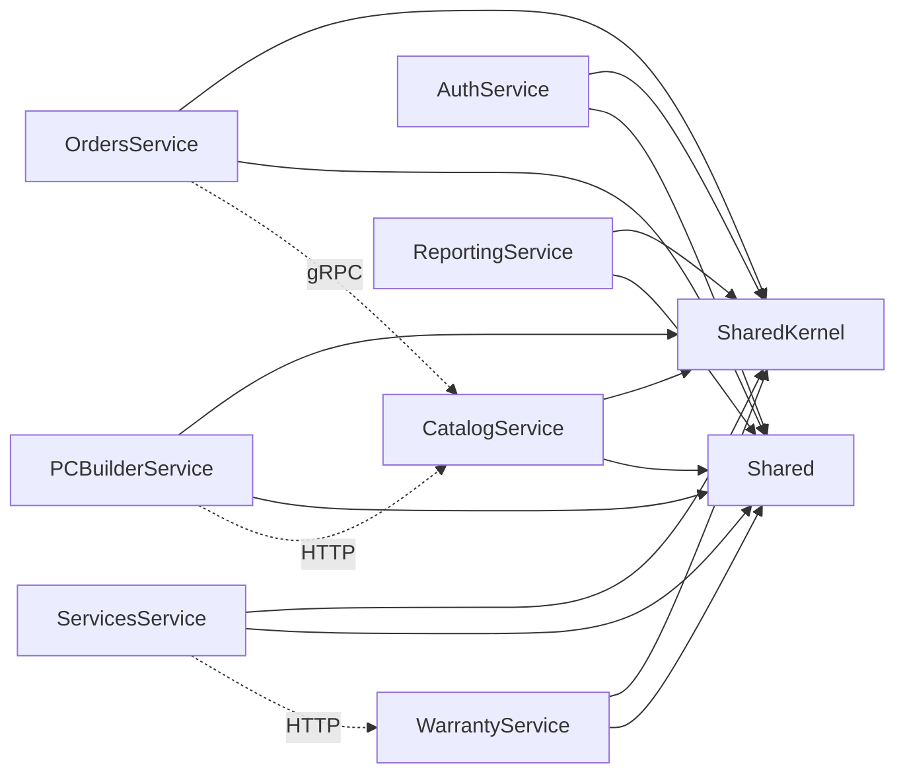

# Обзор бэкенда GoldPC

## Краткое описание

Бэкенд GoldPC построен на **микросервисной архитектуре** с использованием **ASP.NET Core 8**. Каждый микросервис отвечает за свой домен (каталог, заказы, аутентификация и т.д.) и взаимодействует с другими через **REST/gRPC** и **MassTransit/RabbitMQ** (на данный момент отключён).

## Назначение

Обеспечение единой серверной логики для интернет-магазина компьютерной техники, включая управление каталогом, заказами, пользователями, ПК-конструктором, гарантиями и сервисным обслуживанием.

## Где используется

- Фронтенд (React 19 + Vite 8) → BFF → микросервисы
- Прямые вызовы между сервисами (gRPC, HTTP)
- Административная панель
- CLI-инструменты для импорта данных

## Архитектура

```mermaid
graph TB
    subgraph "Frontend"
        REACT[React SPA :5173]
    end
    
    subgraph "API Gateway"
        BFF[GoldPC.Api :5000<br/>YARP BFF]
    end
    
    subgraph "Backend Services"
        CAT[CatalogService<br/>:5000 REST :5006 gRPC]
        AUTH[AuthService<br/>:5001]
        ORD[OrdersService<br/>:5002]
        SVC[ServicesService<br/>:5003]
        WRN[WarrantyService<br/>:5004]
        PCB[PCBuilderService<br/>:5005]
        RPT[ReportingService<br/>:5008]
    end
    
    subgraph "Infrastructure"
        PG[(PostgreSQL :5434<br/>PostgreSQL Read :5435)]
        RD[(Redis :6379)]
        RMQ[RabbitMQ :5672<br/>(Disabled)]
        JA[Jaeger :6831]
        PM[Prometheus]
    end
    
    REACT --> BFF
    BFF --> CAT
    BFF --> AUTH
    BFF --> ORD
    BFF --> SVC
    BFF --> WRN
    BFF --> PCB
    BFF --> RPT
    
    PCB -.->|HTTP| CAT
    ORD -.->|gRPC| CAT
    
    CAT --> PG
    CAT --> RD
    AUTH --> PG
    ORD --> PG
    SVC --> PG
    WRN --> PG
    PCB --> PG
    RPT --> PG
    
    CAT --> JA
    CAT --> PM
    
    WRN -.->|MassTransit| RMQ
```

### Список сервисов

| Сервис | Порт REST | Порт gRPC | БД | Назначение |
|--------|-----------|-----------|-----|-----------|
| [[API_Gateway\|GoldPC.Api]] | :5000 | - | - | BFF, YARP Reverse Proxy, SignalR |
| [[Сервис_каталога_CatalogService\|CatalogService]] | :5000 | :5006 | goldpc_catalog (:5434/:5435) | Каталог товаров, фильтры, сток |
| [[Сервис_аутентификации_AuthService\|AuthService]] | :5001 | - | goldpc_auth (:5434) | Аутентификация, 2FA, пользователи |
| [[Сервис_заказов_OrdersService\|OrdersService]] | :5002 | - | goldpc_orders (:5434) | Заказы, платежи, промокоды |
| [[Сервис_услуг_ServicesService\|ServicesService]] | :5003 | - | goldpc_services (:5434) | Сервисные заявки, ремонт |
| [[Сервис_гарантии_WarrantyService\|WarrantyService]] | :5004 | - | goldpc_warranty (:5434) | Гарантийные талоны и заявки |
| [[Сервис_ПК_конструктора_PCBuilderService\|PCBuilderService]] | :5005 | - | goldpc_pcbuilder (:5432) | Конфигуратор ПК, совместимость |
| [[Сервис_отчётов_ReportingService\|ReportingService]] | :5008 | - | goldpc_reporting | Отчёты и аналитика |

### Паттерны коммуникации

1. **REST** — Основной протокол. Все сервисы имеют REST API для BFF и внешних клиентов
2. **gRPC** — CatalogService имеет gRPC на :5006 для внутренних вызовов (OrdersService, PCBuilderService)
3. **MassTransit/RabbitMQ** — Зарегистрирован, но временно отключён везде, кроме WarrantyService

### БД и инфраструктура

- Все сервисы используют PostgreSQL через один инстанс (:5434), кроме PCBuilderService (:5432)
- CatalogService использует **CQRS** (Read/Write DbContexts, :5434 Write / :5435 Read)
- Redis используется в CatalogService (кэш) и AuthService (токены сброса)
- OpenTelemetry + Jaeger + Prometheus настроены в CatalogService

## Поток данных



## Зависимости



## Связанные модули

- **[[API_Gateway]]** — BFF, маршрутизация запросов
- **[[../04_Frontend/Обзор_фронтенда|Фронтенд]]** — React SPA
- **[[../02_Architecture/Архитектура_системы|Архитектура системы]]** — Общая архитектура
- **[[07_Infra_DevOps/Обзор_инфраструктуры|Инфраструктура]]** — Docker, развёртывание

## Основные файлы

| Файл | Назначение |
|------|-----------|
| `src/GoldPC.sln` | Решение .NET |
| `src/Directory.Build.props` | Общие настройки сборки |
| `src/stylecop.json` | Правила StyleCop |
| `src/StyleCop.ruleset` | Набор правил StyleCop |

## Потенциальные проблемы

1. **MassTransit отключён** — события между сервисами не доставляются. WarrantyService — единственный с включённым консюмером
2. **Outbox Pattern отключён** — риск потери событий при сбоях
3. **Дублирование портов** — CatalogService и BFF оба используют :5000
4. **Две БД** — PCBuilderService (:5432) отдельно от остальных (:5434)

## Related Pages

- [[Сервис_каталога_CatalogService]]
- [[Сервис_аутентификации_AuthService]]
- [[Сервис_заказов_OrdersService]]
- [[Сервис_услуг_ServicesService]]
- [[Сервис_гарантии_WarrantyService]]
- [[Сервис_ПК_конструктора_PCBuilderService]]
- [[Сервис_отчётов_ReportingService]]
- [[API_Gateway]]
- [[Shared_SharedKernel]]
