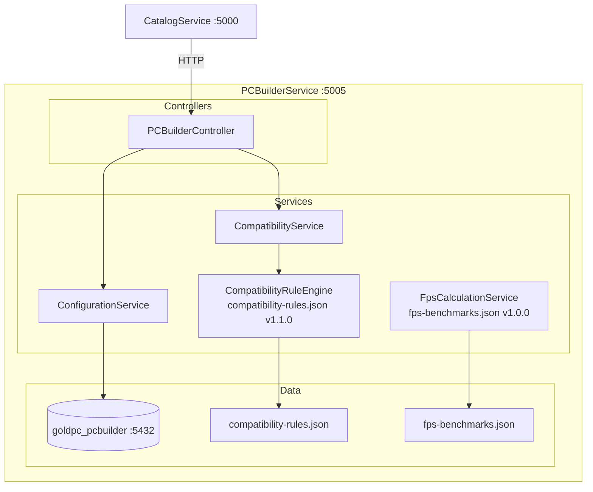
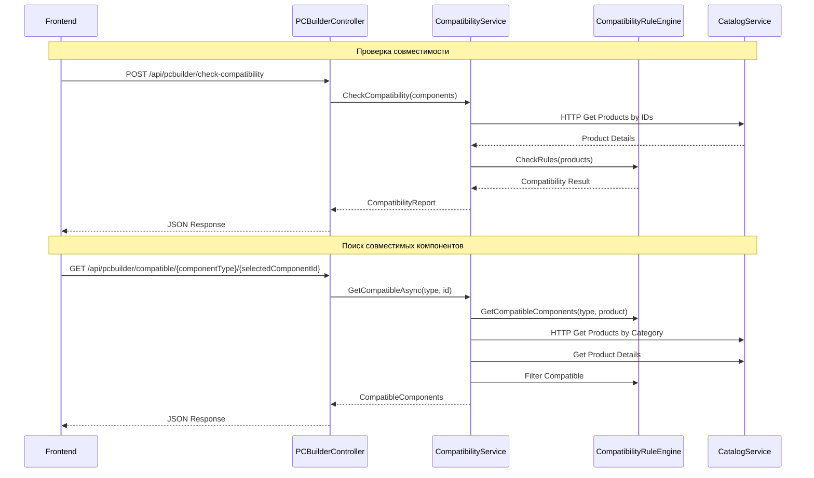
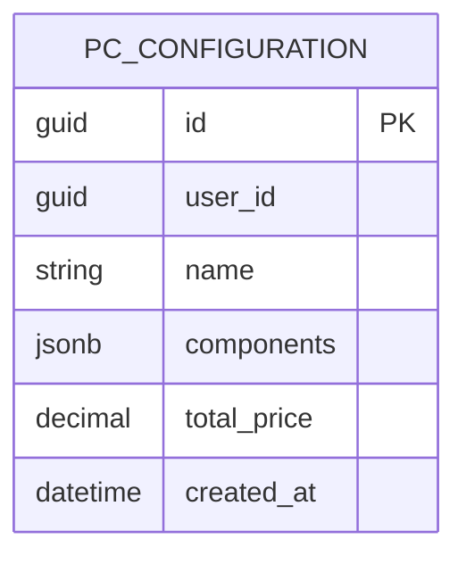

# Сервис ПК-конструктора (PCBuilderService)

## Краткое описание

PCBuilderService — микросервис конфигуратора ПК, позволяющий подбирать совместимые компоненты, проверять сборки и рассчитывать производительность (FPS).

## Назначение

- Поиск совместимых компонентов (CPU, GPU, RAM, MB, PSU, Case, Cooler, Storage)
- Проверка совместимости сборки по JSON-правилам
- Расчёт FPS для игр на основе бенчмарков
- Сохранение и управление конфигурациями

## Где используется

- Фронтенд (страница конфигуратора ПК)
- API Gateway

## Архитектура



## Поток данных



## JSON-правила совместимости

Файл: `Data/compatibility-rules.json` (v1.1.0)

Содержит декларативные правила совместимости для пар компонентов:

| Правило | Описание |
|---------|----------|
| socket | Совпадение сокета (CPU ↔ MB, Cooler ↔ Socket) |
| chipset | Совместимость чипсета (CPU ↔ MB) |
| form_factor | Совместимость форм-фактора (MB ↔ Case, PSU ↔ Case) |
| ram_type | Тип памяти (MB ↔ RAM) |
| psu_wattage | Мощность БП (PSU ↔ сумма TDP компонентов) |
| cooler_tdp | TDP охлаждения (Cooler ↔ CPU TDP) |
| gpu_length | Длина GPU (GPU ↔ Case) |
| ram_slots | Слоты памяти (MB ↔ RAM количество планок) |

### Пример правила

```json
{
  "ruleType": "socket",
  "description": "Socket AM5 compatibility",
  "componentTypeA": "Processor",
  "componentTypeB": "Motherboard",
  "specKeyA": "socket",
  "specKeyB": "socket",
  "validation": "match",
  "required": true
}
```

## FPS Benchmarks

Файл: `Data/fps-benchmarks.json` (v1.0.0)

Бенчмарки производительности для пар CPU+GPU в различных играх:

```json
{
  "gpuModel": "NVIDIA GeForce RTX 4070 SUPER",
  "cpuModel": "AMD Ryzen 5 5600X",
  "benchmarks": [
    { "game": "Cyberpunk 2077", "settings": "Ultra 1080p", "fps": 95 },
    { "game": "Cyberpunk 2077", "settings": "Ultra 1440p", "fps": 72 }
  ]
}
```

## Контроллеры и Endpoints

### PCBuilderController

| Endpoint | Метод | Описание |
|----------|-------|----------|
| `/api/pcbuilder/check-compatibility` | POST | Проверить совместимость сборки |
| `/api/pcbuilder/compatible/{type}/{id}` | GET | Совместимые компоненты для данного |
| `/api/pcbuilder/configurations` | GET | Список конфигураций пользователя |
| `/api/pcbuilder/configurations` | POST | Сохранить конфигурацию |
| `/api/pcbuilder/configurations/{id}` | GET | Конфигурация по ID |
| `/api/pcbuilder/configurations/{id}` | DELETE | Удалить конфигурацию |
| `/api/pcbuilder/fps-estimate` | POST | Рассчитать FPS для сборки |

## Модели данных



### CompatibilityRuleEngine

Singleton, загружает `compatibility-rules.json` при старте:

- `CheckCompatibility(List<Product> components)` → отчёт о совместимости
- `GetCompatibleComponents(ComponentType type, Product selected)` → фильтр совместимых

### FpsCalculationService

Singleton, загружает `fps-benchmarks.json` при старте:

- `EstimateFps(GpuModel, CpuModel, Game, Settings)` → fps
- Интерполяция для неизвестных комбинаций

## Коммуникация с CatalogService

PCBuilderService использует **HTTP** для получения данных о товарах из CatalogService:

```csharp
builder.Services.AddHttpClient("CatalogService", client =>
{
    client.BaseAddress = new Uri("http://localhost:5000");
    client.Timeout = TimeSpan.FromSeconds(30);
});
```

**Важно**: gRPC клиент также зарегистрирован, но **не используется** — все запросы идут через HTTP.

## Зависимости

- **SharedKernel** — DTO, ComponentType enum
- **Shared** — Middleware, Chaos (Development)
- **CatalogService** — HTTP (:5000) для получения товаров

## Связанные модули

- [[Сервис_каталога_CatalogService]] — поставщик данных о товарах
- [[Обзор_бэкенда]]
- [[Shared_SharedKernel]]

## Основные файлы

| Файл | Назначение |
|------|-----------|
| `src/PCBuilderService/Program.cs` | Точка входа (105 строк) |
| `src/PCBuilderService/Controllers/PCBuilderController.cs` | Endpoints конфигуратора |
| `src/PCBuilderService/Services/CompatibilityRuleEngine.cs` | Движок правил совместимости |
| `src/PCBuilderService/Services/CompatibilityService.cs` | Сервис совместимости |
| `src/PCBuilderService/Services/ConfigurationService.cs` | Сервис конфигураций |
| `src/PCBuilderService/Services/FpsCalculationService.cs` | Расчёт FPS |
| `src/PCBuilderService/Data/compatibility-rules.json` | Правила совместимости (v1.1.0) |
| `src/PCBuilderService/Data/fps-benchmarks.json` | Бенчмарки FPS (v1.0.0) |
| `src/PCBuilderService/Data/PCBuilderDbContext.cs` | DbContext |
| `src/PCBuilderService/Models/` | Модели данных |

## Примеры кода

### Проверка совместимости

```http
POST /api/pcbuilder/check-compatibility
Content-Type: application/json

{
  "components": {
    "processor": "20000000-0000-0000-0000-000000000002",
    "motherboard": "20000000-0000-0000-0000-000000000004",
    "ram": "20000000-0000-0000-0000-000000000006",
    "gpu": "20000000-0000-0000-0000-000000000008"
  }
}
```

### Расчёт FPS

```http
POST /api/pcbuilder/fps-estimate
Content-Type: application/json

{
  "cpuId": "20000000-0000-0000-0000-000000000002",
  "gpuId": "20000000-0000-0000-0000-000000000008",
  "game": "Cyberpunk 2077",
  "resolution": "1440p",
  "settings": "Ultra"
}
```

## Потенциальные проблемы

1. **gRPC клиент не используется** — хотя зарегистрирован, все запросы идут через HTTP
2. **Отдельная БД** — goldpc_pcbuilder на :5432, в то время как все остальные на :5434
3. **JSON правила** — обновление правил требует перезапуска сервиса (singleton)
4. **Бенчмарки статичны** — fps-benchmarks.json не обновляется автоматически
5. **Интерполяция FPS** — для неизвестных комбинаций может давать неточные результаты

## Related Pages

- [[Обзор_бэкенда]]
- [[Сервис_каталога_CatalogService]]
- [[Shared_SharedKernel]]
- [[API_Gateway]]
