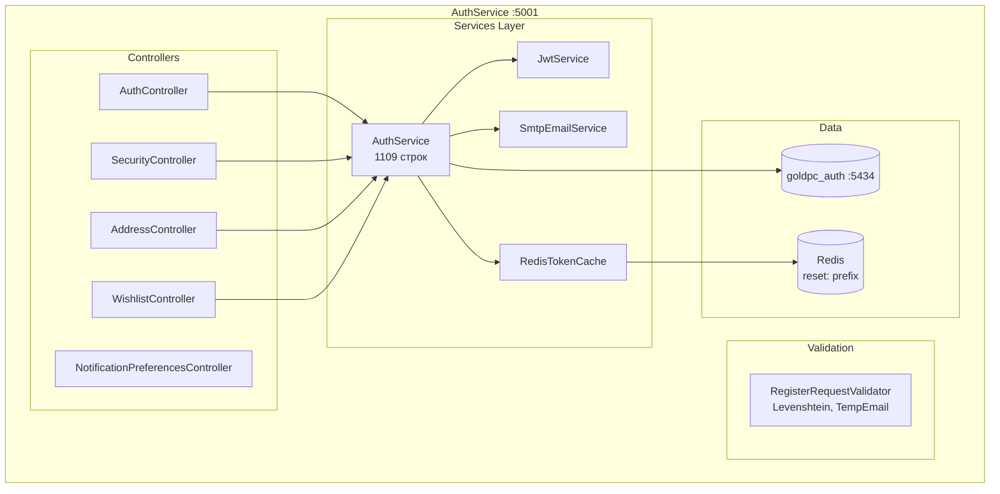
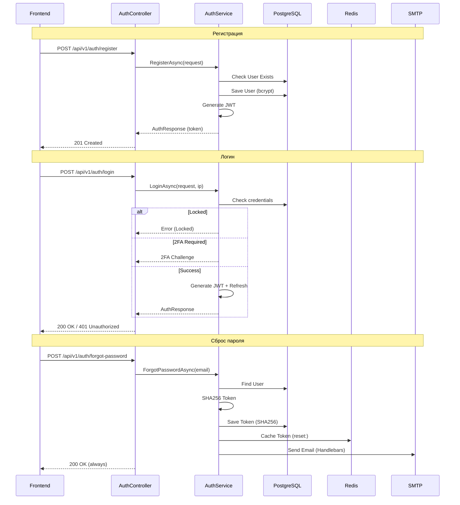
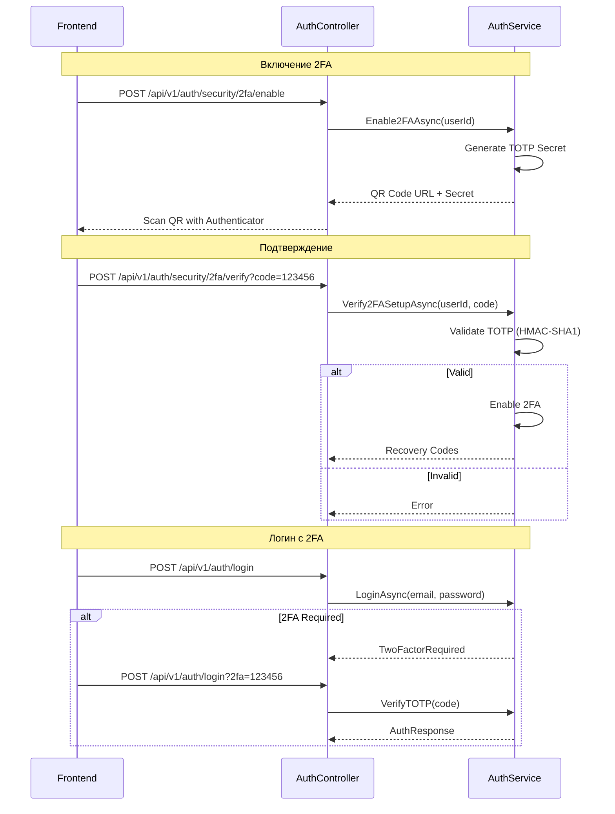

# Сервис аутентификации (AuthService)

## Краткое описание

AuthService — микросервис для аутентификации, авторизации и управления пользователями в GoldPC. Реализует JWT-аутентификацию, 2FA (TOTP), сброс пароля, подтверждение email, блокировку учётных записей и историю входов.

## Назначение

- Регистрация и аутентификация пользователей
- JWT (access + refresh токены)
- 2FA через TOTP (HMAC-SHA1, 30s, 6 digits)
- Сброс пароля (SHA256 + Redis dual storage)
- Подтверждение email (Handlebars шаблоны)
- Блокировка учётной записи (5 неудачных попыток → 15 мин)
- Управление профилем и адресами
- Избранное (Wishlist)
- Уведомления (настройки)
- История входов

## Где используется

- Фронтенд (логин, регистрация, профиль, 2FA)
- Все микросервисы (валидация JWT)
- API Gateway (прокси запросов аутентификации)

## Архитектура



## Поток данных



## Контроллеры и Endpoints

### AuthController (`api/v1/auth`)

| Endpoint | Метод | Описание | Авторизация |
|----------|-------|----------|-------------|
| `/register` | POST | Регистрация | - |
| `/login` | POST | Вход | - |
| `/refresh` | POST | Обновление токена | - |
| `/logout` | POST | Выход | JWT |
| `/profile` | GET | Профиль пользователя | JWT |
| `/profile` | PUT | Обновление профиля | JWT |
| `/change-password` | POST | Смена пароля | JWT |
| `/forgot-password` | POST | Запрос сброса пароля | - |
| `/reset-password` | POST | Сброс пароля по токену | - |
| `/validate-reset-token` | POST | Проверить токен сброса | - |
| `/send-verification` | POST | Отправить подтверждение email | JWT |
| `/verify-email` | POST | Подтвердить email | - |

### SecurityController (`api/v1/auth/security`)

| Endpoint | Метод | Описание |
|----------|-------|----------|
| `/login-history` | GET | История входов (пагинация) |
| `/2fa/enable` | POST | Включить 2FA |
| `/2fa/verify` | POST | Подтвердить 2FA |
| `/2fa/disable` | POST | Отключить 2FA |
| `/2fa/recovery-codes` | GET | Коды восстановления |

### AddressController (`api/v1/auth/addresses`)

| Endpoint | Метод | Описание |
|----------|-------|----------|
| `/` | GET | Список адресов |
| `/` | POST | Создать адрес |
| `/{id}` | PUT | Обновить адрес |
| `/{id}` | DELETE | Удалить адрес |

### WishlistController (`api/v1/auth/wishlist`)

| Endpoint | Метод | Описание |
|----------|-------|----------|
| `/` | GET | Список избранного |
| `/` | POST | Добавить в избранное |
| `/{productId}` | DELETE | Удалить из избранного |

### NotificationPreferencesController (`api/v1/auth/notifications`)

| Endpoint | Метод | Описание |
|----------|-------|----------|
| `/` | GET | Настройки уведомлений |
| `/` | PUT | Обновить настройки |

## Модели данных

```mermaid
erDiagram
    USER ||--o{ REFRESH_TOKEN : has
    USER ||--o{ LOGIN_HISTORY : has
    USER ||--o{ USER_ADDRESS : has
    USER ||--o{ WISHLIST_ITEM : has
    USER ||--o{ PASSWORD_RESET_TOKEN : has
    USER ||--o{ EMAIL_VERIFICATION_TOKEN : has
    USER ||--o{ USER_TWO_FACTOR : has
    USER ||--o{ NOTIFICATION_PREFERENCE : has
    
    USER {
        guid id PK
        string email UK
        string password_hash
        string first_name
        string last_name
        string phone
        bool is_active
        bool is_email_verified
        int failed_login_attempts
        datetime locked_until
        datetime created_at
        list roles
    }
    
    REFRESH_TOKEN {
        guid id PK
        guid user_id FK
        string token UK
        datetime expires
        string device_info
        bool is_revoked
    }
    
    LOGIN_HISTORY {
        guid id PK
        guid user_id FK
        string ip_address
        string user_agent
        bool success
        datetime created_at
    }
    
    USER_ADDRESS {
        guid id PK
        guid user_id FK
        string title
        string street
        string city
        string phone
        bool is_default
    }
    
    USER_TWO_FACTOR {
        guid id PK
        guid user_id FK
        string secret_key
        bool is_enabled
        list recovery_codes
    }
    
    PASSWORD_RESET_TOKEN {
        guid id PK
        guid user_id FK
        string token_hash SHA256
        datetime expires_at
        bool is_used
    }
```

### User

- **Email** — логин, lowercase, уникальный
- **PasswordHash** — bcrypt (workFactor: 12)
- **Roles** — список UserRole (Client, Manager, Admin, Master, Employee)
- **IsActive** — признак активности (мягкое удаление)
- **FailedLoginAttempts** — счётчик (5 → LockedUntil)
- **LockedUntil** — блокировка на 15 минут

### UserTwoFactor

- **SecretKey** — TOTP секрет (HMAC-SHA1)
- **IsEnabled** — включён ли 2FA
- **RecoveryCodes** — коды восстановления (одноразовые)

## 2FA (TOTP) реализация

- Алгоритм: **HMAC-SHA1**
- Шаг: **30 секунд**
- Длина кода: **6 цифр**
- Секрет: генерируется при включении 2FA
- Коды восстановления: одноразовые, хранятся хэшированными



## Сброс пароля (dual storage)

1. Пользователь запрашивает сброс → `POST /forgot-password`
2. Сервер генерирует токен (случайная строка)
3. **SHA256** хэш токена сохраняется в БД
4. Оригинал сохраняется в **Redis** с ключом `reset:{token}` (TTL: 1 час)
5. Email отправляется через SMTP (Handlebars шаблон)
6. При сбросе — токен ищется сначала в Redis, затем по SHA256 в БД
7. После использования — удаляется из Redis и помечается is_used в БД

## Валидация регистрации

**RegisterRequestValidator** (FluentValidation):

- **Email**: формат, длина ≤ 255, домен не из списка temp-email (20+ доменов)
- **Пароль**: ≥ 8 символов, заглавная + строчная + цифра, не из списка common (~30), не содержит email/имя, Levenshtein ≤ 2 от common
- **Имя**: 2-100 символов, только буквы/пробелы/дефисы
- **Телефон**: формат Беларуси `+375 (XX) XXX-XX-XX`

## Блокировка аккаунта

- **MaxFailedAttempts**: 5
- **LockoutMinutes**: 15
- После 5 неудачных попыток → `LockedUntil = DateTime.UtcNow.AddMinutes(15)`
- При успешном входе → сброс FailedLoginAttempts

## JWT Конфигурация

| Параметр | Development | Production |
|----------|-------------|------------|
| Алгоритм | HMAC-SHA256 (симметричный) | Keycloak OIDC |
| Secret | `"GoldPC_SuperSecretKey_ForDevelopment_Only_2024!"` | Keycloak JWKS |
| Issuer | "GoldPC" | Keycloak realm |
| Audience | "GoldPC" | "goldpc-api" |
| Access Token | 15 минут | 15 минут |
| Refresh Token | 7 дней | 7 дней |

## Зависимости

- **SharedKernel** — DTO (RegisterRequest, AuthResponse, UserDto), Enums (UserRole), ApiResponse
- **Shared** — Middleware (SecurityHeaders), Authorization (Permission-based)
- **SmtpEmailService** — отправка email через Gmail SMTP
- **BCrypt.Net** — хэширование паролей (workFactor: 12)
- **FluentValidation** — валидация запросов

## Связанные модули

- [[Обзор_бэкенда]]
- [[API_Gateway]]
- [[Shared_SharedKernel]]

## Основные файлы

| Файл | Назначение |
|------|-----------|
| `src/AuthService/Program.cs` | Точка входа (197 строк) |
| `src/AuthService/Controllers/AuthController.cs` | Аутентификация (316 строк) |
| `src/AuthService/Controllers/SecurityController.cs` | 2FA, история (149 строк) |
| `src/AuthService/Controllers/AddressController.cs` | Адреса доставки |
| `src/AuthService/Controllers/WishlistController.cs` | Избранное |
| `src/AuthService/Controllers/NotificationPreferencesController.cs` | Настройки уведомлений |
| `src/AuthService/Services/AuthService.cs` | Бизнес-логика (1109 строк) |
| `src/AuthService/Services/JwtService.cs` | JWT генерация/валидация |
| `src/AuthService/Services/IAuthService.cs` | Интерфейс сервиса |
| `src/AuthService/Services/IJwtService.cs` | Интерфейс JWT |
| `src/AuthService/Infrastructure/RedisTokenCache.cs` | Redis кэш токенов |
| `src/AuthService/Entities/User.cs` | Модель пользователя |
| `src/AuthService/Entities/RefreshToken.cs` | Refresh токен |
| `src/AuthService/Entities/LoginHistory.cs` | История входов |
| `src/AuthService/Entities/PasswordResetToken.cs` | Токен сброса пароля |
| `src/AuthService/Entities/EmailVerificationToken.cs` | Токен подтверждения email |
| `src/AuthService/Entities/UserTwoFactor.cs` | 2FA настройки |
| `src/AuthService/Validators/RegisterRequestValidator.cs` | Валидатор регистрации |

## Примеры кода

### Регистрация

```http
POST /api/v1/auth/register
Content-Type: application/json

{
  "email": "user@example.com",
  "password": "MyP@ssw0rd123",
  "firstName": "Иван",
  "lastName": "Петров",
  "phone": "+375 (29) 123-45-67"
}
```

### Логин с 2FA

```http
POST /api/v1/auth/login
Content-Type: application/json

{
  "email": "user@example.com",
  "password": "MyP@ssw0rd123",
  "twoFactorCode": "123456"
}
```

### Refresh токен

```http
POST /api/v1/auth/refresh
Content-Type: application/json

{
  "refreshToken": "your-refresh-token-value"
}
```

## Потенциальные проблемы

1. **SMTP Gmail** — пароль приложения в appsettings.json (безопасность)
2. **Симметричный ключ в Development** — не подходит для Production
3. **Устаревшее поле Role** — используется Roles (коллекция), но Role помечено `[Obsolete]`
4. **Нету Rate Limiting** — forgot-password не защищён от перебора
5. **2FA без QR-кода на бэке** — генерация QR на уровне сервиса? (нужно проверить)

## Related Pages

- [[Обзор_бэкенда]]
- [[API_Gateway]]
- [[Shared_SharedKernel]]
- [[09_Auth/Обзор_аутентификации]]
