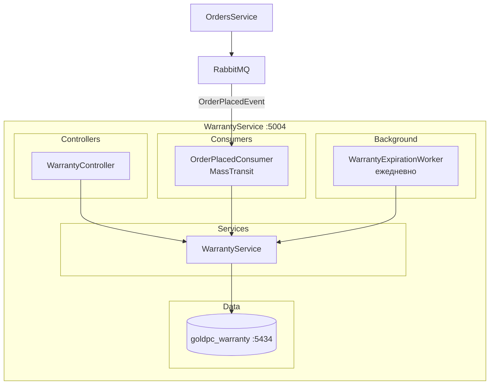
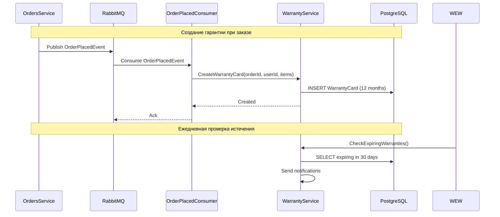
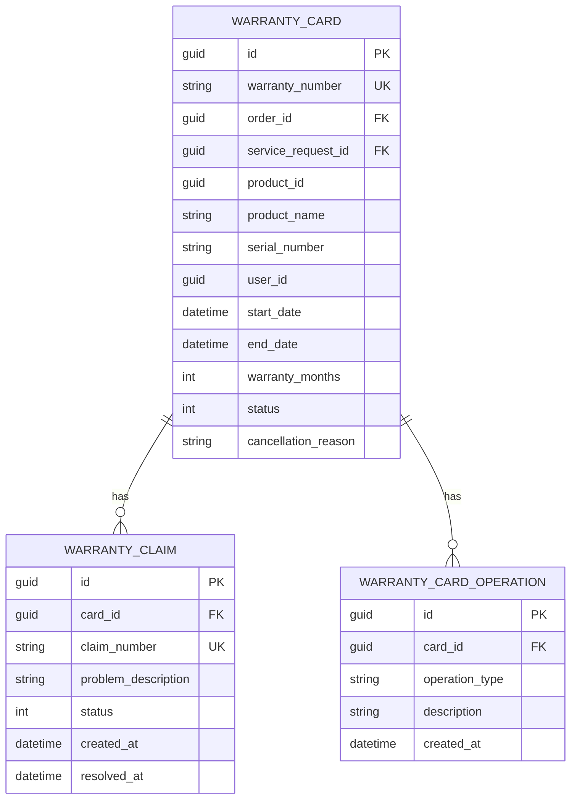

# Сервис гарантии (WarrantyService)

## Краткое описание

WarrantyService — микросервис управления гарантийными талонами и заявками. Автоматически создаёт гарантийные карты при заказе и отслеживает их истечение.

## Назначение

- Управление гарантийными талонами (WarrantyCard)
- Обработка гарантийных заявок (WarrantyClaim)
- Автоматическое создание гарантии на 12 месяцев при заказе (MassTransit consumer)
- Фоновый воркер — ежедневная проверка истекающих гарантий (30 дней до истечения → уведомление)

## Где используется

- Фронтенд (личный кабинет — гарантии)
- ServicesService (проверка гарантии по серийному номеру)
- OrdersService (событие OrderPlaced)

## Архитектура



## Поток данных



## Контроллеры и Endpoints

### WarrantyController

| Endpoint | Метод | Описание | Авторизация |
|----------|-------|----------|-------------|
| `/api/warranty/cards` | GET | Все гарантийные талоны | JWT |
| `/api/warranty/cards/my` | GET | Мои гарантийные талоны | JWT |
| `/api/warranty/cards/{id}` | GET | Талон по ID | JWT |
| `/api/warranty/cards/{id}/operations` | GET | Операции по талону | JWT |
| `/api/warranty/cards/check` | POST | Проверить гарантию по серийному номеру | JWT |
| `/api/warranty/claims` | GET | Все гарантийные заявки | JWT |
| `/api/warranty/claims/{id}` | GET | Заявка по ID | JWT |
| `/api/warranty/claims` | POST | Создать гарантийную заявку | JWT |
| `/api/warranty/claims/{id}/status` | PUT | Обновить статус заявки | JWT |

## Модели данных



### WarrantyCard

- **WarrantyNumber** — формат `W-YYYY-NNNNNN`
- **OrderId** — заказ, по которому создана гарантия
- **ServiceRequestId** — сервисная заявка (для услуг)
- **ProductId** — ID товара
- **StartDate/EndDate** — период действия (12 месяцев от заказа)
- **Status** — Active(0), Expired(1), Annulled(2)
- **WarrantyMonths** — срок гарантии в месяцах

### WarrantyClaim

- **ClaimNumber** — уникальный номер заявки
- **ProblemDescription** — описание проблемы
- **Status** — New(3), InProgress(4), Resolved(5), Rejected(6)

## MassTransit Consumer

**OrderPlacedConsumer** — единственный активный MassTransit consumer в системе:

```csharp
builder.Services.AddMessaging(builder.Configuration, x =>
{
    x.AddConsumer<OrderPlacedConsumer>();
});
```

При получении `OrderPlacedEvent`:
1. Для каждого товара в заказе создаётся `WarrantyCard` на 12 месяцев
2. Устанавливается StartDate = now, EndDate = now.AddMonths(12)

## Background Worker

**WarrantyExpirationWorker** — фоновый сервис:

- Проверяет гарантии каждые 24 часа
- Находит карты, истекающие через 30 дней
- Отправляет уведомления пользователям (SMS/Email)
- Обновляет статус `Active → Expired` для просроченных

## Зависимости

- **SharedKernel** — Enums (WarrantyStatus), Events (OrderPlacedEvent), DTO (WarrantyDto, WarrantyClaimDto)
- **Shared** — Messaging (MassTransit), Middleware, Notifications (SmtpEmailService, SMS.ru)
- **RabbitMQ** — получение событий OrderPlacedEvent

## Связанные модули

- [[Сервис_заказов_OrdersService]] — поставщик событий
- [[Сервис_услуг_ServicesService]] — потребитель проверки гарантии
- [[Обзор_бэкенда]]
- [[Shared_SharedKernel]]

## Основные файлы

| Файл | Назначение |
|------|-----------|
| `src/WarrantyService/Program.cs` | Точка входа (100 строк) |
| `src/WarrantyService/Controllers/WarrantyController.cs` | Endpoints |
| `src/WarrantyService/Services/WarrantyService.cs` | Бизнес-логика |
| `src/WarrantyService/Consumers/OrderPlacedConsumer.cs` | MassTransit consumer |
| `src/WarrantyService/Background/WarrantyExpirationWorker.cs` | Фоновая проверка истечения |
| `src/WarrantyService/Entities/WarrantyCard.cs` | Модель гарантийного талона |
| `src/WarrantyService/Entities/WarrantyClaim.cs` | Модель заявки |
| `src/WarrantyService/Entities/WarrantyCardOperation.cs` | Операции по талону |
| `src/WarrantyService/Data/WarrantyDbContext.cs` | DbContext |

## Примеры кода

### Проверка гарантии по серийному номеру

```http
POST /api/warranty/cards/check
Content-Type: application/json
Authorization: Bearer <token>

{
  "serialNumber": "SN123456789"
}
```

### Создание гарантийной заявки

```http
POST /api/warranty/claims
Content-Type: application/json
Authorization: Bearer <token>

{
  "cardId": "warranty-card-guid",
  "problemDescription": "Видеокарта перегревается под нагрузкой до 95°C"
}
```

## Потенциальные проблемы

1. **MassTransit ненадёжен** — если RabbitMQ недоступен, гарантии не создаются
2. **Дублирование** — если событие пришло повторно, создадутся дубликаты (нужна идемпотентность)
3. **Нет Outbox** — риск потери события при сбое
4. **Статус Active/Expired** — WarrantyStatus содержит как статусы талонов (0-2), так и статусы заявок (3-6) в одном enum
5. **Таймзона** — все даты в UTC, уведомления могут приходить не в то время суток

## Related Pages

- [[Обзор_бэкенда]]
- [[Сервис_заказов_OrdersService]]
- [[Сервис_услуг_ServicesService]]
- [[Shared_SharedKernel]]
- [[API_Gateway]]
