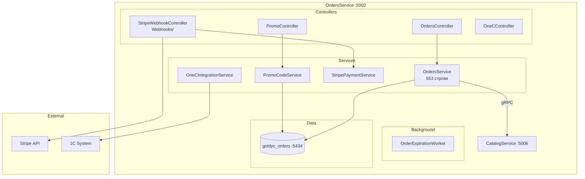
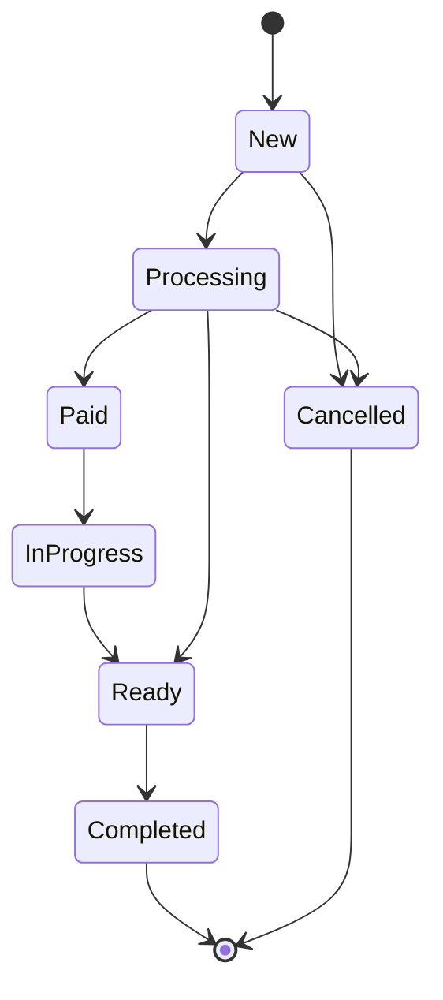
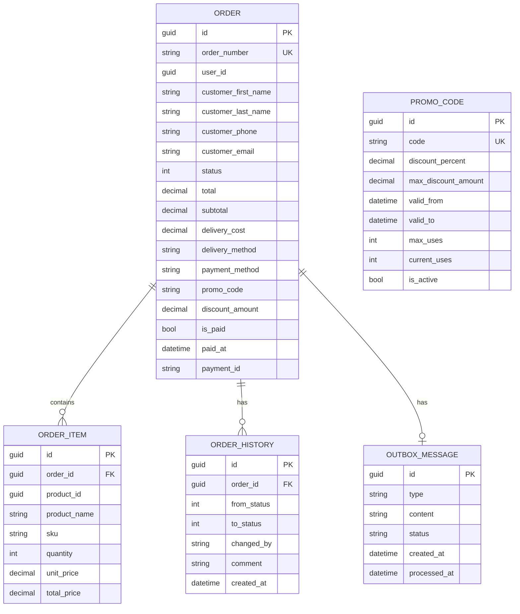

# Сервис заказов (OrdersService)

## Краткое описание

OrdersService — микросервис управления заказами, платежами и промокодами в GoldPC. Реализует полный жизненный цикл заказа (FSM), интеграцию со Stripe и 1С.

## Назначение

- Создание и управление заказами
- FSM жизненного цикла заказа (New → ... → Cancelled/Delivered)
- Генерация номеров заказов (GP-YYYY-NNNNNN)
- Платёжная интеграция (Stripe)
- Промокоды и скидки
- Интеграция с 1С

## Где используется

- Фронтенд (корзина, оформление, история заказов)
- API Gateway
- CatalogService (gRPC — проверка стока)
- 1С (экспорт заказов)
- Stripe Webhook (уведомления о платежах)

## Архитектура



## FSM заказа



| Статус | Значение |
|--------|----------|
| `New` (0) | Создан, ожидает обработки |
| `Processing` (1) | Менеджер работает с заказом |
| `Paid` (2) | Оплата подтверждена |
| `InProgress` (3) | Передан в сборку |
| `Ready` (4) | Готов к выдаче |
| `Completed` (5) | Выдан клиенту |
| `Cancelled` (6) | Отменён |

## Номер заказа

Формат: **`GP-YYYY-NNNNNN`**

- `GP` — префикс GoldPC
- `YYYY` — год
- `NNNNNN` — автоинкрементный номер (6 цифр)

Пример: `GP-2026-000042`

## Контроллеры и Endpoints

### OrdersController

| Endpoint | Метод | Описание | Авторизация |
|----------|-------|----------|-------------|
| `/api/orders` | GET | Все заказы (пагинация, опц. по статусу) | JWT |
| `/api/orders/{id}` | GET | Заказ по ID | JWT |
| `/api/orders/by-number/{number}` | GET | Заказ по номеру | JWT |
| `/api/orders/my` | GET | Заказы текущего пользователя | JWT |
| `/api/orders` | POST | Создать заказ | JWT |
| `/api/orders/{id}/status` | PUT | Обновить статус | JWT |
| `/api/orders/{id}/cancel` | POST | Отменить заказ | JWT |
| `/api/orders/{id}/payment` | POST | Инициировать оплату | JWT |

### PromoController

| Endpoint | Метод | Описание |
|----------|-------|----------|
| `/api/promo/validate` | POST | Проверить промокод |

### StripeWebhookController (`Webhooks/`)

| Endpoint | Метод | Описание |
|----------|-------|----------|
| `/api/webhooks/stripe` | POST | Webhook от Stripe (старый) |
| `/api/webhooks/stripe/new` | POST | Webhook от Stripe (новый) |

### OneCController

| Endpoint | Метод | Описание |
|----------|-------|----------|
| `/api/1c/orders` | GET | Экспорт заказов в 1С |
| `/api/1c/status` | PUT | Обновление статуса из 1С |

## Модели данных



## Интеграция с Stripe

- **StripePaymentService** — создание платежных интентов
- **StripeWebhookController** — два webhook-контроллера (старый и новый)
- Моки в Development (PaymentServiceMock, 95% успеха)
- В Production: Stripe + декоратор логгирования

## Промокоды

- **PromoCodeService** — валидация и применение промокодов
- Поля: код, процент скидки, макс. сумма, период действия, лимит использований
- Endpoint: `POST /api/promo/validate`

## Фоновые задачи

- **OrderExpirationWorker** — отмена просроченных неоплаченных заказов

## MassTransit и Outbox (ОТКЛЮЧЕНЫ)

```csharp
// TEMPORARILY DISABLED
// builder.Services.AddMessaging(builder.Configuration);
// builder.Services.AddHostedService<OutboxProcessor>();
```

- События OrderPlacedEvent и OrderPaidEvent не отправляются
- Outbox-сообщения не обрабатываются

## Зависимости

- **SharedKernel** — DTO (OrderDto, CreateOrderRequest), Enums (OrderStatus), Events (OrderPlacedEvent, OrderPaidEvent)
- **Shared** — Messaging, Middleware, Data
- **CatalogService** — gRPC (:5006) для проверки и резервации стока
- **Stripe** — платежный шлюз
- **1С** — интеграция через API

## Связанные модули

- [[Сервис_каталога_CatalogService]] — gRPC сток
- [[Сервис_гарантии_WarrantyService]] — MassTransit consumer (OrderPlacedEvent)
- [[Обзор_бэкенда]]
- [[Shared_SharedKernel]]

## Основные файлы

| Файл | Назначение |
|------|-----------|
| `src/OrdersService/Program.cs` | Точка входа (213 строк) |
| `src/OrdersService/Controllers/OrdersController.cs` | Заказы |
| `src/OrdersService/Controllers/PromoController.cs` | Промокоды |
| `src/OrdersService/Controllers/Webhooks/StripeWebhookController.cs` | Вебхуки Stripe |
| `src/OrdersService/Controllers/OneCController.cs` | Интеграция 1С |
| `src/OrdersService/Services/OrdersService.cs` | Бизнес-логика заказов (553 строки) |
| `src/OrdersService/Services/PromoCodeService.cs` | Промокоды |
| `src/OrdersService/Services/StripePaymentService.cs` | Stripe интеграция |
| `src/OrdersService/Services/OneCIntegrationService.cs` | 1С интеграция |
| `src/OrdersService/Background/OrderExpirationWorker.cs` | Фоновая отмена заказов |
| `src/OrdersService/Entities/Order.cs` | Модель заказа |
| `src/OrdersService/Entities/OrderItem.cs` | Позиция заказа |
| `src/OrdersService/Entities/OrderHistory.cs` | История статусов |
| `src/OrdersService/Entities/PromoCode.cs` | Промокод |
| `src/OrdersService/Entities/OutboxMessage.cs` | Outbox сообщение |

## Примеры кода

### Создание заказа

```http
POST /api/orders
Content-Type: application/json
Authorization: Bearer <token>

{
  "items": [
    { "productId": "20000000-0000-0000-0000-000000000001", "quantity": 1 }
  ],
  "deliveryMethod": "delivery",
  "paymentMethod": "online",
  "address": "г. Минск, ул. Ленина, д. 1",
  "customerFirstName": "Иван",
  "customerLastName": "Петров",
  "customerPhone": "+375291234567",
  "customerEmail": "ivan@example.com",
  "promoCode": "WELCOME10"
}
```

### Проверка промокода

```http
POST /api/promo/validate
Content-Type: application/json

{
  "code": "WELCOME10",
  "orderTotal": 1500.00
}
```

## Потенциальные проблемы

1. **Outbox отключён** — риск потери событий (OrderPlaced, OrderPaid)
2. **MassTransit отключён** — гарантии не создаются (WarrantyService не получает события)
3. **Два Stripe webhook** — возможна дуальная обработка платежей
4. **Mock-сервисы в Development** — могут отличаться от Production поведения
5. **Stripe Secret в конфиге** — `sk_test_replace_me` (безопасность)

## Related Pages

- [[Обзор_бэкенда]]
- [[Сервис_каталога_CatalogService]]
- [[Сервис_гарантии_WarrantyService]]
- [[API_Gateway]]
- [[Shared_SharedKernel]]
