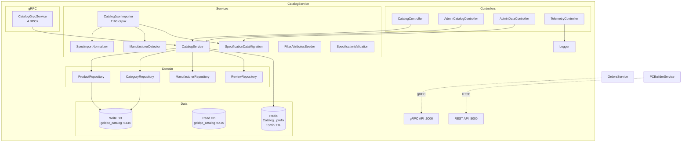
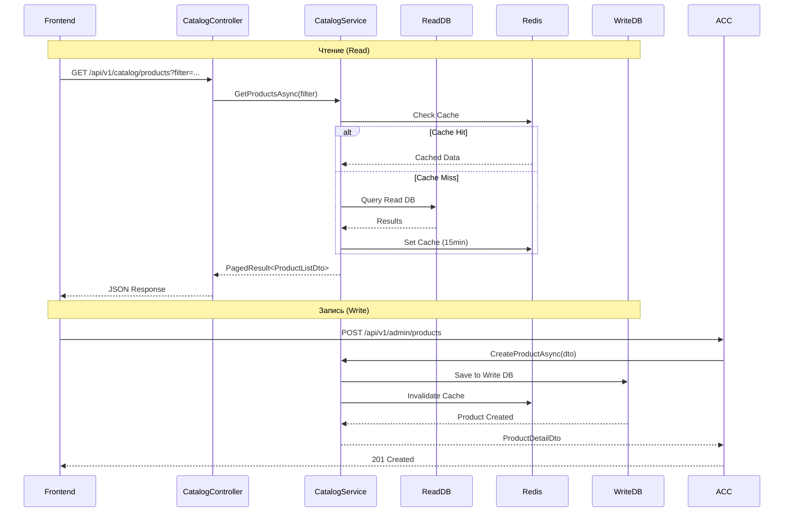
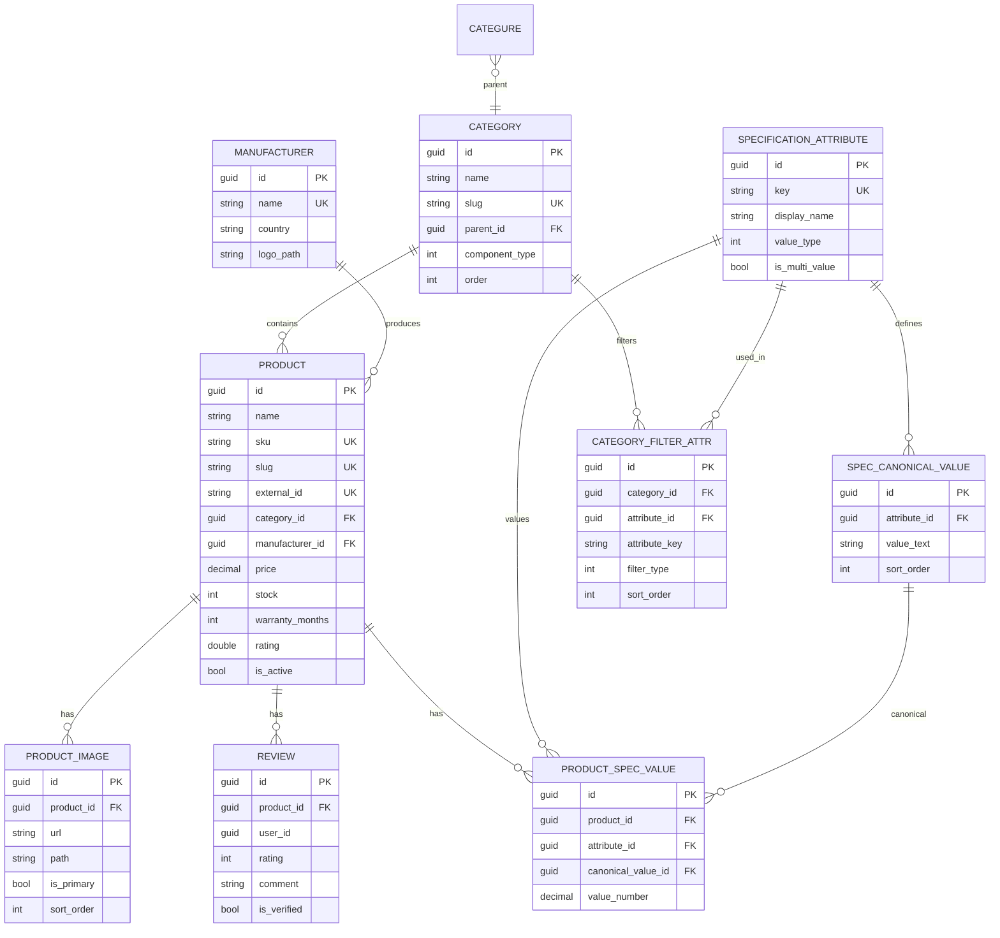
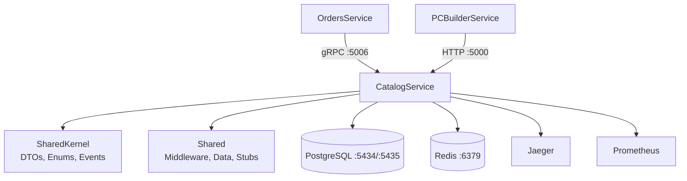

# Сервис каталога (CatalogService)

## Краткое описание

CatalogService — центральный микросервис GoldPC для управления каталогом товаров: продукты, категории, производители, спецификации, фильтры, изображения, отзывы и остатки на складе.

## Назначение

- CRUD товаров и категорий
- Фильтрация с фасетами (facets)
- Управление складскими остатками (резервация/освобождение)
- Нормализованные спецификации с каноническими значениями
- Импорт товаров из X-Core JSON
- Управление изображениями
- Отзывы на товары

## Где используется

- Фронтенд (каталог, карточка товара, поиск, фильтры)
- OrdersService (gRPC — проверка стока, резервация)
- PCBuilderService (HTTP — получение данных о товарах)
- CLI-команды для импорта и миграции данных

## Архитектура



### CQRS (Read/Write)

CatalogService реализует паттерн **CQRS** с раздельными DbContext:

| DbContext | Назначение | Порт БД |
|-----------|-----------|---------|
| `CatalogDbContext` | Запись (Write) | :5434 |
| `ReadOnlyCatalogDbContext` | Чтение (Read) | :5435 |

### Redis кэширование

- Префикс: `Catalog_`
- TTL: 15 минут
- Используется для кэширования результатов запросов к каталогу

## Поток данных



## Контроллеры и Endpoints

### CatalogController (`api/v1/catalog`)

| Endpoint | Метод | Описание | Авторизация |
|----------|-------|----------|-------------|
| `/products` | GET | Список товаров с фильтрацией и пагинацией | - |
| `/products/{id}` | GET | Товар по ID | - |
| `/products/by-slug/{slug}` | GET | Товар по slug | - |
| `/products/{id}/reviews` | GET | Отзывы о товаре | - |
| `/products/{id}/reviews` | POST | Добавить отзыв | JWT |
| `/products/{id}/reviews/{rid}` | PUT | Обновить отзыв | JWT |
| `/products/{id}/reviews/{rid}` | DELETE | Удалить отзыв | JWT |
| `/products/{id}/reviews/{rid}/helpful` | PATCH | Отметить полезным | - |
| `/categories` | GET | Все категории | - |
| `/categories/{slug}/filter-attributes` | GET | Атрибуты фильтрации категории | - |
| `/categories/{slug}/filter-facets` | GET | Фасеты для фильтра | - |
| `/manufacturers` | GET | Производители (опц. по категории) | - |

### AdminCatalogController (`api/v1/admin`)

| Endpoint | Метод | Описание | Роли |
|----------|-------|----------|------|
| `/products` | POST | Создать товар | Manager, Admin, Master |
| `/products/{id}` | PUT | Обновить товар | Manager, Admin, Master |
| `/products/{id}` | DELETE | Мягкое удаление | Admin, Master |

### AdminDataController (`api/v1/admin/data`)

| Endpoint | Метод | Описание |
|----------|-------|----------|
| `/migrate/fix-range-outliers` | POST | Исправить выбросы в Range-атрибутах |
| `/migrate/remove-leaked-values` | POST | Удалить leaked values |
| `/migrate/normalize-duplicates` | POST | Нормализовать дубликаты Terms |
| `/migrate/recalculate-frequencies` | POST | Пересчитать частоты CPU (МГц→ГГц) |
| `/migrate/recalculate-vram` | POST | Пересчитать VRAM (ГБ→МБ) |
| `/migrate/all` | POST | Все миграции последовательно |
| `/products/check-stock` | POST | Проверка остатков |

### TelemetryController (`api/v1/catalog/telemetry`)

| Endpoint | Метод | Описание |
|----------|-------|----------|
| `/events` | POST | Приём UX-телеметрии с фронтенда (логгирование) |

## gRPC сервис

**CatalogGrpcService** — 4 RPC на порту :5006 (HTTP/2 h2c):

```protobuf
rpc GetProductById (GetProductRequest) returns (ProductResponse);
rpc GetProductsByIds (GetProductsRequest) returns (ProductsResponse);
rpc ReserveStock (ReserveStockRequest) returns (StockResponse);
rpc ReleaseStock (ReleaseStockRequest) returns (StockResponse);
```

## Модели данных



### Entities

- **Product** — товар (имя, SKU, slug, цена, сток, рейтинг, гарантия, external_id)
- **Category** — категория (slug, component_type для ПК-конструктора)
- **Manufacturer** — производитель (имя, страна, лого)
- **ProductImage** — изображения товара (url, локальный path)
- **Review** — отзывы (рейтинг, плюсы/минусы, verified)
- **SpecificationAttribute** — атрибут спецификации (key, value_type: Select/Range)
- **SpecificationCanonicalValue** — каноническое значение атрибута
- **ProductSpecificationValue** — значение спецификации для товара
- **CategoryFilterAttribute** — привязка атрибута фильтра к категории

### ComponentType (для ПК-конструктора)

Processor(1), Motherboard(2), Ram(3), Gpu(4), Psu(5), Storage(6), Case(7), Cooler(8), Periphery(9), Monitor(10), Accessories(11), Keyboard(12), Mouse(13), Headphones(14)

## Inline Seed Data

В `CatalogDbContext.OnModelCreating` зашиты сиды:

| Сущность | Количество | ID |
|----------|-----------|-----|
| Categories | 13 | 00000000-...-000000000001..00d |
| Manufacturers | 17 | 10000000-...-000000000001..011 |
| SpecificationAttributes | 25 | 40000000-...-000000000001..025 |
| SpecificationCanonicalValues | ~40 | 50000000-... |
| CategoryFilterAttributes | ~26 | 30000000-... |
| Products (демо) | 7 | 20000000-... |

## CLI Команды

CatalogService поддерживает 14 CLI-команд через `dotnet run -- <command>`:

| Команда | Описание |
|---------|----------|
| `seed-catalog` | Импорт из catalog-seed.json |
| `seed-catalog-reset` | Полный сброс XCORE-* + импорт |
| `seed-xcore` | Алиас seed-catalog |
| `seed-xcore-reset` | Алиас seed-catalog-reset |
| `seed-xcore-images` | Обновление изображений из xcore-images.json |
| `seed-xcore-images-merge` | Инкрементальное добавление изображений |
| `seed-filter-attributes` | Сид filter-атрибутов из JSON |
| `migrate-gpu-release-year` | Миграция GPU: data_vykhoda_na_rynok_2 → release_year |
| `delete-demo-catalog-products` | Удаление демо-товаров DEMO-* |
| `backfill-manufacturers` | Дозаполнение производителей |
| `sync-image-paths-from-disk` | Простановка path из файлов на диске |
| `cleanup-invalid-products` | Удаление невалидных товаров |
| `seed-product-delivery` | Сид доставки |
| `seed-product-warranty` | Сид гарантии |

## MassTransit Consumers (ОТКЛЮЧЕНЫ)

Временно отключены для оптимизации производительности:

- `OrderPlacedConsumer` — реакция на создание заказа
- `OrderPaidConsumer` — реакция на оплату заказа

## Health Checks

| Endpoint | Описание |
|----------|----------|
| `/health` | Полный отчёт (PostgreSQL + Redis) |
| `/health/ready` | Readiness (только critical) |
| `/health/live` | Liveness (приложение запущено) |

## Мониторинг (OpenTelemetry)

- **Jaeger** — трассировка (host: localhost, port: 6831)
- **Prometheus** — метрики (/metrics)
- Инструментирование: ASP.NET Core, HTTP Client, Runtime, Process

## Зависимости



## Связанные модули

- [[Обзор_бэкенда]] — общая архитектура
- [[Сервис_заказов_OrdersService]] — потребитель gRPC
- [[Сервис_ПК_конструктора_PCBuilderService]] — потребитель HTTP
- [[Shared_SharedKernel]] — DTO, Enums

## Основные файлы

| Файл | Назначение |
|------|-----------|
| `src/CatalogService/Program.cs` | Точка входа (704 строки, 14 CLI-команд) |
| `src/CatalogService/Controllers/ProductsController.cs` | 4 контроллера (588 строк) |
| `src/CatalogService/Grpc/CatalogGrpcService.cs` | gRPC сервис (4 RPC) |
| `src/CatalogService/Services/CatalogJsonImporter.cs` | Импорт из JSON (1160 строк) |
| `src/CatalogService/Services/SpecImportNormalizer.cs` | Нормализация спецификаций |
| `src/CatalogService/Services/ManufacturerDetector.cs` | Детектирование производителя |
| `src/CatalogService/Services/SpecificationDataMigration.cs` | Миграции данных |
| `src/CatalogService/Services/FilterAttributesSeeder.cs` | Сид атрибутов фильтрации |
| `src/CatalogService/Services/CatalogService.cs` | Бизнес-логика |
| `src/CatalogService/Models/Product.cs` | Модели (Product, Category, etc.) |
| `src/CatalogService/Data/CatalogDbContext.cs` | Write DbContext + Seed Data |
| `src/CatalogService/Data/ReadOnlyCatalogDbContext.cs` | Read DbContext |
| `src/CatalogService/Repositories/ProductRepository.cs` | Репозиторий продуктов |
| `src/CatalogService/Repositories/CategoryRepository.cs` | Репозиторий категорий |
| `src/CatalogService/Consumers/OrderPlacedConsumer.cs` | MassTransit consumer (отключён) |
| `src/CatalogService/Consumers/OrderPaidConsumer.cs` | MassTransit consumer (отключён) |

## Примеры кода

### Запрос к каталогу с фильтрацией

```http
GET /api/v1/catalog/products?category=gpu&minPrice=500&maxPrice=2000&sortBy=price_asc&page=1&pageSize=20
```

### Запрос фасетов для фильтра

```http
GET /api/v1/catalog/categories/gpu/filter-facets?manufacturerIds=10000000-0000-0000-0000-000000000007
```

### gRPC резервация стока (из OrdersService)

```csharp
var response = await _catalogClient.ReserveStockAsync(new ReserveStockRequest
{
    Items =
    {
        new StockItem { ProductId = productId.ToString(), Quantity = quantity }
    }
});
```

### CLI импорт каталога

```bash
cd src/CatalogService
dotnet run -- seed-catalog ../../scripts/seed-data/catalog-seed.json
```

## Потенциальные проблемы

1. **MassTransit отключён** — сток не синхронизируется с заказами через события
2. **Seed данные в миграциях** — изменение сидов требует новой миграции
3. **Дублирование порта :5000** — CatalogService REST и BFF оба на :5000 (в开发е)
4. **Read/Write рассинхронизация** — при асинхронной репликации возможны stale reads
5. **Нет Outbox** — риск потери событий

## Related Pages

- [[Обзор_бэкенда]]
- [[Сервис_заказов_OrdersService]]
- [[Сервис_ПК_конструктора_PCBuilderService]]
- [[Shared_SharedKernel]]
- [[API_Gateway]]
