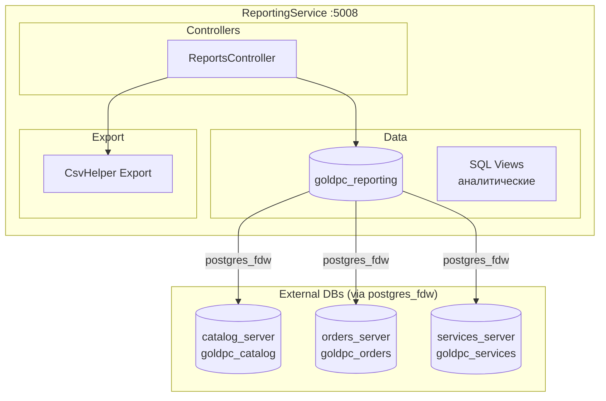
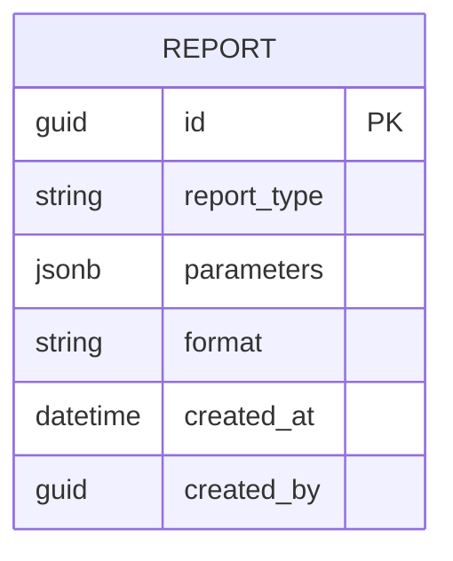

# Сервис отчётов (ReportingService)

## Краткое описание

ReportingService — микросервис для формирования отчётов и аналитики. Использует `postgres_fdw` для подключения к базам других сервисов и агрегации данных через SQL-представления (views).

## Назначение

- Формирование аналитических отчётов (продажи, заказы, услуги)
- Агрегация данных из нескольких сервисов через FDW
- Экспорт отчётов в CSV
- Предоставление данных для дашбордов админ-панели

## Где используется

- Административная панель (дашборды)
- Экспорт данных для бухгалтерии
- API Gateway

## Архитектура



## Контроллеры и Endpoints

### ReportsController

| Endpoint | Метод | Описание | Авторизация |
|----------|-------|----------|-------------|
| `/api/reports/sales` | GET | Отчёт по продажам за период | JWT (ReportsView) |
| `/api/reports/sales/export` | GET | Экспорт продаж в CSV | JWT (ReportsExport) |
| `/api/reports/orders` | GET | Отчёт по заказам | JWT (ReportsView) |
| `/api/reports/services` | GET | Отчёт по услугам | JWT (ReportsView) |
| `/api/reports/popular-products` | GET | Популярные товары | JWT (ReportsView) |
| `/api/reports/inventory` | GET | Отчёт по остаткам | JWT (ReportsView) |

## SQL Views (postgres_fdw)

ReportingService использует **postgres_fdw** для подключения к базам других сервисов:

```sql
-- Пример создания foreign server
CREATE SERVER catalog_server
  FOREIGN DATA WRAPPER postgres_fdw
  OPTIONS (host 'localhost', port '5434', dbname 'goldpc_catalog');

CREATE SERVER orders_server
  FOREIGN DATA WRAPPER postgres_fdw
  OPTIONS (host 'localhost', port '5434', dbname 'goldpc_orders');

CREATE SERVER services_server
  FOREIGN DATA WRAPPER postgres_fdw
  OPTIONS (host 'localhost', port '5434', dbname 'goldpc_services');
```

### Типы отчётов

| Отчёт | Источники | Описание |
|-------|-----------|----------|
| Sales | orders_server | Продажи по дням/неделям/месяцам |
| Orders by status | orders_server | Распределение по статусам |
| Popular products | orders_server, catalog_server | Топ товаров по продажам |
| Services analytics | services_server | Статистика сервисных заявок |
| Inventory | catalog_server | Остатки на складе |

## Экспорт CSV

Используется библиотека **CsvHelper** для генерации CSV-файлов:

- Разделитель: `;` (точка с запятой)
- Кодировка: UTF-8 BOM
- Поддержка фильтрации по датам

## Модели данных



## Зависимости

- **SharedKernel** — DTO
- **Shared** — Authorization (Permissions.ReportsView, Permissions.ReportsExport), Middleware
- **CsvHelper** — экспорт CSV
- **postgres_fdw** — федеративные запросы к БД других сервисов

## Связанные модули

- [[Сервис_каталога_CatalogService]] — источник данных о товарах
- [[Сервис_заказов_OrdersService]] — источник данных о заказах
- [[Сервис_услуг_ServicesService]] — источник данных об услугах
- [[Обзор_бэкенда]]
- [[Shared_SharedKernel]]

## Основные файлы

| Файл | Назначение |
|------|-----------|
| `src/ReportingService/Program.cs` | Точка входа (174 строки) |
| `src/ReportingService/Controllers/ReportsController.cs` | Endpoints отчётов |
| `src/ReportingService/Data/ReportingDbContext.cs` | DbContext |
| `src/ReportingService/Models/` | Модели отчётов |
| `src/ReportingService/Migrations/` | Миграции |

## Примеры кода

### Получение отчёта по продажам

```http
GET /api/reports/sales?from=2026-01-01&to=2026-05-24&groupBy=month
Authorization: Bearer <token>
```

### Экспорт в CSV

```http
GET /api/reports/sales/export?from=2026-01-01&to=2026-05-24
Authorization: Bearer <token>
Accept: text/csv
```

## Потенциальные проблемы

1. **FDW производительность** — запросы через postgres_fdw могут быть медленными
2. **Зависимость от схем** — изменения схем в других БД ломают FDW
3. **Нет кэширования** — каждый запрос выполняет полный агрегационный запрос
4. **Только 3 источника** — нет данных из WarrantyService и PCBuilderService
5. **Нет предрасчитанных агрегатов** — все отчёты формируются на лету

## Related Pages

- [[Обзор_бэкенда]]
- [[Сервис_каталога_CatalogService]]
- [[Сервис_заказов_OrdersService]]
- [[Сервис_услуг_ServicesService]]
- [[API_Gateway]]
- [[Shared_SharedKernel]]
