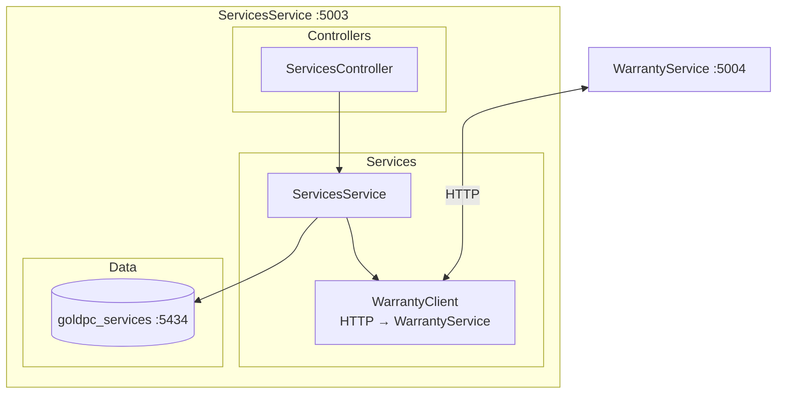
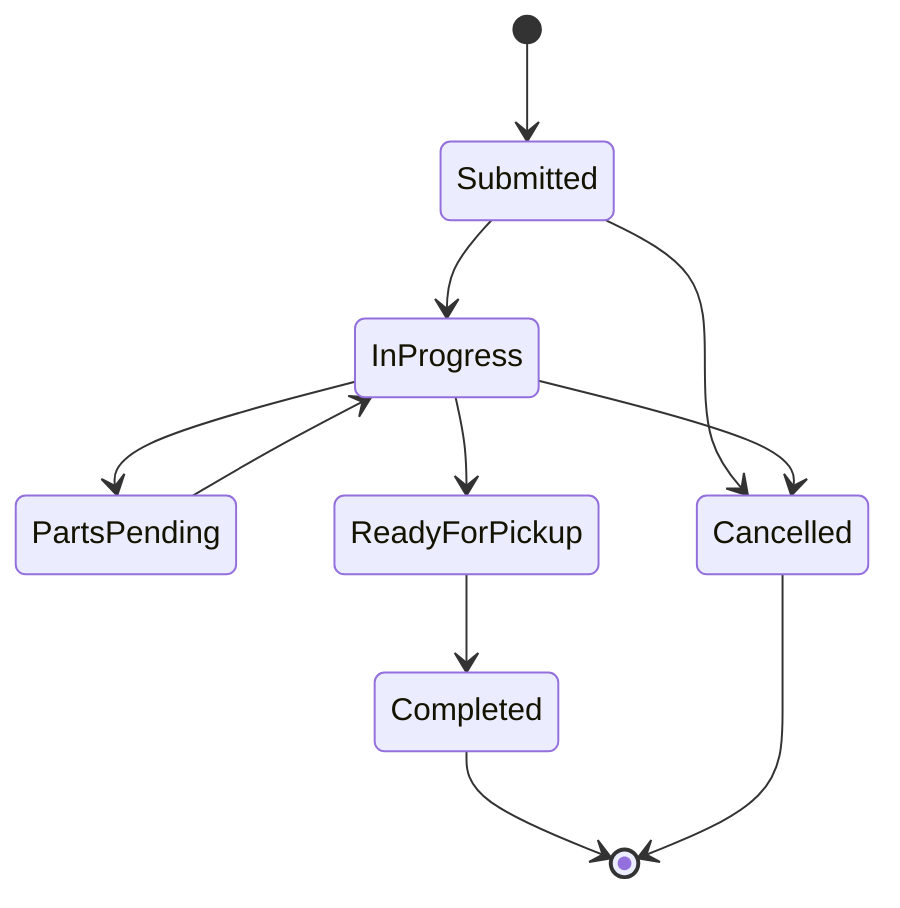
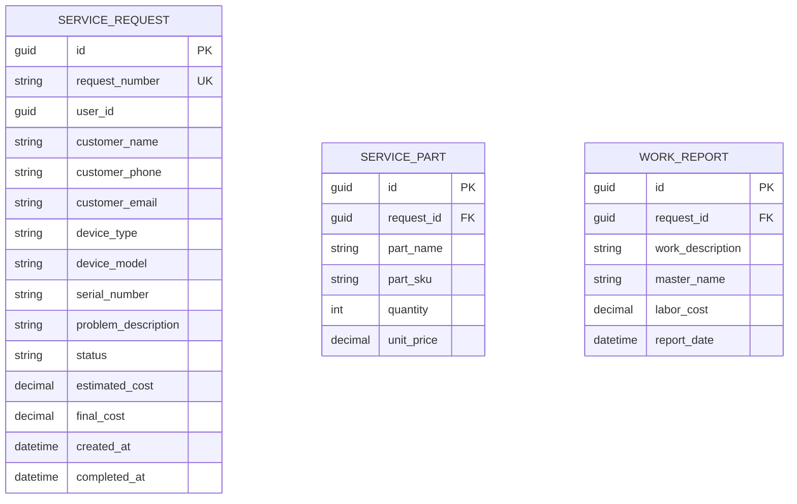

# Сервис услуг (ServicesService)

## Краткое описание

ServicesService — микросервис для управления сервисными заявками, ремонтом и обслуживанием компьютерной техники в GoldPC.

## Назначение

- Приём и обработка сервисных заявок
- Управление жизненным циклом заявки (6 статусов)
- Учёт запчастей и комплектующих
- Формирование отчётов о выполненной работе
- Интеграция с WarrantyService для гарантийного ремонта

## Где используется

- Фронтенд (форма заявки на ремонт, статус заявки)
- API Gateway
- WarrantyService (HTTP клиент)

## Архитектура



## FSM сервисной заявки



| Статус | Описание |
|--------|----------|
| `Submitted` (0) | Подана — клиент создал заявку |
| `InProgress` (1) | В работе — мастер выполняет |
| `PartsPending` (2) | Ожидание запчастей |
| `ReadyForPickup` (3) | Готова к выдаче |
| `Completed` (4) | Завершена, оплачена, выдана |
| `Cancelled` (5) | Отменена |

## Контроллеры и Endpoints

### ServicesController

| Endpoint | Метод | Описание | Авторизация |
|----------|-------|----------|-------------|
| `/api/services` | GET | Все заявки (пагинация) | JWT |
| `/api/services/{id}` | GET | Заявка по ID | JWT |
| `/api/services/my` | GET | Заявки текущего пользователя | JWT |
| `/api/services` | POST | Создать заявку | JWT |
| `/api/services/{id}/status` | PUT | Обновить статус | JWT |
| `/api/services/{id}/parts` | POST | Добавить запчасти | JWT |
| `/api/services/{id}/work-report` | POST | Отчёт о работе | JWT |
| `/api/services/{id}/close` | POST | Закрыть заявку | JWT |

## Модели данных



### ServiceRequest

- **RequestNumber** — уникальный номер заявки
- **DeviceType/Model** — тип и модель оборудования
- **ProblemDescription** — описание проблемы
- **Parts** — список заменённых/использованных запчастей
- **WorkReport** — отчёт мастера о выполненной работе

## Интеграция с WarrantyService

В Development используется **WarrantyClientMock**:

```csharp
builder.Services.AddSingleton<IWarrantyClient>(sp =>
{
    var logger = sp.GetRequiredService<ILogger<WarrantyClientMock>>();
    return new WarrantyClientMock(logger);
});
```

В Production — HTTP клиент к WarrantyService:

```csharp
builder.Services.AddHttpClient<IWarrantyClient, WarrantyClient>(client =>
{
    client.BaseAddress = new Uri("http://warranty-service:5004");
});
```

## Уведомления

Подключены через `AddProductionNotifications()`:

- SMTP (email) через SmtpEmailService
- SMS через Twilio/SMS.ru
- Моки в Development

## Зависимости

- **SharedKernel** — DTO (ServiceRequestDto, ServicePartDto, WorkReportDto), Enums (ServiceRequestStatus)
- **Shared** — Middleware, Notifications, WarrantyClient
- **WarrantyService** — проверка гарантии по серийному номеру

## Связанные модули

- [[Сервис_гарантии_WarrantyService]] — проверка гарантии
- [[Обзор_бэкенда]]
- [[Shared_SharedKernel]]

## Основные файлы

| Файл | Назначение |
|------|-----------|
| `src/ServicesService/Program.cs` | Точка входа (121 строка) |
| `src/ServicesService/Controllers/ServicesController.cs` | Endpoints заявок |
| `src/ServicesService/Services/ServicesService.cs` | Бизнес-логика |
| `src/ServicesService/Entities/ServiceRequest.cs` | Модель заявки |
| `src/ServicesService/Data/ServicesDbContext.cs` | DbContext |

## Примеры кода

### Создание сервисной заявки

```http
POST /api/services
Content-Type: application/json
Authorization: Bearer <token>

{
  "deviceType": "notebook",
  "deviceModel": "ASUS ROG Zephyrus G14",
  "serialNumber": "SN123456789",
  "problemDescription": "Не включается, чёрный экран",
  "customerPhone": "+375291234567"
}
```

## Потенциальные проблемы

1. **Нет фоновых задач** — просроченные заявки не обрабатываются
2. **Mock WarrantyClient** — в Development гарантия не проверяется
3. **Нету MassTransit** — события о статусе заявки не публикуются

## Related Pages

- [[Обзор_бэкенда]]
- [[Сервис_гарантии_WarrantyService]]
- [[API_Gateway]]
- [[Shared_SharedKernel]]
