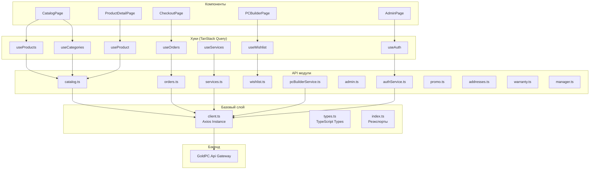
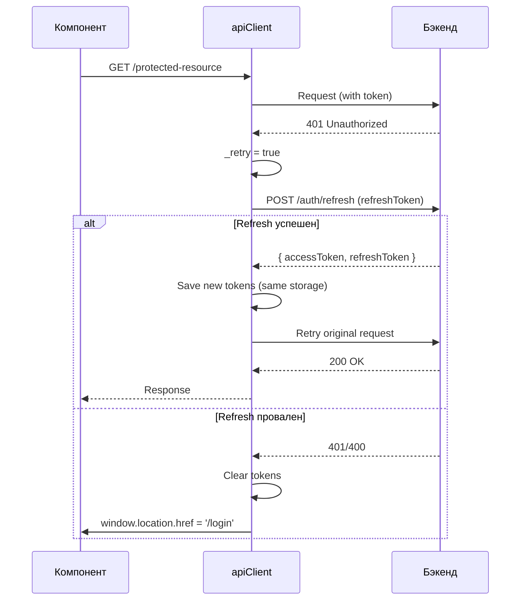

# API слой

> **Дата**: 2026-05-24 | **Статус**: Актуально | **Версия**: 1.0

---

## Краткое описание

API слой GoldPC построен на **Axios** с интерцепторами для авторизации и refresh токенов. Все запросы проходят через единый экземпляр `apiClient`. Поверх него — **TanStack Query** для кэширования и управления серверным состоянием.

---

## Архитектура API слоя



---

## Базовый клиент — `client.ts`

**Файл**: `src/frontend/src/api/client.ts`

### Конфигурация

```typescript
const BASE_URL = import.meta.env.VITE_API_URL || '/api/v1';

const apiClient = axios.create({
  baseURL: BASE_URL,
  headers: { 'Content-Type': 'application/json' },
  timeout: 10000,
});
```

### Интерцепторы

#### Request — добавление токена авторизации

```typescript
apiClient.interceptors.request.use((config) => {
  const token = localStorage.getItem('accessToken') 
    ?? sessionStorage.getItem('accessToken');
  if (token) {
    config.headers.Authorization = `Bearer ${token}`;
  }
  return config;
});
```

#### Response — refresh токена при 401



---

## API модули — полный список

### Каталог — `catalog.ts`

| Метод | Endpoint | Описание |
|-------|----------|----------|
| `getProducts(params?)` | `GET /catalog/products` | Список товаров с фильтрацией |
| `getProduct(id)` | `GET /catalog/products/:id` | Товар по ID |
| `getProductBySlug(slug)` | `GET /catalog/products/by-slug/:slug` | Товар по slug |
| `getProductReviews(id, page, size)` | `GET /catalog/products/:id/reviews` | Отзывы товара |
| `addProductReview(id, payload)` | `POST /catalog/products/:id/reviews` | Добавить отзыв |
| `updateProductReview(id, reviewId, payload)` | `PUT /catalog/products/:id/reviews/:reviewId` | Обновить отзыв |
| `deleteProductReview(id, reviewId)` | `DELETE /catalog/products/:id/reviews/:reviewId` | Удалить отзыв |
| `toggleHelpful(id, reviewId)` | `PATCH /catalog/products/:id/reviews/:reviewId/helpful` | Отметить полезным |
| `getCategories()` | `GET /catalog/categories` | Дерево категорий |
| `getFilterAttributes(slug, params?)` | `GET /catalog/categories/:slug/filter-attributes` | Атрибуты фильтра |
| `getFilterFacets(slug, params?)` | `GET /catalog/categories/:slug/filter-facets` | Фасетные данные |
| `getManufacturers(category?)` | `GET /catalog/manufacturers` | Производители |
| `checkStock(items)` | `POST /catalog/products/check-stock` | Проверка наличия |

**Маппинг категорий**: frontend slug ↔ backend slug:
```typescript
// Frontend → Backend
const FRONTEND_TO_BACKEND_SLUG = {
  cpu: 'processors', gpu: 'gpu', motherboard: 'motherboards',
  ram: 'ram', storage: 'storage', psu: 'psu',
  case: 'cases', cooling: 'coolers', fan: 'fans',
  monitor: 'monitors', keyboard: 'keyboards', mouse: 'mice',
  headphones: 'headphones',
};

// Русское название → Frontend slug
const CATEGORY_NAME_TO_SLUG = {
  'Процессоры': 'cpu', 'Видеокарты': 'gpu', /* ... */
};
```

**Параметры запроса `GetProductsParams`**:
```typescript
interface GetProductsParams {
  page?: number;
  pageSize?: number;
  category?: ProductCategory;
  manufacturerIds?: Uuid[];
  priceMin?: number;
  priceMax?: number;
  search?: string;
  rating?: number;
  sortBy?: 'name' | 'price' | 'rating' | 'createdAt';
  sortOrder?: 'asc' | 'desc';
  inStock?: boolean;
  isFeatured?: boolean;
  specifications?: Record<string, string | number | string[]>;
  specificationRanges?: Record<string, string>;
}
```

### Аутентификация — `authService.ts`

| Метод | Endpoint | Описание |
|-------|----------|----------|
| `login(credentials)` | `POST /auth/login` | Вход |
| `register(data)` | `POST /auth/register` | Регистрация |
| `logout()` | `POST /auth/logout` | Выход |
| `refreshToken(token)` | `POST /auth/refresh` | Обновление токенов |
| `getCurrentUser()` | `GET /auth/profile` | Текущий пользователь |
| `updateProfile(data)` | `PUT /auth/profile` | Обновление профиля |
| `changePassword(data)` | `POST /auth/change-password` | Смена пароля |
| `forgotPassword(data)` | `POST /auth/forgot-password` | Запрос восстановления |
| `resetPassword(data)` | `POST /auth/reset-password` | Сброс пароля |
| `validateResetToken(token)` | `POST /auth/validate-reset-token` | Валидация токена сброса |
| `sendVerificationEmail()` | `POST /auth/send-verification` | Отправка подтверждения email |
| `verifyEmail(token)` | `POST /auth/verify-email` | Подтверждение email |
| `enableTwoFactor()` | `POST /auth/security/2fa/enable` | Включить 2FA |
| `verifyTwoFactor(code)` | `POST /auth/security/2fa/verify` | Подтвердить 2FA |
| `disableTwoFactor(password)` | `POST /auth/security/2fa/disable` | Отключить 2FA |
| `getLoginHistory(page, size)` | `GET /auth/login-history` | История входов |
| `uploadAvatar(file)` | `POST /auth/avatar` | Загрузить аватар |
| `deleteAvatar()` | `DELETE /auth/avatar` | Удалить аватар |
| `getNotificationPreferences()` | `GET /auth/notification-preferences` | Настройки уведомлений |
| `updateNotificationPreferences(data)` | `PUT /auth/notification-preferences` | Обновить настройки |

### Заказы — `orders.ts`

| Метод | Endpoint | Описание |
|-------|----------|----------|
| `getDeliveryQuote(payload)` | `POST /orders/delivery/quote` | Расчёт доставки |
| `createOrder(data)` | `POST /orders` | Создать заказ |
| `getMyOrders(page, size, status?)` | `GET /orders/my` | Мои заказы |
| `getOrder(id)` | `GET /orders/:id` | Заказ по ID |
| `getOrderByNumber(number)` | `GET /orders/number/:number` | Заказ по номеру |
| `getOrderTracking(number)` | `GET /orders/number/:number` | Отслеживание |
| `cancelOrder(id)` | `POST /orders/:id/cancel` | Отменить заказ |

### Сервисный центр — `services.ts`

| Метод | Endpoint | Описание |
|-------|----------|----------|
| `getServiceTypes()` | `GET /services/types` | Типы услуг |
| `createService(data)` | `POST /services` | Создать заявку |
| `getMyServices(page, size)` | `GET /services/my` | Мои заявки |
| `getServiceById(id)` | `GET /services/:id` | Заявка по ID |

### PC Builder — `pcBuilderService.ts`

| Метод | Endpoint | Описание |
|-------|----------|----------|
| `checkCompatibilityAPI(components)` | `POST /pcbuilder/check-compatibility` | Проверка совместимости |
| `calculateFpsApi(params)` | `POST /pcbuilder/calculate-fps` | Расчёт FPS |

### Избранное — `wishlist.ts`

| Метод | Endpoint | Описание |
|-------|----------|----------|
| `getItems()` | `GET /wishlist` | Получить избранное |
| `addItem(productId)` | `POST /wishlist/:productId` | Добавить |
| `removeItem(productId)` | `DELETE /wishlist/:productId` | Удалить |
| `sync(items)` | `PUT /wishlist/sync` | Синхронизация |

### Промокоды — `promo.ts`

| Метод | Endpoint | Описание |
|-------|----------|----------|
| `validatePromoCode(data)` | `POST /promo/validate` | Валидация промокода |

### Адреса — `addresses.ts`

| Метод | Endpoint | Описание |
|-------|----------|----------|
| `getAddresses()` | `GET /auth/address` | Мои адреса |
| `getAddress(id)` | `GET /auth/address/:id` | Адрес по ID |
| `createAddress(data)` | `POST /auth/address` | Создать адрес |
| `updateAddress(id, data)` | `PUT /auth/address/:id` | Обновить адрес |
| `deleteAddress(id)` | `DELETE /auth/address/:id` | Удалить адрес |
| `setDefaultAddress(id)` | `PUT /auth/address/:id/default` | Сделать основным |

### Гарантии — `warranty.ts`

| Метод | Endpoint | Описание |
|-------|----------|----------|
| `getMyCards(page, size)` | `GET /warranty/card/my` | Мои гарантийные карты |
| `getCard(id)` | `GET /warranty/card/:id` | Карта по ID |

### Администрирование — `admin.ts`

| Метод | Endpoint | Описание |
|-------|----------|----------|
| **usersAdminApi** | | |
| `getUsers(params?)` | `GET /admin/users` | Список пользователей |
| `getUser(id)` | `GET /admin/users/:id` | Пользователь по ID |
| `updateUserRole(id, data)` | `PATCH /admin/users/:id/role` | Изменить роль |
| `deactivateUser(id)` | `POST /admin/users/:id/deactivate` | Деактивировать |
| `activateUser(id)` | `POST /admin/users/:id/activate` | Активировать |
| `updateUser(id, data)` | `PUT /admin/users/:id` | Обновить пользователя |
| `deleteUser(id)` | `DELETE /admin/users/:id` | Удалить пользователя |
| **catalogAdminApi** | | |
| `getProducts(params?)` | `GET /admin/products` | Все товары |
| `updateProduct(id, data)` | `PUT /admin/products/:id` | Обновить товар |
| `deleteProduct(id)` | `DELETE /admin/products/:id` | Удалить товар |
| `createProduct(data)` | `POST /admin/products` | Создать товар |
| **adsApi** | | |
| `getStats()` | `GET /admin/stats` | Статистика дашборда |
| **dictionariesApi** | | |
| `getCategories()` | `GET /admin/dictionaries/categories` | Категории |
| `getManufacturers()` | `GET /admin/dictionaries/manufacturers` | Производители |
| `getAttributes()` | `GET /admin/dictionaries/attributes` | Характеристики |
| `createItem(type, data)` | `POST /admin/dictionaries/:type` | Создать запись |
| `updateItem(type, id, data)` | `PUT /admin/dictionaries/:type/:id` | Обновить запись |
| `deleteItem(type, id)` | `DELETE /admin/dictionaries/:type/:id` | Удалить запись |
| **settingsApi** | | |
| `getSettings()` | `GET /admin/settings` | Настройки системы |
| `updateSettings(data)` | `PUT /admin/settings` | Обновить настройки |
| `resetSettings()` | `POST /admin/settings/reset` | Сбросить настройки |

### Менеджер — `manager.ts`

| Метод | Endpoint | Описание |
|-------|----------|----------|
| `getDashboardData()` | Composite | Данные дашборда |
| `getOrders(page, size, status?)` | `GET /orders` | Заказы |
| `getOrderById(id)` | `GET /orders/:id` | Заказ по ID |
| `getInventory(page, size)` | `GET /catalog/products` | Склад |

---

## TanStack Query конфигурация

**Файл**: `src/frontend/src/main.tsx`

```typescript
const queryClient = new QueryClient({
  defaultOptions: {
    queries: {
      staleTime: 5 * 60 * 1000,       // 5 минут — данные свежие
      gcTime: 24 * 60 * 60 * 1000,    // 24 часа — кэш для оффлайн
      retry: 1,                        // 1 повтор при ошибке
      refetchOnWindowFocus: false,     // Не рефетчить при фокусе
      networkMode: 'offlineFirst',     // PWA offline-first
    },
    mutations: {
      retry: 3,                        // 3 повтора для мутаций
      networkMode: 'offlineFirst',
      retryDelay: (attempt) => Math.min(1000 * 2 ** attempt, 30000),
    },
  },
});
```

### Query Keys

```typescript
// Продукты
productsKeys.all = ['products'];
productsKeys.lists = () => ['products', 'list'];
productsKeys.list = (params) => ['products', 'list', params];

// Один продукт
productKeys.all = ['product'];
productKeys.detail = (slug) => ['product', slug];

// Категории
categoriesKeys.all = ['categories'];
categoriesKeys.list = () => ['categories', 'list'];

// Услуги
servicesKeys.all = ['services'];
servicesKeys.lists = () => ['services', 'list'];
servicesKeys.list = (params) => ['services', 'list', params];
servicesKeys.detail = (slug) => ['services', 'detail', slug];
```

### Обёртка `useApi.ts`

Универсальные хуки для любых API запросов:

```typescript
// GET запрос
const { data, isLoading } = useApiQuery('/products');

// GET с параметрами
const { data } = useApiQueryWithParams(['/products', { category: 'gpu' }]);

// POST/PUT/DELETE
const { mutate } = useApiMutation((data) => api.post('/products', data));

// Утилиты кэша
const { invalidate, prefetch } = useApiUtils();
```

---

## Типы данных — `types.ts`

**Файл**: `src/frontend/src/api/types.ts`

### Основные типы

| Тип | Описание |
|-----|----------|
| `ProductCategory` | `'cpu' \| 'gpu' \| 'motherboard' \| 'ram' \| ...` (13 категорий) |
| `ProductSummary` | Краткая информация о товаре (для списков) |
| `Product` | Полная информация (extends ProductSummary) |
| `ProductReview` | Отзыв о товаре |
| `Category` | Категория с иерархией (parent/children) |
| `Manufacturer` | Производитель |
| `FilterAttribute` | Атрибут фильтрации (select/range) |
| `FilterFacetAttribute` | Фасетный атрибут с подсчётом |
| `PaginationMeta` | Метаданные пагинации |
| `PagedResponse<T>` | Generic ответ с пагинацией |
| `User` | Пользователь (с ролями) |
| `AuthResponse` | Ответ аутентификации (токены + user) |
| `Order` | Заказ |
| `Service` | Услуга сервисного центра |
| `Cart` | Корзина (серверная модель) |

---

## Обработка ошибок

**Стандартизированные сообщения** в `authService.ts`:

```typescript
const AUTH_ERROR_MESSAGES = {
  400: 'Некорректный запрос. Проверьте введенные данные.',
  401: 'Неверный email или пароль.',
  403: 'Этот аккаунт заблокирован.',
  404: 'Пользователь с таким email не найден.',
  409: 'Пользователь с таким email уже зарегистрирован.',
  422: 'Ошибка валидации данных.',
  429: 'Слишком много попыток входа.',
  500: 'Ошибка сервера.',
  503: 'Сервис временно недоступен.',
};
```

Функция `extractApiErrorMessage(payload)` в `orders.ts` извлекает сообщение из `ApiResponse.message` или первую ошибку валидации из `errors`.

---

## Зависимости

- **axios** — HTTP клиент
- **@tanstack/react-query** — серверное состояние
- **@tanstack/react-query-devtools** — девтулзы (только DEV + VITE_ENABLE_QUERY_DEVTOOLS=true)

---

## Связанные модули

- [[Обзор_фронтенда]] — архитектура
- [[Управление_состоянием_Zustand]] — клиентское состояние
- [[Хуки_и_утилиты]] — все TanStack Query хуки
- [[Каталог_и_фильтрация]] — catalog API
- [[ПК_конструктор]] — PC Builder API

---

## Потенциальные проблемы

1. **Duplicate `/admin/users` route** — в App.tsx строка 258-259, маршрут объявлен дважды.
2. **CatalogService vs catalog.ts** — два файла с похожим функционалом. `catalog.ts` — более полный (с facets, filter-attributes). `catalogService.ts` — устаревший, используется реже.
3. **Manager API composite** — `getDashboardData()` делает два параллельных запроса и объединяет результаты на клиенте. При падении одного из сервисов дашборд может отображать неполные данные.

---

> 🔗 **Связанные страницы**: [[Обзор_фронтенда]] | [[Хуки_и_утилиты]] | [[00_Index/Главный_индекс]]
