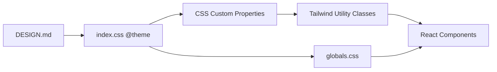
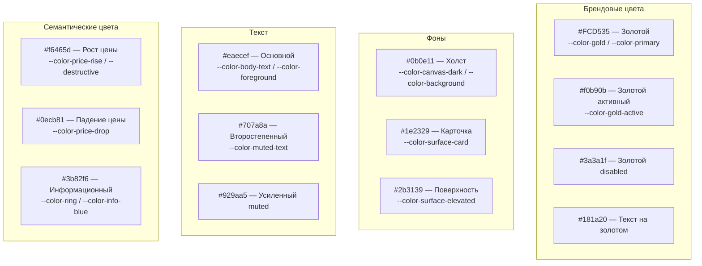
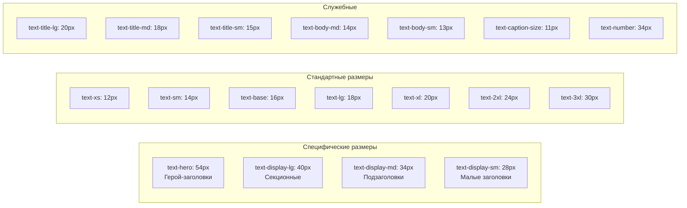

# Дизайн-система

> **Дата**: 2026-05-24 | **Статус**: Актуально | **Версия**: 2.0

---

## Краткое описание

Дизайн-система GoldPC реализована через Tailwind CSS v4 с кастомным `@theme` блоком в `index.css`. Цветовая схема — тёмная (dark mode), вдохновлённая Binance. Шрифты — Nunito Sans (отображение + текст) и Nunito (цифры).

---

## Источник истины



**Правило**: источник истины — `index.css` → Tailwind классы. Изменения вносятся в `index.css` через `@theme`, затем в компоненты. `globals.css` часто игнорируется из-за Tailwind override.

---

## Цветовая система

### Основная палитра



### Tailwind мапплинг

```css
--color-background: var(--color-canvas-dark);        /* bg-background */
--color-foreground: var(--color-body-text);           /* text-foreground */
--color-card: var(--color-surface-card);              /* bg-card */
--color-card-foreground: var(--color-body-text);      /* text-card-foreground */
--color-primary: var(--color-gold);                   /* bg-primary */
--color-primary-foreground: var(--color-gold-ink);    /* text-primary-foreground */
--color-secondary: var(--color-surface-elevated);     /* bg-secondary */
--color-muted: var(--color-surface-elevated);         /* bg-muted */
--color-muted-foreground: var(--color-muted-text);    /* text-muted-foreground */
--color-destructive: var(--color-price-rise);         /* bg-destructive */
--color-border: var(--color-hairline-dark);           /* border-border */
--color-input: var(--color-surface-elevated);         /* bg-input */
--color-ring: var(--color-info-blue);                 /* ring offset */
```

---

## Типографика

### Шрифты

| Назначение | Шрифт | Источник |
|------------|-------|----------|
| Отображение (display) | **Nunito Sans** | `/fonts/NunitoSans.woff2` |
| Основной текст (body) | **Nunito Sans** | `/fonts/NunitoSans.woff2` |
| Цифры и таблицы | **Nunito** | `/fonts/Nunito.woff2` |

```css
--font-sans: 'Nunito Sans', -apple-system, BlinkMacSystemFont, 'Segoe UI', sans-serif;
--font-display: 'Nunito Sans', ...;
--font-mono: 'Nunito', 'JetBrains Mono', 'IBM Plex Mono', ui-monospace, monospace;
```

### Размеры текста



### Font-weight токены

```css
--font-normal: 400;
--font-medium: 500;
--font-semibold: 600;
--font-bold: 700;
```

### Leading (межстрочный интервал)

```css
--leading-tight: 1.1;
--leading-snug: 1.25;
--leading-normal: 1.5;
--leading-relaxed: 1.625;
```

---

## Скругления (Border Radius)

```css
--radius-xs: 2px;      /* Минимальное */
--radius-sm: 4px;      /* Маленькое (кнопки) */
--radius-md: 6px;      /* Среднее (карточки) */
--radius-lg: 8px;      /* Большое (модалки) */
--radius-xl: 12px;     /* Очень большое */
--radius-pill: 9999px; /* Пилюля (бейджи) */
```

---

## Тени

```css
--shadow-lg: 0 8px 32px rgba(0, 0, 0, 0.3);        /* Тень модалок */
--shadow-gold: 0 0 20px rgba(252, 213, 53, 0.08);   /* Золотое свечение */
```

---

## Компонентные токены

```css
/* Компонентные переменные (CSS custom properties) */
--bg-primary: var(--color-surface-card);       /* Фон UI компонентов */
--bg-secondary: var(--color-canvas-dark);      /* Вторичный фон */
--bg-elevated: var(--color-surface-elevated);  /* Поднятый фон */
--fg-primary: var(--color-body-text);          /* Основной текст */
--fg-secondary: var(--color-muted-text);       /* Второстепенный текст */
--border-default: var(--color-hairline-dark);  /* Граница */
--border-muted: rgba(255, 255, 255, 0.06);     /* Бледная граница */
--brand-primary: var(--color-gold);            /* Брендовый цвет */
```

---

## Footer токены

```css
--footer-bg: #11151d;
--footer-divider: #1a1f27;
--footer-title: #929aa5;
--footer-link: #8a919e;
--footer-link-hover: #c9a84c;
--footer-copyright: #707a8a;
--footer-social: #5a6270;
--footer-social-hover: #c9a84c;
--footer-gold-muted: #c9a84c;
```

---

## Layout

```css
--layout-page-max: 1440px;       /* Максимальная ширина */
--layout-page-wide: 1440px;      /* Широкая страница */
--layout-page-checkout: 640px;   /* Узкая (чекаут) */
--layout-page-pad-x: 1rem;       /* Горизонтальный паддинг */
```

---

## Темная тема

Тёмная тема — единственная тема в приложении. Реализована через `@custom-variant dark`:

```css
@custom-variant dark (&:is(.dark *));
```

Все цвета определены в `@theme` блоке с тёмными значениями. При переключении на `.dark` класс используются те же переменные (они уже тёмные по умолчанию).

---

## Кастомные CSS классы

В `index.css` также определены кастомные классы, не покрываемые Tailwind:

```css
/* Табулярные цифры (цены, характеристики) */
.font-tabular {
  font-family: var(--font-mono);
  font-variant-numeric: tabular-nums;
}

/* Чекбоксы фильтрации */
.filter-checkbox { /* 20x20, золотой при checked */ }

/* Радиокнопки фильтрации */
.filter-radio { /* 20x20, золотой при checked */ }

/* Звёздочки рейтинга */
.star-filled { color: #FCD535; }
.star-empty { color: #9ca3af; }

/* Анимации карточек */
.product-card-transition {
  transition: background-color 150ms ease, box-shadow 150ms ease, transform 150ms ease;
}
```

---

## Зависимости

- **Tailwind CSS v4** — через `@tailwindcss/vite` плагин Vite
- **tw-animate-css** — CSS анимации для Tailwind
- **Nunito Sans** + **Nunito** — WOFF2 шрифты в `/public/fonts/`

---

## Связанные модули

- [[Обзор_фронтенда]] — архитектура
- [[Компонентная_система]] — как компоненты используют токены

---

## Потенциальные проблемы

1. **Spacing токены удалены** — кастомные `--spacing-*` были удалены, т.к. Tailwind v4.2 использует `--spacing-*` для `max-w-*`. Используйте rem-значения: `p-4` (16px), `p-6` (24px), `p-8` (32px).
2. **Тёмная тема жесткая** — переключение на светлую тему потребует значительных изменений в `@theme`.
3. **Globals.css vs Tailwind** — глобальные стили из `globals.css` часто переопределяются Tailwind классами в JSX. При изменениях типографики всегда проверяйте JSX.
4. **Hardcoded цвета** — в некоторых местах (звёзды, `filter-checkbox`) цвета заданы напрямую. При смене палитры их нужно обновлять вручную.

---

> 🔗 **Связанные страницы**: [[Обзор_фронтенда]] | [[Компонентная_система]] | [[00_Index/Главный_индекс]]
