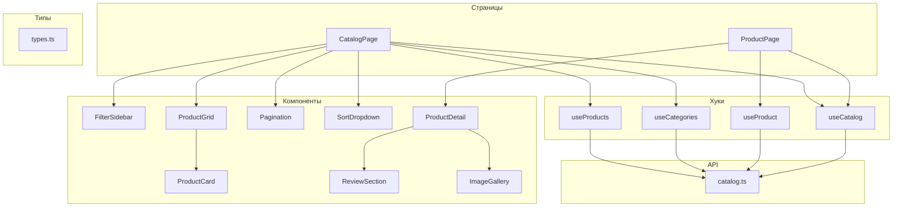
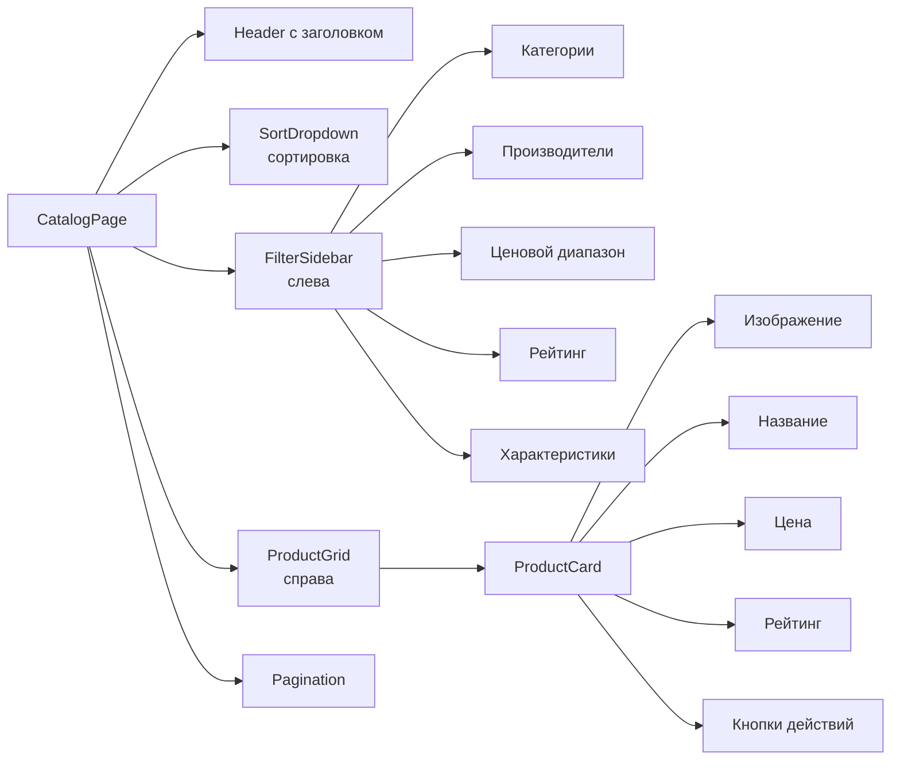
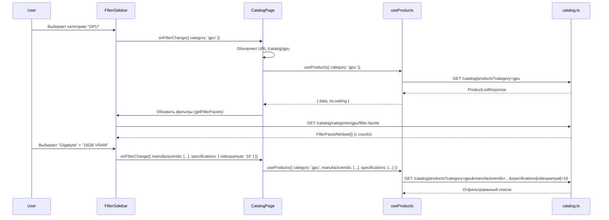

# Каталог и фильтрация

> **Дата**: 2026-05-24 | **Статус**: Актуально | **Версия**: 1.0

---

## Краткое описание

Модуль каталога — центральная часть интернет-магазина GoldPC. Реализует вывод списка товаров с фасетной фильтрацией, пагинацией, сортировкой и детальной страницей товара с отзывами.

---

## Архитектура каталога



---

## Категории товаров (13)

| Frontend slug | Русское название | Комплектующие ПК? |
|---------------|------------------|:---:|
| `cpu` | Процессоры | ✅ |
| `gpu` | Видеокарты | ✅ |
| `motherboard` | Материнские платы | ✅ |
| `ram` | Оперативная память | ✅ |
| `storage` | Накопители | ✅ |
| `psu` | Блоки питания | ✅ |
| `case` | Корпуса | ✅ |
| `cooling` | Охлаждение | ✅ |
| `fan` | Вентиляторы | ✅ |
| `monitor` | Мониторы | ❌ |
| `keyboard` | Клавиатуры | ❌ |
| `mouse` | Мыши | ❌ |
| `headphones` | Наушники | ❌ |

---

## CatalogPage — Страница каталога

**Файл**: `pages/CatalogPage.tsx`

**Маршрут**: `/catalog/:category?`

Параметр `:category` опционален. Если указан — каталог открывается с выбранной категорией.



---

## FilterSidebar — Фильтрация

**Файл**: `components/filter-sidebar/FilterSidebar.tsx` (1087 строк)

### Типы фильтров

| Фильтр | Тип | Описание |
|--------|-----|----------|
| **Категории** | Список | 13 категорий с иконками |
| **Производители** | Список + поиск | Поиск по названию, мультивыбор |
| **Цена** | RangeSlider | Двойной ползунок (мин/макс) |
| **Рейтинг** | Звёзды | От 1 до 5 |
| **Наличие** | Чекбокс | Только в наличии |
| **Характеристики** | Зависит от категории | Select или Range |

### Динамические характеристики

Набор характеристик зависит от выбранной категории. Например:

**GPU (Видеокарты)**:
- Год выпуска
- Производитель GPU
- Видеопамять (GB)
- Тип видеопамяти (GDDR6, GDDR6X...)
- Ширина шины
- Охлаждение
- Разъёмы питания
- Рекомендуемый БП

**CPU (Процессоры)**:
- Сокет (LGA1700, AM5...)
- Количество ядер
- Частота
- TDP
- Встроенная графика

### DualRangeSlider

**Файл**: `components/filter-sidebar/DualRangeSlider.tsx`

Кастомный двойной ползунок для ценового диапазона. Используется также в PC Builder.

---

## ProductCard — Карточка товара

Карточка отображается в сетке товаров и содержит:
- **Изображение** — основное фото товара
- **Название** — ссылка на детальную страницу
- **Цена** — текущая + старая (если есть скидка)
- **Рейтинг** — звёзды + количество отзывов
- **Бейджи** — "Хит", "Скидка", "Новинка"
- **Кнопки**:
  - 🛒 В корзину
  - ♡ В избранное
  - ⇄ Сравнить
  - 👁 Быстрый просмотр

---

## ProductPage — Детальная страница

**Маршрут**: `/product/:slug`

### Структура

| Секция | Описание |
|--------|----------|
| **Breadcrumbs** | Категория → Товар |
| **Image Gallery** | Галерея изображений с увеличением |
| **Product Info** | Название, цена, рейтинг, артикул, бренд |
| **Description** | Полное описание товара |
| **Specifications** | Таблица характеристик |
| **Reviews** | Отзывы + форма добавления |
| **Accessories** | Совместимые аксессуары |
| **Related Products** | Похожие товары |

### Review System

**API**: `GET /catalog/products/:id/reviews` | `POST/PUT/DELETE /catalog/products/:id/reviews/:reviewId`

```typescript
// Отзыв
interface ProductReview {
  id: Uuid;
  userName: string;
  rating: number;       // 1-5
  title?: string;
  comment?: string;
  pros?: string;         // Достоинства
  cons?: string;         // Недостатки
  isVerified: boolean;   // Куплено у нас
  helpful?: number;      // Полезно?
  createdAt: string;
}
```

Возможности:
- Добавление отзыва (только авторизованные)
- Оценка "полезно/не полезно"
- Пагинация отзывов (20 на страницу)

---

## Фильтрация — поток данных



---

## Сортировка

| Значение | Описание |
|----------|----------|
| `name-asc` | По названию (А-Я) |
| `name-desc` | По названию (Я-А) |
| `price-asc` | Сначала дешёвые |
| `price-desc` | Сначала дорогие |
| `rating-desc` | По рейтингу |
| `createdAt-desc` | Новинки |

---

## Пагинация

```typescript
interface PaginationMeta {
  page: number;       // Текущая страница
  pageSize: number;   // Элементов на странице (по умолчанию 12)
  totalPages: number; // Всего страниц
  totalItems: number; // Всего товаров
  hasNext: boolean;
  hasPrevious: boolean;
}
```

---

## Сравнение товаров

**Страница**: `ComparisonPage` (`/comparison`)

**Store**: [[04_Frontend/Управление_состоянием_Zustand#cartStore|Cart Store]]

**Движок**: `utils/comparison/comparisonEngine.ts`

- Лимит: 4 товара на категорию
- Сравнение по характеристикам
- Цветовая индикация: лучший/худший показатель
- Возможность добавить в корзину из сравнения

---

## Зависимости

- **React Router** — `useParams`, `useSearchParams`
- **TanStack Query** — `useProducts`, `useProduct`, `useCategories`
- **Zustand** — `comparisonStore`, `wishlistStore`, `cartStore`
- **Lucide** — иконки для фильтров

---

## Связанные модули

- [[API_слой]] — catalog.ts API
- [[Хуки_и_утилиты]] — useProducts, useProduct, useCategories, useCatalog
- [[Управление_состоянием_Zustand]] — comparisonStore, wishlistStore
- [[ПК_конструктор]] — интеграция каталога с PC Builder

---

## Потенциальные проблемы

1. **FilterSidebar монолит** — 1087 строк, содержит всю логику фильтрации, спецификации для всех категорий. При добавлении новой категории нужно обновлять `SPEC_ORDER`, `CATEGORY_LABELS`, `FRONTEND_TO_BACKEND`.
2. **Производительность** — при каждом изменении фильтра делается новый API запрос. Без дебаунса частые изменения могут создать нагрузку.
3. **SEO** — каталог с `?` параметрами не индексируется так же хорошо, как с `/catalog/category`. Используйте `/catalog/:category` для основных категорий.

---

> 🔗 **Связанные страницы**: [[Обзор_фронтенда]] | [[API_слой]] | [[Хуки_и_утилиты]] | [[00_Index/Главный_индекс]]
