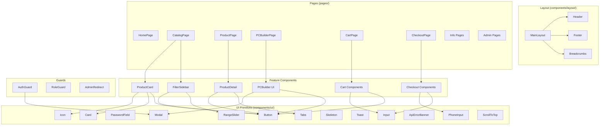
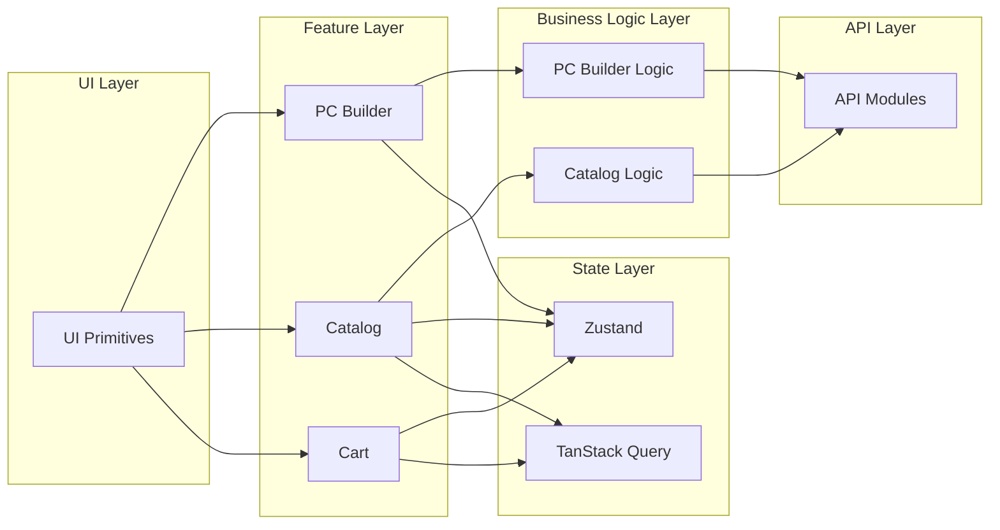

# Компонентная система

> **Дата**: 2026-05-24 | **Статус**: Актуально | **Версия**: 1.0

---

## Краткое описание

Компонентная система GoldPC построена по принципу **композиции**: примитивные UI компоненты → составные блоки → страницы. Feature-модули изолируют бизнес-логику (PC Builder, Catalog). Стилизация через Tailwind CSS с использованием design tokens из `index.css`.

---

## Иерархия компонентов



---

## UI Primitives — `components/ui/`

Базовые переиспользуемые компоненты. **Запрещено редактировать без явного одобрения** (см. [[20_Developer_Guides/Обзор_гайдов]]).

| Компонент | Файл | Описание |
|-----------|------|----------|
| `Button` | `Button/` | Кнопка с вариантами: `primary`, `secondary`, `ghost`, `danger`, `gold` |
| `Input` | `Input/Input.tsx` | Поле ввода с лейблом и ошибкой |
| `PasswordField` | `PasswordField/` | Поле пароля с переключателем видимости |
| `PhoneInput` | `PhoneInput.tsx` | Ввод телефона с автоформатированием `+375 (XX) XXX-XX-XX` |
| `Card` | `Card/` | Карточка с вариантами: `default`, `elevated`, `bordered`, `gold` |
| `Modal` | `Modal/` | Модальное окно с размерами: `small`, `default`, `large`, `fullWidth` |
| `Tabs` | `Tabs/` | Табы |
| `Skeleton` | `Skeleton/` | Скелетоны загрузки (базовый + `ProductCardSkeleton`) |
| `Toast` | `Toast/` | Уведомления (типы: `success`, `error`, `info`, `warning`) |
| `Icon` | `Icon/` | Иконки (обёртка над Lucide) |
| `ApiErrorBanner` | `ApiErrorBanner/` | Баннер ошибки API |
| `RangeSlider` | `RangeSlider/` | Двойной ползунок для цен |
| `ScrollToTop` | `ScrollToTop/` | Скролл наверх при смене роута |

### Примеры использования

```tsx
// Кнопка
<Button variant="gold" size="lg" onClick={handleClick}>
  В корзину
</Button>

// Модальное окно
<Modal size="large" onClose={handleClose}>
  <Modal.Header>Заголовок</Modal.Header>
  <Modal.Body>Содержимое</Modal.Body>
  <Modal.Footer>
    <Button variant="primary">Сохранить</Button>
  </Modal.Footer>
</Modal>

// Поле телефона
<PhoneInput
  value={phone}
  onChange={setPhone}
  error={phoneError}
  label="Номер телефона"
/>

// Скелетон карточки
<ProductCardSkeleton />
```

---

## Layout компоненты — `components/layout/`

### MainLayout

**Файл**: `MainLayout.tsx`

Основной layout приложения:
- `<Header />` — навигация, логотип, поиск, корзина, избранное
- `<Breadcrumbs />` — хлебные крошки
- `Router.Outlet` — содержимое страницы
- `<Footer />` — 6 колонок (Каталог, Услуги, Информация, Покупателям, Контакты)

### Header

**Файл**: `components/layout/Header.tsx`

- Логотип GoldPC
- Навигация: Каталог, ПК Конструктор, Услуги, Акции, Сервисный центр
- Поиск
- Иконки: Избранное, Сравнение, Корзина (счётчики)
- Кнопка "Войти" / Имя пользователя

### Footer

**Файл**: `components/layout/Footer.tsx`

6 колонок:
1. **Каталог** — ссылки на категории
2. **Услуги** — услуги сервисного центра
3. **Информация** — доставка, оплата, гарантия, возврат
4. **Покупателям** — FAQ, контакты, о нас
5. **Сервисный центр** — заявка на ремонт
6. **Контакты** — адрес, телефон, email, соцсети

---

## Feature компоненты

### FilterSidebar

**Файл**: `components/filter-sidebar/FilterSidebar.tsx` (1087 строк)

Боковая панель фильтрации каталога:
- Категории (13 шт)
- Производители (с поиском)
- Ценовой диапазон (DualRangeSlider)
- Рейтинг
- Наличие
- Характеристики (зависят от категории: сокет, VRAM, частота и т.д.)

Порядок характеристик определён в `SPEC_ORDER` для каждой категории.

### ProductCard

Карточка товара:
- Изображение
- Название
- Цена (с oldPrice)
- Рейтинг
- Кнопки: В корзину, В избранное, Сравнить
- Быстрый просмотр

### Checkout Components

- `PaymentForm` — форма оплаты
- `DeliveryTimeSlotPicker` — выбор времени доставки
- `AddressMap` — карта с адресом
- `QRCodePayment` — оплата по QR-коду

---

## Page компоненты

Все страницы расположены в `src/pages/`. Основные:

| Категория | Страницы |
|-----------|----------|
| **Главная** | `HomePage` |
| **Каталог** | `CatalogPage`, `ProductPage`, `ComparisonPage` |
| **Заказы** | `CartPage`, `CheckoutPage`, `OrderSuccessPage`, `OrderTrackingPage` |
| **ПК** | `PCBuilderPage`, `BuildWizardPage` |
| **Аккаунт** | `AccountOverview`, `AccountProfile`, `AccountOrders`, `AccountRepairs`, `AccountWarranty`, `AccountSavedBuilds` |
| **Сервис** | `ServicesPage`, `ServiceDetailPage`, `ServiceRequestPage` |
| **Инфо** | `DeliveryPage`, `PaymentPage`, `WarrantyPage`, `ReturnsPage`, `FaqPage`, `ContactsPage`, `PrivacyPage`, `TermsPage`, `BrandsPage`, `AboutPage` |
| **Аутентификация** | `ForgotPasswordPage`, `ResetPasswordPage`, `VerifyEmailPendingPage`, `VerifyEmailTokenPage` |
| **Админ** | `UserManagementPage`, `UserFormPage`, `CatalogManagementPage`, `CoordinatorDashboard` |
| **Менеджер** | `ManagerDashboard`, `OrdersPage`, `OrderDetailPage`, `InventoryPage` |
| **Мастер** | `TicketsPage`, `TicketDetailPage` |
| **Бухгалтер** | `ReportsPage`, `ExportPage` |

---

## Использование design tokens

Компоненты используют токены через Tailwind классы:

```tsx
// Цвета
className="bg-primary text-primary-foreground"  // золотой фон, тёмный текст
className="bg-card text-card-foreground"         // карточка
className="text-muted-foreground"                // второстепенный текст
className="border-border"                        // границы

// Отступы (rem-based)
className="p-4"  // padding: 1rem (16px)
className="p-6"  // padding: 1.5rem (24px)
className="p-8"  // padding: 2rem (32px)

// Типографика
className="text-hero"        // 54px — заголовки героев
className="text-display-lg"  // 40px
className="text-display-md"  // 34px
className="text-display-sm"  // 28px
className="text-title-lg"    // 20px
className="text-title-md"    // 18px
className="text-body-md"     // 14px (основной текст)
className="text-body-sm"     // 13px
className="text-caption-size" // 11px

// Скругления
className="rounded-sm"  // 4px
className="rounded-md"  // 6px
className="rounded-lg"  // 8px
className="rounded-xl"  // 12px
```

---

## Модульная диаграмма зависимостей



---

## Зависимости

- **React 19** — `createElement`, `useState`, `useEffect`, `useMemo`, `useCallback`
- **Tailwind CSS v4** — вся стилизация
- **Lucide React** — иконки
- **React Router** — `Link`, `useNavigate`, `useParams`, `Outlet`

---

## Связанные модули

- [[Дизайн_система]] — реализация design tokens
- [[Обзор_фронтенда]] — архитектура
- [[Структура_роутинга]] — страницы и маршруты
- [[Каталог_и_фильтрация]] — компоненты каталога
- [[ПК_конструктор]] — компоненты PC Builder

---

## Потенциальные проблемы

1. **FilterSidebar (1087 строк)** — огромный файл с монолитной логикой. Нуждается в рефакторинге на более мелкие компоненты.
2. **UI primitives** — строгий запрет на редактирование без одобрения. При необходимости изменений — через `design.md` → `index.css` → компоненты.
3. **ProductCard** — дублирование логики между разными страницами (каталог, избранное, сравнение). Рассмотреть создание единого компонента с конфигурацией.

---

> 🔗 **Связанные страницы**: [[Обзор_фронтенда]] | [[Дизайн_система]] | [[00_Index/Главный_индекс]]
