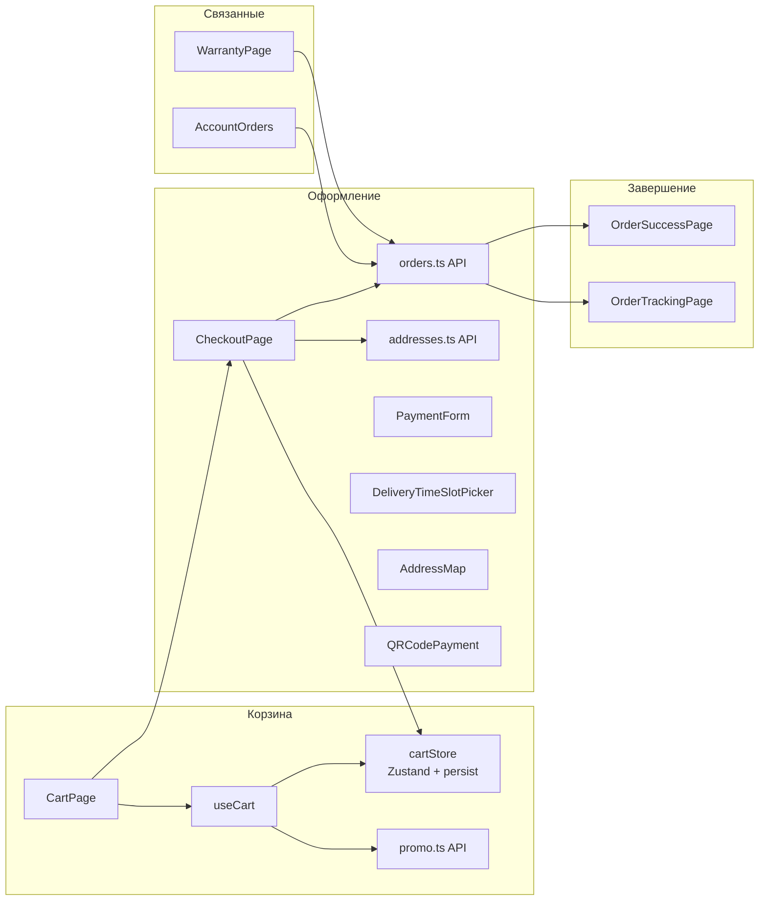
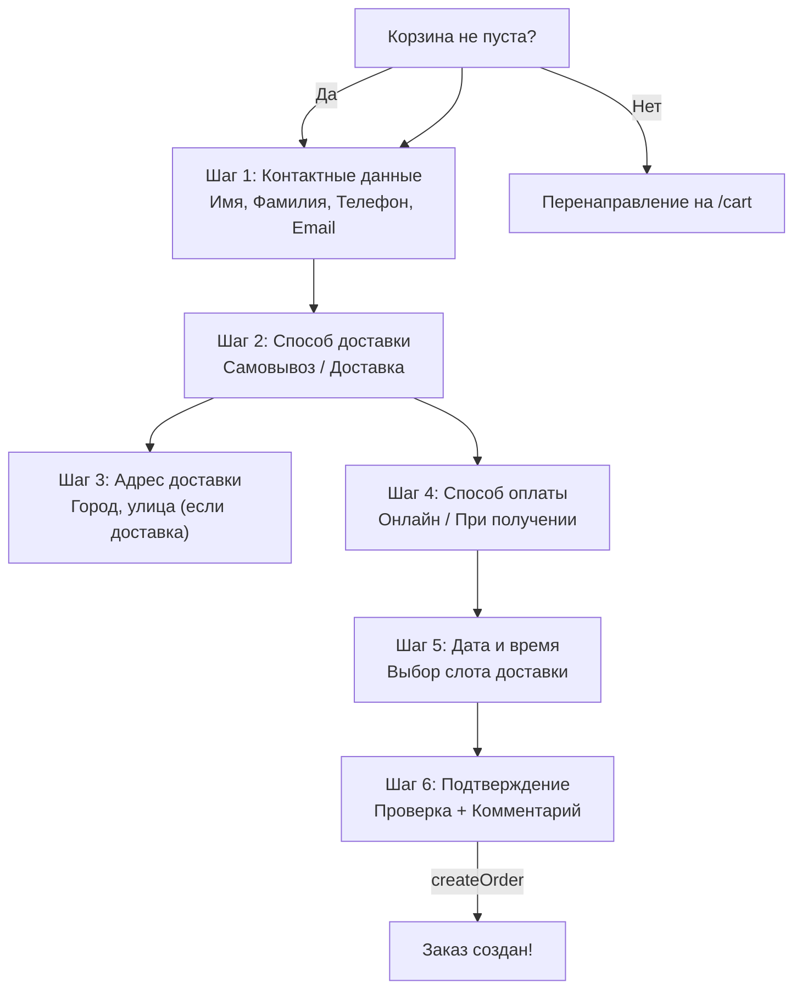
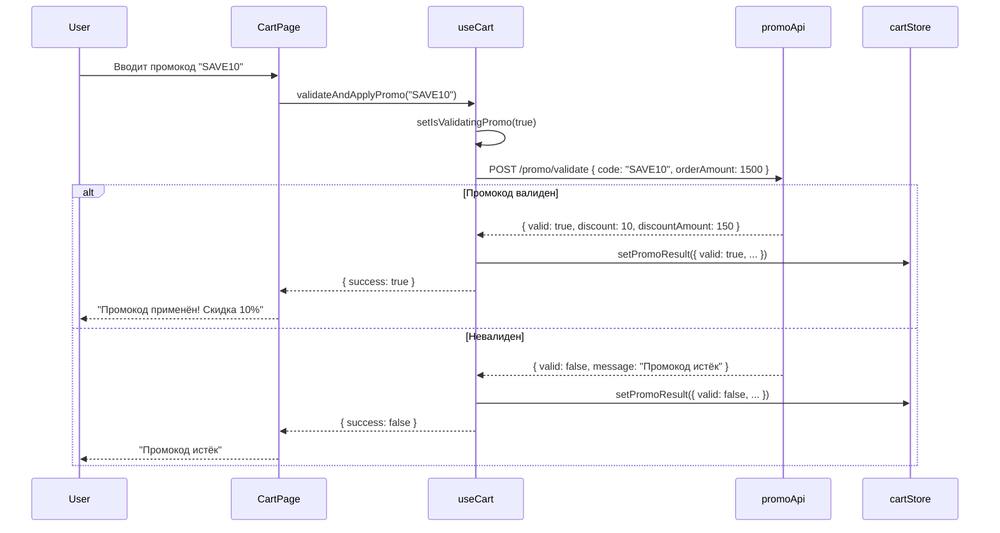
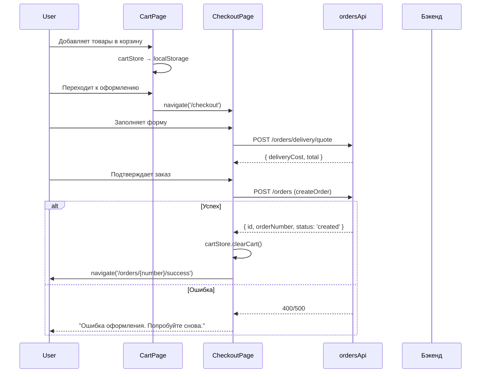

# Корзина и оформление заказа

> **Дата**: 2026-05-24 | **Статус**: Актуально | **Версия**: 1.0

---

## Краткое описание

Модуль корзины и оформления заказа реализует полный цикл покупки: добавление товаров → управление корзиной → промокоды → оформление → оплата → подтверждение.

---

## Архитектура



---

## CartPage — Корзина

**Маршрут**: `/cart`

### Структура страницы

| Секция | Описание |
|--------|----------|
| **Список товаров** | Карточки с изображением, названием, ценой, quantity |
| **Промокод** | Поле ввода + кнопка "Применить" |
| **Итого** | Сумма, скидка, доставка, общий итог |
| **Кнопка** | "Перейти к оформлению" |

### Функциональность

- Изменение количества (+/-)
- Удаление товара
- Применение промокода (валидация через `POST /promo/validate`)
- Очистка корзины
- Автосохранение (Zustand persist)

---

## CheckoutPage — Оформление заказа

**Маршрут**: `/checkout`

### Пошаговый процесс



### CreateOrderRequest

```typescript
interface CreateOrderRequest {
  firstName: string;
  lastName: string;
  phone: string;
  email: string;
  deliveryMethod: 'Pickup' | 'Delivery';
  paymentMethod: 'Online' | 'OnReceipt';
  address?: string;          // Для доставки
  city?: string;
  comment?: string;
  promoCode?: string;
  discountAmount?: number;
  deliveryDate?: string;
  deliveryTimeSlot?: string;
  items: CreateOrderItem[];
}
```

### Доставка

Возможные способы:
- **Pickup** — самовывоз из магазина
- **Delivery** — доставка курьером

Расчёт стоимости доставки:

```typescript
// POST /orders/delivery/quote
interface DeliveryQuoteRequest {
  deliveryMethod: 'Pickup' | 'Delivery';
  subtotal: number;
  city?: string;
}

interface DeliveryQuoteResponse {
  subtotal: number;
  deliveryCost: number;
  total: number;
}
```

### Выбор времени доставки

**Компонент**: `DeliveryTimeSlotPicker`

Позволяет выбрать дату и временной слот. Данные приходят с бэкенда (доступные слоты).

### Оплата

**Методы оплаты**:
- **Online** — оплата картой на сайте (Stripe integration)
- **OnReceipt** — оплата при получении

**Компоненты**:
- `PaymentForm` — форма ввода данных карты
- `QRCodePayment` — оплата по QR-коду (ЕРИП)

---

## OrderSuccessPage — Успешный заказ

**Маршрут**: `/orders/:orderNumber/success`

Отображается после успешного создания заказа:
- Номер заказа
- Спасибо за покупку
- Ссылка на отслеживание
- Кнопка "Продолжить покупки"

---

## OrderTrackingPage — Отслеживание заказа

**Маршрут**: `/orders/:orderNumber/tracking`

Отображает статус заказа и историю изменений:
- Текущий статус (с цветовой индикацией)
- Timeline изменений статусов
- Информация о доставке
- Трек-номер (если есть)

---

## Промокоды

**API**: `POST /promo/validate`

```typescript
interface ValidatePromoCodeRequest {
  code: string;
  orderAmount: number;
}

interface ValidatePromoCodeResponse {
  valid: boolean;
  discount: number;       // Процент скидки
  message: string;
  discountAmount: number; // Сумма скидки
}
```

Поток валидации:



---

## Полный поток покупки



---

## CartStore — детали

Подробно: [[04_Frontend/Управление_состоянием_Zustand#1. cartStore]]

Ключевые особенности:

- **Persist**: сохраняется в localStorage под ключом `goldpc-cart`
- **Промокоды**: хранятся вместе с корзиной
- **Миграция**: при изменении структуры данных — функция `migrate()` в persist
- **Compute**: `getTotal()`, `getItemCount()`, `getDiscountedTotal()` — вычисляются на лету

---

## Order — модель данных

```typescript
interface Order {
  id: string;
  userId: string;
  orderNumber: string;
  customerFirstName: string;
  customerLastName: string;
  customerPhone: string;
  customerEmail: string;
  status: string;               // created, confirmed, shipped, completed, cancelled
  total: number;
  subtotal: number;
  deliveryCost: number;
  discountAmount: number;
  deliveryMethod: string;       // Pickup | Delivery
  paymentMethod: string;        // Online | OnReceipt
  address?: string;
  promoCode?: string;
  deliveryDate?: string;
  deliveryTimeSlot?: string;
  trackingNumber?: string;
  createdAt: string;
  updatedAt?: string;
  items: OrderItem[];
}
```

---

## Зависимости

- **Zustand** — cartStore
- **Axios** — API вызовы (orders, promo, addresses)
- **React Router** — навигация между шагами

---

## Связанные модули

- [[Управление_состоянием_Zustand]] — cartStore, toastStore
- [[API_слой]] — orders.ts, promo.ts, addresses.ts
- [[Хуки_и_утилиты]] — useCart, useOrders, useAddresses
- [[ПК_конструктор]] — добавление сборки в корзину

---

## Потенциальные проблемы

1. **Несохранённая корзина при очистке localStorage** — если пользователь чистит localStorage, корзина теряется. Рекомендуется синхронизация корзины с сервером для авторизованных пользователей (пока не реализована).
2. **Промокоды только на клиенте** — валидация промокода происходит на бэкенде, но скидка применяется на клиенте. При создании заказа `discountAmount` передаётся в запросе, и бэкенд должен перепроверить.
3. **Доставка без гео-провайдера** — адрес вводится вручную, без интеграции с картами/геокодером (кроме `AddressMap`).
4. **Отсутствие единого флоу** — чекаут реализован как одна страница, а не как пошаговая форма с валидацией каждого шага. Возможна потеря данных при ошибке.

---

> 🔗 **Связанные страницы**: [[Обзор_фронтенда]] | [[Управление_состоянием_Zustand]] | [[API_слой]] | [[00_Index/Главный_индекс]]
