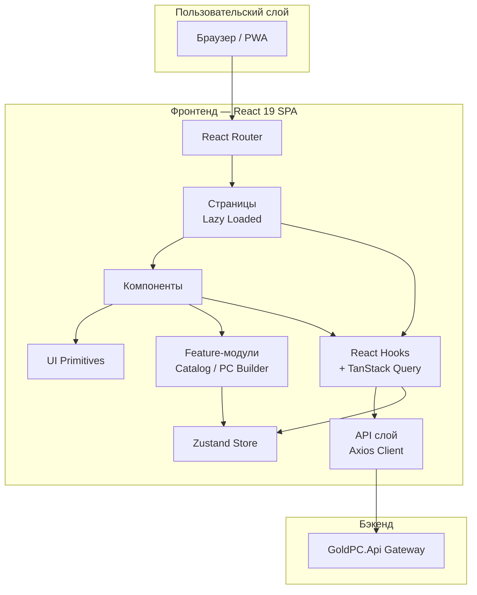
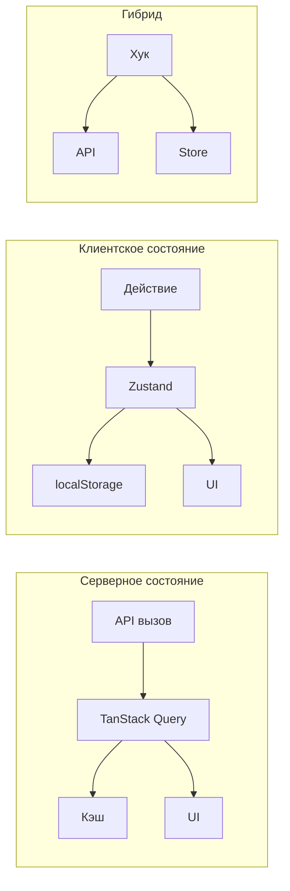
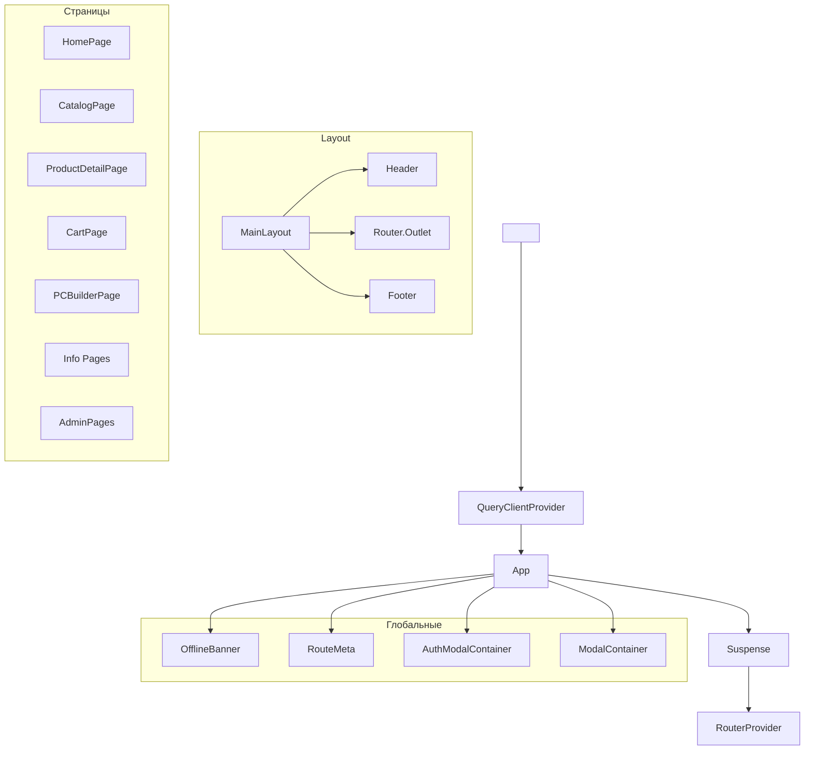

# 04 — Обзор фронтенда

> **Дата**: 2026-05-24 | **Статус**: Активная разработка | **Версия**: 1.0

---

## Краткое описание

Фронтенд **GoldPC** — одностраничное приложение (SPA) на React 19 с TypeScript, построенное на Vite 8. Реализует интернет-магазин компьютерных комплектующих, интерактивный конструктор ПК, систему управления сервисным центром и панели административных ролей.

---

## Назначение

Обеспечение пользовательского интерфейса для:
- **Покупателей**: каталог, корзина, оформление заказов, отслеживание
- **Сборщиков ПК**: визуальный конструктор с проверкой совместимости
- **Менеджеров**: управление заказами и складом
- **Мастеров**: заявки на ремонт и обслуживание
- **Администраторов**: управление пользователями, каталогом, настройками
- **Бухгалтеров**: отчёты и экспорт данных

---

## Архитектура

### Стек технологий

| Технология | Версия | Назначение |
|------------|--------|------------|
| React | 19 | UI библиотека |
| Vite | 8 | Сборщик, HMR, lazy loading |
| TypeScript | 5+ | Типизация |
| Tailwind CSS | 4 | Утилитарная стилизация |
| Zustand | 4+ | Управление состоянием |
| TanStack Query | 5 | Серверное состояние, кэширование |
| React Router | 7+ | Маршрутизация |
| Axios | 1+ | HTTP клиент |
| Lucide React | — | Иконки |

### Ключевые принципы

1. **Lazy loading** — каждая страница загружается асинхронно через `React.lazy()`
2. **Code splitting** — автоматическое разделение кода Vite на чанки по роутам
3. **Offline-first** — PWA поддержка, `networkMode: 'offlineFirst'` в TanStack Query
4. **Тёмная тема** — весь UI построен на тёмной цветовой схеме (dark mode)
5. **Design tokens** — все цвета, отступы, типографика через CSS custom properties в Tailwind `@theme`

### Архитектурная диаграмма



---

## Поток данных



- **Серверное состояние** (TanStack Query): данные каталога, заказов, услуг — кэшируются с `staleTime: 5 мин`
- **Клиентское состояние** (Zustand): корзина, избранное, toast-уведомления, модальные окна — с персистентностью в localStorage
- **Гибридные хуки**: `useAuth`, `useCart` — объединяют API вызовы и Zustand store в единый интерфейс

---

## Структура директорий

```
src/frontend/src/
├── api/                    # API слой (17 файлов)
│   ├── client.ts           # Axios instance с интерцепторами
│   ├── types.ts            # TypeScript типы (Product, Order, User...)
│   ├── index.ts            # Реэкспорты
│   ├── catalog.ts          # Каталог: продукты, категории, фильтры
│   ├── catalogService.ts   # Альтернативный сервис каталога
│   ├── authService.ts      # Аутентификация (login, register, 2FA)
│   ├── orders.ts           # Заказы (create, get, cancel)
│   ├── services.ts         # Сервисный центр (заявки, статусы)
│   ├── pcBuilderService.ts # PC Builder (совместимость, FPS)
│   ├── wishlist.ts         # Избранное (sync с сервером)
│   ├── promo.ts            # Промокоды
│   ├── addresses.ts        # Адреса доставки
│   ├── admin.ts            # Администрирование (users, catalog, stats)
│   ├── manager.ts          # Менеджер (dashboard, orders, inventory)
│   ├── warranty.ts         # Гарантии
│   └── keycloak.ts         # Keycloak OIDC интеграция
├── store/                  # Zustand хранилища
│   ├── cartStore.ts        # Корзина (persist)
│   ├── authStore.ts        # Аутентификация
│   ├── wishlistStore.ts    # Избранное (persist)
│   ├── toastStore.ts       # Toast-уведомления
│   ├── modalStore.ts       # Модальные окна (стек)
│   ├── authModalStore.ts   # Модалки аутентификации
│   ├── comparisonStore.ts  # Сравнение товаров (persist)
│   ├── comparisonLimits.ts # Лимиты сравнения
│   └── index.ts            # Реэкспорты
├── components/
│   ├── ui/                 # UI примитивы (Button, Input, Modal...)
│   ├── layout/             # Header, Footer, Breadcrumbs, MainLayout
│   ├── catalog/            # Feature-компоненты каталога
│   ├── filter-sidebar/     # Боковая панель фильтрации
│   ├── pc-builder/         # Компоненты конструктора ПК
│   ├── cart/               # Компоненты корзины
│   ├── checkout/           # Компоненты оформления заказа
│   ├── auth/               # Формы аутентификации
│   ├── product-card/       # Карточки товаров
│   ├── product/            # Детальная страница товара
│   ├── guards/             # Guard-компоненты (RoleGuard, AuthGuard)
│   ├── admin/              # Компоненты админки
│   ├── seo/                # SEO (RouteMeta)
│   ├── notification-center/ # Центр уведомлений
│   ├── account/            # Компоненты личного кабинета
│   ├── feedback/           # Компоненты обратной связи
│   └── errors/             # Компоненты ошибок
├── pages/                  # Страницы (28 директорий)
│   ├── home-page/          # Главная
│   ├── catalog-page/       # Каталог
│   ├── product-page/       # Детальная товара
│   ├── cart-page/          # Корзина
│   ├── checkout-page/      # Оформление заказа
│   ├── pc-builder-page/    # Конструктор ПК
│   ├── account-page/       # Личный кабинет (orders, profile, repairs)
│   ├── info/               # Информационные страницы
│   ├── admin/              # Админка
│   ├── manager/            # Панель менеджера
│   └── ...                 # Остальные страницы
├── hooks/                  # React хуки (29 файлов)
├── features/               # Feature-модули
│   ├── catalog/            # Логика каталога (типы)
│   └── pc-builder/         # Логика конструктора ПК
│       └── logic/          # Чистая бизнес-логика
├── utils/                  # Утилиты
│   ├── phone.ts            # Форматирование телефона
│   ├── cardValidation.ts   # Валидация карт
│   ├── specifications.ts   # Работа с характеристиками
│   ├── comparison/         # Логика сравнения
│   └── ...                 # и другие
├── styles/                 # Стили
│   ├── globals.css         # Глобальные стили
│   ├── tokens.css          # Старые токены (оболочка)
│   └── staff.css           # Стили панелей
├── index.css               # Tailwind @theme + @font-face
├── App.tsx                 # Роутер + глобальные компоненты
└── main.tsx                # Точка входа (QueryClientProvider)
```

---

## Компонентная иерархия



---

## Зависимости

- **React 19** + **React DOM**
- **Vite 8** — сборка и дев-сервер
- **TypeScript 5** — типизация
- **Tailwind CSS v4** — стилизация (`@tailwindcss/vite`)
- **@tanstack/react-query** + **@tanstack/react-query-devtools** — серверное состояние
- **Zustand** — клиентское состояние (с `persist` middleware)
- **Axios** — HTTP клиент с интерцепторами
- **React Router** — маршрутизация (`createBrowserRouter`)
- **Lucide React** — иконки
- **crypto-js** — хеширование на клиенте
- **Keycloak-js** — OIDC аутентификация (опционально, prod)
- **tw-animate-css** — анимации Tailwind

---

## Связанные модули

- [[Структура_роутинга]] — все маршруты приложения
- [[Управление_состоянием_Zustand]] — детальное описание store
- [[API_слой]] — API интеграция
- [[Компонентная_система]] — иерархия компонентов
- [[Дизайн_система]] — реализация дизайн-системы
- [[Хуки_и_утилиты]] — кастомные хуки и утилиты
- [[Каталог_и_фильтрация]] — каталог и фильтры
- [[ПК_конструктор]] — PC Builder
- [[Корзина_и_оформление_заказа]] — корзина и checkout
- [[02_Architecture/Архитектура_системы]] — общая архитектура

---

## Основные файлы

| Файл | Назначение |
|------|------------|
| `src/frontend/src/main.tsx` | Точка входа, QueryClient, PWA |
| `src/frontend/src/App.tsx` | Роутер, глобальные компоненты |
| `src/frontend/src/index.css` | Tailwind @theme, шрифты, токены |
| `src/frontend/vite.config.ts` | Конфигурация Vite |

---

## Потенциальные проблемы

1. **Лимит lazy loading** — `React.lazy()` не retry при ошибке загрузки чанка. PC Builder загружается **eager** (не лениво) именно по этой причине.
2. **Persist middleware** — `authStore` НЕ использует `persist` из-за бага, вместо этого — ручное сохранение в `localStorage`.
3. **Производительность фильтрации** — FilterSidebar (1087 строк) содержит много логики спецификаций inline. При большом количестве фильтров возможны задержки.
4. **Совместимость Tailwind v4.2** — кастомные `--spacing-*` удалены, т.к. они переопределяли `max-w-*` классы.

---

> 🔗 **Связанные страницы**: [[00_Index/Главный_индекс]] | [[02_Architecture/Архитектура_системы]] | [[20_Developer_Guides/Как_поднять_проект]]
