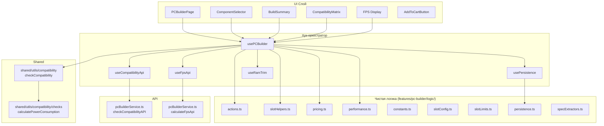
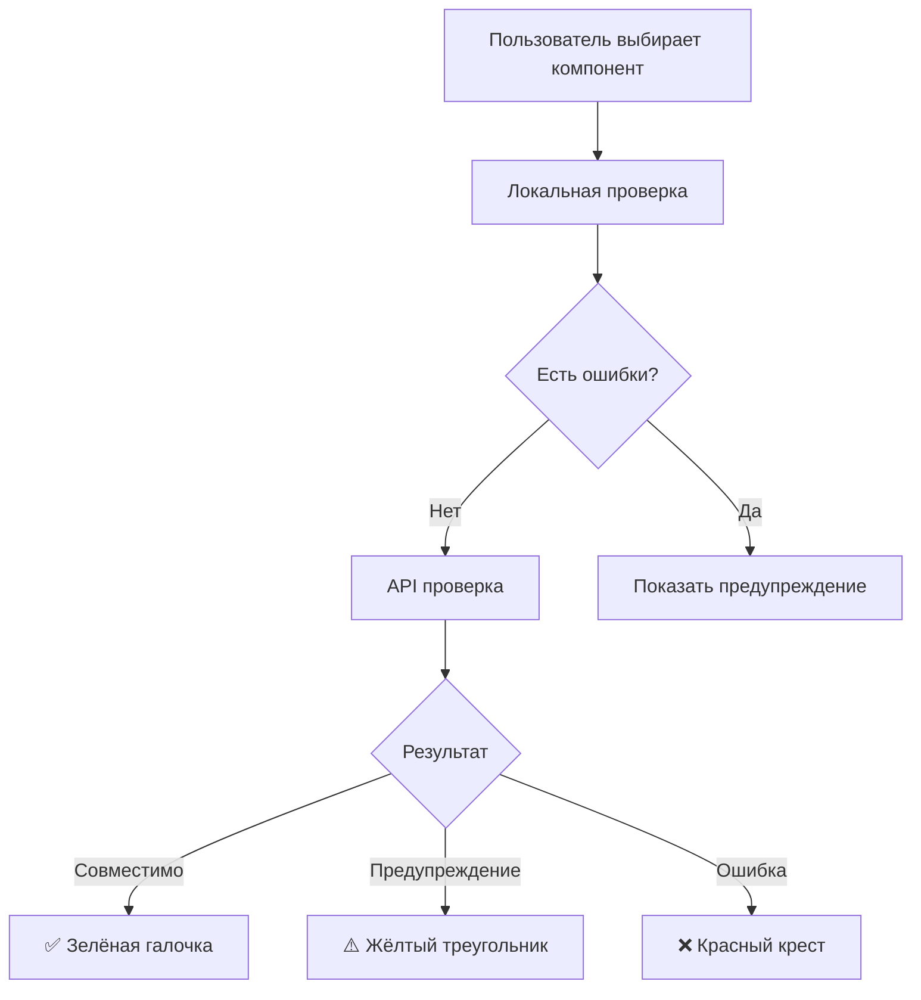
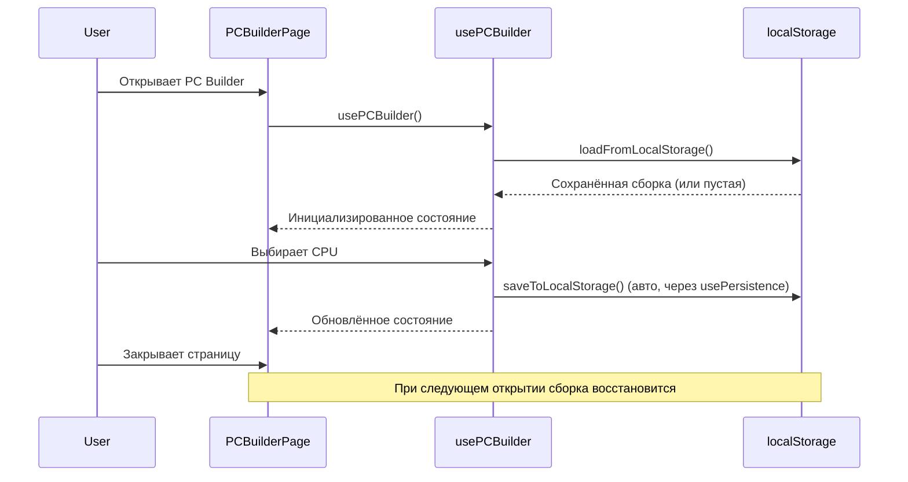

# ПК Конструктор (PC Builder)

> **Дата**: 2026-05-24 | **Статус**: Актуально | **Версия**: 2.0

---

## Краткое описание

PC Builder — ключевая функция GoldPC. Позволяет пользователю собрать компьютер из совместимых компонентов в реальном времени с проверкой совместимости, расчётом энергопотребления, FPS и стоимости.

---

## Архитектура PC Builder



---

## Структура модуля

```
features/pc-builder/
├── index.ts                    # Entry point (реэкспорты)
├── types.ts                    # Основные типы (PCBuilderSelectedState...)
└── logic/
    ├── types.ts                # Внутренние типы
    ├── constants.ts            # Константы (лимиты)
    ├── actions.ts              # Чистые функции-действия
    ├── slotConfig.ts           # Конфигурация слотов
    ├── slotHelpers.ts          # Помощники работы со слотами
    ├── slotLimits.ts           # Лимиты слотов (RAM по мат. плате)
    ├── performance.ts          # Расчёт FPS
    ├── pricing.ts              # Расчёт цены
    ├── persistence.ts          # Сохранение/загрузка
    ├── specExtractors.ts       # Извлечение характеристик
    └── compatibility.ts        # Локальная проверка совместимости
```

---

## State — PCBuilderSelectedState

```typescript
interface PCBuilderSelectedState {
  cpu?: SelectedComponent;
  gpu?: SelectedComponent;
  motherboard?: SelectedComponent;
  psu?: SelectedComponent;
  case?: SelectedComponent;
  cooling?: SelectedComponent;
  ram: SelectedComponent[];      // Массив — можно несколько планок
  storage: SelectedComponent[]; // Массив — можно несколько накопителей
  fan: SelectedComponent[];     // Массив — можно несколько вентиляторов
  monitor?: SelectedComponent;
  keyboard?: SelectedComponent;
  mouse?: SelectedComponent;
  headphones?: SelectedComponent;
}
```

```typescript
interface SelectedComponent {
  product: Product;
  type: PCComponentType;
}
```

### Лимиты

| Компонент | Максимум | Константа |
|-----------|----------|-----------|
| RAM | 8 модулей | `MAX_RAM_MODULES = 8` |
| Storage | 8 накопителей | `MAX_STORAGE_MODULES = 8` |
| Fans | 8 вентиляторов | `MAX_FAN_MODULES = 8` |
| Всего категорий | 13 | `TOTAL_CATEGORIES = 13` |

Лимит RAM динамически рассчитывается по материнской плате через `getMaxRamModules()`.

---

## Проверка совместимости



### Локальная проверка (`shared/utils/compatibility/`)

Проверяет базовые правила совместимости:

| Проверка | Описание |
|----------|----------|
| **Socket** | Совместимость сокета CPU и материнской платы |
| **Chipset** | Совместимость чипсета и CPU |
| **RAM Type** | DDR4 vs DDR5 — материнская плата и RAM |
| **RAM Speed** | Поддерживаемая частота RAM |
| **PSU Power** | Достаточная мощность БП |
| **Form Factor** | Совместимость корпуса и материнской платы |
| **Cooler** | Совместимость кулера с сокетом |
| **GPU Length** | Помещается ли видеокарта в корпус |
| **Bottleneck** | Расчёт узкого места (CPU/GPU дисбаланс) |

### API проверка (`POST /pcbuilder/check-compatibility`)

Более точная проверка на бэкенде с учётом:
- Деталей спецификаций
- Актуальных данных из каталога
- Расчёта рекомендуемого БП
- Профессиональных правил совместимости

### Отображение совместимости

Каждый слот имеет состояние:

```typescript
interface ComponentCompatibility {
  state: 'empty' | 'selected' | 'incompatible';
  warning?: string;
}
```

---

## Расчёт FPS

### Локальный (`features/pc-builder/logic/performance.ts`)

Приблизительная оценка FPS на основе CPU/GPU:

```typescript
function calculatePerformance(cpu: Product | null, gpu: Product | null, ram: Product | null): {
  estimatedFps: {
    min: number;
    max: number;
    average: number;
  };
  bottleneck: string | null;
  bottleneckSeverity: 'balanced' | 'cpu-bound' | 'gpu-bound' | null;
}
```

### API (`POST /pcbuilder/calculate-fps`)

Детальный расчёт FPS по играм:

```typescript
// Ответ API
interface FpsApiResponse {
  cpuScore: number;
  gpuScore: number;
  overallScore: number;
  bottleneck: string | null;
  games: FpsGameEstimate[];    // FPS по конкретным играм
  ramFactor: number;
}

interface FpsGameEstimate {
  gameId: string;
  gameName: string;            // Например "Cyberpunk 2077"
  resolutions: {
    resolution1080p: number;
    resolution1440p: number;
    resolution4k: number;
  };
}
```

---

## Сохранение сборок

**Персистентность**: сборка автоматически сохраняется в `localStorage` через `usePersistence` хук.

Имя ключа: `goldpc-pcbuilder`

**Функции** в `persistence.ts`:

```typescript
function loadFromLocalStorage(): PCBuilderSelectedState;
function saveToLocalStorage(state: PCBuilderSelectedState): void;
function clearLocalStorage(): void;
```

**Сохранённые сборки** (серверные): доступны в `/account/saved-builds`.

---

## Ценообразование

**Файл**: `features/pc-builder/logic/pricing.ts`

```typescript
function calculateTotalPrice(components: PCBuilderSelectedState): number;
```

Суммирует цены всех выбранных компонентов, включая множественные (RAM, storage, fans).

---

## Добавление в корзину

При добавлении собранного ПК в корзину:
1. Все компоненты добавляются как отдельные товары
2. В комментарии указывается "Сборка ПК"
3. Проверяется совместимость перед добавлением

---

## Persistence — автозагрузка



---

## Зависимости

- **Zustand** — `cartStore` для добавления в корзину
- **Axios** — API вызовы совместимости и FPS
- **React** — `useState`, `useMemo`, `useCallback`

---

## Связанные модули

- [[API_слой]] — pcBuilderService.ts API
- [[Хуки_и_утилиты]] — usePCBuilder
- [[Управление_состоянием_Zustand]] — cartStore
- [[Каталог_и_фильтрация]] — выбор компонентов из каталога
- [[Корзина_и_оформление_заказа]] — добавление сборки в корзину

---

## Потенциальные проблемы

1. **Eager import** — PCBuilderPage загружается не лениво (из-за бага Vite HMR). При стартовой загрузке увеличивает размер бандла.
2. **Дублирование проверок** — локальная и API проверка могут давать разные результаты. API — источник истины, локальная — для мгновенного UX.
3. **RAM лимит жёсткий** — если материнская плата не выбрана, лимит RAM — 8. После выбора материнской платы может уменьшиться, и лишние модули автоматически обрезаются через `useRamTrim`.
4. **FPS API не всегда доступен** — если бэкенд PCBuilderService не запущен, расчёт FPS будет недоступен. UI должен корректно обрабатывать эту ситуацию.

---

> 🔗 **Связанные страницы**: [[Обзор_фронтенда]] | [[Хуки_и_утилиты]] | [[Каталог_и_фильтрация]] | [[00_Index/Главный_индекс]]
