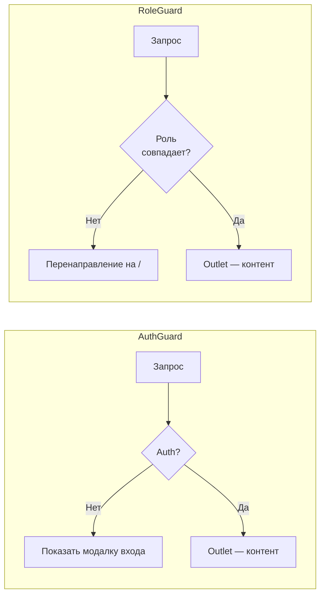

# Структура роутинга

> **Дата**: 2026-05-24 | **Статус**: Актуально | **Версия**: 2.0

---

## Краткое описание

Маршрутизация GoldPC построена на `createBrowserRouter` из React Router v7 с вложенными маршрутами, lazy loading страниц и guard-компонентами для RBAC. Все публичные маршруты обёрнуты в `MainLayout`, защищённые — в `AuthGuard` и `RoleGuard`.

---

## Архитектура роутинга

```mermaid
graph TB
    ROOT["/ (createBrowserRouter)"] --> LAYOUT["MainLayout + RouteMeta + AuthModal + Modal"]
    
    subgraph "Публичные маршруты"
        LAYOUT --> HOME["/ — HomePage"]
        LAYOUT --> CAT["/catalog/:category? — CatalogPage"]
        LAYOUT --> PD["/product/:slug — ProductPage"]
        LAYOUT --> PB["/pc-builder — PCBuilderPage (eager)"]
        LAYOUT --> BW["/build-wizard — BuildWizardPage"]
        LAYOUT --> CART["/cart — CartPage"]
        LAYOUT --> WISHLIST["/wishlist — WishlistPage"]
        LAYOUT --> COMPARE["/comparison — ComparisonPage"]
        
        subgraph "Инфо страницы"
            LAYOUT --> INFO1["/delivery — DeliveryPage"]
            LAYOUT --> INFO2["/payment — PaymentPage"]
            LAYOUT --> INFO3["/warranty — WarrantyPage"]
            LAYOUT --> INFO4["/returns — ReturnsPage"]
            LAYOUT --> INFO5["/faq — FaqPage"]
            LAYOUT --> INFO6["/contacts — ContactsPage"]
            LAYOUT --> INFO7["/privacy — PrivacyPage"]
            LAYOUT --> INFO8["/terms — TermsPage"]
            LAYOUT --> INFO9["/brands — BrandsPage"]
        end
        
        LAYOUT --> SRV["/services — ServicesPage"]
        LAYOUT --> SRVD["/services/:slug — ServiceDetailPage"]
        LAYOUT --> SRVR["/service-request — ServiceRequestPage"]
        LAYOUT --> ABOUT["/about — AboutPage"]
        LAYOUT --> FP["/forgot-password — ForgotPasswordPage"]
        LAYOUT --> RP["/reset-password/:token — ResetPasswordPage"]
        LAYOUT --> VE1["/verify-email — VerifyEmailPendingPage"]
        LAYOUT --> VE2["/verify-email/:token — VerifyEmailTokenPage"]
        LAYOUT --> NP["* — NotFoundPage"]
    end
    
    subgraph "Защищённые (AuthGuard)"
        LAYOUT --> AG[AuthGuard]
        AG --> DASH["/dashboard — CustomerDashboard"]
        AG --> ACC[AccountLayout]
        ACC --> ACC_O[AccountOverview]
        ACC --> ACC_P[AccountProfile]
        ACC --> ACC_ORD[AccountOrders]
        ACC --> ACC_REP[AccountRepairs]
        ACC --> ACC_WAR[AccountWarranty]
        ACC --> ACC_BUILD[AccountSavedBuilds]
    end
    
    subgraph "Админ (RoleGuard: Admin)"
        LAYOUT --> RG_ADM[RoleGuard Admin]
        RG_ADM --> ADM_R["/admin → redirect /admin/users"]
        RG_ADM --> ADM_U["/admin/users — UserManagement"]
        RG_ADM --> ADM_UF["/admin/users/new — UserForm"]
        RG_ADM --> ADM_UE["/admin/users/:id/edit — UserForm"]
        RG_ADM --> ADM_C["/admin/catalog — CatalogManagement"]
        RG_ADM --> ADM_CD["/admin/coordinator — CoordinatorDashboard"]
        RG_ADM --> ADM_S["/admin/stubs — StubManager"]
    end
    
    subgraph "Менеджер (RoleGuard: Manager/Admin/Master)"
        LAYOUT --> RG_MGR[RoleGuard Manager]
        RG_MGR --> MGR_D["/manager/dashboard — ManagerDashboard"]
        RG_MGR --> MGR_O["/manager/orders — OrdersPage"]
        RG_MGR --> MGR_OD["/manager/orders/:id — OrderDetailPage"]
        RG_MGR --> MGR_I["/manager/inventory — InventoryPage"]
    end
    
    subgraph "Мастер (RoleGuard: Master/Admin)"
        LAYOUT --> RG_MST[RoleGuard Master]
        RG_MST --> MST_T["/master/tickets — TicketsPage"]
        RG_MST --> MST_TD["/master/tickets/:id — TicketDetailPage"]
    end
    
    subgraph "Бухгалтер (RoleGuard: Accountant/Admin)"
        LAYOUT --> RG_ACC[RoleGuard Accountant]
        RG_ACC --> ACC_REP2["/accountant/reports — ReportsPage"]
        RG_ACC --> ACC_EXP["/accountant/export — ExportPage"]
    end
    
    LAYOUT --> OSS["/orders/:orderNumber/success — OrderSuccessPage"]
    LAYOUT --> OTR["/orders/:orderNumber/tracking — OrderTrackingPage"]
```



---

## Полная таблица маршрутов

### Публичные маршруты

| Путь | Компонент | Lazy | Описание |
|------|-----------|------|----------|
| `/` | `HomePage` | ✅ | Главная с featured товарами и акциями |
| `/catalog/:category?` | `CatalogPage` | ✅ | Каталог с фильтрацией по категории |
| `/product/:slug` | `ProductPage` | ✅ | Детальная страница товара |
| `/pc-builder` | `PCBuilderPage` | ❌ **eager** | Конструктор ПК (загружается сразу) |
| `/build-wizard` | `BuildWizardPage` | ✅ | Мастер сборки ПК по назначению |
| `/cart` | `CartPage` | ✅ | Корзина покупок |
| `/wishlist` | `WishlistPage` | ✅ | Список желаний |
| `/comparison` | `ComparisonPage` | ✅ | Сравнение товаров |
| `/checkout` | `CheckoutPage` | ✅ | Оформление заказа |
| `/services` | `ServicesPage` | ✅ | Услуги сервисного центра |
| `/services/:slug` | `ServiceDetailPage` | ✅ | Детальная услуги |
| `/service-request` | `ServiceRequestPage` | ✅ | Создание заявки |
| `/about` | `AboutPage` | ✅ | О компании |
| `/delivery` | `DeliveryPage` | ✅ | Информация о доставке |
| `/payment` | `PaymentPage` | ✅ | Способы оплаты |
| `/warranty` | `WarrantyPage` | ✅ | Гарантийное обслуживание |
| `/returns` | `ReturnsPage` | ✅ | Возврат товаров |
| `/faq` | `FaqPage` | ✅ | Часто задаваемые вопросы |
| `/contacts` | `ContactsPage` | ✅ | Контакты |
| `/privacy` | `PrivacyPage` | ✅ | Политика конфиденциальности |
| `/terms` | `TermsPage` | ✅ | Пользовательское соглашение |
| `/brands` | `BrandsPage` | ✅ | Бренды |
| `/forgot-password` | `ForgotPasswordPage` | ✅ | Восстановление пароля |
| `/reset-password/:token` | `ResetPasswordPage` | ✅ | Сброс пароля по токену |
| `/verify-email` | `VerifyEmailPendingPage` | ✅ | Ожидание подтверждения email |
| `/verify-email/:token` | `VerifyEmailTokenPage` | ✅ | Подтверждение email по токену |
| `/orders/:orderNumber/success` | `OrderSuccessPage` | ✅ | Успешное оформление заказа |
| `/orders/:orderNumber/tracking` | `OrderTrackingPage` | ✅ | Отслеживание заказа |
| `*` | `NotFoundPage` | ✅ | 404 страница |

### Защищённые маршруты (AuthGuard)

| Путь | Компонент | Lazy | Auth | Описание |
|------|-----------|------|------|----------|
| `/dashboard` | `CustomerDashboard` | ✅ | Любой авторизованный | Дашборд покупателя |
| `/account` | `AccountLayout` | ✅ | Любой | Личный кабинет (layout) |
| `/account/` | `AccountOverview` | ✅ | Любой | Обзор аккаунта |
| `/account/profile` | `AccountProfile` | ✅ | Любой | Редактирование профиля |
| `/account/orders` | `AccountOrders` | ✅ | Любой | История заказов |
| `/account/repairs` | `AccountRepairs` | ✅ | Любой | Мои ремонты |
| `/account/warranty` | `AccountWarranty` | ✅ | Любой | Гарантийные карты |
| `/account/saved-builds` | `AccountSavedBuilds` | ✅ | Любой | Сохранённые сборки ПК |

### Административные маршруты

| Путь | Компонент | Lazy | Роль | Описание |
|------|-----------|------|------|----------|
| `/admin` | Redirect | — | Admin | Перенаправление на `/admin/users` |
| `/admin/users` | `UserManagementPage` | ✅ | Admin | Управление пользователями |
| `/admin/users/new` | `UserFormPage` | ✅ | Admin | Создание пользователя |
| `/admin/users/:id/edit` | `UserFormPage` | ✅ | Admin | Редактирование пользователя |
| `/admin/catalog` | `CatalogManagementPage` | ✅ | Admin | Управление каталогом |
| `/admin/coordinator` | `CoordinatorDashboard` | ✅ | Admin | Координаторская панель |
| `/admin/stubs` | `StubManager` | ✅ | Admin | Заглушки для тестирования |

### Менеджерские маршруты

| Путь | Компонент | Lazy | Роль | Описание |
|------|-----------|------|------|----------|
| `/manager` | Redirect | — | Manager/Admin/Master | Перенаправление на dashboard |
| `/manager/dashboard` | `ManagerDashboard` | ✅ | Manager/Admin/Master | Дашборд менеджера |
| `/manager/orders` | `OrdersPage` | ✅ | Manager/Admin/Master | Управление заказами |
| `/manager/orders/:id` | `OrderDetailPage` | ✅ | Manager/Admin/Master | Детальная заказа |
| `/manager/inventory` | `InventoryPage` | ✅ | Manager/Admin/Master | Складской учёт |

### Маршруты мастера

| Путь | Компонент | Lazy | Роль | Описание |
|------|-----------|------|------|----------|
| `/master/tickets` | `TicketsPage` | ✅ | Master/Admin | Все заявки на ремонт |
| `/master/tickets/:id` | `TicketDetailPage` | ✅ | Master/Admin | Детальная заявки |

### Маршруты бухгалтера

| Путь | Компонент | Lazy | Роль | Описание |
|------|-----------|------|------|----------|
| `/accountant/reports` | `ReportsPage` | ✅ | Accountant/Admin | Финансовые отчёты |
| `/accountant/export` | `ExportPage` | ✅ | Accountant/Admin | Экспорт данных |

---

## Guard-компоненты



- **`AuthGuard`** — проверяет `isAuthenticated` из `authStore`. Если не авторизован — показывает модальное окно входа (`AuthModalContainer`).
- **`RoleGuard`** — принимает `allowedRoles: string[]`, проверяет роль текущего пользователя.
- **`AdminRedirect`** — для `/admin` определяет, куда перенаправить в зависимости от роли.

---

## Lazy Loading — особенности

**PCBuilderPage загружается EAGER** (не через `lazy()`):
```typescript
// В App.tsx:
import { PCBuilderPage } from './pages/pc-builder-page/PCBuilderPage'; // EAGER
```

**Причина**: Vite HMR может инвалидировать кэш чанков (`?t=` cache buster). React не retry неудачный `lazy()` импорт — страница остаётся пустой до перезагрузки. PC Builder — ключевая страница, поэтому загружается сразу.

**Skeleton-загрузчики**: Для разных типов страниц используются кастомные скелетоны:
- `RouteAwarePageLoader` — определяет тип страницы по URL
- `StaffPageLoader` — для админ/менеджер страниц
- `WishlistPageLoader` — кастомный скелетон для страницы избранного
- `ComparisonPageLoader` — кастомный скелетон для страницы сравнения

---

## Перенаправления (Redirects)

| Старый путь | Новый путь | Причина |
|-------------|------------|---------|
| `/orders` | `/account/orders` | Унификация в AccountLayout |
| `/profile` | `/account/profile` | Унификация в AccountLayout |
| `/repairs` | `/account/repairs` | Унификация в AccountLayout |
| `/my-repairs` | `/account/repairs` | Устаревший путь |
| `/login` | `/` | Логин через модальное окно |
| `/register` | `/` | Регистрация через модальное окно |

---

## Зависимости

- **react-router-dom** v7 — `createBrowserRouter`, `RouterProvider`
- **Компоненты**: `MainLayout`, `AuthGuard`, `RoleGuard`, `AdminRedirect`
- **Страницы**: все 28+ страниц в `src/pages/`
- **SEO**: `RouteMeta` — управление `<title>` и мета-тегами

---

## Связанные модули

- [[Обзор_фронтенда]] — общая архитектура
- [[Управление_состоянием_Zustand]] — authStore для guards
- [[API_слой]] — вызовы API
- [[Компонентная_система]] — компоненты страниц

---

## Потенциальные проблемы

1. **Vite HMR + lazy()** — см. eager import PC Builder. При деплое в production проблема не актуальна.
2. **Дублирование маршрутов** — `/admin/users` объявлен дважды (строки 258-259 в App.tsx). Не влияет на функциональность, но стоит cleanup.
3. **`/login` и `/register` редиректят на `/`** — логин/регистрация только через модальное окно, прямые страницы не используются.

---

> 🔗 **Связанные страницы**: [[Обзор_фронтенда]] | [[00_Index/Главный_индекс]]
