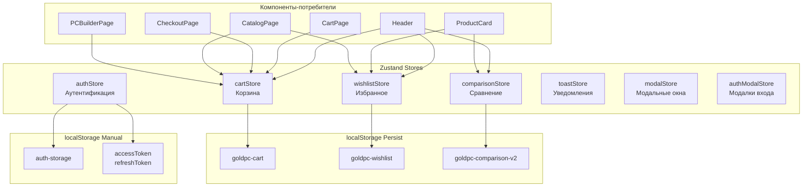
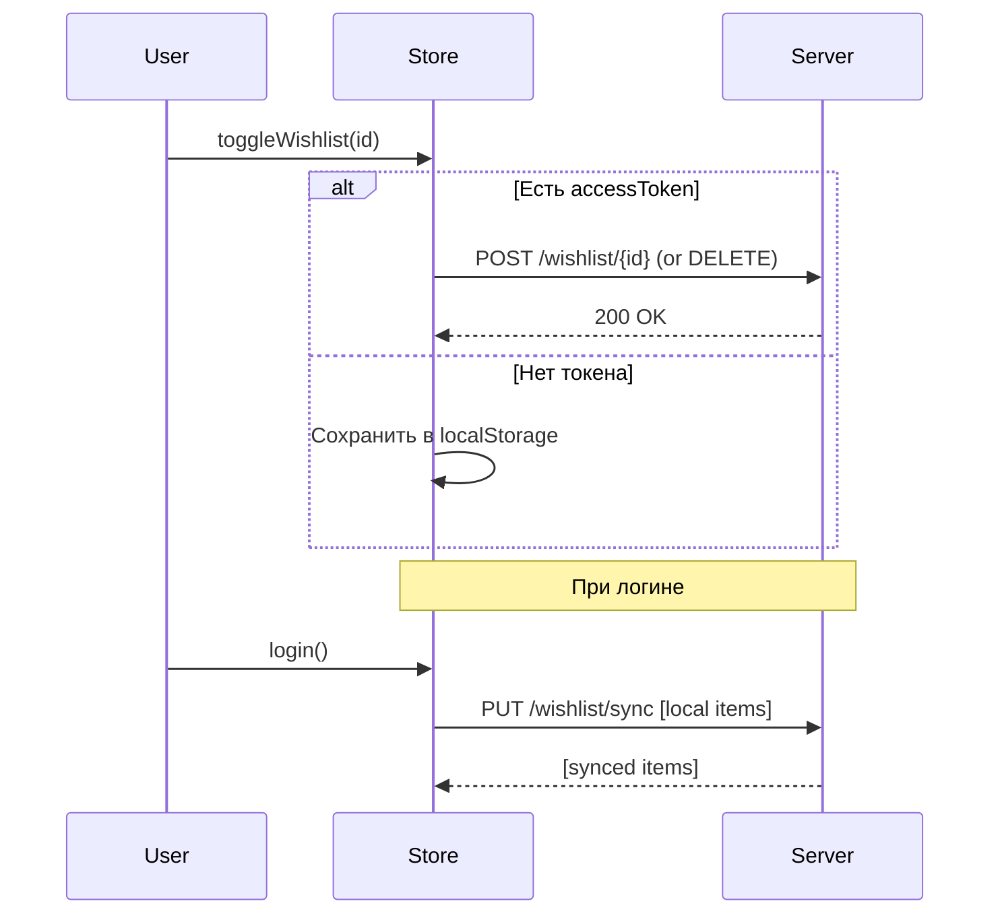
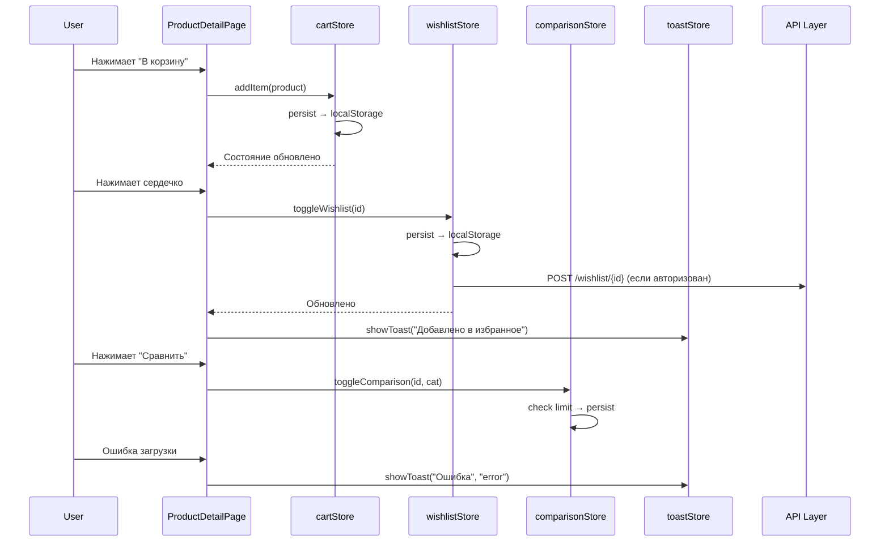

# Управление состоянием — Zustand

> **Дата**: 2026-05-24 | **Статус**: Актуально | **Версия**: 1.0

---

## Краткое описание

Управление клиентским состоянием в GoldPC реализовано через **Zustand** — лёгкую библиотеку с минимальным boilerplate. Используется 7 store-ов, часть из которых персистентна (сохраняется в `localStorage`).

---

## Архитектура состояния



---

## 1. cartStore — Корзина

**Файл**: `src/frontend/src/store/cartStore.ts`

### Назначение
Управление товарами в корзине покупателя. Персистентное хранилище с миграцией версий.

### State shape

```typescript
interface CartState {
  items: CartItem[];
  promoCode: string | null;
  discount: number;
  discountAmount: number;
}
```

```typescript
interface CartItem {
  id: string;              // UUID (crypto.randomUUID)
  productId: string;       // ID товара
  productSlug?: string;    // Slug для ссылки
  name: string;            // Название товара
  category: string;        // Категория
  price: number;           // Цена
  quantity: number;        // Количество
  imageUrl?: string;       // URL изображения
  product?: ProductSummary; // Полный объект товара
}
```

### Actions

| Метод | Описание |
|-------|----------|
| `addItem(product, quantity?)` | Добавить товар (или увеличить quantity) |
| `removeItem(productId)` | Удалить товар |
| `updateQuantity(productId, quantity)` | Обновить количество (0 = удалить) |
| `setPromoResult(result)` | Применить результат валидации промокода |
| `clearPromo()` | Очистить промокод |
| `clearCart()` | Полностью очистить корзину |
| `getTotal()` | Подсчитать общую сумму |
| `getItemCount()` | Подсчитать количество позиций |
| `getDiscountedTotal()` | Итог со скидкой |
| `getDiscountAmount()` | Сумма скидки |

### Selectors

```typescript
// Реактивный селектор количества товаров
export const useCartTotalItems = () =>
  useCartStore((state) => state.items.reduce((count, item) => count + item.quantity, 0));
```

### Persistence

- **Ключ**: `goldpc-cart`
- **Partialize**: сохраняет `items`, `promoCode`, `discount`, `discountAmount`
- **Migration**: v0 → v1 — защита от некорректных данных

### Используется в

`CartPage`, `CheckoutPage`, `Header` (счётчик), `ProductCard` (кнопка "В корзину"), `PCBuilderPage`, `useCart` хук

---

## 2. authStore — Аутентификация

**Файл**: `src/frontend/src/store/authStore.ts`

### Назначение
Управление состоянием пользователя, ролями, имперсонацией. **НЕ использует `persist` middleware** — ручное сохранение в localStorage из-за бага persist.

### State shape

```typescript
interface AuthState {
  user: User | null;
  isAuthenticated: boolean;
  isLoading: boolean;
  isImpersonating: boolean;
  originalUser: User | null;
  currentRole: string | null;
}
```

### Actions

| Метод | Описание |
|-------|----------|
| `setUser(user)` | Установить пользователя (сохраняет в localStorage вручную) |
| `setLoading(loading)` | Установить флаг загрузки |
| `logout()` | Выход (очищает токены + localStorage, Keycloak logout в prod) |
| `startImpersonation(targetUser)` | Имперсонация (только Admin) |
| `stopImpersonation()` | Остановка имперсонации |
| `switchRole(role)` | Переключение роли (для multi-role пользователей) |

### Особенности

- **Ручной persist**: состояние сохраняется/восстанавливается через `localStorage.getItem('auth-storage')`
- **HTML entity decoding**: `firstName`, `lastName`, `email` декодируются через `decodeHtmlEntities`
- **Normalize roles**: бэкенд может возвращать роли как числа (0=Client, 1=Manager...) — конвертируются в строки через `normalizeUserRoles`
- **Keycloak integration**: в production режиме logout через Keycloak

### Используется в

`AuthGuard`, `RoleGuard`, `Header` (имя пользователя), `AccountLayout`, `useAuth` хук, глобально в `App.tsx`

---

## 3. wishlistStore — Избранное

**Файл**: `src/frontend/src/store/wishlistStore.ts`

### Назначение
Управление списком желаний (wishlist). Персистентное хранилище с синхронизацией с сервером для авторизованных пользователей.

### State shape

```typescript
interface WishlistState {
  items: string[]; // Массив productId
}
```

### Actions

| Метод | Описание |
|-------|----------|
| `isInWishlist(productId)` | Проверить наличие товара |
| `toggleWishlist(productId)` | Переключить (добавить/удалить) |
| `addItem(productId)` | Добавить в избранное |
| `removeItem(productId)` | Удалить из избранного |
| `clearWishlist()` | Очистить весь список |
| `getCount()` | Получить количество |
| `syncWithServer()` | Синхронизировать с сервером |

### Persistence

- **Ключ**: `goldpc-wishlist`
- **Синхронизация**: при авторизации вызывается `syncWithServer()` — отправляет локальный список на сервер и получает актуальный

### Server sync flow



### Используется в

`ProductCard` (сердечко), `WishlistPage`, `Header` (счётчик), `ProductDetailPage`

---

## 4. comparisonStore — Сравнение товаров

**Файл**: `src/frontend/src/store/comparisonStore.ts`

### Назначение
Управление списком товаров для сравнения. Лимит — 4 товара на нормализованную категорию.

### State shape

```typescript
interface ComparisonItem {
  id: string;
  category: string;
}

interface ComparisonState {
  items: ComparisonItem[];
}
```

### Actions

| Метод | Описание |
|-------|----------|
| `isInComparison(productId)` | Проверить, есть ли в сравнении |
| `toggleComparison(productId, category)` | Переключить (возвращает `{success, reason?}`) |
| `addItem(productId, category)` | Добавить (с проверкой лимита) |
| `removeItem(productId)` | Удалить |
| `clearComparison()` | Очистить |
| `getCount()` | Количество |
| `canAdd(category?)` | Можно ли добавить ещё |
| `getItems()` | Получить массив ID |

### Persistence

- **Ключ**: `goldpc-comparison-v2`
- **Версия**: 4
- **Migration**: конвертирует старый формат (массив строк) в новый (массив `{id, category}`)

### Лимиты

Лимит проверяется через [[#comparisonLimits store]]:

```typescript
// comparisonLimits.ts
export const COMPARISON_LIMIT = 4;
export function canAddToNormalizedCategory(items: ComparisonItem[], category: string): boolean {
  const normalized = normalizeCategoryForComparison(category);
  const currentCount = items.filter(i => normalizeCategoryForComparison(i.category) === normalized).length;
  return currentCount < COMPARISON_LIMIT;
}
```

### Используется в

`ProductCard` (кнопка сравнения), `ComparisonPage`, `Header` (счётчик)

---

## 5. toastStore — Уведомления

**Файл**: `src/frontend/src/store/toastStore.ts`

### Назначение
Система всплывающих уведомлений (toast). Не персистентна.

### State shape

```typescript
interface Toast {
  id: string;
  message: string;
  type: ToastType; // 'success' | 'error' | 'info' | 'warning'
  duration?: number; // По умолчанию 4000ms
}

interface ToastState {
  toasts: Toast[];
}
```

### Actions

| Метод | Описание |
|-------|----------|
| `showToast(message, type?, duration?)` | Показать уведомление (авто-удаление через `setTimeout`) |
| `removeToast(id)` | Удалить уведомление |
| `clearToasts()` | Очистить все уведомления |

### Используется в

Глобально — `ToastContainer` в `MainLayout`, вызывается из `useToast` хука в компонентах

---

## 6. modalStore — Модальные окна (стек)

**Файл**: `src/frontend/src/store/modalStore.ts`

### Назначение
Управление стеком модальных окон. Поддерживает множественные модалки (одна поверх другой).

### State shape

```typescript
interface ModalContent {
  title?: string;
  content: ReactNode;
  size?: 'small' | 'default' | 'large' | 'fullWidth';
  footer?: ReactNode;
  data?: Record<string, unknown>;
}

interface ModalState {
  modalStack: ModalContent[];
  isOpen: boolean;
  modalContent: ModalContent | null; // Верхнее модальное окно
}
```

### Actions

| Метод | Описание |
|-------|----------|
| `openModal(content)` | Открыть модальное окно (добавить в стек) |
| `closeModal()` | Закрыть верхнее модальное окно |
| `closeAll()` | Закрыть все модальные окна |

### Используется в

`ModalContainer` (глобальный рендер), `useModal` хук

---

## 7. authModalStore — Модалки аутентификации

**Файл**: `src/frontend/src/store/authModalStore.ts`

### Назначение
Управление модальными окнами входа/регистрации. Отдельный store для простоты.

### State shape

```typescript
type AuthModalType = 'login' | 'register' | null;

interface AuthModalState {
  activeModal: AuthModalType;
}
```

### Actions

| Метод | Описание |
|-------|----------|
| `openLoginModal()` | Открыть модалку входа |
| `openRegisterModal()` | Открыть модалку регистрации |
| `closeAuthModal()` | Закрыть |
| `switchAuthModal(modal)` | Переключить между login/register |

### Используется в

`Header` (кнопка "Войти"), `AuthGuard` (при отсутствии авторизации), `AuthModalContainer`

---

## Диаграмма взаимодействия store



---

## Зависимости

- **Zustand** v4+ — основная библиотека
- **zustand/middleware** — `persist` для cartStore, wishlistStore, comparisonStore
- **localStorage** — ручной persist для authStore

---

## Связанные модули

- [[Обзор_фронтенда]] — архитектура приложения
- [[API_слой]] — взаимодействие с сервером
- [[Компонентная_система]] — какие компоненты используют store
- [[Корзина_и_оформление_заказа]] — использование cartStore

---

## Потенциальные проблемы

1. **AuthStore persist баг** — при использовании `persist` middleware возникает ошибка "Cannot read properties of undefined (reading 'getState')". Решение: ручное сохранение в localStorage.
2. **CartStore миграция** — при изменении структуры `CartItem` нужно обновлять `migrate()` функцию.
3. **WishlistStore серверная синхронизация** — race condition: если пользователь быстро добавляет/удаляет до завершения предыдущего sync-запроса, данные могут рассинхронизироваться.
4. **ComparisonStore лимит 4** — проверка по нормализованной категории, т.е. CPU и GPU считаются разными категориями, и в каждой может быть по 4 товара.

---

> 🔗 **Связанные страницы**: [[Обзор_фронтенда]] | [[Хуки_и_утилиты]] | [[Корзина_и_оформление_заказа]]
