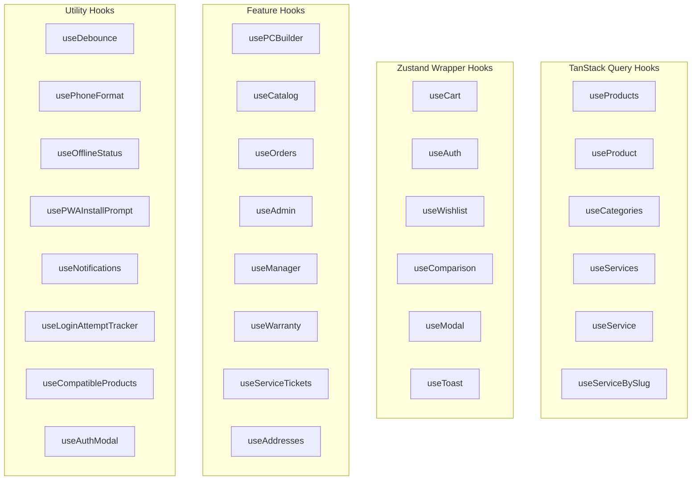
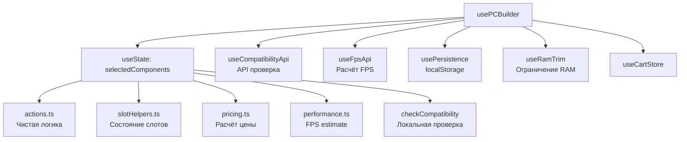

# Хуки и утилиты

> **Дата**: 2026-05-24 | **Статус**: Актуально | **Версия**: 1.0

---

## Краткое описание

Во фронтенде GoldPC используется 29 кастомных React хуков и 20+ утилит. Хуки разделяются на три категории: TanStack Query хуки (серверное состояние), обёртки над Zustand store, и вспомогательные хуки.

---

## Архитектура хуков



---

## TanStack Query хуки

### useProducts

**Файл**: `hooks/useProducts.ts`

```typescript
function useProducts(params?: GetProductsParams, options?: { enabled?: boolean }): 
  UseQueryResult<ProductListResponse, Error>
```

Запрос списка товаров с фильтрацией и пагинацией.

```typescript
// Пример
const { data, isLoading, error } = useProducts({ 
  category: 'gpu', 
  priceMin: 500, 
  pageSize: 24 
});
```

**Query key**: `['products', 'list', params]`  
**staleTime**: 5 минут

### useProduct

**Файл**: `hooks/useProduct.ts`

```typescript
function useProduct(productSlug: string | undefined, options?: { enabled?: boolean }): 
  UseQueryResult<Product, Error>
```

Запрос одного товара по slug.

```typescript
// Пример
const { data: product, isLoading } = useProduct('rtx-4090-gigabyte');
```

**Query key**: `['product', slug]`  
**staleTime**: 5 минут

### useCategories

**Файл**: `hooks/useCategories.ts`

```typescript
function useCategories(): UseQueryResult<Category[], Error>
```

Запрос списка категорий.

```typescript
// Пример
const { data: categories } = useCategories();
```

**Query key**: `['categories', 'list']`  
**staleTime**: 10 минут

### useServices, useService, useServiceBySlug

**Файл**: `hooks/useServices.ts`

```typescript
function useServices(params?: GetServicesParams): UseQueryResult<ServiceListResponse, Error>
function useService(id: string): UseQueryResult<Service, Error>
function useServiceBySlug(slug: string): UseQueryResult<Service, Error>
```

Запросы услуг сервисного центра.

**Query keys**: `['services', 'list', params]`, `['services', 'detail', slug]`

---

## Zustand Wrapper хуки

### useCart

**Файл**: `hooks/useCart.ts`

Объединяет cartStore с валидацией промокодов через API.

```typescript
function useCart(): {
  // Состояние
  items: CartItem[];
  promoCode: string | null;
  discount: number;
  isEmpty: boolean;
  
  // Вычисляемые
  totalPrice: number;
  itemCount: number;
  discountedTotal: number;
  discountAmount: number;
  
  // Состояние промокода
  isValidatingPromo: boolean;
  promoError: string | null;
  
  // Действия
  addToCart: (product: ProductSummary, quantity?: number) => void;
  removeFromCart: (productId: string) => void;
  changeQuantity: (productId: string, delta: number) => void;
  setQuantity: (productId: string, quantity: number) => void;
  updateQuantity: (productId: string, quantity: number) => void;
  validateAndApplyPromo: (code: string) => Promise<{success, message}>;
  clearPromoCode: () => void;
  emptyCart: () => void;
  
  // Утилиты
  isInCart: (productId: string) => boolean;
  getItemQuantity: (productId: string) => number;
}
```

### useAuth

**Файл**: `hooks/useAuth.ts`

Управление аутентификацией: логин, регистрация, выход, имперсонация.

```typescript
function useAuth(): {
  user: User | null;
  isAuthenticated: boolean;
  isLoading: boolean;
  isImpersonating: boolean;
  login: (credentials: LoginRequest, remember?: boolean) => Promise<void>;
  register: (data: RegisterRequest) => Promise<void>;
  logout: () => Promise<void>;
  startImpersonation: (targetUser: User) => void;
  stopImpersonation: () => void;
}
```

**Важные детали**:
- При логине: сохраняет токены → устанавливает пользователя → синхронизирует избранное → редирект
- При регистрации: токены → пользователь → редирект на `/verify-email`
- При выходе: server logout → очистка токенов → редирект на `/login`

### useWishlist

**Файл**: `hooks/useWishlist.ts`

Обёртка над wishlistStore.

```typescript
function useWishlist(): {
  items: string[];
  isInWishlist: (productId: string) => boolean;
  toggleWishlist: (productId: string) => void;
  addItem: (productId: string) => void;
  removeItem: (productId: string) => void;
  clearWishlist: () => void;
  getCount: () => number;
  syncWithServer: () => Promise<void>;
}
```

### useComparison

**Файл**: `hooks/useComparison.ts`

Обёртка над comparisonStore.

```typescript
function useComparison(): {
  items: ComparisonItem[];
  isInComparison: (productId: string) => boolean;
  toggleComparison: (productId: string, category: string) => { success: boolean; reason?: 'limit' };
  addItem: (productId: string, category: string) => { success: boolean; reason?: 'limit' };
  removeItem: (productId: string) => void;
  clearComparison: () => void;
  getCount: () => number;
  canAdd: (category?: string) => boolean;
  getItems: () => string[];
}
```

### useModal

**Файл**: `hooks/useModal.ts`

Обёртка над modalStore.

### useToast

**Файл**: `hooks/useToast.ts`

Обёртка над toastStore.

---

## Feature хуки

### usePCBuilder

**Файл**: `hooks/usePCBuilder.ts`

Центральный оркестратор для PC Builder. Объединяет состояние, логику совместимости, FPS расчёт.

```typescript
function usePCBuilder(): UsePCBuilderReturn {
  // Состояние
  selectedComponents: PCBuilderSelectedState;
  compatibility: CompatibilityResult;
  totalPrice: number;
  powerConsumption: number;
  recommendedPsu: number;
  estimatedFps: EstimatedFps;
  
  // Действия
  selectComponent: (type, product, options?) => void;
  duplicateModule: (type) => void;
  removeComponent: (type, multiIndex?) => void;
  resetBuild: () => void;
  addToCart: () => void;
}
```

**Внутренняя архитектура**:



### useCatalog

**Файл**: `hooks/useCatalog.ts`

Альтернативный хук для работы с каталогом (без TanStack Query, с ручным управлением loading/error). Используется там, где нужен более тонкий контроль.

Методы: `getProduct`, `getProducts`, `getProductsByIds`, `getProductReviews`, `addProductReview`, `updateProductReview`, `deleteProductReview`, `toggleHelpful`, `getFilterFacets`.

### useOrders

**Файл**: `hooks/useOrders.ts`

Управление заказами: получение списка, детальной информации, создание, отмена, расчёт доставки.

### useAddresses

**Файл**: `hooks/useAddresses.ts`

Управление адресами доставки: CRUD операции.

### useWarranty

**Файл**: `hooks/useWarranty.ts`

Гарантийные карты: получение списка и детальной информации.

### useServiceTickets

**Файл**: `hooks/useServiceTickets.ts`

Заявки на ремонт: создание, получение списка, сообщения.

### useAdmin

**Файл**: `hooks/useAdmin.ts`

Административные функции: управление пользователями, каталогом, настройками.

### useManager

**Файл**: `hooks/useManager.ts`

Панель менеджера: дашборд, заказы, склад.

---

## Вспомогательные хуки

| Хук | Файл | Описание |
|-----|------|----------|
| `useDebounce` | `hooks/useDebounce.ts` | Дебаунс значения (для поиска) |
| `usePhoneFormat` | `hooks/usePhoneFormat.ts` | Форматирование телефона при вводе |
| `useOfflineStatus` | `hooks/useOfflineStatus.ts` | Определение оффлайн-статуса |
| `usePWAInstallPrompt` | `hooks/usePWAInstallPrompt.ts` | Кнопка установки PWA |
| `useNotifications` | `hooks/useNotifications.tsx` | Web Push уведомления |
| `useLoginAttemptTracker` | `hooks/useLoginAttemptTracker.ts` | Отслеживание попыток входа |
| `useCompatibleProducts` | `hooks/useCompatibleProducts.ts` | Поиск совместимых товаров для PC Builder |
| `useAuthModal` | `hooks/useAuthModal.ts` | Управление модалками аутентификации |

---

## Утилиты

### phone.ts — Форматирование телефона

**Файл**: `utils/phone.ts`

| Функция | Описание | Пример |
|---------|----------|--------|
| `isValidPhone(value)` | Валидация (7-15 цифр) | `isValidPhone('+375291234567')` → `true` |
| `normalizePhone(value)` | Удаление всех нецифровых символов | `normalizePhone('+375 (29) 123-45-67')` → `375291234567` |
| `parsePhone(value)` | Приведение к формату 375XXXXXXXXX | `parsePhone('80291234567')` → `375291234567` |
| `formatPhone(digits)` | Форматирование в `+375 (XX) XXX-XX-XX` | `formatPhone('291234567')` → `+375 (29) 123-45-67` |

### Другие утилиты

| Файл | Назначение |
|------|------------|
| `utils/comparison/comparisonEngine.ts` | Движок сравнения товаров (сопоставление характеристик) |
| `utils/comparison/comparisonRules.ts` | Правила сравнения для разных категорий |
| `utils/specifications.ts` | Работа с характеристиками товаров |
| `utils/cardValidation.ts` | Валидация банковских карт (Luhn) |
| `utils/decodeHtml.ts` | Декодирование HTML entities |
| `utils/sanitize.ts` | Санитизация HTML (DOMPurify) |
| `utils/useSanitizedHtml.ts` | Хук для безопасного HTML |
| `utils/SafeHtml.tsx` | Компонент для безопасного HTML |
| `utils/image.ts` | Работа с изображениями |
| `utils/pluralizeRu.ts` | Склонение существительных (русский язык) |
| `utils/categoryLabels.ts` | Метки категорий |
| `utils/manufacturerNameOverrides.ts` | Переопределения названий производителей |
| `utils/productDescriptionSpecs.ts` | Извлечение характеристик из описания |
| `utils/roleMapper.ts` | Маппинг ролей (числа → строки) |
| `utils/telemetry.ts` | Телеметрия (Vitals, аналитика) |
| `utils/performance.ts` | Мониторинг производительности |
| `utils/pwa.ts` | PWA сервис-воркер |

### roleMapper.ts — Маппинг ролей

```typescript
// Преобразует числовые роли из бэкенда в строковые
// 0 → 'Client', 1 → 'Manager', 2 → 'Master', 3 → 'Admin', 4 → 'Accountant'
function mapBackendRole(role: string | number): string
function normalizeUserRoles(user: User): User
```

### comparisonEngine.ts — Движок сравнения

Сравнивает товары по характеристикам с учётом:
- **Порядка** вывода (specKeysSort.ts)
- **Нормализации** единиц измерения
- **Правил** сравнения для каждой категории

---

## Зависимости

- **@tanstack/react-query** — для Query хуков
- **axios** — для API вызовов
- **zustand** — для store wrapper хуков

---

## Связанные модули

- [[API_слой]] — API модули, которые вызывают хуки
- [[Управление_состоянием_Zustand]] — store, которые оборачивают хуки
- [[ПК_конструктор]] — детали usePCBuilder
- [[Каталог_и_фильтрация]] — useProducts, useCategories, useCatalog

---

## Потенциальные проблемы

1. **useCatalog vs useProducts** — два разных подхода к одному API. `useProducts` использует TanStack Query, `useCatalog` — ручное состояние. Возможна путаница.
2. **useOrders не использует TanStack Query** — в отличие от useProducts, заказы используют ручное управление состоянием. При нагрузке возможны лишние ререндеры.
3. **usePCBuilder сложность** — хук оркестрирует 5+ внутренних хуков и модулей. Изменения в одном могут затронуть все.
4. **decodeHtmlEntities** — применяется в authStore, но может понадобиться в других местах при работе с пользовательским контентом.

---

> 🔗 **Связанные страницы**: [[API_слой]] | [[Управление_состоянием_Zustand]] | [[00_Index/Главный_индекс]]
