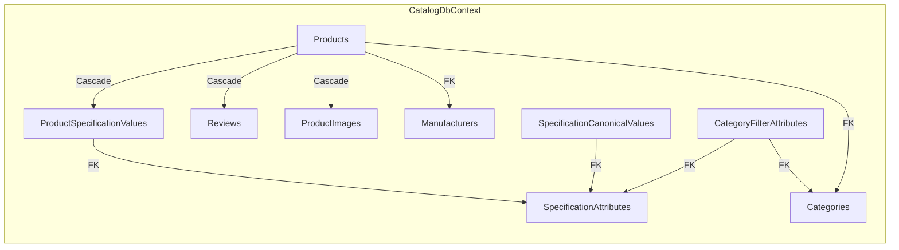
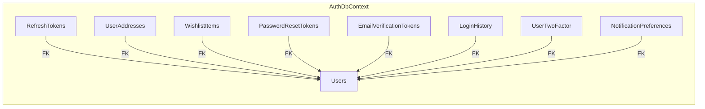

# Миграции EF Core

> **Раздел**: 05_Database
> **Версия**: 1.0 | **Последнее обновление**: 2026-05-24

---

## 📋 Стратегия миграций

Все сервисы используют **автоматическое применение миграций при запуске**:

```csharp
// Program.cs (каждый сервис)
var dbContext = services.GetRequiredService<TDbContext>();
dbContext.Database.Migrate();
```

### Порядок применения

При первом запуске Docker Compose:

1. Контейнер `postgres` инициализирует БД через `init-databases.sh`
2. После health check `postgres` стартуют сервисы
3. Каждый сервис применяет свои миграции при старте
4. Используется блокировка `__EFMigrationsHistory` для защиты от конкурентного применения

---

## 📂 CatalogService — 10 миграций

| № | Дата | Файл | Описание |
|---|---|---|---|
| 1 | 2026-03-15 | `20260315162629_SeedProductsData.cs` | Начальная — создание таблиц и сидирование |
| 2 | 2026-03-20 | `20260320073752_AddXCoreFields.cs` | Поля для x-core: SourceUrl, ExternalId |
| 3 | 2026-03-21 | `20260321135704_AddXCoreGpuFilterAttributes.cs` | Фильтры GPU: VRAM, GPU series |
| 4 | 2026-03-21 | `20260321052829_AddFilterAttributesForAllCategories.cs` | Фильтры для всех категорий |
| 5 | 2026-03-22 | `20260322110000_AddProductImagePathAndManufacturerLogoPath.cs` | Локальные пути для изображений |
| 6 | 2026-03-23 | `20260323055427_SplitPeripheryIntoKeyboardsMiceHeadphones.cs` | Разделение периферии на клавиатуры/мыши/наушники |
| 7 | 2026-03-24 | `20260324075317_NormalizeSpecifications.cs` | Нормализация спецификаций |
| 8 | 2026-03-25 | `20260325102830_AddProductLegalInfoFields.cs` | Юридические поля (адрес, импортёр) |
| 9 | 2026-03-26 | `20260326174608_AddProductSlugAndNumericSku.cs` | Slug + числовой SKU |
| 10 | 2026-05-15 | *(планируется)* | Cooler spec attributes + canonical values |

### Структура модели



---

## 📂 AuthService — 2 миграции

| № | Дата | Файл | Описание |
|---|---|---|---|
| 1 | 2026-05-13 | `20260513144946_InitialCreate.cs` | Создание Users, RefreshTokens, Addresses, Wishlist |
| 2 | 2026-05-13 | `20260513162912_EmailVerification.cs` | EmailVerificationToken, PasswordResetToken |

### Структура модели



---

## 📂 Другие сервисы

| Сервис | Миграции | Статус |
|---|---|---|
| **OrdersService** | 6 миграций: Initial → Outbox → PromoCode → CustomerFields → Discount → ExtendOrder | ✅ Применены |
| **PCBuilderService** | 2 миграции: InitialCreate → AddCompatibilityRules | ✅ Применены |
| **ServicesService** | 1 миграция: InitialServiceTypes | ✅ Применена |
| **ReportingService** | 1 миграция: InitialReporting | ✅ Применена |
| **WarrantyService** | Планируется | ⏳ |

---

## 📦 Data Seeding

### SpecificationDataMigration

CatalogService использует **сидирование через EF Core HasData()** в `CatalogDbContext.OnModelCreating()`:

```csharp
// Прямо в конфигурации контекста
modelBuilder.Entity<Category>().HasData(categories);
modelBuilder.Entity<Manufacturer>().HasData(manufacturers);
modelBuilder.Entity<SpecificationAttribute>().HasData(specAttrs);
modelBuilder.Entity<SpecificationCanonicalValue>().HasData(cvs);
modelBuilder.Entity<CategoryFilterAttribute>().HasData(filterAttributes);
modelBuilder.Entity<Product>().HasData(products);
```

Этот подход гарантирует, что данные всегда синхронизированы с моделью.

### Что сидируется

| Сущность | Записей | Описание |
|---|---|---|
| Categories | 13 | Процессоры, видеокарты, RAM и т.д. |
| Manufacturers | 17 | Intel, AMD, ASUS, NVIDIA и т.д. |
| SpecificationAttributes | 25 | socket, vram, gpu, cores... |
| SpecificationCanonicalValues | ~60 | AM4, AM5, DDR5, ATX... |
| CategoryFilterAttributes | 38 | Настройки фильтров по категориям |
| Products | 12 | Демо-товары: CPU, MB, RAM, GPU, PSU |

---

## 📝 Команды для работы с миграциями

```bash
# Создать новую миграцию
cd src/CatalogService
dotnet ef migrations add AddNewFeature --context CatalogDbContext

# Применить миграции вручную
dotnet ef database update --context CatalogDbContext

# Откатить последнюю миграцию
dotnet ef migrations remove --context CatalogDbContext

# Сгенерировать SQL скрипт
dotnet ef migrations script --context CatalogDbContext -o migrate.sql
```

---

## 🔗 Связанные страницы

- [[05_Database/Обзор_БД]] — общая архитектура БД
- [[05_Database/Схема_БД]] — детальная схема таблиц
- [[03_Backend/Сервис_каталога_CatalogService]] — сервис каталога
- [[03_Backend/Сервис_аутентификации_AuthService]] — сервис аутентификации
