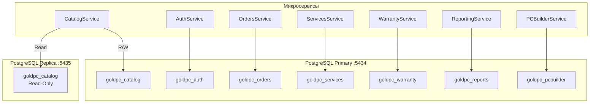

# Обзор базы данных GoldPC

> **Раздел**: 05_Database
> **Версия**: 1.0 | **Последнее обновление**: 2026-05-24

---

## 📐 Архитектура

GoldPC использует **PostgreSQL 16** в качестве основной базы данных с архитектурой **Primary-Replica** для разделения нагрузки чтения и записи.



### БД и сервисы

| База данных | Сервис | Назначение |
|---|---|---|
| `goldpc_catalog` | CatalogService | Товары, категории, характеристики |
| `goldpc_auth` | AuthService | Пользователи, токены, 2FA |
| `goldpc_orders` | OrdersService | Заказы, промокоды |
| `goldpc_services` | ServicesService | Заявки на ремонт |
| `goldpc_warranty` | WarrantyService | Гарантийные карты |
| `goldpc_reports` | ReportingService | Отчёты (postgres_fdw) |
| `goldpc_pcbuilder` | PCBuilderService | Конфигурации ПК |

---

## 🔄 Репликация PostgreSQL

**Primary**: порт `:5434`, `wal_level=replica`, `max_wal_senders=10`
**Replica**: порт `:5435`, `hot_standby=on`, стриминг через `pg_basebackup`

```yaml
# docker-compose.yml (реплика)
postgres-replica:
  command: >
    bash -c "
    until pg_basebackup -h postgres -D /var/lib/postgresql/data -U postgres -vP -R -X stream; do
      sleep 1
    done
    exec postgres
    "
```

**CQRS**: CatalogService использует Primary для записи (CatalogDbContext) и Replica для чтения (ReadOnlyCatalogDbContext с `AsNoTracking`).

---

## 📦 WAL Архив

Скрипт `setup-archive.sh` настраивает архивацию WAL:
- `archive_mode=on`
- `archive_command='test ! -f /var/lib/postgresql/data/archive/%f && cp %p /var/lib/postgresql/data/archive/%f'`
- `shared_preload_libraries='pg_stat_statements'`

---

## 📊 Секционирование

`order_history` в `goldpc_orders` секционируется **помесячно** (скрипт `setup-partitioning.sql`):

```sql
CREATE TABLE order_history (
    id UUID NOT NULL,
    order_id UUID NOT NULL,
    changed_at TIMESTAMPTZ NOT NULL DEFAULT NOW()
) PARTITION BY RANGE (changed_at);

CREATE TABLE order_history_2026_01 PARTITION OF order_history
    FOR VALUES FROM ('2026-01-01') TO ('2026-02-01');
CREATE TABLE order_history_2026_02 PARTITION OF order_history
    FOR VALUES FROM ('2026-02-01') TO ('2026-03-01');
-- ...
```

---

## 🗺️ ER-диаграмма

```mermaid
erDiagram
    %% CatalogService
    PRODUCTS ||--o{ PRODUCT_IMAGES : "has"
    PRODUCTS ||--o{ REVIEWS : "has"
    PRODUCTS ||--o{ PRODUCT_SPECIFICATION_VALUES : "has"
    PRODUCTS }o--|| CATEGORIES : "belongs to"
    PRODUCTS }o--o| MANUFACTURERS : "manufactured by"
    CATEGORIES ||--o{ CATEGORIES : "parent-child"
    CATEGORIES ||--o{ CATEGORY_FILTER_ATTRIBUTES : "defines filters"
    SPECIFICATION_ATTRIBUTES ||--o{ SPECIFICATION_CANONICAL_VALUES : "has values"
    SPECIFICATION_ATTRIBUTES ||--o{ PRODUCT_SPECIFICATION_VALUES : "defines specs"
    SPECIFICATION_ATTRIBUTES ||--o{ CATEGORY_FILTER_ATTRIBUTES : "used in filters"
    SPECIFICATION_CANONICAL_VALUES ||--o{ PRODUCT_SPECIFICATION_VALUES : "assigned values"

    %% AuthService
    USERS ||--o{ REFRESH_TOKENS : "has"
    USERS ||--o{ USER_ADDRESSES : "has"
    USERS ||--o{ WISHLIST_ITEMS : "has"
    USERS ||--o{ PASSWORD_RESET_TOKENS : "has"
    USERS ||--o{ EMAIL_VERIFICATION_TOKENS : "has"
    USERS ||--o{ LOGIN_HISTORY : "records"
    USERS ||--o| USER_TWO_FACTOR : "configures"

    %% OrdersService
    ORDERS ||--o{ ORDER_ITEMS : "contains"
    ORDERS ||--o{ ORDER_HISTORY : "tracks"
    PROMO_CODES ||--o{ ORDERS : "used in"
    OUTBOX_MESSAGES ||--|| ORDERS : "events for"

    %% PCBuilderService
    PC_CONFIGURATIONS ||--o{ COMPATIBILITY_RULES : "validated by"

    %% ServicesService
    SERVICE_REQUESTS ||--|| SERVICE_TYPES : "of type"
    SERVICE_REQUESTS ||--o{ SERVICE_PARTS : "uses"
    SERVICE_REQUESTS ||--o{ WORK_REPORTS : "logs"

    %% WarrantyService
    WARRANTY_CARDS ||--o{ WARRANTY_CLAIMS : "claims against"
    WARRANTY_CLAIMS ||--o{ WARRANTY_HISTORY : "tracks"
```



---

## ⚡ Производительность

### Индексы

| Таблица | Индекс | Тип |
|---|---|---|
| `products` | `sku` | UNIQUE B-tree |
| `products` | `slug` | UNIQUE B-tree |
| `products` | `(is_active, price)` | Composite B-tree |
| `products` | `category_id` | B-tree |
| `products` | `external_id` | UNIQUE с фильтром |
| `product_specification_values` | `(product_id, attribute_id)` | Composite |
| `product_specification_values` | `(attribute_id, value_number)` | Composite |
| `compatibility_rules` | `(rule_type, component1_id, component2_id)` | UNIQUE |
| `compatibility_rules` | `socket` | B-tree с фильтром |

### Рекомендации

1. **Тюнинг shared_buffers**: 25% от RAM (минимум 2GB для прода)
2. **effective_cache_size**: 75% от RAM
3. **pg_stat_statements**: включён для мониторинга медленных запросов
4. **Пул соединений**: каждый сервис использует `MaxPoolSize=25` в строке подключения
5. **Timeout**: `CommandTimeout=30` (по умолчанию), для отчётов `120`

---

## 🔐 Политика подключения

```yaml
# dev
ConnectionStrings__DefaultConnection: "Server=postgres;Database=goldpc_catalog;User Id=postgres;Password=admin"

# prod (через переменные окружения)
ConnectionStrings__DefaultConnection: "Server=postgres;Database=goldpc;User Id=${DB_USER};Password=${DB_PASSWORD}"
```

---

## 📋 Инициализация

Скрипт `init-databases.sh` при первом запуске контейнера:
1. Создаёт все 7 баз данных
2. Настраивает права доступа
3. Загружает расширения (`pg_stat_statements`, `postgres_fdw`)
4. Настраивает репликацию

---

## 🔗 Связанные страницы

- [[05_Database/Схема_БД]] — детальная схема каждой таблицы
- [[05_Database/Миграции]] — EF Core миграции
- [[02_Architecture/Архитектура_системы]] — архитектура сервисов
- [[07_Infra_DevOps/Docker_окружение]] — Docker Compose для PostgreSQL
