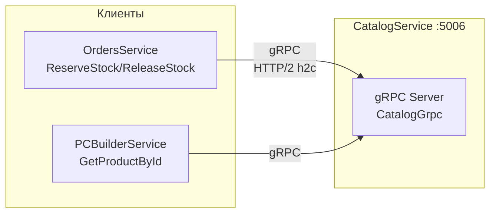

# gRPC контракты

> **Раздел**: 06_APIs
> **Версия**: 1.0 | **Последнее обновление**: 2026-05-24

---

## 📋 Обзор

gRPC используется для **межсервисного взаимодействия** между CatalogService и другими микросервисами. Протокол работает на **HTTP/2 h2c без TLS** на порту `:5006`.



---

## 📄 catalog.proto

Файл расположен: `src/Shared/Protos/catalog.proto`

```protobuf
syntax = "proto3";
option csharp_namespace = "Shared.Protos";
package catalog;

service CatalogGrpc {
  rpc GetProductById (GetProductRequest) returns (ProductResponse);
  rpc GetProductsByIds (GetProductsRequest) returns (ProductsResponse);
  rpc ReserveStock (ReserveStockRequest) returns (StockResponse);
  rpc ReleaseStock (ReleaseStockRequest) returns (StockResponse);
}
```

### RPC методы

| Метод | Описание | Лимиты |
|---|---|---|
| `GetProductById` | Получить товар по ID | 1 товар |
| `GetProductsByIds` | Получить несколько товаров | до 100 ID |
| `ReserveStock` | Зарезервировать товары на складе | до 50 позиций |
| `ReleaseStock` | Освободить резерв товаров | до 50 позиций |

---

## 📦 Сообщения

### ProductResponse

```protobuf
message ProductResponse {
  string id = 1;          // UUID товара
  string name = 2;        // Название
  double price = 3;       // Цена
  string category = 4;    // Категория
  bool is_available = 5;  // Доступен для заказа
  double old_price = 6;   // Старая цена (скидка)
  int32 stock = 7;        // Остаток на складе
}
```

### StockItem / StockResponse

```protobuf
message StockItem {
  string product_id = 1;
  int32 quantity = 2;
}

message StockResponse {
  bool success = 1;
  string error_message = 2;
}
```

---

## ⚙️ Конфигурация

### Server (CatalogService — Program.cs)

```csharp
builder.Services.AddGrpc(options =>
{
    options.MaxReceiveMessageSize = 1 * 1024 * 1024; // 1 MB
    options.EnableDetailedErrors = builder.Environment.IsDevelopment();
});

app.MapGrpcService<CatalogGrpcService>().RequireHost($"*:{GrpcPort}");
// GrpcPort = 5006
```

### Client (OrdersService — Program.cs)

```csharp
builder.Services.AddGrpcClient<CatalogGrpc.CatalogGrpcClient>(options =>
{
    options.Address = new Uri("http://catalog.api:5006");
}).ConfigurePrimaryHttpMessageHandler(() => new SocketsHttpHandler
{
    EnableMultipleHttp2Connections = true
});
```

---

## 🔧 Использование

### ReserveStock (резервирование при заказе)

```csharp
var client = _grpcClientFactory.CreateClient<CatalogGrpc.CatalogGrpcClient>();
var response = await client.ReserveStockAsync(new ReserveStockRequest
{
    Items =
    {
        new StockItem { ProductId = productId.ToString(), Quantity = 2 }
    }
});

if (!response.Success)
{
    throw new StockReservationException(response.ErrorMessage);
}
```

### GetProductById (получение данных товара)

```csharp
var response = await client.GetProductByIdAsync(new GetProductRequest
{
    Id = productId.ToString()
});

// response.Name, response.Price, response.Stock
```

---

## 🔍 Конфигурация HTTP/2 h2c

CatalogService использует h2c (HTTP/2 cleartext — без TLS):

```csharp
builder.WebHost.ConfigureKestrel(options =>
{
    // gRPC endpoint - HTTP/2 h2c without TLS
    options.ListenAnyIP(5006, listenOptions =>
    {
        listenOptions.Protocols = HttpProtocols.Http2;
        // TLS отключён для внутренней сети Docker
    });
    
    // REST endpoint - HTTP/1.1
    options.ListenAnyIP(5000, listenOptions =>
    {
        listenOptions.Protocols = HttpProtocols.Http1;
    });
});
```

**Почему h2c без TLS?** Все сервисы работают в изолированной Docker-сети `goldpc-network`. TLS внутри Docker-сети избыточен и снижает производительность.

---

## 📊 Производительность

| Метрика | Значение |
|---|---|
| MaxReceiveMessageSize | 1 MB |
| Timeout | 30 секунд (по умолчанию) |
| KeepAlive | Включён |
| Пул соединений | Включён (SocketsHttpHandler) |
| Повторные попытки | Нет (ожидается реализация) |

---

## 🚧 Статус

| Метод | Статус | Используется |
|---|---|---|
| `GetProductById` | ✅ Реализован | PCBuilderService (планируется) |
| `GetProductsByIds` | ✅ Реализован | — |
| `ReserveStock` | ✅ Реализован | OrdersService (планируется) |
| `ReleaseStock` | ✅ Реализован | OrdersService (планируется) |

> **Примечание**: gRPC клиенты реализованы, но пока не используются активно — PCBuilderService пока использует HTTP-вызовы.

---

## 🔗 Связанные страницы

- [[06_APIs/Обзор_API]] — общая архитектура API
- [[06_APIs/REST_эндпоинты]] — REST эндпоинты
- [[03_Backend/Сервис_каталога_CatalogService]] — CatalogService
