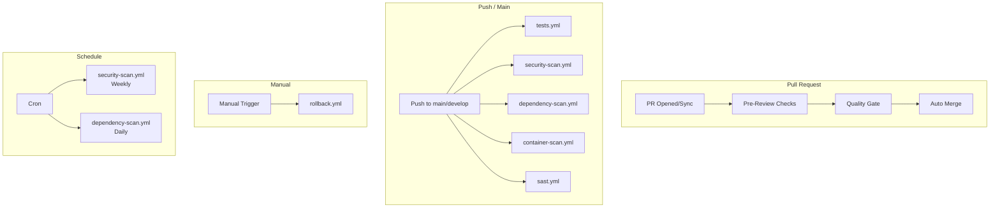

# GitHub Actions Workflows

> **Раздел**: 07_Infra_DevOps
> **Версия**: 1.0 | **Последнее обновление**: 2026-05-24

---

## 📋 Обзор

В проекте **10 GitHub Actions workflow** + Dependabot конфигурация.



---

## 🔍 Pre-Review Checks (`pre-review.yml`)

**Триггер**: `pull_request` на `main`/`develop`

**Джобы**:
| Джоба | Инструмент | Описание |
|---|---|---|
| `lint` | `dotnet format`, ESLint, Prettier | Статический анализ |
| `build` | `dotnet build`, `npm run build` | Сборка backend + frontend |
| `unit-tests` | `dotnet test` + XPlat Code Coverage | Unit-тесты + покрытие |
| `security-scan` | Semgrep + Snyk | Базовый security scan |
| `architecture-tests` | NetArchTest | Проверка архитектуры |

**Review Gate**: проверяет, что все джобы прошли успешно, перед допуском к Code Review.

**PR Summary**: автоматический комментарий с результатами.

```yaml
env:
  DOTNET_VERSION: '8.0.x'
  NODE_VERSION: '20.x'
  COVERAGE_THRESHOLD: 70
```

---

## ✅ Quality Gate (`quality-gate.yml`)

**Триггер**: `push`/`pull_request` на `main`/`develop`

| Джоба | Описание |
|---|---|
| `lint` | ESLint, Prettier, `dotnet format`, `dotnet build --warnaserror` |
| `architecture` | NetArchTest + Dependency Cruiser |
| `hallucination-check` | `validate-all-dependencies.js` + `neuroslop-check.js` |
| `contract-tests` | Pact provider verification |
| `coverage` | Проверка порога покрытия (>80%) |

**Особенность**: `hallucination-check` — проверяет все зависимости и выявляет AI-галлюцинации.

---

## 🧪 Tests (`tests.yml`)

**Триггер**: `push`/`pull_request` на `main`/`develop`

| Джоба | Описание |
|---|---|
| `backend-unit-tests` | Unit-тесты .NET + Codecov |
| `contract-tests` | Pact consumer + provider |
| `integration-tests` | Testcontainers (PostgreSQL + Redis) |
| `frontend-unit-tests` | Vitest + React Testing Library |
| `e2e-tests` | Playwright (зависит от unit) |
| `load-tests` | k6 (только main) |
| `coverage-check` | Проверка покрытия |

**Пороги**:
- Backend: ≥80%
- Frontend: ≥70%
- Critical paths: ≥90%

---

## 🧪 Unit Tests (`unit-tests.yml`)

**Триггер**: `push`/`pull_request` на `main`/`develop`

Отдельно от `tests.yml` для быстрой обратной связи.

```yaml
jobs:
  backend-unit-tests:
    - dotnet test AuthService.Tests
    - dotnet test PCBuilderService.Tests
    - dotnet test WarrantyService.Tests
    - dotnet test GoldPC.UnitTests

  frontend-unit-tests:
    - npm run test:coverage (Vitest)
```

---

## 🌐 E2E Tests (`e2e-tests.yml`)

**Триггер**: `push`/`pull_request` на `main`/`develop`

**Джобы**:
| Джоба | Инструмент | Пороги |
|---|---|---|
| `e2e-tests` | Playwright (Chrome, Firefox, WebKit) | Все тесты проходят |
| `load-tests` | k6 | p95 < 500ms, error < 1% |

**Процесс**:
1. Запуск `docker-compose.test.yml`
2. Ожидание healthcheck всех сервисов
3. Установка Playwright с браузерами
4. Запуск тестов
5. Загрузка отчёта (HTML)
6. Очистка окружения

---

## 🔒 Security Scan (`security-scan.yml`)

**Триггер**: push/main, PR/main, **еженедельно по понедельникам**

| Джоба | Инструмент | Вывод |
|---|---|---|
| `trivy` | Trivy (filesystem) | SARIF → Security tab |
| `codeql` | CodeQL (C#, JS/TS) | SARIF → Security tab |
| `gitleaks` | Gitleaks | SARIF → Security tab |
| `zap` | OWASP ZAP Baseline | DAST отчёт |

**Config**: `queries: security-extended,security-and-quality`

---

## 🔬 SAST (`sast.yml`)

**Триггер**: push/PR на `main`/`develop`

| Джоба | Инструмент |
|---|---|
| `sonarqube` | SonarQube Scan + Quality Gate |
| `semgrep` | Semgrep CI |
| `codeql` | GitHub CodeQL |

**SonarQube**:
```yaml
- uses: sonarsource/sonarqube-scan-action@master
- uses: sonarsource/sonarqube-quality-gate-action@master
```

---

## 📦 Dependency Scan (`dependency-scan.yml`)

**Триггер**: push/PR, **ежедневно в 6:00 UTC**

| Джоба | Инструмент | Описание |
|---|---|---|
| `snyk` | Snyk (Node + .NET) | Severity ≥ HIGH, fail on upgradable |
| `npm-audit` | `npm audit` | Frontend зависимости |
| `dotnet-vulnerable` | `dotnet list package --vulnerable` | .NET уязвимости |
| `dependency-review` | GitHub Dependency Review | Проверка лицензий |

**Snyk monitor** (только main): отправляет данные в Snyk Dashboard.

---

## 🐳 Container Scan (`container-scan.yml`)

**Триггер**: push/PR на `main`/`develop`

| Джоба | Инструмент | Описание |
|---|---|---|
| `trivy-scan` | Trivy на образах | Backend + Frontend images |
| `trivy-fs-scan` | Trivy на файловой системе | Полное сканирование |

---

## 🔄 Rollback (`rollback.yml`)

**Триггер**: `workflow_dispatch` (ручной)

**Параметры**:
| Параметр | Описание | По умолчанию |
|---|---|---|
| `version` | Версия для отката | **required** |
| `reason` | Причина отката | Emergency rollback |
| `skip_health_check` | Пропустить healthcheck | false |
| `services` | Сервисы (backend,frontend,all) | all |

**Процесс**:
1. Валидация входных параметров
2. Pull образов из Registry
3. Определение текущего окружения (blue/green)
4. Переключение Nginx upstream
5. Healthcheck verification
6. Остановка старого окружения
7. Slack уведомление
8. Audit log entry

---

## 🤖 Auto Merge (`auto-merge.yml`)

**Триггер**: `pull_request_review` (approved)

**Условия**:
- Не draft PR
- ≥1 approval (develop) / ≥2 approvals (main)
- Все CI checks passed
- Нет merge conflicts

**Метод**: squash merge

```yaml
on:
  pull_request_review:
    types: [submitted]
```

---

## 📊 Dependabot

Настроен в `.github/dependabot.yml`:

| Экосистема | Директория | Расписание |
|---|---|---|
| `npm` | `/src/frontend` | weekly |
| `nuget` | `/src` | weekly |
| `docker` | `/docker` | weekly |

---

## 📈 Статистика

| Workflow | Среднее время | Частота запусков |
|---|---|---|
| Pre-Review Checks | ~3 мин | Каждый PR |
| Quality Gate | ~5 мин | Push/PR |
| Tests | ~8 мин | Push/PR |
| E2E Tests | ~15 мин | Push/PR |
| Security Scan | ~10 мин | Push + еженедельно |
| Dependency Scan | ~4 мин | Push + ежедневно |

---

## 🔗 Связанные страницы

- [[07_Infra_DevOps/Обзор_инфраструктуры]] — инфраструктура
- [[07_Infra_DevOps/Docker_окружение]] — Docker
- [[15_Deployments/Обзор_деплоя]] — деплой
- [[08_Security/Обзор_безопасности]] — безопасность
- [[17_Tests/Обзор_тестирования]] — тестирование
