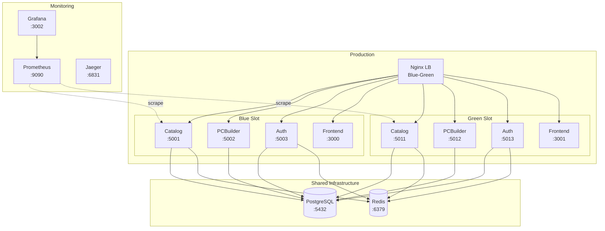

# Обзор инфраструктуры GoldPC

> **Раздел**: 07_Infra_DevOps
> **Версия**: 1.0 | **Последнее обновление**: 2026-05-24

---

## 🏗️ Архитектура инфраструктуры



---

## 🐳 Docker Compose

GoldPC использует **3 Docker Compose окружения**:

| Файл | Окружение | Сервисов | Volumes |
|---|---|---|---|
| `docker-compose.yml` | **Development** | 9 | postgres_data, redis_data, rabbitmq_data |
| `docker-compose.prod.yml` | **Production** | 18 (blue/green) | postgres_data, redis_data, nginx_logs, prometheus_data, grafana_data |
| `docker-compose.test.yml` | **Testing** | 7 (tmpfs) | Нет (in-memory) |

Подробнее: [[07_Infra_DevOps/Docker_окружение]]

---

## 🌐 Сеть

Все сервисы подключены к bridge-сети `goldpc-network`:

```yaml
networks:
  goldpc-network:
    driver: bridge
```

**Изоляция**: Каждый сервис имеет доступ только к необходимым зависимостям (healthcheck'и).

---

## 🔄 Blue-Green Deployment

Production использует стратегию **Blue-Green** для zero-downtime деплоя:

```
Nginx upstream переключается между:
  - Blue (порты 5001-5013)
  - Green (порты 5011-5023)
```

Подробнее: [[15_Deployments/Blue_Green_стратегия]]

---

## 🗄️ PostgreSQL

| Компонент | Параметр |
|---|---|
| Версия | 16-alpine |
| Primary порт | :5434 (dev) / :5432 (prod) |
| Replica порт | :5435 (dev) |
| WAL level | replica |
| Extensions | pg_stat_statements, postgres_fdw |

Подробнее: [[05_Database/Обзор_БД]]

---

## ⚡ Redis

| Компонент | Параметр |
|---|---|
| Версия | 7-alpine |
| Порт | :6379 |
| Персистентность | AOF (appendonly yes) |
| Max memory | 2GB (prod) |
| Eviction policy | allkeys-lru |

**Используется**:
- CatalogService: кэширование результатов запросов (TTL 15 мин)
- AuthService: хранение токенов сброса пароля

---

## 📨 RabbitMQ

| Компонент | Параметр |
|---|---|
| Версия | 3-management-alpine |
| Порт | :5672 (AMQP), :15672 (Management UI) |
| Управление | guest/guest |

**Используется**:
- MassTransit события между сервисами
- `OrderPlacedEvent` → WarrantyService
- `OrderPaidEvent` → CatalogService

---

## 📊 Мониторинг

### Prometheus (`:9090`)

Сбор метрик со всех сервисов через `/metrics` endpoint. Конфигурация в `prometheus/prometheus.yml`.

### Grafana (`:3002`)

Дашборды для визуализации метрик:
- CPU/Memory usage на сервис
- Request rate/latency
- Database query performance
- Error rates

### Jaeger (`:6831`)

Распределённая трассировка через OpenTelemetry:
- Отслеживание запросов между сервисами
- Определение узких мест
- Анализ latency

### Sentry

Отслеживание ошибок в реальном времени (backlog + frontend).

Подробнее: [[18_Monitoring/Обзор_мониторинга]]

---

## 🔒 Безопасность

### Security Headers (Nginx)

```nginx
add_header X-Frame-Options "SAMEORIGIN" always;
add_header X-Content-Type-Options "nosniff" always;
add_header X-XSS-Protection "1; mode=block" always;
add_header Referrer-Policy "strict-origin-when-cross-origin" always;
add_header Content-Security-Policy "default-src 'self'; ..." always;
```

### Rate Limiting (Nginx)

```nginx
limit_req_zone $binary_remote_addr zone=api:10m rate=50r/s;
limit_req zone=api burst=100 nodelay;
```

Подробнее: [[08_Security/Обзор_безопасности]]

---

## 📦 Прод-окружение

### Порты

| Сервис | Blue | Green |
|---|---|---|
| CatalogService | :5001 | :5011 |
| PCBuilderService | :5002 | :5012 |
| AuthService | :5003 | :5013 |
| Frontend | :3000 | :3001 |

### Профили Docker Compose

```bash
# Запуск Blue
docker compose -f docker-compose.prod.yml --profile blue up -d

# Запуск Green
docker compose -f docker-compose.prod.yml --profile green up -d

# Мониторинг
docker compose -f docker-compose.prod.yml --profile monitoring up -d
```

---

## 🔗 Связанные страницы

- [[07_Infra_DevOps/Docker_окружение]] — Docker Compose и Dockerfile
- [[07_Infra_DevOps/GitHub_Actions]] — CI/CD пайплайны
- [[15_Deployments/Обзор_деплоя]] — деплой
- [[18_Monitoring/Обзор_мониторинга]] — мониторинг
- [[08_Security/Обзор_безопасности]] — безопасность
